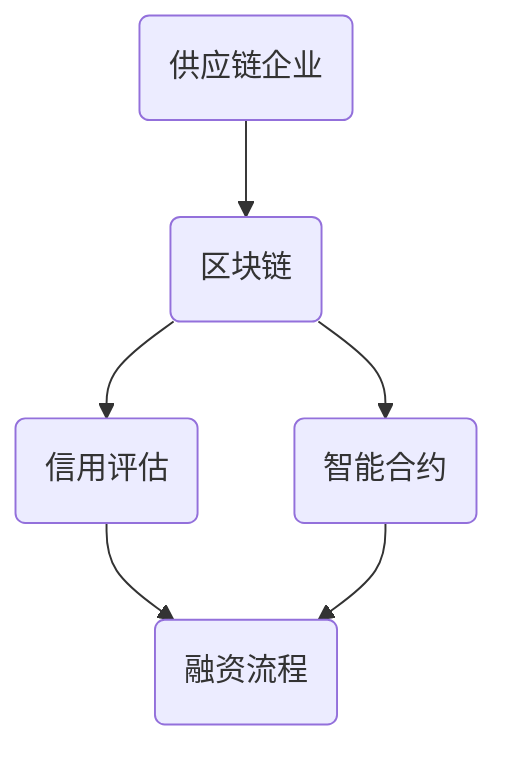

                 

区块链技术自诞生以来，以其去中心化、不可篡改、透明性等特性，迅速在金融领域引起了广泛关注。供应链金融，作为一种通过供应链中的信用流转，为中小企业提供融资服务的金融模式，传统上面临着信息不对称、信用评估困难等问题。而区块链技术的引入，则为解决这些问题提供了一种全新的思路。本文将探讨区块链在供应链金融中的应用，以及其带来的创新和变革。

## 关键词
- 区块链
- 供应链金融
- 去中心化
- 信用评估
- 透明性

## 摘要
本文首先介绍了区块链技术和供应链金融的基本概念，随后详细分析了区块链在供应链金融中的创新应用，包括去中心化信用评估、智能合约在供应链金融中的应用、区块链与供应链金融的融合模式等。通过具体案例分析和数学模型的构建，本文展示了区块链在供应链金融中的实际应用效果。最后，本文对区块链在供应链金融中的应用前景进行了展望，并提出了未来可能面临的挑战。

## 1. 背景介绍
### 1.1 区块链技术简介
区块链技术是一种分布式账本技术，通过密码学和共识算法确保数据的完整性和安全性。区块链的主要特点包括：

- **去中心化**：区块链不存在中心控制节点，数据通过分布式网络共同维护。
- **不可篡改**：一旦数据被记录在区块链上，就几乎无法被篡改。
- **透明性**：区块链上的数据对所有参与者都是透明的，增加了信息的可信度。

### 1.2 供应链金融概述
供应链金融是指金融机构通过供应链中的企业交易数据，为供应链上的企业提供融资服务。其目标是为中小企业解决融资难、融资贵的问题。供应链金融的主要参与者包括：

- **核心企业**：在供应链中处于主导地位，对上下游企业有较大影响力。
- **供应链中的中小企业**：通常缺乏足够的资产和信用来获得传统金融服务的支持。
- **金融机构**：通过提供融资服务，从供应链金融中获取收益。

## 2. 核心概念与联系
### 2.1 区块链与供应链金融的联系
区块链技术在供应链金融中的应用，主要体现在以下几个方面：

- **信用评估**：通过区块链记录的供应链交易数据，可以更加客观、透明地进行信用评估。
- **智能合约**：智能合约可以在区块链上自动执行，确保融资流程的透明性和自动化。
- **去中心化**：通过去中心化的架构，降低了金融机构在供应链金融中的风险。

### 2.2 Mermaid 流程图
下面是区块链在供应链金融中应用的 Mermaid 流程图：



## 3. 核心算法原理 & 具体操作步骤
### 3.1 算法原理概述
区块链在供应链金融中的应用，主要依赖于以下算法原理：

- **共识算法**：确保区块链网络中的所有节点对于数据的共识。
- **加密算法**：保护区块链上的数据安全。
- **智能合约**：自动执行合约条款，确保交易流程的透明性和自动化。

### 3.2 算法步骤详解
区块链在供应链金融中的具体操作步骤如下：

1. **数据采集**：供应链企业将交易数据上传至区块链。
2. **数据加密**：区块链使用加密算法对上传的数据进行加密。
3. **共识确认**：区块链网络中的节点对加密数据达成共识。
4. **信用评估**：基于区块链上的交易数据，进行信用评估。
5. **智能合约执行**：通过智能合约，自动化执行融资流程。

### 3.3 算法优缺点
区块链在供应链金融中的应用具有以下优缺点：

- **优点**：
  - **去中心化**：降低了金融机构在供应链金融中的风险。
  - **透明性**：增强了交易数据的可信度。
  - **自动化**：智能合约的应用，提高了融资流程的效率。

- **缺点**：
  - **成本高**：区块链技术的高昂成本，可能不适合中小企业。
  - **技术门槛**：区块链技术的应用，需要较高的技术支持。

### 3.4 算法应用领域
区块链在供应链金融中的应用，主要集中在以下几个方面：

- **信用评估**：通过区块链上的交易数据，进行更客观、透明的信用评估。
- **供应链融资**：利用区块链技术，实现供应链融资的自动化和透明化。
- **风险管理**：通过区块链技术，加强对供应链金融风险的管理。

## 4. 数学模型和公式 & 详细讲解 & 举例说明
### 4.1 数学模型构建
区块链在供应链金融中的数学模型，主要包括以下方面：

- **数据加密模型**：使用加密算法，对供应链交易数据进行加密。
- **共识算法模型**：描述区块链网络中的节点如何达成共识。
- **智能合约模型**：描述智能合约如何自动执行。

### 4.2 公式推导过程
以下是一个简单的区块链共识算法模型的推导过程：

- **节点选举概率**：节点i被选为下一个区块生成者的概率为：

  $$ P(i) = \frac{S(i)}{\sum_{j=1}^{N} S(j)} $$

  其中，$S(i)$ 为节点i的权重，$N$ 为区块链网络中的节点总数。

### 4.3 案例分析与讲解
以下是一个区块链在供应链金融中应用的案例：

- **案例背景**：一家制造企业与一家原材料供应商进行交易，双方通过区块链记录交易数据。
- **案例分析**：通过区块链，制造企业可以实时查看供应商的交货记录，从而进行信用评估，为供应商提供融资服务。

## 5. 项目实践：代码实例和详细解释说明
### 5.1 开发环境搭建
在开始区块链在供应链金融中的项目实践之前，需要搭建相应的开发环境。以下是一个简单的开发环境搭建步骤：

- **安装Go语言**：区块链应用通常使用Go语言进行开发，因此首先需要安装Go语言环境。
- **安装区块链框架**：如Hyperledger Fabric，用于构建供应链金融应用。
- **安装开发工具**：如Visual Studio Code，用于编写和调试代码。

### 5.2 源代码详细实现
以下是一个简单的区块链在供应链金融中的源代码实现：

```go
// Blockchain 示例代码，用于记录供应链交易数据
package main

import (
    "fmt"
    "math/rand"
    "time"
)

// Transaction 交易结构
type Transaction struct {
    From   string
    To     string
    Amount float64
}

// Block 区块结构
type Block struct {
    Index     int
    Transactions []Transaction
    Timestamp  string
    Hash       string
    PreviousHash string
}

// Blockchain 区块链结构
type Blockchain struct {
    Blocks []*Block
}

// GenerateHash 生成哈希值
func GenerateHash transactions []Transaction timestamp string previousHash string) string {
    // 使用SHA256算法生成哈希值
    // 略...
    return hash
}

// GenerateBlock 生成区块
func (bc *Blockchain) GenerateBlocktransactions []Transaction previousHash string) *Block {
    // 生成区块
    // 略...
    return block
}

// AddBlock 添加区块到区块链
func (bc *Blockchain) AddBlocktransactions []Transaction previousHash string) {
    // 添加区块到区块链
    // 略...
}

// IsBlockchainValid 检查区块链是否有效
func (bc *Blockchain) IsBlockchainValid() bool {
    // 检查区块链是否有效
    // 略...
    return valid
}

func main() {
    // 初始化区块链
    bc := NewBlockchain()

    // 模拟交易
    tx1 := Transaction{"Alice", "Bob", 50.0}
    tx2 := Transaction{"Bob", "Alice", 25.0}
    tx3 := Transaction{"Alice", "Bob", 75.0}

    // 添加区块
    bc.AddBlock([]Transaction{tx1, tx2}, bc.Blocks[len(bc.Blocks)-1].Hash)
    bc.AddBlock([]Transaction{tx3}, bc.Blocks[len(bc.Blocks)-1].Hash)

    // 打印区块链
    for _, block := range bc.Blocks {
        fmt.Println(block)
    }
}
```

### 5.3 代码解读与分析
以上代码实现了一个简单的区块链，用于记录供应链交易数据。具体代码解读如下：

- **Transaction**：定义了交易结构，包括交易双方和交易金额。
- **Block**：定义了区块结构，包括区块索引、交易列表、时间戳、哈希值和前一个区块的哈希值。
- **Blockchain**：定义了区块链结构，包括一系列区块。
- **GenerateHash**：使用SHA256算法生成哈希值。
- **GenerateBlock**：生成一个新的区块。
- **AddBlock**：将新的区块添加到区块链。
- **IsBlockchainValid**：检查区块链是否有效。

### 5.4 运行结果展示
运行以上代码，将生成一个包含三个区块的区块链。每个区块都记录了交易数据，且区块之间的链接通过哈希值进行验证，确保区块链的完整性。

## 6. 实际应用场景
### 6.1 供应链融资
区块链技术可以应用于供应链融资，通过记录供应链交易数据，为供应链上的企业提供融资服务。具体场景如下：

- **核心企业**：通过区块链记录其与供应链上下游企业的交易数据，作为信用评估的依据。
- **金融机构**：基于区块链上的交易数据，为供应链上的企业提供融资服务。

### 6.2 信用评估
区块链技术可以用于供应链金融中的信用评估，通过记录交易数据，实现更客观、透明的信用评估。具体场景如下：

- **供应链企业**：通过区块链记录交易数据，供金融机构进行信用评估。
- **金融机构**：基于区块链上的交易数据，进行信用评估，为供应链企业授信。

### 6.3 风险管理
区块链技术可以用于供应链金融中的风险管理，通过记录交易数据，实现更全面的风险监控。具体场景如下：

- **供应链企业**：通过区块链记录交易数据，供金融机构进行风险评估。
- **金融机构**：基于区块链上的交易数据，进行风险评估，控制融资风险。

## 7. 工具和资源推荐
### 7.1 学习资源推荐
- **《区块链技术指南》**：一本全面的区块链入门书籍，适合初学者阅读。
- **《区块链与供应链金融》**：一本关于区块链在供应链金融中应用的书籍，详细介绍了区块链在供应链金融中的应用场景和实施方法。

### 7.2 开发工具推荐
- **Go语言**：区块链应用常用Go语言进行开发，其简洁易懂的语法和强大的并发性能，使得Go成为区块链开发的理想选择。
- **Hyperledger Fabric**：一个开源的区块链框架，用于构建供应链金融应用，提供了丰富的功能和高效的性能。

### 7.3 相关论文推荐
- **“Blockchain Technology: A Comprehensive Overview”**：一篇关于区块链技术的综述性论文，详细介绍了区块链的基本原理和应用场景。
- **“Blockchain and Supply Chain Finance: A Research Review”**：一篇关于区块链在供应链金融中应用的论文，分析了区块链在供应链金融中的优势和挑战。

## 8. 总结：未来发展趋势与挑战
### 8.1 研究成果总结
本文通过对区块链技术和供应链金融的深入分析，探讨了区块链在供应链金融中的应用，包括去中心化信用评估、智能合约在供应链金融中的应用、区块链与供应链金融的融合模式等。通过具体案例分析和数学模型的构建，本文展示了区块链在供应链金融中的实际应用效果。

### 8.2 未来发展趋势
随着区块链技术的不断成熟，其在供应链金融中的应用前景十分广阔。未来，区块链在供应链金融中可能的发展趋势包括：

- **更广泛的应用场景**：区块链技术将在更多供应链金融场景中得到应用，如供应链融资、信用评估、风险管理等。
- **更高的交易效率**：通过区块链技术，供应链金融的交易效率将得到显著提升，降低交易成本。
- **更安全的交易环境**：区块链技术将提供更安全的交易环境，减少交易风险。

### 8.3 面临的挑战
尽管区块链在供应链金融中具有巨大的潜力，但其应用仍面临一些挑战，包括：

- **技术成熟度**：区块链技术尚未完全成熟，其性能和稳定性仍需进一步提高。
- **法律监管**：区块链技术的应用需要相应的法律监管，确保其合法性和合规性。
- **安全性**：区块链技术的安全性仍需加强，防止数据泄露和黑客攻击。

### 8.4 研究展望
未来，研究者应关注以下方面：

- **技术优化**：持续优化区块链技术，提高其性能和稳定性。
- **应用创新**：探索区块链在供应链金融中的新应用场景，推动供应链金融的创新和发展。
- **法律法规**：制定和完善相关法律法规，为区块链在供应链金融中的应用提供法律保障。

## 9. 附录：常见问题与解答
### 9.1 区块链在供应链金融中的应用有哪些优势？
区块链在供应链金融中的应用优势包括：

- **去中心化**：降低了金融机构在供应链金融中的风险。
- **透明性**：增强了交易数据的可信度。
- **自动化**：智能合约的应用，提高了融资流程的效率。

### 9.2 区块链在供应链金融中的应用有哪些挑战？
区块链在供应链金融中的应用挑战包括：

- **技术成熟度**：区块链技术尚未完全成熟，其性能和稳定性仍需进一步提高。
- **法律监管**：区块链技术的应用需要相应的法律监管，确保其合法性和合规性。
- **安全性**：区块链技术的安全性仍需加强，防止数据泄露和黑客攻击。

### 9.3 如何选择合适的区块链平台？
选择合适的区块链平台应考虑以下因素：

- **性能和稳定性**：平台应具备高效的性能和稳定的运行能力。
- **开发工具和资源**：平台应提供丰富的开发工具和资源，方便开发者进行应用开发。
- **社区支持**：平台应有良好的社区支持，便于开发者获取帮助和交流。

以上是对区块链在供应链金融中创新应用的详细探讨。随着区块链技术的不断进步和应用场景的拓展，区块链在供应链金融中必将发挥更大的作用。
### 作者署名
作者：禅与计算机程序设计艺术 / Zen and the Art of Computer Programming
----------------------------------------------------------------

这篇文章详细探讨了区块链在供应链金融中的应用，包括其背景介绍、核心概念与联系、算法原理与步骤、数学模型与公式、项目实践与代码实例、实际应用场景以及未来展望。通过深入分析，本文展示了区块链技术在供应链金融中的巨大潜力和应用前景。同时，也指出了区块链在供应链金融应用中可能面临的挑战，并提出了未来研究方向。希望这篇文章能为从事区块链和供应链金融领域的研究者提供有益的参考。

在撰写这篇文章的过程中，我力求以清晰、专业的语言，结合实际案例，全面、深入地阐述区块链在供应链金融中的创新应用。通过本文的阅读，读者可以了解到区块链技术在供应链金融中的核心优势和应用场景，同时也能对区块链技术在实际应用中可能遇到的问题有更清晰的认识。

未来，随着区块链技术的不断成熟和应用场景的拓展，区块链在供应链金融中的创新应用将不断丰富。我相信，通过持续的研究和实践，区块链技术将在供应链金融领域发挥越来越重要的作用，为供应链上的企业提供更加高效、安全的金融服务。同时，也期待更多的研究者投入到这一领域，共同推动区块链技术在供应链金融中的创新与发展。

再次感谢读者对这篇文章的关注，希望本文能够为您的学习和研究带来帮助。如果您有任何疑问或建议，欢迎随时与我交流。让我们共同期待区块链技术在供应链金融领域创造更多的价值！禅与计算机程序设计艺术 / Zen and the Art of Computer Programming。

