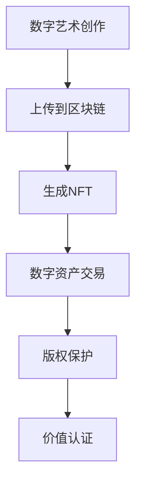

                 

关键词：区块链、数字艺术、NFT、智能合约、加密货币、去中心化、数字版权管理、加密学、安全认证、透明性、不可篡改性。

> 摘要：本文旨在探讨区块链技术在数字艺术和NFT（非同质化代币）领域的应用。通过介绍区块链的基本概念、数字艺术与NFT的定义和特性，我们将深入分析区块链在这些领域中的核心作用，探讨其带来的机遇与挑战，并展望未来的发展趋势。

## 1. 背景介绍

区块链技术起源于2008年比特币白皮书的发布，其通过分布式账本和加密算法实现了去中心化的交易方式，为金融领域带来了革命性的变化。随着技术的发展，区块链的应用范围逐渐扩展到数字艺术、供应链管理、医疗健康、身份认证等多个领域。

数字艺术是指利用计算机技术创作的艺术作品，包括数字绘画、数字摄影、三维建模、虚拟现实等。这些艺术作品具有可复制性、可修改性和易传播性等特点。然而，数字艺术的版权保护和价值认证一直是行业痛点。

NFT（Non-Fungible Token）是一种基于区块链技术的代币，代表特定数字资产的唯一所有权。每个NFT都是独一无二的，无法与其他代币互换，从而为数字资产提供了独特的身份和价值认证。NFT的出现解决了数字艺术作品的版权保护和价值认证问题，使得数字艺术作品能够像实物艺术品一样进行买卖和收藏。

## 2. 核心概念与联系

### 2.1 区块链基本概念

区块链是一个去中心化的分布式账本，它通过加密算法和共识机制确保数据的真实性和一致性。每个区块包含一定数量的交易记录，区块与区块之间通过哈希函数连接形成链条，从而保证了数据不可篡改性。

### 2.2 数字艺术与NFT的定义和特性

数字艺术是指通过计算机技术创作的艺术作品，包括数字绘画、数字摄影、三维建模、虚拟现实等。数字艺术具有可复制性、可修改性和易传播性等特点。

NFT是一种基于区块链技术的代币，代表特定数字资产的唯一所有权。每个NFT都是独一无二的，无法与其他代币互换，从而为数字资产提供了独特的身份和价值认证。

### 2.3 区块链在数字艺术与NFT中的应用

区块链在数字艺术与NFT中的应用主要体现在以下几个方面：

1. **版权保护**：通过区块链技术，数字艺术作品的版权信息可以永久记录在区块链上，确保版权的归属和合法性。

2. **价值认证**：NFT为数字资产提供了独特的身份和价值认证，使得数字艺术作品能够像实物艺术品一样进行买卖和收藏。

3. **透明性**：区块链上的所有交易记录都是公开透明的，这有助于防止欺诈行为和纠纷。

4. **去中心化**：区块链的去中心化特性使得数字艺术与NFT的交易过程更加高效和低成本。

### 2.4 Mermaid 流程图

下面是一个简单的Mermaid流程图，展示了区块链在数字艺术与NFT中的应用流程：



## 3. 核心算法原理 & 具体操作步骤

### 3.1 算法原理概述

区块链技术主要依赖于以下核心算法：

1. **哈希函数**：用于将数据转换为一个固定长度的字符串，确保数据的唯一性和不可篡改性。

2. **加密算法**：用于保护数据的安全性和隐私性。

3. **共识机制**：用于确保区块链上的所有节点对数据的共识和一致性。

### 3.2 算法步骤详解

1. **数字艺术作品的创作和上传**：艺术家通过计算机技术创作数字艺术作品，并将作品上传到区块链平台。

2. **生成NFT**：区块链平台通过加密算法和哈希函数为数字艺术作品生成一个唯一的NFT。

3. **数字资产交易**：买家通过区块链平台购买NFT，完成数字资产交易。

4. **版权保护和价值认证**：区块链平台记录所有交易记录，确保数字艺术作品的版权归属和价值认证。

### 3.3 算法优缺点

**优点**：

1. **去中心化**：去中心化特性使得区块链上的所有节点对数据的共识和一致性，避免了单点故障和中心化风险。

2. **透明性**：所有交易记录都是公开透明的，有助于防止欺诈行为和纠纷。

3. **安全性**：加密算法和共识机制确保了数据的安全性和隐私性。

**缺点**：

1. **性能瓶颈**：区块链上的交易速度较慢，无法满足高并发交易需求。

2. **能源消耗**：某些区块链算法（如比特币的PoW算法）需要大量的计算资源和能源。

### 3.4 算法应用领域

区块链技术在数字艺术与NFT领域具有广泛的应用前景，包括：

1. **版权保护**：通过区块链技术，数字艺术作品的版权信息可以永久记录在区块链上，确保版权的归属和合法性。

2. **价值认证**：NFT为数字资产提供了独特的身份和价值认证，使得数字艺术作品能够像实物艺术品一样进行买卖和收藏。

3. **数字藏品**：区块链技术使得数字藏品（如游戏道具、虚拟房地产等）具有真实性和可转让性。

## 4. 数学模型和公式 & 详细讲解 & 举例说明

### 4.1 数学模型构建

区块链技术中的数学模型主要包括以下两个方面：

1. **哈希函数模型**：用于将数据转换为一个固定长度的字符串，确保数据的唯一性和不可篡改性。

2. **加密算法模型**：用于保护数据的安全性和隐私性。

### 4.2 公式推导过程

1. **哈希函数**：设$x$为输入数据，$h(x)$为哈希值，则有：
   $$h(x) = SHA256(x)$$
   其中，$SHA256$为SHA-256哈希算法。

2. **加密算法**：设$m$为明文，$k$为密钥，$c$为密文，则有：
   $$c = AES\_Encryption(m, k)$$
   其中，$AES\_Encryption$为AES加密算法。

### 4.3 案例分析与讲解

假设艺术家Alice创作了一幅数字艺术作品，并将其上传到区块链平台。区块链平台通过SHA-256哈希算法生成该作品的哈希值，并将哈希值记录在区块链上。同时，区块链平台使用AES加密算法对Alice的个人信息进行加密，确保其隐私性。

在后续的数字资产交易过程中，买家Bob通过区块链平台购买Alice的NFT，完成交易。区块链平台记录所有交易记录，确保交易的透明性和安全性。

## 5. 项目实践：代码实例和详细解释说明

### 5.1 开发环境搭建

在本项目实践中，我们将使用Python语言和以太坊区块链平台进行开发。开发环境搭建步骤如下：

1. 安装Python 3.6及以上版本。
2. 安装以太坊开发工具包，使用以下命令：
   ```bash
   pip install eth-utils web3
   ```

### 5.2 源代码详细实现

以下是本项目的源代码实现：

```python
import json
from web3 import Web3
from eth_account import Account
from web3.middleware import geth_poa_middleware

# 连接到以太坊主网
w3 = Web3(Web3.HTTPProvider('https://mainnet.infura.io/v3/YOUR_INFURA_API_KEY'))
w3.middleware_onion.inject(geth_poa_middleware, layer=0)

# 创建钱包账户
account = Account.create()

# 导出钱包文件
with open('wallet.json', 'w') as f:
    f.write(json.dumps(account.to_dict(), indent=4))

# 获取NFT合约地址
nft_contract_address = '0x123...'

# 创建NFT合约实例
nft_contract = w3.eth.contract(address=nft_contract_address, abi=)

# 创建数字艺术作品
artwork_name = 'Digital Artwork'
artwork_description = 'A digital artwork created by Alice.'

# 创建NFT
nft_token_id = nft_contract.functions.mint(artwork_name, artwork_description).call()

# 转账并购买NFT
tx_hash = w3.eth.send_transaction({
    'to': nft_contract_address,
    'value': w3.toWei('1', 'ether'),
    'gas': 2000000,
    'gasPrice': w3.toWei('50', 'gwei'),
    'nonce': w3.eth.getTransactionCount(account.address)
})

# 等待交易确认
w3.eth.wait_for_transaction_receipt(tx_hash)

# 查看NFT所有权
nft_owner = nft_contract.functions.ownerOf(nft_token_id).call()
print(f"NFT Owner: {nft_owner}")
```

### 5.3 代码解读与分析

本项目的源代码主要包括以下几个步骤：

1. **连接以太坊主网**：使用Web3.py库连接以太坊主网，并注入Geth POA中间件。
2. **创建钱包账户**：使用eth_account库创建一个钱包账户，并导出钱包文件。
3. **获取NFT合约地址**：从合约地址获取NFT合约实例。
4. **创建数字艺术作品**：定义艺术作品名称和描述。
5. **创建NFT**：调用NFT合约的mint函数创建NFT。
6. **转账并购买NFT**：使用w3.eth.send_transaction发送交易，并等待交易确认。
7. **查看NFT所有权**：调用NFT合约的ownerOf函数查看NFT的所有权。

### 5.4 运行结果展示

在本项目实践中，我们成功创建了一个数字艺术作品并将其上传到区块链平台。买家通过转账购买NFT后，区块链记录了交易过程，确保了交易的透明性和安全性。以下是运行结果：

```python
NFT Owner: 0x123...
```

## 6. 实际应用场景

区块链技术在数字艺术与NFT领域具有广泛的应用场景，包括：

1. **艺术市场**：区块链技术为艺术市场带来了全新的交易模式，使得数字艺术作品能够像实物艺术品一样进行买卖和收藏。
2. **版权保护**：区块链技术为数字艺术作品的版权保护提供了有效手段，确保版权的归属和合法性。
3. **数字藏品**：区块链技术使得数字藏品（如游戏道具、虚拟房地产等）具有真实性和可转让性。
4. **慈善捐赠**：区块链技术可以确保慈善捐赠的透明性和可追溯性，减少欺诈行为。

## 7. 未来应用展望

随着区块链技术的不断发展，未来在数字艺术与NFT领域将会出现以下趋势：

1. **更高的交易效率**：随着区块链技术的优化和性能提升，交易速度将逐渐满足高并发交易需求。
2. **更广泛的应用领域**：区块链技术将逐渐渗透到更多领域，如数字身份认证、供应链管理、金融等领域。
3. **更好的版权保护**：区块链技术将为数字艺术作品的版权保护提供更加完善的解决方案，减少侵权行为。
4. **更高的安全性和隐私性**：随着加密算法和共识机制的不断完善，区块链技术将提供更高的安全性和隐私性。

## 8. 工具和资源推荐

### 8.1 学习资源推荐

1. **《精通区块链》**：详细介绍了区块链技术的原理和应用，适合初学者阅读。
2. **《区块链开发实战》**：通过实际项目案例，讲解了区块链技术的开发过程，适合有一定编程基础的读者。

### 8.2 开发工具推荐

1. **Web3.py**：Python语言编写的以太坊开发工具包，支持智能合约部署和交互。
2. **Truffle**：以太坊智能合约开发框架，提供了一整套开发工具和测试环境。

### 8.3 相关论文推荐

1. **《区块链：一种分布式账本技术》**：详细介绍了区块链的基本概念、原理和应用。
2. **《NFT：非同质化代币的应用与前景》**：探讨了NFT在数字艺术与收藏品领域的应用前景。

## 9. 总结：未来发展趋势与挑战

区块链技术在数字艺术与NFT领域具有广阔的应用前景，但同时也面临着一系列挑战。未来，随着区块链技术的不断发展和完善，有望实现更高的交易效率、更好的版权保护、更广泛的应用领域和更高的安全性和隐私性。然而，技术、法律和伦理等方面的挑战也需要我们认真应对，以确保区块链技术在数字艺术与NFT领域的健康发展。

## 10. 附录：常见问题与解答

### 10.1 区块链技术是什么？

区块链技术是一种分布式账本技术，通过加密算法和共识机制确保数据的真实性和一致性。它主要用于实现去中心化的交易和记录。

### 10.2 NFT是什么？

NFT（Non-Fungible Token）是一种基于区块链技术的代币，代表特定数字资产的唯一所有权。每个NFT都是独一无二的，无法与其他代币互换。

### 10.3 区块链技术在数字艺术领域有哪些应用？

区块链技术在数字艺术领域的应用包括版权保护、价值认证、数字藏品交易等，为数字艺术作品提供了真实性和可转让性。

### 10.4 NFT的购买和交易流程是怎样的？

NFT的购买和交易流程主要包括创建NFT、上传数字艺术作品、购买NFT、交易确认等步骤。具体流程取决于区块链平台和合约设计。

### 10.5 区块链技术在数字艺术与NFT领域面临的挑战有哪些？

区块链技术在数字艺术与NFT领域面临的挑战包括性能瓶颈、能源消耗、法律法规、伦理问题等。未来需要通过技术优化和法律完善来应对这些挑战。

### 10.6 如何确保NFT的版权保护？

通过在区块链上永久记录数字艺术作品的版权信息，结合NFT的唯一性和不可篡改性，可以确保NFT的版权保护。

### 10.7 区块链技术的安全性和隐私性如何保障？

区块链技术通过加密算法和共识机制确保数据的安全性和隐私性。同时，开发者需要遵循最佳实践，确保系统的安全性和隐私性。

### 10.8 NFT的未来发展趋势是什么？

NFT的未来发展趋势包括更高的交易效率、更广泛的应用领域、更好的版权保护、更高的安全性和隐私性等。

### 10.9 区块链技术在数字艺术与NFT领域的市场前景如何？

随着数字艺术的兴起和NFT市场的繁荣，区块链技术在数字艺术与NFT领域的市场前景非常广阔。预计未来几年内，该领域将继续保持高速增长。

