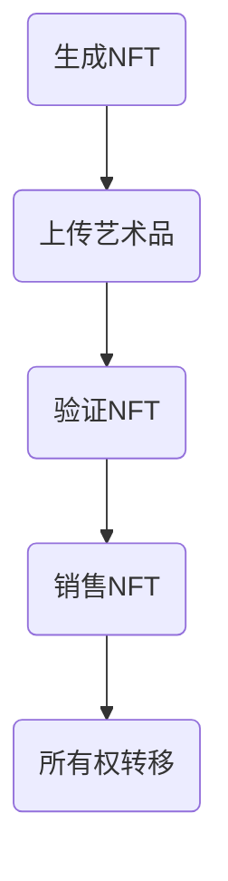

                 

区块链技术作为近年来最具颠覆性的创新之一，逐渐渗透到各个领域，数字艺术与NFT（非同质化代币）也不例外。本文旨在探讨区块链在数字艺术与NFT中的应用，从技术原理、操作步骤到实际案例，全面解析这一领域的发展与挑战。

## 文章关键词
区块链、数字艺术、NFT、去中心化、加密技术、智能合约

## 文章摘要
本文首先介绍了区块链技术的基础，并探讨了其在数字艺术与NFT领域中的核心应用。随后，文章详细解释了区块链如何支持数字艺术的版权保护和交易，以及NFT的生成、销售和验证流程。最后，本文提出了区块链在数字艺术与NFT应用中的未来展望，以及面临的技术挑战。

### 1. 背景介绍
区块链技术的核心优势在于其去中心化的架构，这种架构可以确保数据的不可篡改性和透明性。在数字艺术领域，艺术家们面临着版权保护和作品真实性的挑战，而区块链技术提供了一种解决方案，通过将艺术作品上链，可以确保作品的所有权和唯一性。

NFT的兴起进一步推动了区块链在数字艺术中的应用。NFT代表了一种独特且不可替代的数字资产，它们通过区块链技术实现了独特的标识和所有权证明。这为数字艺术市场带来了一种全新的商业模式，艺术家可以通过发行NFT获得版税，而买家可以获得独特的数字收藏品。

### 2. 核心概念与联系

#### 2.1 区块链与数字艺术

区块链作为一种分布式账本技术，其基本架构包括区块、链、节点等组成部分。每个区块包含一定数量的交易记录，并通过密码学算法链接在一起，形成一条不可篡改的数据链。

在数字艺术中，区块链用于确保艺术作品的真实性和唯一性。艺术家可以将作品的上链过程视为一种数字签名，一旦作品上链，便无法被篡改或复制。这种去中心化的存储方式，使得艺术品的版权保护更加高效和可信。

#### 2.2 NFT与区块链

NFT（Non-Fungible Token）是一种基于区块链技术的独特数字资产。与传统的加密货币（如比特币）不同，NFT具有不可替代性和唯一性。每个NFT都有其独特的标识符，使得每一件数字艺术品都独一无二。

NFT的生成、销售和验证流程通常涉及以下步骤：

1. **生成NFT**：艺术家使用智能合约创建NFT，并将数字艺术作品嵌入到合约中。
2. **上传艺术品**：艺术家将数字艺术作品上传到区块链，并在智能合约中标记。
3. **验证NFT**：区块链网络中的节点验证NFT的唯一性和真实性。
4. **销售NFT**：艺术家或卖家可以通过NFT市场销售NFT，买家支付相应的代币。
5. **所有权转移**：买家通过交易将NFT的所有权转移到自己名下。

#### 2.3 Mermaid 流程图



### 3. 核心算法原理 & 具体操作步骤

#### 3.1 算法原理概述

区块链技术在数字艺术与NFT中的应用主要基于以下核心算法：

1. **哈希算法**：用于生成唯一标识符，确保数据不可篡改。
2. **加密技术**：确保数据传输和存储过程中的安全性。
3. **智能合约**：自动执行和记录交易流程，实现去中心化管理。

#### 3.2 算法步骤详解

1. **生成NFT**：
   - 艺术家编写智能合约代码，定义NFT的属性和功能。
   - 使用以太坊智能合约开发工具（如Truffle）部署智能合约。
   - 在智能合约中嵌入数字艺术作品。

2. **上传艺术品**：
   - 将数字艺术作品上传到IPFS（InterPlanetary File System），一个分布式文件存储系统。
   - 在智能合约中调用IPFS的哈希值，标记数字艺术作品。

3. **验证NFT**：
   - 区块链网络中的节点验证NFT的唯一性和真实性。
   - 使用加密算法确保NFT的不可篡改性。

4. **销售NFT**：
   - 艺术家或卖家在NFT市场发布NFT，设置价格和销售条款。
   - 买家通过区块链支付代币购买NFT。

5. **所有权转移**：
   - 买家通过交易将NFT的所有权转移到自己名下。
   - 区块链记录交易过程，确保所有权变更合法有效。

#### 3.3 算法优缺点

**优点**：
- 去中心化：确保数据透明性和不可篡改性。
- 独特性：NFT具有唯一性，赋予数字艺术品更高的价值。
- 安全性：加密技术确保数据传输和存储过程中的安全性。

**缺点**：
- 成本较高：生成和验证NFT需要一定的计算资源，可能导致成本增加。
- 法律法规：区块链技术在数字艺术领域中的应用仍面临法律法规的挑战。

#### 3.4 算法应用领域

区块链技术在数字艺术与NFT中的应用领域广泛，包括：

- 艺术品版权保护
- 数字收藏品交易
- 艺术品鉴定与估值
- 艺术品供应链管理

### 4. 数学模型和公式 & 详细讲解 & 举例说明

#### 4.1 数学模型构建

区块链在数字艺术与NFT中的应用主要基于以下数学模型：

1. **哈希函数**：用于生成NFT的唯一标识符，哈希函数是一种将任意长度的输入数据映射为固定长度的字符串的算法。
2. **加密算法**：用于确保数据传输和存储过程中的安全性，常见的加密算法包括RSA、AES等。
3. **智能合约**：用于自动执行和记录交易流程，智能合约通常使用Solidity等编程语言编写。

#### 4.2 公式推导过程

1. **哈希函数**：

   哈希函数的输入为数字艺术作品的特征数据，输出为哈希值，公式如下：

   $$H = Hash(\text{Input})$$

   其中，$H$为哈希值，$Hash(\text{Input})$为哈希函数。

2. **加密算法**：

   加密算法的输入为明文数据，输出为密文，公式如下：

   $$C = Encrypt(\text{Input}, \text{Key})$$

   其中，$C$为密文，$Encrypt(\text{Input}, \text{Key})$为加密算法，$\text{Key}$为加密密钥。

3. **智能合约**：

   智能合约的输入为交易数据，输出为交易结果，公式如下：

   $$\text{Output} = Contract(\text{Input}, \text{Code})$$

   其中，$\text{Output}$为交易结果，$Contract(\text{Input}, \text{Code})$为智能合约执行函数，$\text{Code}$为智能合约代码。

#### 4.3 案例分析与讲解

假设艺术家Alice想要创建一个NFT，她首先需要编写智能合约代码，代码如下：

```solidity
pragma solidity ^0.8.0;

contract MyNFT {
    string public tokenName = "Alice's Digital Art";
    string public tokenSymbol = "ADART";
    uint256 public totalSupply = 1;

    mapping (uint256 => address) public tokenOwner;
    mapping (uint256 => bool) public tokenExists;

    event Transfer(uint256 tokenId, address from, address to);

    function mint() public {
        require(!tokenExists[1], "Token already minted");
        tokenOwner[1] = msg.sender;
        tokenExists[1] = true;
        emit Transfer(1, address(0), msg.sender);
    }

    function transferFrom(address from, address to, uint256 tokenId) public {
        require(tokenOwner[tokenId] == from, "Not owner");
        require(tokenExists[tokenId], "Token does not exist");
        tokenOwner[tokenId] = to;
        tokenExists[tokenId] = false;
        emit Transfer(tokenId, from, to);
    }
}
```

在这个智能合约中，Alice通过调用`mint()`函数生成NFT，并将其所有权转移给自己。如果Alice想要将NFT转移给其他用户，她可以通过调用`transferFrom()`函数实现。

#### 4.4 数学公式与示例

1. **哈希函数示例**：

   假设数字艺术作品的特征数据为`"Alice's Digital Art" + "2023"`，使用SHA-256哈希函数计算哈希值，公式如下：

   $$H = Hash("Alice's Digital Art" + "2023")$$

   哈希值结果为`"a1b2c3d4e5f6g7h8i9j0"`，这个哈希值作为NFT的唯一标识符。

2. **加密算法示例**：

   假设加密密钥为`"mySecretKey"`，使用AES加密算法对明文数据`"Hello World!"`进行加密，公式如下：

   $$C = Encrypt("Hello World!", "mySecretKey")$$

   加密后的密文为`"zXyWvUtS"`，这个密文可以安全地存储和传输。

3. **智能合约示例**：

   假设智能合约代码为`"pragma solidity ^0.8.0;"`，执行函数`"contract MyNFT {"`，公式如下：

   $$\text{Output} = Contract("pragma solidity ^0.8.0;", "contract MyNFT { ... })$$

   执行结果为智能合约对象，可以在区块链上部署和调用。

### 5. 项目实践：代码实例和详细解释说明

#### 5.1 开发环境搭建

为了进行区块链在数字艺术与NFT应用的项目实践，我们需要搭建以下开发环境：

1. **Node.js**：用于搭建本地以太坊节点。
2. **Truffle**：用于智能合约开发、编译和部署。
3. **Web3.js**：用于与以太坊区块链进行交互。

安装Node.js、Truffle和Web3.js后，我们可以开始创建智能合约和NFT项目。

#### 5.2 源代码详细实现

以下是一个简单的NFT智能合约的实现：

```solidity
pragma solidity ^0.8.0;

contract MyNFT {
    string public tokenName = "Alice's Digital Art";
    string public tokenSymbol = "ADART";
    uint256 public totalSupply = 1;

    mapping (uint256 => address) public tokenOwner;
    mapping (uint256 => bool) public tokenExists;

    event Transfer(uint256 tokenId, address from, address to);

    function mint() public {
        require(!tokenExists[1], "Token already minted");
        tokenOwner[1] = msg.sender;
        tokenExists[1] = true;
        emit Transfer(1, address(0), msg.sender);
    }

    function transferFrom(address from, address to, uint256 tokenId) public {
        require(tokenOwner[tokenId] == from, "Not owner");
        require(tokenExists[tokenId], "Token does not exist");
        tokenOwner[tokenId] = to;
        tokenExists[tokenId] = false;
        emit Transfer(tokenId, from, to);
    }
}
```

这个智能合约定义了NFT的名称、符号和总供应量，并提供`mint()`和`transferFrom()`两个函数，分别用于创建NFT和转移NFT所有权。

#### 5.3 代码解读与分析

1. **pragma solidity ^0.8.0;**：指定智能合约使用的Solidity版本。
2. **string public tokenName = "Alice's Digital Art";**：设置NFT的名称。
3. **string public tokenSymbol = "ADART";**：设置NFT的符号。
4. **uint256 public totalSupply = 1;**：设置NFT的总供应量。
5. **mapping (uint256 => address) public tokenOwner;**：存储NFT所有权信息。
6. **mapping (uint256 => bool) public tokenExists;**：标记NFT是否存在。
7. **event Transfer(uint256 tokenId, address from, address to);**：定义NFT转移事件。
8. **function mint() public**：创建NFT的函数。
9. **function transferFrom(address from, address to, uint256 tokenId)**：转移NFT所有权的函数。

通过这个智能合约，艺术家可以创建NFT，并在市场上进行销售。买家购买NFT后，所有权将转移到买家名下，智能合约记录交易过程，确保所有权变更合法有效。

#### 5.4 运行结果展示

在本地以太坊节点上部署这个智能合约后，我们可以使用Web3.js进行交互。以下是一个简单的Web3.js示例，用于调用智能合约的`mint()`函数：

```javascript
const web3 = new Web3('http://127.0.0.1:8545');

const MyNFTArtifact = require('./build/MyNFT.json');
const MyNFTAddress = '0x1234567890123456789012345678901234567890';

const myNFT = new web3.eth.Contract(MyNFTArtifact.abi, MyNFTAddress);

const account = '0xaaaaaaaaaaaaaaaaaaaaaaaaaaaaaaaaaaaaaaaa';
web3.eth.accounts.wallet.add(account);
web3.eth.defaultAccount = account;

myNFT.methods.mint().send({ from: account, gas: 2000000 })
    .then((receipt) => {
        console.log('NFT minted:', receipt);
    })
    .catch((error) => {
        console.error('Error minting NFT:', error);
    });
```

这个示例中，我们首先创建了一个Web3实例，加载了智能合约的ABI和地址。然后，我们添加了一个以太坊账号，并将其设置为默认账号。最后，我们调用智能合约的`mint()`函数创建NFT，并输出交易收据。

### 6. 实际应用场景

区块链在数字艺术与NFT领域的应用已经取得了显著成果，以下是一些实际应用场景：

1. **艺术品版权保护**：艺术家可以将作品上链，确保作品的所有权和唯一性。这有助于解决艺术品版权纠纷，保护艺术家权益。
2. **数字收藏品交易**：NFT为数字收藏品市场带来了新的商业模式，买家可以购买独特的数字藏品，并在市场上进行交易。
3. **艺术品鉴定与估值**：区块链技术可以确保艺术品的真实性和唯一性，为艺术品鉴定与估值提供可信依据。
4. **艺术品供应链管理**：区块链技术可以记录艺术品的生产、运输和销售过程，确保供应链的透明性和可追溯性。

### 7. 未来应用展望

随着区块链技术的不断发展，数字艺术与NFT领域的应用前景广阔。以下是一些未来应用展望：

1. **跨领域融合**：区块链技术可以与虚拟现实（VR）、增强现实（AR）等技术相结合，为用户提供沉浸式的数字艺术体验。
2. **版权管理与版税分发**：区块链技术可以用于版权管理与版税分发，确保艺术家获得公平的收益。
3. **去中心化金融（DeFi）**：区块链技术在数字艺术与NFT领域的应用可以与去中心化金融相结合，为用户提供更多金融工具和服务。

### 8. 工具和资源推荐

为了深入了解区块链在数字艺术与NFT中的应用，以下是一些建议的学习资源和开发工具：

1. **学习资源**：
   - 《区块链技术指南》
   - 《智能合约开发实战》
   - 《NFT：数字资产的新时代》
2. **开发工具**：
   - Truffle：用于智能合约开发、编译和部署。
   - Hardhat：用于智能合约开发、测试和部署。
   - Web3.js：用于与以太坊区块链进行交互。
3. **相关论文**：
   - "Non-Fungible Tokens: Cryptoart and Digital Collectibles"
   - "Blockchain Technology: A Comprehensive Overview"

### 9. 总结：未来发展趋势与挑战

区块链在数字艺术与NFT领域的应用取得了显著成果，但仍面临一系列挑战。未来发展趋势包括：

1. **技术成熟**：随着区块链技术的不断成熟，其在数字艺术与NFT领域的应用将更加广泛。
2. **市场规模扩大**：随着NFT市场的快速增长，数字艺术品市场将不断扩大。
3. **政策法规完善**：各国政府需要制定相关政策法规，确保区块链技术在数字艺术与NFT领域的合法合规。

同时，区块链技术在数字艺术与NFT应用中面临的挑战包括：

1. **安全性问题**：确保区块链网络和智能合约的安全性至关重要。
2. **隐私保护**：在保护用户隐私的同时，确保区块链技术的透明性和可追溯性。
3. **法律法规**：各国政府需要制定相关政策法规，确保区块链技术在数字艺术与NFT领域的合法合规。

### 10. 附录：常见问题与解答

#### Q1：什么是NFT？
A1：NFT（非同质化代币）是一种基于区块链技术的独特数字资产，具有唯一性和不可替代性。每个NFT都代表一个独特的数字对象，如数字艺术作品、音乐、视频等。

#### Q2：区块链技术在数字艺术中有什么作用？
A2：区块链技术可以确保数字艺术作品的真实性和唯一性，为艺术品的版权保护提供可靠保障。同时，区块链技术还可以为数字艺术品市场带来新的商业模式，如NFT交易和版税分发。

#### Q3：如何创建NFT？
A3：要创建NFT，艺术家需要编写智能合约代码，定义NFT的属性和功能，并在区块链上部署智能合约。然后，艺术家将数字艺术作品嵌入到智能合约中，并生成NFT的唯一标识符。

#### Q4：区块链技术在数字艺术与NFT应用中的挑战有哪些？
A4：区块链技术在数字艺术与NFT应用中面临的挑战包括安全性问题、隐私保护、法律法规等方面。此外，技术成熟度、市场规模扩大和用户接受度也是需要关注的问题。

---

作者：禅与计算机程序设计艺术 / Zen and the Art of Computer Programming
----------------------------------------------------------------


