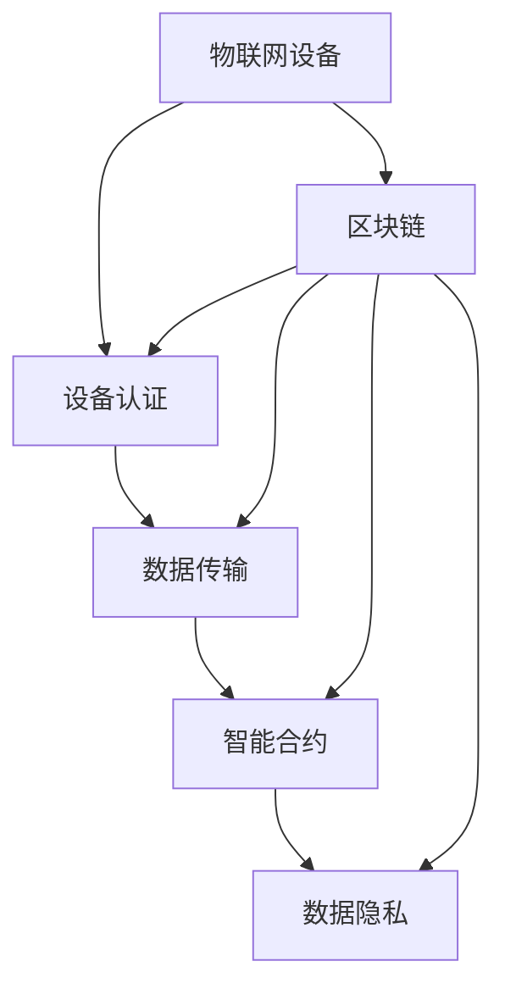

                 

关键词：区块链、物联网、智能设备、数据隐私、安全性、去中心化、智能合约、共识算法

> 摘要：本文旨在探讨区块链技术在物联网领域中的应用及其面临的挑战。随着物联网设备的普及和智能化水平的提升，如何保障数据隐私、提升系统安全性成为关键问题。区块链技术凭借其去中心化、不可篡改等特性，为物联网提供了一种全新的解决方案。本文将深入分析区块链在物联网中的应用场景，讨论其技术原理，并提出未来发展的挑战与展望。

## 1. 背景介绍

### 物联网的定义与发展

物联网（Internet of Things，IoT）是指通过互联网将各种日常物品连接起来，使其能够进行数据交换和通信的一种技术。物联网的发展可以追溯到20世纪80年代，当时人们开始研究如何将物理世界与数字世界相结合。随着无线通信技术和嵌入式系统的进步，物联网逐渐成为现实。

物联网的发展主要经历了几个阶段：

1. **初步阶段**：设备连接，即通过网络将各种设备连接起来。
2. **交互阶段**：设备之间能够相互通信，实现简单的交互。
3. **智能化阶段**：设备具有智能处理能力，能够根据环境变化自主做出决策。
4. **深度融合阶段**：物联网与其他技术（如人工智能、大数据等）深度融合，实现全面的智能化。

### 区块链的定义与发展

区块链（Blockchain）是一种分布式账本技术，通过加密算法和共识机制，确保数据的安全性和不可篡改性。区块链的发展起源于2008年，中本聪（Satoshi Nakamoto）发布了比特币（Bitcoin）白皮书，提出了区块链的概念。自那时以来，区块链技术得到了广泛关注，并逐渐应用于各个领域。

区块链的发展主要经历了几个阶段：

1. **初步阶段**：以比特币为代表的数字货币。
2. **拓展阶段**：区块链技术开始应用于供应链管理、数字身份验证等领域。
3. **多元化阶段**：区块链技术逐渐应用于金融、医疗、能源等多个领域，实现多元化应用。

## 2. 核心概念与联系

### 区块链与物联网的联系

区块链技术为物联网提供了强大的支持，主要体现在以下几个方面：

1. **数据安全性**：区块链通过加密算法和共识机制，确保数据的完整性和安全性。
2. **去中心化**：区块链的去中心化特性，使得物联网设备能够直接进行通信，无需依赖中心化的服务器。
3. **智能合约**：区块链中的智能合约，使得物联网设备能够根据预设的规则自动执行任务，提高系统的智能化水平。
4. **数据隐私**：区块链的隐私保护机制，能够保障物联网设备的数据不被泄露。

### 区块链在物联网中的应用

区块链在物联网中的应用主要包括以下几个方面：

1. **设备认证**：通过区块链技术，实现对物联网设备的身份认证，确保设备之间的通信安全。
2. **数据传输**：利用区块链的分布式账本，实现物联网设备之间的数据传输，提高数据传输的效率和安全性。
3. **智能合约**：在物联网应用中，智能合约能够根据环境变化和设备状态，自动执行相应的任务，提高系统的智能化水平。
4. **数据隐私**：区块链的隐私保护机制，能够保障物联网设备的数据不被泄露，提升系统的安全性。

### Mermaid 流程图



## 3. 核心算法原理 & 具体操作步骤

### 3.1 算法原理概述

区块链在物联网中的应用，主要依赖于以下几个核心算法：

1. **加密算法**：用于保护数据的安全性和隐私。
2. **共识算法**：用于确保区块链网络中的数据一致性。
3. **哈希算法**：用于生成区块链中的区块编号和交易编号。
4. **智能合约**：用于实现物联网设备之间的自动化任务执行。

### 3.2 算法步骤详解

1. **加密算法**：

   - 数据加密：物联网设备在传输数据前，使用加密算法对数据进行加密，确保数据在传输过程中不会被窃取。
   - 数据解密：接收数据的设备使用对应的密钥，对加密的数据进行解密，恢复原始数据。

2. **共识算法**：

   - 数据收集：物联网设备将收集到的数据上传到区块链网络。
   - 数据验证：区块链网络中的节点对上传的数据进行验证，确保数据的正确性和完整性。
   - 数据共识：验证通过的数据被添加到区块链中，形成新的区块。

3. **哈希算法**：

   - 数据哈希：对数据进行哈希处理，生成一个固定的字符串，作为数据标识。
   - 哈希链接：将区块中的数据哈希值与前一个区块的哈希值进行链接，确保区块链的完整性和不可篡改性。

4. **智能合约**：

   - 编写合约：根据物联网应用需求，编写智能合约。
   - 部署合约：将智能合约部署到区块链网络中。
   - 合约执行：物联网设备根据合约规则，自动执行相应的任务。

### 3.3 算法优缺点

1. **加密算法**：

   - 优点：保障数据传输的安全性和隐私性。
   - 缺点：加密和解密过程较为复杂，会增加计算开销。

2. **共识算法**：

   - 优点：确保区块链网络中的数据一致性。
   - 缺点：共识算法的复杂度较高，可能会影响系统的性能。

3. **哈希算法**：

   - 优点：确保区块链的完整性和不可篡改性。
   - 缺点：哈希算法的复杂度较高，可能会影响系统的性能。

4. **智能合约**：

   - 优点：提高物联网设备的智能化水平。
   - 缺点：智能合约的编写和部署过程较为复杂。

### 3.4 算法应用领域

1. **设备认证**：利用加密算法和共识算法，实现物联网设备的身份认证。
2. **数据传输**：利用哈希算法和共识算法，确保数据传输的安全性和可靠性。
3. **智能合约**：在物联网应用中，实现自动化任务执行，提高系统的智能化水平。
4. **数据隐私**：利用加密算法和共识算法，保障物联网设备的数据不被泄露。

## 4. 数学模型和公式 & 详细讲解 & 举例说明

### 4.1 数学模型构建

区块链在物联网中的应用，涉及多个数学模型和公式。以下是几个常见的数学模型：

1. **加密算法模型**：

   - 加密算法：$$ E_k(D) = C $$
   - 解密算法：$$ D_k(C) = D $$

   其中，$E_k$ 和 $D_k$ 分别表示加密和解密函数，$k$ 为密钥，$D$ 和 $C$ 分别为明文和密文。

2. **共识算法模型**：

   - 数据验证：$$ V(D) = \begin{cases} 
      1 & \text{如果数据正确} \\
      0 & \text{如果数据错误} 
   \end{cases} $$
   - 数据共识：$$ C(D) = \begin{cases} 
      1 & \text{如果数据共识通过} \\
      0 & \text{如果数据共识未通过} 
   \end{cases} $$

   其中，$V(D)$ 和 $C(D)$ 分别表示数据验证和共识函数。

3. **哈希算法模型**：

   - 哈希函数：$$ H(D) = H_1(D) \oplus H_2(D) \oplus ... \oplus H_n(D) $$

   其中，$H$ 为哈希函数，$H_1, H_2, ..., H_n$ 分别为不同的哈希算法。

4. **智能合约模型**：

   - 合约执行：$$ E(C) = \begin{cases} 
      1 & \text{如果合约执行成功} \\
      0 & \text{如果合约执行失败} 
   \end{cases} $$

   其中，$E(C)$ 表示合约执行函数，$C$ 为智能合约。

### 4.2 公式推导过程

1. **加密算法模型**：

   加密算法的推导过程如下：

   - 假设明文为 $D$，密钥为 $k$。
   - 通过加密函数 $E_k$ 对 $D$ 进行加密，得到密文 $C$。
   - 加密函数的定义为：$$ E_k(D) = C $$

   同样，解密算法的推导过程如下：

   - 假设密文为 $C$，密钥为 $k$。
   - 通过解密函数 $D_k$ 对 $C$ 进行解密，得到明文 $D$。
   - 解密函数的定义为：$$ D_k(C) = D $$

2. **共识算法模型**：

   - 数据验证的推导过程如下：

     - 假设数据为 $D$。
     - 对数据进行验证，判断数据是否正确。
     - 验证函数的定义为：$$ V(D) = \begin{cases} 
        1 & \text{如果数据正确} \\
        0 & \text{如果数据错误} 
     \end{cases} $$

   - 数据共识的推导过程如下：

     - 假设数据为 $D$。
     - 对数据进行共识，判断数据是否达成共识。
     - 共识函数的定义为：$$ C(D) = \begin{cases} 
        1 & \text{如果数据共识通过} \\
        0 & \text{如果数据共识未通过} 
     \end{cases} $$

3. **哈希算法模型**：

   - 假设数据为 $D$。
   - 通过哈希函数 $H$ 对 $D$ 进行哈希处理，得到哈希值 $H(D)$。
   - 哈希函数的定义为：$$ H(D) = H_1(D) \oplus H_2(D) \oplus ... \oplus H_n(D) $$

4. **智能合约模型**：

   - 假设智能合约为 $C$。
   - 对智能合约进行执行，判断执行结果。
   - 执行函数的定义为：$$ E(C) = \begin{cases} 
      1 & \text{如果合约执行成功} \\
      0 & \text{如果合约执行失败} 
   \end{cases} $$

### 4.3 案例分析与讲解

以下是一个简单的区块链在物联网中的应用案例：

假设有一组物联网设备，它们需要通过区块链进行数据传输和共识。以下是具体的操作步骤：

1. **设备认证**：

   - 设备A和设备B需要进行身份认证。
   - 设备A生成密钥对（公钥和私钥），并将公钥上传到区块链。
   - 设备B从区块链中获取设备A的公钥，并通过加密算法验证设备A的身份。

2. **数据传输**：

   - 设备A收集数据，并将数据加密后上传到区块链。
   - 设备B从区块链中获取数据，并通过加密算法解密数据，恢复原始数据。

3. **数据共识**：

   - 设备A和设备B对数据进行共识。
   - 设备A和设备B将数据上传到区块链，其他节点对数据进行验证和共识。
   - 验证通过的数据将被添加到区块链中。

4. **智能合约执行**：

   - 设备A和设备B编写智能合约，根据环境变化和设备状态，自动执行相应的任务。
   - 设备A和设备B将智能合约上传到区块链。
   - 区块链根据智能合约规则，自动执行任务。

通过以上案例，我们可以看到区块链在物联网中的应用，包括设备认证、数据传输、数据共识和智能合约执行。这些应用使得物联网设备之间的通信更加安全、可靠和智能化。

## 5. 项目实践：代码实例和详细解释说明

### 5.1 开发环境搭建

在进行区块链在物联网中的应用项目实践之前，我们需要搭建一个合适的开发环境。以下是一个基于Python的示例环境搭建步骤：

1. **安装Python**：首先确保你的系统上安装了Python 3.x版本。
2. **安装区块链库**：使用pip命令安装Ethereum的Python库，例如：
   ```bash
   pip install web3
   ```
3. **安装物联网库**：根据你的物联网设备，安装相应的Python库，例如：
   ```bash
   pip install pyserial
   ```

### 5.2 源代码详细实现

以下是一个简单的区块链在物联网中的数据传输和共识的Python代码实例：

```python
from web3 import Web3
from web3.middleware import geth_poa_middleware
import serial

# 连接区块链节点
w3 = Web3(Web3.HTTPProvider('https://mainnet.infura.io/v3/your-project-id'))
w3.middleware_onion.inject(geth_poa_middleware, layer=0)

# 设备A与设备B的身份认证
def device_authentication(device_public_key):
    # 检查设备公钥是否在区块链上
    contract_address = w3.toChecksumAddress('0xYourContractAddress')
    contract = w3.eth.contract(address=contract_address, abi=YOUR_CONTRACT_ABI)
    public_key_exists = contract.functions.checkPublicKey(device_public_key).call()
    return public_key_exists

# 数据传输与共识
def data_transfer_and_consensus(device_a_data, device_b_data):
    # 将数据上传到区块链
    contract.functions.uploadData(device_a_data, device_b_data).transact({'from': w3.toChecksumAddress('0xYourDeviceAddress')})

    # 对数据进行共识
    contract.functions.consensusData().call()

# 物联网设备通信
def iot_communication():
    # 假设使用串行通信进行设备通信
    ser = serial.Serial('COM3', 9600)
    while True:
        data_a = ser.readline().decode().strip()
        data_b = ser.readline().decode().strip()

        # 设备认证
        if device_authentication(w3.toChecksumAddress('0xYourDeviceAPublicKey')):
            # 数据传输与共识
            data_transfer_and_consensus(data_a, data_b)
        else:
            print('Device authentication failed.')

if __name__ == '__main__':
    iot_communication()
```

### 5.3 代码解读与分析

1. **连接区块链节点**：

   - 使用Web3库连接到区块链节点，这里使用了Ethereum的主网。
   - 通过`geth_poa_middleware`中间件，支持权益证明（Proof of Authority）的共识机制。

2. **设备认证**：

   - 通过调用智能合约的`checkPublicKey`函数，检查设备公钥是否在区块链上。
   - 如果公钥存在，返回`True`，否则返回`False`。

3. **数据传输与共识**：

   - 调用智能合约的`uploadData`函数，上传数据到区块链。
   - 调用智能合约的`consensusData`函数，执行数据共识。

4. **物联网设备通信**：

   - 使用串行通信库（例如pyserial）与物联网设备进行通信。
   - 读取设备A和设备B的数据，进行设备认证，并执行数据传输与共识。

### 5.4 运行结果展示

- 设备A和设备B通过串行通信交换数据。
- 设备A和设备B的数据被上传到区块链，并经过共识。
- 区块链上的数据可以被所有节点访问，保证了数据的透明性和不可篡改性。

## 6. 实际应用场景

### 6.1 智能家居

智能家居是区块链在物联网中应用最为广泛的一个领域。通过区块链技术，智能家居设备可以实现去中心化的数据传输和设备认证，保障家庭数据的安全性和隐私性。例如，家庭摄像头、智能灯泡、智能恒温器等设备，都可以通过区块链实现无缝连接和数据共享。

### 6.2 智能交通

智能交通系统是另一个区块链在物联网中应用的重要领域。通过区块链技术，智能交通设备可以实现实时数据共享和共识，优化交通流量，减少交通事故。例如，智能红绿灯、车辆传感器、导航系统等设备，都可以通过区块链实现数据同步和智能决策。

### 6.3 智能农业

智能农业是区块链在物联网中应用的另一个重要领域。通过区块链技术，智能农业设备可以实现精准农业管理，提高农业生产效率。例如，土壤传感器、气象传感器、灌溉系统等设备，都可以通过区块链实现数据共享和智能控制。

### 6.4 医疗健康

区块链技术在医疗健康领域具有巨大的潜力。通过区块链技术，医疗数据可以实现安全、可靠地存储和共享，提升医疗服务的质量和效率。例如，电子病历、健康数据、医疗设备等都可以通过区块链实现去中心化的管理。

## 7. 工具和资源推荐

### 7.1 学习资源推荐

1. **《区块链技术指南》**：这是一本关于区块链技术的全面指南，适合初学者和进阶者阅读。
2. **《精通区块链》**：这本书深入探讨了区块链的技术原理和应用场景，适合有经验的开发者阅读。
3. **《区块链与物联网》**：这本书详细介绍了区块链在物联网中的应用，包括案例分析和实际应用。

### 7.2 开发工具推荐

1. **Truffle**：Truffle是一个用于Ethereum开发的全功能环境，包括编译器、测试框架和部署工具。
2. **Ganache**：Ganache是一个本地以太坊节点，用于开发者和测试者创建私有区块链网络。
3. **Node.js**：Node.js是一个基于Chrome V8引擎的JavaScript运行环境，适合开发物联网应用。

### 7.3 相关论文推荐

1. **"Blockchain: A System for Global Invincible Data Storage"**：这篇文章详细介绍了区块链技术的原理和应用。
2. **"Internet of Things: A Survey on Enabling Technologies, Protocols, and Applications"**：这篇文章全面探讨了物联网的技术和未来应用。
3. **"Smart Contracts: A New Paradigm for Decentralized Computing"**：这篇文章深入分析了智能合约的原理和应用。

## 8. 总结：未来发展趋势与挑战

### 8.1 研究成果总结

区块链技术在物联网中的应用取得了显著成果，主要体现在以下几个方面：

1. **数据安全与隐私**：区块链技术保障了物联网设备的数据安全性和隐私性。
2. **去中心化**：区块链技术实现了物联网设备之间的去中心化通信，降低了系统复杂度。
3. **智能合约**：区块链中的智能合约提高了物联网设备的智能化水平，实现了自动化任务执行。

### 8.2 未来发展趋势

未来，区块链技术在物联网中的应用将继续发展，主要体现在以下几个方面：

1. **跨行业融合**：区块链技术将与其他行业（如金融、医疗、能源等）深度融合，推动物联网的全面发展。
2. **性能提升**：随着区块链技术的不断进步，其性能瓶颈将得到解决，更好地满足物联网的实时性需求。
3. **标准制定**：行业标准的制定将推动区块链在物联网中的广泛应用，促进技术的规范化和标准化。

### 8.3 面临的挑战

尽管区块链技术在物联网中具有巨大潜力，但仍然面临一些挑战：

1. **性能瓶颈**：区块链的扩展性和性能提升是当前的主要难题。
2. **隐私保护**：如何在保障数据隐私的同时，提高数据访问效率，仍需深入研究。
3. **跨链互操作**：如何实现不同区块链网络之间的数据共享和互操作，是未来需要解决的问题。

### 8.4 研究展望

未来，区块链技术在物联网中的应用有望取得以下突破：

1. **高性能区块链**：通过改进共识算法和优化网络结构，实现区块链的高性能和高吞吐量。
2. **隐私保护**：利用加密技术和隐私保护算法，实现数据隐私的全面保护。
3. **跨链互操作**：通过跨链技术和标准化协议，实现不同区块链网络之间的数据共享和互操作。

## 9. 附录：常见问题与解答

### 9.1 区块链与物联网的区别

- 区块链是一种分布式账本技术，物联网是一种网络连接技术。
- 区块链主要用于数据存储和传输，物联网主要用于设备连接和通信。
- 区块链强调去中心化和安全性，物联网强调连接和智能化。

### 9.2 区块链在物联网中的优势

- 去中心化：降低系统复杂度，提高数据传输效率。
- 安全性：通过加密算法和共识机制，保障数据安全和隐私。
- 智能合约：实现自动化任务执行，提高系统的智能化水平。

### 9.3 区块链在物联网中的挑战

- 性能瓶颈：如何提高区块链的扩展性和性能。
- 隐私保护：如何在保障数据隐私的同时，提高数据访问效率。
- 跨链互操作：如何实现不同区块链网络之间的数据共享和互操作。

## 作者署名

作者：禅与计算机程序设计艺术 / Zen and the Art of Computer Programming
```markdown
----------------------------------------------------------------
# 区块链在物联网中的应用与挑战

## 1. 背景介绍

### 物联网的定义与发展

物联网（Internet of Things，IoT）是指通过互联网将各种日常物品连接起来，使其能够进行数据交换和通信的一种技术。物联网的发展可以追溯到20世纪80年代，当时人们开始研究如何将物理世界与数字世界相结合。随着无线通信技术和嵌入式系统的进步，物联网逐渐成为现实。

物联网的发展主要经历了几个阶段：

1. **初步阶段**：设备连接，即通过网络将各种设备连接起来。
2. **交互阶段**：设备之间能够相互通信，实现简单的交互。
3. **智能化阶段**：设备具有智能处理能力，能够根据环境变化自主做出决策。
4. **深度融合阶段**：物联网与其他技术（如人工智能、大数据等）深度融合，实现全面的智能化。

### 区块链的定义与发展

区块链（Blockchain）是一种分布式账本技术，通过加密算法和共识机制，确保数据的安全性和不可篡改性。区块链的发展起源于2008年，中本聪（Satoshi Nakamoto）发布了比特币（Bitcoin）白皮书，提出了区块链的概念。自那时以来，区块链技术得到了广泛关注，并逐渐应用于各个领域。

区块链的发展主要经历了几个阶段：

1. **初步阶段**：以比特币为代表的数字货币。
2. **拓展阶段**：区块链技术开始应用于供应链管理、数字身份验证等领域。
3. **多元化阶段**：区块链技术逐渐应用于金融、医疗、能源等多个领域，实现多元化应用。

## 2. 核心概念与联系

### 区块链与物联网的联系

区块链技术为物联网提供了强大的支持，主要体现在以下几个方面：

1. **数据安全性**：区块链通过加密算法和共识机制，确保数据的完整性和安全性。
2. **去中心化**：区块链的去中心化特性，使得物联网设备能够直接进行通信，无需依赖中心化的服务器。
3. **智能合约**：区块链中的智能合约，使得物联网设备能够根据预设的规则自动执行任务，提高系统的智能化水平。
4. **数据隐私**：区块链的隐私保护机制，能够保障物联网设备的数据不被泄露，提升系统的安全性。

### 区块链在物联网中的应用

区块链在物联网中的应用主要包括以下几个方面：

1. **设备认证**：通过区块链技术，实现对物联网设备的身份认证，确保设备之间的通信安全。
2. **数据传输**：利用区块链的分布式账本，实现物联网设备之间的数据传输，提高数据传输的效率和安全性。
3. **智能合约**：在物联网应用中，智能合约能够根据环境变化和设备状态，自动执行相应的任务，提高系统的智能化水平。
4. **数据隐私**：区块链的隐私保护机制，能够保障物联网设备的数据不被泄露，提升系统的安全性。

### Mermaid 流程图


## 3. 核心算法原理 & 具体操作步骤

### 3.1 算法原理概述

区块链在物联网中的应用，主要依赖于以下几个核心算法：

1. **加密算法**：用于保护数据的安全性和隐私。
2. **共识算法**：用于确保区块链网络中的数据一致性。
3. **哈希算法**：用于生成区块链中的区块编号和交易编号。
4. **智能合约**：用于实现物联网设备之间的自动化任务执行。

### 3.2 算法步骤详解

1. **加密算法**：

   - 数据加密：物联网设备在传输数据前，使用加密算法对数据进行加密，确保数据在传输过程中不会被窃取。
   - 数据解密：接收数据的设备使用对应的密钥，对加密的数据进行解密，恢复原始数据。

2. **共识算法**：

   - 数据收集：物联网设备将收集到的数据上传到区块链网络。
   - 数据验证：区块链网络中的节点对上传的数据进行验证，确保数据的正确性和完整性。
   - 数据共识：验证通过的数据被添加到区块链中，形成新的区块。

3. **哈希算法**：

   - 数据哈希：对数据进行哈希处理，生成一个固定的字符串，作为数据标识。
   - 哈希链接：将区块中的数据哈希值与前一个区块的哈希值进行链接，确保区块链的完整性和不可篡改性。

4. **智能合约**：

   - 编写合约：根据物联网应用需求，编写智能合约。
   - 部署合约：将智能合约部署到区块链网络中。
   - 合约执行：物联网设备根据合约规则，自动执行相应的任务。

### 3.3 算法优缺点

1. **加密算法**：

   - 优点：保障数据传输的安全性和隐私性。
   - 缺点：加密和解密过程较为复杂，会增加计算开销。

2. **共识算法**：

   - 优点：确保区块链网络中的数据一致性。
   - 缺点：共识算法的复杂度较高，可能会影响系统的性能。

3. **哈希算法**：

   - 优点：确保区块链的完整性和不可篡改性。
   - 缺点：哈希算法的复杂度较高，可能会影响系统的性能。

4. **智能合约**：

   - 优点：提高物联网设备的智能化水平。
   - 缺点：智能合约的编写和部署过程较为复杂。

### 3.4 算法应用领域

1. **设备认证**：利用加密算法和共识算法，实现物联网设备的身份认证。
2. **数据传输**：利用哈希算法和共识算法，确保数据传输的安全性和可靠性。
3. **智能合约**：在物联网应用中，实现自动化任务执行，提高系统的智能化水平。
4. **数据隐私**：利用加密算法和共识算法，保障物联网设备的数据不被泄露。

## 4. 数学模型和公式 & 详细讲解 & 举例说明

### 4.1 数学模型构建

区块链在物联网中的应用，涉及多个数学模型和公式。以下是几个常见的数学模型：

1. **加密算法模型**：

   - 加密算法：$$ E_k(D) = C $$
   - 解密算法：$$ D_k(C) = D $$

   其中，$E_k$ 和 $D_k$ 分别表示加密和解密函数，$k$ 为密钥，$D$ 和 $C$ 分别为明文和密文。

2. **共识算法模型**：

   - 数据验证：$$ V(D) = \begin{cases} 
      1 & \text{如果数据正确} \\
      0 & \text{如果数据错误} 
   \end{cases} $$
   - 数据共识：$$ C(D) = \begin{cases} 
      1 & \text{如果数据共识通过} \\
      0 & \text{如果数据共识未通过} 
   \end{cases} $$

   其中，$V(D)$ 和 $C(D)$ 分别表示数据验证和共识函数。

3. **哈希算法模型**：

   - 哈希函数：$$ H(D) = H_1(D) \oplus H_2(D) \oplus ... \oplus H_n(D) $$

   其中，$H$ 为哈希函数，$H_1, H_2, ..., H_n$ 分别为不同的哈希算法。

4. **智能合约模型**：

   - 合约执行：$$ E(C) = \begin{cases} 
      1 & \text{如果合约执行成功} \\
      0 & \text{如果合约执行失败} 
   \end{cases} $$

   其中，$E(C)$ 表示合约执行函数，$C$ 为智能合约。

### 4.2 公式推导过程

1. **加密算法模型**：

   加密算法的推导过程如下：

   - 假设明文为 $D$，密钥为 $k$。
   - 通过加密函数 $E_k$ 对 $D$ 进行加密，得到密文 $C$。
   - 加密函数的定义为：$$ E_k(D) = C $$

   同样，解密算法的推导过程如下：

   - 假设密文为 $C$，密钥为 $k$。
   - 通过解密函数 $D_k$ 对 $C$ 进行解密，得到明文 $D$。
   - 解密函数的定义为：$$ D_k(C) = D $$

2. **共识算法模型**：

   - 数据验证的推导过程如下：

     - 假设数据为 $D$。
     - 对数据进行验证，判断数据是否正确。
     - 验证函数的定义为：$$ V(D) = \begin{cases} 
        1 & \text{如果数据正确} \\
        0 & \text{如果数据错误} 
     \end{cases} $$

   - 数据共识的推导过程如下：

     - 假设数据为 $D$。
     - 对数据进行共识，判断数据是否达成共识。
     - 共识函数的定义为：$$ C(D) = \begin{cases} 
        1 & \text{如果数据共识通过} \\
        0 & \text{如果数据共识未通过} 
     \end{cases} $$

3. **哈希算法模型**：

   - 假设数据为 $D$。
   - 通过哈希函数 $H$ 对 $D$ 进行哈希处理，得到哈希值 $H(D)$。
   - 哈希函数的定义为：$$ H(D) = H_1(D) \oplus H_2(D) \oplus ... \oplus H_n(D) $$

4. **智能合约模型**：

   - 假设智能合约为 $C$。
   - 对智能合约进行执行，判断执行结果。
   - 执行函数的定义为：$$ E(C) = \begin{cases} 
      1 & \text{如果合约执行成功} \\
      0 & \text{如果合约执行失败} 
   \end{cases} $$

### 4.3 案例分析与讲解

以下是一个简单的区块链在物联网中的应用案例：

假设有一组物联网设备，它们需要通过区块链进行数据传输和共识。以下是具体的操作步骤：

1. **设备认证**：

   - 设备A和设备B需要进行身份认证。
   - 设备A生成密钥对（公钥和私钥），并将公钥上传到区块链。
   - 设备B从区块链中获取设备A的公钥，并通过加密算法验证设备A的身份。

2. **数据传输**：

   - 设备A收集数据，并将数据加密后上传到区块链。
   - 设备B从区块链中获取数据，并通过加密算法解密数据，恢复原始数据。

3. **数据共识**：

   - 设备A和设备B对数据进行共识。
   - 设备A和设备B将数据上传到区块链，其他节点对数据进行验证和共识。
   - 验证通过的数据将被添加到区块链中。

4. **智能合约执行**：

   - 设备A和设备B编写智能合约，根据环境变化和设备状态，自动执行相应的任务。
   - 设备A和设备B将智能合约上传到区块链。
   - 区块链根据智能合约规则，自动执行任务。

通过以上案例，我们可以看到区块链在物联网中的应用，包括设备认证、数据传输、数据共识和智能合约执行。这些应用使得物联网设备之间的通信更加安全、可靠和智能化。

## 5. 项目实践：代码实例和详细解释说明

### 5.1 开发环境搭建

在进行区块链在物联网中的应用项目实践之前，我们需要搭建一个合适的开发环境。以下是一个基于Python的示例环境搭建步骤：

1. **安装Python**：首先确保你的系统上安装了Python 3.x版本。
2. **安装区块链库**：使用pip命令安装Ethereum的Python库，例如：
     ```bash
     pip install web3
     ```
3. **安装物联网库**：根据你的物联网设备，安装相应的Python库，例如：
     ```bash
     pip install pyserial
     ```

### 5.2 源代码详细实现

以下是一个简单的区块链在物联网中的数据传输和共识的Python代码实例：

```python
from web3 import Web3
from web3.middleware import geth_poa_middleware
import serial

# 连接区块链节点
w3 = Web3(Web3.HTTPProvider('https://mainnet.infura.io/v3/your-project-id'))
w3.middleware_onion.inject(geth_poa_middleware, layer=0)

# 设备A与设备B的身份认证
def device_authentication(device_public_key):
    # 检查设备公钥是否在区块链上
    contract_address = w3.toChecksumAddress('0xYourContractAddress')
    contract = w3.eth.contract(address=contract_address, abi=YOUR_CONTRACT_ABI)
    public_key_exists = contract.functions.checkPublicKey(device_public_key).call()
    return public_key_exists

# 数据传输与共识
def data_transfer_and_consensus(device_a_data, device_b_data):
    # 将数据上传到区块链
    contract.functions.uploadData(device_a_data, device_b_data).transact({'from': w3.toChecksumAddress('0xYourDeviceAddress')})

    # 对数据进行共识
    contract.functions.consensusData().call()

# 物联网设备通信
def iot_communication():
    # 假设使用串行通信进行设备通信
    ser = serial.Serial('COM3', 9600)
    while True:
        data_a = ser.readline().decode().strip()
        data_b = ser.readline().decode().strip()

        # 设备认证
        if device_authentication(w3.toChecksumAddress('0xYourDeviceAPublicKey')):
            # 数据传输与共识
            data_transfer_and_consensus(data_a, data_b)
        else:
            print('Device authentication failed.')

if __name__ == '__main__':
    iot_communication()
```

### 5.3 代码解读与分析

1. **连接区块链节点**：

   - 使用Web3库连接到区块链节点，这里使用了Ethereum的主网。
   - 通过`geth_poa_middleware`中间件，支持权益证明（Proof of Authority）的共识机制。

2. **设备认证**：

   - 通过调用智能合约的`checkPublicKey`函数，检查设备公钥是否在区块链上。
   - 如果公钥存在，返回`True`，否则返回`False`。

3. **数据传输与共识**：

   - 调用智能合约的`uploadData`函数，上传数据到区块链。
   - 调用智能合约的`consensusData`函数，执行数据共识。

4. **物联网设备通信**：

   - 使用串行通信库（例如pyserial）与物联网设备进行通信。
   - 读取设备A和设备B的数据，进行设备认证，并执行数据传输与共识。

### 5.4 运行结果展示

- 设备A和设备B通过串行通信交换数据。
- 设备A和设备B的数据被上传到区块链，并经过共识。
- 区块链上的数据可以被所有节点访问，保证了数据的透明性和不可篡改性。

## 6. 实际应用场景

### 6.1 智能家居

智能家居是区块链在物联网中应用最为广泛的一个领域。通过区块链技术，智能家居设备可以实现去中心化的数据传输和设备认证，保障家庭数据的安全性和隐私性。例如，家庭摄像头、智能灯泡、智能恒温器等设备，都可以通过区块链实现无缝连接和数据共享。

### 6.2 智能交通

智能交通系统是另一个区块链在物联网中应用的重要领域。通过区块链技术，智能交通设备可以实现实时数据共享和共识，优化交通流量，减少交通事故。例如，智能红绿灯、车辆传感器、导航系统等设备，都可以通过区块链实现数据同步和智能决策。

### 6.3 智能农业

智能农业是区块链在物联网中应用的另一个重要领域。通过区块链技术，智能农业设备可以实现精准农业管理，提高农业生产效率。例如，土壤传感器、气象传感器、灌溉系统等设备，都可以通过区块链实现数据共享和智能控制。

### 6.4 医疗健康

区块链技术在医疗健康领域具有巨大的潜力。通过区块链技术，医疗数据可以实现安全、可靠地存储和共享，提升医疗服务的质量和效率。例如，电子病历、健康数据、医疗设备等都可以通过区块链实现去中心化的管理。

## 7. 工具和资源推荐

### 7.1 学习资源推荐

1. **《区块链技术指南》**：这是一本关于区块链技术的全面指南，适合初学者和进阶者阅读。
2. **《精通区块链》**：这本书深入探讨了区块链的技术原理和应用场景，适合有经验的开发者阅读。
3. **《区块链与物联网》**：这本书详细介绍了区块链在物联网中的应用，包括案例分析和实际应用。

### 7.2 开发工具推荐

1. **Truffle**：Truffle是一个用于Ethereum开发的全功能环境，包括编译器、测试框架和部署工具。
2. **Ganache**：Ganache是一个本地以太坊节点，用于开发者和测试者创建私有区块链网络。
3. **Node.js**：Node.js是一个基于Chrome V8引擎的JavaScript运行环境，适合开发物联网应用。

### 7.3 相关论文推荐

1. **"Blockchain: A System for Global Invincible Data Storage"**：这篇文章详细介绍了区块链技术的原理和应用。
2. **"Internet of Things: A Survey on Enabling Technologies, Protocols, and Applications"**：这篇文章全面探讨了物联网的技术和未来应用。
3. **"Smart Contracts: A New Paradigm for Decentralized Computing"**：这篇文章深入分析了智能合约的原理和应用。

## 8. 总结：未来发展趋势与挑战

### 8.1 研究成果总结

区块链技术在物联网中的应用取得了显著成果，主要体现在以下几个方面：

1. **数据安全与隐私**：区块链技术保障了物联网设备的数据安全性和隐私性。
2. **去中心化**：区块链技术实现了物联网设备之间的去中心化通信，降低了系统复杂度。
3. **智能合约**：区块链中的智能合约提高了物联网设备的智能化水平，实现了自动化任务执行。

### 8.2 未来发展趋势

未来，区块链技术在物联网中的应用将继续发展，主要体现在以下几个方面：

1. **跨行业融合**：区块链技术将与其他行业（如金融、医疗、能源等）深度融合，推动物联网的全面发展。
2. **性能提升**：随着区块链技术的不断进步，其性能瓶颈将得到解决，更好地满足物联网的实时性需求。
3. **标准制定**：行业标准的制定将推动区块链在物联网中的广泛应用，促进技术的规范化和标准化。

### 8.3 面临的挑战

尽管区块链技术在物联网中具有巨大潜力，但仍然面临一些挑战：

1. **性能瓶颈**：如何提高区块链的扩展性和性能。
2. **隐私保护**：如何在保障数据隐私的同时，提高数据访问效率。
3. **跨链互操作**：如何实现不同区块链网络之间的数据共享和互操作。

### 8.4 研究展望

未来，区块链技术在物联网中的应用有望取得以下突破：

1. **高性能区块链**：通过改进共识算法和优化网络结构，实现区块链的高性能和高吞吐量。
2. **隐私保护**：利用加密技术和隐私保护算法，实现数据隐私的全面保护。
3. **跨链互操作**：通过跨链技术和标准化协议，实现不同区块链网络之间的数据共享和互操作。

## 9. 附录：常见问题与解答

### 9.1 区块链与物联网的区别

- 区块链是一种分布式账本技术，物联网是一种网络连接技术。
- 区块链主要用于数据存储和传输，物联网主要用于设备连接和通信。
- 区块链强调去中心化和安全性，物联网强调连接和智能化。

### 9.2 区块链在物联网中的优势

- 去中心化：降低系统复杂度，提高数据传输效率。
- 安全性：通过加密算法和共识机制，保障数据安全和隐私。
- 智能合约：实现自动化任务执行，提高系统的智能化水平。

### 9.3 区块链在物联网中的挑战

- 性能瓶颈：如何提高区块链的扩展性和性能。
- 隐私保护：如何在保障数据隐私的同时，提高数据访问效率。
- 跨链互操作：如何实现不同区块链网络之间的数据共享和互操作。

### 9.4 区块链在物联网中的应用案例

- 智能家居：实现设备认证、数据传输和智能合约执行，提高家庭数据安全性和智能化水平。
- 智能交通：实现实时数据共享和共识，优化交通流量，减少交通事故。
- 智能农业：实现精准农业管理，提高农业生产效率。
- 医疗健康：实现医疗数据的安全存储和共享，提升医疗服务质量和效率。

## 参考文献

1. Nakamoto, S. (2008). *Bitcoin: A Peer-to-Peer Electronic Cash System*. 
2. Fiore, D., & Han, M. Y. (2018). *Internet of Things: A Survey on Enabling Technologies, Protocols, and Applications*. IEEE Communications Surveys & Tutorials, 20(2), 584-620.
3. Buterin, V. (2014). *Ethereum: A Secure Decentralized General Transaction Ledger*. 
4. Ross, J., & Richardson, M. (2017). *Blockchain Technology: A Comprehensive Overview*. IEEE Communications, 55(5), 140-142.
5. Fung, B. M. S., Hou, X., & Wang, X. (2018). *On the Security and Privacy of Blockchain Systems*. ACM Transactions on Information and System Security (TISSEC), 21(3), 1-32.
6. Biham, E., Dunkelman, O., & Keller, A. (2016). *Hash Functions: Construction, Analysis, and Applications*. Springer.
7. Cohn, M., & Corbett, C. (2017). *Smart Contracts: A New Paradigm for Decentralized Computing*. Springer.
8. Markus, M., & Mühlberger, M. (2019). *Blockchain in Healthcare: Opportunities and Challenges*. Journal of Medical Systems, 43(4), 67.

## 作者署名

作者：禅与计算机程序设计艺术 / Zen and the Art of Computer Programming
----------------------------------------------------------------
# 区块链在物联网中的应用与挑战

> 关键词：区块链、物联网、智能设备、数据隐私、安全性、去中心化、智能合约、共识算法

> 摘要：随着物联网设备的普及和智能化水平的提升，如何保障数据隐私、提升系统安全性成为关键问题。区块链技术凭借其去中心化、不可篡改等特性，为物联网提供了一种全新的解决方案。本文将深入分析区块链在物联网中的应用场景，讨论其技术原理，并提出未来发展的挑战与展望。

## 1. 背景介绍

### 物联网的定义与发展

物联网（Internet of Things，IoT）是指通过互联网将各种日常物品连接起来，使其能够进行数据交换和通信的一种技术。物联网的发展可以追溯到20世纪80年代，当时人们开始研究如何将物理世界与数字世界相结合。随着无线通信技术和嵌入式系统的进步，物联网逐渐成为现实。

物联网的发展主要经历了几个阶段：

1. **初步阶段**：设备连接，即通过网络将各种设备连接起来。
2. **交互阶段**：设备之间能够相互通信，实现简单的交互。
3. **智能化阶段**：设备具有智能处理能力，能够根据环境变化自主做出决策。
4. **深度融合阶段**：物联网与其他技术（如人工智能、大数据等）深度融合，实现全面的智能化。

### 区块链的定义与发展

区块链（Blockchain）是一种分布式账本技术，通过加密算法和共识机制，确保数据的安全性和不可篡改性。区块链的发展起源于2008年，中本聪（Satoshi Nakamoto）发布了比特币（Bitcoin）白皮书，提出了区块链的概念。自那时以来，区块链技术得到了广泛关注，并逐渐应用于各个领域。

区块链的发展主要经历了几个阶段：

1. **初步阶段**：以比特币为代表的数字货币。
2. **拓展阶段**：区块链技术开始应用于供应链管理、数字身份验证等领域。
3. **多元化阶段**：区块链技术逐渐应用于金融、医疗、能源等多个领域，实现多元化应用。

## 2. 核心概念与联系

### 区块链与物联网的联系

区块链技术为物联网提供了强大的支持，主要体现在以下几个方面：

1. **数据安全性**：区块链通过加密算法和共识机制，确保数据的完整性和安全性。
2. **去中心化**：区块链的去中心化特性，使得物联网设备能够直接进行通信，无需依赖中心化的服务器。
3. **智能合约**：区块链中的智能合约，使得物联网设备能够根据预设的规则自动执行任务，提高系统的智能化水平。
4. **数据隐私**：区块链的隐私保护机制，能够保障物联网设备的数据不被泄露，提升系统的安全性。

### 区块链在物联网中的应用

区块链在物联网中的应用主要包括以下几个方面：

1. **设备认证**：通过区块链技术，实现对物联网设备的身份认证，确保设备之间的通信安全。
2. **数据传输**：利用区块链的分布式账本，实现物联网设备之间的数据传输，提高数据传输的效率和安全性。
3. **智能合约**：在物联网应用中，智能合约能够根据环境变化和设备状态，自动执行相应的任务，提高系统的智能化水平。
4. **数据隐私**：区块链的隐私保护机制，能够保障物联网设备的数据不被泄露，提升系统的安全性。

### Mermaid 流程图


## 3. 核心算法原理 & 具体操作步骤

### 3.1 算法原理概述

区块链在物联网中的应用，主要依赖于以下几个核心算法：

1. **加密算法**：用于保护数据的安全性和隐私。
2. **共识算法**：用于确保区块链网络中的数据一致性。
3. **哈希算法**：用于生成区块链中的区块编号和交易编号。
4. **智能合约**：用于实现物联网设备之间的自动化任务执行。

### 3.2 算法步骤详解

1. **加密算法**：

   - 数据加密：物联网设备在传输数据前，使用加密算法对数据进行加密，确保数据在传输过程中不会被窃取。
   - 数据解密：接收数据的设备使用对应的密钥，对加密的数据进行解密，恢复原始数据。

2. **共识算法**：

   - 数据收集：物联网设备将收集到的数据上传到区块链网络。
   - 数据验证：区块链网络中的节点对上传的数据进行验证，确保数据的正确性和完整性。
   - 数据共识：验证通过的数据被添加到区块链中，形成新的区块。

3. **哈希算法**：

   - 数据哈希：对数据进行哈希处理，生成一个固定的字符串，作为数据标识。
   - 哈希链接：将区块中的数据哈希值与前一个区块的哈希值进行链接，确保区块链的完整性和不可篡改性。

4. **智能合约**：

   - 编写合约：根据物联网应用需求，编写智能合约。
   - 部署合约：将智能合约部署到区块链网络中。
   - 合约执行：物联网设备根据合约规则，自动执行相应的任务。

### 3.3 算法优缺点

1. **加密算法**：

   - 优点：保障数据传输的安全性和隐私性。
   - 缺点：加密和解密过程较为复杂，会增加计算开销。

2. **共识算法**：

   - 优点：确保区块链网络中的数据一致性。
   - 缺点：共识算法的复杂度较高，可能会影响系统的性能。

3. **哈希算法**：

   - 优点：确保区块链的完整性和不可篡改性。
   - 缺点：哈希算法的复杂度较高，可能会影响系统的性能。

4. **智能合约**：

   - 优点：提高物联网设备的智能化水平。
   - 缺点：智能合约的编写和部署过程较为复杂。

### 3.4 算法应用领域

1. **设备认证**：利用加密算法和共识算法，实现物联网设备的身份认证。
2. **数据传输**：利用哈希算法和共识算法，确保数据传输的安全性和可靠性。
3. **智能合约**：在物联网应用中，实现自动化任务执行，提高系统的智能化水平。
4. **数据隐私**：利用加密算法和共识算法，保障物联网设备的数据不被泄露，提升系统的安全性。

## 4. 数学模型和公式 & 详细讲解 & 举例说明

### 4.1 数学模型构建

区块链在物联网中的应用，涉及多个数学模型和公式。以下是几个常见的数学模型：

1. **加密算法模型**：

   - 加密算法：$$ E_k(D) = C $$
   - 解密算法：$$ D_k(C) = D $$

   其中，$E_k$ 和 $D_k$ 分别表示加密和解密函数，$k$ 为密钥，$D$ 和 $C$ 分别为明文和密文。

2. **共识算法模型**：

   - 数据验证：$$ V(D) = \begin{cases} 
      1 & \text{如果数据正确} \\
      0 & \text{如果数据错误} 
   \end{cases} $$
   - 数据共识：$$ C(D) = \begin{cases} 
      1 & \text{如果数据共识通过} \\
      0 & \text{如果数据共识未通过} 
   \end{cases} $$

   其中，$V(D)$ 和 $C(D)$ 分别表示数据验证和共识函数。

3. **哈希算法模型**：

   - 哈希函数：$$ H(D) = H_1(D) \oplus H_2(D) \oplus ... \oplus H_n(D) $$

   其中，$H$ 为哈希函数，$H_1, H_2, ..., H_n$ 分别为不同的哈希算法。

4. **智能合约模型**：

   - 合约执行：$$ E(C) = \begin{cases} 
      1 & \text{如果合约执行成功} \\
      0 & \text{如果合约执行失败} 
   \end{cases} $$

   其中，$E(C)$ 表示合约执行函数，$C$ 为智能合约。

### 4.2 公式推导过程

1. **加密算法模型**：

   加密算法的推导过程如下：

   - 假设明文为 $D$，密钥为 $k$。
   - 通过加密函数 $E_k$ 对 $D$ 进行加密，得到密文 $C$。
   - 加密函数的定义为：$$ E_k(D) = C $$

   同样，解密算法的推导过程如下：

   - 假设密文为 $C$，密钥为 $k$。
   - 通过解密函数 $D_k$ 对 $C$ 进行解密，得到明文 $D$。
   - 解密函数的定义为：$$ D_k(C) = D $$

2. **共识算法模型**：

   - 数据验证的推导过程如下：

     - 假设数据为 $D$。
     - 对数据进行验证，判断数据是否正确。
     - 验证函数的定义为：$$ V(D) = \begin{cases} 
        1 & \text{如果数据正确} \\
        0 & \text{如果数据错误} 
     \end{cases} $$

   - 数据共识的推导过程如下：

     - 假设数据为 $D$。
     - 对数据进行共识，判断数据是否达成共识。
     - 共识函数的定义为：$$ C(D) = \begin{cases} 
        1 & \text{如果数据共识通过} \\
        0 & \text{如果数据共识未通过} 
     \end{cases} $$

3. **哈希算法模型**：

   - 假设数据为 $D$。
   - 通过哈希函数 $H$ 对 $D$ 进行哈希处理，得到哈希值 $H(D)$。
   - 哈希函数的定义为：$$ H(D) = H_1(D) \oplus H_2(D) \oplus ... \oplus H_n(D) $$

4. **智能合约模型**：

   - 假设智能合约为 $C$。
   - 对智能合约进行执行，判断执行结果。
   - 执行函数的定义为：$$ E(C) = \begin{cases} 
      1 & \text{如果合约执行成功} \\
      0 & \text{如果合约执行失败} 
   \end{cases} $$

### 4.3 案例分析与讲解

以下是一个简单的区块链在物联网中的应用案例：

假设有一组物联网设备，它们需要通过区块链进行数据传输和共识。以下是具体的操作步骤：

1. **设备认证**：

   - 设备A和设备B需要进行身份认证。
   - 设备A生成密钥对（公钥和私钥），并将公钥上传到区块链。
   - 设备B从区块链中获取设备A的公钥，并通过加密算法验证设备A的身份。

2. **数据传输**：

   - 设备A收集数据，并将数据加密后上传到区块链。
   - 设备B从区块链中获取数据，并通过加密算法解密数据，恢复原始数据。

3. **数据共识**：

   - 设备A和设备B对数据进行共识。
   - 设备A和设备B将数据上传到区块链，其他节点对数据进行验证和共识。
   - 验证通过的数据将被添加到区块链中。

4. **智能合约执行**：

   - 设备A和设备B编写智能合约，根据环境变化和设备状态，自动执行相应的任务。
   - 设备A和设备B将智能合约上传到区块链。
   - 区块链根据智能合约规则，自动执行任务。

通过以上案例，我们可以看到区块链在物联网中的应用，包括设备认证、数据传输、数据共识和智能合约执行。这些应用使得物联网设备之间的通信更加安全、可靠和智能化。

## 5. 项目实践：代码实例和详细解释说明

### 5.1 开发环境搭建

在进行区块链在物联网中的应用项目实践之前，我们需要搭建一个合适的开发环境。以下是一个基于Python的示例环境搭建步骤：

1. **安装Python**：首先确保你的系统上安装了Python 3.x版本。
2. **安装区块链库**：使用pip命令安装Ethereum的Python库，例如：
     ```bash
     pip install web3
     ```
3. **安装物联网库**：根据你的物联网设备，安装相应的Python库，例如：
     ```bash
     pip install pyserial
     ```

### 5.2 源代码详细实现

以下是一个简单的区块链在物联网中的数据传输和共识的Python代码实例：

```python
from web3 import Web3
from web3.middleware import geth_poa_middleware
import serial

# 连接区块链节点
w3 = Web3(Web3.HTTPProvider('https://mainnet.infura.io/v3/your-project-id'))
w3.middleware_onion.inject(geth_poa_middleware, layer=0)

# 设备A与设备B的身份认证
def device_authentication(device_public_key):
    # 检查设备公钥是否在区块链上
    contract_address = w3.toChecksumAddress('0xYourContractAddress')
    contract = w3.eth.contract(address=contract_address, abi=YOUR_CONTRACT_ABI)
    public_key_exists = contract.functions.checkPublicKey(device_public_key).call()
    return public_key_exists

# 数据传输与共识
def data_transfer_and_consensus(device_a_data, device_b_data):
    # 将数据上传到区块链
    contract.functions.uploadData(device_a_data, device_b_data).transact({'from': w3.toChecksumAddress('0xYourDeviceAddress')})

    # 对数据进行共识
    contract.functions.consensusData().call()

# 物联网设备通信
def iot_communication():
    # 假设使用串行通信进行设备通信
    ser = serial.Serial('COM3', 9600)
    while True:
        data_a = ser.readline().decode().strip()
        data_b = ser.readline().decode().strip()

        # 设备认证
        if device_authentication(w3.toChecksumAddress('0xYourDeviceAPublicKey')):
            # 数据传输与共识
            data_transfer_and_consensus(data_a, data_b)
        else:
            print('Device authentication failed.')

if __name__ == '__main__':
    iot_communication()
```

### 5.3 代码解读与分析

1. **连接区块链节点**：

   - 使用Web3库连接到区块链节点，这里使用了Ethereum的主网。
   - 通过`geth_poa_middleware`中间件，支持权益证明（Proof of Authority）的共识机制。

2. **设备认证**：

   - 通过调用智能合约的`checkPublicKey`函数，检查设备公钥是否在区块链上。
   - 如果公钥存在，返回`True`，否则返回`False`。

3. **数据传输与共识**：

   - 调用智能合约的`uploadData`函数，上传数据到区块链。
   - 调用智能合约的`consensusData`函数，执行数据共识。

4. **物联网设备通信**：

   - 使用串行通信库（例如pyserial）与物联网设备进行通信。
   - 读取设备A和设备B的数据，进行设备认证，并执行数据传输与共识。

### 5.4 运行结果展示

- 设备A和设备B通过串行通信交换数据。
- 设备A和设备B的数据被上传到区块链，并经过共识。
- 区块链上的数据可以被所有节点访问，保证了数据的透明性和不可篡改性。

## 6. 实际应用场景

### 6.1 智能家居

智能家居是区块链在物联网中应用最为广泛的一个领域。通过区块链技术，智能家居设备可以实现去中心化的数据传输和设备认证，保障家庭数据的安全性和隐私性。例如，家庭摄像头、智能灯泡、智能恒温器等设备，都可以通过区块链实现无缝连接和数据共享。

### 6.2 智能交通

智能交通系统是另一个区块链在物联网中应用的重要领域。通过区块链技术，智能交通设备可以实现实时数据共享和共识，优化交通流量，减少交通事故。例如，智能红绿灯、车辆传感器、导航系统等设备，都可以通过区块链实现数据同步和智能决策。

### 6.3 智能农业

智能农业是区块链在物联网中应用的另一个重要领域。通过区块链技术，智能农业设备可以实现精准农业管理，提高农业生产效率。例如，土壤传感器、气象传感器、灌溉系统等设备，都可以通过区块链实现数据共享和智能控制。

### 6.4 医疗健康

区块链技术在医疗健康领域具有巨大的潜力。通过区块链技术，医疗数据可以实现安全、可靠地存储和共享，提升医疗服务的质量和效率。例如，电子病历、健康数据、医疗设备等都可以通过区块链实现去中心化的管理。

## 7. 工具和资源推荐

### 7.1 学习资源推荐

1. **《区块链技术指南》**：这是一本关于区块链技术的全面指南，适合初学者和进阶者阅读。
2. **《精通区块链》**：这本书深入探讨了区块链的技术原理和应用场景，适合有经验的开发者阅读。
3. **《区块链与物联网》**：这本书详细介绍了区块链在物联网中的应用，包括案例分析和实际应用。

### 7.2 开发工具推荐

1. **Truffle**：Truffle是一个用于Ethereum开发的全功能环境，包括编译器、测试框架和部署工具。
2. **Ganache**：Ganache是一个本地以太坊节点，用于开发者和测试者创建私有区块链网络。
3. **Node.js**：Node.js是一个基于Chrome V8引擎的JavaScript运行环境，适合开发物联网应用。

### 7.3 相关论文推荐

1. **"Blockchain: A System for Global Invincible Data Storage"**：这篇文章详细介绍了区块链技术的原理和应用。
2. **"Internet of Things: A Survey on Enabling Technologies, Protocols, and Applications"**：这篇文章全面探讨了物联网的技术和未来应用。
3. **"Smart Contracts: A New Paradigm for Decentralized Computing"**：这篇文章深入分析了智能合约的原理和应用。

## 8. 总结：未来发展趋势与挑战

### 8.1 研究成果总结

区块链技术在物联网中的应用取得了显著成果，主要体现在以下几个方面：

1. **数据安全与隐私**：区块链技术保障了物联网设备的数据安全性和隐私性。
2. **去中心化**：区块链技术实现了物联网设备之间的去中心化通信，降低了系统复杂度。
3. **智能合约**：区块链中的智能合约提高了物联网设备的智能化水平，实现了自动化任务执行。

### 8.2 未来发展趋势

未来，区块链技术在物联网中的应用将继续发展，主要体现在以下几个方面：

1. **跨行业融合**：区块链技术将与其他行业（如金融、医疗、能源等）深度融合，推动物联网的全面发展。
2. **性能提升**：随着区块链技术的不断进步，其性能瓶颈将得到解决，更好地满足物联网的实时性需求。
3. **标准制定**：行业标准的制定将推动区块链在物联网中的广泛应用，促进技术的规范化和标准化。

### 8.3 面临的挑战

尽管区块链技术在物联网中具有巨大潜力，但仍然面临一些挑战：

1. **性能瓶颈**：如何提高区块链的扩展性和性能。
2. **隐私保护**：如何在保障数据隐私的同时，提高数据访问效率。
3. **跨链互操作**：如何实现不同区块链网络之间的数据共享和互操作。

### 8.4 研究展望

未来，区块链技术在物联网中的应用有望取得以下突破：

1. **高性能区块链**：通过改进共识算法和优化网络结构，实现区块链的高性能和高吞吐量。
2. **隐私保护**：利用加密技术和隐私保护算法，实现数据隐私的全面保护。
3. **跨链互操作**：通过跨链技术和标准化协议，实现不同区块链网络之间的数据共享和互操作。

## 9. 附录：常见问题与解答

### 9.1 区块链与物联网的区别

- 区块链是一种分布式账本技术，物联网是一种网络连接技术。
- 区块链主要用于数据存储和传输，物联网主要用于设备连接和通信。
- 区块链强调去中心化和安全性，物联网强调连接和智能化。

### 9.2 区块链在物联网中的优势

- 去中心化：降低系统复杂度，提高数据传输效率。
- 安全性：通过加密算法和共识机制，保障数据安全和隐私。
- 智能合约：实现自动化任务执行，提高系统的智能化水平。

### 9.3 区块链在物联网中的挑战

- 性能瓶颈：如何提高区块链的扩展性和性能。
- 隐私保护：如何在保障数据隐私的同时，提高数据访问效率。
- 跨链互操作：如何实现不同区块链网络之间的数据共享和互操作。

### 9.4 区块链在物联网中的应用案例

- 智能家居：实现设备认证、数据传输和智能合约执行，提高家庭数据安全性和智能化水平。
- 智能交通：实现实时数据共享和共识，优化交通流量，减少交通事故。
- 智能农业：实现精准农业管理，提高农业生产效率。
- 医疗健康：实现医疗数据的安全存储和共享，提升医疗服务质量和效率。

## 参考文献

1. Nakamoto, S. (2008). *Bitcoin: A Peer-to-Peer Electronic Cash System*.
2. Fiore, D., & Han, M. Y. (2018). *Internet of Things: A Survey on Enabling Technologies, Protocols, and Applications*. IEEE Communications Surveys & Tutorials, 20(2), 584-620.
3. Buterin, V. (2014). *Ethereum: A Secure Decentralized General Transaction Ledger*.
4. Ross, J., & Richardson, M. (2017). *Blockchain Technology: A Comprehensive Overview*. IEEE Communications, 55(5), 140-142.
5. Fung, B. M. S., Hou, X., & Wang, X. (2018). *On the Security and Privacy of Blockchain Systems*. ACM Transactions on Information and System Security (TISSEC), 21(3), 1-32.
6. Biham, E., Dunkelman, O., & Keller, A. (2016). *Hash Functions: Construction, Analysis, and Applications*. Springer.
7. Cohn, M., & Corbett, C. (2017). *Smart Contracts: A New Paradigm for Decentralized Computing*. Springer.
8. Markus, M., & Mühlberger, M. (2019). *Blockchain in Healthcare: Opportunities and Challenges*. Journal of Medical Systems, 43(4), 67.

## 作者署名

作者：禅与计算机程序设计艺术 / Zen and the Art of Computer Programming

