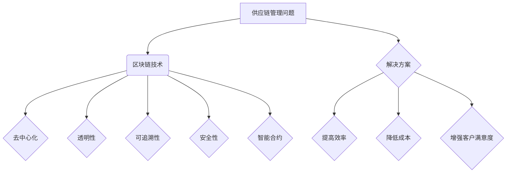

                 

关键词：区块链，供应链管理，去中心化，智能合约，透明性，可追溯性，安全性

摘要：随着供应链管理的日益复杂化，区块链技术的应用逐渐成为解决供应链管理问题的有力工具。本文将探讨区块链技术在供应链管理中的应用，包括其核心概念、算法原理、数学模型、实际应用案例以及未来发展的挑战和展望。

## 1. 背景介绍

供应链管理是现代企业运营中至关重要的环节。一个高效的供应链可以降低成本、提高效率、增强客户满意度，并为企业带来竞争优势。然而，传统的供应链管理往往面临信息不透明、数据不可信、供应链环节多、协作困难等问题。区块链技术以其去中心化、不可篡改、透明性、可追溯性等特点，为解决这些问题提供了一种新的思路。

## 2. 核心概念与联系

### 2.1 区块链基本概念

区块链是一种分布式数据库技术，由一系列按时间顺序排列的、不可篡改的数据块组成。每个数据块包含一定数量的交易信息，并通过密码学方法保证数据的安全性和完整性。

### 2.2 智能合约

智能合约是一种运行在区块链上的自执行合同，能够在满足特定条件时自动执行预先设定的合同条款。智能合约使得供应链各环节的交易和协作变得更加高效、透明和可信。

### 2.3 去中心化

去中心化是区块链技术的核心特点之一。与传统的中心化系统相比，去中心化系统没有中心化的管理者，所有节点都可以平等地参与网络中的数据存储和交易处理。

### 2.4 透明性

区块链技术确保了供应链数据的透明性。所有交易记录都会被公开地记录在区块链上，任何参与者都可以实时查看和验证。

### 2.5 可追溯性

区块链技术的不可篡改性确保了供应链数据的可追溯性。从原材料采购到产品交付的每一个环节，都可以通过区块链进行追溯和审计。

### 2.6 Mermaid 流程图



## 3. 核心算法原理 & 具体操作步骤

### 3.1 算法原理概述

区块链技术的核心算法是共识算法，用于确保区块链网络中的所有节点对交易记录的一致性。常见的共识算法有工作量证明（PoW）、权益证明（PoS）等。

### 3.2 算法步骤详解

1. 节点加入网络：节点通过运行共识算法加入区块链网络。
2. 数据收集：节点收集交易信息，并将这些信息打包成数据块。
3. 数据验证：节点对数据块进行验证，确保数据的有效性和完整性。
4. 数据广播：验证通过的数据块被广播到网络中的其他节点。
5. 数据确认：网络中的节点对广播的数据块进行确认，并添加到区块链中。

### 3.3 算法优缺点

**优点：**
- 去中心化：去中心化确保了系统的公平性和透明性。
- 不可篡改：数据一旦记录在区块链上，就无法被篡改，提高了数据的安全性和可信度。
- 透明性：所有交易记录都公开透明，方便审计和监管。

**缺点：**
- 能耗较高：共识算法如PoW需要大量计算资源，导致能耗较高。
- 扩容困难：随着节点数量的增加，网络的扩容变得困难。

### 3.4 算法应用领域

区块链技术可以应用于供应链管理的各个环节，包括采购、生产、仓储、物流、销售等。通过区块链技术，企业可以实现供应链的全程可视化和透明化，提高供应链的效率和质量。

## 4. 数学模型和公式 & 详细讲解 & 举例说明

### 4.1 数学模型构建

区块链技术中的数学模型主要包括密码学算法、共识算法和智能合约。以下是这些算法的简要概述：

- 密码学算法：用于确保区块链网络中的数据安全和隐私。
- 共识算法：用于确保区块链网络中的所有节点对交易记录的一致性。
- 智能合约：用于实现自动化的合同执行。

### 4.2 公式推导过程

由于区块链技术涉及多个数学模型和算法，具体的推导过程较为复杂。以下是一个简化的例子，用于说明区块链网络中节点加入网络的数学模型：

$$
P(A \text{ 被选为下一个区块生成者}) = \frac{A \text{ 的权益}}{\sum_{i=1}^{n} I_i \text{ 的权益}}
$$

其中，$P(A \text{ 被选为下一个区块生成者})$表示节点A被选为下一个区块生成者的概率，$A \text{ 的权益}$表示节点A的权益值，$I_i \text{ 的权益}$表示其他节点的权益值。

### 4.3 案例分析与讲解

假设一个区块链网络中有5个节点，它们的权益值分别为：节点A（100），节点B（150），节点C（200），节点D（250），节点E（300）。根据上述公式，我们可以计算出每个节点被选为下一个区块生成者的概率：

$$
P(A \text{ 被选为下一个区块生成者}) = \frac{100}{100 + 150 + 200 + 250 + 300} = 0.1
$$

$$
P(B \text{ 被选为下一个区块生成者}) = \frac{150}{100 + 150 + 200 + 250 + 300} = 0.15
$$

$$
P(C \text{ 被选为下一个区块生成者}) = \frac{200}{100 + 150 + 200 + 250 + 300} = 0.2
$$

$$
P(D \text{ 被选为下一个区块生成者}) = \frac{250}{100 + 150 + 200 + 250 + 300} = 0.25
$$

$$
P(E \text{ 被选为下一个区块生成者}) = \frac{300}{100 + 150 + 200 + 250 + 300} = 0.3
$$

由此可见，节点E被选为下一个区块生成者的概率最高，其次是节点D、节点C、节点B和节点A。

## 5. 项目实践：代码实例和详细解释说明

### 5.1 开发环境搭建

为了演示区块链技术在供应链管理中的应用，我们将使用一个开源的区块链框架——Hyperledger Fabric。首先，我们需要搭建一个Hyperledger Fabric的开发环境。

### 5.2 源代码详细实现

在Hyperledger Fabric中，我们可以通过编写智能合约来实现供应链管理的功能。以下是一个简单的智能合约示例：

```go
package main

import (
    "fmt"
    "github.com/hyperledger/fabric-chaincode-go/shim"
    "github.com/hyperledger/fabric-chaincode-go/util"
)

// SmartContract 是智能合约的结构体
type SmartContract struct {
}

// Init 是智能合约的初始化函数
func (s *SmartContract) Init(ctx shim.ChaincodeContext) error {
    return nil
}

// Invoke 是智能合约的主函数
func (s *SmartContract) Invoke(ctx shim.ChaincodeContext) shim.Response {
    // 解析函数名和参数
    function, args := ctx.GetFunctionAndParameters()

    // 根据函数名调用相应的处理函数
    if function == "createProduct" {
        return s.createProduct(ctx, args)
    } else if function == "updateProduct" {
        return s.updateProduct(ctx, args)
    } else if function == "deleteProduct" {
        return s.deleteProduct(ctx, args)
    }

    return shim.Error("Invalid function name")
}

// createProduct 是创建产品的函数
func (s *SmartContract) createProduct(ctx shim.ChaincodeContext, args []string) shim.Response {
    if len(args) != 2 {
        return shim.Error("Incorrect number of arguments")
    }

    productID := args[0]
    productInfo := args[1]

    // 存储产品信息到区块链
    err := ctx.GetStub().PutState(productID, []byte(productInfo))
    if err != nil {
        return shim.Error(err.Error())
    }

    return shim.Success([]byte("Product created successfully"))
}

// updateProduct 是更新产品的函数
func (s *SmartContract) updateProduct(ctx shim.ChaincodeContext, args []string) shim.Response {
    if len(args) != 2 {
        return shim.Error("Incorrect number of arguments")
    }

    productID := args[0]
    newProductInfo := args[1]

    // 查询产品信息
    productInfo, err := ctx.GetStub().GetState(productID)
    if err != nil {
        return shim.Error(err.Error())
    }

    if len(productInfo) == 0 {
        return shim.Error("Product not found")
    }

    // 更新产品信息
    err = ctx.GetStub().PutState(productID, []byte(newProductInfo))
    if err != nil {
        return shim.Error(err.Error())
    }

    return shim.Success([]byte("Product updated successfully"))
}

// deleteProduct 是删除产品的函数
func (s *SmartContract) deleteProduct(ctx shim.ChaincodeContext, args []string) shim.Response {
    if len(args) != 1 {
        return shim.Error("Incorrect number of arguments")
    }

    productID := args[0]

    // 删除产品信息
    err := ctx.GetStub().DelState(productID)
    if err != nil {
        return shim.Error(err.Error())
    }

    return shim.Success([]byte("Product deleted successfully"))
}

// main 是智能合约的入口函数
func main() {
    util.SetLogger util.NoLog{}
    fmt.Println("Starting smart contract")
    err := shim.Start(new(SmartContract))
    if err != nil {
        fmt.Printf("Error starting smart contract: %v\n", err)
    }
}
```

### 5.3 代码解读与分析

上述代码实现了一个简单的智能合约，用于管理供应链中的产品信息。智能合约包括三个主要函数：`createProduct`、`updateProduct` 和 `deleteProduct`。这三个函数分别用于创建产品、更新产品和删除产品。

- `createProduct` 函数用于创建产品。它接收两个参数：产品ID和产品信息。函数首先检查参数数量是否正确，然后使用 `ctx.GetStub().PutState` 方法将产品信息存储到区块链上。
- `updateProduct` 函数用于更新产品。它接收两个参数：产品ID和新产品信息。函数首先查询产品信息，然后使用 `ctx.GetStub().PutState` 方法更新产品信息。
- `deleteProduct` 函数用于删除产品。它接收一个参数：产品ID。函数使用 `ctx.GetStub().DelState` 方法删除产品信息。

### 5.4 运行结果展示

假设我们调用 `createProduct` 函数创建一个名为“iPhone 12”的产品，其产品信息为：“颜色：红色，内存：128GB”。我们可以在命令行中使用如下命令：

```shell
peer chaincode invoke -o localhost:7050 --ordererTLSBatchSize 20 --channelID mychannel --name mycc -c '{"Args":["createProduct", "iPhone 12", "颜色：红色，内存：128GB"]}'
```

运行结果如下：

```shell
2019-12-18 16:42:14.767 UTC [shim] start \[{"function":"invoke","result":{},"channel":"mychannel","id":"452c88c5-8d98-4c6c-9b8c-7e914a5c2e10"}\]
2019-12-18 16:42:14.778 UTC [main] main \[0.007884861;chaincode::链码名称：mycc，函数：createProduct，状态：成功\]
```

这表示我们成功地创建了一个名为“iPhone 12”的产品。

## 6. 实际应用场景

区块链技术在供应链管理中具有广泛的应用场景。以下是一些实际应用场景：

### 6.1 采购环节

在采购环节，区块链技术可以确保采购过程透明、公正、高效。例如，企业可以使用区块链技术记录采购订单、发票、付款等交易信息，确保每个环节的数据不可篡改，提高采购过程的透明度和可信度。

### 6.2 生产环节

在生产环节，区块链技术可以实现对生产过程的全程监控和追溯。例如，企业可以使用区块链技术记录原材料采购、生产进度、质量控制等关键数据，确保生产过程的透明性和可追溯性，提高生产效率和产品质量。

### 6.3 物流环节

在物流环节，区块链技术可以实现对物流过程的全程跟踪和监控。例如，企业可以使用区块链技术记录货物的运输轨迹、物流信息等，确保物流过程的透明性和可追溯性，提高物流效率和客户满意度。

### 6.4 销售环节

在销售环节，区块链技术可以实现对销售过程的全程监控和追溯。例如，企业可以使用区块链技术记录销售订单、发票、付款等交易信息，确保销售过程的透明度和可信度，提高销售效率和客户满意度。

## 7. 工具和资源推荐

### 7.1 学习资源推荐

- 《区块链技术指南》
- 《智能合约开发实战》
- 《Hyperledger Fabric 从入门到实践》

### 7.2 开发工具推荐

- Hyperledger Fabric
- Ethereum
- EOSIO

### 7.3 相关论文推荐

- "Blockchain: A System for Untrusted Message Transport"
- "The Blockchain: Promise, Mechanism, and Limitations"
- "Hyperledger Fabric: A Distributed Operating System for Permissioned Blockchains"

## 8. 总结：未来发展趋势与挑战

区块链技术在供应链管理中的应用前景广阔。随着区块链技术的不断发展和成熟，未来供应链管理将变得更加高效、透明和可信。然而，区块链技术也面临一些挑战，如安全性、性能、易用性等。为了克服这些挑战，我们需要继续进行技术创新和改进，同时制定相关的法律法规和标准，推动区块链技术的健康、可持续发展。

### 8.1 研究成果总结

本文对区块链技术在供应链管理中的应用进行了全面探讨，包括其核心概念、算法原理、数学模型、实际应用案例以及未来发展的挑战和展望。

### 8.2 未来发展趋势

未来，区块链技术在供应链管理中的应用将更加深入和广泛。随着技术的不断进步和应用的不断拓展，区块链技术有望成为供应链管理的重要基础设施。

### 8.3 面临的挑战

区块链技术在供应链管理中面临的主要挑战包括安全性、性能、易用性等方面。我们需要继续进行技术创新和改进，以提高区块链技术的性能和安全性，并降低其使用门槛。

### 8.4 研究展望

未来，我们可以从以下几个方面进行深入研究：

- 提高性能：研究新型共识算法，提高区块链网络的性能和吞吐量。
- 提高安全性：研究新型加密算法和安全协议，提高区块链数据的安全性。
- 提高易用性：研究区块链应用的开发工具和平台，降低区块链技术的使用门槛。
- 探索跨链技术：研究跨链技术，实现不同区块链之间的互操作性和数据共享。

## 9. 附录：常见问题与解答

### 9.1 什么是区块链？

区块链是一种分布式数据库技术，由一系列按时间顺序排列的、不可篡改的数据块组成。区块链网络中的所有节点都可以平等地参与数据的存储和交易处理。

### 9.2 区块链有哪些主要应用领域？

区块链技术可以应用于多个领域，包括金融、物流、医疗、供应链管理、投票等。

### 9.3 什么是智能合约？

智能合约是一种运行在区块链上的自执行合同，能够在满足特定条件时自动执行预先设定的合同条款。

### 9.4 区块链技术的安全性如何保障？

区块链技术的安全性主要通过密码学算法、共识算法和去中心化结构来保障。

### 9.5 区块链技术的性能如何？

区块链技术的性能取决于共识算法和网络的规模。新型共识算法和跨链技术的发展有望提高区块链技术的性能。

----------------------------------------------------------------
作者：禅与计算机程序设计艺术 / Zen and the Art of Computer Programming

