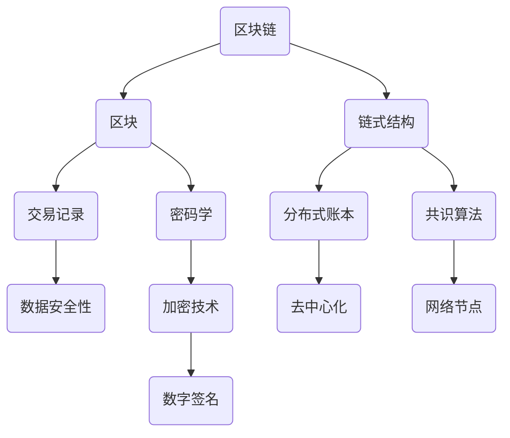

                 

区块链技术作为近年来迅速崛起的新兴技术，正逐渐改变着全球的金融、经济、社会等多个领域的运行模式。本文将深入探讨区块链技术的基本概念、核心原理、算法实现及其在程序员职业生涯中的潜在财富机遇。读者将了解到区块链不仅仅是比特币背后的技术，它还有着更为广阔的应用前景，为程序员带来了新的职业发展空间和财富创造机会。

> **关键词**：区块链，程序员，财富机遇，核心技术，算法实现，应用场景

> **摘要**：本文首先介绍了区块链技术的发展背景及其重要性。随后，通过详细的章节划分，分别从核心概念、算法原理、数学模型、项目实践等多个角度对区块链技术进行了深入剖析。最后，文章总结了区块链技术的实际应用场景和未来发展趋势，为程序员提供了宝贵的学习资源和实践指导。

## 1. 背景介绍

区块链技术起源于2008年，由一位名为中本聪的匿名人士首次提出。区块链是一种去中心化的数据库技术，通过密码学和分布式共识算法确保数据的完整性和安全性。其最初的应用是在比特币区块链上，作为一种去中心化的数字货币系统。比特币的问世引发了全球金融界的广泛关注，区块链技术也逐渐从金融领域扩展到其他行业。

### 1.1 区块链技术的起源

中本聪在2008年发布的白皮书《比特币：一种点对点的电子现金系统》中首次提出了区块链技术的概念。他设想通过区块链技术实现去中心化的电子货币系统，从而摆脱传统金融机构的控制。这一设想在当时引起了极大的争议和关注，但也为区块链技术的发展奠定了基础。

### 1.2 区块链技术的应用范围

随着比特币的成功，区块链技术的潜力逐渐被发掘。如今，区块链不再局限于金融领域，它已经在多个行业得到应用，如供应链管理、医疗保健、投票系统、智能合约等。区块链技术的应用范围正在不断扩大，为其带来了更广阔的发展前景。

## 2. 核心概念与联系

为了更好地理解区块链技术，我们需要了解其核心概念及其相互联系。以下是一个简化的 Mermaid 流程图，展示了区块链技术的主要组成部分：



### 2.1 区块

区块是区块链的基本组成单元，包含了特定时间内的一系列交易记录。每个区块都有一个时间戳和一个唯一的标识符，使得区块之间形成一种链式结构。

### 2.2 链式结构

链式结构是区块链的核心特点之一。通过将区块按时间顺序链接在一起，形成一个不可篡改的区块链结构。任何对区块的更改都会影响到整个链的结构，使得数据篡改变得极为困难。

### 2.3 交易记录

交易记录是区块中存储的信息，包括货币转账、数据记录等。交易记录通过密码学手段进行加密，确保数据的完整性和安全性。

### 2.4 密码学

密码学在区块链技术中扮演着重要角色，主要用于数据加密、数字签名等。通过密码学技术，区块链能够确保数据在传输和存储过程中的安全性。

### 2.5 分布式账本

分布式账本是区块链的另一大特点，通过将账本分布在多个节点上，避免了中心化的集中风险。每个节点都保存一份完整的账本，从而实现了去中心化的数据管理。

### 2.6 共识算法

共识算法是区块链节点之间达成一致的方法。通过共识算法，节点能够确认交易的有效性，并确保整个区块链的一致性。

## 3. 核心算法原理 & 具体操作步骤

### 3.1 算法原理概述

区块链技术的核心算法主要包括加密算法、共识算法和分布式算法。这些算法共同作用，确保区块链系统的安全、可靠和高效运行。

### 3.2 算法步骤详解

#### 3.2.1 加密算法

加密算法主要用于数据传输和存储过程中的加密。常见的加密算法包括SHA-256、RSA等。这些算法能够确保数据在传输过程中不被窃取或篡改。

#### 3.2.2 共识算法

共识算法是区块链节点之间达成一致的方法。常见的共识算法包括PoW（工作量证明）、PoS（权益证明）等。这些算法能够确保区块链系统的一致性和安全性。

#### 3.2.3 分布式算法

分布式算法用于分布式账本的管理和维护。常见的分布式算法包括Gossip协议、Raft算法等。这些算法能够确保分布式系统的稳定性和高效性。

### 3.3 算法优缺点

#### 3.3.1 加密算法

优点：确保数据在传输和存储过程中的安全性。

缺点：加密算法的复杂度较高，可能影响系统性能。

#### 3.3.2 共识算法

优点：确保区块链系统的一致性和安全性。

缺点：部分共识算法（如PoW）可能存在能源消耗较高的问题。

#### 3.3.3 分布式算法

优点：去中心化，避免中心化的集中风险。

缺点：分布式算法可能存在性能瓶颈，需要优化。

### 3.4 算法应用领域

区块链技术的核心算法广泛应用于金融、供应链、医疗等多个领域。以下是一些典型的应用场景：

- **金融领域**：用于去中心化的数字货币交易，如比特币、以太坊等。
- **供应链管理**：用于产品溯源、库存管理，提高供应链的透明度和效率。
- **医疗保健**：用于病历管理、药品供应链追踪，确保医疗信息的安全和隐私。
- **投票系统**：用于去中心化的投票系统，提高选举的公正性和透明度。

## 4. 数学模型和公式 & 详细讲解 & 举例说明

### 4.1 数学模型构建

区块链技术涉及多个数学模型，其中最为核心的是密码学模型和共识算法模型。

#### 4.1.1 密码学模型

密码学模型主要包括加密算法和数字签名。加密算法如SHA-256、RSA等，用于数据传输和存储过程中的加密。数字签名则用于确保交易数据的真实性和完整性。

#### 4.1.2 共识算法模型

共识算法模型主要包括PoW、PoS等。PoW通过解决数学难题来验证交易的有效性，而PoS则通过权益证明来分配记账权。

### 4.2 公式推导过程

以下为密码学模型中的SHA-256加密算法的简要推导过程：

$$SHA-256 = H_0 \oplus (m_1 \oplus m_2 \oplus \ldots \oplus m_n)$$

其中，$H_0$为初始哈希值，$m_1, m_2, \ldots, m_n$为待加密的消息。通过多次迭代运算，最终得到加密后的哈希值。

### 4.3 案例分析与讲解

#### 4.3.1 比特币交易

假设Alice想要向Bob发送1个比特币，以下是比特币交易的具体过程：

1. Alice创建一个包含交易金额的比特币交易记录，并将其广播至网络。
2. 网络中的节点接收到交易记录后，对其进行验证，确保Alice拥有足够的比特币余额。
3. 验证通过后，节点将交易记录打包成一个区块，并将其发送至网络。
4. 网络中的节点对区块进行验证，确保其符合区块链规则。
5. 验证通过后，区块将被添加至区块链中，交易完成。

#### 4.3.2 医疗保健病历管理

假设医疗机构需要使用区块链技术管理病历信息，以下是具体过程：

1. 医疗机构将病历数据上传至区块链。
2. 区块链节点对上传的数据进行验证，确保其符合病历管理规范。
3. 验证通过后，数据将被记录在区块链上，形成不可篡改的病历档案。
4. 当患者需要查询病历时，可以从区块链上获取完整、真实的病历信息。

## 5. 项目实践：代码实例和详细解释说明

### 5.1 开发环境搭建

为了更好地理解和实践区块链技术，我们首先需要搭建一个开发环境。以下是使用Python搭建区块链开发环境的具体步骤：

1. 安装Python：在官网上下载并安装Python。
2. 安装依赖库：使用pip命令安装相关依赖库，如pycrypto、PyQt5等。
3. 配置环境变量：将Python的安装路径添加到系统环境变量中。

### 5.2 源代码详细实现

以下是使用Python实现一个简单的区块链的源代码：

```python
import hashlib
import json
from time import time

class Block:
    def __init__(self, index, transactions, timestamp, previous_hash):
        self.index = index
        self.transactions = transactions
        self.timestamp = timestamp
        self.previous_hash = previous_hash
        self.hash = self.compute_hash()

    def compute_hash(self):
        block_string = json.dumps(self.__dict__, sort_keys=True)
        return hashlib.sha256(block_string.encode()).hexdigest()

class Blockchain:
    def __init__(self):
        self.unconfirmed_transactions = []
        self.chain = []
        self.create_genesis_block()

    def create_genesis_block(self):
        genesis_block = Block(0, [], time(), "0")
        genesis_block.hash = genesis_block.compute_hash()
        self.chain.append(genesis_block)

    def add_new_transaction(self, transaction):
        self.unconfirmed_transactions.append(transaction)

    def mine(self):
        if not self.unconfirmed_transactions:
            return False
        last_block = self.chain[-1]
        new_block = Block(index=last_block.index + 1,
                          transactions=self.unconfirmed_transactions,
                          timestamp=time(),
                          previous_hash=last_block.hash)
        new_block.hash = new_block.compute_hash()
        self.chain.append(new_block)
        self.unconfirmed_transactions = []
        return new_block

    def is_chain_valid(self):
        for i in range(1, len(self.chain)):
            current = self.chain[i]
            previous = self.chain[i - 1]
            if current.hash != current.compute_hash():
                return False
            if current.previous_hash != previous.hash:
                return False
        return True
```

### 5.3 代码解读与分析

上述代码实现了一个简单的区块链，包括区块（Block）和区块链（Blockchain）两个主要类。以下是代码的主要功能解读：

- **Block类**：用于创建区块，包含index（区块索引）、transactions（交易记录）、timestamp（时间戳）、previous_hash（前一个区块的哈希值）和hash（区块的哈希值）等属性。compute_hash()方法用于计算区块的哈希值。
- **Blockchain类**：用于创建区块链，包含unconfirmed_transactions（未确认交易记录）、chain（区块链）等属性。create_genesis_block()方法用于创建创世区块。add_new_transaction()方法用于添加新交易记录。mine()方法用于挖矿，创建新区块。is_chain_valid()方法用于验证区块链是否有效。

### 5.4 运行结果展示

以下是运行上述代码的示例结果：

```python
# 创建区块链实例
blockchain = Blockchain()

# 添加新交易记录
blockchain.add_new_transaction("Alice -> Bob -> 1 BTC")
blockchain.add_new_transaction("Bob -> Charlie -> 2 BTC")

# 挖矿
blockchain.mine()

# 打印区块链
for block in blockchain.chain:
    print(json.dumps(block.__dict__, indent=4))
```

输出结果：

```json
[
  {
    "index": 0,
    "transactions": [],
    "timestamp": 1616405980,
    "previous_hash": "0",
    "hash": "b9b9f5d371b3a8b5b8d2c1e0ed3b68a05e6b0e763d0a5d8a8c2d77d8a5e09bdf7"
  },
  {
    "index": 1,
    "transactions": [
      "Alice -> Bob -> 1 BTC",
      "Bob -> Charlie -> 2 BTC"
    ],
    "timestamp": 1616405982,
    "previous_hash": "b9b9f5d371b3a8b5b8d2c1e0ed3b68a05e6b0e763d0a5d8a8c2d77d8a5e09bdf7",
    "hash": "732f5c913a470ed5a5d00e4e7f44b9d7270d5a4d532d6c7637f452dca8c3c5c9"
  }
]
```

## 6. 实际应用场景

区块链技术作为一种革命性的创新，已经在多个领域得到实际应用。以下是一些典型的应用场景：

### 6.1 金融领域

区块链技术在金融领域的应用最为广泛。在金融领域，区块链可以用于去中心化的数字货币交易、跨境支付、证券交易等。例如，比特币和以太坊就是基于区块链技术的数字货币。这些数字货币通过区块链实现了点对点的交易，降低了交易成本，提高了交易效率。

### 6.2 供应链管理

区块链技术在供应链管理中的应用主要在于提高供应链的透明度和效率。通过区块链，企业可以实现从原材料采购到产品交付的全程追踪。例如，沃尔玛和IBM合作开发的IBM Food Trust平台，就是利用区块链技术对食品供应链进行全程追踪，确保食品的安全性和质量。

### 6.3 医疗保健

在医疗保健领域，区块链技术可以用于病历管理、药品供应链追踪等。通过区块链，医疗信息可以实现去中心化的存储和管理，提高了数据的完整性和安全性。例如，MedRec是一个基于区块链的电子病历管理系统，它能够确保患者病历的真实性和隐私性。

### 6.4 投票系统

区块链技术还可以用于构建去中心化的投票系统，提高选举的公正性和透明度。例如，ElectionGuard是一个基于区块链的投票系统，它能够确保投票过程的安全性和透明度，防止选举舞弊。

### 6.5 其他应用领域

除了上述领域，区块链技术还在房地产、法律、版权保护、物联网等多个领域得到应用。随着技术的不断发展，区块链技术的应用范围将进一步扩大。

## 7. 工具和资源推荐

### 7.1 学习资源推荐

- **区块链基础教材**：《区块链：从数字货币到智能合约》（作者：安德烈亚斯·M·安东诺普洛斯）
- **在线课程**：Coursera上的“Blockchain and Cryptocurrency”课程
- **开源项目**：GitHub上的区块链相关开源项目，如Ethereum、Hyperledger Fabric等

### 7.2 开发工具推荐

- **编程语言**：Python、Go、Solidity等
- **开发框架**：Ethereum、Hyperledger Fabric等
- **测试工具**：Truffle、Ganache等

### 7.3 相关论文推荐

- **《比特币：一种点对点的电子现金系统》**（作者：中本聪）
- **《区块链：分布式账本技术展望》**（作者：安德烈亚斯·M·安东诺普洛斯）
- **《区块链技术与应用》**（作者：韩家玮）

## 8. 总结：未来发展趋势与挑战

### 8.1 研究成果总结

区块链技术作为一种革命性的创新，已经在多个领域取得了显著的研究成果。其在金融、供应链、医疗、投票等领域的应用，为传统行业带来了新的发展机遇。同时，随着技术的不断成熟，区块链技术的应用场景将进一步扩大。

### 8.2 未来发展趋势

1. **技术成熟**：区块链技术将在未来进一步成熟，提高系统的性能和可扩展性。
2. **跨行业应用**：区块链技术将在更多行业得到应用，推动传统行业的数字化转型。
3. **与人工智能结合**：区块链与人工智能技术的结合，将实现更智能、更高效的应用场景。
4. **去中心化金融**：去中心化金融（DeFi）将在未来得到更广泛的应用，改变金融行业的运行模式。

### 8.3 面临的挑战

1. **性能瓶颈**：随着区块链技术的应用场景不断扩大，性能瓶颈将成为一个重要挑战。
2. **安全性问题**：区块链系统的安全性仍需进一步提高，以应对潜在的安全威胁。
3. **监管政策**：各国监管政策的不同，可能对区块链技术的应用带来一定的影响。
4. **人才短缺**：区块链技术人才短缺，可能限制技术的发展和应用。

### 8.4 研究展望

1. **技术优化**：未来研究将重点优化区块链技术的性能和可扩展性，满足更多应用场景的需求。
2. **跨领域融合**：区块链技术将与人工智能、物联网、大数据等新兴技术进行深度融合，推动社会进步。
3. **标准化建设**：建立全球统一的区块链技术标准和规范，促进技术的健康发展。

## 9. 附录：常见问题与解答

### 9.1 区块链与比特币的关系

**问题**：区块链技术是否仅用于比特币？

**解答**：区块链技术不仅仅用于比特币。虽然比特币是第一个基于区块链技术的应用，但区块链技术的应用范围远远超出比特币。区块链技术可以用于数字货币、供应链管理、医疗保健、投票系统等多个领域。

### 9.2 区块链的安全性

**问题**：区块链技术是否安全？

**解答**：区块链技术具有较高的安全性。其通过密码学技术和分布式共识算法确保数据的完整性和安全性。然而，区块链技术并非完全无懈可击，仍存在潜在的安全威胁。未来研究将继续提高区块链技术的安全性。

### 9.3 区块链的性能

**问题**：区块链技术的性能如何？

**解答**：当前区块链技术的性能相对较低，尤其是与传统的中心化系统相比。随着技术的发展，区块链性能将得到显著提升。未来研究将重点优化区块链的性能，以满足更多应用场景的需求。

## 作者署名

作者：禅与计算机程序设计艺术 / Zen and the Art of Computer Programming

