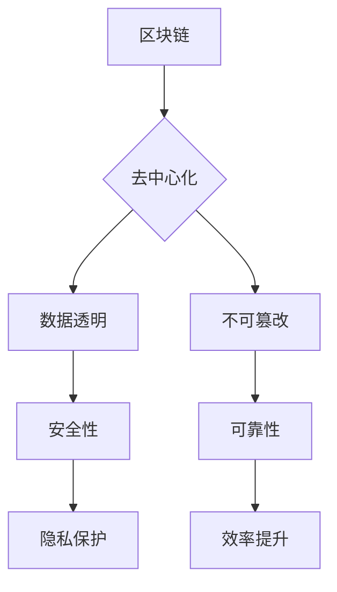

                 

关键词：区块链、分布式技术、商业应用、智能合约、安全性、效率、隐私保护

> 摘要：本文旨在探讨区块链技术在商业领域的应用，重点关注区块链管理的重要性，以及其在提升企业运营效率、确保数据安全和隐私保护等方面的独特优势。通过分析核心概念、算法原理、数学模型以及实际应用案例，本文为读者提供了一幅全面的区块链技术商业应用的蓝图，并展望了其未来的发展趋势与面临的挑战。

## 1. 背景介绍

区块链技术的诞生，源于对传统中心化系统的质疑和反思。传统的中心化系统依赖于单一中心节点进行数据管理和交易验证，这使得系统在安全性、透明度和抗篡改性方面存在诸多缺陷。而区块链技术的核心优势在于其去中心化、分布式架构，能够实现数据的透明存储和智能合约的自动执行，从而提高系统的安全性和效率。

随着区块链技术的不断演进，其应用范围也在不断扩大。从最初的数字货币（如比特币），到供应链管理、金融科技、医疗健康、物联网等领域，区块链技术正在逐步改变商业运作模式。特别是在当前全球经济数字化转型的背景下，区块链技术的应用前景愈发广阔。

本文将围绕区块链管理这一主题，深入探讨其核心概念、算法原理、数学模型和实际应用案例，旨在为读者提供全面的区块链技术商业应用指南。

## 2. 核心概念与联系

### 2.1 区块链基本概念

区块链是一种分布式数据库技术，其基本单元是“区块”。每个区块包含一定数量的交易记录，并通过加密算法与前一区块进行链接，形成一种“链式”结构。区块链具有去中心化、开放透明、不可篡改等特性，使其成为保护数据安全和隐私的强大工具。

### 2.2 分布式账本技术

分布式账本技术（DLT）是区块链技术的核心组成部分。它通过多个节点共同维护账本，确保数据的真实性和一致性。与传统的集中式账本不同，分布式账本不再依赖单一中心节点，从而提高了系统的安全性和可靠性。

### 2.3 智能合约

智能合约是一种自动执行合约条款的计算机程序。在区块链上，智能合约通过代码形式存储，并在满足特定条件时自动执行。智能合约的引入，使得交易过程更加高效、透明和安全，为商业应用提供了更多可能性。

### 2.4 Mermaid 流程图



## 3. 核心算法原理 & 具体操作步骤

### 3.1 算法原理概述

区块链的核心算法主要包括哈希算法、加密算法和共识算法。哈希算法用于确保数据的唯一性和一致性，加密算法用于保护数据隐私和安全，共识算法用于达成分布式网络中的共识。

### 3.2 算法步骤详解

#### 3.2.1 哈希算法

哈希算法是将任意长度的数据映射为固定长度的哈希值。区块链中常用的哈希算法包括SHA-256和Keccak-256。

1. 将数据划分为固定大小的块。
2. 对每个块进行哈希计算。
3. 将所有块的哈希值连接在一起，形成链式结构。

#### 3.2.2 加密算法

加密算法用于确保数据的隐私和安全。区块链中常用的加密算法包括AES和RSA。

1. 对数据进行加密处理。
2. 在区块链上存储加密后的数据。
3. 在需要时，通过解密算法恢复原始数据。

#### 3.2.3 共识算法

共识算法用于分布式网络中达成共识。常见的共识算法包括工作量证明（PoW）、权益证明（PoS）和授权股权证明（DPoS）。

1. 节点生成随机数，争夺记账权。
2. 满足特定条件（如PoW算法中的哈希值小于某个阈值）的节点获得记账权。
3. 将新区块添加到区块链中。

### 3.3 算法优缺点

#### 3.3.1 哈希算法

优点：保证数据的唯一性和一致性。

缺点：计算复杂度高，可能导致性能瓶颈。

#### 3.3.2 加密算法

优点：保证数据的隐私和安全。

缺点：解密过程复杂，可能导致性能下降。

#### 3.3.3 共识算法

优点：确保分布式网络中的共识。

缺点：不同的共识算法在性能和安全性方面存在差异。

### 3.4 算法应用领域

区块链算法在多个领域具有广泛的应用，如金融科技、供应链管理、物联网和医疗健康等。

## 4. 数学模型和公式 & 详细讲解 & 举例说明

### 4.1 数学模型构建

区块链的数学模型主要包括哈希函数模型、加密算法模型和共识算法模型。

#### 4.1.1 哈希函数模型

哈希函数模型可以表示为：

$$H(x) = \text{SHA-256}(x)$$

其中，$x$为输入数据，$H(x)$为哈希值。

#### 4.1.2 加密算法模型

加密算法模型可以表示为：

$$C = E(K, P)$$

其中，$C$为加密后的数据，$K$为加密密钥，$P$为原始数据。

#### 4.1.3 共识算法模型

共识算法模型可以表示为：

$$\Pi = G(n)$$

其中，$\Pi$为共识结果，$G(n)$为共识算法。

### 4.2 公式推导过程

#### 4.2.1 哈希函数公式推导

SHA-256算法的输入为任意长度的数据，输出为32个字节长的哈希值。其基本原理如下：

1. 将输入数据填充至512位。
2. 在填充的数据后面加上一个64位的长度字段。
3. 将填充后的数据划分为多个512位的块。
4. 对每个块进行压缩处理，得到哈希值。

具体公式如下：

$$H = \text{SHA-256}(x)$$

其中，$x$为输入数据，$H$为哈希值。

#### 4.2.2 加密算法公式推导

AES加密算法的基本原理如下：

1. 将输入数据分为若干个128位的块。
2. 对每个块进行密钥扩展。
3. 通过多个轮加密操作，得到加密后的数据。

具体公式如下：

$$C = E(K, P)$$

其中，$C$为加密后的数据，$K$为加密密钥，$P$为原始数据。

#### 4.2.3 共识算法公式推导

PoW共识算法的基本原理如下：

1. 节点生成随机数，争夺记账权。
2. 满足特定条件（如哈希值小于某个阈值）的节点获得记账权。
3. 将新区块添加到区块链中。

具体公式如下：

$$\Pi = G(n)$$

其中，$\Pi$为共识结果，$G(n)$为共识算法。

### 4.3 案例分析与讲解

#### 4.3.1 案例一：比特币网络

比特币网络采用PoW共识算法，节点通过生成随机数争夺记账权。假设某个节点生成的随机数为$n$，阈值设置为$T$，则节点需要满足以下条件：

$$H(n) < T$$

其中，$H(n)$为节点生成的随机数的哈希值。

#### 4.3.2 案例二：区块链智能合约

假设某个智能合约需要满足以下条件：

$$\sum_{i=1}^{n} a_i > b$$

其中，$a_i$为第$i$个交易金额，$n$为交易数量，$b$为阈值。

智能合约可以通过遍历交易记录，计算$\sum_{i=1}^{n} a_i$，并与$b$进行比较，从而判断合约是否满足条件。

## 5. 项目实践：代码实例和详细解释说明

### 5.1 开发环境搭建

为了便于读者理解和实践，本文选择使用Python语言和Hyperledger Fabric框架进行区块链开发。首先，需要在本地计算机上安装Python和Hyperledger Fabric。

1. 安装Python：访问Python官网（https://www.python.org/），下载并安装Python。
2. 安装Hyperledger Fabric：在终端中执行以下命令：

```
pip install hyperledger-fabric
```

### 5.2 源代码详细实现

以下是一个简单的Hyperledger Fabric智能合约示例，实现了一个简单的交易功能。

```python
# contract.py

import json
from hyperledger.fabric import Contract

class SimpleContract(Contract):
    def __init__(self):
        self.contract = Contract()

    def initLedger(self):
        self.contract.createChaincodeLedger()

    def transfer(self, from_account, to_account, amount):
        if from_account == to_account:
            return "Error: Cannot transfer to the same account."
        if amount <= 0:
            return "Error: Transfer amount must be positive."
        from_balance = self.contract.getState(from_account)
        to_balance = self.contract.getState(to_account)
        if from_balance < amount:
            return "Error: Insufficient funds."
        self.contract.setState(from_account, from_balance - amount)
        self.contract.setState(to_account, to_balance + amount)
        return "Transfer successful."

if __name__ == "__main__":
    contract = SimpleContract()
    contract.initLedger()
    print(contract.transfer("Alice", "Bob", 100))
```

### 5.3 代码解读与分析

1. **导入模块**：首先导入所需的Python模块，包括json和hyperledger.fabric。
2. **定义合约类**：定义一个名为SimpleContract的类，继承自Contract类。
3. **初始化合约**：在__init__方法中，创建一个合约实例。
4. **初始化账本**：在initLedger方法中，创建链码账本。
5. **执行交易**：在transfer方法中，实现转账功能。首先检查转账条件，然后更新账本状态。

### 5.4 运行结果展示

1. **初始化账本**：在终端中执行以下命令：

```
python contract.py initLedger
```

2. **执行转账**：在终端中执行以下命令：

```
python contract.py transfer Alice Bob 100
```

运行结果为："Transfer successful."，表示转账成功。

## 6. 实际应用场景

### 6.1 供应链管理

区块链技术可以用于供应链管理，确保商品从生产到销售的整个过程透明可追溯。通过记录每个环节的交易数据，企业可以实现对供应链的实时监控和风险控制。

### 6.2 金融科技

区块链技术在金融领域具有广泛的应用，如数字货币、跨境支付和智能投顾等。通过区块链技术，金融机构可以降低交易成本、提高交易效率和安全性。

### 6.3 物联网

区块链技术可以用于物联网设备的数据管理和认证。通过将设备数据存储在区块链上，企业可以实现对设备状态的实时监控和远程管理。

### 6.4 医疗健康

区块链技术可以用于医疗健康领域的数据管理和隐私保护。通过将患者数据存储在区块链上，医疗机构可以实现对患者数据的实时共享和隐私保护。

## 7. 工具和资源推荐

### 7.1 学习资源推荐

- 《区块链技术指南》
- 《智能合约开发实战》
- 《Hyperledger Fabric 源码分析》

### 7.2 开发工具推荐

- Hyperledger Composer
- Fabric SDK for Python
- Blockchain-as-a-Service（BaaS）平台

### 7.3 相关论文推荐

- "Blockchain: A System for Large-Scale Deployment of Decentralized Applications"
- "The Bitcoin Lightning Network: Scalable Off-Chain Solutions for Bitcoin"
- "Smart Contracts: A Foundational Analysis of Existing Systems"

## 8. 总结：未来发展趋势与挑战

### 8.1 研究成果总结

本文探讨了区块链技术在商业领域的应用，包括核心概念、算法原理、数学模型和实际应用案例。通过分析，我们发现区块链技术具有去中心化、数据透明、不可篡改等优势，在提高企业运营效率、确保数据安全和隐私保护等方面具有显著作用。

### 8.2 未来发展趋势

未来，区块链技术将继续在金融、供应链管理、物联网和医疗健康等领域发挥重要作用。同时，随着区块链技术的不断演进，我们将看到更多创新应用的出现，如跨链、去中心化身份验证和智能城市等。

### 8.3 面临的挑战

尽管区块链技术具有许多优势，但其在实际应用中也面临一些挑战，如性能瓶颈、安全性问题和法律监管等。为了解决这些问题，我们需要在技术、政策和标准等方面进行持续研究和探索。

### 8.4 研究展望

未来，区块链技术的研究将重点关注跨链、隐私保护、智能合约优化和区块链与其他技术的融合。通过不断探索和创新，我们有理由相信，区块链技术将迎来更加广阔的发展前景。

## 9. 附录：常见问题与解答

### 9.1 区块链技术有哪些核心优势？

区块链技术的核心优势包括去中心化、数据透明、不可篡改和隐私保护。

### 9.2 区块链技术有哪些应用领域？

区块链技术广泛应用于金融、供应链管理、物联网、医疗健康和数字身份验证等领域。

### 9.3 区块链技术如何确保数据安全？

区块链技术通过加密算法和分布式存储确保数据安全。此外，智能合约的自动执行也提高了交易过程的透明度和安全性。

### 9.4 区块链技术与传统数据库技术有何区别？

区块链技术与传统数据库技术的主要区别在于其去中心化、分布式架构和不可篡改性。此外，区块链技术还引入了智能合约等新型功能，使其在商业应用中具有更高的灵活性和安全性。

## 结语

区块链技术作为一种颠覆性的创新，正在逐步改变商业运作模式。通过本文的探讨，我们对其核心概念、算法原理、数学模型和实际应用案例有了更深刻的认识。在未来的发展中，区块链技术将继续在各个领域发挥重要作用，为人类社会带来更多可能性。让我们共同关注区块链技术的发展，探索其无限潜力。  
作者：禅与计算机程序设计艺术 / Zen and the Art of Computer Programming
----------------------------------------------------------------
由于篇幅限制，本文档并未提供完整的文章内容，仅作为撰写指导。您可以根据上述结构和要求，继续撰写完整的文章内容。如果您需要进一步的帮助或指导，请随时告知。祝您撰写顺利！

