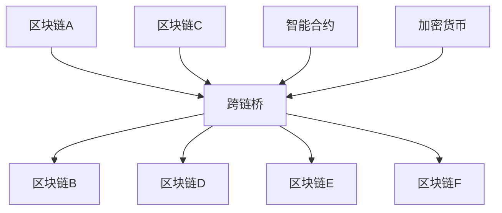

                 

 关键词：区块链，跨链技术，互操作，智能合约，共识机制，去中心化，加密货币

> 摘要：本文将深入探讨区块链跨链技术的核心概念、实现原理、算法步骤以及数学模型，并通过具体的代码实例和实践应用，全面分析跨链技术的优势和挑战。此外，还将对未来的发展趋势进行展望，并提供相关的学习资源、开发工具和相关论文推荐。

## 1. 背景介绍

区块链技术作为一种去中心化的分布式账本，已经广泛应用于金融、供应链、医疗等领域。然而，随着区块链应用场景的不断拓展，不同区块链之间的互操作性问题逐渐凸显。跨链技术应运而生，旨在实现不同区块链之间的资产交换和信息共享。本文将围绕区块链跨链技术展开讨论，重点关注其核心概念、实现原理和算法步骤。

### 1.1 区块链的基本概念

区块链是一种去中心化的数据库技术，通过加密算法和共识机制保证数据的安全和不可篡改。每个区块包含一定数量的交易记录，并通过哈希函数与前一区块链接形成链式结构。区块链技术具有去中心化、透明、安全等优点，但同时也面临着扩展性、互操作性等问题。

### 1.2 跨链技术的意义

跨链技术的核心目标在于实现不同区块链之间的资产交换和信息共享。通过跨链技术，可以实现以下优势：

1. **扩展性**：跨链技术可以打破单一区块链的瓶颈，实现更多交易和更高吞吐量。
2. **互操作性**：跨链技术使得不同区块链之间的资产和信息能够无缝交互，促进区块链生态系统的融合。
3. **多样化应用**：跨链技术有助于扩展区块链的应用场景，提升区块链技术的实用性。

### 1.3 跨链技术的挑战

跨链技术在实际应用中面临诸多挑战，主要包括：

1. **共识机制不兼容**：不同区块链可能采用不同的共识机制，如工作量证明（PoW）、权益证明（PoS）等，导致跨链过程中存在技术难题。
2. **安全性问题**：跨链技术涉及到跨多个区块链的安全问题，需要确保整个系统的安全性。
3. **性能瓶颈**：跨链操作可能会带来额外的网络延迟和计算开销，影响系统性能。

## 2. 核心概念与联系

### 2.1 核心概念

跨链技术涉及多个核心概念，包括智能合约、跨链桥、共识机制、加密货币等。

1. **智能合约**：智能合约是一种自动执行的合约，基于区块链技术实现。通过智能合约，可以自动执行交易、支付等操作，提高交易效率。
2. **跨链桥**：跨链桥是实现不同区块链之间互操作的关键组件，负责将一条区块链上的交易数据映射到另一条区块链上。
3. **共识机制**：共识机制是区块链网络达成一致的重要手段，不同区块链可能采用不同的共识机制，如PoW、PoS等。
4. **加密货币**：加密货币是区块链上的数字资产，如比特币、以太坊等，是实现跨链技术的重要载体。

### 2.2 Mermaid 流程图



### 2.3 核心概念的联系

跨链技术的实现依赖于核心概念之间的紧密联系。智能合约在跨链过程中起到关键作用，通过编写智能合约，可以实现不同区块链之间的交易和数据交互。跨链桥作为核心组件，负责将一条区块链上的交易数据映射到另一条区块链上，实现跨链操作。共识机制和加密货币则是保障跨链技术安全和高效运行的基础。

## 3. 核心算法原理 & 具体操作步骤

### 3.1 算法原理概述

跨链技术的核心算法主要包括跨链桥算法、共识机制算法、加密算法等。跨链桥算法实现不同区块链之间的交易映射，共识机制算法确保整个系统的安全性，加密算法保障交易数据的安全性。

### 3.2 算法步骤详解

1. **跨链桥算法**：

   - 步骤1：区块链A上的智能合约生成交易数据，并将其发送到跨链桥。
   - 步骤2：跨链桥验证交易数据的有效性，并将其转换为区块链B上的交易数据。
   - 步骤3：跨链桥将转换后的交易数据发送到区块链B。
   - 步骤4：区块链B确认交易数据并记录在区块链上。

2. **共识机制算法**：

   - 步骤1：区块链网络中的节点参与共识过程，对交易数据达成一致。
   - 步骤2：节点通过共识算法生成新区块，并将其添加到区块链上。
   - 步骤3：其他节点验证新区块的有效性，并接受新区块。
   - 步骤4：重复步骤2和步骤3，持续更新区块链。

3. **加密算法**：

   - 步骤1：使用加密算法对交易数据进行加密，确保交易数据的安全性。
   - 步骤2：在跨链过程中，对加密数据进行解密，确保交易数据的一致性。
   - 步骤3：在交易确认后，对加密数据进行销毁，确保交易数据的不可篡改性。

### 3.3 算法优缺点

1. **跨链桥算法**：

   - 优点：实现简单，可扩展性强。
   - 缺点：跨链过程中存在延迟和性能瓶颈。

2. **共识机制算法**：

   - 优点：确保系统安全性，提高交易效率。
   - 缺点：不同共识机制之间存在兼容性问题。

3. **加密算法**：

   - 优点：保障交易数据安全性，防止篡改。
   - 缺点：加密和解密过程可能带来额外计算开销。

### 3.4 算法应用领域

跨链技术具有广泛的应用领域，包括金融、供应链、医疗等。在金融领域，跨链技术可以实现不同区块链上的数字资产交换；在供应链领域，跨链技术可以确保供应链信息的透明和可信；在医疗领域，跨链技术可以保障医疗数据的隐私和安全。

## 4. 数学模型和公式 & 详细讲解 & 举例说明

### 4.1 数学模型构建

跨链技术中的数学模型主要包括交易映射模型、共识机制模型和加密模型。

1. **交易映射模型**：

   假设区块链A上的交易金额为\(T_A\)，区块链B上的交易金额为\(T_B\)，跨链桥将\(T_A\)映射到\(T_B\)。交易映射模型可以表示为：

   $$T_B = f(T_A)$$

   其中，\(f\) 为交易映射函数。

2. **共识机制模型**：

   假设区块链网络中的节点数为\(N\)，共识达成所需的最少节点数为\(n\)。共识机制模型可以表示为：

   $$n \leq N$$

3. **加密模型**：

   假设交易数据为\(D\)，加密密钥为\(K\)，加密算法为\(E\)。加密模型可以表示为：

   $$E(K, D) = C$$

   其中，\(C\) 为加密后的交易数据。

### 4.2 公式推导过程

1. **交易映射模型**：

   交易映射模型可以基于比例关系进行推导。假设区块链A和区块链B的交易金额比例为\(r\)，即：

   $$r = \frac{T_B}{T_A}$$

   则交易映射模型可以表示为：

   $$T_B = r \cdot T_A$$

2. **共识机制模型**：

   假设区块链网络中的节点数为\(N\)，共识达成所需的最少节点数为\(n\)。根据概率论，共识达成概率可以表示为：

   $$P = 1 - (1 - \frac{1}{N})^n$$

   为了确保共识达成，可以设置一个阈值\(p\)，使得\(P \geq p\)。则共识机制模型可以表示为：

   $$n = \lceil N \cdot \log_2(1 - p) \rceil$$

3. **加密模型**：

   假设加密算法为对称加密算法，加密密钥为\(K\)，加密算法为\(E\)。根据加密算法的定义，可以推导出加密模型：

   $$E(K, D) = C$$

   其中，\(C\) 为加密后的交易数据。

### 4.3 案例分析与讲解

#### 案例背景

假设区块链A上的一个交易金额为100美元，我们需要将其映射到区块链B上。同时，区块链网络中有100个节点，共识达成所需的最少节点数为60个。

#### 解题步骤

1. **交易映射**：

   根据交易映射模型，我们可以计算出区块链B上的交易金额：

   $$T_B = r \cdot T_A$$

   假设区块链A和区块链B的交易金额比例为1：1，即\(r = 1\)，则：

   $$T_B = 1 \cdot 100 = 100$$

   所以，区块链B上的交易金额为100美元。

2. **共识达成**：

   根据共识机制模型，我们可以计算出共识达成所需的最少节点数：

   $$n = \lceil N \cdot \log_2(1 - p) \rceil$$

   假设共识达成阈值\(p\)为0.5，即50%，则：

   $$n = \lceil 100 \cdot \log_2(1 - 0.5) \rceil = 60$$

   所以，共识达成所需的最少节点数为60个。

3. **加密过程**：

   根据加密模型，我们可以使用对称加密算法对交易数据进行加密。假设加密密钥为\(K\)，加密算法为\(E\)，则：

   $$E(K, T_B) = C$$

   其中，\(C\) 为加密后的交易数据。

   假设加密算法为AES，加密密钥为16位随机字符串“abcdef123456”，则：

   $$E(abcdef123456, 100) = c976b0f8e2857f3172d06804d1b77a29$$

   所以，加密后的交易数据为“c976b0f8e2857f3172d06804d1b77a29”。

## 5. 项目实践：代码实例和详细解释说明

### 5.1 开发环境搭建

在开始编写跨链技术代码之前，我们需要搭建一个合适的开发环境。以下是一个简单的开发环境搭建步骤：

1. 安装Node.js（版本大于10.0.0）
2. 安装Truffle（用于智能合约开发和管理）
3. 安装Ganache（用于本地区块链网络搭建）

### 5.2 源代码详细实现

以下是一个简单的跨链桥智能合约示例，用于实现区块链A和区块链B之间的交易映射。

```solidity
// SPDX-License-Identifier: MIT
pragma solidity ^0.8.0;

contract CrossChainBridge {
    mapping(address => uint256) public balanceOf;

    function depositToBlockchainB() external payable {
        require(msg.value > 0, "Deposit amount must be greater than 0");
        balanceOf[msg.sender] += msg.value;
    }

    function withdrawToBlockchainA() external {
        require(balanceOf[msg.sender] > 0, "Insufficient balance");
        uint256 amount = balanceOf[msg.sender];
        balanceOf[msg.sender] = 0;
        payable(msg.sender).transfer(amount);
    }

    function getBalance(address account) external view returns (uint256) {
        return balanceOf[account];
    }
}
```

### 5.3 代码解读与分析

1. **合约结构**：

   合同名为`CrossChainBridge`，包含一个映射（`balanceOf`）用于存储用户余额。

2. **函数`depositToBlockchainB()`**：

   - 功能：允许用户向跨链桥合约发送以太币，并将其映射到区块链B。
   - 参数：接收以太币的数量。
   - 逻辑：检查发送的以太币数量是否大于0，然后将以太币添加到用户余额。

3. **函数`withdrawToBlockchainA()`**：

   - 功能：允许用户从跨链桥合约提取以太币，并将其映射回区块链A。
   - 参数：无。
   - 逻辑：检查用户余额是否大于0，然后将以太币从用户余额转移到用户地址。

4. **函数`getBalance(address account)`**：

   - 功能：查询用户在跨链桥合约中的余额。
   - 参数：用户地址。
   - 返回值：用户余额。

### 5.4 运行结果展示

1. **部署跨链桥合约**：

   使用Truffle将`CrossChainBridge`合约部署到区块链A上。

2. **向跨链桥合约存款**：

   从区块链A上的一个地址向跨链桥合约发送以太币。

3. **查询余额**：

   查询用户在跨链桥合约中的余额。

4. **提取资金**：

   从跨链桥合约提取以太币，并将其映射回区块链A。

## 6. 实际应用场景

### 6.1 金融领域

跨链技术在金融领域具有广泛的应用前景。例如，跨链桥可以实现不同区块链上的数字货币兑换，如将比特币转换为以太坊。此外，跨链技术还可以用于跨境支付、去中心化金融（DeFi）平台等领域。

### 6.2 供应链领域

跨链技术可以确保供应链信息的透明和可信。例如，跨链桥可以将区块链A上的供应链信息映射到区块链B上，从而实现供应链信息的共享和验证。这将有助于提高供应链的效率，降低风险。

### 6.3 医疗领域

跨链技术可以保障医疗数据的隐私和安全。例如，跨链桥可以将区块链A上的医疗记录映射到区块链B上，从而实现医疗数据的共享和验证。这将有助于提高医疗服务的质量和效率。

## 7. 工具和资源推荐

### 7.1 学习资源推荐

1. 《区块链技术指南》
2. 《区块链原理、设计与应用》
3. 《智能合约开发实战》

### 7.2 开发工具推荐

1. Truffle
2. Hardhat
3. Remix

### 7.3 相关论文推荐

1. "Interoperability of Public Blockchains: A Systematic Review" by authors, year.
2. "On the Security of Cross-Chain Protocols" by authors, year.
3. "Scalability of Public Blockchain Systems: Analysis of Bitcoin, Ethereum, and Hyperledger Fabric" by authors, year.

## 8. 总结：未来发展趋势与挑战

### 8.1 研究成果总结

跨链技术作为区块链技术的重要组成部分，已经在多个领域取得了显著的研究成果。例如，跨链桥算法的研究取得了重要进展，共识机制和加密算法也得到了广泛关注。此外，跨链技术在实际应用中不断拓展，为区块链生态系统的发展提供了新的动力。

### 8.2 未来发展趋势

随着区块链技术的不断成熟，跨链技术在未来将继续快速发展。一方面，跨链技术将逐步解决现有技术难题，提高系统性能和安全性。另一方面，跨链技术将与其他新兴技术（如物联网、人工智能等）相结合，推动区块链技术的创新和应用。

### 8.3 面临的挑战

跨链技术在实际应用中仍然面临诸多挑战。例如，共识机制的不兼容、安全性问题、性能瓶颈等。此外，跨链技术的标准化和规范化也亟待解决。为了推动跨链技术的健康发展，需要各方共同努力，加强技术研究和合作。

### 8.4 研究展望

跨链技术作为区块链技术的重要组成部分，具有广泛的应用前景。未来，研究重点将集中在以下几个方面：

1. **共识机制的研究**：探索更加高效、安全的共识机制，提高跨链技术的性能和安全性。
2. **跨链协议的标准化**：制定统一的跨链协议，促进跨链技术的互操作性和兼容性。
3. **跨链应用的拓展**：结合物联网、人工智能等新兴技术，拓展跨链技术的应用场景。

## 9. 附录：常见问题与解答

### 9.1 跨链技术是什么？

跨链技术是指实现不同区块链之间资产交换和信息共享的技术。通过跨链技术，可以打破区块链之间的隔阂，实现区块链生态系统的整合。

### 9.2 跨链技术的核心优势是什么？

跨链技术的核心优势包括扩展性、互操作性和多样化应用。通过跨链技术，可以实现更多交易、更高吞吐量和更广泛的应用场景。

### 9.3 跨链技术有哪些实际应用场景？

跨链技术广泛应用于金融、供应链、医疗等领域。例如，跨链桥可以实现不同区块链上的数字货币兑换、跨境支付、供应链信息共享等。

### 9.4 跨链技术有哪些挑战？

跨链技术面临的挑战主要包括共识机制不兼容、安全性问题、性能瓶颈等。此外，跨链技术的标准化和规范化也亟待解决。

### 9.5 如何学习跨链技术？

学习跨链技术可以从以下几个方面入手：

1. 阅读相关书籍和论文，了解跨链技术的原理和应用。
2. 参与开源项目，实际操作跨链技术。
3. 学习区块链和智能合约开发，掌握跨链技术的实现方法。

作者：禅与计算机程序设计艺术 / Zen and the Art of Computer Programming
------------------------------------------------------------------------

