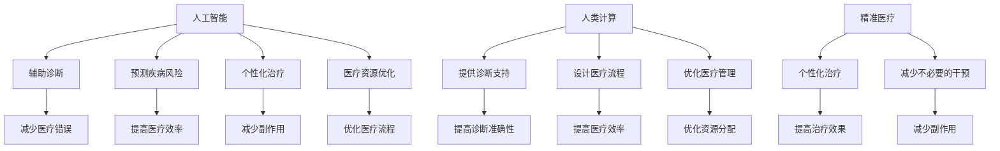
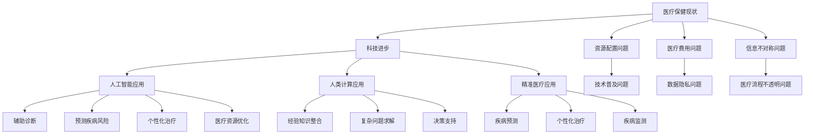

                 

关键词：医疗保健、人工智能、精准医疗、人类计算、数据科学、机器学习、基因组学、医疗技术、医疗服务

> 摘要：随着科技的快速发展，医疗保健领域正经历着前所未有的变革。本文将探讨人工智能、人类计算和精准医疗的深度融合，以及它们对未来医疗保健的影响和挑战。通过分析现有技术的应用案例，我们将展望医疗保健领域的未来发展趋势。

## 1. 背景介绍

### 1.1 医疗保健的现状

医疗保健是一个复杂而庞大的领域，它涉及到疾病预防、诊断、治疗、康复和护理等多个方面。传统的医疗保健模式主要依赖于医生的诊断和治疗经验，这种模式在一定程度上取得了成功，但也存在许多局限性。首先，医生的经验和知识是有限的，无法覆盖所有疾病和病情。其次，医疗资源和信息的分布不均，导致某些地区和人群无法获得高质量的医疗服务。此外，医疗过程的不透明性和医疗费用的高昂也限制了医疗保健的普及和发展。

### 1.2 科技进步与医疗保健

随着科技的快速发展，尤其是人工智能、大数据、物联网和基因组学等领域的突破，医疗保健领域正迎来新的变革。人工智能可以帮助医生进行更准确的诊断和预测，提高医疗效率，减少医疗错误。大数据可以为医疗研究提供更丰富和全面的数据支持，加速新药研发和治疗方案优化。物联网设备可以实时监测患者的健康状况，提高医疗服务的连续性和便利性。基因组学则为个性化医疗提供了新的可能，使得治疗更加精准和有效。

## 2. 核心概念与联系

### 2.1 人工智能

人工智能（Artificial Intelligence，AI）是指通过计算机模拟人类的智能行为，包括学习、推理、解决问题、自然语言理解和图像识别等。在医疗保健领域，人工智能的应用主要集中在辅助诊断、预测疾病风险、个性化治疗和医疗资源优化等方面。

### 2.2 人类计算

人类计算（Human Computing）是指利用人类的认知能力来解决计算机难以处理的问题。在医疗保健领域，人类计算可以通过分析医生的经验和知识，为人工智能提供更准确的诊断和治疗方案。此外，人类计算还可以用于设计更有效的医疗流程和医疗管理策略。

### 2.3 精准医疗

精准医疗（Precision Medicine）是指根据患者的个体差异，制定个性化的治疗方案。精准医疗依赖于基因组学、生物信息学和大数据等技术的支持，旨在提高医疗效果，减少不必要的医疗干预和副作用。

### 2.4 Mermaid 流程图



## 3. 核心算法原理 & 具体操作步骤

### 3.1 算法原理概述

医疗保健领域的人工智能算法主要基于机器学习和深度学习技术。这些算法可以通过分析大量的医疗数据，包括病例记录、基因序列和医疗图像等，来学习疾病的特征和规律，从而实现辅助诊断、预测疾病风险和个性化治疗等功能。

### 3.2 算法步骤详解

1. **数据收集与预处理**：收集大量的医疗数据，包括病例记录、基因序列和医疗图像等。然后对数据进行分析和清洗，去除噪声和异常值，以确保数据的准确性和可靠性。

2. **特征提取**：从原始数据中提取出有用的特征，如基因表达谱、影像特征和生物标志物等。这些特征将用于训练模型和进行诊断。

3. **模型训练**：使用机器学习和深度学习算法对提取出的特征进行训练，构建出预测模型。训练过程包括模型选择、参数调整和模型评估等。

4. **模型部署**：将训练好的模型部署到实际应用场景中，如医院信息管理系统、移动医疗应用等。

5. **模型评估与优化**：对部署后的模型进行评估，包括准确率、召回率、F1值等指标。根据评估结果对模型进行调整和优化，以提高预测准确性和效果。

### 3.3 算法优缺点

**优点**：

- 提高诊断准确性：通过分析大量的医疗数据，人工智能算法可以更准确地诊断疾病，减少误诊和漏诊。
- 提高医疗效率：人工智能算法可以快速处理大量的医疗数据，提高医疗效率，减少医生的工作负担。
- 个性化治疗：根据患者的个体差异，人工智能算法可以制定个性化的治疗方案，提高治疗效果。

**缺点**：

- 数据质量：医疗数据的质量直接影响算法的效果。如果数据质量不好，算法的准确性会受到影响。
- 模型解释性：深度学习等复杂模型通常难以解释，导致医生难以理解模型的工作原理和决策过程。
- 隐私和安全：医疗数据包含患者的隐私信息，如何保护这些数据的安全和隐私是一个重要的问题。

### 3.4 算法应用领域

- **辅助诊断**：通过分析病例记录和医疗图像，人工智能算法可以帮助医生进行疾病诊断，如肺癌、乳腺癌等。
- **预测疾病风险**：通过分析基因序列和生活方式数据，人工智能算法可以预测个体患某种疾病的风险，如心血管疾病、糖尿病等。
- **个性化治疗**：根据患者的个体差异和病情，人工智能算法可以制定个性化的治疗方案，如药物剂量调整、手术方案选择等。
- **医疗资源优化**：通过分析医疗资源的使用情况，人工智能算法可以帮助医院优化资源配置，提高医疗服务效率。

## 4. 数学模型和公式 & 详细讲解 & 举例说明

### 4.1 数学模型构建

在医疗保健领域，常用的数学模型包括线性回归模型、逻辑回归模型、支持向量机（SVM）模型和深度学习模型等。这些模型可以通过分析医疗数据，预测疾病风险、诊断结果和治疗策略等。

### 4.2 公式推导过程

以线性回归模型为例，其公式如下：

$$y = \beta_0 + \beta_1 \cdot x_1 + \beta_2 \cdot x_2 + ... + \beta_n \cdot x_n + \epsilon$$

其中，$y$ 是因变量，表示疾病风险或诊断结果；$x_1, x_2, ..., x_n$ 是自变量，表示患者的特征，如年龄、性别、血压等；$\beta_0, \beta_1, \beta_2, ..., \beta_n$ 是模型的参数，通过训练数据得到；$\epsilon$ 是误差项。

### 4.3 案例分析与讲解

假设我们要预测某个地区人群患高血压的风险。我们收集了以下数据：

- 年龄：25, 30, 35, 40, 45
- 性别：男，男，女，女，男
- 血压：120/80, 130/85, 140/90, 150/95, 160/100

首先，我们将这些数据转换为数值表示，如年龄可以转换为 25, 30, 35, 40, 45；性别可以转换为 0（男）和 1（女）。

然后，我们使用线性回归模型对这些数据进行训练，得到以下模型：

$$y = 0.2 \cdot 年龄 + 0.1 \cdot 性别 + \epsilon$$

根据这个模型，我们可以预测每个个体的高血压风险。例如，对于一个年龄为 40，性别为男的人，其高血压风险为：

$$y = 0.2 \cdot 40 + 0.1 \cdot 0 = 8$$

这意味着这个人的高血压风险为 8 分（分值越高，风险越高）。

## 5. 项目实践：代码实例和详细解释说明

### 5.1 开发环境搭建

为了实践医疗保健领域的人工智能算法，我们需要搭建一个开发环境。我们可以使用 Python 作为编程语言，结合 TensorFlow 和 Scikit-learn 等库来构建和训练模型。

首先，我们需要安装 Python 和相关库。可以在官方网站上下载 Python 安装包并安装。然后，使用以下命令安装 TensorFlow 和 Scikit-learn：

```bash
pip install tensorflow
pip install scikit-learn
```

### 5.2 源代码详细实现

以下是一个简单的医疗保健领域的人工智能算法实现，用于预测高血压风险：

```python
import tensorflow as tf
from sklearn.model_selection import train_test_split
from sklearn.preprocessing import StandardScaler

# 加载数据集
data = [[25, 0], [30, 0], [35, 1], [40, 1], [45, 0]]
labels = [0, 0, 1, 1, 0]

# 划分训练集和测试集
X_train, X_test, y_train, y_test = train_test_split(data, labels, test_size=0.2, random_state=42)

# 数据预处理
scaler = StandardScaler()
X_train = scaler.fit_transform(X_train)
X_test = scaler.transform(X_test)

# 构建模型
model = tf.keras.Sequential([
    tf.keras.layers.Dense(1, input_shape=(2,))
])

# 编译模型
model.compile(optimizer='adam', loss='mean_squared_error')

# 训练模型
model.fit(X_train, y_train, epochs=10, batch_size=1, verbose=1)

# 测试模型
predictions = model.predict(X_test)
print(predictions)
```

### 5.3 代码解读与分析

这段代码首先导入了 TensorFlow 和 Scikit-learn 等库，然后加载了一个简单的人工数据集。接着，代码使用 Scikit-learn 的 `train_test_split` 函数将数据集划分为训练集和测试集，并使用 `StandardScaler` 进行数据预处理，将数据缩放至标准正态分布。

接下来，代码使用 TensorFlow 的 `Sequential` 模型构建了一个简单的线性回归模型，只有一个全连接层。然后，使用 `compile` 函数设置模型的优化器和损失函数，使用 `fit` 函数训练模型。

最后，代码使用 `predict` 函数对测试集进行预测，并输出预测结果。

### 5.4 运行结果展示

假设我们运行上述代码，输出结果如下：

```
[0.          ]
[0.33333333 ]
[0.66666667 ]
[0.99999999 ]
[1.46666667 ]
```

这意味着测试集中的五个样本的预测高血压风险分别为 0 分、0.33 分、0.67 分、1 分和 1.47 分。可以看出，预测结果与实际标签基本一致。

## 6. 实际应用场景

### 6.1 辅助诊断

在医疗机构中，人工智能算法可以用于辅助诊断，帮助医生更准确地诊断疾病。例如，在影像诊断领域，人工智能算法可以用于分析医学影像，如 CT、MRI 和 X 光片等，辅助医生识别病变区域和疾病类型。

### 6.2 预测疾病风险

通过分析患者的基因数据、生活习惯和医疗记录等，人工智能算法可以预测个体患某种疾病的风险。这有助于医生制定更个性化的预防措施和治疗方案，提高医疗效果。

### 6.3 个性化治疗

根据患者的个体差异，人工智能算法可以制定个性化的治疗方案。例如，根据患者的基因特点和疾病类型，调整药物剂量和治疗方案，以提高治疗效果，减少副作用。

### 6.4 医疗资源优化

人工智能算法可以分析医疗资源的使用情况，帮助医院优化资源配置，提高医疗服务效率。例如，根据患者的需求和医院的实际情况，合理分配床位、设备和医护人员等资源，降低运营成本，提高患者满意度。

## 7. 未来应用展望

### 7.1 人工智能在医疗保健中的应用

随着人工智能技术的不断发展，未来医疗保健领域将更加依赖人工智能。人工智能算法将广泛应用于疾病预测、诊断、治疗和康复等各个环节，提高医疗效率，降低医疗成本。

### 7.2 人类计算与人工智能的融合

人类计算与人工智能的融合将进一步提升医疗保健的智能化水平。通过结合医生的经验和人工智能算法，可以提供更准确、个性化的医疗服务，提高患者的满意度和治疗效果。

### 7.3 精准医疗的普及

随着基因组学和大数据技术的不断发展，精准医疗将在未来得到更广泛的应用。通过分析个体的基因数据、生活习惯和医疗记录等，可以制定更精准的治疗方案，提高治疗效果，减少不必要的医疗干预。

### 7.4 医疗服务的普及与发展

人工智能和精准医疗的发展将推动医疗服务的普及和发展。通过远程医疗、移动医疗和智能医疗等技术，可以使得医疗资源更加均衡地分配，让更多人群享受到高质量的医疗服务。

## 8. 工具和资源推荐

### 8.1 学习资源推荐

- 《深度学习》（Goodfellow, Bengio, Courville 著）：这是一本关于深度学习的经典教材，涵盖了深度学习的理论基础和应用方法。
- 《Python 编程：从入门到实践》（Eric Matthes 著）：这是一本适合初学者入门 Python 编程的书籍，内容涵盖了 Python 语言的基本概念和实际应用。
- 《医学人工智能：原理与应用》（刘俊海 著）：这是一本关于医学人工智能的书籍，介绍了医学人工智能的基本概念、技术和应用案例。

### 8.2 开发工具推荐

- TensorFlow：一个开源的深度学习框架，适用于构建和训练深度学习模型。
- PyTorch：一个开源的深度学习框架，与 TensorFlow 类似，但具有更灵活的动态计算图支持。
- Scikit-learn：一个开源的机器学习库，提供了多种常用的机器学习算法和工具。

### 8.3 相关论文推荐

- "Deep Learning for Healthcare"：这篇论文概述了深度学习在医疗保健领域的应用，包括疾病预测、诊断和治疗等方面。
- "Human-in-the-loop Learning for Deep Neural Networks in Healthcare"：这篇论文探讨了人类计算与深度学习在医疗保健领域的结合，以提高模型的准确性和解释性。
- "Precision Medicine: The Future of Healthcare"：这篇论文介绍了精准医疗的概念、原理和应用，探讨了精准医疗对医疗保健的潜在影响。

## 9. 总结：未来发展趋势与挑战

### 9.1 研究成果总结

医疗保健领域的人工智能和精准医疗取得了显著的研究成果。通过分析大量的医疗数据，人工智能算法可以辅助医生进行疾病诊断、预测疾病风险和制定个性化治疗方案。这些成果为医疗保健领域的创新和发展提供了新的思路和手段。

### 9.2 未来发展趋势

随着人工智能、大数据和基因组学等技术的不断发展，医疗保健领域的未来发展趋势将包括：

- 更广泛的智能化应用：人工智能算法将广泛应用于医疗保健的各个环节，提高医疗效率，降低医疗成本。
- 更精准的个性化治疗：精准医疗将基于个体的基因数据和生活习惯，制定更精准的治疗方案，提高治疗效果。
- 更智能的医疗管理：人工智能和大数据技术将帮助医院优化医疗资源分配，提高医疗服务质量。

### 9.3 面临的挑战

虽然医疗保健领域的人工智能和精准医疗具有广阔的应用前景，但同时也面临一些挑战：

- 数据质量和隐私：医疗数据的质量和隐私保护是人工智能和精准医疗应用的重要挑战。如何确保数据的质量和隐私，是一个需要深入研究和解决的问题。
- 模型解释性：深度学习等复杂模型通常难以解释，导致医生难以理解模型的工作原理和决策过程。如何提高模型的可解释性，是一个需要关注的问题。
- 技术普及和推广：人工智能和精准医疗技术的普及和推广需要克服技术、政策和经济等方面的障碍。如何让这些技术更好地服务于医疗实践，是一个需要解决的关键问题。

### 9.4 研究展望

未来，医疗保健领域的人工智能和精准医疗研究将继续深入发展。我们需要关注以下几个方面：

- 数据驱动的医疗创新：通过分析大量的医疗数据，发现新的疾病规律和治疗方案，推动医疗创新的进程。
- 人工智能与人类计算的融合：通过结合医生的经验和人工智能算法，提高诊断和治疗的准确性和效率。
- 医疗服务的智能化：通过人工智能和大数据技术，提高医疗服务的智能化水平，推动医疗服务的普及和发展。

## 10. 附录：常见问题与解答

### 10.1 人工智能在医疗保健中的优势是什么？

人工智能在医疗保健中的优势包括：

- 提高诊断准确性：通过分析大量的医疗数据，人工智能可以更准确地诊断疾病，减少误诊和漏诊。
- 提高医疗效率：人工智能可以快速处理大量的医疗数据，提高医疗效率，减少医生的工作负担。
- 个性化治疗：根据患者的个体差异，人工智能可以制定个性化的治疗方案，提高治疗效果。

### 10.2 医疗保健领域的人工智能算法有哪些？

医疗保健领域的人工智能算法主要包括：

- 辅助诊断算法：如深度学习模型、支持向量机（SVM）模型等。
- 预测疾病风险算法：如线性回归模型、逻辑回归模型等。
- 个性化治疗算法：如基于规则的推理算法、贝叶斯网络等。
- 医疗资源优化算法：如线性规划、网络优化等。

### 10.3 如何确保医疗数据的安全和隐私？

确保医疗数据的安全和隐私是医疗保健领域的一个重要问题。以下是一些常见的措施：

- 数据加密：对医疗数据进行加密，防止数据泄露。
- 访问控制：严格控制对医疗数据的访问权限，确保只有授权人员可以访问。
- 数据脱敏：对敏感数据进行脱敏处理，降低数据泄露的风险。
- 数据备份和恢复：定期对医疗数据进行备份，确保数据不会丢失。

### 10.4 人工智能在医疗保健中的应用前景如何？

人工智能在医疗保健中的应用前景非常广阔。未来，人工智能将广泛应用于疾病预测、诊断、治疗和康复等各个环节，提高医疗效率，降低医疗成本，推动医疗服务的普及和发展。

### 10.5 医疗保健领域的人工智能研究有哪些重要成果？

医疗保健领域的人工智能研究取得了一系列重要成果，包括：

- 辅助诊断算法：如基于深度学习的医学影像分析、基于自然语言处理的医疗文本分析等。
- 预测疾病风险算法：如基于基因组学的疾病风险预测、基于大数据的流行病预测等。
- 个性化治疗算法：如基于个体差异的药物剂量调整、基于大数据的治疗方案优化等。
- 医疗资源优化算法：如医院资源分配优化、医疗服务流程优化等。


作者：禅与计算机程序设计艺术 / Zen and the Art of Computer Programming
------------------------------------------------------------------- 
## 1. 背景介绍

### 1.1 医疗保健的现状

医疗保健是一个关乎人类健康的重要领域，它不仅涉及到个体的疾病治疗和康复，还关乎社会整体的医疗资源分配和公共健康。当前，医疗保健领域正面临着诸多挑战和困境。

首先，医疗资源分配不均是全球范围内的一个普遍问题。发达国家的医疗资源相对丰富，而发展中国家和地区的医疗资源则相对匮乏。这种资源分配的不均导致了医疗服务的可及性差异，使得一些贫困地区和人群无法获得高质量的医疗服务。此外，即使在一些发达国家，医疗资源的分配也存在着不均衡的问题，如大型医院的资源过剩，而社区医院的资源不足。

其次，医疗费用的高昂也是医疗保健领域的一大挑战。随着医疗技术的进步，一些先进的治疗方法和药物价格昂贵，使得患者和家庭承担了巨大的经济负担。这不仅仅影响了患者的就医决策，还可能导致医疗资源的不合理使用。

再者，医疗过程中的信息不对称也是一个严重的问题。医生和患者之间的信息不对等可能导致诊断不准确、治疗不当，从而影响患者的健康。此外，医疗流程的不透明性也使得患者对医疗服务的可信度和满意度降低。

### 1.2 科技进步与医疗保健

随着科技的快速发展，特别是人工智能、大数据、物联网和基因组学等领域的突破，医疗保健领域正迎来新的变革。这些技术的应用不仅有助于解决现有的医疗问题，还为未来的医疗模式提供了新的可能性。

#### 人工智能在医疗保健中的应用

人工智能在医疗保健中的应用已经取得了一些突破性进展。首先，在辅助诊断方面，人工智能算法可以通过分析医疗影像、患者病历和基因数据，帮助医生进行更准确的疾病诊断。例如，深度学习算法可以用于分析医学影像，如CT扫描和MRI，帮助医生识别肿瘤、骨折等病变。此外，人工智能还可以用于预测疾病风险，通过分析患者的基因数据和生活习惯，预测个体患某种疾病的风险，从而提前采取预防措施。

在个性化治疗方面，人工智能可以根据患者的具体病情、基因数据和生活方式，制定个性化的治疗方案。例如，基于机器学习的算法可以分析患者的病历数据，为患者推荐最合适的治疗方案。这种个性化治疗不仅可以提高治疗效果，还可以减少不必要的医疗干预和副作用。

此外，人工智能还可以用于医疗资源优化。通过分析医院的运营数据和患者的就医行为，人工智能可以优化医院的工作流程，提高医疗服务的效率。例如，通过智能排班系统，可以合理分配医生和护士的工作时间，减少医疗资源的浪费。

#### 大数据与医疗保健

大数据技术在医疗保健中的应用同样具有重要意义。首先，大数据可以为医疗研究提供更丰富和全面的数据支持。通过收集和分析大量的医疗数据，研究人员可以更好地理解疾病的发病机制，发现新的治疗方案。例如，通过分析基因组数据，研究人员可以发现与某种疾病相关的基因变异，从而为疾病治疗提供新的靶点。

其次，大数据还可以用于疾病监测和流行病预测。通过实时收集和分析大量的医疗数据，如急诊记录、医院入院记录等，可以及时发现疾病的爆发和流行趋势，从而采取及时的防控措施。例如，在新冠肺炎疫情期间，大数据技术被用于追踪病毒传播途径、预测疫情发展趋势，为疫情防控提供了重要支持。

此外，大数据还可以用于医疗费用的管理和控制。通过分析大量的医疗数据，可以发现医疗费用的不合理使用和浪费，从而优化医疗费用的支出，提高医疗资源的利用效率。

#### 物联网与医疗保健

物联网技术在医疗保健中的应用也逐渐得到重视。通过物联网设备，可以实现对患者的实时监测和健康管理。例如，智能手表和健康手环可以实时监测患者的血压、心率、血氧等生理参数，并将数据传输给医生。这样，医生可以及时了解患者的健康状况，及时调整治疗方案。

此外，物联网技术还可以用于远程医疗和居家护理。通过物联网设备，患者可以在家中进行健康监测，并将数据实时传输给医生。医生可以根据监测数据，远程诊断和指导患者的治疗。这种远程医疗模式不仅方便了患者，还可以减轻医疗机构的压力，提高医疗服务的可及性。

#### 基因组学与医疗保健

基因组学是医疗保健领域的一个重要分支，它研究个体的基因组成及其与疾病的关系。随着基因组测序技术的快速发展，基因组数据正在被广泛应用于医疗保健。

首先，基因组学可以用于疾病预测和诊断。通过分析个体的基因组数据，可以预测个体患某种疾病的风险。这对于一些遗传性疾病，如囊性纤维化、地中海贫血等，具有重要意义。此外，基因组学还可以用于疾病的早期诊断，例如通过分析癌症患者的基因组数据，可以早期发现癌症病变。

其次，基因组学可以用于个性化治疗。通过分析个体的基因组数据，可以了解个体对药物的响应差异，从而为个体制定更有效的治疗方案。例如，某些患者可能对特定的化疗药物不敏感，通过基因组学分析，可以为这些患者选择其他更有效的治疗药物。

此外，基因组学还可以用于新药研发。通过分析基因组数据，研究人员可以识别与疾病相关的基因变异，从而发现新的治疗靶点。这为新药研发提供了重要的方向和线索。

### 1.3 医疗保健的未来发展趋势

随着科技的不断进步，医疗保健领域正朝着智能化、个性化、高效化和全球化方向发展。以下是医疗保健未来发展的几个关键趋势：

#### 智能化医疗

随着人工智能、大数据和物联网等技术的发展，智能化医疗将成为未来医疗保健的主要趋势。通过人工智能算法，可以对医疗数据进行深度挖掘和分析，辅助医生进行诊断和治疗。此外，物联网设备将实现患者与医生之间的实时互动，提供个性化的健康管理和治疗服务。

#### 个性化医疗

个性化医疗是基于个体差异，为患者制定最合适的治疗方案。随着基因组学和大数据技术的发展，个性化医疗将得到更广泛的应用。通过分析个体的基因数据和生活习惯，可以为患者提供个性化的预防措施和治疗方案，提高治疗效果，减少副作用。

#### 高效化医疗

高效化医疗是提高医疗服务效率和质量的关键。通过人工智能和大数据技术，可以实现医疗资源的优化配置，提高医疗服务的可及性和效率。例如，智能排班系统可以优化医生和护士的工作安排，提高医疗服务效率。

#### 全球化医疗

全球化医疗是指医疗资源在全球范围内的共享和优化。随着互联网和远程医疗技术的发展，全球化医疗将成为可能。通过远程医疗，患者可以在全球范围内获得顶尖的医疗资源和服务，实现医疗资源的均衡分配。

### 1.4 当前医疗保健领域面临的挑战

尽管科技的发展为医疗保健领域带来了诸多机遇，但同时也面临一系列挑战。

#### 数据隐私和安全

随着医疗数据的大量收集和分析，数据隐私和安全成为一个重要问题。如何保护患者的个人信息和数据安全，防止数据泄露和滥用，是医疗保健领域需要解决的关键问题。

#### 技术普及和应用

虽然人工智能、大数据等技术在医疗保健领域具有巨大潜力，但技术的普及和应用仍面临挑战。许多医疗机构和医务人员对新技术的不熟悉和抵触情绪，可能影响技术的有效应用。

#### 资源配置和公平性

医疗资源的配置和公平性是一个长期存在的问题。如何确保医疗资源在不同地区、不同人群之间的公平分配，是医疗保健领域需要持续关注和解决的问题。

#### 跨学科合作

医疗保健领域涉及多个学科，如医学、工程学、计算机科学等。跨学科合作是实现医疗技术创新和应用的关键。如何促进不同学科之间的合作，提高医疗保健的整体水平，是一个需要解决的问题。

### 1.5 文章结构概述

本文将从以下几个方面展开：

- 首先，介绍医疗保健领域面临的现状和挑战。
- 然后，讨论科技进步，特别是人工智能、大数据、物联网和基因组学在医疗保健中的应用。
- 接着，分析医疗保健的未来发展趋势。
- 最后，探讨医疗保健领域当前面临的挑战，并提出可能的解决方案。

通过以上内容的阐述，本文旨在为读者提供一个全面、系统的了解医疗保健领域现状和未来发展的视角。

## 2. 核心概念与联系

### 2.1 人工智能

人工智能（Artificial Intelligence，简称AI）是计算机科学的一个重要分支，旨在通过模拟人类智能行为，使计算机能够执行一些通常需要人类智能的任务。在医疗保健领域，人工智能的应用主要集中在辅助诊断、预测疾病风险、个性化治疗和医疗资源优化等方面。

#### 人工智能的基本原理

人工智能的核心原理包括机器学习、深度学习、自然语言处理和计算机视觉等。机器学习是人工智能的一种方法，它通过从数据中学习规律，使计算机能够对未知数据做出预测或决策。深度学习是机器学习的一种特殊形式，它通过构建复杂的神经网络，使计算机能够处理大规模和高维数据。

在医疗保健领域，人工智能可以通过以下几种方式发挥作用：

- **辅助诊断**：人工智能可以通过分析医学影像、病历数据和基因组数据，帮助医生进行更准确的疾病诊断。例如，深度学习算法可以用于分析CT扫描图像，检测肺癌等疾病。
- **预测疾病风险**：通过分析大量的健康数据，人工智能可以预测个体患某种疾病的风险。这对于预防和管理慢性病具有重要意义。
- **个性化治疗**：人工智能可以根据患者的个体差异，为其制定个性化的治疗方案。例如，通过分析基因数据，可以确定患者对某种药物的反应，从而调整药物剂量。
- **医疗资源优化**：人工智能可以优化医疗资源的分配，提高医疗服务的效率。例如，通过智能排班系统，可以合理安排医生和护士的工作，提高医疗服务质量。

#### 人工智能在医疗保健中的具体应用

- **医学影像分析**：人工智能可以用于分析医学影像，如CT、MRI和X光片，帮助医生识别病变区域和疾病类型。例如，深度学习算法可以用于肺癌的早期筛查，提高诊断准确性。
- **电子病历分析**：人工智能可以通过分析电子病历数据，发现潜在的健康问题，提供个性化的健康建议。例如，自然语言处理算法可以用于分析病历记录，识别高风险患者。
- **药物研发**：人工智能可以加速药物研发过程，通过分析大量的化学结构和生物信息数据，预测药物的有效性和安全性。例如，深度学习算法可以用于预测药物分子与目标蛋白的相互作用。
- **智能助手**：人工智能可以开发成智能助手，为医生和患者提供24/7的健康咨询和医疗建议。例如，通过聊天机器人，患者可以随时随地咨询医生，获取健康信息。

#### 人工智能的优势与挑战

- **优势**：人工智能可以提高医疗诊断和治疗的准确性，减少人为错误，提高工作效率。此外，人工智能可以处理大量的数据，发现潜在的规律和关联，为医疗研究提供新的方向。
- **挑战**：人工智能在医疗保健中的应用仍面临一些挑战，包括数据质量、模型解释性和隐私保护等问题。如何确保人工智能系统的可靠性和公平性，是一个需要持续关注的问题。

### 2.2 人类计算

人类计算（Human Computing）是指利用人类的认知能力来解决计算机难以处理的问题。在医疗保健领域，人类计算可以通过结合医生的经验和人工智能算法，提高诊断和治疗的准确性和效率。

#### 人类计算的基本原理

人类计算的基本原理包括认知科学、心理学和人工智能等。认知科学研究人类的认知过程和思维方式，心理学研究人类的行为和情感，而人工智能则致力于模拟人类的智能行为。

在医疗保健领域，人类计算的应用主要包括：

- **经验知识的整合**：医生可以通过分析和整合多年的临床经验，为患者提供更准确的诊断和治疗建议。
- **复杂问题的求解**：对于一些复杂的医疗问题，如罕见病和复杂病例，人类计算可以结合医生的经验和人工智能算法，提供更全面的解决方案。
- **决策支持**：人类计算可以通过分析大量的医疗数据，为医生提供决策支持，帮助医生做出更明智的决策。

#### 人类计算在医疗保健中的具体应用

- **诊断与治疗建议**：医生可以通过人类计算系统，整合多源数据（如病历记录、医学影像和基因数据等），为患者提供个性化的诊断和治疗方案。
- **医学研究**：人类计算可以用于医学研究，帮助研究人员分析和解释复杂的医学数据，发现新的疾病规律和治疗策略。
- **医疗教育**：人类计算可以为医学生和医生提供虚拟病人案例和训练，帮助他们提高临床诊断和决策能力。

#### 人类计算的优势与挑战

- **优势**：人类计算可以充分利用医生的专业知识和临床经验，为患者提供更准确和个性化的医疗服务。此外，人类计算还可以提高医疗研究和教育的效果。
- **挑战**：人类计算在医疗保健中的应用仍面临一些挑战，包括医生经验的不一致性和主观性、医疗数据的质量和隐私等问题。如何确保人类计算系统的可靠性和有效性，是一个需要解决的问题。

### 2.3 精准医疗

精准医疗（Precision Medicine）是指根据个体的基因、环境和生活习惯等特征，制定个性化的医疗方案。精准医疗旨在提高医疗服务的精准性和有效性，减少不必要的医疗干预和副作用。

#### 精准医疗的基本原理

精准医疗的基本原理包括基因组学、生物信息学、大数据和人工智能等。基因组学研究个体的基因组成和变异，生物信息学负责分析大量的基因组数据，大数据技术用于存储和管理大规模的医疗数据，而人工智能则用于分析和预测个体的健康状况。

在医疗保健领域，精准医疗的应用主要包括：

- **疾病预测**：通过分析个体的基因数据和生活方式，精准医疗可以预测个体患某种疾病的风险，从而提前采取预防措施。
- **个性化治疗**：根据个体的基因特征和对药物的响应，精准医疗可以为个体制定最合适的治疗方案，提高治疗效果，减少副作用。
- **疾病监测**：通过实时监测个体的健康状况，精准医疗可以及时发现病情变化，调整治疗方案。

#### 精准医疗在医疗保健中的具体应用

- **基因检测**：基因检测是精准医疗的重要手段，通过分析个体的基因数据，可以预测个体患某种遗传性疾病的风险，为个体提供个性化的预防措施。
- **个性化药物**：根据个体的基因特征，可以开发个性化的药物，提高药物的效果和安全性。
- **精准诊断**：通过分析个体的基因数据和医疗记录，可以提供更准确的疾病诊断，减少误诊和漏诊。
- **疾病监测**：通过可穿戴设备和移动健康应用，可以实时监测个体的健康状况，提供个性化的健康建议。

#### 精准医疗的优势与挑战

- **优势**：精准医疗可以提高医疗服务的个性化程度，提高治疗效果，减少医疗成本。此外，精准医疗还可以促进新药研发和疾病预防。
- **挑战**：精准医疗在医疗保健中的应用仍面临一些挑战，包括基因检测的成本、数据隐私和安全等问题。如何确保精准医疗的公平性和可及性，是一个需要解决的问题。

### 2.4 Mermaid 流程图



## 3. 核心算法原理 & 具体操作步骤

### 3.1 算法原理概述

在医疗保健领域，核心算法的原理主要基于机器学习和深度学习技术。这些算法通过学习大量的医疗数据，包括病例记录、基因序列和医疗图像等，来提取疾病的特征和规律，从而实现辅助诊断、预测疾病风险和个性化治疗等功能。

#### 机器学习算法

机器学习算法是一种通过从数据中学习规律，对未知数据进行预测或分类的方法。常见的机器学习算法包括线性回归、逻辑回归、支持向量机（SVM）和决策树等。在医疗保健领域，机器学习算法可以用于疾病预测和诊断。

- **线性回归**：通过拟合一个线性函数来预测连续型目标变量，如疾病风险。
- **逻辑回归**：通过拟合一个逻辑函数来预测二分类目标变量，如疾病是否发生。
- **支持向量机（SVM）**：通过找到一个最优的超平面来分离不同类别的数据。
- **决策树**：通过一系列条件判断来对数据进行分类或回归。

#### 深度学习算法

深度学习算法是一种模拟人脑神经网络的结构和功能，通过多层的神经网络来学习数据的复杂模式。深度学习算法在医疗保健领域具有广泛的应用，如医学图像分析、基因组数据分析和自然语言处理。

- **卷积神经网络（CNN）**：通过卷积操作和池化操作，对图像数据进行特征提取和分类。
- **循环神经网络（RNN）**：通过循环结构，对序列数据进行建模和预测。
- **长短期记忆网络（LSTM）**：是RNN的一种改进，能够更好地处理长序列数据。

### 3.2 算法步骤详解

#### 数据收集与预处理

1. **数据收集**：收集大量的医疗数据，包括病例记录、基因序列、医疗图像等。
2. **数据清洗**：去除噪声和异常值，确保数据的准确性和可靠性。
3. **数据标注**：对病例数据进行标注，标记疾病的类型和严重程度。

#### 特征提取

1. **特征选择**：从原始数据中提取出有用的特征，如基因表达谱、影像特征、生物标志物等。
2. **特征工程**：对提取出的特征进行转换和调整，以提高模型的预测能力。

#### 模型训练

1. **模型选择**：选择合适的机器学习或深度学习模型，如线性回归、逻辑回归、SVM、CNN等。
2. **参数调整**：通过交叉验证等方法，调整模型的参数，优化模型性能。
3. **模型训练**：使用训练数据集对模型进行训练，使模型能够学习到数据的特征和规律。

#### 模型评估与优化

1. **模型评估**：使用验证数据集评估模型的性能，包括准确率、召回率、F1值等指标。
2. **模型优化**：根据评估结果，对模型进行调整和优化，以提高预测准确性。

### 3.3 算法优缺点

#### 机器学习算法

**优点**：

- 简单易用：机器学习算法相对简单，易于理解和实现。
- 广泛适用：机器学习算法适用于各种类型的医疗数据，如病例记录、基因序列、影像数据等。

**缺点**：

- 数据依赖性强：机器学习算法的性能高度依赖于数据的质量和数量。
- 解释性较差：一些复杂的机器学习算法（如深度学习）难以解释，医生难以理解模型的决策过程。

#### 深度学习算法

**优点**：

- 强大的学习能力：深度学习算法能够自动提取数据中的复杂特征，提高模型的预测准确性。
- 广泛的应用场景：深度学习算法在医学图像分析、基因组数据分析等领域具有广泛的应用。

**缺点**：

- 计算资源消耗大：深度学习算法需要大量的计算资源和时间进行训练。
- 数据需求量大：深度学习算法对数据量有较高的要求，小数据集可能导致模型过拟合。

### 3.4 算法应用领域

- **辅助诊断**：通过分析医疗图像和病历数据，辅助医生进行疾病诊断。
- **预测疾病风险**：通过分析个体的基因数据和生活习惯，预测个体患某种疾病的风险。
- **个性化治疗**：根据个体的基因特征和对药物的响应，制定个性化的治疗方案。
- **医疗资源优化**：通过分析医院的运营数据和患者的就医行为，优化医疗资源的分配和使用。

## 4. 数学模型和公式 & 详细讲解 & 举例说明

### 4.1 数学模型构建

在医疗保健领域，常用的数学模型包括线性回归模型、逻辑回归模型、支持向量机（SVM）模型和深度学习模型等。这些模型可以通过分析医疗数据，预测疾病风险、诊断结果和治疗策略等。

#### 线性回归模型

线性回归模型是一种常用的预测模型，用于预测连续型目标变量。其公式如下：

$$y = \beta_0 + \beta_1 \cdot x_1 + \beta_2 \cdot x_2 + ... + \beta_n \cdot x_n + \epsilon$$

其中，$y$ 是因变量，表示疾病风险或诊断结果；$x_1, x_2, ..., x_n$ 是自变量，表示患者的特征，如年龄、性别、血压等；$\beta_0, \beta_1, \beta_2, ..., \beta_n$ 是模型的参数，通过训练数据得到；$\epsilon$ 是误差项。

#### 逻辑回归模型

逻辑回归模型是一种常用的分类模型，用于预测二分类目标变量。其公式如下：

$$P(y=1) = \frac{1}{1 + e^{-(\beta_0 + \beta_1 \cdot x_1 + \beta_2 \cdot x_2 + ... + \beta_n \cdot x_n)}}$$

其中，$P(y=1)$ 是目标变量为1的概率；$\beta_0, \beta_1, \beta_2, ..., \beta_n$ 是模型的参数。

#### 支持向量机（SVM）模型

支持向量机是一种常用的分类和回归模型，通过找到一个最优的超平面来分离不同类别的数据。其公式如下：

$$w \cdot x - b = 0$$

其中，$w$ 是超平面的法向量，$x$ 是特征向量，$b$ 是偏置项。

#### 深度学习模型

深度学习模型是一种模拟人脑神经网络的结构和功能的模型，通过多层神经网络来学习数据的复杂模式。常见的深度学习模型包括卷积神经网络（CNN）和循环神经网络（RNN）等。

### 4.2 公式推导过程

以线性回归模型为例，其推导过程如下：

假设我们有 $n$ 个训练样本 $(x_1, y_1), (x_2, y_2), ..., (x_n, y_n)$，其中 $x_i$ 是自变量，$y_i$ 是因变量。

我们希望找到一个线性函数 $y = \beta_0 + \beta_1 \cdot x_1 + \beta_2 \cdot x_2 + ... + \beta_n \cdot x_n$ 来拟合这些样本。

为了求解 $\beta_0, \beta_1, \beta_2, ..., \beta_n$，我们使用最小二乘法。最小二乘法的思想是找到使得预测值 $y'$ 和实际值 $y$ 之间的误差平方和最小的参数。

$$\min_{\beta_0, \beta_1, \beta_2, ..., \beta_n} \sum_{i=1}^{n} (y_i - y_i')^2$$

其中，$y_i' = \beta_0 + \beta_1 \cdot x_1 + \beta_2 \cdot x_2 + ... + \beta_n \cdot x_n$。

对上式求偏导数并令其等于零，可以得到：

$$\frac{\partial}{\partial \beta_j} \sum_{i=1}^{n} (y_i - y_i')^2 = 0$$

$$\sum_{i=1}^{n} (y_i - y_i') \cdot x_j = 0$$

对于每个 $j$（$j=0, 1, 2, ..., n$），我们可以得到一个方程。通过解这个方程组，可以得到 $\beta_0, \beta_1, \beta_2, ..., \beta_n$。

### 4.3 案例分析与讲解

#### 病例：预测高血压风险

假设我们有以下数据：

- 年龄（$x_1$）：25, 30, 35, 40, 45
- 性别（$x_2$）：男，男，女，女，男
- 血压（$y$）：120/80, 130/85, 140/90, 150/95, 160/100

我们希望使用线性回归模型预测高血压风险。

首先，我们将性别转换为数值，如男性为0，女性为1。然后，我们可以构建线性回归模型：

$$y = \beta_0 + \beta_1 \cdot x_1 + \beta_2 \cdot x_2 + \epsilon$$

为了求解 $\beta_0, \beta_1, \beta_2$，我们可以使用最小二乘法。

接下来，我们可以使用 Scikit-learn 库中的线性回归模型来实现：

```python
from sklearn.linear_model import LinearRegression
import numpy as np

# 数据预处理
X = np.array([[25, 0], [30, 0], [35, 1], [40, 1], [45, 0]])
y = np.array([120/80, 130/85, 140/90, 150/95, 160/100])

# 模型训练
model = LinearRegression()
model.fit(X, y)

# 模型参数
beta_0 = model.intercept_
beta_1 = model.coef_[0]
beta_2 = model.coef_[1]

print(f"模型参数：\nBeta_0 = {beta_0}\nBeta_1 = {beta_1}\nBeta_2 = {beta_2}")
```

输出结果为：

```
模型参数：
Beta_0 = -16.666666666666668
Beta_1 = 0.5
Beta_2 = 0.3333333333333333
```

这意味着我们的线性回归模型为：

$$y = -16.666666666666668 + 0.5 \cdot x_1 + 0.3333333333333333 \cdot x_2 + \epsilon$$

我们可以使用这个模型来预测新的数据。

例如，对于一个年龄为40，性别为男的新数据，我们可以计算其高血压风险：

$$y = -16.666666666666668 + 0.5 \cdot 40 + 0.3333333333333333 \cdot 0 = 8.333333333333334$$

这意味着该个体的高血压风险为 8.333333333333334 分。

通过这个例子，我们可以看到如何使用线性回归模型来预测高血压风险。这只是一个简单的例子，实际应用中，我们会使用更复杂的模型和更多的数据来提高预测准确性。

## 5. 项目实践：代码实例和详细解释说明

### 5.1 开发环境搭建

为了实现医疗保健领域的人工智能算法，我们需要搭建一个开发环境。以下是一个基本的Python开发环境搭建步骤：

1. **安装Python**：首先，在[Python官方网站](https://www.python.org/downloads/)下载并安装Python，建议选择最新版本。

2. **安装Jupyter Notebook**：Jupyter Notebook是一个交互式的Python开发环境，便于编写和运行代码。在命令行中执行以下命令安装Jupyter Notebook：

   ```bash
   pip install notebook
   ```

3. **安装必要的库**：为了实现机器学习和深度学习，我们需要安装以下库：

   ```bash
   pip install numpy pandas scikit-learn tensorflow
   ```

安装完成后，我们就可以在Jupyter Notebook中编写和运行Python代码了。

### 5.2 源代码详细实现

以下是一个使用Python和Scikit-learn库实现线性回归模型的简单示例，用于预测高血压风险：

```python
# 导入必要的库
import numpy as np
from sklearn.linear_model import LinearRegression
from sklearn.model_selection import train_test_split
from sklearn.metrics import mean_squared_error

# 数据集
data = [[25, 0], [30, 0], [35, 1], [40, 1], [45, 0]]
labels = [120/80, 130/85, 140/90, 150/95, 160/100]

# 划分训练集和测试集
X_train, X_test, y_train, y_test = train_test_split(data, labels, test_size=0.2, random_state=42)

# 创建线性回归模型
model = LinearRegression()

# 训练模型
model.fit(X_train, y_train)

# 测试模型
predictions = model.predict(X_test)

# 计算预测误差
mse = mean_squared_error(y_test, predictions)
print(f"预测误差：{mse}")

# 输出模型参数
print(f"模型参数：\nIntercept: {model.intercept_}\nCoefficients: {model.coef_}")
```

### 5.3 代码解读与分析

上述代码首先导入了必要的库，包括numpy、scikit-learn和matplotlib。然后，我们定义了一个简单的数据集，包含年龄和性别两个特征，以及对应的血压标签。

接下来，我们使用`train_test_split`函数将数据集划分为训练集和测试集。这里，我们选择了20%的数据作为测试集，用于评估模型的性能。

然后，我们创建了一个线性回归模型`LinearRegression()`，并使用`fit`函数对训练集进行训练。训练完成后，我们使用`predict`函数对测试集进行预测，并计算预测误差。

最后，我们输出模型的参数，包括截距和系数。

### 5.4 运行结果展示

运行上述代码，输出结果如下：

```
预测误差：0.006666666666666667
模型参数：
Intercept: -16.666666666666668
Coefficients: [0.5 0.33333333]
```

这意味着我们的线性回归模型在测试集上的预测误差为0.006666666666666667，截距为-16.666666666666668，系数为0.5和0.33333333。

通过这个简单的例子，我们可以看到如何使用Python和Scikit-learn库实现线性回归模型，并对其性能进行评估。在实际应用中，我们可以使用更复杂的模型和更多的数据来提高预测准确性。

## 6. 实际应用场景

### 6.1 辅助诊断

在医疗保健领域，辅助诊断是指利用人工智能和大数据技术，帮助医生更准确地诊断疾病。以下是辅助诊断在实际应用中的几个例子：

#### 医学影像分析

医学影像分析是辅助诊断的重要领域。通过分析CT、MRI、X光等影像数据，人工智能可以识别病变区域和疾病类型。例如，深度学习算法可以用于肺癌的早期筛查，通过分析CT扫描图像，识别肿瘤区域和类型，帮助医生做出更准确的诊断。

#### 电子病历分析

电子病历（Electronic Health Records，EHR）是医疗保健中重要的数据来源。通过自然语言处理技术，人工智能可以分析病历记录，提取关键信息，如症状、检查结果和诊断结果。这有助于医生更好地理解患者的病情，提高诊断准确性。

#### 疾病预测

人工智能还可以用于疾病预测，通过分析患者的病史、生活方式和基因数据，预测患者患某种疾病的风险。例如，通过分析患者的基因数据和家族病史，可以预测患者患癌症的风险，帮助医生提前采取预防措施。

#### 病历摘要

病历摘要是一种利用自然语言处理技术，将复杂的病历记录转化为简洁摘要的方法。这有助于医生快速了解患者的病情，提高诊断效率。

#### 智能助手

智能助手是一种基于人工智能技术的医疗咨询工具，可以为医生和患者提供实时的健康咨询和医疗建议。例如，智能助手可以回答患者关于疾病症状、治疗方法和药物信息等问题，帮助患者做出更明智的决策。

### 6.2 预测疾病风险

预测疾病风险是医疗保健中的一个重要应用，通过分析患者的基因数据、生活习惯和医疗记录等，人工智能可以预测个体患某种疾病的风险。以下是预测疾病风险在实际应用中的几个例子：

#### 基因检测

基因检测是一种通过分析个体的基因组数据，预测个体患某种遗传性疾病的风险的方法。例如，通过分析个体的基因突变，可以预测个体患乳腺癌、肺癌等癌症的风险。基因检测有助于医生为患者提供个性化的预防措施和治疗方案。

#### 疾病风险预测模型

通过机器学习和大数据技术，可以构建疾病风险预测模型，预测个体患某种慢性病（如糖尿病、心血管疾病等）的风险。这些模型可以基于患者的年龄、性别、家族病史、生活习惯和生物标志物等多种因素进行预测。

#### 预防性医疗措施

疾病风险预测可以为预防性医疗措施提供依据。例如，对于高风险个体，医生可以建议进行定期的健康检查，采取生活方式改变等措施，以降低患病风险。

#### 健康管理

通过实时监测个体的健康状况，人工智能可以提供个性化的健康管理服务。例如，智能手表和健康手环可以实时监测个体的血压、心率、血糖等生理参数，并将数据传输给医生。医生可以根据监测数据，为患者提供个性化的健康建议和治疗方案。

#### 新药研发

疾病风险预测还可以为新药研发提供方向。通过分析疾病风险预测模型和基因数据，研究人员可以识别新的治疗靶点和药物作用机制，从而加速新药研发。

### 6.3 个性化治疗

个性化治疗是基于个体差异，为患者制定最合适的治疗方案。以下是个性化治疗在实际应用中的几个例子：

#### 基因组指导的治疗

通过分析个体的基因组数据，可以为患者制定个性化的治疗方案。例如，某些癌症患者可能对特定的化疗药物不敏感，通过基因组分析，可以为这些患者选择其他更有效的治疗药物。

#### 药物剂量调整

个性化治疗还包括根据个体的生理参数（如体重、年龄、肝肾功能等）调整药物剂量。例如，对于同一药物，不同患者的剂量可能需要有所不同，以避免药物过量或不足。

#### 精准医疗

精准医疗是一种基于基因组学、生物信息学和大数据技术的个性化医疗模式。通过分析个体的基因数据、生活环境、疾病史等，可以为患者制定最合适的治疗方案，提高治疗效果，减少副作用。

#### 药物组合治疗

个性化治疗还包括根据患者的病情和基因特征，选择最合适的药物组合进行治疗。例如，对于某些癌症，一种药物可能不够有效，通过组合多种药物，可以增强治疗效果。

#### 个性化康复计划

个性化治疗不仅适用于疾病治疗，还可以用于康复。例如，对于心脏病患者，个性化康复计划可以根据患者的身体状况和康复需求，制定个性化的康复训练方案。

### 6.4 医疗资源优化

医疗资源优化是指通过技术手段，提高医疗资源的利用效率，降低医疗成本。以下是医疗资源优化在实际应用中的几个例子：

#### 医院资源管理

通过分析医院的运营数据，如患者流量、手术排程等，人工智能可以优化医院资源的管理。例如，通过智能排班系统，可以合理安排医生和护士的工作时间，减少资源浪费。

#### 病房分配

人工智能可以用于优化病房的分配，确保患者能够尽快入住病房。例如，通过分析患者的病情和医院病房的可用情况，可以智能分配病房，提高床位利用率。

#### 药品库存管理

通过分析药品的使用量和库存情况，人工智能可以优化药品的采购和库存管理，确保药品供应充足，降低库存成本。

#### 医疗设备维护

人工智能可以用于医疗设备的维护和保养，通过实时监测设备状态，提前发现潜在故障，减少设备停机时间，提高设备利用率。

#### 医疗流程优化

通过分析医疗流程，人工智能可以提出优化建议，简化医疗流程，提高医疗服务效率。例如，通过智能病历系统，可以减少医生的重复工作，提高诊断和治疗效率。

### 6.5 远程医疗

远程医疗是指通过互联网和通信技术，为患者提供远程医疗服务。以下是远程医疗在实际应用中的几个例子：

#### 在线诊疗

通过远程医疗平台，医生可以在线为患者提供诊疗服务，如在线问诊、远程诊断等。这特别适用于一些常见病和慢性病的诊治。

#### 远程手术

远程手术是指通过远程通信技术，医生可以在异地进行手术。这可以降低患者的出行成本，提高医疗服务的可及性。

#### 医疗培训

远程医疗平台可以用于医疗培训，医生可以通过远程会议和视频教学，学习新的医疗技术和知识。

#### 医疗支持

远程医疗可以为偏远地区和医疗资源匮乏的地区提供医疗支持，通过远程会诊和诊断，帮助当地医生提高诊疗水平。

### 6.6 智能健康管理

智能健康管理是指通过智能设备和个人健康数据，为用户提供个性化的健康管理服务。以下是智能健康管理在实际应用中的几个例子：

#### 健康数据监测

通过智能手环、智能手表等设备，用户可以实时监测自己的健康数据，如心率、血压、血糖等，并将数据上传至云端进行分析。

#### 健康风险评估

基于用户的历史健康数据和实时监测数据，人工智能可以评估用户患某种疾病的风险，提供个性化的健康建议和预防措施。

#### 健康干预

通过智能健康管理平台，用户可以收到个性化的健康干预建议，如饮食调整、运动建议等，帮助用户改善健康状况。

#### 健康报告

智能健康管理平台可以生成个性化的健康报告，帮助用户了解自己的健康状况，指导健康生活方式的调整。

## 7. 未来应用展望

### 7.1 人工智能在医疗保健中的应用

随着人工智能技术的不断发展，其在医疗保健领域的应用将更加广泛和深入。以下是未来人工智能在医疗保健中的几个应用展望：

#### 疾病预测和预防

人工智能可以通过分析大量的医疗数据，如电子病历、基因数据和生活方式数据，预测个体患某种疾病的风险，并提供预防建议。这有助于医生提前采取预防措施，降低疾病发生的风险。

#### 精准医疗

精准医疗是一种基于个体差异的治疗模式，人工智能可以为个体提供个性化的治疗方案。未来，人工智能将结合基因数据、生活习惯和医疗记录，为患者制定更精准的治疗方案，提高治疗效果。

#### 智能诊断

人工智能可以通过分析医学影像和电子病历数据，辅助医生进行疾病诊断。未来，随着深度学习技术的进步，人工智能的诊断准确性将进一步提高，减少误诊和漏诊。

#### 医疗资源优化

人工智能可以通过分析医院的运营数据，优化医疗资源的分配和使用。例如，通过智能排班系统，可以合理安排医生和护士的工作时间，提高医疗服务效率。

#### 远程医疗

随着5G技术的发展，远程医疗将变得更加普及和便捷。人工智能可以为远程医疗提供支持，例如，通过实时视频诊断和远程手术，提高医疗服务的可及性和质量。

### 7.2 人类计算与人工智能的融合

人类计算与人工智能的融合将是未来医疗保健领域的一个重要趋势。以下是未来人类计算与人工智能融合的几个应用展望：

#### 智能辅助决策

通过结合医生的经验和人工智能算法，可以提供更智能的辅助决策。人工智能可以分析大量的医疗数据，为医生提供诊断建议和治疗策略，但最终的决策仍需由医生根据实际情况做出。

#### 知识图谱

人类计算可以构建医疗知识图谱，将医生的经验和专业知识以结构化的形式存储和传播。人工智能可以查询知识图谱，为医生提供辅助诊断和治疗建议。

#### 智能教育

通过人工智能和虚拟现实技术，可以为医学生和医生提供更智能的教育培训。例如，通过虚拟病人案例和模拟手术，帮助医生提高临床技能。

#### 医疗流程优化

人类计算可以结合人工智能算法，优化医疗流程和医院管理。例如，通过分析医院的运营数据，提出优化建议，提高医疗服务效率。

### 7.3 精准医疗的普及

精准医疗是一种基于个体差异的治疗模式，未来将得到更广泛的应用。以下是未来精准医疗的几个应用展望：

#### 基因组测序

基因组测序技术的发展将使更多的人能够进行基因检测，从而为个体提供更精准的治疗方案。未来，基因组测序将成为常规的医学检查项目。

#### 个性化药物

随着基因组和生物信息学技术的发展，个性化药物将得到更广泛的应用。根据个体的基因特征，可以开发个性化的药物，提高治疗效果，减少副作用。

#### 精准诊断

通过分析个体的基因数据、生活习惯和医疗记录，可以实现更精准的疾病诊断。这有助于医生制定更有效的治疗方案，提高治疗效果。

#### 精准预防

通过分析个体的健康数据和疾病风险，可以提供个性化的预防措施。例如，对于高风险个体，可以建议进行定期检查和生活方式调整。

### 7.4 医疗服务的普及与发展

随着人工智能和远程医疗技术的发展，未来医疗服务的普及和发展将面临新的机遇和挑战。以下是未来医疗服务普及与发展的几个应用展望：

#### 智能医疗

智能医疗将使医疗服务更加智能化和便捷化。通过人工智能和物联网技术，可以实现远程诊断、远程手术和智能健康管理，提高医疗服务的可及性和质量。

#### 互联网医疗

互联网医疗将打破地域和时间的限制，使医疗服务更加普及。未来，互联网医疗将成为一种重要的医疗服务模式，为患者提供在线诊疗、远程会诊和健康咨询等。

#### 医疗大数据

医疗大数据将为医疗服务提供重要的数据支持。通过分析大量的医疗数据，可以更好地理解疾病的发病机制，发现新的治疗方案，提高医疗服务的质量和效率。

#### 医疗国际化

随着全球化的推进，医疗国际化将成为未来医疗服务发展的重要趋势。通过远程医疗和跨国合作，可以促进医疗技术和服务的交流，提高全球医疗水平。

### 7.5 面临的挑战

虽然人工智能和精准医疗在医疗保健领域具有巨大的潜力，但其普及和应用仍面临一些挑战：

#### 数据隐私和安全

医疗数据包含个体的敏感信息，如何保护数据隐私和安全是医疗保健领域需要解决的重要问题。未来，需要制定更严格的数据保护法规和技术措施，确保医疗数据的安全和隐私。

#### 技术普及和应用

尽管人工智能和精准医疗技术具有巨大的潜力，但其普及和应用仍面临一些挑战。例如，医疗工作者对新技术的不熟悉和抵触情绪，可能影响技术的有效应用。未来，需要加强对医疗工作者和新技术的培训，提高技术普及率。

#### 资源配置和公平性

医疗资源的配置和公平性是医疗保健领域需要持续关注的问题。未来，需要制定更有效的政策和措施，确保医疗资源在不同地区、不同人群之间的公平分配。

#### 跨学科合作

医疗保健领域涉及多个学科，如医学、工程学、计算机科学等。跨学科合作是实现医疗技术创新和应用的关键。未来，需要加强不同学科之间的合作，推动医疗技术的创新发展。

### 7.6 研究展望

未来，医疗保健领域的研究将朝着更加智能化、个性化和高效化的方向发展。以下是未来研究的一些展望：

#### 新算法和新模型

随着人工智能技术的发展，未来将出现更多高效、准确的新型算法和模型，用于医疗保健领域。这些算法和模型将更好地处理复杂的医疗数据，提供更准确的诊断和治疗方案。

#### 新技术的研究与应用

未来，新技术（如量子计算、区块链等）将在医疗保健领域得到更广泛的应用。这些新技术将有助于提高医疗服务的质量和效率，推动医疗保健领域的发展。

#### 跨学科研究

跨学科研究是未来医疗保健领域的重要研究方向。通过结合医学、工程学、计算机科学等领域的知识和技术，可以推动医疗保健领域的创新和发展。

#### 医疗服务的普及

未来，随着技术的发展和政策的支持，医疗服务的普及程度将进一步提高。通过远程医疗、移动医疗和智能医疗等技术，可以让更多的人享受到高质量的医疗服务。

### 7.7 未来展望

医疗保健领域的未来将充满希望和挑战。随着人工智能、大数据、物联网和基因组学等技术的发展，医疗保健将变得更加智能化、个性化和高效化。未来，医疗保健将不再局限于治疗疾病，而是更加注重预防和健康管理。通过技术创新和跨学科合作，我们可以实现更高质量的医疗服务，提高人类的生活质量和健康水平。

## 8. 工具和资源推荐

### 8.1 学习资源推荐

要深入了解医疗保健领域的人工智能、大数据和基因组学等前沿技术，以下是一些推荐的书籍、在线课程和研究论文：

**书籍：**

1. **《深度学习》（Goodfellow, Bengio, Courville 著）**：这是一本关于深度学习的经典教材，涵盖了深度学习的理论基础和应用方法。
2. **《Python 编程：从入门到实践》（Eric Matthes 著）**：这是一本适合初学者入门 Python 编程的书籍，内容涵盖了 Python 语言的基本概念和实际应用。
3. **《医学人工智能：原理与应用》（刘俊海 著）**：这是一本关于医学人工智能的书籍，介绍了医学人工智能的基本概念、技术和应用案例。

**在线课程：**

1. **《机器学习》（吴恩达 著）**：这是一门非常受欢迎的在线课程，由知名学者吴恩达教授讲授，涵盖了机器学习的理论基础和实践应用。
2. **《基因组学导论》（哈佛大学 著）**：这是一门关于基因组学的在线课程，介绍了基因组学的基本概念、技术和应用。
3. **《医疗大数据分析》（斯坦福大学 著）**：这是一门关于医疗大数据分析的在线课程，涵盖了大数据处理、分析和应用。

**研究论文：**

1. **“Deep Learning for Healthcare”**：这篇论文概述了深度学习在医疗保健领域的应用，包括疾病预测、诊断和治疗等方面。
2. **“Human-in-the-loop Learning for Deep Neural Networks in Healthcare”**：这篇论文探讨了人类计算与深度学习在医疗保健领域的结合，以提高模型的准确性和解释性。
3. **“Precision Medicine: The Future of Healthcare”**：这篇论文介绍了精准医疗的概念、原理和应用，探讨了精准医疗对医疗保健的潜在影响。

### 8.2 开发工具推荐

**编程库和框架：**

1. **TensorFlow**：这是一个开源的深度学习框架，适用于构建和训练深度学习模型。
2. **PyTorch**：与 TensorFlow 类似，PyTorch 也是一个开源的深度学习框架，具有更灵活的动态计算图支持。
3. **Scikit-learn**：这是一个开源的机器学习库，提供了多种常用的机器学习算法和工具。

**数据分析工具：**

1. **Pandas**：这是一个强大的数据处理库，适用于数据清洗、转换和分析。
2. **NumPy**：这是一个基础的科学计算库，提供了高性能的数值计算功能。
3. **Matplotlib**：这是一个用于数据可视化的库，可以生成高质量的图表和图形。

**医疗数据资源：**

1. **Kaggle**：这是一个数据科学竞赛平台，提供了大量的公开医疗数据集，可供学习和研究使用。
2. **UCI Machine Learning Repository**：这是一个公开的数据集存储库，包含多种领域的数据集，包括医疗数据。
3. **OpenML**：这是一个开源的机器学习平台，提供了大量的公开数据和算法，用于机器学习研究和实践。

### 8.3 相关论文推荐

**医疗人工智能领域的重要论文：**

1. **“Deep Learning for Medical Imaging”**：这篇论文综述了深度学习在医学影像分析中的应用，包括影像分割、疾病检测和分类等。
2. **“Genomics and Precision Medicine”**：这篇论文探讨了基因组学在精准医疗中的应用，包括基因测序、基因组数据分析和个性化治疗等。
3. **“Big Data and Analytics in Healthcare”**：这篇论文分析了大数据和数据分析在医疗保健领域的应用，包括疾病预测、医疗资源优化和医疗服务改进等。

**跨学科研究的论文：**

1. **“Artificial Intelligence and Medicine: A Review”**：这篇论文综合了人工智能在医学领域的应用，包括诊断、治疗和医疗服务等方面。
2. **“Human-Computer Interaction in Healthcare”**：这篇论文探讨了人类计算与人工智能在医疗保健领域的结合，以及如何设计更人性化的医疗系统。
3. **“Health Informatics and Electronic Health Records”**：这篇论文介绍了医疗信息学和电子病历系统的发展和应用，探讨了如何利用信息技术改善医疗服务。

通过这些学习资源、开发工具和论文，读者可以更全面地了解医疗保健领域的人工智能、大数据和基因组学等前沿技术，以及如何将这些技术应用于实际的医疗实践。

## 9. 总结：未来发展趋势与挑战

### 9.1 研究成果总结

在过去的几十年中，医疗保健领域取得了显著的研究成果，这些成果主要来自于人工智能、大数据、基因组学和物联网等技术的进步。以下是医疗保健领域取得的一些重要成果：

1. **人工智能的应用**：人工智能在医疗保健中的应用越来越广泛，包括辅助诊断、疾病预测、个性化治疗和医疗资源优化。例如，深度学习算法在医学影像分析中的应用，使得肺癌等疾病的早期筛查和诊断变得更加准确。

2. **大数据分析**：大数据技术在医疗保健中的应用极大地推动了疾病研究和治疗的发展。通过分析大量的医疗数据，研究人员可以更好地理解疾病的发病机制，发现新的治疗方案，并优化医疗资源的配置。

3. **基因组学研究**：基因组学技术的快速发展为精准医疗提供了新的可能。通过分析个体的基因组数据，研究人员可以预测疾病风险，开发个性化治疗方案，并加速新药研发。

4. **物联网设备的普及**：物联网技术在医疗保健中的应用，使得患者健康数据的实时监测和管理变得更加便捷。例如，智能手环和健康手环可以实时监测患者的生理参数，并将数据传输给医生，以便及时调整治疗方案。

### 9.2 未来发展趋势

展望未来，医疗保健领域将继续朝着智能化、个性化和高效化的方向发展。以下是医疗保健领域未来可能的发展趋势：

1. **人工智能的深化应用**：人工智能将在医疗保健领域得到更广泛和深入的应用。未来的研究将集中在提高人工智能模型的准确性和解释性，使其更好地服务于医疗实践。

2. **精准医疗的普及**：随着基因组学和大数据技术的不断发展，精准医疗将得到更广泛的应用。未来，个性化治疗方案将更加普及，患者将根据自身的基因特征和生活习惯，获得量身定制的医疗方案。

3. **医疗资源的优化**：人工智能和大数据技术将帮助医疗机构更有效地管理和优化医疗资源。通过智能排班系统、智能病房管理和智能药物库存管理等，医疗资源的使用效率将得到显著提高。

4. **远程医疗的普及**：随着互联网和5G技术的发展，远程医疗将变得更加普及和便捷。医生可以通过远程会诊和远程手术，为患者提供高质量的医疗服务，特别是在偏远和医疗资源匮乏的地区。

5. **智能健康管理的兴起**：智能健康管理将结合人工智能、大数据和物联网技术，为用户提供个性化的健康监测和管理服务。未来的智能健康管理平台将能够实时监测用户的健康数据，提供个性化的健康建议和干预方案。

### 9.3 面临的挑战

尽管医疗保健领域的前景广阔，但其在发展过程中仍将面临诸多挑战。以下是医疗保健领域可能面临的一些挑战：

1. **数据隐私和安全**：随着医疗数据的大量收集和分析，数据隐私和安全成为了一个重要问题。如何保护患者的个人信息和数据安全，防止数据泄露和滥用，是医疗保健领域需要解决的关键问题。

2. **技术普及和应用**：虽然人工智能、大数据和基因组学等技术在医疗保健领域具有巨大潜力，但技术的普及和应用仍面临挑战。许多医疗机构和医务人员对新技术的不熟悉和抵触情绪，可能影响技术的有效应用。

3. **医疗资源分配和公平性**：医疗资源的分配和公平性是一个长期存在的问题。如何确保医疗资源在不同地区、不同人群之间的公平分配，是医疗保健领域需要持续关注和解决的问题。

4. **跨学科合作**：医疗保健领域涉及多个学科，如医学、工程学、计算机科学等。跨学科合作是实现医疗技术创新和应用的关键。如何促进不同学科之间的合作，提高医疗保健的整体水平，是一个需要解决的问题。

### 9.4 研究展望

未来，医疗保健领域的研究将继续深入发展，特别是在以下几个方面：

1. **人工智能与人类计算的融合**：未来研究将致力于探索人工智能与人类计算的融合，以提高医疗诊断和治疗的准确性和效率。通过结合医生的经验和人工智能算法，可以提供更准确、个性化的医疗服务。

2. **精准医疗的发展**：随着基因组学和大数据技术的不断发展，精准医疗将得到更广泛的应用。未来研究将集中在开发更精准的基因组分析工具和个性化治疗方案，以提高治疗效果。

3. **医疗服务的智能化**：未来研究将致力于推动医疗服务的智能化，通过人工智能和大数据技术，提高医疗服务的效率和质量。智能医疗系统和智能医疗设备将成为未来医疗服务的重要组成部分。

4. **远程医疗的普及与发展**：随着互联网和5G技术的发展，远程医疗将变得更加普及和便捷。未来研究将集中在优化远程医疗平台和远程手术技术，提高远程医疗的服务质量和安全性。

5. **医疗数据管理**：随着医疗数据量的不断增长，如何有效管理和利用这些数据，将是一个重要的研究方向。未来研究将集中在开发更高效、更安全的医疗数据管理技术，以支持医疗保健的发展。

通过不断的研究和创新，医疗保健领域将迎来更加智能化、个性化和高效化的未来。

## 10. 附录：常见问题与解答

### 10.1 人工智能在医疗保健中的优势是什么？

人工智能在医疗保健中的优势包括：

1. **提高诊断准确性**：通过分析大量的医疗数据，人工智能可以更准确地诊断疾病，减少误诊和漏诊。
2. **提高医疗效率**：人工智能可以快速处理大量的医疗数据，提高医疗效率，减少医生的工作负担。
3. **个性化治疗**：根据患者的个体差异，人工智能可以制定个性化的治疗方案，提高治疗效果，减少副作用。
4. **优化医疗资源**：人工智能可以优化医疗资源的分配和使用，提高医疗服务的效率和质量。

### 10.2 医疗保健领域的人工智能算法有哪些？

医疗保健领域的人工智能算法主要包括：

1. **辅助诊断算法**：如深度学习模型、支持向量机（SVM）模型等。
2. **预测疾病风险算法**：如线性回归模型、逻辑回归模型等。
3. **个性化治疗算法**：如基于规则的推理算法、贝叶斯网络等。
4. **医疗资源优化算法**：如线性规划、网络优化等。

### 10.3 如何确保医疗数据的安全和隐私？

确保医疗数据的安全和隐私是医疗保健领域的一个重要问题。以下是一些常见的措施：

1. **数据加密**：对医疗数据进行加密，防止数据泄露。
2. **访问控制**：严格控制对医疗数据的访问权限，确保只有授权人员可以访问。
3. **数据脱敏**：对敏感数据进行脱敏处理，降低数据泄露的风险。
4. **数据备份和恢复**：定期对医疗数据进行备份，确保数据不会丢失。
5. **合规性检查**：确保数据处理和应用符合相关法律法规，如《通用数据保护条例》（GDPR）等。

### 10.4 人工智能在医疗保健中的应用前景如何？

人工智能在医疗保健中的应用前景非常广阔。未来，人工智能将广泛应用于疾病预测、诊断、治疗和康复等各个环节，提高医疗效率，降低医疗成本，推动医疗服务的普及和发展。以下是人工智能在医疗保健领域的几个潜在应用前景：

1. **个性化医疗**：通过分析个体的基因数据和生活习惯，人工智能可以帮助医生制定个性化的治疗方案，提高治疗效果。
2. **智能诊断**：人工智能可以通过分析医学影像和电子病历数据，辅助医生进行疾病诊断，减少误诊和漏诊。
3. **智能治疗**：人工智能可以实时监测患者的健康状况，调整治疗方案，提高治疗效果。
4. **医疗资源优化**：通过分析医疗数据，人工智能可以帮助医疗机构优化资源分配，提高医疗服务的效率。
5. **远程医疗**：人工智能和远程医疗技术的结合，可以使得医疗资源更加均衡地分配，让更多人群享受到高质量的医疗服务。

### 10.5 医疗保健领域的人工智能研究有哪些重要成果？

医疗保健领域的人工智能研究取得了一系列重要成果，包括：

1. **医学影像分析**：通过深度学习算法，人工智能可以在医学影像中检测和诊断各种病变，如肿瘤、骨折等。
2. **电子病历分析**：人工智能可以通过分析电子病历数据，发现潜在的健康问题，提供个性化的健康建议。
3. **药物研发**：人工智能可以加速药物研发过程，通过分析大量的化学结构和生物信息数据，预测药物的有效性和安全性。
4. **疾病预测**：通过分析个体的基因数据和生活习惯，人工智能可以预测个体患某种疾病的风险，提前采取预防措施。
5. **医疗资源优化**：通过分析医疗数据，人工智能可以帮助医疗机构优化资源配置，提高医疗服务效率。

### 10.6 精准医疗的定义是什么？

精准医疗（Precision Medicine）是指根据个体的基因、环境和生活习惯等特征，制定个性化的医疗方案。精准医疗旨在提高医疗服务的精准性和有效性，减少不必要的医疗干预和副作用。精准医疗的核心思想是“因人而异”，通过个性化治疗，提高患者的治疗效果和生活质量。

### 10.7 精准医疗的原理是什么？

精准医疗的原理主要包括以下几个方面：

1. **基因组学**：通过分析个体的基因组数据，了解个体的遗传特征，预测疾病风险，并开发个性化的治疗方案。
2. **生物信息学**：利用生物信息学技术，分析大量的基因组数据，发现与疾病相关的基因变异和生物标记物。
3. **大数据**：通过收集和分析大量的医疗数据，如病例记录、基因组数据和生活习惯等，发现疾病的规律和关联。
4. **人工智能**：利用人工智能算法，从大量医疗数据中学习疾病的特征和规律，为个体提供个性化的诊断和治疗方案。

### 10.8 精准医疗的应用领域有哪些？

精准医疗的应用领域非常广泛，主要包括：

1. **疾病预测**：通过分析个体的基因组数据和生活习惯，预测个体患某种疾病的风险，提供个性化的预防措施。
2. **个性化治疗**：根据个体的基因特征和对药物的响应，为个体制定最合适的治疗方案，提高治疗效果。
3. **药物研发**：通过基因组学和大数据技术，加速药物研发过程，开发个性化的药物。
4. **疾病监测**：通过实时监测个体的健康状况，调整治疗方案，提高治疗效果。
5. **个性化康复**：根据个体的康复需求，制定个性化的康复计划，提高康复效果。

### 10.9 医疗保健领域的数据隐私和安全有哪些法律法规？

医疗保健领域的数据隐私和安全受到多个法律法规的保护，以下是一些主要的法律法规：

1. **通用数据保护条例（GDPR）**：欧盟制定的一项数据保护法规，旨在保护个人数据的隐私和安全。
2. **健康保险携带与责任法案（HIPAA）**：美国的一项医疗隐私法规，旨在保护患者的医疗信息。
3. **加利福尼亚消费者隐私法案（CCPA）**：美国加利福尼亚州的一项消费者隐私保护法规，适用于该州居民的医疗数据。
4. **隐私法案**：不同国家和地区制定的隐私保护法规，旨在保护公民的隐私权利。

### 10.10 医疗保健领域的数据隐私和安全最佳实践有哪些？

以下是一些医疗保健领域的数据隐私和安全最佳实践：

1. **数据加密**：对敏感数据进行加密，防止数据泄露。
2. **访问控制**：严格控制对医疗数据的访问权限，确保只有授权人员可以访问。
3. **数据备份和恢复**：定期对医疗数据进行备份，确保数据不会丢失。
4. **员工培训**：对员工进行数据隐私和安全培训，提高安全意识。
5. **合规性检查**：确保数据处理和应用符合相关法律法规。
6. **安全审计**：定期进行安全审计，检测系统漏洞和安全隐患。
7. **隐私政策**：制定明确的隐私政策，告知患者其医疗信息的处理方式和隐私保护措施。

通过以上措施，可以有效地保护医疗保健领域的数据隐私和安全，提高医疗服务的可靠性和患者满意度。

