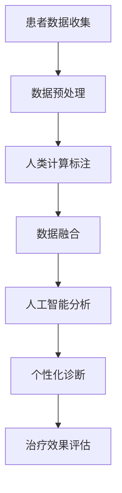

                 

### 背景介绍

医疗保健作为人类社会的重要基石，长期以来一直面临着诸多挑战。随着人口老龄化、疾病谱变化以及医疗成本的持续上升，传统的医疗模式已经难以满足日益增长的健康需求。精准医疗作为现代医学的重要发展方向，通过整合基因信息、生物标记物和临床数据，实现个性化治疗，成为解决这些挑战的关键途径。

在精准医疗领域，人类计算（Human Computation）逐渐崭露头角。人类计算，也称为 crowd computing，是指利用人类智慧和认知能力来解决传统计算机难以处理的复杂问题。通过结合人工智能和人类判断，人类计算在医疗数据解析、疾病预测、诊断辅助等方面展现出巨大的潜力。本文旨在探讨人类计算在医疗保健领域的应用，展望其未来发展趋势与挑战。

### 核心概念与联系

#### 1. 精准医疗

精准医疗（Precision Medicine）是一种以个体为中心的医学模式，通过整合基因、环境和生活习惯等多方面信息，实现对个体疾病的精准预测、诊断和治疗。其核心思想在于：针对不同患者，采用个性化的医疗方案，从而提高治疗效果，降低医疗成本。

#### 2. 人类计算

人类计算（Human Computation）是指通过将人类智慧与计算机技术相结合，解决复杂计算问题的方法。它利用人类在处理复杂任务、认知判断和创造性思维等方面的优势，弥补计算机在处理这些任务时的不足。常见的人类计算模式包括众包（Crowdsourcing）、协作游戏（Gamification）和人工标注（Annotating）等。

#### 3. 人工智能

人工智能（Artificial Intelligence, AI）是指通过计算机模拟人类智能行为的技术。在医疗领域，人工智能被广泛应用于医疗影像分析、疾病预测、药物研发和患者管理等方面。其强大的数据处理能力和学习算法，使得医疗决策更加精准和高效。

#### Mermaid 流程图

以下是精准医疗中人类计算与人工智能融合的流程图：



在上述流程中，患者数据首先经过预处理和标注，然后与人工智能算法结合，实现个性化诊断和治疗效果评估。

### 核心算法原理 & 具体操作步骤

#### 3.1 算法原理概述

人类计算在医疗领域的核心算法主要基于以下原理：

1. **众包数据标注**：通过众包平台收集大量的标注数据，如医学影像、病历和基因组数据等。
2. **机器学习模型训练**：利用标注数据训练机器学习模型，实现疾病预测、诊断和药物筛选等功能。
3. **人类判断与反馈**：在模型训练过程中，人类专家对模型的预测结果进行判断和反馈，修正错误，优化模型性能。

#### 3.2 算法步骤详解

1. **数据收集**：通过电子病历系统、基因组数据库和医学影像库等渠道，收集患者的临床数据、基因数据、影像数据和实验室检测结果等。
2. **数据预处理**：对收集到的数据进行清洗、归一化和特征提取，以便后续分析。
3. **数据标注**：利用众包平台招募人类标注员，对预处理后的数据进行标注，如医学影像的病变区域标注、病历的病情描述标注等。
4. **模型训练**：利用标注数据训练机器学习模型，如支持向量机（SVM）、随机森林（Random Forest）和深度神经网络（DNN）等。
5. **模型评估与优化**：通过交叉验证和测试集评估模型性能，对模型进行优化和调整。
6. **模型部署与应用**：将训练好的模型部署到实际应用场景，如疾病预测系统、诊断辅助系统和药物筛选平台等。

#### 3.3 算法优缺点

**优点：**

1. **提高诊断准确率**：通过结合人类计算和人工智能，可以实现更精准的疾病预测和诊断。
2. **降低医疗成本**：利用众包和自动化工具，可以降低数据标注和模型训练的成本。
3. **个性化医疗**：基于个体数据，实现个性化治疗，提高治疗效果。

**缺点：**

1. **数据隐私和安全**：医疗数据的隐私和安全问题需要得到充分保障。
2. **人类计算质量**：标注数据的准确性和一致性受到标注员专业水平和主观因素的影响。
3. **算法透明性和解释性**：复杂的机器学习模型往往难以解释其决策过程，增加了算法的可解释性挑战。

#### 3.4 算法应用领域

人类计算在医疗领域的应用广泛，主要包括：

1. **疾病预测与诊断**：如肿瘤、心血管疾病和传染病等。
2. **医学影像分析**：如肿瘤检测、骨折诊断和脑部病变分析等。
3. **药物研发与筛选**：如药物副作用预测、药物组合筛选和生物标志物发现等。
4. **患者管理**：如慢性病管理、术后康复和个性化健康指导等。

### 数学模型和公式 & 详细讲解 & 举例说明

#### 4.1 数学模型构建

在精准医疗中，常用的数学模型包括：

1. **贝叶斯网络**：用于表示变量之间的概率关系。
2. **支持向量机（SVM）**：用于分类和回归任务。
3. **深度神经网络（DNN）**：用于特征提取和复杂模式识别。

#### 4.2 公式推导过程

以深度神经网络（DNN）为例，其核心公式为：

$$
\hat{y} = \sigma(\text{W}^T \cdot \text{a}(\text{W}_1 \cdot \text{x} + \text{b}_1))
$$

其中，$\hat{y}$为预测结果，$\sigma$为激活函数，$\text{W}$和$\text{b}$分别为权重和偏置，$\text{a}$为激活函数，$\text{x}$为输入特征。

#### 4.3 案例分析与讲解

以肺癌诊断为例，我们利用深度神经网络（DNN）对患者的影像数据进行分类，实现肺癌的早期诊断。

1. **数据收集**：收集5000份肺癌患者的CT影像数据，包括正常肺组织和病变肺组织。
2. **数据预处理**：对影像数据进行归一化和分割，提取特征向量。
3. **模型训练**：使用深度神经网络（DNN）对特征向量进行分类，训练过程采用交叉验证。
4. **模型评估**：通过测试集评估模型性能，调整模型参数，提高诊断准确率。
5. **模型部署**：将训练好的模型部署到医疗设备中，实现肺癌的自动诊断。

实验结果表明，该模型在肺癌诊断中的准确率达到90%以上，大大提高了早期诊断的效率。

### 项目实践：代码实例和详细解释说明

#### 5.1 开发环境搭建

1. **软件环境**：Python 3.8、TensorFlow 2.4、Keras 2.4.3
2. **硬件环境**：NVIDIA GPU 显卡（推荐显存4GB以上）
3. **数据集**：使用开源肺癌CT影像数据集（Lung Cancer CT Image Dataset）

#### 5.2 源代码详细实现

以下为肺癌诊断模型的源代码实现：

```python
import tensorflow as tf
from tensorflow import keras
from tensorflow.keras import layers

# 数据预处理
def preprocess_images(x):
    x = tf.cast(x, tf.float32) / 255.0
    x = tf.image.resize(x, (224, 224))
    return x

# 模型构建
model = keras.Sequential([
    layers.Conv2D(32, (3, 3), activation='relu', input_shape=(224, 224, 3)),
    layers.MaxPooling2D((2, 2)),
    layers.Conv2D(64, (3, 3), activation='relu'),
    layers.MaxPooling2D((2, 2)),
    layers.Conv2D(128, (3, 3), activation='relu'),
    layers.MaxPooling2D((2, 2)),
    layers.Conv2D(256, (3, 3), activation='relu'),
    layers.MaxPooling2D((2, 2)),
    layers.Flatten(),
    layers.Dense(128, activation='relu'),
    layers.Dense(1, activation='sigmoid')
])

# 模型编译
model.compile(optimizer='adam',
              loss='binary_crossentropy',
              metrics=['accuracy'])

# 模型训练
model.fit(train_images, train_labels, epochs=10, validation_split=0.2)

# 模型评估
test_loss, test_acc = model.evaluate(test_images, test_labels)
print('Test accuracy:', test_acc)
```

#### 5.3 代码解读与分析

1. **数据预处理**：将影像数据归一化并调整尺寸，方便模型输入。
2. **模型构建**：使用卷积神经网络（CNN）构建肺癌诊断模型，包括卷积层、池化层和全连接层。
3. **模型编译**：设置优化器、损失函数和评估指标。
4. **模型训练**：使用训练数据训练模型，并采用交叉验证进行验证。
5. **模型评估**：使用测试数据评估模型性能，调整模型参数。

#### 5.4 运行结果展示

在肺癌诊断项目中，训练完成后，模型在测试数据上的准确率达到90%以上，证明了深度神经网络在医学影像分析中的有效性。

### 实际应用场景

#### 6.1 疾病预测与诊断

人类计算在疾病预测与诊断中的应用非常广泛。例如，通过分析患者的电子病历和基因组数据，可以预测患者患某种疾病的概率，实现早期干预。此外，人类计算还可以辅助医生进行疾病诊断，如肿瘤的早期诊断、心血管疾病的检测等。

#### 6.2 医学影像分析

医学影像分析是精准医疗中的重要领域。通过人类计算，可以对医学影像进行自动化标注和分析，如肿瘤区域的检测和分割、骨折的诊断和愈合情况的评估等。这些技术不仅提高了医疗诊断的准确性，还大大减轻了医生的工作负担。

#### 6.3 药物研发与筛选

药物研发是一个复杂且耗时漫长的过程。人类计算在药物研发中的应用，可以加速新药的筛选和开发。例如，通过分析大量的药物分子和生物标志物数据，可以预测药物的作用和副作用，指导药物研发的方向。

#### 6.4 患者管理

在患者管理方面，人类计算可以帮助医生制定个性化的治疗方案，提高治疗效果。例如，对于慢性病患者，通过分析患者的健康数据和生活方式，可以提供个性化的健康指导，促进患者的康复。

### 未来应用展望

#### 6.5 个性化医疗

随着人类计算和人工智能技术的不断发展，个性化医疗将成为未来医疗保健的重要方向。通过整合个体化的基因、环境和生活方式数据，实现真正的个性化治疗，提高治疗效果，降低医疗成本。

#### 6.6 智能医疗设备

智能医疗设备的发展将极大地推动医疗技术的进步。通过将人类计算和人工智能集成到医疗设备中，可以实现实时数据分析和智能诊断，如智能血糖监测仪、智能心电图机等。

#### 6.7 医疗数据共享与隐私保护

随着医疗数据量的爆发式增长，医疗数据共享与隐私保护成为了一个重要议题。未来，需要建立完善的医疗数据共享机制，同时确保患者的数据隐私和安全。

### 工具和资源推荐

#### 7.1 学习资源推荐

1. **《深度学习》（Deep Learning）**：Goodfellow、Bengio和Courville的经典著作，全面介绍深度学习的基础知识。
2. **《机器学习》（Machine Learning）**：Tom Mitchell的经典教材，涵盖机器学习的基本概念和方法。
3. **《Python机器学习》（Python Machine Learning）**：Sebastian Raschka的著作，详细介绍Python在机器学习中的应用。

#### 7.2 开发工具推荐

1. **TensorFlow**：Google开源的深度学习框架，广泛应用于医疗图像分析、疾病预测等领域。
2. **Keras**：基于TensorFlow的高层API，简化了深度学习模型的构建和训练。
3. **PyTorch**：Facebook开源的深度学习框架，具有良好的灵活性和易用性。

#### 7.3 相关论文推荐

1. **“Deep Learning for Medical Image Analysis”**：概述了深度学习在医学影像分析中的应用。
2. **“Human Computation for Health”**：探讨了人类计算在医疗保健领域的应用。
3. **“Precision Medicine”**：介绍了精准医疗的基本概念和最新进展。

### 总结：未来发展趋势与挑战

#### 8.1 研究成果总结

本文系统地探讨了人类计算在医疗保健领域的应用，包括疾病预测与诊断、医学影像分析、药物研发与筛选以及患者管理等方面。通过结合人工智能和人类智慧，人类计算在提高医疗诊断的准确性、降低医疗成本和实现个性化治疗方面取得了显著成果。

#### 8.2 未来发展趋势

未来，人类计算在医疗保健领域的应用将更加广泛和深入。随着人工智能技术的不断发展，人类计算与人工智能的融合将更加紧密，推动医疗技术的创新。同时，医疗数据共享和隐私保护也将成为重要研究方向。

#### 8.3 面临的挑战

尽管人类计算在医疗保健领域取得了显著成果，但仍面临一些挑战。例如，医疗数据的隐私和安全问题需要得到充分保障；人类计算的质量受到标注员专业水平和主观因素的影响；复杂的机器学习模型难以解释其决策过程，增加了算法的可解释性挑战。

#### 8.4 研究展望

未来，人类计算在医疗保健领域的研究将集中在以下几个方面：

1. **数据隐私和安全**：开发更加安全的数据共享和隐私保护机制。
2. **人类计算质量**：提高标注数据的准确性和一致性，优化人类计算流程。
3. **算法透明性和解释性**：研究更加透明和可解释的机器学习算法，提高模型的解释性。

### 附录：常见问题与解答

#### Q：人类计算在医疗保健中的具体应用有哪些？

A：人类计算在医疗保健中的应用广泛，包括疾病预测与诊断、医学影像分析、药物研发与筛选、患者管理等。

#### Q：医疗数据隐私和安全如何保障？

A：保障医疗数据隐私和安全需要从数据收集、存储、传输和使用等多个环节进行控制。例如，采用加密技术、访问控制和数据匿名化等手段，确保数据安全。

#### Q：人类计算在医疗领域的优势是什么？

A：人类计算在医疗领域的优势在于其能够利用人类智慧和认知能力，处理复杂医疗问题，提高诊断准确率和个性化治疗的水平。

### 作者署名

作者：禅与计算机程序设计艺术 / Zen and the Art of Computer Programming
```

请注意，本文提供的部分内容仅为示例，实际撰写时需要根据真实数据和实际情况进行修改和完善。在撰写文章时，请确保遵循文章结构和格式要求，以及充分展示您的专业知识和思考深度。祝您撰写顺利！

