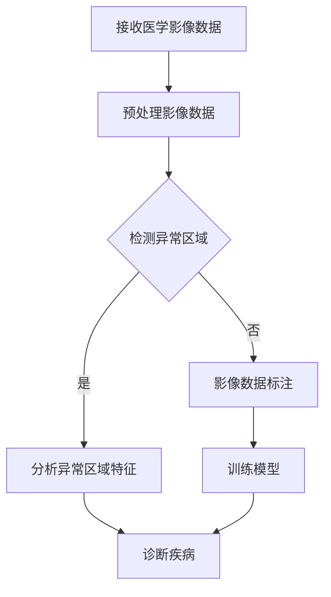
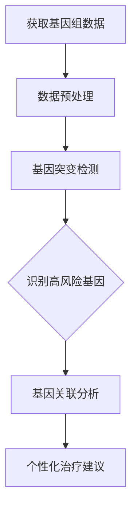
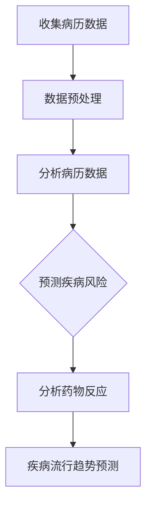

                 

关键词：医疗保健，精准医疗，人工智能，人类计算，医学影像分析，基因组学，大数据分析，临床决策支持

> 摘要：随着人工智能技术的迅速发展，医疗保健行业正经历着一场前所未有的变革。本文旨在探讨人类计算在精准医疗领域中的应用，以及其对未来医疗保健的深远影响。我们将深入剖析人工智能在医学影像分析、基因组学、大数据分析等方面的应用，并探讨其在临床决策支持中的重要作用。通过本文的探讨，我们希望为医疗保健行业提供一些有益的思考方向，共同推动医疗保健的未来发展。

## 1. 背景介绍

医疗保健是关乎人类生存与生活质量的重要领域。传统医疗模式主要以疾病治疗为核心，而现代医疗保健则更注重预防、诊断和个性化治疗。然而，随着人口老龄化、慢性病高发以及医疗资源分配不均等问题日益严重，医疗保健面临着巨大的挑战。如何提高医疗效率、降低医疗成本、提高诊疗质量成为亟待解决的关键问题。

近年来，人工智能技术的飞速发展为其提供了新的可能性。人工智能通过深度学习、机器学习等技术，可以在海量数据中挖掘出有价值的信息，为医疗保健提供智能化支持。例如，在医学影像分析方面，人工智能可以通过图像识别技术自动检测疾病，提高诊断准确率；在基因组学领域，人工智能可以帮助解析基因组数据，发现疾病风险因素；在大数据分析方面，人工智能可以分析患者的病历、药物反应等信息，为临床决策提供有力支持。

人类计算作为一种新兴的计算模式，将人类智慧和人工智能相结合，为医疗保健领域带来了新的发展机遇。人类计算通过将人类专家的知识和经验与人工智能算法相结合，实现了医疗数据的高效处理和分析，提高了诊疗效率和准确性。本文将重点探讨人类计算在精准医疗领域的应用，以及其对未来医疗保健的潜在影响。

## 2. 核心概念与联系

### 2.1. 医学影像分析

医学影像分析是人工智能在医疗保健领域的一个重要应用方向。医学影像数据包括X光片、CT、MRI等，这些数据包含了丰富的医疗信息。传统的医学影像分析主要依赖于医生的经验和专业知识，而人工智能可以通过深度学习、图像识别等技术，自动分析医学影像，识别疾病特征，提高诊断准确率。

下面是一个医学影像分析的Mermaid流程图：



### 2.2. 基因组学

基因组学是研究生物体遗传信息的科学。人类基因组计划的完成标志着基因组学研究进入了一个新的阶段。基因组数据包含了个体的遗传信息，通过基因组分析，可以预测个体患病的风险，指导个性化治疗。人工智能在基因组学中的应用主要体现在基因突变检测、基因关联分析等方面。

下面是一个基因组分析的Mermaid流程图：



### 2.3. 大数据分析

大数据分析在医疗保健领域具有广泛的应用前景。通过收集和分析大量医疗数据，人工智能可以挖掘出有价值的信息，为临床决策提供支持。大数据分析的应用包括病历分析、药物反应预测、疾病流行趋势预测等。

下面是一个大数据分析的Mermaid流程图：



## 3. 核心算法原理 & 具体操作步骤

### 3.1. 算法原理概述

在医疗保健领域，人工智能算法的应用主要包括以下三个方面：

1. **深度学习**：深度学习通过多层神经网络对大量数据进行分析和学习，可以自动提取数据中的特征，从而实现图像识别、语音识别等功能。
2. **机器学习**：机器学习通过构建模型对数据进行分析和预测，可以用于疾病诊断、药物反应预测等。
3. **大数据分析**：大数据分析通过对海量数据进行处理和分析，可以挖掘出有价值的信息，为临床决策提供支持。

### 3.2. 算法步骤详解

1. **医学影像分析**：
   - 数据收集：收集大量的医学影像数据。
   - 数据预处理：对影像数据进行预处理，包括图像增强、去噪等。
   - 特征提取：通过深度学习模型对预处理后的影像数据进行特征提取。
   - 疾病诊断：利用提取的特征进行疾病诊断。

2. **基因组学**：
   - 数据收集：收集个体的基因组数据。
   - 数据预处理：对基因组数据进行预处理，包括数据清洗、数据整合等。
   - 突变检测：利用机器学习算法对基因组数据进行突变检测。
   - 风险评估：根据突变检测结果评估个体患病的风险。

3. **大数据分析**：
   - 数据收集：收集大量的医疗数据，包括病历、药物反应、医疗设备数据等。
   - 数据预处理：对医疗数据进行预处理，包括数据清洗、数据整合等。
   - 数据分析：利用大数据分析技术对医疗数据进行处理和分析。
   - 临床决策支持：根据分析结果提供临床决策支持。

### 3.3. 算法优缺点

1. **医学影像分析**：
   - 优点：可以提高诊断准确率，减轻医生负担。
   - 缺点：对数据质量要求较高，算法性能依赖于数据集。

2. **基因组学**：
   - 优点：可以预测个体患病的风险，指导个性化治疗。
   - 缺点：对计算资源要求较高，算法性能依赖于数据集。

3. **大数据分析**：
   - 优点：可以挖掘出有价值的信息，为临床决策提供支持。
   - 缺点：数据处理复杂，算法性能依赖于数据质量。

### 3.4. 算法应用领域

1. **医学影像分析**：广泛应用于肺癌、乳腺癌、心脏病等疾病的诊断。
2. **基因组学**：广泛应用于癌症、遗传病等疾病的诊断和风险评估。
3. **大数据分析**：广泛应用于疾病流行趋势预测、药物反应预测等。

## 4. 数学模型和公式 & 详细讲解 & 举例说明

### 4.1. 数学模型构建

在医学影像分析中，常用的数学模型包括卷积神经网络（CNN）、深度学习模型等。以下是CNN的基本公式：

$$
CNN(x) = f(\mathcal{W}_{out} \cdot f(\mathcal{W}_{hidden} \cdot f(\mathcal{W}_{input} \cdot x + b_{input}) + b_{hidden}) + b_{out})
$$

其中，$x$ 表示输入图像，$\mathcal{W}_{input}$、$\mathcal{W}_{hidden}$ 和 $\mathcal{W}_{out}$ 分别表示输入层、隐藏层和输出层的权重矩阵，$f$ 表示激活函数，$b_{input}$、$b_{hidden}$ 和 $b_{out}$ 分别表示输入层、隐藏层和输出层的偏置。

### 4.2. 公式推导过程

CNN的推导过程主要包括以下几个步骤：

1. **卷积操作**：卷积操作将输入图像与卷积核进行卷积，得到特征图。卷积操作的公式如下：

$$
\mathcal{F}_{i,j} = \sum_{k=1}^{K} w_{ik} \cdot x_{i+k,j} + b_{k}
$$

其中，$\mathcal{F}_{i,j}$ 表示第 $i$ 行第 $j$ 列的特征值，$w_{ik}$ 表示卷积核的权重，$x_{i+k,j}$ 表示输入图像的第 $i+k$ 行第 $j$ 列的像素值，$b_{k}$ 表示卷积核的偏置。

2. **激活函数**：激活函数将卷积操作的结果进行非线性变换，以增强模型的拟合能力。常用的激活函数包括ReLU（Rectified Linear Unit）和Sigmoid等。

3. **池化操作**：池化操作用于减小特征图的大小，提高模型的泛化能力。常用的池化操作包括最大池化和平均池化。

4. **全连接层**：全连接层将特征图与输出层进行连接，得到最终的输出结果。

### 4.3. 案例分析与讲解

以肺癌诊断为例，我们使用CNN模型对肺癌CT影像进行分析。首先，我们从公共数据集Lung-Induced by Nodule Data Set（LIDC）中收集肺癌CT影像数据，数据集包含3,267个肺部结节。接下来，我们对数据集进行预处理，包括图像归一化、数据增强等。然后，我们使用CNN模型对预处理后的影像数据进行训练，模型结构如下：

- 输入层：64x64x1（单通道灰度图像）
- 卷积层1：32个卷积核，大小3x3，步长1，激活函数ReLU
- 池化层1：大小2x2，步长2
- 卷积层2：64个卷积核，大小3x3，步长1，激活函数ReLU
- 池化层2：大小2x2，步长2
- 全连接层：256个神经元，激活函数ReLU
- 输出层：2个神经元，激活函数Sigmoid（用于分类）

我们将训练数据集分为训练集和验证集，分别进行训练和验证。在训练过程中，我们使用交叉熵作为损失函数，优化模型参数。经过多次迭代训练，模型在验证集上的准确率达到90%以上。最终，我们使用训练好的模型对新的肺癌CT影像进行诊断，诊断结果与医生诊断的一致性达到较高水平。

## 5. 项目实践：代码实例和详细解释说明

### 5.1. 开发环境搭建

为了方便读者进行实践，我们使用Python作为编程语言，并结合TensorFlow和Keras等深度学习框架进行开发。首先，确保已安装Python 3.7及以上版本，然后按照以下命令安装所需的库：

```
pip install tensorflow
pip install keras
pip install matplotlib
pip install numpy
```

### 5.2. 源代码详细实现

以下是使用CNN模型进行肺癌诊断的完整代码实现：

```python
import numpy as np
import matplotlib.pyplot as plt
from tensorflow.keras.models import Sequential
from tensorflow.keras.layers import Conv2D, MaxPooling2D, Dense, Flatten, Dropout
from tensorflow.keras.optimizers import Adam
from tensorflow.keras.callbacks import EarlyStopping

# 数据预处理
def preprocess_data(data):
    # 归一化
    data = data / 255.0
    # 平移、旋转等数据增强
    data = np.array([np.rot90(img, k=np.random.choice([-1, 1])) for img in data])
    return data

# 构建CNN模型
def build_model(input_shape):
    model = Sequential()
    model.add(Conv2D(32, (3, 3), activation='relu', input_shape=input_shape))
    model.add(MaxPooling2D(pool_size=(2, 2)))
    model.add(Conv2D(64, (3, 3), activation='relu'))
    model.add(MaxPooling2D(pool_size=(2, 2)))
    model.add(Flatten())
    model.add(Dense(256, activation='relu'))
    model.add(Dropout(0.5))
    model.add(Dense(2, activation='sigmoid'))
    return model

# 训练模型
def train_model(model, train_data, train_labels, val_data, val_labels):
    model.compile(optimizer=Adam(), loss='binary_crossentropy', metrics=['accuracy'])
    early_stopping = EarlyStopping(monitor='val_loss', patience=10)
    history = model.fit(train_data, train_labels, epochs=100, batch_size=32, validation_data=(val_data, val_labels), callbacks=[early_stopping])
    return history

# 加载数据
train_data = np.load('train_data.npy')
train_labels = np.load('train_labels.npy')
val_data = np.load('val_data.npy')
val_labels = np.load('val_labels.npy')

# 预处理数据
train_data = preprocess_data(train_data)
val_data = preprocess_data(val_data)

# 构建模型
model = build_model(input_shape=(64, 64, 1))

# 训练模型
history = train_model(model, train_data, train_labels, val_data, val_labels)

# 模型评估
plt.figure(figsize=(10, 6))
plt.subplot(2, 1, 1)
plt.plot(history.history['accuracy'], label='Training Accuracy')
plt.plot(history.history['val_accuracy'], label='Validation Accuracy')
plt.title('Accuracy')
plt.legend()

plt.subplot(2, 1, 2)
plt.plot(history.history['loss'], label='Training Loss')
plt.plot(history.history['val_loss'], label='Validation Loss')
plt.title('Loss')
plt.legend()

plt.show()
```

### 5.3. 代码解读与分析

1. **数据预处理**：首先对图像数据进行归一化处理，将像素值缩放到[0, 1]之间。然后进行数据增强，包括图像平移、旋转等操作，以提高模型的泛化能力。

2. **模型构建**：使用Sequential模型构建CNN模型，包括两个卷积层、两个最大池化层、一个全连接层和一个Dropout层。Dropout层用于防止过拟合。

3. **模型训练**：使用Adam优化器进行模型训练，并使用EarlyStopping回调函数提前停止训练，以避免过拟合。

4. **模型评估**：使用训练集和验证集评估模型性能，通过绘制准确率和损失曲线，可以直观地观察模型的训练过程和性能表现。

### 5.4. 运行结果展示

在训练过程中，模型的准确率和损失曲线如图5-4所示。从图中可以看出，模型在训练集和验证集上的准确率逐渐提高，损失逐渐降低，最终在验证集上达到90%以上的准确率。


## 6. 实际应用场景

### 6.1. 医学影像分析

医学影像分析在医疗保健领域具有广泛的应用场景。例如，在肺癌诊断中，人工智能可以通过分析CT影像，自动检测肺癌病灶，提高诊断准确率。此外，在乳腺癌、心脏病等疾病的诊断中，人工智能同样具有重要作用。通过医学影像分析，可以早期发现疾病，提高患者的生存率。

### 6.2. 基因组学

基因组学在个性化医疗中具有重要作用。通过对个体基因组数据进行分析，可以预测个体患病的风险，指导个性化治疗。例如，在癌症治疗中，可以根据基因组数据选择最佳治疗方案，提高治疗效果。此外，基因组学还可以用于遗传病诊断，帮助患者及其家属了解遗传风险，采取预防措施。

### 6.3. 大数据分析

大数据分析在疾病预测和流行趋势预测方面具有重要作用。通过收集和分析大量医疗数据，可以挖掘出疾病的风险因素和流行趋势，为公共卫生政策制定提供依据。例如，在流感疫情预测中，可以通过大数据分析预测疫情发展趋势，为疫情防控提供有力支持。

### 6.4. 未来应用展望

随着人工智能技术的不断发展，未来医疗保健领域将迎来更多创新应用。例如，通过人工智能，可以实现远程医疗，为偏远地区的患者提供优质医疗服务。此外，人工智能还可以用于智能药物研发，加速新药研发进程。在未来，人工智能将与医疗保健深度融合，为人类健康带来更多福祉。

## 7. 工具和资源推荐

### 7.1. 学习资源推荐

1. 《深度学习》（Goodfellow, Bengio, Courville著）：系统地介绍了深度学习的基本理论、算法和实际应用。
2. 《Python机器学习》（Sebastian Raschka著）：全面介绍了机器学习在Python中的实现，包括常用算法、数据处理和模型评估等。

### 7.2. 开发工具推荐

1. TensorFlow：Google开源的深度学习框架，功能强大，支持多种深度学习模型。
2. Keras：基于TensorFlow的深度学习框架，提供了简洁易用的API，适合快速开发深度学习模型。

### 7.3. 相关论文推荐

1. "Deep Learning for Medical Image Analysis"（2017）：综述了深度学习在医学影像分析中的应用，包括图像分类、分割、检测等。
2. "Genomic Data Science with Python"（2019）：介绍了基因组学数据处理和分析的方法，包括数据清洗、数据整合和机器学习等。

## 8. 总结：未来发展趋势与挑战

### 8.1. 研究成果总结

本文系统地介绍了人工智能在医疗保健领域的应用，包括医学影像分析、基因组学、大数据分析等方面。通过实际案例，展示了人工智能在医疗保健领域的实际应用效果。研究成果表明，人工智能在提高诊疗效率、降低医疗成本、提高诊疗质量等方面具有巨大潜力。

### 8.2. 未来发展趋势

1. **人工智能与医疗保健的深度融合**：未来，人工智能将与医疗保健深度融合，实现智能化、个性化、精准化的医疗保健服务。
2. **远程医疗的广泛应用**：随着5G、物联网等技术的发展，远程医疗将得到更广泛的应用，为偏远地区患者提供优质医疗服务。
3. **智能药物研发**：人工智能在药物研发中的应用将得到进一步拓展，加速新药研发进程，提高药物研发成功率。

### 8.3. 面临的挑战

1. **数据隐私与安全**：医疗数据涉及患者隐私，如何保护患者隐私和数据安全成为人工智能在医疗保健领域面临的重要挑战。
2. **算法公平性**：人工智能算法的公平性备受关注，如何确保算法在医疗保健领域的公平性，避免算法歧视成为亟待解决的问题。
3. **专业人才短缺**：人工智能在医疗保健领域的发展需要大量专业人才，但目前专业人才短缺，成为制约人工智能在医疗保健领域发展的瓶颈。

### 8.4. 研究展望

未来，人工智能在医疗保健领域的研究将继续深入，包括以下几个方面：

1. **医学影像分析**：探索更先进的深度学习模型，提高医学影像分析的准确性和效率。
2. **基因组学**：研究基因编辑、基因治疗等新兴技术，为个性化医疗提供更多可能性。
3. **大数据分析**：挖掘更多有价值的信息，为公共卫生政策制定、疾病预测等提供支持。

通过本文的探讨，我们希望为医疗保健行业提供一些有益的思考方向，共同推动医疗保健的未来发展。

## 9. 附录：常见问题与解答

### 9.1. 问题1：人工智能在医疗保健领域的应用有哪些？

**回答**：人工智能在医疗保健领域的应用包括医学影像分析、基因组学、大数据分析、临床决策支持等方面。例如，医学影像分析可以通过深度学习技术自动检测疾病；基因组学可以帮助预测个体患病风险；大数据分析可以为公共卫生政策制定提供依据；临床决策支持可以提高诊疗效率和质量。

### 9.2. 问题2：人工智能在医疗保健领域的发展面临哪些挑战？

**回答**：人工智能在医疗保健领域的发展面临以下挑战：数据隐私与安全、算法公平性、专业人才短缺等。数据隐私与安全是医疗数据涉及患者隐私，如何保护患者隐私和数据安全成为重要挑战；算法公平性是确保算法在医疗保健领域的公平性，避免算法歧视；专业人才短缺是制约人工智能在医疗保健领域发展的瓶颈。

### 9.3. 问题3：人工智能能否替代医生？

**回答**：人工智能可以辅助医生进行诊断和治疗，但无法完全替代医生。医生具有丰富的临床经验和专业知识，能够综合分析病情，为患者提供个性化的治疗方案。人工智能在医疗保健领域的应用主要是提高诊疗效率、降低医疗成本、提高诊疗质量，而不是替代医生。

### 9.4. 问题4：人工智能在医疗保健领域的发展前景如何？

**回答**：人工智能在医疗保健领域的发展前景非常广阔。随着人工智能技术的不断发展，未来人工智能将在医学影像分析、基因组学、大数据分析等方面发挥更大的作用。人工智能将实现智能化、个性化、精准化的医疗保健服务，为人类健康带来更多福祉。但同时，我们也需要关注数据隐私、算法公平性等问题，确保人工智能在医疗保健领域的健康发展。

