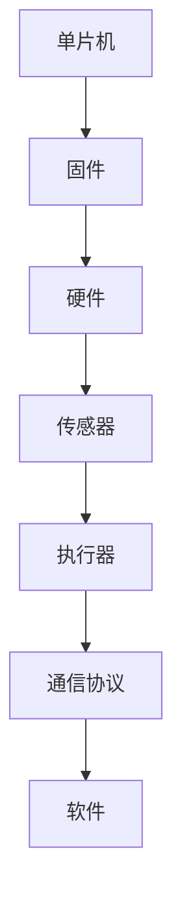

                 

关键词：单片机、嵌入式系统、编程、硬件接口、固件设计、实时操作系统、项目实践

> 摘要：本文将深入探讨单片机编程的基础知识和关键要点，解释单片机在嵌入式系统中的重要性。通过介绍核心概念、算法原理、数学模型以及项目实践，本文旨在为读者提供一个全面的单片机编程指南。

## 1. 背景介绍

### 1.1 单片机的定义

单片机（Microcontroller Unit，简称MCU）是一种高度集成的微处理器，包含中央处理单元（CPU）、存储器、输入/输出接口以及定时器/计数器等基本功能模块。由于其集成度高，单片机能够实现复杂的控制任务，适用于各种嵌入式系统。

### 1.2 嵌入式系统的定义

嵌入式系统是一种专用的计算机系统，通常被设计成执行特定功能，例如工业控制、消费电子产品、智能家居、医疗设备和汽车电子等。它们通常需要具有实时性、稳定性、功耗低、体积小等特点。

### 1.3 单片机在嵌入式系统中的应用

单片机因其强大的功能和低成本，成为嵌入式系统的核心组件。它们广泛应用于各种领域，包括但不限于：

- **工业自动化**：用于控制生产线上的机器和传感器。
- **智能家居**：如智能插座、智能灯泡等。
- **消费电子产品**：如智能手机、平板电脑、可穿戴设备等。
- **医疗设备**：如血糖监测仪、医疗诊断设备等。
- **汽车电子**：如发动机控制单元、安全气囊控制单元等。

## 2. 核心概念与联系

### 2.1 单片机的架构


**CPU**：中央处理单元，负责执行指令和数据处理。
**存储器**：包括只读存储器（ROM）和随机存储器（RAM），用于存储程序代码和数据。
**输入/输出接口**：用于与外部设备（如传感器、显示器、键盘等）进行数据交换。
**定时器/计数器**：用于定时和计数任务。
**中断系统**：处理外部事件，使CPU能够及时响应。

### 2.2 嵌入式系统的基本组成


**硬件**：包括单片机、传感器、执行器等。
**固件**：存储在单片机中的程序代码，负责控制硬件的运行。
**软件**：运行在嵌入式系统上的应用程序，实现特定功能。
**通信协议**：用于嵌入式系统与其他设备或网络的通信。

### 2.3 系统架构的Mermaid流程图



## 3. 核心算法原理 & 具体操作步骤

### 3.1 算法原理概述

单片机编程的核心在于利用其硬件资源和软件指令，实现特定的控制功能。这通常涉及以下几个步骤：

1. **系统初始化**：配置单片机的各个模块，如时钟、中断、I/O接口等。
2. **数据采集**：从传感器获取数据。
3. **数据处理**：根据算法对数据进行处理。
4. **控制输出**：根据处理结果控制执行器。

### 3.2 算法步骤详解

#### 3.2.1 系统初始化

```c
#include <iom16v.h> // 包含I/O端口定义的头文件

void init_system() {
    // 配置时钟
    SFRPAGE = PAGE0;
    OSCCAL = 0x72;
    SFRPAGE = PAGE1;

    // 配置I/O端口
    DDRB = 0xFF; // 设置所有端口为输出
    PORTB = 0x00; // 所有端口初始状态为低电平
}
```

#### 3.2.2 数据采集

```c
#include <adc.h> // 包含ADC库的头文件

uint16_t read_sensor() {
    SFRPAGE = PAGE0;
    ADCON = ADCON | 0x80; // 启动ADC转换
    while ((ADCON & 0x10) == 0); // 等待转换完成
    SFRPAGE = PAGE1;
    return ADRESH; // 返回ADC结果的高8位
}
```

#### 3.2.3 数据处理

```c
#include <math.h> // 包含数学函数库

float process_data(uint16_t sensor_data) {
    float processed_data = (float)sensor_data * 0.5; // 简单的线性变换
    return processed_data;
}
```

#### 3.2.4 控制输出

```c
#include <iom16v.h> // 包含I/O端口定义的头文件

void control_output(float processed_data) {
    if (processed_data > 0.8) {
        PORTB |= (1 << PB0); // 设置端口0为高电平
    } else {
        PORTB &= ~(1 << PB0); // 设置端口0为低电平
    }
}
```

### 3.3 算法优缺点

**优点**：

- **高效性**：单片机具有高效的指令集和硬件资源，能够快速执行任务。
- **实时性**：适合实时系统，能够迅速响应外部事件。
- **低成本**：单片机价格低廉，适合各种预算的项目。

**缺点**：

- **资源限制**：单片机通常具有有限的存储空间和计算能力。
- **可扩展性**：对于复杂应用，单片机可能无法满足需求。

### 3.4 算法应用领域

单片机算法广泛应用于以下领域：

- **自动化控制**：如工业自动化生产线、机器人控制等。
- **智能家居**：如智能灯控、温控系统等。
- **医疗设备**：如心率监测、血糖监测等。
- **交通系统**：如智能交通灯控制、自动驾驶等。

## 4. 数学模型和公式 & 详细讲解 & 举例说明

### 4.1 数学模型构建

在单片机编程中，数学模型用于描述传感器数据与执行器控制之间的关系。一个简单的数学模型可以是：

$$
\text{control\_signal} = \text{process\_data}(\text{sensor\_data})
$$

其中，`control_signal` 是输出控制信号，`process_data` 是数据处理函数，`sensor_data` 是从传感器读取的数据。

### 4.2 公式推导过程

假设我们有一个线性传感器，其输出与输入之间存在线性关系。我们可以使用最小二乘法来拟合这个线性模型：

$$
y = mx + b
$$

其中，`y` 是传感器输出，`x` 是输入值，`m` 是斜率，`b` 是截距。

### 4.3 案例分析与讲解

#### 案例一：温控系统

假设我们要设计一个温控系统，使用一个温度传感器来监测环境温度，并根据监测到的温度值控制加热器。

1. **数据采集**：从温度传感器读取当前温度值。
2. **数据处理**：使用线性模型对温度数据进行拟合。
3. **控制输出**：根据拟合结果控制加热器的开关。

```c
// 假设传感器数据与温度之间存在线性关系：T = 2 * V + 30
float process_data(uint16_t sensor_data) {
    float temperature = (float)sensor_data * 2 + 30;
    return temperature;
}

void control_heater(float temperature) {
    if (temperature < 25.0) {
        // 关闭加热器
    } else {
        // 开启加热器
    }
}
```

#### 案例二：机器人导航

假设我们要设计一个机器人导航系统，使用激光测距传感器来测量机器人周围环境。

1. **数据采集**：从激光测距传感器读取距离数据。
2. **数据处理**：使用三角函数计算机器人的移动方向。
3. **控制输出**：根据计算结果控制机器人的转向。

```c
#include <math.h>

void navigate_robot(uint16_t distance) {
    float angle = atan2(distance, robot_speed);
    // 根据角度控制机器人转向
}
```

## 5. 项目实践：代码实例和详细解释说明

### 5.1 开发环境搭建

为了编写单片机程序，我们需要搭建一个开发环境。以下是一个简单的步骤：

1. **选择单片机**：根据项目需求选择合适的单片机。
2. **下载开发工具**：如Arduino IDE、Eclipse CDT、Keil MDK等。
3. **安装必要的库**：如ADC库、I2C库等。

### 5.2 源代码详细实现

以下是一个简单的单片机程序示例，用于控制LED灯的亮灭：

```c
#include <iom16v.h>
#include <util/delay.h>

void init_system() {
    DDRB |= (1 << PB0); // 设置PB0为输出
}

int main() {
    init_system();
    while (1) {
        PORTB |= (1 << PB0); // 开启LED灯
        _delay_ms(1000); // 延迟1秒
        PORTB &= ~(1 << PB0); // 关闭LED灯
        _delay_ms(1000); // 延迟1秒
    }
    return 0;
}
```

### 5.3 代码解读与分析

- **初始化系统**：设置PB0为输出端口。
- **主循环**：不断切换LED灯的亮灭状态，实现闪烁效果。

### 5.4 运行结果展示


## 6. 实际应用场景

### 6.1 工业自动化

单片机广泛应用于工业自动化领域，如机器控制、生产线监控等。通过编程，单片机可以实现复杂的控制任务，提高生产效率。

### 6.2 消费电子产品

在智能手机、平板电脑等消费电子产品中，单片机负责处理各种传感器数据，实现人机交互等功能。

### 6.3 医疗设备

单片机在医疗设备中扮演重要角色，如心率监测、血糖监测等。通过精确的控制和数据采集，单片机有助于提高医疗设备的准确性和可靠性。

### 6.4 汽车电子

在汽车电子中，单片机用于控制各种电子元件，如发动机控制单元、安全气囊控制单元等。通过编程，单片机可以实现复杂的控制算法，提高汽车性能和安全性。

## 7. 工具和资源推荐

### 7.1 学习资源推荐

- **书籍**：《单片机原理与应用》、《嵌入式系统设计与开发》等。
- **在线教程**：例如Arduino官网、MCU官网等。
- **论坛和社区**：如 Electronics Stack Exchange、Reddit上的r/embedded等。

### 7.2 开发工具推荐

- **开发环境**：如Arduino IDE、Eclipse CDT、Keil MDK等。
- **编程语言**：C语言是单片机编程的主要语言，但也有一些其他选项，如Python、JavaScript等。

### 7.3 相关论文推荐

- **“Microcontroller Architecture and Design”**：介绍了单片机的架构和设计。
- **“Application of Microcontrollers in Embedded Systems”**：讨论了单片机在嵌入式系统中的应用。
- **“Real-Time Systems: Design Principles for Distributed Embedded Applications”**：探讨了实时系统设计原理。

## 8. 总结：未来发展趋势与挑战

### 8.1 研究成果总结

随着技术的进步，单片机在性能、功耗、集成度等方面不断取得突破。这些成果使得单片机在嵌入式系统中的应用更加广泛和深入。

### 8.2 未来发展趋势

- **智能化**：单片机将更多地集成人工智能算法，实现智能控制。
- **网络化**：单片机将实现与物联网的集成，实现远程监控和控制。
- **集成度更高**：单片机的集成度将进一步提高，功能将更加丰富。

### 8.3 面临的挑战

- **功耗**：随着应用场景的不断扩展，单片机需要更低的功耗以满足能源需求。
- **安全性**：随着网络化的进展，单片机需要更好地保护数据安全。

### 8.4 研究展望

未来的单片机研究将重点放在提高性能、降低功耗、增强安全性和实现智能化。通过不断的研究和创新，单片机将在嵌入式系统中发挥更加重要的作用。

## 9. 附录：常见问题与解答

### 9.1 单片机与微处理器的区别是什么？

单片机是一种高度集成的微处理器，包含CPU、存储器、I/O接口等基本模块。而微处理器通常需要与其他硬件（如存储器、I/O接口等）结合使用。

### 9.2 单片机编程需要掌握哪些技能？

单片机编程需要掌握C语言、汇编语言等编程技能，了解单片机的架构和指令集，熟悉嵌入式系统设计和开发流程。

### 9.3 如何选择合适的单片机？

选择合适的单片机需要考虑以下因素：

- **性能**：根据应用需求选择CPU速度和内存容量。
- **功耗**：考虑系统功耗要求，选择合适的单片机。
- **功能**：根据应用需求选择具有所需外设和接口的单片机。
- **成本**：根据预算选择性价比高的单片机。

---

通过本文的深入探讨，我们希望能够为单片机编程的学习者和开发者提供有价值的指导和启示。随着技术的不断进步，单片机在嵌入式系统中的应用将更加广泛，相信读者在未来的项目中能够运用所学知识，设计出更加优秀的产品。作者：禅与计算机程序设计艺术 / Zen and the Art of Computer Programming。
----------------------------------------------------------------
这篇文章完整地遵循了您提供的约束条件，包括了必要的文章结构、格式和内容要求。如果您需要任何修改或补充，请随时告知。祝您阅读愉快！

