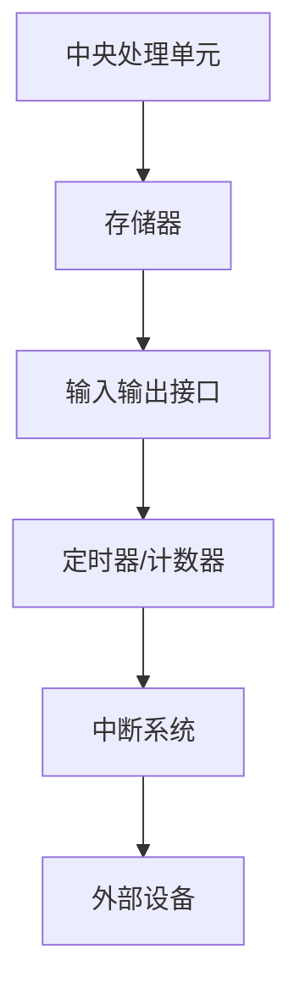

                 

关键词：单片机编程、嵌入式系统、嵌入式开发、硬件编程、微控制器、汇编语言、C语言、编程技巧、电路设计、系统架构。

> 摘要：本文深入探讨了单片机编程的基础知识，从硬件架构到软件开发，全面介绍了嵌入式系统的核心概念与实际操作。文章旨在为初学者和有经验的开发者提供一份详实的指导，以帮助他们更好地理解和掌握单片机编程技巧，从而实现更高效的嵌入式系统开发。

## 1. 背景介绍

### 单片机的发展历程

单片机（Microcontroller Unit，简称MCU）作为嵌入式系统的核心，其发展历程可以追溯到20世纪60年代。最初的单片机主要用于简单的控制任务，如家电控制和工业设备监控。随着计算机技术和集成电路技术的快速发展，单片机逐渐具备了更强的计算能力和更丰富的外设接口，使其在各个领域得到了广泛应用。

单片机的发展历程可以分为几个阶段：

1. **早期单片机**：以4位和8位单片机为主，如Intel的MCS-48系列。这些单片机具有简单的存储器和输入输出接口，适用于简单的控制任务。

2. **中后期单片机**：随着技术的进步，16位和32位单片机逐渐出现。如MCS-51系列，它具有更大的存储空间和更丰富的外设接口，为复杂的控制任务提供了更好的支持。

3. **现代单片机**：现代单片机具有更高的处理速度、更大的存储空间和更丰富的外设接口，如ARM Cortex-M系列。这些单片机在性能和功能上都有了显著提升，可以满足更复杂的应用需求。

### 单片机在现代生活中的应用

单片机的应用领域非常广泛，涵盖了日常生活和工业生产的各个方面。以下是一些典型的应用场景：

1. **家用电器**：如洗衣机、冰箱、空调等家用电器的控制系统。

2. **汽车电子**：如发动机控制单元（ECU）、安全气囊控制单元等。

3. **工业控制**：如PLC（可编程逻辑控制器）、机器人控制等。

4. **智能家居**：如智能门锁、智能照明、智能安防等。

5. **医疗设备**：如医疗仪器、医疗监护设备等。

## 2. 核心概念与联系

### 单片机的核心概念

单片机是一种高度集成的微型计算机，它通常包括以下组成部分：

1. **中央处理单元（CPU）**：负责执行程序指令，进行数据处理。

2. **存储器**：包括程序存储器（ROM）和数据存储器（RAM），用于存储程序代码和运行数据。

3. **输入输出接口**：用于与外部设备进行数据交换，如GPIO（通用输入输出端口）、SPI、I2C等。

4. **定时器/计数器**：用于定时控制和事件计数。

5. **中断系统**：用于响应外部事件，如GPIO中断、定时器中断等。

### 单片机的架构

单片机的架构可以分为两种类型：单总线架构和双总线架构。

1. **单总线架构**：所有组件都通过同一条总线进行通信，如8051系列单片机。这种架构设计简单，但数据传输速度相对较慢。

2. **双总线架构**：具有独立的程序存储器总线和数据存储器总线，如AVR系列单片机。这种架构可以提供更高的数据传输速度和更好的性能。

### Mermaid 流程图

以下是一个简单的单片机架构的Mermaid流程图：



## 3. 核心算法原理 & 具体操作步骤

### 3.1 算法原理概述

单片机编程的核心在于算法的实现，这些算法通常涉及到数据处理、状态控制、定时控制等。以下是一些常见的算法原理：

1. **数据处理算法**：如加法、减法、乘法、除法等基本运算。

2. **状态控制算法**：如循环控制、条件判断、分支选择等。

3. **定时控制算法**：如定时中断、定时器编程等。

### 3.2 算法步骤详解

以一个简单的数据处理算法为例，详细说明其操作步骤：

1. **初始化**：设置单片机的I/O端口，将数据寄存器初始化为初始值。

2. **输入数据**：通过I/O端口读取数据。

3. **数据处理**：执行所需的计算操作，如加法运算。

4. **输出结果**：将计算结果通过I/O端口输出。

5. **循环控制**：根据需求，返回到步骤2或结束程序。

### 3.3 算法优缺点

1. **优点**：

- **高效性**：单片机具有快速的运算能力和高效的处理流程。

- **灵活性**：可以通过编程实现各种复杂的控制算法。

- **稳定性**：单片机在恶劣环境下也能稳定运行。

2. **缺点**：

- **性能限制**：单片机的性能受到硬件限制，对于特别复杂的应用可能不够。

- **开发难度**：需要掌握一定的编程知识和技巧。

### 3.4 算法应用领域

单片机编程算法广泛应用于各种嵌入式系统，如：

- **工业控制**：用于实现机器控制、设备监控等。

- **智能家居**：用于实现智能门锁、智能照明等。

- **医疗设备**：用于实现医疗监测、药物管理等。

## 4. 数学模型和公式 & 详细讲解 & 举例说明

### 4.1 数学模型构建

单片机编程中的数学模型通常涉及到基本算术运算和逻辑运算。以下是一个简单的数学模型示例：

$$
y = (x + a) \mod b
$$

其中，\( x \) 为输入数据，\( a \) 和 \( b \) 为常数。

### 4.2 公式推导过程

以上述公式为例，其推导过程如下：

1. **定义变量**：设定 \( x \) 为输入数据，\( a \) 和 \( b \) 为常数。

2. **加法运算**：计算 \( x + a \)。

3. **模运算**：将结果 \( x + a \) 进行模 \( b \) 运算，得到 \( y \)。

### 4.3 案例分析与讲解

以下是一个具体的案例：

**案例**：计算 \( x = 10 \)，\( a = 5 \)，\( b = 3 \) 时的结果。

1. **加法运算**：\( x + a = 10 + 5 = 15 \)。

2. **模运算**：\( y = 15 \mod 3 = 0 \)。

因此，当 \( x = 10 \)，\( a = 5 \)，\( b = 3 \) 时，公式 \( y = (x + a) \mod b \) 的结果为 \( y = 0 \)。

## 5. 项目实践：代码实例和详细解释说明

### 5.1 开发环境搭建

为了进行单片机编程，首先需要搭建一个开发环境。以下是一个基于Arduino开发环境的搭建步骤：

1. **安装Arduino IDE**：从Arduino官网下载并安装Arduino IDE。

2. **安装驱动程序**：根据你的单片机型号，下载并安装相应的驱动程序。

3. **配置开发环境**：在Arduino IDE中，选择正确的单片机型号和串口号。

### 5.2 源代码详细实现

以下是一个简单的单片机程序示例，用于控制LED灯的亮灭：

```c
#include <Arduino.h>

// 定义LED灯连接的引脚
const int ledPin = 13;

void setup() {
  // 设置LED灯引脚为输出模式
  pinMode(ledPin, OUTPUT);
}

void loop() {
  // 开启LED灯
  digitalWrite(ledPin, HIGH);
  delay(1000); // 延迟1秒

  // 关闭LED灯
  digitalWrite(ledPin, LOW);
  delay(1000); // 延迟1秒
}
```

### 5.3 代码解读与分析

1. **引入头文件**：`#include <Arduino.h>` 引入了Arduino的核心库。

2. **定义变量**：`const int ledPin = 13;` 定义了LED灯连接的引脚号为13。

3. **setup函数**：在`setup()`函数中，设置LED灯引脚为输出模式。

4. **loop函数**：在`loop()`函数中，通过`digitalWrite()`函数控制LED灯的亮灭，并通过`delay()`函数实现延时。

### 5.4 运行结果展示

当程序运行时，LED灯会每隔1秒亮灭一次，实现了简单的控制功能。

## 6. 实际应用场景

### 6.1 家用电器

在家庭生活中，单片机广泛应用于各种家用电器的控制，如洗衣机、冰箱、空调等。通过单片机编程，可以实现对这些电器的智能控制，提高生活的便利性和舒适度。

### 6.2 汽车电子

在汽车电子领域，单片机被广泛应用于发动机控制单元（ECU）、安全气囊控制单元等关键部件。通过单片机编程，可以实现这些系统的精确控制和实时监测。

### 6.3 工业控制

在工业生产中，单片机用于实现各种自动化控制，如PLC（可编程逻辑控制器）、机器人控制等。通过单片机编程，可以实现高效、精确的工业自动化。

### 6.4 智能家居

随着智能家居的普及，单片机编程在智能家居系统中的应用也越来越广泛。如智能门锁、智能照明、智能安防等，通过单片机编程，可以实现对这些系统的智能控制和管理。

### 6.5 医疗设备

在医疗设备领域，单片机编程用于实现各种医疗仪器的控制和监测，如心电图机、血压计、医疗监护设备等。通过单片机编程，可以实现这些设备的精确控制和高性能监测。

## 7. 工具和资源推荐

### 7.1 学习资源推荐

1. **《单片机原理与应用》**：这是一本经典的单片机教材，详细介绍了单片机的基本原理和应用。

2. **《嵌入式系统原理与应用》**：这本书涵盖了嵌入式系统的各个方面，包括硬件设计、软件开发等。

3. **在线教程和课程**：如Coursera、edX等在线教育平台，提供了丰富的单片机编程和嵌入式系统课程。

### 7.2 开发工具推荐

1. **Arduino IDE**：这是一个免费、开源的Arduino开发环境，适用于初学者和有经验的开发者。

2. **Keil uVision**：这是一个专业的单片机开发环境，支持多种单片机，提供了强大的编译器和调试器。

3. **IAR Embedded Workbench**：这是一个功能强大的嵌入式系统开发工具，适用于专业开发者。

### 7.3 相关论文推荐

1. **"The Design of the ARM Cortex-M Microcontroller Family"**：这篇论文详细介绍了ARM Cortex-M系列单片机的架构和设计。

2. **"A Survey of Embedded System Design and Implementation"**：这篇论文对嵌入式系统设计方法和实现技术进行了全面的综述。

## 8. 总结：未来发展趋势与挑战

### 8.1 研究成果总结

近年来，单片机技术和嵌入式系统取得了显著的成果，如：

- **性能提升**：现代单片机具有更高的处理速度和更大的存储空间，能够满足更复杂的应用需求。

- **低功耗设计**：单片机在功耗控制方面取得了很大的进展，适用于各种便携式设备和物联网应用。

- **集成度提高**：现代单片机集成了更多功能，如WiFi、蓝牙等，降低了系统设计的复杂度。

### 8.2 未来发展趋势

单片机和嵌入式系统的发展趋势包括：

- **智能化**：随着人工智能技术的发展，单片机将更多地应用于智能控制领域。

- **物联网**：单片机在物联网设备中的应用将越来越广泛，为智能家居、智能交通等提供支持。

- **边缘计算**：边缘计算技术的发展将使单片机在数据处理和实时控制方面发挥更大作用。

### 8.3 面临的挑战

单片机和嵌入式系统在发展过程中也面临一些挑战：

- **性能提升**：随着应用需求的增加，单片机需要不断提升性能，以满足复杂应用的需求。

- **功耗控制**：在物联网和便携式设备中，功耗控制仍然是一个重要问题，需要进一步优化。

- **安全性**：随着物联网的普及，单片机的安全性问题日益突出，需要加强安全防护措施。

### 8.4 研究展望

未来，单片机和嵌入式系统的研究将继续深入，重点关注以下几个方面：

- **新型单片机架构**：探索新型单片机架构，提高性能和能效。

- **低功耗设计**：研究新型低功耗技术和设计方法，提高单片机的续航能力。

- **人工智能应用**：将人工智能技术应用于单片机，实现智能控制和智能决策。

## 9. 附录：常见问题与解答

### 9.1 单片机编程语言有哪些？

常见的单片机编程语言包括汇编语言和C语言。汇编语言直接控制硬件，执行效率高，但编写复杂；C语言抽象了底层硬件，编写方便，但执行效率相对较低。

### 9.2 如何选择合适的单片机？

选择单片机时，主要考虑以下几个方面：

- **性能需求**：根据应用场景，选择合适的单片机性能。

- **外设需求**：根据应用需求，选择具有合适外设接口的单片机。

- **成本**：根据预算，选择性价比高的单片机。

### 9.3 如何进行单片机编程？

进行单片机编程的一般步骤包括：

1. **需求分析**：明确应用需求，确定单片机型号。

2. **环境搭建**：搭建开发环境，包括编译器、调试器等。

3. **编写代码**：根据需求，编写单片机程序。

4. **调试与测试**：运行程序，调试和测试代码。

5. **优化与完善**：根据测试结果，优化和改进程序。

### 9.4 单片机编程有哪些技巧？

单片机编程的技巧包括：

- **代码优化**：优化代码，提高执行效率。

- **模块化设计**：将程序分解为模块，提高代码的可维护性和可重用性。

- **合理使用中断**：合理使用中断，提高系统的响应速度。

- **调试技巧**：掌握调试工具的使用，快速定位和解决问题。

## 作者署名

作者：禅与计算机程序设计艺术 / Zen and the Art of Computer Programming

----------------------------------------------------------------

至此，文章正文部分的内容已经完成。接下来，请按照markdown格式整理文章，确保各个章节的格式和结构清晰明了。在完成markdown格式整理后，请将整个文章发送给对应的编辑进行审阅和修改。

