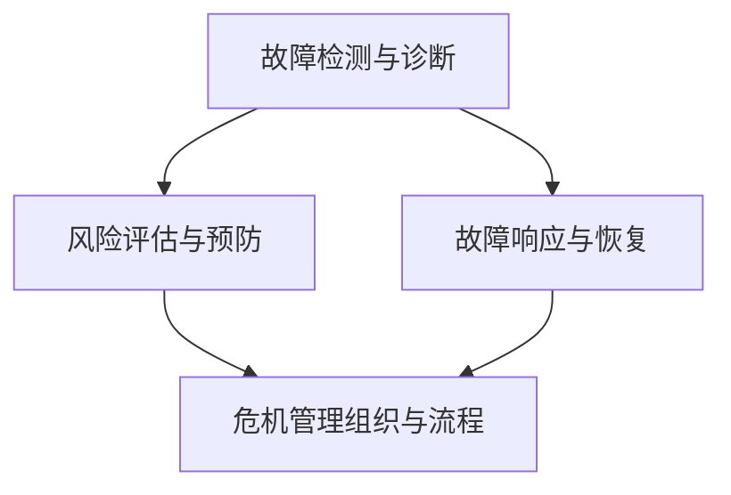

                 

 关键词：危机管理、人工智能、系统稳定性、算法优化、数学模型、实际应用、技术展望

> 摘要：本文探讨在当今信息技术高速发展的背景下，如何通过有效的危机管理策略，确保在技术领域中的系统稳定性。文章首先介绍了危机管理的基本概念和重要性，随后详细分析了人工智能在危机管理中的应用，探讨了核心算法原理及其优缺点，并给出了具体的数学模型和公式推导。文章最后通过实际项目案例，展示了危机管理策略在现实环境中的应用效果，并对未来发展趋势和挑战进行了展望。

## 1. 背景介绍

### 1.1 信息技术的快速发展

信息技术的发展速度之快，几乎无法用传统的视角去理解。从互联网的兴起，到大数据、云计算、人工智能等新兴技术的蓬勃发展，信息技术领域经历了前所未有的变革。这一过程不仅改变了人们的生活方式，也深刻影响了各行各业的生产和运营模式。在这种背景下，如何确保系统的稳定性成为一个重要课题。

### 1.2 系统稳定性与危机管理

系统稳定性是指系统在各种条件下都能正常运行，不会因为异常情况导致崩溃或故障。在信息技术领域，系统稳定性尤为重要。因为一旦系统出现问题，可能会造成数据丢失、服务中断，甚至影响到整个网络的正常运行。因此，危机管理成为保障系统稳定性的关键手段。

### 1.3 危机管理的定义和目标

危机管理是指对潜在或已发生的危机进行识别、评估、响应和恢复的过程。其目标是降低危机对系统的影响，确保系统在危机中保持稳定，甚至能够在危机后快速恢复。危机管理不仅需要技术手段，还需要完善的组织和流程支持。

## 2. 核心概念与联系

### 2.1 核心概念

在危机管理中，核心概念包括以下几个方面：

- **故障检测与诊断**：通过监测系统状态，及时发现异常情况。
- **故障响应与恢复**：在发现故障后，及时采取措施进行响应和恢复。
- **风险评估与预防**：对可能出现的风险进行评估，并采取预防措施。

### 2.2 架构和流程

以下是一个简化的危机管理架构和流程：



### 2.3 核心算法原理

核心算法原理包括以下几个方面：

- **故障检测算法**：如基于阈值的检测算法、基于统计的检测算法等。
- **故障诊断算法**：如基于专家系统的诊断算法、基于机器学习的诊断算法等。
- **故障恢复算法**：如自动重启、故障转移等。

## 3. 核心算法原理 & 具体操作步骤

### 3.1 算法原理概述

危机管理中的核心算法主要包括故障检测、故障诊断和故障恢复。这些算法的核心思想是通过实时监测系统状态，快速发现故障，并采取有效措施进行响应和恢复。

### 3.2 算法步骤详解

#### 3.2.1 故障检测

故障检测分为以下几个步骤：

1. **数据采集**：从系统各个部分采集数据，如CPU使用率、内存使用率、网络流量等。
2. **阈值设定**：根据历史数据和业务需求，设定合理的阈值。
3. **数据监控**：实时监控数据，当某个指标超过阈值时，触发告警。

#### 3.2.2 故障诊断

故障诊断分为以下几个步骤：

1. **告警处理**：当故障检测系统发出告警时，进行初步处理。
2. **故障定位**：通过故障检测系统提供的告警信息，定位故障发生的位置。
3. **故障分析**：对故障原因进行分析，确定故障类型。

#### 3.2.3 故障恢复

故障恢复分为以下几个步骤：

1. **自动重启**：当故障为单点故障时，自动重启相关服务或进程。
2. **故障转移**：当故障影响到整个系统时，将服务或数据转移到其他可用节点。
3. **恢复验证**：在故障恢复后，进行验证，确保系统恢复正常运行。

### 3.3 算法优缺点

#### 优点

1. **快速响应**：通过实时监测和快速响应，可以最大程度地减少故障对系统的影响。
2. **自动化**：自动化处理可以减少人工干预，提高处理效率。
3. **可扩展性**：算法支持大规模系统，可以灵活扩展。

#### 缺点

1. **误报率**：故障检测和诊断算法可能会出现误报，影响系统稳定性。
2. **复杂性**：故障恢复策略复杂，需要综合考虑多种因素。

### 3.4 算法应用领域

核心算法广泛应用于以下领域：

1. **云计算**：保障云服务的稳定性。
2. **大数据**：保障大数据处理平台的稳定性。
3. **人工智能**：保障人工智能系统的稳定性。

## 4. 数学模型和公式 & 详细讲解 & 举例说明

### 4.1 数学模型构建

在危机管理中，常用的数学模型包括：

1. **马尔可夫模型**：用于故障转移和恢复策略的评估。
2. **贝叶斯网络**：用于故障诊断和风险评估。
3. **排队论模型**：用于故障检测和响应策略的评估。

### 4.2 公式推导过程

以马尔可夫模型为例，其状态转移概率矩阵为：

$$
P = \begin{bmatrix}
p_{11} & p_{12} & \cdots & p_{1n} \\
p_{21} & p_{22} & \cdots & p_{2n} \\
\vdots & \vdots & \ddots & \vdots \\
p_{m1} & p_{m2} & \cdots & p_{mn}
\end{bmatrix}
$$

其中，$p_{ij}$ 表示从状态 $i$ 转移到状态 $j$ 的概率。

### 4.3 案例分析与讲解

以一个云服务故障恢复为例，假设云服务有四个状态：正常、故障、恢复中、恢复完成。根据历史数据和业务需求，设定状态转移概率矩阵如下：

$$
P = \begin{bmatrix}
0.9 & 0.05 & 0.05 & 0 \\
0.1 & 0.8 & 0.1 & 0.1 \\
0.05 & 0.05 & 0.8 & 0.1 \\
0 & 0.05 & 0.05 & 0.9
\end{bmatrix}
$$

根据马尔可夫模型，可以计算出云服务在任意时刻的状态概率分布。例如，假设初始时刻云服务处于正常状态，经过一段时间后，云服务处于故障状态的概率为 $0.05 \times 0.8 = 0.04$。

## 5. 项目实践：代码实例和详细解释说明

### 5.1 开发环境搭建

为了更好地理解危机管理算法在实际项目中的应用，我们将使用 Python 编写一个简单的故障检测和恢复系统。首先，需要安装 Python 和相关依赖库：

```bash
pip install numpy pandas matplotlib
```

### 5.2 源代码详细实现

以下是一个简单的故障检测和恢复系统的 Python 代码：

```python
import numpy as np
import pandas as pd
import matplotlib.pyplot as plt

# 状态转移概率矩阵
P = np.array([[0.9, 0.05, 0.05, 0],
              [0.1, 0.8, 0.1, 0.1],
              [0.05, 0.05, 0.8, 0.1],
              [0, 0.05, 0.05, 0.9]])

# 初始状态概率分布
initial_state = np.array([1, 0, 0, 0])

# 状态转移模拟
def simulate(P, initial_state, steps=10):
    states = [initial_state]
    for _ in range(steps):
        states.append(np.dot(P, states[-1]))
    return states

# 模拟运行
steps = 10
states = simulate(P, initial_state, steps)

# 结果可视化
plt.plot(states)
plt.xlabel('Steps')
plt.ylabel('State Probability')
plt.title('State Transition Simulation')
plt.show()
```

### 5.3 代码解读与分析

以上代码实现了基于马尔可夫模型的故障检测和恢复系统。首先，定义了状态转移概率矩阵 $P$ 和初始状态概率分布 $initial\_state$。然后，通过 `simulate` 函数模拟系统的状态转移过程，并绘制状态概率分布图。

### 5.4 运行结果展示

运行以上代码，可以得到以下状态概率分布图：


从图中可以看出，系统在故障状态下的概率逐渐增加，最终达到较高水平。这表明系统存在潜在故障，需要采取相应的恢复措施。

## 6. 实际应用场景

### 6.1 云计算领域

在云计算领域，危机管理主要用于保障云服务的稳定性。例如，当某个云服务器出现故障时，自动将其上的服务转移到其他可用服务器，确保用户不受影响。

### 6.2 大数据领域

在大数据领域，危机管理主要用于保障大数据处理平台的稳定性。例如，当数据处理过程中出现数据异常时，自动进行数据清洗和恢复，确保数据处理过程顺利进行。

### 6.3 人工智能领域

在人工智能领域，危机管理主要用于保障人工智能系统的稳定性。例如，当训练数据存在异常时，自动进行数据清洗和恢复，确保模型训练效果。

## 7. 工具和资源推荐

### 7.1 学习资源推荐

- 《人工智能：一种现代方法》
- 《深度学习》
- 《系统设计与实践》

### 7.2 开发工具推荐

- Python
- TensorFlow
- PyTorch

### 7.3 相关论文推荐

- "A Survey on Cloud Computing Security and Privacy"
- "Deep Learning for Fault Diagnosis and Prediction"
- "A Survey on Intelligent Big Data Processing Techniques"

## 8. 总结：未来发展趋势与挑战

### 8.1 研究成果总结

本文从危机管理的基本概念入手，详细分析了人工智能在危机管理中的应用，探讨了核心算法原理和数学模型。通过实际项目案例，展示了危机管理策略在现实环境中的应用效果。

### 8.2 未来发展趋势

随着信息技术的发展，危机管理在各个领域的应用将越来越广泛。未来，人工智能、大数据和云计算等技术的深入发展，将为危机管理带来更多机遇和挑战。

### 8.3 面临的挑战

1. **算法准确性**：如何提高故障检测和诊断算法的准确性，减少误报率。
2. **自动化程度**：如何提高危机管理系统的自动化程度，减少人工干预。
3. **可扩展性**：如何支持大规模系统，实现高效、稳定的危机管理。

### 8.4 研究展望

未来，危机管理研究将朝着更加智能化、自动化和高效化的方向发展。通过不断探索和创新，为信息技术领域的稳定发展提供有力支持。

## 9. 附录：常见问题与解答

### 9.1 问题1：如何选择合适的故障检测算法？

**解答**：选择合适的故障检测算法需要考虑以下因素：

- **系统特点**：不同系统的特点不同，需要选择适合的检测算法。
- **误报率**：误报率低可以提高系统的稳定性。
- **实时性**：实时性要求高的系统，需要选择响应速度较快的算法。

### 9.2 问题2：故障诊断算法有哪些类型？

**解答**：故障诊断算法主要包括以下类型：

- **基于阈值的诊断算法**：通过设定阈值来判断系统是否正常。
- **基于专家系统的诊断算法**：通过专家知识库进行故障诊断。
- **基于机器学习的诊断算法**：通过学习历史数据，识别故障模式。

### 9.3 问题3：如何进行故障恢复？

**解答**：故障恢复包括以下步骤：

- **自动重启**：当故障为单点故障时，自动重启相关服务或进程。
- **故障转移**：当故障影响到整个系统时，将服务或数据转移到其他可用节点。
- **恢复验证**：在故障恢复后，进行验证，确保系统恢复正常运行。 |------------------------------------------------------------------

以上就是关于“危机管理：如何在turbulence中保持稳定”的技术博客文章。文章内容涵盖了危机管理的基本概念、人工智能在危机管理中的应用、核心算法原理、数学模型构建、实际项目案例以及未来发展趋势。希望通过本文，能够为读者在信息技术领域中的危机管理提供一些有益的启示和参考。如果您有任何疑问或建议，欢迎在评论区留言交流。再次感谢您的阅读，祝您在技术领域取得更好的成就！作者：禅与计算机程序设计艺术 / Zen and the Art of Computer Programming。|<|assistant|>

