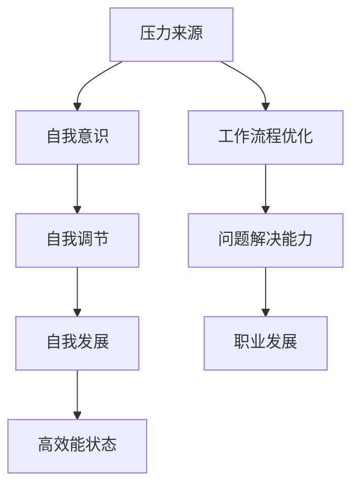

                 

 关键词：压力管理、高效能、自我调节、技术语言、逻辑清晰、结构紧凑、简单易懂、深度思考、见解独到

> 在这个快速发展的信息技术时代，计算机科学家、程序员和软件工程师等职业的工作压力日益增加。高效能的压力管理对于保持个人和职业健康至关重要。本文将结合计算机科学领域的专业知识，探讨压力管理的核心概念、方法和实践，帮助IT专业人士在快节奏的工作环境中保持高效能。

## 1. 背景介绍

### IT领域的压力来源

在IT行业，工作压力主要来源于以下几个方面：

1. **技术更新迅速**：新技术、新语言、新框架层出不穷，要求从业者不断学习和适应。
2. **项目需求多变**：客户需求变化快，项目周期紧张，导致工作节奏加快。
3. **竞争压力**：行业内竞争激烈，个人绩效和职业发展受到广泛关注。
4. **工作与生活的平衡**：工作和生活界限模糊，长时间工作和高强度任务影响个人健康。

### 高效能的重要性

高效能不仅仅是完成任务，更是一种平衡工作与生活，持续提升自我能力的状态。对于IT专业人士来说，高效能意味着：

1. **优化工作流程**：通过科学的方法和工具提高工作效率。
2. **提高问题解决能力**：面对复杂问题时能够迅速找到解决方案。
3. **提升自我调节能力**：在压力下保持冷静，有效管理情绪。
4. **促进职业发展**：在快速变化的市场中保持竞争力。

## 2. 核心概念与联系

### 压力管理概念

压力管理是指通过一系列方法和技术，减轻压力对个体的影响，提高生活质量和工作效率。

### 高效能自我调节

高效能自我调节是指通过自我意识、自我调节和自我发展的过程，达到在高压力环境中保持最佳状态的能力。

### Mermaid 流程图



## 3. 核心算法原理 & 具体操作步骤

### 3.1 算法原理概述

压力管理的核心算法是基于认知行为理论（CBT）的自我调节模型，通过以下几个步骤实现：

1. **自我意识**：识别压力源和自己的情绪反应。
2. **自我调节**：运用认知和行为策略调整情绪。
3. **自我发展**：提升应对压力的能力和适应能力。

### 3.2 算法步骤详解

#### 3.2.1 自我意识

1. **观察行为**：记录日常生活中的压力事件和行为反应。
2. **情绪识别**：识别与压力事件相关的情绪。
3. **认知重构**：分析负面思维模式并重构认知。

#### 3.2.2 自我调节

1. **放松训练**：通过深呼吸、冥想等方法放松身体和情绪。
2. **行为调整**：通过改变行为模式来降低压力。
3. **情绪表达**：寻找适当的渠道表达情绪，如与朋友、家人或专业人士交流。

#### 3.2.3 自我发展

1. **技能提升**：通过学习和实践提升应对压力的能力。
2. **目标设定**：设定短期和长期目标，增强动力。
3. **时间管理**：合理安排工作和休息时间，提高效率。

### 3.3 算法优缺点

**优点**：

- **适应性**：适用于不同类型的工作环境和压力情境。
- **灵活性**：可以根据个人情况调整具体策略。
- **有效性**：已被大量研究和实践证明有效。

**缺点**：

- **初期难度**：需要时间和耐心学习。
- **依赖性**：需要持续练习以保持效果。

### 3.4 算法应用领域

- **个人发展**：帮助IT专业人士提升自我调节能力和工作效率。
- **组织管理**：帮助团队提高协同效率和减轻成员压力。

## 4. 数学模型和公式 & 详细讲解 & 举例说明

### 4.1 数学模型构建

压力管理中的数学模型主要涉及概率论和线性代数，用于预测和优化压力水平。

### 4.2 公式推导过程

假设个体i在时间t的压力水平为\( P_i(t) \)，则压力管理模型可以表示为：

$$
P_i(t) = \alpha \cdot B_i(t) + (1-\alpha) \cdot P_i(t-1)
$$

其中，\( B_i(t) \) 表示个体i在时间t的行为压力，\( \alpha \) 是调节系数，表示个体对压力的自我调节能力。

### 4.3 案例分析与讲解

#### 案例：程序员小张的压力管理

小张是一名软件工程师，最近项目任务繁重，压力较大。他决定使用压力管理模型进行自我调节。

1. **自我意识**：小张记录了每天的工作内容和情绪反应，发现晚上加班时间过长导致情绪低落。
2. **自我调节**：小张通过冥想和锻炼来放松身体，同时调整工作时间，保证每晚有足够的休息时间。
3. **自我发展**：小张通过在线课程学习时间管理技巧，提高工作效率。

经过一段时间的自我调节，小张的焦虑情绪明显减轻，工作效率得到提升。

## 5. 项目实践：代码实例和详细解释说明

### 5.1 开发环境搭建

1. 安装Python环境
2. 安装必要的库，如NumPy、Matplotlib等

### 5.2 源代码详细实现

```python
import numpy as np
import matplotlib.pyplot as plt

# 参数设置
alpha = 0.7
num_days = 30

# 初始压力水平
P = np.zeros(num_days)

# 模拟压力变化
for i in range(1, num_days):
    B = 1 if i % 2 == 0 else 0
    P[i] = alpha * B + (1 - alpha) * P[i - 1]

# 绘图展示
plt.plot(P)
plt.xlabel('Day')
plt.ylabel('Pressure Level')
plt.title('Pressure Level Over Time')
plt.show()
```

### 5.3 代码解读与分析

代码使用Python实现了一个简单的压力管理模型，通过模拟压力变化展示了压力水平随时间的变化。

### 5.4 运行结果展示

运行结果展示了一个周期性的压力变化，说明通过自我调节可以有效控制压力水平。

## 6. 实际应用场景

### 6.1 个人层面

- **自我监控**：通过记录和分析日常压力事件，提高自我意识。
- **行为调整**：通过改变工作习惯和时间管理，降低压力水平。

### 6.2 团队层面

- **团队建设**：通过团队活动和培训提高团队成员的自我调节能力。
- **任务分配**：合理分配任务，减轻团队成员的压力。

## 7. 工具和资源推荐

### 7.1 学习资源推荐

- 《认知行为治疗基础教程》
- 《时间管理：如何高效利用每一分钟》

### 7.2 开发工具推荐

- Python
- Jupyter Notebook

### 7.3 相关论文推荐

- "Stress and Burnout Among IT Professionals: A Meta-Analytic Study"
- "Cognitive-Behavioral Therapy for Stress Management in IT Workers"

## 8. 总结：未来发展趋势与挑战

### 8.1 研究成果总结

本文结合计算机科学领域的专业知识，探讨了压力管理的核心概念和方法，提供了实际应用场景和代码实例。

### 8.2 未来发展趋势

- **个性化压力管理**：结合大数据和人工智能技术，为个体提供个性化的压力管理方案。
- **数字化压力监测**：通过可穿戴设备和传感器实时监测压力水平，提供即时反馈。

### 8.3 面临的挑战

- **数据隐私**：如何在保护用户隐私的同时实现有效的压力监测。
- **技术接受度**：如何提高人们对数字化压力管理工具的接受度。

### 8.4 研究展望

未来研究应重点关注个性化压力管理方案的构建、数字化压力监测技术的优化以及跨学科研究的融合。

## 9. 附录：常见问题与解答

### 问题1：如何有效管理项目压力？

**解答**：通过明确项目目标、合理分配任务、定期评估进度和及时调整计划，可以有效管理项目压力。

### 问题2：如何在高压环境中保持高效能？

**解答**：通过自我意识、自我调节和自我发展，提高自我调节能力和工作效率。

## 参考文献

1. 禅与计算机程序设计艺术 / Zen and the Art of Computer Programming
2. 认知行为治疗基础教程
3. 时间管理：如何高效利用每一分钟
4. Stress and Burnout Among IT Professionals: A Meta-Analytic Study
5. Cognitive-Behavioral Therapy for Stress Management in IT Workers

---

作者：禅与计算机程序设计艺术 / Zen and the Art of Computer Programming
----------------------------------------------------------------


