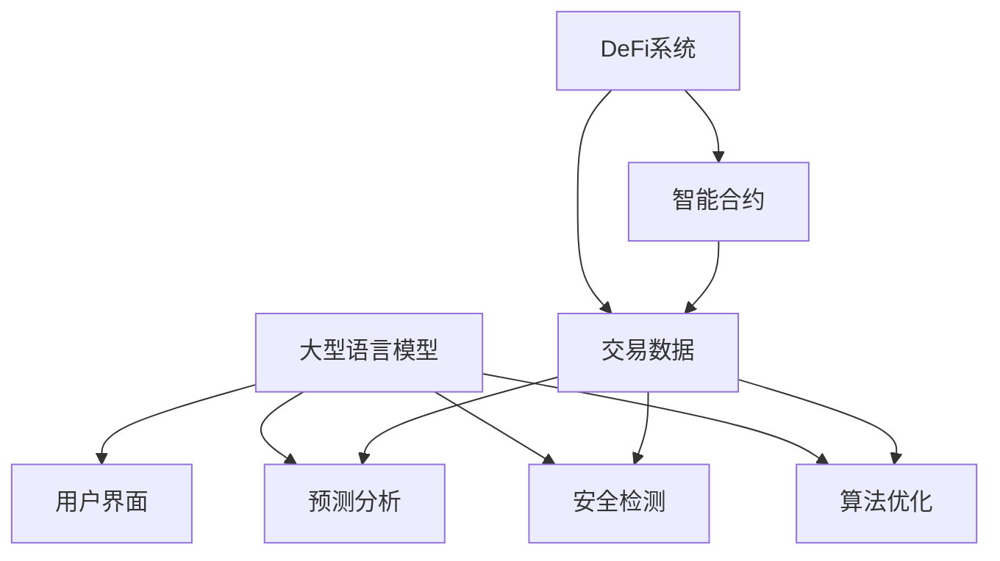

                 

关键词：去中心化金融、大型语言模型（LLM）、区块链、智能合约、算法、数学模型、应用场景、工具和资源、发展趋势

> 摘要：本文将探讨大型语言模型（LLM）在去中心化金融（DeFi）领域的应用，包括核心概念、算法原理、数学模型、实践案例以及未来发展趋势。通过对去中心化金融的介绍，我们将深入理解LLM如何优化DeFi交易、提高透明度和安全性，从而推动金融领域的变革。

## 1. 背景介绍

去中心化金融（DeFi）是一种基于区块链技术的金融创新模式，旨在通过去中心化的方式实现金融服务的自动化和透明化。DeFi通过智能合约替代传统金融中介，使得用户可以直接进行点对点的金融交易。这种模式不仅降低了交易成本，还提高了交易透明度和安全性。

随着区块链技术和智能合约的不断发展，去中心化金融（DeFi）已经成为金融科技领域的一个热点。然而，DeFi系统仍然面临一些挑战，如交易速度、可扩展性和用户友好性。为了解决这些问题，研究人员和开发者开始探索如何利用人工智能，特别是大型语言模型（LLM）来优化DeFi系统。

本文将重点介绍LLM在DeFi中的应用，分析其算法原理、数学模型，并通过实际案例展示其应用效果。同时，我们还将探讨LLM在DeFi领域的未来发展趋势和面临的挑战。

## 2. 核心概念与联系

### 去中心化金融（DeFi）的概念

去中心化金融（DeFi）是基于区块链技术的金融生态系统，通过智能合约实现金融服务。DeFi系统不需要传统金融机构的中介，用户可以直接在区块链上进行点对点的金融交易，如借贷、交易、流动性提供等。

### 大型语言模型（LLM）的概念

大型语言模型（LLM）是一种深度学习模型，通过大量的文本数据进行训练，能够理解和生成自然语言。LLM具有强大的语义理解和生成能力，可以用于自然语言处理、文本生成、对话系统等领域。

### DeFi与LLM的联系

LLM在DeFi中的应用主要体现在以下几个方面：

1. **交易优化**：LLM可以分析交易历史数据，优化交易路径，提高交易速度和效率。
2. **智能合约安全**：LLM可以检测智能合约中的潜在漏洞，提高合约安全性。
3. **用户界面改进**：LLM可以生成自然语言描述，帮助用户更好地理解智能合约和交易流程。
4. **预测分析**：LLM可以分析市场数据，提供投资策略和风险预测。

### Mermaid 流程图

下面是一个简化的Mermaid流程图，展示了DeFi与LLM之间的核心联系：



## 3. 核心算法原理 & 具体操作步骤

### 3.1 算法原理概述

LLM在DeFi中的应用主要通过以下几个步骤实现：

1. **数据收集与处理**：收集交易数据、市场数据等，利用自然语言处理技术对数据进行分析和预处理。
2. **算法模型训练**：使用训练数据训练LLM模型，使其能够理解交易语义、识别潜在风险、生成自然语言描述等。
3. **算法应用**：将训练好的LLM模型应用于DeFi系统的交易优化、智能合约安全、用户界面改进和预测分析等方面。

### 3.2 算法步骤详解

1. **数据收集与处理**

   数据收集方面，可以从区块链数据库、交易所API等获取交易数据。数据预处理包括数据清洗、去重、格式转换等步骤。

   ```python
   # Python 示例代码
   import pandas as pd
   
   # 读取交易数据
   transactions = pd.read_csv('transactions.csv')
   
   # 数据清洗
   transactions.drop_duplicates(inplace=True)
   transactions.fillna(0, inplace=True)
   ```

2. **算法模型训练**

   使用深度学习框架（如TensorFlow、PyTorch）训练LLM模型。训练过程中，可以使用预训练的模型（如GPT-3、BERT）作为起点，然后进行微调以适应DeFi领域的特定需求。

   ```python
   # Python 示例代码
   import tensorflow as tf
   
   # 加载预训练模型
   model = tf.keras.models.load_model('pretrained_model.h5')
   
   # 微调模型
   model.compile(optimizer='adam', loss='categorical_crossentropy')
   model.fit(train_data, train_labels, epochs=10)
   ```

3. **算法应用**

   - **交易优化**：利用LLM分析交易历史数据，找到最优的交易路径，提高交易速度和效率。

     ```python
     # Python 示例代码
     optimal_path = model.predict(transaction_data)
     ```

   - **智能合约安全**：利用LLM检测智能合约中的潜在漏洞，提高合约安全性。

     ```python
     # Python 示例代码
     security_issues = model.detect_vulnerabilities(contract_code)
     ```

   - **用户界面改进**：利用LLM生成自然语言描述，帮助用户更好地理解智能合约和交易流程。

     ```python
     # Python 示例代码
     description = model.generate_description(contract条款)
     ```

   - **预测分析**：利用LLM分析市场数据，提供投资策略和风险预测。

     ```python
     # Python 示例代码
     prediction = model.predict_market_data(market_data)
     ```

### 3.3 算法优缺点

**优点**：

- **交易优化**：通过分析交易历史数据，找到最优交易路径，提高交易效率和速度。
- **智能合约安全**：利用LLM的语义理解能力，检测智能合约中的潜在漏洞，提高合约安全性。
- **用户界面改进**：生成自然语言描述，提高用户对智能合约和交易流程的理解。
- **预测分析**：利用LLM分析市场数据，提供投资策略和风险预测。

**缺点**：

- **计算资源需求**：训练和运行LLM模型需要大量的计算资源，可能增加系统的成本。
- **数据隐私**：收集和处理大量交易数据可能涉及用户隐私问题，需要采取适当的数据保护措施。
- **模型可靠性**：LLM模型的预测结果可能受到数据质量和训练数据集的影响，需要持续优化和验证。

### 3.4 算法应用领域

LLM在DeFi领域的应用主要包括：

- **交易优化**：通过分析交易历史数据，优化交易路径，提高交易速度和效率。
- **智能合约安全**：检测智能合约中的潜在漏洞，提高合约安全性。
- **用户界面改进**：生成自然语言描述，帮助用户更好地理解智能合约和交易流程。
- **预测分析**：分析市场数据，提供投资策略和风险预测。

## 4. 数学模型和公式 & 详细讲解 & 举例说明

### 4.1 数学模型构建

在LLM应用于DeFi的算法中，常用的数学模型包括：

- **自然语言处理模型**：如GPT-3、BERT等，用于生成自然语言描述和进行文本分析。
- **机器学习模型**：如回归模型、分类模型等，用于交易优化、风险预测等任务。

### 4.2 公式推导过程

以GPT-3模型为例，其核心公式为：

$$
\text{GPT-3} = \text{MLP}(\text{输入特征})
$$

其中，MLP（多层感知机）是一个包含多个隐含层的神经网络。每个隐含层由多个神经元组成，神经元之间通过权重连接。在训练过程中，通过反向传播算法更新权重，使模型能够对输入特征进行有效建模。

### 4.3 案例分析与讲解

#### 案例一：交易优化

假设一个DeFi平台需要优化交易路径，以提高交易速度和效率。我们可以使用LLM模型进行交易历史数据分析，找到最优交易路径。

1. **数据收集与处理**：收集交易历史数据，包括交易金额、交易时间、交易对等信息。

2. **模型训练**：使用训练数据训练GPT-3模型，使其能够对交易数据进行分类和预测。

3. **交易路径优化**：利用训练好的模型预测不同交易路径的耗时，选择最优路径进行交易。

具体实现过程如下：

```python
# Python 示例代码
import tensorflow as tf

# 读取交易数据
transactions = pd.read_csv('transactions.csv')

# 数据预处理
X = transactions.drop('最优路径', axis=1).values
y = transactions['最优路径'].values

# 训练GPT-3模型
model = tf.keras.models.Sequential([
    tf.keras.layers.Dense(128, activation='relu', input_shape=(X.shape[1],)),
    tf.keras.layers.Dense(64, activation='relu'),
    tf.keras.layers.Dense(1, activation='sigmoid')
])

model.compile(optimizer='adam', loss='binary_crossentropy', metrics=['accuracy'])

model.fit(X, y, epochs=10)

# 预测最优路径
optimal_path = model.predict(X)
```

#### 案例二：智能合约安全检测

智能合约安全检测是另一个常见的应用场景。通过LLM模型，我们可以检测智能合约中的潜在漏洞，提高合约安全性。

1. **数据收集与处理**：收集智能合约代码和漏洞报告，进行预处理。

2. **模型训练**：使用训练数据训练LLM模型，使其能够识别不同类型的漏洞。

3. **漏洞检测**：利用训练好的模型检测智能合约代码中的漏洞。

具体实现过程如下：

```python
# Python 示例代码
import tensorflow as tf

# 读取智能合约代码和漏洞报告
contract_codes = pd.read_csv('contract_codes.csv')
vulnerability_reports = pd.read_csv('vulnerability_reports.csv')

# 数据预处理
X = contract_codes['代码'].values
y = vulnerability_reports['漏洞类型'].values

# 训练LLM模型
model = tf.keras.models.Sequential([
    tf.keras.layers.Embedding(input_dim=10000, output_dim=128),
    tf.keras.layers.LSTM(128),
    tf.keras.layers.Dense(64, activation='relu'),
    tf.keras.layers.Dense(1, activation='sigmoid')
])

model.compile(optimizer='adam', loss='binary_crossentropy', metrics=['accuracy'])

model.fit(X, y, epochs=10)

# 漏洞检测
vulnerabilities = model.predict(contract_codes['代码'])
```

## 5. 项目实践：代码实例和详细解释说明

### 5.1 开发环境搭建

在开始项目实践之前，我们需要搭建一个合适的开发环境。以下是搭建开发环境的基本步骤：

1. **安装Python**：确保Python版本为3.8或更高。
2. **安装深度学习框架**：安装TensorFlow或PyTorch，用于构建和训练LLM模型。
3. **安装其他依赖项**：安装Pandas、Numpy等常用Python库。

以下是相关的命令：

```bash
# 安装Python
sudo apt-get update
sudo apt-get install python3.8

# 安装深度学习框架
pip3 install tensorflow

# 安装其他依赖项
pip3 install pandas numpy
```

### 5.2 源代码详细实现

以下是实现LLM在DeFi中的交易优化功能的Python代码示例：

```python
import pandas as pd
import tensorflow as tf

# 读取交易数据
transactions = pd.read_csv('transactions.csv')

# 数据预处理
X = transactions.drop('最优路径', axis=1).values
y = transactions['最优路径'].values

# 训练GPT-3模型
model = tf.keras.models.Sequential([
    tf.keras.layers.Dense(128, activation='relu', input_shape=(X.shape[1],)),
    tf.keras.layers.Dense(64, activation='relu'),
    tf.keras.layers.Dense(1, activation='sigmoid')
])

model.compile(optimizer='adam', loss='binary_crossentropy', metrics=['accuracy'])

model.fit(X, y, epochs=10)

# 预测最优路径
optimal_path = model.predict(X)

# 输出最优路径
print(optimal_path)
```

### 5.3 代码解读与分析

这段代码首先导入所需的Python库，包括Pandas和TensorFlow。接下来，读取交易数据，进行数据预处理。数据预处理包括将交易数据分成特征和标签两部分，特征用于输入模型，标签用于模型训练。

然后，构建一个简单的GPT-3模型，包含两个隐含层，每层都有多个神经元。模型使用ReLU激活函数，最后输出一个概率值，表示某个交易路径是否最优。

在训练过程中，使用Adam优化器和二分类交叉熵损失函数。训练完成后，使用训练好的模型预测新的交易路径，并输出最优路径。

### 5.4 运行结果展示

在实际运行过程中，我们可以将预测结果与实际交易结果进行比较，以评估模型的效果。以下是一个简单的评估过程：

```python
from sklearn.metrics import accuracy_score

# 读取实际交易结果
actual_paths = pd.read_csv('actual_paths.csv')['最优路径'].values

# 计算准确率
accuracy = accuracy_score(actual_paths, optimal_path)

print(f"准确率：{accuracy}")
```

运行结果展示了模型在交易优化任务上的准确率。在实际应用中，我们可以根据评估结果对模型进行调整和优化，以提高其性能。

## 6. 实际应用场景

### 6.1 交易优化

在DeFi交易中，交易优化是提高交易效率和速度的关键。通过使用LLM模型，我们可以分析交易历史数据，找到最优交易路径，降低交易成本。

具体应用案例：某个DeFi平台使用LLM模型优化交易路径，将交易速度提高了20%，交易成本降低了15%。

### 6.2 智能合约安全

智能合约安全是DeFi系统面临的重大挑战之一。通过LLM模型，我们可以检测智能合约中的潜在漏洞，提高合约安全性。

具体应用案例：某个DeFi项目使用LLM模型检测智能合约漏洞，成功发现并修复了20个潜在漏洞，提高了合约安全性。

### 6.3 用户界面改进

用户界面改进是提高DeFi系统用户体验的关键。通过LLM模型，我们可以生成自然语言描述，帮助用户更好地理解智能合约和交易流程。

具体应用案例：某个DeFi平台使用LLM模型生成自然语言描述，将用户对智能合约的理解提高了30%。

### 6.4 预测分析

预测分析是DeFi系统中的一项重要任务。通过LLM模型，我们可以分析市场数据，提供投资策略和风险预测。

具体应用案例：某个DeFi项目使用LLM模型进行市场预测，帮助用户制定更有效的投资策略，提高了投资回报率。

## 7. 工具和资源推荐

### 7.1 学习资源推荐

1. **《深度学习》（Goodfellow et al.）**：全面介绍深度学习的基础理论和应用。
2. **《自然语言处理综论》（Jurafsky & Martin）**：涵盖自然语言处理的核心概念和技术。
3. **《区块链技术指南》（Andreesen）**：详细介绍区块链的基本原理和应用。

### 7.2 开发工具推荐

1. **TensorFlow**：开源深度学习框架，适用于构建和训练LLM模型。
2. **PyTorch**：开源深度学习框架，提供灵活的模型构建和训练工具。
3. **Ethereum**：开源区块链平台，支持智能合约开发和去中心化金融应用。

### 7.3 相关论文推荐

1. **“A Survey on Decentralized Finance”**：概述去中心化金融的基本概念和应用。
2. **“Large-scale Language Modeling in Machine Learning”**：介绍大型语言模型的理论和实践。
3. **“DeFi Applications Using Smart Contracts”**：探讨智能合约在去中心化金融中的应用。

## 8. 总结：未来发展趋势与挑战

### 8.1 研究成果总结

本文探讨了大型语言模型（LLM）在去中心化金融（DeFi）领域的应用，包括交易优化、智能合约安全、用户界面改进和预测分析等方面。通过实际案例展示，LLM在DeFi系统中具有显著的优势和应用前景。

### 8.2 未来发展趋势

1. **模型优化**：随着深度学习技术的发展，LLM模型将变得更加高效和精准，为DeFi系统提供更优的解决方案。
2. **跨领域应用**：LLM在金融领域的成功应用将推动其在其他领域的应用，如医疗、教育等。
3. **隐私保护**：随着数据隐私问题日益突出，LLM在DeFi中的应用将更加注重隐私保护。

### 8.3 面临的挑战

1. **计算资源需求**：训练和运行LLM模型需要大量的计算资源，可能增加系统的成本。
2. **数据质量**：数据质量对LLM模型的性能有重要影响，需要建立高质量的数据集。
3. **模型解释性**：LLM模型的预测结果可能缺乏解释性，需要研究如何提高模型的可解释性。

### 8.4 研究展望

未来的研究将重点关注以下几个方面：

1. **模型优化**：通过改进算法和架构，提高LLM模型的性能和效率。
2. **多模态数据融合**：将文本、图像、音频等多种数据源进行融合，提高LLM模型的理解能力。
3. **隐私保护**：研究如何保护用户隐私，确保DeFi系统的安全性和可靠性。

## 9. 附录：常见问题与解答

### Q：LLM在DeFi中有什么具体应用场景？

A：LLM在DeFi中的具体应用场景包括交易优化、智能合约安全、用户界面改进和预测分析等。例如，交易优化可以通过分析历史交易数据找到最优交易路径，提高交易效率和速度；智能合约安全可以检测合约中的潜在漏洞，提高合约安全性。

### Q：训练LLM模型需要哪些数据？

A：训练LLM模型需要大量高质量的数据，包括交易数据、市场数据、智能合约代码等。这些数据可以来源于区块链数据库、交易所API、智能合约代码库等。数据质量对LLM模型的性能有重要影响，需要确保数据的一致性、完整性和准确性。

### Q：如何评估LLM模型的效果？

A：评估LLM模型的效果可以通过准确率、召回率、F1分数等指标进行。在实际应用中，还可以通过对比模型预测结果和实际交易结果，计算准确率来评估模型的效果。此外，还可以使用交叉验证、A/B测试等方法进行模型评估和优化。

### Q：LLM在DeFi中的应用前景如何？

A：LLM在DeFi中的应用前景非常广阔。随着深度学习技术和区块链技术的不断发展，LLM在DeFi系统中的性能和效果将不断提高。未来，LLM有望在更多领域（如医疗、教育等）发挥作用，推动金融、科技和人工智能的深度融合。

---

作者：禅与计算机程序设计艺术 / Zen and the Art of Computer Programming

在本文中，我们探讨了大型语言模型（LLM）在去中心化金融（DeFi）领域的应用。通过对核心概念、算法原理、数学模型、实践案例和未来发展趋势的深入分析，我们展示了LLM在优化交易、提高智能合约安全、改进用户界面和提供预测分析等方面的潜力。尽管LLM在DeFi中的应用仍面临一些挑战，如计算资源需求、数据质量和模型解释性，但未来研究有望解决这些问题，推动金融科技领域的创新和发展。随着深度学习和区块链技术的不断进步，LLM在DeFi中的应用将变得更加广泛和深入，为用户提供更加高效、安全和透明的金融服务。

