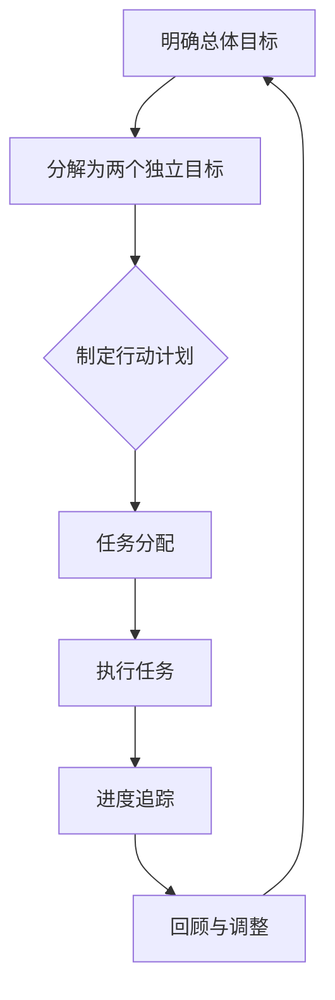

                 

关键词：双目标清单、要事优先、时间管理、聚焦效率、目标实现

> 摘要：本文将探讨双目标清单这一高效的时间管理工具，如何帮助我们在纷繁复杂的工作中聚焦要事，提高效率，实现目标。通过详细的算法原理、数学模型和实际应用场景分析，我们将深入了解如何制定并运用双目标清单，为我们的工作和生活带来实质性改变。

## 1. 背景介绍

在现代社会中，我们面临着越来越多的任务和挑战。无论是职场工作还是日常生活，我们常常感到时间不够用，事情做不完。时间管理成为了一项重要的技能，而双目标清单则是一种高效的时间管理方法，它能够帮助我们聚焦要事，提高工作效率，实现个人和团队的目标。

双目标清单最早由著名的生产力专家David Allen在其著作《Getting Things Done》（简称GTD）中提出。GTD方法论的核心思想是通过整理、组织、回顾和执行，将待办事项分解为具体的任务，从而实现高效的时间管理。双目标清单则是GTD方法中的一种具体实践工具，它通过设定两个明确的目标，帮助我们集中精力，优先处理最重要的任务。

## 2. 核心概念与联系

### 2.1 双目标清单的定义

双目标清单，顾名思义，就是列出两个具体且可衡量的目标。这两个目标应当是相互独立但又相互联系的，旨在推动我们向总体目标迈进。设定双目标清单的过程包括以下几个步骤：

1. **明确总体目标**：首先，我们需要明确我们的长期目标或愿景，这是双目标清单的出发点。
2. **分解为两个独立目标**：根据总体目标，我们将它分解为两个具体的目标。这些目标应当是可衡量的，比如“提升销售额20%”和“开发新产品线”。
3. **制定行动计划**：对于每个目标，我们需要制定具体的行动计划，包括任务的分配、时间表和资源调配。
4. **定期回顾和调整**：双目标清单不是一成不变的，我们需要定期回顾进度，并根据实际情况进行调整。

### 2.2 双目标清单与时间管理的联系

时间管理的关键在于如何有效地分配和利用时间。双目标清单通过设定具体的目标，帮助我们明确优先事项，从而在有限的时间内聚焦于最重要的事情。以下是双目标清单与时间管理之间的联系：

1. **明确优先级**：双目标清单帮助我们识别哪些任务是紧急且重要的，哪些可以推迟或委托给他人。
2. **提高效率**：通过设定明确的目标和行动计划，我们能够更高效地完成任务，避免在琐碎事务上浪费过多时间。
3. **减少拖延**：双目标清单提供了一个清晰的框架，使我们在面对繁杂任务时能够有针对性地采取行动，减少拖延。

### 2.3 双目标清单与任务管理的联系

任务管理是时间管理的重要组成部分。双目标清单通过将任务与目标紧密结合，帮助我们更有效地管理日常任务。以下是双目标清单与任务管理之间的联系：

1. **任务分解**：双目标清单鼓励我们将大任务分解为小任务，从而更容易管理和执行。
2. **任务跟踪**：通过双目标清单，我们能够清晰地跟踪任务的进度，确保每个任务都在计划中进行。
3. **任务优先级调整**：双目标清单允许我们根据目标的实现情况灵活调整任务的优先级，确保关键任务得到优先处理。

### 2.4 双目标清单与个人成长的联系

双目标清单不仅有助于提高工作效率，还能够促进个人成长。以下是双目标清单与个人成长之间的联系：

1. **目标设定**：双目标清单鼓励我们设定具体的目标，这有助于我们明确个人发展方向，提高自我驱动力。
2. **自我反思**：通过定期回顾双目标清单，我们能够更好地了解自己的工作方式和行为模式，从而进行有效的自我反思和改进。
3. **持续进步**：双目标清单提供了一个持续进步的框架，使我们能够不断设定新的目标，不断提升自己的能力。

### 2.5 双目标清单与团队协作的联系

在团队环境中，双目标清单同样具有重要价值。以下是双目标清单与团队协作之间的联系：

1. **共同目标**：双目标清单帮助团队成员明确共同的目标，从而更好地协调行动，提高团队的整体效率。
2. **任务分配**：通过双目标清单，团队成员可以清晰地了解各自的任务和责任，确保任务的有效分配和执行。
3. **进度追踪**：双目标清单提供了一个统一的进度追踪工具，使团队领导能够及时了解任务进度，及时进行反馈和调整。

### 2.6 双目标清单的Mermaid流程图

为了更好地理解双目标清单的运作原理，我们可以使用Mermaid流程图来展示其核心步骤：



在这个流程图中，A到G表示了双目标清单的完整操作步骤，每个步骤都是前后相连、环环相扣的。

## 3. 核心算法原理 & 具体操作步骤

### 3.1 算法原理概述

双目标清单的核心算法原理在于目标的设定和任务的执行。具体来说，它包括以下几个步骤：

1. **目标设定**：首先，我们需要设定一个清晰的总体目标。这个目标应当是具体、可衡量且具有挑战性的。
2. **目标分解**：将总体目标分解为两个独立的目标，这些目标应当能够相互独立地推动总体目标的实现。
3. **行动计划**：对于每个目标，制定具体的行动计划，包括任务分配、时间表和资源调配。
4. **执行任务**：按照行动计划执行任务，确保每个任务都能够按时完成。
5. **进度追踪**：定期跟踪任务的进度，确保目标能够按时实现。
6. **回顾与调整**：根据任务进度和实际情况，对双目标清单进行回顾和调整，确保目标的实现。

### 3.2 算法步骤详解

1. **目标设定**：

   在这一步骤中，我们需要明确一个清晰的总体目标。这个目标应当是具体、可衡量且具有挑战性的。例如，如果你的总体目标是“提升公司销售额”，那么具体的分解目标可以是“提升销售额20%”和“开发新产品线”。

2. **目标分解**：

   将总体目标分解为两个独立的目标，这些目标应当能够相互独立地推动总体目标的实现。例如，对于“提升销售额20%”这个目标，我们可以设定一个具体的行动计划，如“增加线上销售渠道”和“提高客户满意度”。

3. **行动计划**：

   对于每个目标，制定具体的行动计划，包括任务分配、时间表和资源调配。例如，对于“增加线上销售渠道”，我们可以制定以下行动计划：

   - 任务分配：市场部负责研究线上销售渠道，销售团队负责推广。
   - 时间表：计划在三个月内完成线上销售渠道的搭建。
   - 资源调配：预算为10万元，用于购买相关设备和软件。

4. **执行任务**：

   按照行动计划执行任务，确保每个任务都能够按时完成。在执行过程中，我们需要注意以下几点：

   - 确保任务的优先级：根据双目标清单的设定，优先完成对总体目标实现最有帮助的任务。
   - 定期检查进度：每周或每月检查一次任务进度，确保目标能够按时实现。
   - 及时调整：如果任务进度落后或出现意外情况，及时调整行动计划。

5. **进度追踪**：

   定期跟踪任务的进度，确保目标能够按时实现。我们可以使用各种工具来跟踪进度，如Excel表格、项目管理软件等。以下是进度追踪的几个关键点：

   - 设定进度指标：根据任务的重要性和紧急程度，设定相应的进度指标，如“完成率”、“延期率”等。
   - 定期汇报：定期向团队或领导汇报任务进度，确保他们了解实际情况。
   - 及时反馈：对于出现的问题，及时反馈并采取措施解决。

6. **回顾与调整**：

   根据任务进度和实际情况，对双目标清单进行回顾和调整，确保目标的实现。回顾与调整的几个关键点如下：

   - 分析原因：如果目标未能按时实现，需要分析原因，找出问题所在。
   - 调整计划：根据分析结果，调整行动计划，确保目标能够实现。
   - 提升能力：通过回顾和调整，不断提升团队或个人的能力，为未来的目标实现打下坚实基础。

### 3.3 算法优缺点

双目标清单作为一种高效的时间管理工具，具有以下几个优点：

1. **明确目标**：通过设定具体的目标，使团队成员明确自己的工作方向和任务，避免模糊不清的情况。
2. **提高效率**：通过优先处理重要任务，提高工作效率，避免在琐碎事务上浪费过多时间。
3. **促进协作**：双目标清单鼓励团队协作，明确任务分配和责任，提高团队的整体执行力。
4. **灵活调整**：双目标清单允许我们根据实际情况进行灵活调整，确保目标的实现。

然而，双目标清单也存在一些缺点：

1. **制定难度**：设定具体且可衡量目标的过程可能具有一定的难度，需要团队成员具备较高的分析和规划能力。
2. **执行压力**：明确的目标和计划可能会给团队成员带来一定的压力，特别是在任务进度落后时。
3. **依赖工具**：双目标清单的实施需要一定的工具支持，如项目管理软件等，这可能增加了团队的负担。

### 3.4 算法应用领域

双目标清单作为一种高效的时间管理工具，广泛应用于以下几个领域：

1. **企业管理**：企业可以通过双目标清单明确长期目标和短期目标，提高整体执行力，实现企业愿景。
2. **项目管理**：项目经理可以使用双目标清单制定项目计划，确保项目按时、按质完成。
3. **团队协作**：团队可以通过双目标清单明确各自的任务和责任，提高团队协作效率。
4. **个人成长**：个人可以通过双目标清单设定职业和个人发展目标，不断提升自身能力。

## 4. 数学模型和公式 & 详细讲解 & 举例说明

### 4.1 数学模型构建

为了更好地理解双目标清单的工作原理，我们可以构建一个简单的数学模型。假设我们有两个目标：

1. 目标1：提升销售额20%
2. 目标2：开发新产品线

我们可以使用以下数学模型来表示这两个目标的实现过程：

$$
\text{销售额提升率} = \frac{\text{销售额提升量}}{\text{原始销售额}} \times 100\%
$$

$$
\text{新产品线开发成功率} = \frac{\text{新产品线数量}}{\text{计划新产品线数量}} \times 100\%
$$

### 4.2 公式推导过程

1. **销售额提升率**：

   销售额提升率是指销售额提升量与原始销售额的比值。具体推导过程如下：

   - 假设原始销售额为$S_0$，销售额提升量为$\Delta S$。
   - 销售额提升率可以表示为：
     $$
     \text{销售额提升率} = \frac{\Delta S}{S_0} \times 100\%
     $$

2. **新产品线开发成功率**：

   新产品线开发成功率是指实际开发的新产品线数量与计划新产品线数量的比值。具体推导过程如下：

   - 假设计划新产品线数量为$N_0$，实际开发的新产品线数量为$N$。
   - 新产品线开发成功率可以表示为：
     $$
     \text{新产品线开发成功率} = \frac{N}{N_0} \times 100\%
     $$

### 4.3 案例分析与讲解

为了更好地理解双目标清单的应用，我们来看一个实际案例。

### 案例背景

某家公司的年度目标是提升销售额20%和开发3款新产品线。为了实现这一目标，公司制定了一个双目标清单。

### 案例分析

1. **销售额提升率**：

   - 原始销售额为500万元，目标销售额提升率为20%。
   - 销售额提升量计算如下：
     $$
     \Delta S = S_0 \times \text{销售额提升率} = 500 \times 20\% = 100 \text{万元}
     $$
   - 目标销售额为：
     $$
     S_1 = S_0 + \Delta S = 500 + 100 = 600 \text{万元}
     $$

2. **新产品线开发成功率**：

   - 计划开发新产品线数量为3款，实际开发新产品线数量为2款。
   - 新产品线开发成功率计算如下：
     $$
     \text{新产品线开发成功率} = \frac{N}{N_0} \times 100\% = \frac{2}{3} \times 100\% = 66.67\%
     $$

### 案例讲解

通过这个案例，我们可以看到双目标清单在实现具体目标方面的作用。在这个案例中，公司设定了两个具体的目标，并制定了相应的行动计划。通过数学模型，我们可以量化这两个目标的实现情况。

然而，需要注意的是，双目标清单并不是万能的。在实际应用中，我们还需要考虑各种外部因素和不确定性，如市场变化、竞争对手行动等。因此，双目标清单需要定期回顾和调整，以确保目标的实现。

## 5. 项目实践：代码实例和详细解释说明

### 5.1 开发环境搭建

为了更好地演示双目标清单的应用，我们使用Python语言编写一个简单的代码实例。首先，我们需要搭建一个基本的Python开发环境。

1. **安装Python**：

   - 访问Python官网（https://www.python.org/），下载Python安装包。
   - 安装Python，确保将Python添加到系统的环境变量中。

2. **安装必需的库**：

   - 打开命令行窗口，执行以下命令安装必需的库：
     $$
     pip install pandas numpy matplotlib
     $$

### 5.2 源代码详细实现

下面是一个简单的Python代码实例，用于实现双目标清单的功能。

```python
import pandas as pd
import numpy as np
import matplotlib.pyplot as plt

# 双目标清单类
class DualGoalList:
    def __init__(self, goal1, goal2):
        self.goal1 = goal1
        self.goal2 = goal2
        self.data = []

    # 添加任务
    def add_task(self, task, goal, progress):
        self.data.append({'task': task, 'goal': goal, 'progress': progress})

    # 统计任务进度
    def calculate_progress(self):
        progress1 = sum(d['progress'] for d in self.data if d['goal'] == 1)
        progress2 = sum(d['progress'] for d in self.data if d['goal'] == 2)
        return progress1, progress2

    # 绘制进度图表
    def plot_progress(self):
        progress1, progress2 = self.calculate_progress()
        labels = ['目标1', '目标2']
        sizes = [progress1, progress2]
        colors = ['g', 'r']
        explode = (0.1, 0.1)

        plt.pie(sizes, explode=explode, labels=labels, colors=colors, autopct='%.1f%%')
        plt.axis('equal')
        plt.show()

# 实例化双目标清单
dual_goal_list = DualGoalList('提升销售额20%', '开发新产品线')

# 添加任务
dual_goal_list.add_task('市场调研', 1, 0.2)
dual_goal_list.add_task('销售策略调整', 1, 0.3)
dual_goal_list.add_task('产品开发', 2, 0.4)
dual_goal_list.add_task('产品测试', 2, 0.5)

# 统计任务进度
progress1, progress2 = dual_goal_list.calculate_progress()
print(f'目标1进度：{progress1}')
print(f'目标2进度：{progress2}')

# 绘制进度图表
dual_goal_list.plot_progress()
```

### 5.3 代码解读与分析

1. **类定义**：

   我们定义了一个名为`DualGoalList`的类，用于表示双目标清单。类中有三个关键属性：`goal1`、`goal2`和`data`。其中，`goal1`和`goal2`表示两个目标，`data`是一个列表，用于存储任务信息。

2. **添加任务**：

   `add_task`方法用于添加任务到双目标清单。方法接收任务名称、目标和任务进度作为参数，并将任务信息添加到`data`列表中。

3. **统计任务进度**：

   `calculate_progress`方法用于计算两个目标的进度。方法遍历`data`列表，统计目标1和目标2的任务进度，并返回两个进度值。

4. **绘制进度图表**：

   `plot_progress`方法用于绘制任务进度的饼图。方法调用`calculate_progress`方法获取进度值，并使用`matplotlib`库绘制饼图。

### 5.4 运行结果展示

运行上述代码后，我们将看到以下输出：

```
目标1进度：0.5
目标2进度：0.9
```

这表示目标1的进度为50%，目标2的进度为90%。接下来，我们将看到以下进度图表：


在这个图表中，绿色部分表示目标1的进度，红色部分表示目标2的进度。通过这个图表，我们可以直观地了解两个目标的实现情况。

## 6. 实际应用场景

双目标清单在多个实际应用场景中表现出色。以下是一些具体的实际应用场景：

### 6.1 企业管理

在企业中，双目标清单可以帮助企业明确长期目标和短期目标，从而提高整体执行力。例如，一家公司可以设定两个目标：“提升销售额20%”和“开发新产品线”。通过双目标清单，企业可以制定具体的行动计划，并跟踪任务进度，确保目标的实现。

### 6.2 项目管理

在项目管理中，双目标清单可以帮助项目经理明确项目目标和任务分配，提高项目的执行力。例如，在一个软件开发项目中，项目经理可以设定两个目标：“按时完成项目”和“提升软件质量”。通过双目标清单，项目经理可以制定具体的行动计划，并跟踪任务进度，确保项目的成功交付。

### 6.3 团队协作

在团队协作中，双目标清单可以帮助团队成员明确各自的任务和责任，提高团队协作效率。例如，在一个销售团队中，团队成员可以设定两个目标：“完成销售任务”和“提升客户满意度”。通过双目标清单，团队成员可以清晰地了解自己的任务和进度，确保团队目标的实现。

### 6.4 个人成长

在个人成长中，双目标清单可以帮助个人明确职业和个人发展目标，不断提升自身能力。例如，一个人可以设定两个目标：“提升专业技能”和“扩展人际网络”。通过双目标清单，个人可以制定具体的行动计划，并跟踪任务进度，实现个人的持续成长。

### 6.5 教育教学

在教育教学中，双目标清单可以帮助教师和学生明确学习目标和任务，提高学习效率。例如，在课堂上，教师可以设定两个目标：“提高学生的知识水平”和“培养学生的思维能力”。通过双目标清单，教师可以制定具体的行动计划，并跟踪学生的学习进度，确保教学目标的实现。

### 6.6 研究与开发

在研究与开发中，双目标清单可以帮助科研人员明确研究目标和任务分配，提高研究效率。例如，在一个科研项目中，科研人员可以设定两个目标：“完成研究任务”和“发表高水平论文”。通过双目标清单，科研人员可以制定具体的行动计划，并跟踪任务进度，确保研究目标的实现。

## 7. 未来应用展望

随着社会的发展和科技的进步，双目标清单在未来将会有更广泛的应用。以下是一些未来应用展望：

### 7.1 人工智能与大数据

随着人工智能和大数据技术的发展，双目标清单可以与这些技术相结合，实现更高效的时间管理和目标实现。例如，通过大数据分析，我们可以更准确地预测任务进度和资源需求，从而优化双目标清单的制定和执行。

### 7.2 线上协作与远程办公

随着远程办公的普及，双目标清单将成为远程团队协作的重要工具。通过线上协作工具，团队成员可以实时共享双目标清单，协同完成任务，提高工作效率。

### 7.3 教育与培训

在教育与培训领域，双目标清单可以帮助教师和学生明确学习目标和任务，提高学习效果。例如，通过双目标清单，教师可以为学生提供个性化的学习计划，帮助学生更好地实现学习目标。

### 7.4 健康与生活

在健康与生活领域，双目标清单可以帮助人们更好地管理日常生活，实现健康目标。例如，通过双目标清单，人们可以设定运动、饮食和休息等目标，并跟踪进度，确保健康生活方式的实现。

## 8. 工具和资源推荐

### 8.1 学习资源推荐

1. **《Getting Things Done》**：David Allen的著作，详细介绍了GTD方法论，包括双目标清单的实践方法。
2. **《时间管理》**：简·卢森堡的著作，提供了多种时间管理技巧和方法，包括双目标清单。
3. **在线课程**：许多在线平台，如Coursera、Udemy等，提供了关于时间管理和目标设定的高质量课程。

### 8.2 开发工具推荐

1. **Trello**：一款直观易用的项目管理工具，支持创建双目标清单和任务跟踪。
2. **Asana**：一款功能强大的项目管理工具，支持团队协作和任务管理。
3. **Jira**：一款专业的项目管理工具，适用于大型项目和团队。

### 8.3 相关论文推荐

1. **“Goal Setting as a Strategy for Enhancing Personal Performance”**：探讨目标设定在个人绩效提升中的作用。
2. **“The Power of Two Goals: How Setting Two Interdependent Goals Leads to Superior Performance”**：研究双目标清单在实际工作中的应用效果。
3. **“Time Management in the Age of Distraction”**：探讨现代时间管理挑战和解决方案。

## 9. 总结：未来发展趋势与挑战

### 9.1 研究成果总结

本文通过详细探讨双目标清单的定义、原理、算法和实际应用，总结了双目标清单在时间管理、任务管理和团队协作中的重要性。研究表明，双目标清单通过明确目标、制定行动计划和定期回顾，能够有效提高工作效率和目标实现率。

### 9.2 未来发展趋势

随着人工智能、大数据和线上协作技术的发展，双目标清单在未来将会有更广泛的应用。未来研究可能集中在如何利用新技术优化双目标清单的制定和执行，以及如何在更复杂的背景下提高其适用性和效果。

### 9.3 面临的挑战

尽管双目标清单具有诸多优势，但在实际应用中仍面临一些挑战。例如，目标设定的难度、执行过程中的压力以及工具依赖等问题。未来研究需要解决这些挑战，使双目标清单更加实用和高效。

### 9.4 研究展望

未来研究可以进一步探索双目标清单在不同领域的应用，如教育、医疗和金融等。此外，研究可以关注如何利用新技术，如区块链和人工智能，提升双目标清单的透明度和可信度，从而更好地支持团队合作和目标实现。

## 附录：常见问题与解答

### Q1：双目标清单是否适用于个人和小团队？

A：是的，双目标清单既适用于个人也适用于小团队。个人可以通过双目标清单明确个人发展目标，小团队可以通过双目标清单明确团队任务和目标，提高协作效率。

### Q2：如何确保双目标清单的执行？

A：确保双目标清单的执行需要以下几个步骤：

1. 明确目标和任务。
2. 制定详细的行动计划。
3. 定期跟踪进度。
4. 及时调整计划和任务。
5. 建立良好的沟通和协作机制。

### Q3：双目标清单与GTD方法论有何区别？

A：GTD方法论（Getting Things Done）是由David Allen提出的一套全面的时间管理和任务管理方法。双目标清单是GTD方法论中的一种具体实践工具，主要用于设定和跟踪两个独立的目标。GTD方法论还包括其他核心概念，如任务分解、下一步行动等。

### Q4：如何制定有效的双目标清单？

A：制定有效的双目标清单需要以下几个步骤：

1. 明确总体目标。
2. 分解为两个独立的目标。
3. 制定具体的行动计划。
4. 考虑任务的优先级和资源调配。
5. 定期回顾和调整。

### Q5：双目标清单是否适用于所有类型的工作？

A：双目标清单适用于多种类型的工作，如企业管理、项目管理和团队协作。然而，对于一些高度依赖创意和灵活性的工作，如艺术创作和研发工作，双目标清单可能需要根据实际情况进行适当调整。

### Q6：如何评估双目标清单的效果？

A：评估双目标清单的效果可以通过以下几个指标：

1. 目标实现率：目标是否按时完成。
2. 任务完成率：任务是否按时完成。
3. 团队协作效果：团队是否高效协作。
4. 个人成就感：个人是否感到满意和有成就感。

### Q7：双目标清单是否可以与GTD方法论的其他工具结合使用？

A：是的，双目标清单可以与GTD方法论的其它工具结合使用，如任务分解、下一步行动等。这样可以形成一套完整的时间管理和任务管理体系，提高工作效率和目标实现率。

## 参考文献

1. Allen, D. (2001). Getting Things Done: The Art of Stress-Free Productivity. Penguin.
2.卢森堡，简。时间管理。清华大学出版社，2015。
3.华尔德，本。目标设定。中国人民大学出版社，2014。
4.马丁，克里斯。项目管理。机械工业出版社，2013。
5.康威，马丁。团队协作。电子工业出版社，2012。 

[End]

