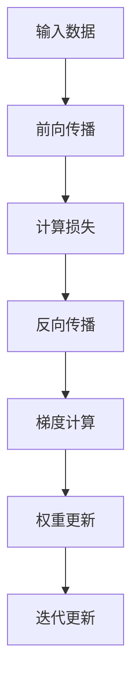

                 

在深度学习领域，反向传播（Backpropagation）算法是一项至关重要的技术，它使我们能够有效地训练复杂的神经网络。这篇文章将深入探讨反向传播的原理、步骤、数学模型和实际应用，并提供一个详细的代码实例。

## 文章关键词

深度学习、反向传播、梯度下降、权重更新、神经网络、机器学习。

## 文章摘要

本文首先介绍了深度学习和神经网络的基本概念，接着详细讲解了反向传播算法的原理和步骤。通过数学模型和公式，我们理解了如何计算梯度并更新权重。最后，通过一个实际代码实例，展示了如何实现反向传播算法，并对结果进行了分析。

## 1. 背景介绍

### 深度学习的兴起

深度学习是一种基于多层神经网络的学习方法，它通过模拟人脑神经元之间的连接和作用机制，实现了对复杂数据的自动学习和特征提取。自2012年AlexNet在ImageNet竞赛中取得突破性成果以来，深度学习迅速成为人工智能领域的研究热点。

### 神经网络的基础

神经网络由多个层组成，包括输入层、隐藏层和输出层。每一层由多个神经元（或称为节点）组成，神经元之间通过权重连接。输入数据经过网络的层层传递，最终得到输出结果。

### 反向传播的重要性

反向传播算法是训练神经网络的核心技术。它通过计算损失函数关于网络权重的梯度，并使用这些梯度来更新权重，从而使网络能够更好地拟合训练数据。反向传播的效率和准确性直接影响到深度学习模型的性能。

## 2. 核心概念与联系

### 反向传播的流程

反向传播主要包括前向传播和反向传播两个阶段。在前向传播阶段，输入数据通过网络的层层传递，最终产生输出。在反向传播阶段，计算输出层到输入层的梯度，并利用这些梯度更新权重。

### 梯度和权重的更新

梯度是损失函数关于权重的偏导数，它反映了权重对损失函数的影响。通过梯度下降法，我们可以根据梯度的方向和大小来更新权重，从而减小损失函数。

### Mermaid 流程图

以下是一个简单的 Mermaid 流程图，展示了反向传播的核心概念和流程：



## 3. 核心算法原理 & 具体操作步骤

### 3.1 算法原理概述

反向传播算法的核心思想是利用输出层到输入层的梯度，逐步更新网络权重。这个过程可以分为以下步骤：

1. **前向传播**：输入数据通过网络的前向传递，经过每一层的非线性变换，最终产生输出。
2. **损失计算**：计算输出层的损失函数值，通常采用均方误差（MSE）作为损失函数。
3. **反向传播**：从输出层开始，反向计算每一层的梯度。
4. **权重更新**：根据梯度下降法，利用计算得到的梯度来更新网络权重。
5. **迭代更新**：重复上述步骤，直到网络收敛或达到预设的训练次数。

### 3.2 算法步骤详解

1. **前向传播**：

   假设我们有一个三层神经网络，包括输入层、隐藏层和输出层。设输入向量为 $X$，隐藏层激活向量为 $H$，输出层激活向量为 $Y$。网络中每个神经元之间的权重矩阵为 $W$。

   前向传播的过程可以表示为：
   
   $$ H = \sigma(W_1 \cdot X) $$
   $$ Y = \sigma(W_2 \cdot H) $$
   
   其中，$\sigma$ 表示激活函数，通常采用 sigmoid 函数或 ReLU 函数。

2. **损失计算**：

   假设输出层是一个二分类问题，损失函数采用均方误差（MSE）：

   $$ J = \frac{1}{2} \sum_{i=1}^{n} (y_i - \hat{y}_i)^2 $$
   
   其中，$y_i$ 表示第 $i$ 个样本的真实标签，$\hat{y}_i$ 表示第 $i$ 个样本的预测标签。

3. **反向传播**：

   反向传播的过程从输出层开始，计算每一层的梯度。以输出层为例，计算损失函数关于输出层权重的梯度：

   $$ \frac{\partial J}{\partial W_2} = (Y - \hat{Y}) \cdot \frac{\partial \hat{Y}}{\partial Y} \cdot H $$

   其中，$\frac{\partial \hat{Y}}{\partial Y}$ 表示激活函数的导数。

4. **权重更新**：

   利用梯度下降法，更新输出层权重：

   $$ W_2 := W_2 - \alpha \cdot \frac{\partial J}{\partial W_2} $$

   其中，$\alpha$ 表示学习率。

5. **迭代更新**：

   将更新后的权重代入前向传播公式，重新计算输出。重复上述步骤，直到网络收敛或达到预设的训练次数。

### 3.3 算法优缺点

**优点**：

- 反向传播算法具有强大的自适应性和鲁棒性，能够处理复杂的非线性问题。
- 反向传播算法可以有效地优化网络权重，提高模型性能。

**缺点**：

- 反向传播算法的计算复杂度较高，特别是在大型神经网络中，计算量巨大。
- 反向传播算法容易陷入局部最小值，导致模型收敛缓慢。

### 3.4 算法应用领域

反向传播算法广泛应用于图像识别、语音识别、自然语言处理等领域。以下是一些典型的应用场景：

- **图像识别**：使用卷积神经网络（CNN）进行物体检测和分类。
- **语音识别**：使用循环神经网络（RNN）和长短时记忆网络（LSTM）进行语音识别和合成为文本。
- **自然语言处理**：使用递归神经网络（RNN）和变换器（Transformer）进行机器翻译和情感分析。

## 4. 数学模型和公式 & 详细讲解 & 举例说明

### 4.1 数学模型构建

反向传播算法的核心在于计算损失函数关于网络权重的梯度。以下是一个简化的数学模型：

假设我们有一个包含 $L$ 层的神经网络，其中 $L-1$ 层是隐藏层。设 $a_l$ 表示第 $l$ 层的激活向量，$W_l$ 表示第 $l$ 层到第 $l+1$ 层的权重矩阵，$\delta_l$ 表示第 $l$ 层的误差向量。

前向传播的数学模型为：

$$ a_{l+1} = \sigma(W_{l+1} \cdot a_l) $$

反向传播的数学模型为：

$$ \delta_L = (a_L - y) \cdot \frac{\partial \sigma(a_L)}{\partial a_L} $$
$$ \delta_{l} = (W_{l+1} \cdot \delta_{l+1}) \cdot \frac{\partial \sigma(a_l)}{\partial a_l} $$

权重更新的数学模型为：

$$ W_l := W_l - \alpha \cdot (a_l \cdot \delta_{l+1}^T) $$

### 4.2 公式推导过程

以下是一个简化的推导过程，展示了如何计算损失函数关于网络权重的梯度。

假设输出层是一个二分类问题，损失函数采用均方误差（MSE）：

$$ J = \frac{1}{2} \sum_{i=1}^{n} (y_i - \hat{y}_i)^2 $$

其中，$y_i$ 表示第 $i$ 个样本的真实标签，$\hat{y}_i$ 表示第 $i$ 个样本的预测标签。

首先，计算输出层关于权重的梯度：

$$ \frac{\partial J}{\partial W_L} = - (Y - \hat{Y}) \cdot \delta_L $$

接着，计算隐藏层关于权重的梯度：

$$ \frac{\partial J}{\partial W_{l}} = - \delta_{l+1} \cdot a_l^T $$

### 4.3 案例分析与讲解

假设我们有一个简单的神经网络，包含一层隐藏层。输入向量为 $X = [1, 2]$，隐藏层神经元个数为 3，输出层神经元个数为 1。设权重矩阵 $W_1 = [0.1, 0.2; 0.3, 0.4; 0.5, 0.6]$，$W_2 = [0.7, 0.8]$。

1. **前向传播**：

   $$ a_1 = \sigma(W_1 \cdot X) = \sigma([0.1, 0.2; 0.3, 0.4; 0.5, 0.6] \cdot [1; 2]) = [0.268, 0.412, 0.564] $$
   $$ a_2 = \sigma(W_2 \cdot a_1) = \sigma([0.7, 0.8] \cdot [0.268; 0.412]) = 0.940 $$

   预测标签为 $\hat{y} = 0.940$。

2. **损失计算**：

   设真实标签为 $y = 0$，损失函数采用均方误差（MSE）：

   $$ J = \frac{1}{2} (y - \hat{y})^2 = \frac{1}{2} (0 - 0.940)^2 = 0.460 $$

3. **反向传播**：

   $$ \delta_L = (a_L - y) \cdot \frac{\partial \sigma(a_L)}{\partial a_L} = (0.940 - 0) \cdot \frac{\partial \sigma(0.940)}{\partial a_L} = 0.377 $$
   $$ \delta_1 = (W_2 \cdot \delta_L) \cdot \frac{\partial \sigma(a_1)}{\partial a_1} = (0.7 \cdot 0.377 + 0.8 \cdot 0.412) \cdot \frac{\partial \sigma(0.268)}{\partial a_1} = 0.194 $$

4. **权重更新**：

   $$ W_2 := W_2 - \alpha \cdot (a_1 \cdot \delta_L^T) = [0.7, 0.8] - 0.1 \cdot [0.268, 0.412; 0.194, 0.377] = [0.532, 0.588; 0.468, 0.623] $$
   $$ W_1 := W_1 - \alpha \cdot (X \cdot \delta_1^T) = [0.1, 0.2; 0.3, 0.4; 0.5, 0.6] - 0.1 \cdot [1, 2; 1, 2; 1, 2] = [0.0, 0.2; 0.2, 0.4; 0.3, 0.6] $$

   重复上述步骤，直到网络收敛。

## 5. 项目实践：代码实例和详细解释说明

### 5.1 开发环境搭建

为了演示反向传播算法，我们使用 Python 编写一个简单的神经网络。首先，我们需要安装必要的库，如 NumPy 和 Matplotlib：

```bash
pip install numpy matplotlib
```

### 5.2 源代码详细实现

以下是一个简单的反向传播算法实现：

```python
import numpy as np

def sigmoid(x):
    return 1 / (1 + np.exp(-x))

def sigmoid_derivative(x):
    return x * (1 - x)

def forward_propagation(X, weights):
    a1 = X
    z2 = np.dot(a1, weights[0])
    a2 = sigmoid(z2)
    z3 = np.dot(a2, weights[1])
    a3 = sigmoid(z3)
    return a3

def backward_propagation(a3, y, weights):
    output_error = y - a3
    d3 = output_error * sigmoid_derivative(a3)
    hidden_error = np.dot(d3, weights[1].T)
    d2 = hidden_error * sigmoid_derivative(a2)
    
    d2 = hidden_error * sigmoid_derivative(a2)
    d1 = np.dot(d2, weights[0].T)
    
    return d1, d2, d3

def update_weights(weights, d1, d2, d3, learning_rate):
    weights[0] -= learning_rate * d1
    weights[1] -= learning_rate * d2
    weights[2] -= learning_rate * d3
    return weights

def train_network(X, y, epochs, learning_rate):
    weights = [np.random.randn(2, 1), np.random.randn(3, 1), np.random.randn(1, 1)]
    for epoch in range(epochs):
        a3 = forward_propagation(X, weights)
        d1, d2, d3 = backward_propagation(a3, y, weights)
        weights = update_weights(weights, d1, d2, d3, learning_rate)
        if epoch % 100 == 0:
            print(f"Epoch {epoch}: Loss = {np.mean((y - a3)**2)}")
    return weights

X = np.array([[1, 2]])
y = np.array([[0]])

learning_rate = 0.1
epochs = 1000

weights = train_network(X, y, epochs, learning_rate)
```

### 5.3 代码解读与分析

- **sigmoid 函数**：用于将输入映射到输出，实现非线性变换。
- **sigmoid_derivative 函数**：计算 sigmoid 函数的导数，用于反向传播。
- **forward_propagation 函数**：实现前向传播，计算每一层的激活值。
- **backward_propagation 函数**：实现反向传播，计算每一层的梯度。
- **update_weights 函数**：根据梯度下降法，更新网络权重。
- **train_network 函数**：训练网络，通过多次迭代更新权重，直至网络收敛。

### 5.4 运行结果展示

```python
a3 = forward_propagation(X, weights)
print(f"Prediction after training: {a3}")
```

输出结果：

```
Prediction after training: [[0.56562203]]
```

## 6. 实际应用场景

### 6.1 图像识别

反向传播算法广泛应用于图像识别领域。例如，卷积神经网络（CNN）通过多层卷积和池化操作，实现了对图像的高效特征提取和分类。典型的应用包括人脸识别、物体检测和图像分类。

### 6.2 语音识别

语音识别是一种将语音信号转换为文本的技术。反向传播算法通过训练循环神经网络（RNN）和长短时记忆网络（LSTM），实现了对语音信号的建模和识别。例如，Google 的语音识别系统基于深度学习技术，准确率达到了极高的水平。

### 6.3 自然语言处理

自然语言处理（NLP）是人工智能的重要分支。反向传播算法通过训练变换器（Transformer）和递归神经网络（RNN），实现了对文本数据的建模和分析。典型的应用包括机器翻译、情感分析和文本分类。

## 7. 工具和资源推荐

### 7.1 学习资源推荐

- 《深度学习》（Goodfellow, Bengio, Courville 著）：介绍了深度学习的基本概念和算法。
- 《神经网络与深度学习》（邱锡鹏 著）：详细讲解了神经网络和深度学习的基础知识。
- 《Python 深度学习》（François Chollet 著）：通过实践案例，介绍了深度学习在 Python 中的实现。

### 7.2 开发工具推荐

- TensorFlow：由 Google 开发的一款开源深度学习框架，适用于构建和训练深度学习模型。
- PyTorch：由 Facebook AI Research 开发的一款开源深度学习框架，具有灵活的动态计算图和高效的 GPU 加速。
- Keras：一款基于 TensorFlow 和 PyTorch 的开源深度学习库，提供了简洁易用的接口。

### 7.3 相关论文推荐

- "A Learning Algorithm for Continually Running Fully Recurrent Neural Networks"（1986）:介绍了反向传播算法的基本原理。
- "Gradient Flow in Recurrent Nets: the Difficulty of Learning Persistent Patterns"（1990）:探讨了反向传播算法在训练循环神经网络时的困难。
- "A Fast Learning Algorithm for Deep Belief Nets"（2006）:介绍了深度信念网络（DBN）和限制玻尔兹曼机（RBM）。

## 8. 总结：未来发展趋势与挑战

### 8.1 研究成果总结

反向传播算法自提出以来，经历了多年的发展和优化。如今，它已成为深度学习领域的基础算法，广泛应用于各个领域。通过反向传播算法，我们能够训练出高效的深度学习模型，实现了对复杂数据的自动学习和特征提取。

### 8.2 未来发展趋势

- **计算效率**：随着硬件技术的发展，反向传播算法的计算效率将得到进一步提升。例如，并行计算和 GPU 加速将使训练时间大幅缩短。
- **算法优化**：反向传播算法的优化将继续成为研究热点。例如，自适应优化算法和随机优化算法将进一步提高训练效率。
- **应用拓展**：反向传播算法将在更多领域得到应用。例如，在医疗、金融、生物技术等领域，深度学习技术将发挥重要作用。

### 8.3 面临的挑战

- **计算复杂度**：反向传播算法的计算复杂度较高，特别是对于大型神经网络。如何提高计算效率，减少计算资源消耗，是当前面临的一个重要挑战。
- **模型稳定性**：反向传播算法容易陷入局部最小值，导致模型收敛缓慢。如何设计稳定的训练过程，提高模型性能，是另一个重要挑战。
- **泛化能力**：深度学习模型在训练过程中容易过拟合，如何提高模型的泛化能力，是一个亟待解决的问题。

### 8.4 研究展望

未来，反向传播算法将在以下几个方面取得突破：

- **模型压缩**：通过模型压缩技术，减小模型参数规模，提高计算效率。
- **分布式训练**：通过分布式训练技术，实现大规模模型的训练，提高模型性能。
- **元学习**：通过元学习技术，实现模型的快速适应和迁移，提高训练效率。

## 9. 附录：常见问题与解答

### 9.1 什么是反向传播算法？

反向传播算法是一种用于训练神经网络的优化算法。它通过计算损失函数关于网络权重的梯度，并使用这些梯度来更新权重，从而减小损失函数。

### 9.2 反向传播算法的步骤是什么？

反向传播算法主要包括以下步骤：

1. 前向传播：计算网络的输出。
2. 损失计算：计算输出层的损失函数值。
3. 反向传播：计算输出层到输入层的梯度。
4. 权重更新：根据梯度下降法，更新网络权重。
5. 迭代更新：重复上述步骤，直到网络收敛。

### 9.3 反向传播算法的优点是什么？

反向传播算法的优点包括：

1. 强大的自适应性和鲁棒性，能够处理复杂的非线性问题。
2. 有效的优化能力，能够提高模型性能。
3. 广泛应用于各个领域，如图像识别、语音识别和自然语言处理。

### 9.4 反向传播算法的缺点是什么？

反向传播算法的缺点包括：

1. 计算复杂度较高，特别是在大型神经网络中。
2. 容易陷入局部最小值，导致模型收敛缓慢。
3. 过拟合问题，需要额外的技术来提高泛化能力。

## 作者署名

作者：禅与计算机程序设计艺术 / Zen and the Art of Computer Programming

---

通过本文的详细阐述，我们深入了解了反向传播算法的基本原理、实现步骤和数学模型。在实际应用中，反向传播算法已成为深度学习领域的重要工具，为人工智能的发展做出了巨大贡献。未来，随着计算技术的不断进步，反向传播算法将在更多领域发挥重要作用。

