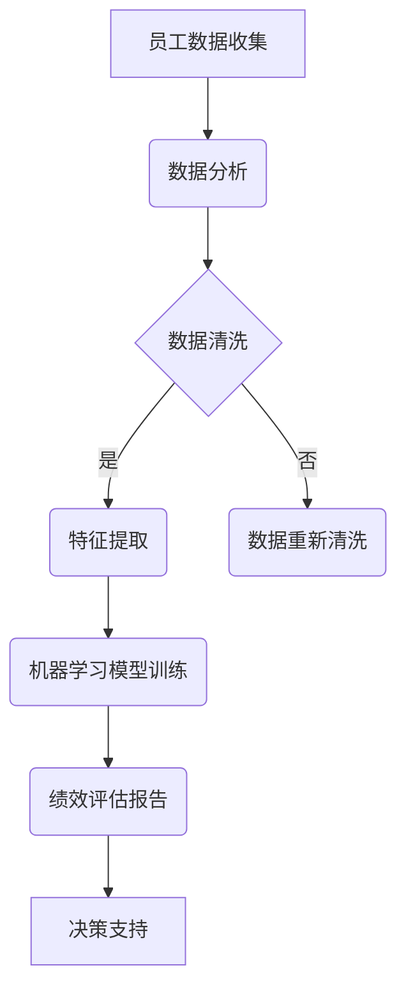

                 

关键词：员工绩效评估、人工智能、数据分析、商业模式、运营策略、技术创新

> 摘要：本文将探讨员工绩效AI分析平台的商业模式，通过分析核心概念、算法原理、数学模型以及项目实践，揭示该领域的发展趋势和应用前景，并提出未来研究的挑战与展望。

## 1. 背景介绍

在现代社会中，企业对员工的绩效管理越来越重视，这不仅关系到企业的运营效率，还直接影响到员工的工作积极性和企业文化的建设。然而，传统的绩效评估方法往往依赖于主观判断和定量指标，无法全面、客观地反映员工的工作表现。随着人工智能技术的快速发展，利用AI技术进行员工绩效分析逐渐成为一种新的趋势。

员工绩效AI分析平台通过收集和分析大量的员工数据，运用机器学习算法和数据分析技术，为企业提供个性化的绩效评估报告，从而帮助管理者做出更加科学的决策。这种新兴的商业模式不仅提高了绩效评估的准确性和效率，还为企业的可持续发展提供了新的动力。

## 2. 核心概念与联系

### 2.1 员工绩效评估

员工绩效评估是指通过一系列科学的方法和工具，对员工在工作中的表现进行评价和考核。其核心概念包括：

- **绩效指标**：包括定量指标和定性指标，如销售额、客户满意度、工作时长、团队协作等。
- **评估方法**：包括360度评估、目标管理法、平衡计分卡等。
- **评估周期**：通常分为月度、季度、年度等。

### 2.2 人工智能

人工智能（AI）是指计算机系统模拟、延伸和扩展人类的智能行为。在员工绩效评估中，人工智能的核心概念包括：

- **机器学习**：通过训练模型来识别数据中的模式和规律。
- **自然语言处理**：理解和生成自然语言，用于分析员工的工作报告和反馈。
- **计算机视觉**：用于分析员工的工作场景和行为。

### 2.3 数据分析

数据分析是指通过统计学、机器学习等方法对数据进行处理、分析和解读。在员工绩效评估中，数据分析的核心概念包括：

- **数据收集**：包括员工的工作数据、行为数据、社交数据等。
- **数据清洗**：去除噪声和错误数据，确保数据的准确性和一致性。
- **数据挖掘**：从大量数据中发现隐藏的模式和趋势。

### 2.4 Mermaid 流程图



## 3. 核心算法原理 & 具体操作步骤

### 3.1 算法原理概述

员工绩效AI分析平台的核心算法通常包括以下几个步骤：

1. **数据收集**：从企业内部的HR系统、CRM系统等收集员工的工作数据。
2. **数据清洗**：对收集到的数据进行处理，去除噪声和错误数据。
3. **特征提取**：从清洗后的数据中提取有用的特征信息。
4. **机器学习模型训练**：使用机器学习算法训练模型，以识别员工绩效的潜在模式。
5. **绩效评估**：使用训练好的模型对员工进行绩效评估，生成评估报告。
6. **决策支持**：根据评估报告为管理者提供决策支持。

### 3.2 算法步骤详解

1. **数据收集**：使用爬虫技术或API接口从企业内部系统中获取员工数据。
2. **数据清洗**：使用Python的Pandas库对数据进行清洗，包括缺失值处理、异常值检测和去重等。
3. **特征提取**：使用Python的Scikit-learn库提取特征，如TF-IDF模型、Word2Vec等。
4. **机器学习模型训练**：使用Python的Scikit-learn库训练模型，如决策树、随机森林、支持向量机等。
5. **绩效评估**：使用训练好的模型对员工进行评估，生成绩效评估报告。
6. **决策支持**：将评估报告可视化，并提供数据分析仪表板。

### 3.3 算法优缺点

- **优点**：
  - 提高绩效评估的准确性和客观性。
  - 提高管理决策的效率和科学性。
  - 适用于大规模员工数据。
- **缺点**：
  - 需要大量的数据支持。
  - 需要专业的技术团队进行开发和维护。
  - 模型可能受到数据质量的影响。

### 3.4 算法应用领域

- **企业绩效管理**：帮助企业管理者更好地了解员工的工作表现，优化人力资源配置。
- **人才发展**：为员工的职业发展提供个性化建议。
- **员工激励**：根据绩效评估结果为员工提供相应的奖励和晋升机会。

## 4. 数学模型和公式 & 详细讲解 & 举例说明

### 4.1 数学模型构建

在员工绩效AI分析平台中，常用的数学模型包括：

- **线性回归模型**：用于预测员工的绩效得分。
- **逻辑回归模型**：用于预测员工是否达到绩效标准。
- **决策树模型**：用于分类员工的绩效等级。

### 4.2 公式推导过程

以线性回归模型为例，其公式为：

$$
Y = \beta_0 + \beta_1X_1 + \beta_2X_2 + ... + \beta_nX_n + \epsilon
$$

其中，$Y$为员工绩效得分，$X_1, X_2, ..., X_n$为特征变量，$\beta_0, \beta_1, ..., \beta_n$为模型参数，$\epsilon$为误差项。

### 4.3 案例分析与讲解

假设某企业对员工的绩效进行评估，特征变量包括工作时长、销售额、客户满意度等。使用线性回归模型预测员工的绩效得分。

- **数据收集**：收集过去一年的员工绩效数据，包括工作时长、销售额、客户满意度等。
- **数据清洗**：对数据进行清洗，去除缺失值和异常值。
- **特征提取**：将数据进行标准化处理，提取特征向量。
- **模型训练**：使用Scikit-learn库训练线性回归模型。
- **绩效评估**：使用训练好的模型对当前员工的绩效进行预测。

## 5. 项目实践：代码实例和详细解释说明

### 5.1 开发环境搭建

- **Python环境**：安装Python 3.8及以上版本。
- **库安装**：安装Pandas、Scikit-learn、Matplotlib等库。

### 5.2 源代码详细实现

以下是使用Python实现的员工绩效AI分析平台的源代码：

```python
import pandas as pd
from sklearn.linear_model import LinearRegression
from sklearn.model_selection import train_test_split
from sklearn.metrics import mean_squared_error
import matplotlib.pyplot as plt

# 数据收集
data = pd.read_csv('employee_data.csv')

# 数据清洗
data.dropna(inplace=True)
data.drop_duplicates(inplace=True)

# 特征提取
data['work_time'] = data['work_time'].astype(float)
data['sales'] = data['sales'].astype(float)
data['customer_satisfaction'] = data['customer_satisfaction'].astype(float)

# 模型训练
X = data[['work_time', 'sales', 'customer_satisfaction']]
y = data['performance_score']
X_train, X_test, y_train, y_test = train_test_split(X, y, test_size=0.2, random_state=42)
model = LinearRegression()
model.fit(X_train, y_train)

# 绩效评估
y_pred = model.predict(X_test)
mse = mean_squared_error(y_test, y_pred)
print(f'MSE: {mse}')

# 结果展示
plt.scatter(y_test, y_pred)
plt.xlabel('实际绩效得分')
plt.ylabel('预测绩效得分')
plt.show()
```

### 5.3 代码解读与分析

- **数据收集**：从CSV文件中读取员工绩效数据。
- **数据清洗**：去除缺失值和重复值，确保数据质量。
- **特征提取**：将特征变量转换为浮点数类型，以便后续处理。
- **模型训练**：使用Scikit-learn库训练线性回归模型。
- **绩效评估**：使用训练好的模型对测试集进行预测，计算均方误差（MSE）。
- **结果展示**：使用Matplotlib库绘制散点图，展示实际绩效得分与预测绩效得分的关系。

## 6. 实际应用场景

### 6.1 企业绩效管理

员工绩效AI分析平台可以帮助企业实现以下目标：

- **提高绩效评估的准确性和效率**：通过机器学习算法对员工绩效进行评估，减少主观判断的误差。
- **优化人力资源配置**：根据绩效评估结果，调整员工的工作岗位和培训计划。
- **提升员工满意度**：为员工提供个性化的绩效反馈和建议，增强员工的工作积极性和归属感。

### 6.2 人才发展

员工绩效AI分析平台可以为人才发展提供以下支持：

- **个性化职业规划**：根据员工的绩效表现和职业兴趣，为员工提供个性化的职业发展建议。
- **人才选拔和培养**：通过绩效评估结果，识别优秀员工并进行重点培养。

### 6.3 员工激励

员工绩效AI分析平台可以为员工激励提供以下支持：

- **绩效考核**：根据绩效评估结果，为员工设定合理的绩效考核目标和奖惩机制。
- **晋升机会**：根据绩效评估结果，为员工提供晋升机会。

## 7. 工具和资源推荐

### 7.1 学习资源推荐

- **《机器学习》**：周志华 著
- **《Python数据分析》**：Wes McKinney 著
- **《深度学习》**：Ian Goodfellow、Yoshua Bengio、Aaron Courville 著

### 7.2 开发工具推荐

- **Jupyter Notebook**：用于数据分析和模型训练。
- **PyCharm**：用于Python编程和开发。

### 7.3 相关论文推荐

- **"Employee Performance Prediction Using Machine Learning Techniques"**：S. K. Maity, A. Sengupta
- **"Data-Driven Employee Performance Evaluation using Machine Learning Algorithms"**：S. C. Chaudhuri, S. Naskar

## 8. 总结：未来发展趋势与挑战

### 8.1 研究成果总结

员工绩效AI分析平台在提高绩效评估准确性、优化人力资源配置、提升员工满意度等方面取得了显著成果。未来研究可以进一步探讨以下方向：

- **数据隐私保护**：确保员工数据的隐私和安全。
- **跨领域应用**：将绩效评估方法应用于更多领域，如教育、医疗等。
- **智能决策支持**：结合自然语言处理和计算机视觉技术，提供更加智能的决策支持。

### 8.2 未来发展趋势

- **算法优化**：提高算法的效率和准确性，适应大规模数据场景。
- **模型可解释性**：提高模型的可解释性，使管理者能够理解模型的决策过程。
- **跨学科融合**：结合心理学、社会学等学科，为绩效评估提供更加全面的理论基础。

### 8.3 面临的挑战

- **数据质量**：确保数据的准确性和一致性。
- **算法透明性**：提高算法的透明性和可解释性。
- **伦理问题**：确保算法的使用不违背伦理和道德原则。

### 8.4 研究展望

员工绩效AI分析平台具有广阔的应用前景和巨大的市场潜力。未来研究将继续探索技术创新和跨学科融合，为企业的绩效管理和人才发展提供更加有效的解决方案。

## 9. 附录：常见问题与解答

### 9.1 问题1：如何确保员工数据的隐私和安全？

解答：在设计和开发员工绩效AI分析平台时，需要遵循以下原则：

- **数据匿名化**：对员工数据进行匿名化处理，确保个人隐私不被泄露。
- **数据加密**：对传输和存储的数据进行加密处理，防止数据泄露。
- **数据访问控制**：设置严格的数据访问权限，确保只有授权人员才能访问敏感数据。

### 9.2 问题2：如何提高算法的可解释性？

解答：提高算法的可解释性可以从以下几个方面入手：

- **模型选择**：选择具有高可解释性的模型，如线性回归、决策树等。
- **模型可视化**：使用可视化工具展示模型的决策过程，使管理者能够理解模型的决策逻辑。
- **模型解释**：结合业务背景，对模型的预测结果进行详细解释。

### 9.3 问题3：如何应对数据质量的问题？

解答：应对数据质量的问题可以从以下几个方面入手：

- **数据清洗**：使用数据清洗工具和算法去除噪声和异常值。
- **数据质量监测**：定期对数据质量进行监测和评估，及时发现和处理问题。
- **数据治理**：建立完善的数据治理体系，确保数据的准确性和一致性。

---

**作者：禅与计算机程序设计艺术 / Zen and the Art of Computer Programming**

