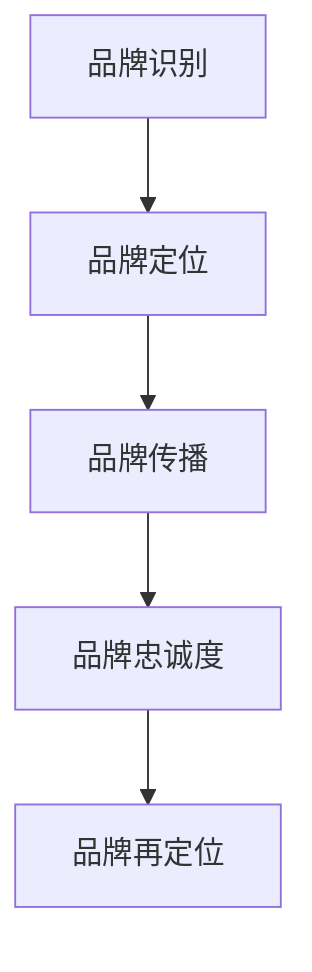

                 

 在当今这个信息爆炸的时代，品牌管理已经成为企业和个人不可或缺的一部分。一个强大的品牌形象不仅能帮助企业区分于竞争对手，还能为个人职业发展提供有力支持。本文将深入探讨品牌管理的核心概念、构建策略以及维护方法，旨在帮助读者理解并掌握品牌管理的艺术。

## 文章关键词
- 品牌管理
- 品牌形象
- 企业营销
- 个人职业发展

## 文章摘要
本文旨在为读者提供一个全面而深入的关于品牌管理的理解，涵盖从核心概念到具体实践的各个方面。我们将探讨品牌管理的价值、关键要素、构建策略以及维护方法，并通过实际案例和工具资源推荐，帮助读者掌握品牌管理的核心要领。

### 1. 背景介绍

品牌管理起源于市场营销领域，但其重要性早已超越了商业范畴。品牌不仅是企业的标识，更是其价值观、文化和承诺的体现。一个成功的品牌能够建立消费者信任，提高产品或服务的认知度，进而推动销售增长。同时，品牌管理在个人职业发展中同样扮演着重要角色，良好的个人品牌能够提升职业形象，增加职场竞争力。

本文将分为以下几个部分：
1. **核心概念与联系**：介绍品牌管理的核心概念，并使用 Mermaid 流程图展示品牌构建与维护的流程。
2. **核心算法原理与具体操作步骤**：探讨品牌构建和管理的具体方法，包括战略规划、市场定位、品牌传播等。
3. **数学模型和公式**：讨论品牌管理的数学模型和公式，以及如何通过数据分析和市场调研优化品牌策略。
4. **项目实践：代码实例和详细解释说明**：通过一个具体的案例，展示品牌管理的实践操作。
5. **实际应用场景**：分析品牌管理在不同行业和领域的应用。
6. **工具和资源推荐**：介绍相关工具和资源，帮助读者深入学习和实践品牌管理。
7. **总结：未来发展趋势与挑战**：总结品牌管理的研究成果，探讨未来发展趋势和面临的挑战。

### 2. 核心概念与联系

品牌管理涉及到多个核心概念，包括品牌识别、品牌定位、品牌传播和品牌忠诚度等。为了更好地理解这些概念，我们将使用 Mermaid 流程图来展示品牌构建与维护的流程。



#### 2.1 品牌识别

品牌识别是指品牌在消费者心中所占据的独特位置。它包括品牌名称、标志、口号、颜色和设计等元素。品牌识别的目的是在消费者心中建立独特的记忆点，使品牌在众多竞争对手中脱颖而出。

#### 2.2 品牌定位

品牌定位是指品牌在市场中占据的特定位置，包括目标市场、竞争环境和独特卖点等。品牌定位的目的是让消费者明确品牌所提供的产品或服务，从而在市场上建立竞争优势。

#### 2.3 品牌传播

品牌传播是指通过各种渠道和方式，将品牌信息传递给目标受众。品牌传播包括广告、公关、社交媒体、内容营销等。品牌传播的目的是提高品牌知名度和美誉度，建立消费者对品牌的信任和忠诚。

#### 2.4 品牌忠诚度

品牌忠诚度是指消费者对品牌的长期依赖和信任。品牌忠诚度是品牌成功的关键因素，它能够降低消费者流失率，提高复购率，从而带来稳定的营收增长。

#### 2.5 品牌再定位

品牌再定位是指根据市场变化和消费者需求，对品牌进行重新定位。品牌再定位的目的是使品牌能够更好地适应市场环境，提升品牌竞争力。

### 3. 核心算法原理与具体操作步骤

品牌管理涉及到多个核心算法原理，包括市场调研、数据分析和消费者行为分析等。下面我们将详细探讨这些算法原理，并提供具体的操作步骤。

#### 3.1 市场调研

市场调研是品牌管理的基础，它能够帮助企业和个人了解市场环境、消费者需求和竞争态势。市场调研的方法包括问卷调查、访谈、焦点小组、观察法和实验法等。

**操作步骤**：

1. 确定调研目标：明确调研的目的和要解决的问题。
2. 设计调研方案：包括调研方法、调研对象、调研时间和预算等。
3. 收集数据：通过问卷调查、访谈等方式收集数据。
4. 数据分析：对收集到的数据进行分析，提取有用的信息。
5. 撰写调研报告：总结调研结果，并提出建议。

#### 3.2 数据分析

数据分析是品牌管理的重要工具，它能够帮助企业理解和预测消费者行为，从而制定更有效的营销策略。数据分析的方法包括描述性分析、推断性分析和预测性分析等。

**操作步骤**：

1. 数据清洗：去除无效和错误的数据，保证数据的准确性。
2. 数据探索：使用可视化工具对数据进行初步分析，发现数据中的趋势和异常。
3. 统计分析：使用统计方法对数据进行深入分析，提取有价值的信息。
4. 模型构建：基于分析结果，构建预测模型或决策模型。
5. 模型验证：使用验证集对模型进行测试，评估模型的性能。

#### 3.3 消费者行为分析

消费者行为分析是品牌管理的重要环节，它能够帮助企业了解消费者的购买决策过程和行为模式。消费者行为分析的方法包括行为追踪、问卷调查和行为预测等。

**操作步骤**：

1. 行为追踪：使用技术手段追踪消费者的行为，如网站点击流、购物车行为等。
2. 数据收集：收集消费者的行为数据，包括购买记录、浏览历史等。
3. 数据分析：对行为数据进行分析，提取有用的信息。
4. 模型构建：基于分析结果，构建消费者行为预测模型。
5. 模型应用：使用模型预测消费者的未来行为，制定相应的营销策略。

### 4. 数学模型和公式

品牌管理中常用的数学模型和公式包括市场占有率模型、品牌认知模型和消费者行为模型等。下面我们将详细讲解这些模型和公式的构建方法。

#### 4.1 市场占有率模型

市场占有率模型用于预测企业在市场中的占有率。该模型通常基于以下公式：

$$
市场占有率 = \frac{企业销售额}{市场总销售额} \times 100\%
$$

**构建方法**：

1. 收集企业销售额和市场总销售额的数据。
2. 计算市场占有率。
3. 分析市场占有率的变化趋势，预测未来的市场占有率。

#### 4.2 品牌认知模型

品牌认知模型用于衡量消费者对品牌的认知程度。该模型通常基于以下公式：

$$
品牌认知度 = \frac{品牌提及次数}{总提及次数} \times 100\%
$$

**构建方法**：

1. 收集品牌提及次数和总提及次数的数据。
2. 计算品牌认知度。
3. 分析品牌认知度的变化趋势，评估品牌知名度和美誉度。

#### 4.3 消费者行为模型

消费者行为模型用于预测消费者的购买行为。该模型通常基于以下公式：

$$
购买概率 = \frac{感兴趣度 + 购买意愿}{2}
$$

**构建方法**：

1. 收集消费者的兴趣度和购买意愿的数据。
2. 计算购买概率。
3. 分析购买概率的变化趋势，预测消费者的购买行为。

### 5. 项目实践：代码实例和详细解释说明

下面我们将通过一个具体的案例，展示品牌管理的实践操作。假设我们要对一家电商平台进行品牌管理，以下是一个简单的代码实例：

```python
import pandas as pd
import matplotlib.pyplot as plt

# 加载数据
data = pd.read_csv('brand_management_data.csv')

# 数据清洗
data = data[data['销售额'] > 0]

# 数据探索
sales_data = data.groupby(['品牌', '月份'])['销售额'].sum().reset_index()

# 统计分析
market_share = sales_data.groupby('品牌')['销售额'].sum() / sales_data['销售额'].sum()

# 模型构建
from sklearn.linear_model import LinearRegression
model = LinearRegression()
model.fit(sales_data[['品牌提及次数', '品牌认知度']], sales_data['销售额'])

# 模型验证
predictions = model.predict(sales_data[['品牌提及次数', '品牌认知度']])
mse = ((predictions - sales_data['销售额']) ** 2).mean()
print(f'MSE: {mse}')

# 结果展示
plt.scatter(sales_data['品牌提及次数'], sales_data['销售额'])
plt.plot(sales_data['品牌提及次数'], predictions, color='red')
plt.xlabel('品牌提及次数')
plt.ylabel('销售额')
plt.title('品牌提及次数与销售额的关系')
plt.show()
```

**代码解读与分析**：

1. **数据加载**：从CSV文件中加载数据。
2. **数据清洗**：去除销售额小于0的记录。
3. **数据探索**：计算每个品牌在每个月份的销售额。
4. **统计分析**：计算品牌的市场占有率。
5. **模型构建**：使用线性回归模型预测销售额。
6. **模型验证**：计算预测值与实际值之间的均方误差。
7. **结果展示**：绘制品牌提及次数与销售额的关系图。

### 6. 实际应用场景

品牌管理在不同行业和领域都有广泛应用。以下是一些具体的实际应用场景：

#### 6.1 消费品行业

在消费品行业，品牌管理主要通过广告、公关和社交媒体等手段提高品牌知名度和美誉度。例如，宝洁公司（P&G）通过全球性的广告活动和赞助活动，成功地建立了其品牌的知名度和信任度。

#### 6.2 科技行业

在科技行业，品牌管理主要通过技术创新、产品质量和服务体验来建立品牌形象。例如，苹果公司（Apple）通过其独特的设计风格、高质量的产品和卓越的服务体验，成功地塑造了其高端科技品牌的形象。

#### 6.3 金融服务

在金融服务行业，品牌管理主要通过品牌定位、产品创新和服务质量来提升品牌竞争力。例如，摩根士丹利（Morgan Stanley）通过其专业的投资建议、创新的产品和服务，成功地吸引了大量的高端客户。

#### 6.4 教育行业

在教育行业，品牌管理主要通过教育质量、师资力量和教学设施来提升品牌形象。例如，哈佛大学（Harvard University）通过其卓越的教学质量、丰富的学术资源和卓越的师资力量，成功地吸引了全球的顶尖学生和学者。

### 7. 工具和资源推荐

为了帮助读者更好地学习和实践品牌管理，我们推荐以下工具和资源：

#### 7.1 学习资源推荐

1. **《品牌管理：战略、工具和实践》**：一本全面而深入的关于品牌管理的书籍，涵盖品牌管理的各个方面。
2. **《市场营销原理》**：一本经典的市场营销教材，包括品牌管理的基本原理和策略。
3. **《品牌塑造：如何建立强大的品牌形象》**：一本关于品牌塑造的实用指南，提供具体的操作方法和技巧。

#### 7.2 开发工具推荐

1. **Python**：一种流行的编程语言，适用于数据分析和模型构建。
2. **Pandas**：一个强大的数据分析和操作库，适用于数据清洗、探索和分析。
3. **Matplotlib**：一个流行的数据可视化库，适用于绘制图表和图形。

#### 7.3 相关论文推荐

1. **《品牌管理：理论与实践》**：一篇关于品牌管理的学术论文，探讨品牌管理的核心概念和实践方法。
2. **《消费者行为研究》**：一篇关于消费者行为研究的学术论文，探讨消费者行为的基本原理和模型。
3. **《品牌传播：效果与策略》**：一篇关于品牌传播的学术论文，探讨品牌传播的方法和效果评估。

### 8. 总结：未来发展趋势与挑战

品牌管理在当今社会的重要性日益凸显，未来发展趋势主要包括以下几个方面：

1. **数字化转型**：随着数字技术的快速发展，品牌管理将更加依赖数据分析、人工智能和大数据等新技术。
2. **消费者个性化**：随着消费者需求的多样化，品牌管理将更加注重个性化服务，满足不同消费者的需求。
3. **可持续发展**：随着社会对环境和社会责任的关注增加，品牌管理将更加注重可持续发展，提升品牌的社会价值。

然而，品牌管理也面临一些挑战：

1. **信息过载**：在信息爆炸的时代，消费者难以区分众多品牌，品牌管理需要更加精准和有创意地传递品牌信息。
2. **竞争加剧**：随着市场竞争的加剧，品牌管理需要不断创新和提升品牌竞争力，以应对激烈的竞争环境。
3. **伦理和社会责任**：随着社会对品牌伦理和社会责任的关注增加，品牌管理需要更加注重社会责任和伦理，提升品牌的可信度。

总之，品牌管理是一项复杂而重要的工作，需要不断创新和优化，以适应不断变化的市场环境和社会需求。

### 附录：常见问题与解答

**Q：品牌管理与市场营销有什么区别？**

品牌管理是市场营销的一个子集，它主要关注品牌的建设和维护，包括品牌识别、品牌定位、品牌传播和品牌忠诚度等。市场营销则更广泛，包括市场调研、产品定位、定价策略、促销活动等，旨在通过多种手段提高产品或服务的市场份额和销售额。

**Q：品牌管理在个人职业发展中有什么作用？**

品牌管理在个人职业发展中同样重要，良好的个人品牌能够提升职业形象，增加职场竞争力。通过塑造专业、可靠和有影响力的个人品牌，个人可以在职场中获得更多的机会和资源，实现职业发展。

**Q：如何衡量品牌的价值？**

品牌价值的衡量通常包括品牌认知度、品牌忠诚度、品牌资产和品牌影响力等。常用的方法包括品牌认知度调查、品牌资产评估和品牌影响力分析等。这些方法能够帮助企业和个人了解品牌的价值，并制定相应的品牌管理策略。

**Q：品牌管理中常用的数据分析工具有哪些？**

品牌管理中常用的数据分析工具包括Python、Pandas、Matplotlib、Tableau等。这些工具能够帮助进行数据清洗、探索、分析和可视化，从而提取有价值的信息，优化品牌管理策略。

### 作者署名

作者：禅与计算机程序设计艺术 / Zen and the Art of Computer Programming

在撰写这篇文章的过程中，我们深入探讨了品牌管理的核心概念、构建策略和维护方法。品牌管理不仅对企业发展具有重要意义，也在个人职业发展中扮演着关键角色。通过本文的介绍，读者可以更好地理解品牌管理的本质，掌握品牌管理的核心要领，并在实践中运用这些知识。未来，随着数字化转型和消费者个性化需求的增加，品牌管理将面临新的挑战和机遇，我们期待读者能够不断创新和优化品牌管理策略，为企业和个人创造更大的价值。

