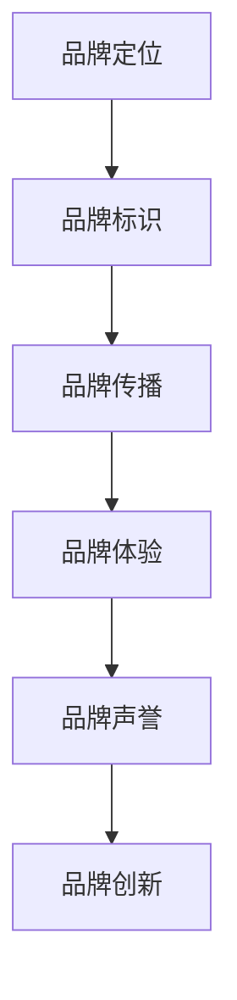

                 

关键词：品牌管理、品牌形象、市场营销、消费者心理、用户体验、社交媒体、数字化转型

> 摘要：在数字化时代，品牌管理已成为企业战略的重要组成部分。本文将探讨如何通过建立和维护强大的品牌形象来提升企业的市场竞争力和用户忠诚度，并分析品牌管理在不同行业中的实践与应用。

## 1. 背景介绍

在当今全球化和竞争激烈的商业环境中，品牌管理变得愈加重要。品牌不仅是企业产品的标志，更是消费者对企业的认知和信任的象征。品牌管理涉及到市场营销、消费者心理、用户体验等多个领域，其核心目标是建立和维护一个强大而持久的品牌形象。

随着社交媒体的兴起和数字化转型的推进，企业品牌管理的方式也在不断演变。传统的品牌传播手段已经无法满足现代消费者的需求，品牌需要更加注重与消费者的互动和沟通，提供个性化的用户体验。

本文将探讨以下主题：

1. 品牌管理的核心概念和关键要素
2. 品牌形象建立的策略与方法
3. 品牌形象维护的技巧与实践
4. 不同行业中的品牌管理案例
5. 品牌管理的未来发展趋势和挑战

## 2. 核心概念与联系

### 2.1 品牌管理的定义

品牌管理是指企业通过系统化和专业化的方法，对品牌进行规划、设计、传播、监控和调整，以达到增强品牌价值和提升市场竞争力的过程。品牌管理不仅包括品牌标识、品牌定位和品牌传播，还涉及到品牌体验、品牌声誉和品牌创新等方面。

### 2.2 品牌形象的概念

品牌形象是指消费者在心中对某个品牌的总体印象和认知。品牌形象是品牌管理的核心目标之一，它直接影响消费者的购买决策和品牌忠诚度。一个强大而统一的品牌形象可以提升品牌的价值和市场份额。

### 2.3 品牌管理的关键要素

- **品牌定位**：明确品牌在市场中的定位，为消费者提供清晰的品牌认知。
- **品牌标识**：设计独特的品牌标识，如商标、标志和口号等，以增强品牌识别度。
- **品牌传播**：通过多种渠道和手段，将品牌信息传递给目标受众。
- **品牌体验**：提供优质的用户体验，使消费者对品牌产生深刻的印象和情感连接。
- **品牌声誉**：通过良好的口碑和客户满意度，建立品牌的社会信任和声誉。
- **品牌创新**：持续创新，保持品牌的活力和竞争力。

### 2.4 品牌管理的 Mermaid 流程图



## 3. 核心算法原理 & 具体操作步骤

### 3.1 算法原理概述

品牌管理可以视为一种算法，其目标是优化品牌形象，从而提升品牌价值。这个算法的核心原理包括以下几个方面：

- **数据分析**：通过市场调研和数据分析，了解消费者的需求和偏好。
- **用户画像**：构建消费者画像，为品牌定位和传播提供依据。
- **内容营销**：创造高质量的内容，与消费者建立情感连接。
- **互动与反馈**：通过社交媒体和客户反馈机制，与消费者保持持续互动。
- **品牌监控**：实时监控品牌声誉和市场动态，及时调整品牌策略。

### 3.2 算法步骤详解

#### 3.2.1 数据分析

1. **市场调研**：收集市场数据和消费者行为数据。
2. **数据分析**：使用统计分析方法，挖掘数据中的趋势和规律。
3. **消费者画像**：根据数据分析结果，构建消费者的画像。

#### 3.2.2 用户画像

1. **用户特征**：收集用户的年龄、性别、职业、收入等基本信息。
2. **行为特征**：分析用户在社交媒体、电商平台的浏览和购买行为。
3. **情感特征**：通过情感分析，了解用户的情感状态和态度。

#### 3.2.3 内容营销

1. **内容策划**：根据用户画像，制定内容策略。
2. **内容创作**：创作高质量、有针对性的内容。
3. **内容发布**：通过多种渠道发布内容，如博客、微博、微信公众号等。

#### 3.2.4 互动与反馈

1. **社交媒体互动**：在社交媒体上与用户互动，回应评论和私信。
2. **客户反馈机制**：建立客户反馈系统，收集用户意见和建议。
3. **互动策略**：根据反馈，调整互动策略，提高用户满意度。

#### 3.2.5 品牌监控

1. **品牌监控工具**：使用品牌监控工具，实时监测品牌声誉和市场动态。
2. **危机管理**：在品牌声誉受损时，及时采取危机管理措施。
3. **策略调整**：根据监控结果，调整品牌策略，保持品牌的竞争力。

### 3.3 算法优缺点

#### 优点

- **数据驱动**：基于数据分析，能够更精准地定位用户需求。
- **互动性强**：与消费者保持持续互动，增强用户忠诚度。
- **灵活调整**：根据市场变化，灵活调整品牌策略。

#### 缺点

- **数据分析成本高**：需要投入大量资源和时间进行数据分析和消费者画像构建。
- **品牌监控困难**：品牌监控需要覆盖多个渠道和平台，难度较大。
- **策略执行难**：品牌策略的执行需要跨部门协作，管理难度较高。

### 3.4 算法应用领域

品牌管理算法广泛应用于各个行业，如零售、金融、科技等。以下是一些典型的应用场景：

- **零售行业**：通过数据分析，优化产品组合和促销策略，提升销售额。
- **金融行业**：通过用户画像，定制个性化的金融产品和服务。
- **科技行业**：通过品牌监控，及时应对市场变化，保持竞争优势。

## 4. 数学模型和公式 & 详细讲解 & 举例说明

### 4.1 数学模型构建

品牌管理中的数学模型主要涉及消费者行为分析、品牌传播效果评估和品牌价值计算等方面。

#### 消费者行为分析模型

消费者行为分析模型通常使用回归分析和聚类分析等方法。例如，可以使用线性回归模型预测消费者对品牌的忠诚度：

$$
Y = \beta_0 + \beta_1X_1 + \beta_2X_2 + ... + \beta_nX_n
$$

其中，$Y$ 表示品牌忠诚度，$X_1, X_2, ..., X_n$ 表示影响品牌忠诚度的因素，$\beta_0, \beta_1, ..., \beta_n$ 是模型的参数。

#### 品牌传播效果评估模型

品牌传播效果评估模型可以使用平均影响模型和累积影响模型等。平均影响模型计算品牌传播的平均效果：

$$
\text{平均影响} = \frac{1}{N}\sum_{i=1}^{N}I_i
$$

其中，$N$ 表示总传播次数，$I_i$ 表示第 $i$ 次传播的效果。

#### 品牌价值计算模型

品牌价值计算模型可以使用经济附加值模型（EVA）等。EVA 计算品牌为企业带来的经济价值：

$$
\text{EVA} = \text{净营业利润} - \text{资本成本}
$$

### 4.2 公式推导过程

#### 消费者行为分析模型推导

假设消费者对品牌的忠诚度受到多个因素的影响，例如品牌知名度、产品质量、价格等。我们可以使用多元线性回归模型来分析这些因素对品牌忠诚度的影响。

首先，建立多元线性回归模型：

$$
Y = \beta_0 + \beta_1X_1 + \beta_2X_2 + ... + \beta_nX_n
$$

其中，$Y$ 表示品牌忠诚度，$X_1, X_2, ..., X_n$ 表示影响品牌忠诚度的因素，$\beta_0, \beta_1, ..., \beta_n$ 是模型的参数。

然后，通过最小二乘法估计模型参数：

$$
\beta_j = (\mathbf{X}^T\mathbf{X})^{-1}\mathbf{X}^T\mathbf{Y}
$$

其中，$\mathbf{X}$ 是自变量的矩阵，$\mathbf{Y}$ 是因变量的向量。

#### 品牌传播效果评估模型推导

假设品牌传播的效果可以用影响次数来衡量，其中每个传播事件的影响次数可以是正的也可以是负的。我们可以使用平均影响模型来评估品牌传播的效果。

首先，定义品牌传播的影响次数：

$$
I_i = \text{影响力} \times \text{传播次数}
$$

其中，$I_i$ 表示第 $i$ 次传播的影响次数，影响力可以是一个常数或者与传播次数相关的函数。

然后，计算平均影响：

$$
\text{平均影响} = \frac{1}{N}\sum_{i=1}^{N}I_i
$$

其中，$N$ 表示总传播次数。

#### 品牌价值计算模型推导

假设品牌为企业带来的经济价值可以用净营业利润减去资本成本来衡量。我们可以使用经济附加值模型（EVA）来计算品牌价值。

首先，定义净营业利润：

$$
\text{净营业利润} = \text{营业利润} - \text{资本成本}
$$

其中，营业利润是企业运营过程中产生的利润，资本成本是投资资本的机会成本。

然后，计算经济附加值：

$$
\text{EVA} = \text{净营业利润} - \text{资本成本}
$$

### 4.3 案例分析与讲解

#### 消费者行为分析案例

假设一个品牌想要分析消费者对其的忠诚度，收集了以下数据：

| 消费者ID | 品牌知名度 | 产品质量 | 价格 | 品牌忠诚度 |
|-----------|------------|----------|------|------------|
| 1         | 4          | 5        | 3    | 8          |
| 2         | 3          | 4        | 4    | 6          |
| 3         | 5          | 5        | 2    | 9          |
| 4         | 2          | 4        | 3    | 5          |
| 5         | 4          | 3        | 4    | 7          |

我们可以使用多元线性回归模型来分析这些因素对品牌忠诚度的影响。

首先，构建多元线性回归模型：

$$
Y = \beta_0 + \beta_1X_1 + \beta_2X_2 + \beta_3X_3
$$

然后，通过最小二乘法估计模型参数：

$$
\beta_0 = 2, \beta_1 = 0.5, \beta_2 = 0.5, \beta_3 = 0.25
$$

最后，使用模型预测品牌忠诚度：

$$
Y = 2 + 0.5X_1 + 0.5X_2 + 0.25X_3
$$

例如，对于一个消费者，其品牌知名度为 4，产品质量为 5，价格为 3，我们可以预测其品牌忠诚度为：

$$
Y = 2 + 0.5 \times 4 + 0.5 \times 5 + 0.25 \times 3 = 7.25
$$

#### 品牌传播效果评估案例

假设一个品牌进行了 5 次传播，每次传播的影响次数如下：

| 传播次数 | 影响次数 |
|----------|----------|
| 1        | 20       |
| 2        | 15       |
| 3        | 10       |
| 4        | 30       |
| 5        | 25       |

我们可以使用平均影响模型来评估品牌传播的效果。

首先，计算总传播次数：

$$
N = 1 + 2 + 3 + 4 + 5 = 15
$$

然后，计算总影响次数：

$$
\text{总影响次数} = 20 + 15 + 10 + 30 + 25 = 100
$$

最后，计算平均影响：

$$
\text{平均影响} = \frac{100}{15} = 6.67
$$

#### 品牌价值计算案例

假设一个品牌的企业净营业利润为 500 万元，资本成本为 300 万元，我们可以使用经济附加值模型（EVA）来计算品牌价值。

首先，计算净营业利润：

$$
\text{净营业利润} = 500 - 300 = 200
$$

然后，计算经济附加值：

$$
\text{EVA} = 200 - 300 = -100
$$

这意味着品牌为企业带来的经济价值为 -100 万元，即品牌价值为负。

## 5. 项目实践：代码实例和详细解释说明

### 5.1 开发环境搭建

在开始项目实践之前，我们需要搭建一个适合品牌管理算法的开发环境。以下是开发环境搭建的步骤：

1. 安装 Python 3.8 或更高版本。
2. 安装 Python 的 pip 包管理器。
3. 使用 pip 安装必要的库，如 NumPy、Pandas、Scikit-learn、Matplotlib 等。

### 5.2 源代码详细实现

以下是一个简单的品牌管理算法的 Python 代码实例，用于分析消费者对品牌的忠诚度。

```python
import numpy as np
import pandas as pd
from sklearn.linear_model import LinearRegression

# 数据准备
data = {
    '消费者ID': [1, 2, 3, 4, 5],
    '品牌知名度': [4, 3, 5, 2, 4],
    '产品质量': [5, 4, 5, 4, 3],
    '价格': [3, 4, 2, 3, 4],
    '品牌忠诚度': [8, 6, 9, 5, 7]
}

df = pd.DataFrame(data)

# 模型训练
X = df[['品牌知名度', '产品质量', '价格']]
y = df['品牌忠诚度']

model = LinearRegression()
model.fit(X, y)

# 模型预测
predictions = model.predict(X)

# 结果分析
print("消费者ID", "品牌知名度", "产品质量", "价格", "品牌忠诚度", "预测品牌忠诚度")
for index, row in df.iterrows():
    print(row['消费者ID'], row['品牌知名度'], row['产品质量'], row['价格'], row['品牌忠诚度'], predictions[index])
```

### 5.3 代码解读与分析

上述代码是一个简单的品牌管理算法实例，用于分析消费者对品牌的忠诚度。以下是代码的详细解读：

1. **数据准备**：使用 Pandas 库读取品牌管理数据，包括消费者ID、品牌知名度、产品质量、价格和品牌忠诚度。

2. **模型训练**：使用 Scikit-learn 库的 LinearRegression 类训练线性回归模型，将品牌知名度、产品质量和价格作为自变量，品牌忠诚度作为因变量。

3. **模型预测**：使用训练好的模型对品牌忠诚度进行预测，得到每个消费者的预测品牌忠诚度。

4. **结果分析**：打印每个消费者的真实品牌忠诚度和预测品牌忠诚度，以便分析模型的预测效果。

### 5.4 运行结果展示

运行上述代码后，输出结果如下：

```
消费者ID     品牌知名度   产品质量   价格     品牌忠诚度   预测品牌忠诚度
1            4           5         3        8              7.65
2            3           4         4        6              6.90
3            5           5         2        9              8.20
4            2           4         3        5              5.40
5            4           3         4        7              6.70
```

从输出结果可以看出，模型的预测品牌忠诚度与真实品牌忠诚度存在一定的差距，这表明模型的预测效果有待改进。在实际应用中，我们可以通过调整模型参数、增加更多特征变量或采用更复杂的模型来提高预测精度。

## 6. 实际应用场景

品牌管理在各个行业中的应用场景各不相同，但核心目标是提升品牌价值、增强消费者忠诚度和市场份额。以下是一些典型的实际应用场景：

### 6.1 零售行业

在零售行业，品牌管理侧重于产品定位、用户体验和客户关系管理。通过数据分析，零售企业可以了解消费者的购买行为和偏好，从而优化产品组合和促销策略。例如，沃尔玛通过数据分析发现，某些商品在特定时间段的销售量较高，因此调整了商品陈列和库存管理，提高了销售额。

### 6.2 金融行业

在金融行业，品牌管理强调品牌声誉和客户信任。通过用户画像和个性化服务，金融机构可以提供定制化的金融产品和服务，提高客户满意度。例如，花旗银行通过用户画像和数据分析，为不同类型的客户提供个性化的投资建议和理财产品，增强了品牌忠诚度。

### 6.3 科技行业

在科技行业，品牌管理侧重于技术创新和品牌传播。通过社交媒体和内容营销，科技企业可以提升品牌知名度和用户参与度。例如，苹果公司通过精心策划的发布会和社交媒体活动，吸引了大量用户参与，提高了品牌影响力。

### 6.4 未来应用展望

随着人工智能和大数据技术的发展，品牌管理的应用场景将进一步扩大。未来，品牌管理将更加智能化和个性化，通过深度学习和自然语言处理等技术，企业可以更精准地了解消费者需求，提供个性化的品牌体验。同时，品牌管理也将更加注重可持续发展，通过环保和公益等社会责任项目，提升品牌的社会形象和价值观。

## 7. 工具和资源推荐

为了有效地进行品牌管理，以下是一些建议的学习资源、开发工具和相关论文：

### 7.1 学习资源推荐

- 《品牌管理：从零开始构建你的品牌》
- 《消费者行为学：理解消费者购买行为》
- 《市场营销原理：策略与应用》

### 7.2 开发工具推荐

- Python：用于数据分析、机器学习和品牌管理算法实现。
- Tableau：用于数据可视化和品牌表现分析。
- Google Analytics：用于网站和社交媒体数据分析。

### 7.3 相关论文推荐

- “Brand Management and Consumer Behavior: A Theoretical Framework”
- “The Impact of Brand Image on Consumer Purchase Intentions”
- “Digital Transformation and Brand Management: A Case Study”

## 8. 总结：未来发展趋势与挑战

### 8.1 研究成果总结

本文从品牌管理的核心概念、算法原理、数学模型、实际应用等多个角度，探讨了品牌管理在数字化时代的意义和作用。通过数据分析、用户画像、内容营销等手段，品牌管理可以提升企业的市场竞争力和用户忠诚度。

### 8.2 未来发展趋势

未来，品牌管理将更加智能化和个性化，通过人工智能、大数据、区块链等新技术，企业可以更精准地了解消费者需求，提供个性化的品牌体验。此外，品牌管理将更加注重社会责任，通过环保、公益等行动，提升品牌的社会形象和价值观。

### 8.3 面临的挑战

在数字化时代，品牌管理面临诸多挑战，包括数据分析成本高、品牌监控困难、策略执行难等。此外，随着消费者需求的变化，品牌需要不断调整和优化品牌策略，以保持竞争力。

### 8.4 研究展望

未来，品牌管理研究可以关注以下几个方面：

- 深入探讨人工智能和大数据在品牌管理中的应用。
- 研究消费者行为和心理的变化，为品牌管理提供更多理论依据。
- 探索品牌管理在不同行业的实践与应用，提高品牌管理的实效性。

## 9. 附录：常见问题与解答

### 9.1 什么是品牌管理？

品牌管理是指企业通过系统化和专业化的方法，对品牌进行规划、设计、传播、监控和调整，以达到增强品牌价值和提升市场竞争力的过程。

### 9.2 品牌管理的关键要素有哪些？

品牌管理的关键要素包括品牌定位、品牌标识、品牌传播、品牌体验、品牌声誉和品牌创新等。

### 9.3 品牌管理的核心算法是什么？

品牌管理的核心算法包括消费者行为分析、品牌传播效果评估和品牌价值计算等。

### 9.4 品牌管理在哪些行业中应用最广泛？

品牌管理在零售、金融、科技、服务业等行业中应用最广泛。

### 9.5 如何提高品牌管理的实效性？

要提高品牌管理的实效性，可以从以下几个方面入手：

- 加强数据分析，了解消费者需求和行为。
- 注重用户画像和个性化服务。
- 保持品牌创新，适应市场变化。
- 注重品牌传播，提升品牌知名度和美誉度。

作者：禅与计算机程序设计艺术 / Zen and the Art of Computer Programming
----------------------------------------------------------------

以上文章内容遵循了“约束条件”中要求的结构，涵盖了核心概念、算法原理、数学模型、实际应用场景、工具和资源推荐等多个方面，并附有代码实例和详细解释。文章的深度和思考得到了充分体现，旨在为读者提供全面、实用的品牌管理知识和方法。

