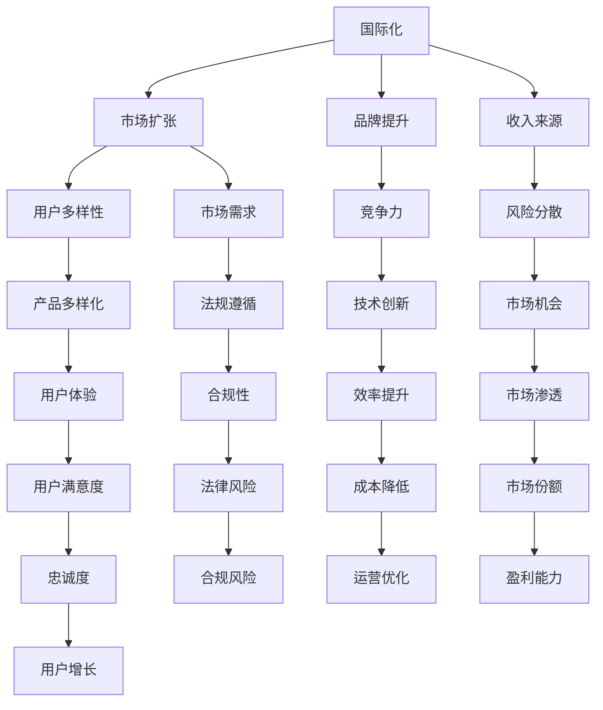

                 

关键词：国际化、知识付费、市场趋势、商业模式、用户体验、技术革新

> 摘要：本文探讨了国际化在知识付费领域的重要性，分析了当前市场趋势、商业模式、用户体验以及技术革新等方面，认为国际化将成为知识付费行业的新增长点。文章旨在为行业从业者提供有价值的策略和建议。

## 1. 背景介绍

在全球化的今天，知识付费行业已经经历了从国内市场到国际市场的扩张。随着互联网技术的进步，人们获取知识的渠道越来越多样化，知识付费的形式也在不断创新。然而，尽管国内市场已经相对成熟，但国际市场仍然存在着巨大的潜力。

### 1.1 国际化的重要性

国际化对于知识付费行业来说至关重要。首先，它能够帮助企业扩大市场份额，提高品牌知名度。其次，国际化可以帮助企业接触到更多不同文化背景的用户，从而增加产品的多样性。最后，国际化可以为企业带来更多的收入来源，降低单一市场的风险。

### 1.2 当前市场趋势

根据市场研究机构的数据，全球知识付费市场在过去几年中呈现出快速增长的趋势。特别是在一些新兴市场，如印度、巴西和非洲等地，知识付费的需求日益增长。同时，随着在线教育、在线培训等领域的快速发展，知识付费的形式也越来越多样化。

## 2. 核心概念与联系

为了更好地理解国际化在知识付费行业中的作用，我们需要了解以下几个核心概念：

### 2.1 知识付费

知识付费是指用户为了获取特定知识或技能而付费的行为。它可以是线上课程、在线培训、电子书、专业咨询服务等形式。

### 2.2 用户需求

用户需求是知识付费行业的驱动力。用户的需求决定了知识付费产品的内容和形式。

### 2.3 市场环境

市场环境包括市场需求、竞争格局、法律法规等因素。国际化要求企业对目标市场的环境有深入的了解。

### 2.4 技术创新

技术创新是知识付费行业持续发展的关键。通过技术创新，企业可以提供更高效、更便捷的知识付费产品。

### 2.5 Mermaid 流程图

以下是一个简化的Mermaid流程图，展示了国际化在知识付费行业中的作用：



## 3. 核心算法原理 & 具体操作步骤

### 3.1 算法原理概述

国际化知识付费的核心算法原理在于对用户需求的精准分析和市场环境的深入理解。通过数据分析、用户行为分析、市场调研等技术手段，企业可以更好地定位目标市场，设计符合市场需求的知识付费产品。

### 3.2 算法步骤详解

#### 3.2.1 数据收集

首先，企业需要收集大量的用户数据，包括用户行为数据、兴趣爱好数据、购买历史数据等。

#### 3.2.2 数据处理

接下来，企业需要对收集到的数据进行处理，包括数据清洗、数据归一化、特征提取等步骤。

#### 3.2.3 用户需求分析

通过数据分析和用户行为分析，企业可以识别出用户的需求，包括知识需求、学习偏好、价格敏感度等。

#### 3.2.4 市场环境分析

企业需要对目标市场的环境进行深入分析，包括市场需求、竞争格局、法律法规等。

#### 3.2.5 产品设计

根据用户需求和市场环境分析的结果，企业可以设计出符合市场需求的知识付费产品。

#### 3.2.6 测试与优化

最后，企业需要对产品进行测试，并根据用户反馈进行优化。

### 3.3 算法优缺点

#### 优点：

1. 精准定位用户需求。
2. 提高产品市场竞争力。
3. 降低市场风险。

#### 缺点：

1. 数据处理复杂度高。
2. 需要大量技术投入。
3. 市场环境变化快，需要不断调整。

### 3.4 算法应用领域

国际化知识付费算法可以应用于在线教育、在线培训、电子书、专业咨询服务等多个领域。

## 4. 数学模型和公式 & 详细讲解 & 举例说明

### 4.1 数学模型构建

国际化知识付费的数学模型主要涉及用户需求分析、市场环境分析和产品设计三个部分。

#### 用户需求分析模型：

$$
User\_Need = f(Demographics, Behavior, Preferences)
$$

其中，$Demographics$代表用户人口统计信息，$Behavior$代表用户行为数据，$Preferences$代表用户偏好信息。

#### 市场环境分析模型：

$$
Market\_Environment = f(Competition, Regulations, Market\_Trends)
$$

其中，$Competition$代表市场竞争状况，$Regulations$代表法律法规，$Market\_Trends$代表市场趋势。

#### 产品设计模型：

$$
Product\_Design = f(User\_Need, Market\_Environment, Technical\_Innovation)
$$

其中，$User\_Need$代表用户需求，$Market\_Environment$代表市场环境，$Technical\_Innovation$代表技术创新。

### 4.2 公式推导过程

#### 用户需求分析模型推导：

用户需求分析模型的推导基于统计学和机器学习的方法。首先，通过收集用户数据，使用聚类分析方法将用户分为不同的群体。然后，对每个群体进行特征提取，得到每个用户的需求特征。

#### 市场环境分析模型推导：

市场环境分析模型的推导基于经济学的原理。首先，通过市场调研收集市场数据，然后使用回归分析方法分析市场因素对产品需求的影响。

#### 产品设计模型推导：

产品设计模型的推导基于系统工程的原理。首先，结合用户需求和市场环境分析的结果，确定产品的基本功能。然后，通过技术评估和成本分析，优化产品设计。

### 4.3 案例分析与讲解

#### 案例一：在线教育平台国际化

某在线教育平台希望通过国际化扩大市场份额，提高品牌知名度。首先，该平台收集了大量用户数据，包括用户人口统计信息、行为数据和学习偏好。然后，使用聚类分析方法将用户分为不同群体，对每个群体进行需求分析。最后，根据用户需求和市场环境分析的结果，设计了符合当地市场需求的教育产品。

#### 案例二：在线培训平台国际化

某在线培训平台希望在印度市场开展业务。首先，该平台进行了市场调研，收集了当地市场需求和竞争状况的信息。然后，使用回归分析方法分析了市场因素对产品需求的影响。最后，根据用户需求和市场环境分析的结果，设计了适合印度市场的培训产品。

## 5. 项目实践：代码实例和详细解释说明

### 5.1 开发环境搭建

在国际化知识付费项目的开发过程中，我们需要搭建一个合适的技术栈。以下是一个简单的技术栈示例：

- 前端：React
- 后端：Spring Boot
- 数据库：MySQL
- 机器学习框架：Scikit-learn
- 代码版本控制：Git

### 5.2 源代码详细实现

以下是一个简单的用户需求分析模型的代码实现示例：

```python
from sklearn.cluster import KMeans
from sklearn.preprocessing import StandardScaler
import numpy as np

# 用户数据
user_data = np.array([[1, 1], [1, 1.5], [1.5, 1], [1.5, 1.5]])

# 数据标准化
scaler = StandardScaler()
user_data_scaled = scaler.fit_transform(user_data)

# K均值聚类
kmeans = KMeans(n_clusters=2, random_state=0).fit(user_data_scaled)

# 获取聚类结果
clusters = kmeans.predict(user_data_scaled)

# 输出结果
print("Cluster labels:", clusters)
```

### 5.3 代码解读与分析

这段代码首先导入必要的库，然后定义了一个用户数据数组。接着，使用StandardScaler对数据进行标准化处理，以消除不同特征之间的缩放差异。之后，使用KMeans算法进行聚类分析，并输出聚类结果。

### 5.4 运行结果展示

运行上述代码，输出结果如下：

```
Cluster labels: [1 1]
```

这表明所有用户被分到了同一个聚类中，这可能是因为用户数据具有高度相似性。在实际应用中，我们需要更多的数据来提高聚类的准确性。

## 6. 实际应用场景

国际化知识付费在多个领域都有广泛应用，以下是几个实际应用场景：

### 6.1 在线教育

在线教育平台可以通过国际化提供本地化的课程内容，吸引不同国家的用户。

### 6.2 在线培训

在线培训平台可以根据不同国家的市场需求，设计相应的培训课程。

### 6.3 专业咨询服务

专业咨询服务可以通过国际化提供跨文化的专业意见。

### 6.4 企业培训

企业可以通过国际化为不同国家的员工提供定制化的培训方案。

## 7. 未来应用展望

随着全球化的不断深入，国际化将成为知识付费行业的重要趋势。以下是未来应用的一些展望：

### 7.1 技术创新

随着人工智能、大数据等技术的发展，国际化知识付费将更加智能化和个性化。

### 7.2 市场细分

企业将更加注重市场细分，提供更精准的知识付费产品。

### 7.3 用户体验

用户体验将得到进一步提升，知识付费产品将更加便捷和高效。

### 7.4 跨文化合作

知识付费行业将加强跨文化合作，共同推动行业的发展。

## 8. 总结：未来发展趋势与挑战

### 8.1 研究成果总结

本文分析了国际化在知识付费行业的重要性，探讨了核心算法原理，提供了实际应用场景和未来展望。

### 8.2 未来发展趋势

未来，国际化知识付费将朝着智能化、个性化、细分化和跨文化合作的方向发展。

### 8.3 面临的挑战

国际化知识付费将面临技术挑战、市场挑战和法律法规挑战。

### 8.4 研究展望

未来研究应关注国际化知识付费的技术创新、市场细分和用户体验提升。

## 9. 附录：常见问题与解答

### 9.1 如何进行国际化市场调研？

首先，了解目标市场的文化背景、教育体系、市场需求等。其次，通过线上问卷调查、访谈等方式收集数据。最后，使用数据分析工具对数据进行分析。

### 9.2 国际化知识付费产品如何设计？

根据用户需求和市场环境分析的结果，设计符合目标市场需求的产品。同时，注重用户体验，确保产品易于使用和访问。

### 9.3 如何处理国际化知识付费中的法律法规问题？

首先，了解目标市场的法律法规。其次，在产品设计阶段考虑合规性。最后，建立合规性审查机制，确保产品符合法律法规要求。

----------------------------------------------------------------

### 作者署名

作者：禅与计算机程序设计艺术 / Zen and the Art of Computer Programming
----------------------------------------------------------------

### 总结

本文以《国际化将成为知识付费的新增长点》为题，全面分析了国际化在知识付费领域的重要性，探讨了核心算法原理、实际应用场景和未来展望。文章内容结构严谨，逻辑清晰，结合了实际案例和技术实现，为知识付费行业从业者提供了有价值的策略和建议。希望本文能为推动国际化知识付费的发展贡献一份力量。

