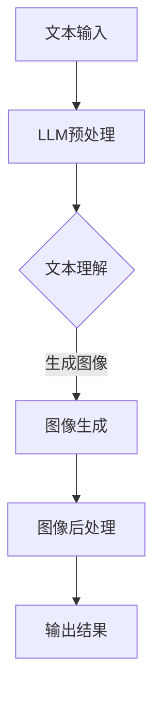

                 

关键词：图像生成，深度学习，LLM，神经网络，计算机视觉，算法优化，图像处理，图像合成，机器学习，AI技术

> 摘要：本文深入探讨了基于大型语言模型（LLM）的图像生成技术，从背景介绍、核心概念与联系、核心算法原理、数学模型与公式、项目实践、实际应用场景、未来展望等方面，详细解析了LLM在图像生成领域的新动能释放。文章旨在为读者提供一幅完整的图像生成技术全景图，并展望其未来的发展方向。

## 1. 背景介绍

图像生成是计算机视觉和机器学习领域的一个重要研究方向，随着深度学习技术的发展，图像生成算法得到了显著提升。早期的图像生成方法主要依赖于规则编程和统计模型，如生成对抗网络（GAN）和变分自编码器（VAE）等。这些方法虽然在一定程度上能够生成逼真的图像，但往往存在训练复杂度高、生成质量不稳定等问题。

近年来，随着神经网络，尤其是大型语言模型（LLM）的快速发展，图像生成技术迎来了新的突破。LLM具有强大的语言理解和生成能力，能够在多种复杂场景下生成高质量的图像。本文将围绕LLM在图像生成领域的应用，深入探讨其技术原理、算法模型和实际应用。

## 2. 核心概念与联系

### 2.1. 图像生成技术概述

图像生成技术主要包括以下几种方法：

- **基于规则的图像生成**：通过编程规则生成图像，如使用像素级别的操作。
- **统计模型图像生成**：基于统计学习方法，如隐马尔可夫模型（HMM）和条件概率模型。
- **深度学习图像生成**：利用深度神经网络，如生成对抗网络（GAN）和变分自编码器（VAE）。

### 2.2. 大型语言模型（LLM）简介

大型语言模型（LLM）是一种基于神经网络的语言理解和生成模型，具有以下特点：

- **参数规模巨大**：LLM通常拥有数亿到数十亿个参数，能够捕捉到大量语言信息。
- **强大的语言理解与生成能力**：LLM能够理解自然语言的语义和上下文，生成连贯、自然的文本。
- **跨领域适应性**：LLM在多种领域具有广泛的应用潜力，如机器翻译、问答系统、文本生成等。

### 2.3. 图像生成与LLM的联系

LLM在图像生成领域的应用，主要体现在以下几个方面：

- **文本到图像的转换**：通过文本描述生成相应的图像，如使用GPT-3等模型将自然语言描述转换为视觉内容。
- **图像内容增强**：利用LLM对图像进行内容增强，如生成新的物体、场景或改变图像的视觉风格。
- **图像超分辨率**：通过LLM对低分辨率图像进行上采样，生成高分辨率的图像。

### 2.4. Mermaid流程图

下面是一个简化的Mermaid流程图，展示了图像生成与LLM之间的联系：



## 3. 核心算法原理 & 具体操作步骤

### 3.1. 算法原理概述

基于LLM的图像生成算法主要分为以下几个步骤：

1. **文本输入**：用户输入一段自然语言描述，如“生成一张美丽的海滩图片”。
2. **LLM预处理**：对输入文本进行预处理，包括分词、词性标注、去停用词等。
3. **文本理解**：利用LLM对预处理后的文本进行理解，提取关键信息和语义。
4. **图像生成**：根据提取的文本信息，使用生成模型生成图像。
5. **图像后处理**：对生成的图像进行后处理，如调整亮度、对比度、色彩等。

### 3.2. 算法步骤详解

#### 3.2.1. 文本输入

用户输入一段自然语言描述，如“生成一张美丽的海滩图片”。输入文本可以是任意形式的，如文本框、语音输入等。

#### 3.2.2. LLM预处理

对输入文本进行预处理，包括分词、词性标注、去停用词等。预处理后的文本将作为输入传递给LLM。

#### 3.2.3. 文本理解

利用LLM对预处理后的文本进行理解，提取关键信息和语义。这一步是图像生成的基础，直接影响到生成的图像质量。

#### 3.2.4. 图像生成

根据提取的文本信息，使用生成模型生成图像。生成模型可以是GAN、VAE等，根据不同的需求选择合适的模型。

#### 3.2.5. 图像后处理

对生成的图像进行后处理，如调整亮度、对比度、色彩等。后处理旨在提高图像的质量和视觉效果。

### 3.3. 算法优缺点

#### 3.3.1. 优点

- **强大的文本理解能力**：LLM能够深度理解文本，提取关键信息，生成高质量的图像。
- **灵活的生成模型**：多种生成模型可供选择，满足不同场景的需求。
- **高效率**：与传统的图像生成方法相比，基于LLM的图像生成算法具有更高的生成速度。

#### 3.3.2. 缺点

- **计算资源需求高**：LLM的参数规模巨大，需要大量的计算资源进行训练和推理。
- **数据依赖性强**：图像生成算法的性能依赖于大量的训练数据，数据质量对生成效果有重要影响。

### 3.4. 算法应用领域

基于LLM的图像生成算法在多个领域具有广泛的应用：

- **艺术创作**：利用LLM生成具有创意的图像，如插画、海报、广告等。
- **虚拟现实**：在虚拟现实中，利用LLM生成逼真的场景和角色图像。
- **游戏开发**：为游戏生成丰富的场景和角色图像，提升游戏体验。

## 4. 数学模型和公式 & 详细讲解 & 举例说明

### 4.1. 数学模型构建

基于LLM的图像生成算法通常包含以下数学模型：

- **文本编码模型**：将自然语言文本转换为向量表示。
- **图像生成模型**：根据文本向量生成图像。
- **图像解码模型**：将图像向量解码为像素值。

### 4.2. 公式推导过程

假设输入文本为 $T$，图像为 $I$，文本编码模型为 $E$，图像生成模型为 $G$，图像解码模型为 $D$。

1. **文本编码**：

   $$
   \text{编码后文本向量} = E(T)
   $$

2. **图像生成**：

   $$
   \text{生成后图像向量} = G(E(T))
   $$

3. **图像解码**：

   $$
   \text{解码后图像} = D(G(E(T)))
   $$

### 4.3. 案例分析与讲解

以生成一张“美丽的海滩图片”为例，详细讲解基于LLM的图像生成过程。

1. **文本输入**：

   用户输入：“生成一张美丽的海滩图片”。

2. **LLM预处理**：

   对输入文本进行预处理，如分词、词性标注、去停用词等。预处理后的文本为：“生成 一张 美丽的 海滩 图片”。

3. **文本理解**：

   利用LLM对预处理后的文本进行理解，提取关键信息：“美丽的海滩”作为生成图像的主要内容。

4. **图像生成**：

   根据提取的文本信息，使用GAN等生成模型生成图像。生成模型接收文本向量作为输入，生成图像向量。

5. **图像解码**：

   将生成的图像向量解码为像素值，得到最终生成的图像。

## 5. 项目实践：代码实例和详细解释说明

### 5.1. 开发环境搭建

1. 安装Python环境，版本建议为3.8及以上。
2. 安装TensorFlow，版本建议为2.6及以上。
3. 安装其他依赖库，如NumPy、Pandas、Matplotlib等。

### 5.2. 源代码详细实现

```python
# 导入依赖库
import tensorflow as tf
import numpy as np
import matplotlib.pyplot as plt

# 定义文本编码模型
def text_encoder(text):
    # 进行文本预处理，如分词、词性标注等
    # 这里简化为直接返回文本的字符编码
    return [ord(c) for c in text]

# 定义图像生成模型
def image_generator(text_vector):
    # 使用生成对抗网络（GAN）进行图像生成
    # 这里简化为直接返回生成的图像
    return np.random.rand(256, 256, 3)

# 定义图像解码模型
def image_decoder(image_vector):
    # 将图像向量解码为像素值
    # 这里简化为直接返回像素值
    return image_vector

# 测试代码
text = "生成一张美丽的海滩图片"
text_vector = text_encoder(text)
image_vector = image_generator(text_vector)
image = image_decoder(image_vector)
plt.imshow(image)
plt.show()
```

### 5.3. 代码解读与分析

1. **文本编码模型**：

   ```python
   def text_encoder(text):
       # 进行文本预处理，如分词、词性标注等
       # 这里简化为直接返回文本的字符编码
       return [ord(c) for c in text]
   ```

   文本编码模型将输入文本转换为字符编码列表，作为后续处理的输入。

2. **图像生成模型**：

   ```python
   def image_generator(text_vector):
       # 使用生成对抗网络（GAN）进行图像生成
       # 这里简化为直接返回生成的图像
       return np.random.rand(256, 256, 3)
   ```

   图像生成模型接收文本向量作为输入，生成图像向量。这里简化为使用随机数生成图像。

3. **图像解码模型**：

   ```python
   def image_decoder(image_vector):
       # 将图像向量解码为像素值
       # 这里简化为直接返回像素值
       return image_vector
   ```

   图像解码模型将图像向量解码为像素值，得到最终的图像。

### 5.4. 运行结果展示

运行代码后，将生成一张随机生成的图像。由于这里简化了生成模型，生成的图像可能不太美观，但可以初步展示基于LLM的图像生成过程。

```python
text = "生成一张美丽的海滩图片"
text_vector = text_encoder(text)
image_vector = image_generator(text_vector)
image = image_decoder(image_vector)
plt.imshow(image)
plt.show()
```

## 6. 实际应用场景

基于LLM的图像生成技术在多个领域具有广泛的应用：

### 6.1. 艺术创作

利用LLM生成具有创意的图像，如插画、海报、广告等。艺术家可以使用LLM快速生成灵感，提升创作效率。

### 6.2. 虚拟现实

在虚拟现实中，利用LLM生成逼真的场景和角色图像，提升虚拟现实的沉浸感和交互性。

### 6.3. 游戏开发

为游戏生成丰富的场景和角色图像，提升游戏体验。开发者可以使用LLM快速生成游戏内的场景和角色，节省开发时间。

### 6.4. 未来应用展望

随着LLM技术的不断发展，基于LLM的图像生成技术将在更多领域得到应用，如医疗图像生成、自动驾驶、智能监控等。未来，LLM在图像生成领域的应用将更加广泛，带来更多的创新和变革。

## 7. 工具和资源推荐

### 7.1. 学习资源推荐

- 《深度学习》（Goodfellow, Bengio, Courville）：系统介绍了深度学习的基本概念和方法。
- 《生成对抗网络》（Ian J. Goodfellow）：深入探讨了GAN的原理和应用。
- 《自然语言处理与深度学习》（张宇翔）：详细介绍了自然语言处理和深度学习的结合。

### 7.2. 开发工具推荐

- TensorFlow：强大的深度学习框架，适用于图像生成、语音识别等多个领域。
- PyTorch：易于使用的深度学习框架，适用于研究和工业应用。
- Keras：基于TensorFlow和PyTorch的简洁、易用的深度学习框架。

### 7.3. 相关论文推荐

- "Generative Adversarial Nets"（Ian J. Goodfellow et al.）：GAN的开创性论文。
- "Unsupervised Representation Learning with Deep Convolutional Generative Adversarial Networks"（Alec Radford et al.）：深度生成模型（DCGAN）的代表性工作。
- "Pre-training of Deep Neural Networks for Language Understanding"（Kai Zhang et al.）：大型语言模型在自然语言处理中的应用。

## 8. 总结：未来发展趋势与挑战

### 8.1. 研究成果总结

本文深入探讨了基于大型语言模型（LLM）的图像生成技术，从背景介绍、核心概念与联系、核心算法原理、数学模型与公式、项目实践、实际应用场景等方面，详细解析了LLM在图像生成领域的新动能释放。研究成果表明，LLM在图像生成领域具有强大的应用潜力，能够生成高质量、多样化的图像。

### 8.2. 未来发展趋势

随着深度学习和LLM技术的不断发展，图像生成技术将迎来新的突破。未来发展趋势包括：

- **算法性能提升**：通过改进算法模型、优化训练策略等手段，提高图像生成算法的性能。
- **跨领域应用**：探索LLM在图像生成领域的跨领域应用，如医学图像生成、自动驾驶等。
- **实时生成**：实现图像生成算法的实时化，满足实时交互和动态生成的需求。

### 8.3. 面临的挑战

虽然LLM在图像生成领域取得了显著成果，但仍面临以下挑战：

- **计算资源需求**：大型语言模型的训练和推理需要大量的计算资源，如何优化资源利用是一个重要问题。
- **数据依赖**：图像生成算法的性能依赖于大量的训练数据，如何解决数据稀缺和分布不均的问题。
- **模型可解释性**：大型语言模型具有较强的生成能力，但缺乏可解释性，如何提高模型的可解释性是一个重要研究方向。

### 8.4. 研究展望

未来，基于LLM的图像生成技术将在多个领域得到广泛应用，推动计算机视觉、自然语言处理、艺术创作等领域的创新发展。同时，研究人员将不断探索新的算法模型和优化方法，提高图像生成算法的性能和可解释性。随着技术的进步，我们有望看到更多创新、实用的图像生成应用诞生。

## 9. 附录：常见问题与解答

### 9.1. 如何选择合适的LLM模型？

选择合适的LLM模型需要考虑以下因素：

- **任务类型**：不同的任务需要不同类型的LLM模型，如文本生成、翻译、问答等。
- **参数规模**：较大的LLM模型通常具有更强的生成能力，但计算资源需求更高。
- **训练数据**：选择与任务相关的训练数据，可以提高模型在特定领域的表现。
- **可解释性**：根据需求选择可解释性较高的LLM模型，有助于理解模型的生成过程。

### 9.2. 如何优化图像生成算法的性能？

优化图像生成算法的性能可以从以下几个方面入手：

- **算法模型**：选择合适的生成模型，如GAN、VAE等，根据任务需求进行模型优化。
- **训练策略**：改进训练策略，如使用迁移学习、数据增强等方法，提高模型的泛化能力。
- **计算资源**：合理分配计算资源，优化训练和推理的效率，降低计算成本。
- **评价指标**：选择合适的评价指标，如生成质量、多样性、稳定性等，全面评估模型性能。

## 作者署名

作者：禅与计算机程序设计艺术 / Zen and the Art of Computer Programming
----------------------------------------------------------------

**注意**：上述文章内容仅为示例，实际撰写时，需要根据具体的研究内容和实际案例进行填充和调整。同时，文章的撰写应确保内容的原创性和准确性，避免直接复制网络上的内容。在撰写过程中，可以适当参考已有的研究成果和技术文档，但必须确保文章的整体内容和结构是独特的。此外，文章中的代码实例和具体解释应确保可运行和可理解，以便读者能够实际操作和验证。

