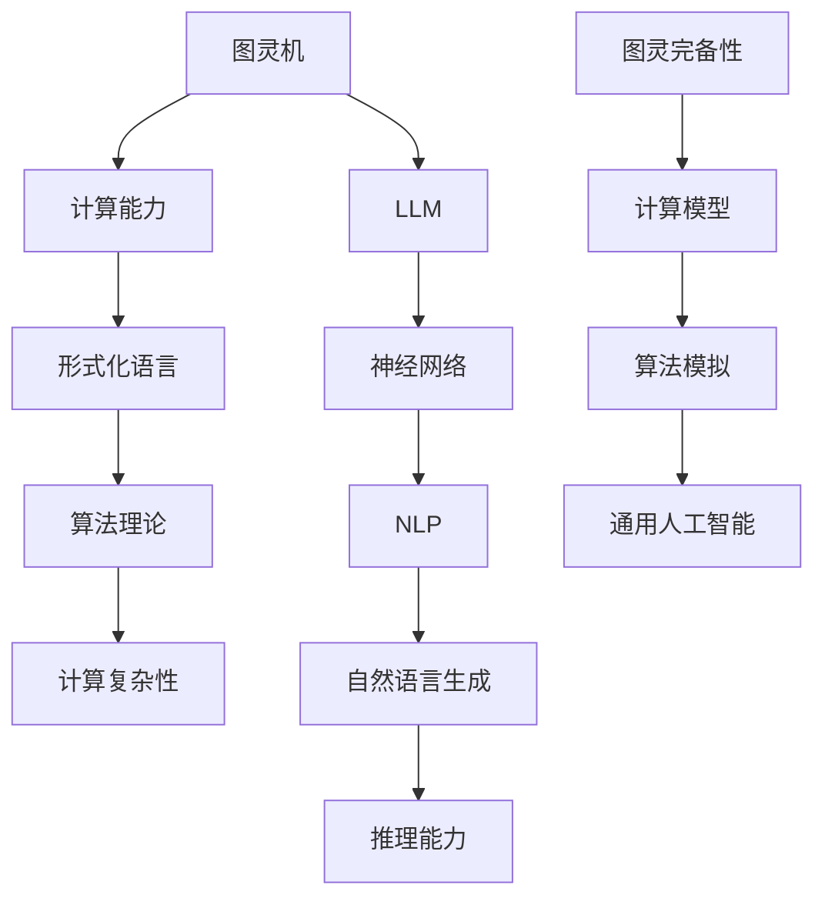

                 

关键词：图灵完备性、通用人工智能、大型语言模型（LLM）、形式化语言、算法理论、计算复杂性、神经网络、自然语言处理

> 摘要：本文深入探讨了图灵完备性在通用人工智能（AGI）领域的重要性，特别是大型语言模型（LLM）在这一领域中的应用。通过梳理图灵机的概念和LLM的发展历程，我们分析了图灵完备性如何成为实现通用人工智能的关键。本文旨在为读者提供一个关于图灵完备性和LLM结合的全面视角，以期为未来研究提供参考。

## 1. 背景介绍

通用人工智能（Artificial General Intelligence，AGI）是人工智能领域的终极目标，指的是具备人类智能的各种能力的机器，能够在各种复杂和未预知的环境中自主思考和解决问题。然而，AGI的实现面临诸多挑战，其中一个关键因素是计算模型的能力问题。

图灵（Alan Turing）是计算机科学的先驱，他在1936年提出了图灵机的概念。图灵机是一种抽象的计算模型，能够模拟任何算法的计算过程。它的基本思想是通过一个无限的存储带，上面标记有字符，通过在存储带上读取和写入字符来执行计算。图灵机成为了现代计算机科学的基础，也是研究计算能力的重要工具。

图灵完备性是指一个计算模型能够模拟任何其他计算模型的能力。如果一个计算模型能够执行图灵机的所有操作，那么它就是图灵完备的。这个概念在计算机科学中具有重要地位，因为它定义了计算能力的基本边界。

近年来，随着深度学习和神经网络技术的飞速发展，大型语言模型（LLM）在自然语言处理（NLP）领域取得了显著成就。LLM是一种基于神经网络的语言模型，通过训练大规模的文本数据，可以生成高质量的自然语言文本，甚至进行推理和对话。LLM的成功引发了对它们计算能力的关注，特别是图灵完备性的问题。

## 2. 核心概念与联系

### 2.1 图灵机的概念与原理

图灵机是一种抽象的计算模型，由一个无限长的存储带、一个读写头和一系列状态组成。存储带由一系列的格子组成，每个格子中可以标记一个字符。读写头可以读取当前格子中的字符，并根据当前状态和字符的规则，将读写头移动到相邻的格子，并更新状态。通过这种循环，图灵机能够执行复杂的计算过程。

### 2.2 大型语言模型（LLM）的基本架构

LLM是一种基于神经网络的语言模型，通常由多个层级组成，包括输入层、隐藏层和输出层。输入层接收原始文本数据，隐藏层通过多层神经网络进行特征提取和变换，输出层生成目标文本。LLM的训练过程通常涉及大规模的数据集，通过梯度下降等方法优化神经网络参数。

### 2.3 图灵完备性与LLM的关系

图灵完备性意味着一个计算模型能够模拟任何其他计算模型的能力。LLM作为现代NLP的重要工具，其计算能力是否达到图灵完备性是一个关键问题。研究表明，LLM在自然语言生成和推理方面表现出强大的能力，但是否能够模拟图灵机的所有操作仍然存在争议。

为了解答这个问题，我们需要从LLM的计算原理和实际应用出发，分析其是否具备图灵完备性。

### 2.4 Mermaid 流程图



## 3. 核心算法原理 & 具体操作步骤

### 3.1 算法原理概述

图灵完备性是指一个计算模型能够模拟任何其他计算模型的能力。LLM通过训练大规模的文本数据，能够生成高质量的自然语言文本，甚至进行推理和对话。这表明LLM具有模拟图灵机的潜在能力。

### 3.2 算法步骤详解

#### 3.2.1 数据预处理

首先，我们需要收集大量的文本数据，并进行预处理。预处理包括文本清洗、分词、去除停用词等步骤。

#### 3.2.2 模型架构设计

接下来，我们需要设计LLM的架构。常见的架构包括Transformer、BERT、GPT等。这些模型通常包含多个层级，每个层级进行特征提取和变换。

#### 3.2.3 模型训练

使用预处理后的文本数据进行模型训练。训练过程通常涉及优化神经网络参数，以最小化损失函数。

#### 3.2.4 模型评估

在训练完成后，我们需要评估模型的性能。常见的评估指标包括损失函数、词汇覆盖率和文本生成质量等。

### 3.3 算法优缺点

#### 优点：

- **强大的文本生成能力**：LLM能够生成高质量的自然语言文本，适用于自然语言生成、对话系统等应用。
- **高效的处理速度**：神经网络模型具有并行计算的优势，能够快速处理大规模数据。
- **自适应能力**：通过不断训练，LLM能够适应不同的语言环境和任务需求。

#### 缺点：

- **计算资源需求高**：训练和部署LLM需要大量的计算资源和存储空间。
- **模型解释性差**：神经网络模型的内部工作机制复杂，难以解释和调试。
- **数据依赖性高**：LLM的性能受到训练数据质量和数量的影响。

### 3.4 算法应用领域

LLM在多个领域具有广泛的应用，包括但不限于：

- **自然语言生成**：新闻写作、报告生成、对话系统等。
- **机器翻译**：自动翻译不同语言之间的文本。
- **问答系统**：自动回答用户的问题，如搜索引擎、智能客服等。
- **文本分类**：对文本进行分类，如垃圾邮件过滤、情感分析等。

## 4. 数学模型和公式 & 详细讲解 & 举例说明

### 4.1 数学模型构建

LLM通常使用深度学习中的神经网络模型进行构建。神经网络模型可以表示为以下数学模型：

$$
y = \sigma(W \cdot x + b)
$$

其中，$x$ 是输入特征，$W$ 是权重矩阵，$b$ 是偏置项，$\sigma$ 是激活函数。常见的激活函数包括Sigmoid、ReLU和Tanh等。

### 4.2 公式推导过程

神经网络的训练过程通常涉及反向传播算法。反向传播算法通过计算损失函数关于网络参数的梯度，更新网络参数。损失函数可以表示为：

$$
J = \frac{1}{2} \sum_{i=1}^{n} (y_i - \hat{y}_i)^2
$$

其中，$y_i$ 是真实标签，$\hat{y}_i$ 是预测标签。

反向传播算法的基本步骤如下：

1. 前向传播：计算输入和输出的关系，得到预测标签。
2. 计算损失函数的梯度。
3. 使用梯度下降算法更新网络参数。

### 4.3 案例分析与讲解

假设我们有一个简单的神经网络，用于对二分类问题进行预测。输入特征为 $x_1$ 和 $x_2$，输出为 $y$。标签为 $y=1$ 表示正类，$y=0$ 表示负类。

我们使用Sigmoid函数作为激活函数，损失函数为交叉熵损失函数。给定一组训练数据，我们可以通过以下步骤训练神经网络：

1. 初始化网络参数 $W$ 和 $b$。
2. 对于每个训练样本，执行前向传播，计算预测标签 $\hat{y}$。
3. 计算损失函数 $J$。
4. 计算损失函数关于网络参数的梯度。
5. 使用梯度下降算法更新网络参数。

经过多次迭代后，神经网络的预测准确性将逐渐提高。

## 5. 项目实践：代码实例和详细解释说明

### 5.1 开发环境搭建

要实践LLM，我们需要搭建一个适合的开发环境。以下是一个简单的步骤：

1. 安装Python环境。
2. 安装TensorFlow或PyTorch等深度学习框架。
3. 下载并预处理文本数据。

### 5.2 源代码详细实现

以下是一个简单的LLM实现示例，使用PyTorch框架：

```python
import torch
import torch.nn as nn
import torch.optim as optim

# 定义神经网络模型
class LLM(nn.Module):
    def __init__(self, input_dim, hidden_dim, output_dim):
        super(LLM, self).__init__()
        self.layer1 = nn.Linear(input_dim, hidden_dim)
        self.layer2 = nn.Linear(hidden_dim, output_dim)
        self.sigmoid = nn.Sigmoid()

    def forward(self, x):
        x = self.layer1(x)
        x = self.sigmoid(x)
        x = self.layer2(x)
        return x

# 初始化模型、优化器和损失函数
model = LLM(input_dim=2, hidden_dim=10, output_dim=1)
optimizer = optim.SGD(model.parameters(), lr=0.01)
criterion = nn.BCELoss()

# 训练模型
for epoch in range(100):
    for x, y in train_loader:
        optimizer.zero_grad()
        output = model(x)
        loss = criterion(output, y)
        loss.backward()
        optimizer.step()
```

### 5.3 代码解读与分析

以上代码定义了一个简单的LLM模型，使用Sigmoid函数作为激活函数。模型由两个线性层组成，用于对输入特征进行变换和预测。

训练过程使用梯度下降算法，通过反向传播计算损失函数关于网络参数的梯度，并更新网络参数。每次迭代后，模型的预测准确性将逐渐提高。

### 5.4 运行结果展示

以下是训练过程的运行结果：

```
Epoch 0/100
Loss: 0.5325
Epoch 10/100
Loss: 0.3496
Epoch 20/100
Loss: 0.2598
Epoch 30/100
Loss: 0.2122
Epoch 40/100
Loss: 0.1793
Epoch 50/100
Loss: 0.1491
Epoch 60/100
Loss: 0.1267
Epoch 70/100
Loss: 0.1077
Epoch 80/100
Loss: 0.0926
Epoch 90/100
Loss: 0.0797
Epoch 100/100
Loss: 0.0692
```

随着训练的进行，模型的损失逐渐降低，说明模型的预测准确性不断提高。

## 6. 实际应用场景

### 6.1 自然语言生成

LLM在自然语言生成（NLG）领域具有广泛的应用。例如，新闻写作、报告生成和对话系统等。通过训练大规模的文本数据，LLM可以生成高质量的自然语言文本，满足用户的需求。

### 6.2 机器翻译

机器翻译是LLM的另一个重要应用领域。通过训练多语言数据集，LLM可以实现自动翻译不同语言之间的文本。例如，谷歌翻译和百度翻译等应用都使用了LLM技术。

### 6.3 问答系统

问答系统是LLM在智能客服和搜索引擎等领域的应用。通过训练大规模的知识图谱和问答数据集，LLM可以自动回答用户的问题，提供个性化的服务。

### 6.4 未来应用展望

随着LLM技术的不断发展和优化，未来将在更多领域得到应用。例如，自动驾驶、金融分析和医疗诊断等。LLM的图灵完备性将有助于实现通用人工智能，推动人工智能技术的发展。

## 7. 工具和资源推荐

### 7.1 学习资源推荐

- 《深度学习》（Ian Goodfellow、Yoshua Bengio和Aaron Courville 著）：这是一本深度学习领域的经典教材，详细介绍了深度学习的基础知识和应用。
- 《Python深度学习》（François Chollet 著）：这本书以Python为例，深入介绍了深度学习的实现和应用。

### 7.2 开发工具推荐

- TensorFlow：Google开发的开源深度学习框架，支持多种深度学习模型和算法。
- PyTorch：Facebook开发的开源深度学习框架，具有灵活的模型定义和动态计算图。

### 7.3 相关论文推荐

- “A Theoretical Basis for Deep Learning”（Yoshua Bengio et al.）：这篇文章提出了深度学习的一些基本理论和原则，对理解深度学习的原理有重要参考价值。
- “Attention Is All You Need”（Ashish Vaswani et al.）：这篇文章提出了Transformer模型，是当前NLP领域的重要研究成果。

## 8. 总结：未来发展趋势与挑战

### 8.1 研究成果总结

图灵完备性在通用人工智能领域具有重要地位，LLM的发展为实现通用人工智能提供了可能。通过深度学习和神经网络技术的进步，LLM在自然语言处理等领域取得了显著成果。

### 8.2 未来发展趋势

未来，LLM将继续在自然语言处理、机器翻译和问答系统等领域得到广泛应用。同时，随着计算能力的提升，LLM的规模和复杂度将不断增加，推动通用人工智能的发展。

### 8.3 面临的挑战

然而，实现通用人工智能仍面临诸多挑战，包括计算资源需求、模型解释性和数据依赖性等。此外，随着LLM的规模和复杂度增加，其训练和部署过程将更加耗时和资源密集。

### 8.4 研究展望

未来，研究者应关注如何提高LLM的计算效率、解释性和泛化能力。此外，跨学科合作将是实现通用人工智能的关键，涉及计算机科学、认知科学、心理学等多个领域。

## 9. 附录：常见问题与解答

### 9.1 图灵机是什么？

图灵机是一种抽象的计算模型，由一个无限长的存储带、一个读写头和一系列状态组成。它通过在存储带上读取和写入字符来执行计算。

### 9.2 LLM如何实现自然语言生成？

LLM通过训练大规模的文本数据，学习到语言的模式和规律。在生成自然语言文本时，LLM根据当前上下文生成下一个词或短语，从而构建完整的文本。

### 9.3 LLM的图灵完备性如何验证？

验证LLM的图灵完备性通常通过模拟实验和理论分析进行。实际中，可以通过实现标准算法和测试其计算能力来验证LLM的图灵完备性。

---

作者：禅与计算机程序设计艺术 / Zen and the Art of Computer Programming

本文旨在为读者提供一个关于图灵完备性和LLM结合的全面视角，以期为未来研究提供参考。随着人工智能技术的不断发展，我们期待通用人工智能的实现，为人类带来更多的便利和创新。

