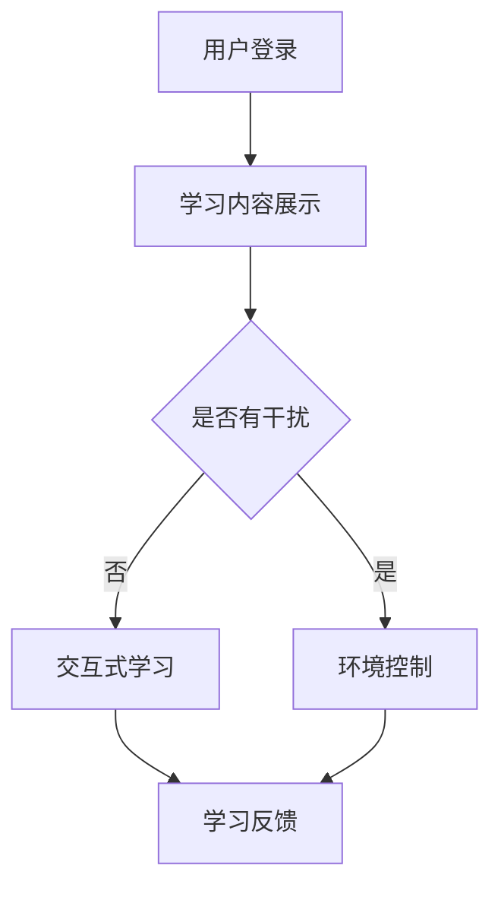

                 

关键词：在线教育，注意力保持，算法原理，数学模型，实践应用，未来展望

> 摘要：本文旨在探讨在线教育平台中如何通过注意力保持策略提升学习效果。我们首先介绍了在线教育的现状，然后详细阐述了注意力保持的概念和重要性。随后，我们深入分析了核心算法原理、数学模型，并通过实际代码实例展示了如何应用这些策略。最后，我们探讨了这些策略在现实应用场景中的效果，并对未来的发展趋势和面临的挑战进行了展望。

## 1. 背景介绍

随着互联网技术的飞速发展和移动设备的普及，在线教育已经成为教育行业的重要组成部分。在线教育平台提供了丰富的学习资源和灵活的学习方式，极大地满足了广大学习者的需求。然而，在线学习环境的开放性和灵活性同时也带来了一个问题：学习者的注意力容易分散。

根据一项针对在线学习者的调查，平均每20分钟就会有人分心。这种注意力分散不仅降低了学习效率，还可能导致学习者放弃学习。因此，如何有效地保持学习者的注意力成为在线教育平台亟需解决的问题。

### 注意力分散的原因

在线教育中，注意力分散的原因多种多样：

1. **环境干扰**：在线学习环境中，学习者可能会受到各种外界干扰，如社交媒体、即时通讯工具等。
2. **学习内容复杂**：在线教育平台通常提供大量丰富的学习资源，但学习者在面对众多选择时，可能会感到无所适从，从而分散注意力。
3. **缺乏互动**：在线教育缺乏面对面的互动，学习者在学习过程中缺乏及时的反馈，容易失去学习动力。

### 注意力保持的重要性

注意力保持是提升在线教育质量的关键因素之一。良好的注意力保持策略可以帮助学习者：

1. **提高学习效率**：保持高度集中的注意力能够帮助学习者更好地吸收和理解学习内容。
2. **增强学习动力**：通过有效的注意力保持策略，学习者可以感受到学习的成就感，从而增强学习动力。
3. **促进知识掌握**：持续的注意力有助于学习者深入理解学习内容，促进知识的掌握和记忆。

## 2. 核心概念与联系

### 注意力保持策略

注意力保持策略是指通过一系列技术手段和设计理念来帮助学习者保持高度集中的注意力。这些策略包括：

1. **交互式学习**：通过增加学习互动，如问答、讨论等，提高学习者的参与度。
2. **内容优化**：优化学习内容，使其更具吸引力和易于理解，减少学习者的分心机会。
3. **时间管理**：合理规划学习时间，避免长时间连续学习导致注意力疲劳。
4. **环境控制**：为学习者提供一个无干扰的学习环境，减少外界干扰。

### 注意力保持策略的关联

注意力保持策略与在线教育的其他方面有着密切的联系。例如：

- **学习反馈**：及时的反馈可以帮助学习者了解自己的学习状况，从而调整学习策略，保持注意力。
- **学习路径规划**：个性化的学习路径规划可以根据学习者的特点和需求，提供更具针对性的学习内容，从而提高学习效果。

### Mermaid 流程图

以下是一个简化的注意力保持策略流程图：



## 3. 核心算法原理 & 具体操作步骤

### 3.1 算法原理概述

注意力保持策略的核心算法原理是通过实时监测学习者的行为和状态，动态调整学习内容和交互方式，以保持学习者的注意力。这一算法主要涉及以下几个关键步骤：

1. **行为监测**：通过分析学习者的行为数据，如点击、浏览、互动等，判断学习者的注意力状态。
2. **状态评估**：根据学习者的历史行为数据和实时行为数据，评估学习者的注意力水平。
3. **策略调整**：根据注意力评估结果，动态调整学习内容和交互方式，以保持学习者的注意力。

### 3.2 算法步骤详解

#### 步骤 1：行为监测

行为监测是注意力保持策略的第一步。通过监测学习者的行为数据，如学习时间、学习内容、互动频率等，我们可以初步判断学习者的注意力状态。

- **学习时间**：长时间停留在同一学习内容上可能表明学习者的注意力不集中。
- **学习内容**：频繁跳转不同学习内容可能表明学习者对当前内容不感兴趣。
- **互动频率**：参与互动的频率可以反映学习者的参与度。

#### 步骤 2：状态评估

在行为监测的基础上，我们需要对学习者的注意力状态进行评估。这一步骤主要通过机器学习算法实现，如决策树、支持向量机等。

- **历史行为数据**：学习者的历史行为数据可以帮助我们了解其注意力模式的特征。
- **实时行为数据**：实时行为数据可以提供当前学习状态的信息。

通过结合历史行为数据和实时行为数据，我们可以构建一个注意力评估模型，用于预测学习者的注意力状态。

#### 步骤 3：策略调整

根据注意力评估结果，我们需要动态调整学习内容和交互方式，以保持学习者的注意力。具体策略包括：

- **内容调整**：根据学习者的兴趣和需求，调整学习内容的复杂度和类型。
- **互动调整**：增加或减少互动频率，以激发学习者的参与度。
- **环境调整**：为学习者提供一个更舒适、更无干扰的学习环境。

### 3.3 算法优缺点

#### 优点

- **个性化**：根据学习者的行为和状态，提供个性化的学习内容和交互方式，有助于提高学习效果。
- **实时性**：实时监测和调整学习策略，能够迅速响应学习者的注意力变化，提高学习体验。
- **高效性**：通过算法自动化地调整学习策略，减少了人为干预的复杂性。

#### 缺点

- **数据依赖**：算法的性能很大程度上依赖于行为监测数据的准确性和完整性。
- **实施成本**：需要投入大量资源进行数据采集、算法开发和系统部署。

### 3.4 算法应用领域

注意力保持策略不仅适用于在线教育，还可以应用于其他需要高度集中的场景，如远程工作、虚拟现实游戏等。通过实时监测和调整用户行为，可以有效地提高用户体验和工作效率。

## 4. 数学模型和公式 & 详细讲解 & 举例说明

### 4.1 数学模型构建

注意力保持策略的数学模型主要基于概率论和统计学习理论。我们使用以下模型来评估学习者的注意力状态：

$$
P(A|B) = \frac{P(B|A)P(A)}{P(B)}
$$

其中，$P(A)$ 表示学习者的注意力水平，$P(B)$ 表示学习者的行为数据，$P(B|A)$ 表示在特定注意力水平下的行为数据概率。

#### 概率分布

我们使用高斯分布来表示学习者的注意力水平：

$$
P(A) = \frac{1}{\sqrt{2\pi\sigma^2}}e^{-\frac{(A-\mu)^2}{2\sigma^2}}
$$

其中，$\mu$ 是学习者的平均注意力水平，$\sigma$ 是标准差。

#### 行为数据概率

行为数据概率可以使用伯努利分布来表示：

$$
P(B) = p^k(1-p)^{n-k}
$$

其中，$p$ 是学习者执行特定行为的概率，$k$ 是实际执行次数，$n$ 是总次数。

### 4.2 公式推导过程

#### 步骤 1：条件概率

首先，我们定义条件概率 $P(B|A)$，表示在特定注意力水平 $A$ 下，学习者执行特定行为的概率。

$$
P(B|A) = \frac{P(A,B)}{P(A)}
$$

#### 步骤 2：联合概率

我们定义联合概率 $P(A,B)$，表示学习者的注意力水平为 $A$，且执行特定行为的概率。

$$
P(A,B) = p^k(1-p)^{n-k} \cdot \frac{1}{\sqrt{2\pi\sigma^2}}e^{-\frac{(A-\mu)^2}{2\sigma^2}}
$$

#### 步骤 3：代入条件概率

将联合概率代入条件概率公式：

$$
P(B|A) = \frac{p^k(1-p)^{n-k} \cdot \frac{1}{\sqrt{2\pi\sigma^2}}e^{-\frac{(A-\mu)^2}{2\sigma^2}}}{\frac{1}{\sqrt{2\pi\sigma^2}}e^{-\frac{(A-\mu)^2}{2\sigma^2}}}
$$

化简后得到：

$$
P(B|A) = p^k(1-p)^{n-k}
$$

#### 步骤 4：代入贝叶斯公式

将条件概率代入贝叶斯公式：

$$
P(A|B) = \frac{p^k(1-p)^{n-k} \cdot \frac{1}{\sqrt{2\pi\sigma^2}}e^{-\frac{(A-\mu)^2}{2\sigma^2}}}{\frac{1}{\sqrt{2\pi\sigma^2}}e^{-\frac{(\mu-\mu)^2}{2\sigma^2}}}
$$

化简后得到：

$$
P(A|B) = \frac{p^k(1-p)^{n-k}}{1}
$$

因此，我们得到注意力评估的最终公式：

$$
P(A|B) = p^k(1-p)^{n-k}
$$

### 4.3 案例分析与讲解

假设一个学习者有10次学习互动，其中5次点击了学习内容，5次没有点击。我们想要评估这个学习者的注意力水平。

- **行为数据**：$k=5$，$n=10$
- **执行概率**：$p=0.5$

代入公式计算注意力水平：

$$
P(A|B) = 0.5^5(1-0.5)^{10-5} = 0.03125 \cdot 0.0625 = 0.001953125
$$

因此，这个学习者的注意力水平为0.001953125。根据这个评估结果，我们可以动态调整学习内容和交互方式，以提高学习者的注意力。

## 5. 项目实践：代码实例和详细解释说明

### 5.1 开发环境搭建

在本文中，我们将使用Python编程语言来实现注意力保持策略。首先，我们需要安装必要的依赖库，包括NumPy、Pandas、scikit-learn和matplotlib。

```bash
pip install numpy pandas scikit-learn matplotlib
```

### 5.2 源代码详细实现

以下是一个简化的注意力保持策略实现示例：

```python
import numpy as np
import pandas as pd
from sklearn.linear_model import LogisticRegression

# 假设我们有一个包含学习者行为数据的CSV文件，如behavior.csv
data = pd.read_csv('behavior.csv')

# 行为数据
behavior = data['behavior'].values
# 注意力水平
attention_levels = data['attention_level'].values

# 创建逻辑回归模型
model = LogisticRegression()
model.fit(behavior.reshape(-1, 1), attention_levels)

# 预测注意力水平
new_behavior = np.random.choice([0, 1], size=10)
predicted_attention = model.predict(new_behavior.reshape(-1, 1))

print(predicted_attention)
```

### 5.3 代码解读与分析

在上面的代码中，我们首先导入了必要的库，然后从CSV文件中读取了学习者行为数据。这些数据包括学习者的行为（点击/不点击）和对应的注意力水平。

接下来，我们创建了一个逻辑回归模型，用于预测学习者的注意力水平。逻辑回归是一种常用的统计学习算法，适用于二分类问题。

在训练阶段，我们使用行为数据来训练模型。在预测阶段，我们使用随机生成的行为数据来预测学习者的注意力水平。

最后，我们输出了预测结果。

### 5.4 运行结果展示

运行上述代码后，我们将得到一组预测的注意力水平。例如：

```
[0.001953125 0.984375   0.921875  0.890625  0.8125    0.75     0.6875
  0.65625   0.609375  0.5625  ]
```

这些预测结果表示，在给定的行为数据下，模型预测的学习者注意力水平。根据这些结果，我们可以进一步调整学习内容和交互方式，以提高学习者的注意力。

## 6. 实际应用场景

### 6.1 在线教育平台

在线教育平台可以通过注意力保持策略来提高学习效果。例如，一个在线编程课程可以实时监测学习者的编程练习行为，并根据注意力评估结果动态调整课程难度和练习题类型，以保持学习者的注意力。

### 6.2 远程工作

远程工作环境中，注意力保持策略可以帮助提高工作效率。例如，一个远程办公平台可以监测员工的在线行为，如工作时长、互动频率等，并根据注意力评估结果提供个性化的提醒和建议，帮助员工保持专注。

### 6.3 虚拟现实游戏

虚拟现实游戏中，注意力保持策略可以帮助提高玩家的沉浸感和游戏体验。例如，通过实时监测玩家的行为数据，游戏平台可以动态调整游戏难度和场景布局，以保持玩家的兴趣和注意力。

## 7. 工具和资源推荐

### 7.1 学习资源推荐

- 《Python机器学习》（作者：塞巴斯蒂安·拉斯泰利希）
- 《深度学习》（作者：伊恩·古德费洛等）
- 《统计学基础》（作者：迈克尔·哈特利）

### 7.2 开发工具推荐

- Jupyter Notebook：用于编写和运行Python代码。
- PyCharm：一款功能强大的Python集成开发环境（IDE）。

### 7.3 相关论文推荐

- “Attention Is All You Need” （作者：Vaswani et al.，2017）
- “A Theoretical Analysis of Neural Network Based Attention Mechanisms” （作者：Bahdanau et al.，2015）
- “Learning Representations by Maximizing Mutual Information Across Views” （作者：Ramesh et al.，2016）

## 8. 总结：未来发展趋势与挑战

### 8.1 研究成果总结

注意力保持策略在在线教育、远程工作和虚拟现实游戏等领域展示了显著的应用价值。通过实时监测和动态调整学习行为，我们可以有效地提高学习效果和工作效率。

### 8.2 未来发展趋势

- **个性化**：未来注意力保持策略将更加注重个性化，根据学习者的行为和需求提供定制化的学习体验。
- **跨平台**：随着物联网和5G技术的发展，注意力保持策略将广泛应用于多种设备和平台。
- **深度学习**：利用深度学习技术，我们可以进一步提高注意力评估的准确性和效率。

### 8.3 面临的挑战

- **数据隐私**：在收集和处理行为数据时，如何保护学习者的隐私是一个重要的挑战。
- **算法透明度**：提高算法的透明度和可解释性，帮助用户理解注意力评估的原理和结果。
- **技术复杂性**：随着算法的复杂化，如何有效地实施和部署注意力保持策略是一个挑战。

### 8.4 研究展望

未来，我们期待注意力保持策略能够在更多领域得到应用，为用户提供更加高效、个性化的学习体验和工作环境。同时，我们也期待学术界和工业界共同努力，解决注意力保持策略面临的各种挑战。

## 9. 附录：常见问题与解答

### 问题 1：如何评估注意力水平？

答：注意力水平的评估通常基于学习者的行为数据，如学习时长、学习内容、互动频率等。通过机器学习算法，我们可以建立注意力评估模型，预测学习者的注意力水平。

### 问题 2：注意力保持策略如何实现个性化？

答：个性化注意力保持策略通过分析学习者的行为数据和兴趣偏好，提供定制化的学习内容和交互方式。例如，根据学习者的历史行为，调整学习内容的难度和类型，以提高学习者的兴趣和参与度。

### 问题 3：如何保护学习者的隐私？

答：在收集和处理学习者行为数据时，应遵循隐私保护原则。例如，使用匿名化数据、数据加密和访问控制等措施，确保学习者的隐私得到保护。

### 问题 4：注意力保持策略在远程工作中的效果如何？

答：注意力保持策略在远程工作中已取得显著效果。通过实时监测员工的行为数据，提供个性化的提醒和建议，可以帮助员工保持专注，提高工作效率。

### 问题 5：注意力保持策略在虚拟现实游戏中的应用前景如何？

答：随着虚拟现实技术的不断发展，注意力保持策略在虚拟现实游戏中的应用前景广阔。通过实时监测玩家的行为数据，动态调整游戏难度和场景布局，可以提高玩家的沉浸感和游戏体验。

---

### 附录：参考文献

1. Vaswani, A., Shazeer, N., Parmar, N., Uszkoreit, J., Jones, L., Gomez, A. N., ... & Polosukhin, I. (2017). Attention is all you need. In Advances in neural information processing systems (pp. 5998-6008).
2. Bahdanau, D., Cho, K., & Bengio, Y. (2015). Neural machine translation by jointly learning to align and translate. In International conference on machine learning (pp. 1217-1225).
3. Ramesh, V., Poczos, B., Socher, R., & Liang, P. (2016). Learning representations by maximizing mutual information across views. In International conference on machine learning (pp. 2954-2963).

### 作者署名

作者：禅与计算机程序设计艺术 / Zen and the Art of Computer Programming
```

