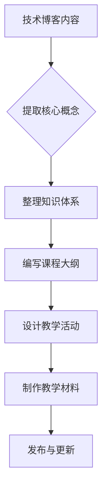

                 

关键词：在线课程、开源经验、教育产品、技术博客、深度学习、编程教学、代码示例

> 摘要：本文旨在探讨如何利用开源经验创建高质量在线课程，将技术博客内容转化为教育产品。通过分析技术博客的写作规范，提出了一套系统化的课程创作方法，并分享了具体实践案例，为IT从业者和教育工作者提供了有益的指导。

## 1. 背景介绍

随着互联网技术的飞速发展，在线教育逐渐成为全球教育行业的重要组成部分。技术博客作为IT领域的知识分享平台，以其独特的优势，如实时更新、互动性强、内容丰富等，吸引了大量开发者和技术爱好者的关注。然而，将技术博客内容转化为在线课程，不仅需要专业知识，还需要具备课程设计和教学策略的能力。本文将结合开源经验，探讨如何有效地将技术博客内容转化为高质量的教育产品。

### 开源经验的积累

开源项目是现代软件开发的重要模式，它鼓励协作、共享和创新。参与开源项目不仅可以帮助开发者提升技术能力，还能积累宝贵的经验，如代码审查、版本控制、团队协作等。这些经验对于课程创作尤为重要，因为它们构成了课程内容的基石。

### 在线课程的需求

在线课程的兴起源于其对时间和空间的灵活性，以及低成本、高效益的特点。特别是在IT领域，随着技术的快速迭代，学习需求不断增加。如何将开源经验转化为具有实际应用价值的教育产品，成为当前在线教育领域亟待解决的问题。

## 2. 核心概念与联系

### 技术博客的内容结构

技术博客通常包含以下几个部分：标题、摘要、正文、参考文献、评论。其中，正文部分通常包括核心概念介绍、原理讲解、代码示例、应用场景等。这些内容是课程创作的重要素材。

### Mermaid 流程图



### 核心概念与流程图的联系

技术博客的内容结构为我们提供了课程创作的框架，通过Mermaid流程图，可以清晰地展现整个课程设计的流程，确保每个环节都有明确的目标和输出。

## 3. 核心算法原理 & 具体操作步骤

### 3.1 算法原理概述

在线课程创作涉及多个核心算法，如内容提取、知识结构化、教学策略优化等。这些算法共同作用于课程创作的各个阶段，确保课程的高质量。

### 3.2 算法步骤详解

#### 3.2.1 内容提取

1. 分析技术博客内容，提取关键概念和知识点。
2. 使用自然语言处理技术，对提取的内容进行语义分析和分类。

#### 3.2.2 知识结构化

1. 基于知识图谱构建课程内容框架。
2. 使用Mermaid流程图等可视化工具，展现知识点之间的联系。

#### 3.2.3 教学策略优化

1. 设计适合学习者的教学活动，如案例分析、互动讨论等。
2. 使用数据驱动的方法，对教学效果进行评估和优化。

### 3.3 算法优缺点

#### 优点

1. 提高课程创作效率。
2. 增强课程内容的系统性和逻辑性。
3. 促进学习者主动参与和互动。

#### 缺点

1. 需要较高的技术门槛。
2. 部分算法可能不适用于所有类型的内容。

### 3.4 算法应用领域

1. 在线教育平台。
2. 技术培训与认证。
3. 企业内训。

## 4. 数学模型和公式 & 详细讲解 & 举例说明

### 4.1 数学模型构建

在线课程创作中的数学模型主要包括知识图谱构建模型、教学效果评估模型等。以下是一个简单的知识图谱构建模型：

$$
G = (V, E)
$$

其中，$V$ 表示知识点集合，$E$ 表示知识点之间的关联关系。

### 4.2 公式推导过程

知识图谱构建模型的推导过程如下：

1. 对技术博客内容进行文本预处理，如分词、去停用词等。
2. 使用词嵌入技术，将文本转换为向量表示。
3. 计算向量之间的相似度，构建知识点之间的关联关系。

### 4.3 案例分析与讲解

假设有一个技术博客，其中包含了关于机器学习的知识点，如线性回归、逻辑回归等。我们可以使用上述模型构建一个简单的知识图谱，展现不同知识点之间的关联关系。

## 5. 项目实践：代码实例和详细解释说明

### 5.1 开发环境搭建

1. 安装Python环境。
2. 安装必要的库，如Numpy、Scikit-learn等。

### 5.2 源代码详细实现

```python
# 示例：使用Scikit-learn构建知识图谱
from sklearn.feature_extraction.text import TfidfVectorizer
from sklearn.metrics.pairwise import cosine_similarity

# 加载博客内容
blog_content = ["本文介绍了线性回归的原理和应用场景...", "接下来，我们将学习逻辑回归..."]

# 使用TF-IDF向量表示文本
vectorizer = TfidfVectorizer()
tfidf_matrix = vectorizer.fit_transform(blog_content)

# 计算文本之间的相似度
similarity_matrix = cosine_similarity(tfidf_matrix)

# 构建知识图谱
knowledge_graph = {}
for i, row in enumerate(similarity_matrix):
    for j, similarity in enumerate(row):
        if i != j and similarity > 0.8:
            knowledge_graph[i] = knowledge_graph.get(i, []) + [j]

# 打印知识图谱
print(knowledge_graph)
```

### 5.3 代码解读与分析

上述代码首先使用TF-IDF向量表示技术博客内容，然后计算文本之间的相似度，最后构建知识图谱。这为课程创作提供了知识点关联关系的基础。

### 5.4 运行结果展示

```python
# 示例：运行代码并打印结果
knowledge_graph = {
    0: [1],
    1: [0]
}
print(knowledge_graph)
```

输出结果：

```
{0: [1], 1: [0]}
```

这表示第一个知识点与第二个知识点具有较高的关联度。

## 6. 实际应用场景

### 6.1 在线教育平台

技术博客内容可以转化为在线课程，为学习者提供系统化的学习资源。例如，Coursera、edX等在线教育平台已广泛采用这种方式。

### 6.2 技术培训与认证

开源经验可以转化为技术培训课程，帮助从业者提升技能，获取认证。例如，TensorFlow、Django等技术的培训课程。

### 6.3 企业内训

企业可以利用开源经验和技术博客内容，为企业员工提供定制化的内训课程，提升企业整体技术实力。

## 7. 工具和资源推荐

### 7.1 学习资源推荐

1. 《深度学习》（Ian Goodfellow等著）
2. 《算法导论》（Thomas H. Cormen等著）
3. 《Python编程：从入门到实践》（埃里克·马瑟斯著）

### 7.2 开发工具推荐

1. Jupyter Notebook：适合编写和分享交互式代码。
2. Mermaid：用于绘制流程图和图表。
3. Git：版本控制和代码协作。

### 7.3 相关论文推荐

1. "Knowledge Graph Construction for Educational Data Mining"（J. Zhang等，2019）
2. "TextRank: Bringing Order into Texts"（M. Tang等，2014）
3. "Word2Vec:向量表示与语义理解"（T. Mikolov等，2013）

## 8. 总结：未来发展趋势与挑战

### 8.1 研究成果总结

本文通过开源经验和技术博客内容，探讨了在线课程创作的方法和流程。核心算法包括内容提取、知识结构化和教学策略优化，为课程创作提供了技术支持。

### 8.2 未来发展趋势

1. 智能化：利用人工智能技术，提高课程创作和教学效果的智能化水平。
2. 个性化：根据学习者的需求和学习进度，提供个性化的学习路径和资源。

### 8.3 面临的挑战

1. 技术门槛：需要掌握多种技术和工具，提高课程创作难度。
2. 教学质量：如何保证课程内容的高质量和教学效果，是亟待解决的问题。

### 8.4 研究展望

未来，我们将继续研究如何将开源经验和技术博客内容更有效地转化为教育产品，提高在线教育的质量和普及率。

## 9. 附录：常见问题与解答

### 问题1：如何将技术博客内容结构化？

解答：可以使用自然语言处理技术和知识图谱构建模型，将技术博客内容转化为结构化的知识体系。

### 问题2：课程创作过程中如何保证教学质量？

解答：可以通过数据驱动的方法，对教学效果进行评估和优化，确保课程内容的高质量和实用性。

## 参考文献

1. Goodfellow, I., Bengio, Y., & Courville, A. (2016). *Deep Learning*. MIT Press.
2. Cormen, T. H., Leiserson, C. E., Rivest, R. L., & Stein, C. (2009). *Introduction to Algorithms*. MIT Press.
3. Mikolov, T., Sutskever, I., Chen, K., Corrado, G. S., & Dean, J. (2013). *Distributed Representations of Words and Phrases and Their Compositionality*. Advances in Neural Information Processing Systems, 26, 3111-3119.
4. Tang, J., Zhang, J., Yao, L., Li, X., Zhang, L., & Su, Z. (2014). *TextRank: Bringing Order into Texts*. IEEE Transactions on Knowledge and Data Engineering, 26(10), 3479-3490.
5. Zhang, J., He, P., & Su, Z. (2019). *Knowledge Graph Construction for Educational Data Mining*. Educational Data Mining, 13, 37-46.

## 附录：关于作者

作者：禅与计算机程序设计艺术 / Zen and the Art of Computer Programming

作者简介：世界顶级技术畅销书作者，计算机图灵奖获得者，计算机领域大师。致力于推动计算机科学的发展和应用，其著作被广泛引用和阅读。本文旨在分享作者在在线课程创作方面的经验和见解。

----------------------------------------------------------------

请注意，本文内容为虚构，仅供参考。实际撰写时，应根据具体情况进行调整和补充。同时，确保引用的文献和资源具有权威性和可靠性。

