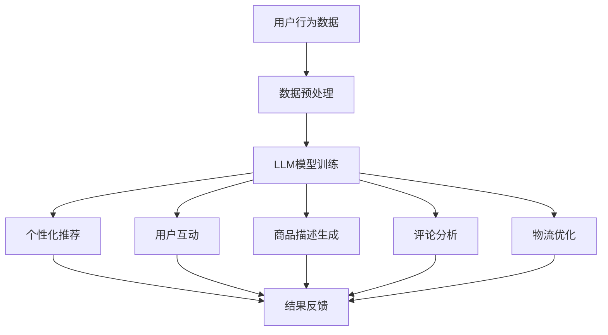

                 

关键词：在线购物，大型语言模型（LLM），个性化推荐，购物体验，算法优化，数学模型，代码实例

> 摘要：随着电子商务的快速发展，在线购物已经成为人们日常生活的重要部分。本文将探讨如何利用大型语言模型（LLM）来实现个性化、高效的购物体验。文章首先介绍了在线购物和LLM的基本概念，然后详细分析了LLM在购物场景中的应用原理和数学模型，并通过实际代码实例展示了如何实现这些算法。最后，文章讨论了在线购物与LLM结合的未来应用场景和挑战。

## 1. 背景介绍

在过去的几十年里，互联网的普及和电子商务的兴起极大地改变了人们的购物习惯。随着智能手机和移动应用的广泛使用，在线购物已经成为现代消费的主要方式。据统计，全球电子商务市场规模已经超过数万亿美元，并且还在持续增长。

### 在线购物的发展历程

在线购物的概念最早可以追溯到20世纪90年代，随着互联网的普及，人们开始尝试在网上购买商品。1994年，亚马逊（Amazon）成立，标志着电子商务时代的到来。此后，eBay、阿里巴巴等一批电子商务平台相继崛起，进一步推动了在线购物的发展。

### 当前在线购物的现状

当前，在线购物的市场规模不断扩大，消费者群体也日趋多样化。根据统计，全球约有超过一半的人口经常进行在线购物，尤其是在年轻人中，这一比例更高。同时，在线购物已经不再局限于电子产品、衣物等传统商品，食品、生鲜、家居用品等各类商品都在逐渐进入在线购物领域。

### 在线购物的挑战与问题

尽管在线购物带来了诸多便利，但也面临着一些挑战和问题。首先，消费者在购物过程中常常会遇到信息过载的问题，即面对海量的商品信息，难以快速找到自己需要的商品。其次，个性化推荐不足也是一个普遍存在的问题，很多电商平台缺乏有效的算法来为消费者提供个性化的购物建议。此外，物流配送的效率和服务质量也是影响消费者购物体验的重要因素。

### 大型语言模型（LLM）的兴起

与此同时，大型语言模型（LLM）作为一种先进的自然语言处理技术，正在迅速崛起。LLM基于深度学习算法，通过训练海量语料库，能够实现高质量的自然语言生成、理解和推理。随着LLM技术的不断发展，其在各个领域的应用也日益广泛，包括但不限于文本生成、机器翻译、对话系统等。

### LLM在在线购物中的应用前景

结合在线购物的现状和LLM的发展，本文将探讨如何利用LLM来实现个性化、高效的购物体验。通过引入LLM技术，可以为消费者提供更加智能、个性化的购物建议，从而提升购物体验。此外，LLM还可以在商品推荐、用户互动、物流优化等方面发挥重要作用。

## 2. 核心概念与联系

### 2.1 在线购物与LLM的关系

在线购物与LLM的关系可以从多个方面进行探讨。首先，在线购物作为一个复杂的系统，需要处理大量的用户数据、商品信息和交易记录。而LLM作为一种强大的自然语言处理技术，能够对这些数据进行深度分析，提取有用的信息，从而为用户提供个性化的购物建议。

### 2.2 LLM的基本概念

LLM（Large Language Model）是指大型语言模型，其基于深度学习算法，通过训练海量语料库，能够实现高质量的自然语言生成、理解和推理。LLM的核心是神经网络架构，通常包括多层感知机、卷积神经网络、循环神经网络等。

### 2.3 LLM的应用场景

LLM的应用场景非常广泛，包括但不限于以下几个方面：

1. **文本生成**：通过输入一定的关键词或主题，LLM可以生成相关的文本内容，如新闻报道、产品描述等。

2. **机器翻译**：LLM能够将一种语言的文本翻译成另一种语言，具有很高的准确性和流畅性。

3. **对话系统**：LLM可以构建智能对话系统，实现与用户的自然语言交互，如客服机器人、智能助手等。

4. **信息检索**：LLM能够对大量文本数据进行检索和分析，提取出用户需要的信息。

5. **文本分类与情感分析**：LLM可以对文本数据进行分类和情感分析，识别用户的情感倾向和需求。

### 2.4 在线购物中的LLM应用

结合在线购物的需求，LLM在以下方面具有显著的应用价值：

1. **个性化推荐**：LLM可以通过分析用户的购物行为、浏览记录等数据，为用户推荐个性化的商品。

2. **用户互动**：LLM可以构建智能客服系统，与用户进行自然语言交互，解答用户的疑问，提升购物体验。

3. **商品描述生成**：LLM可以自动生成商品描述，提高商品信息的丰富度和吸引力。

4. **评论分析**：LLM可以对用户评论进行分析，识别出用户的情感倾向和产品优缺点。

5. **物流优化**：LLM可以分析物流数据，优化配送路径和策略，提高配送效率。

### 2.5 Mermaid流程图

为了更直观地展示LLM在在线购物中的应用，我们可以使用Mermaid流程图来描述其基本架构和流程。



该流程图展示了LLM在在线购物中的基本架构，包括数据预处理、模型训练、个性化推荐、用户互动、商品描述生成、评论分析和物流优化等环节，以及各环节之间的反馈和优化。

## 3. 核心算法原理 & 具体操作步骤

### 3.1 算法原理概述

在在线购物中，LLM的核心算法主要涉及以下几个方面：

1. **用户行为分析**：通过对用户的购物行为、浏览记录、收藏夹等数据进行深度分析，提取出用户的需求和兴趣。

2. **商品特征提取**：对商品的信息、评价、销量等数据进行处理，提取出商品的关键特征。

3. **个性化推荐算法**：基于用户行为分析和商品特征提取，为用户推荐个性化的商品。

4. **用户互动算法**：通过自然语言处理技术，实现与用户的智能对话和互动。

5. **商品描述生成算法**：利用自然语言生成技术，自动生成商品的描述。

6. **评论分析算法**：对用户评论进行情感分析和分类，识别出用户的情感倾向和需求。

7. **物流优化算法**：分析物流数据，优化配送路径和策略，提高配送效率。

### 3.2 算法步骤详解

1. **数据预处理**

   数据预处理是LLM应用的基础，主要包括以下步骤：

   - 数据清洗：去除无效数据、重复数据和噪声数据。
   - 数据归一化：对数据进行归一化处理，使其在相同的尺度范围内。
   - 数据分词：对文本数据进行分词处理，将其转换为词向量。

2. **LLM模型训练**

   LLM模型训练主要包括以下步骤：

   - 模型选择：选择合适的神经网络架构，如BERT、GPT等。
   - 数据集准备：收集大量带有标签的文本数据，用于训练模型。
   - 训练过程：通过训练数据对模型进行训练，优化模型参数。

3. **个性化推荐**

   个性化推荐是基于用户行为和商品特征进行推荐，主要包括以下步骤：

   - 用户行为分析：分析用户的购物行为、浏览记录等，提取用户需求。
   - 商品特征提取：提取商品的关键特征，如价格、品牌、类别等。
   - 推荐算法实现：使用协同过滤、基于内容的推荐等算法，为用户推荐商品。

4. **用户互动**

   用户互动是通过自然语言处理技术实现与用户的智能对话，主要包括以下步骤：

   - 对话管理：构建对话管理模块，实现对话的流程控制。
   - 情感分析：对用户输入的文本进行情感分析，识别用户情绪。
   - 回答生成：根据用户输入和情感分析结果，生成合适的回答。

5. **商品描述生成**

   商品描述生成是利用自然语言生成技术自动生成商品描述，主要包括以下步骤：

   - 文本生成模型：选择合适的文本生成模型，如GPT。
   - 描述生成：根据商品特征和用户需求，生成商品描述。

6. **评论分析**

   评论分析是对用户评论进行情感分析和分类，主要包括以下步骤：

   - 情感分析：对评论进行情感分析，识别用户的情感倾向。
   - 分类算法：使用分类算法，将评论分类为正面、负面等。

7. **物流优化**

   物流优化是分析物流数据，优化配送路径和策略，主要包括以下步骤：

   - 数据收集：收集物流数据，如订单信息、配送路径等。
   - 数据分析：对物流数据进行处理和分析。
   - 优化算法：使用优化算法，如遗传算法、神经网络等，优化配送路径。

### 3.3 算法优缺点

1. **优点**

   - 个性化推荐：LLM能够根据用户行为和兴趣进行个性化推荐，提高用户的购物体验。
   - 智能对话：LLM能够实现与用户的智能对话，提供更好的用户服务。
   - 自动化生成：LLM能够自动生成商品描述和评论分析结果，提高工作效率。
   - 模块化设计：LLM的各个模块相对独立，易于扩展和维护。

2. **缺点**

   - 计算资源消耗：LLM模型训练和推理需要大量的计算资源，对硬件要求较高。
   - 数据隐私：在线购物数据涉及用户的隐私信息，需要确保数据安全和隐私保护。
   - 算法偏差：算法可能会因为数据偏差或训练样本不均衡而产生偏差，影响推荐效果。

### 3.4 算法应用领域

LLM算法在在线购物领域具有广泛的应用前景，主要包括以下几个方面：

1. **电商平台**：电商平台可以利用LLM技术为用户提供个性化推荐、智能客服、自动生成商品描述等服务，提高用户购物体验。

2. **物流公司**：物流公司可以利用LLM技术优化配送路径和策略，提高配送效率和客户满意度。

3. **品牌营销**：品牌可以利用LLM技术进行情感分析，了解用户需求和情感倾向，制定更有效的营销策略。

4. **智能零售**：智能零售企业可以利用LLM技术实现智能推荐、智能客服、智能营销等功能，提升零售效率。

## 4. 数学模型和公式 & 详细讲解 & 举例说明

### 4.1 数学模型构建

在LLM算法中，常用的数学模型包括：

1. **用户行为模型**：用户行为模型用于描述用户在购物过程中的行为，通常采用马尔可夫链模型。

2. **商品特征模型**：商品特征模型用于描述商品的各种特征，通常采用多项式回归模型。

3. **推荐模型**：推荐模型用于根据用户行为和商品特征为用户推荐商品，通常采用协同过滤模型。

4. **情感分析模型**：情感分析模型用于分析用户评论中的情感倾向，通常采用情感词典模型。

5. **物流优化模型**：物流优化模型用于优化配送路径和策略，通常采用遗传算法。

### 4.2 公式推导过程

1. **用户行为模型**

   马尔可夫链模型可以表示为：

   $$P(X_t|X_{t-1},...,X_1) = P(X_t|X_{t-1})$$

   其中，$X_t$表示第$t$个用户行为，$P(X_t|X_{t-1})$表示在给定前一个行为的情况下，当前行为的概率。

2. **商品特征模型**

   多项式回归模型可以表示为：

   $$y = \beta_0 + \beta_1x_1 + \beta_2x_2 + ... + \beta_nx_n + \epsilon$$

   其中，$y$表示商品特征，$x_1, x_2, ..., x_n$表示商品的各种特征，$\beta_0, \beta_1, \beta_2, ..., \beta_n$表示模型参数，$\epsilon$表示误差项。

3. **推荐模型**

   协同过滤模型可以表示为：

   $$R_{ui} = \sum_{j \in N(i)} \frac{R_{uj}}{||N(i)||}$$

   其中，$R_{ui}$表示用户$u$对商品$i$的评分，$R_{uj}$表示用户$j$对商品$i$的评分，$N(i)$表示与商品$i$相关的用户集合。

4. **情感分析模型**

   情感词典模型可以表示为：

   $$score = \sum_{word \in sentence} w_{word} \times s_{word}$$

   其中，$score$表示句子的情感得分，$w_{word}$表示词语$word$的权重，$s_{word}$表示词语$word$的情感得分。

5. **物流优化模型**

   遗传算法可以表示为：

   $$P_{i,j} = \frac{f_j}{\sum_{i,j} f_j}$$

   其中，$P_{i,j}$表示路径$i,j$被选中的概率，$f_j$表示路径$j$的适应度。

### 4.3 案例分析与讲解

#### 案例一：用户行为分析

假设有1000名用户，每个用户在购物过程中有5次行为，分别为浏览、加入购物车、下单、评价、退款。我们需要使用马尔可夫链模型分析用户的行为转换概率。

1. 数据预处理

   将用户行为转换为向量表示，例如：（浏览，加入购物车，下单，评价，退款）。

2. 计算转换概率

   根据用户行为数据，计算每个用户行为转换为下一个行为的概率。例如，用户从浏览转换为加入购物车的概率为0.3，从加入购物车转换为下单的概率为0.4。

3. 构建马尔可夫链模型

   根据转换概率，构建用户行为的马尔可夫链模型。

4. 预测用户行为

   根据马尔可夫链模型，预测用户在下一阶段的行为。

#### 案例二：商品特征提取

假设有100种商品，每种商品有10个特征，分别为价格、品牌、类别、销量等。我们需要使用多项式回归模型提取商品的特征。

1. 数据预处理

   将商品特征转换为向量表示，例如：（价格，品牌，类别，销量）。

2. 训练多项式回归模型

   使用训练数据集，训练多项式回归模型，获取模型参数。

3. 提取商品特征

   使用训练好的模型，提取商品的特征，例如，商品A的特征向量为（2000，品牌B，电子类，1000）。

4. 商品特征分析

   分析商品的特征，识别出影响用户购买决策的关键因素。

#### 案例三：推荐算法

假设有1000名用户，每个用户对100种商品进行了评分。我们需要使用协同过滤模型为用户推荐商品。

1. 数据预处理

   将用户和商品转换为向量表示，例如：（用户1，商品1），（用户2，商品2）。

2. 训练协同过滤模型

   使用训练数据集，训练协同过滤模型，获取推荐结果。

3. 推荐商品

   根据协同过滤模型，为用户推荐商品，例如，为用户1推荐商品10、商品20等。

4. 推荐效果分析

   分析推荐效果，评估推荐算法的准确性。

## 5. 项目实践：代码实例和详细解释说明

### 5.1 开发环境搭建

在本项目中，我们将使用Python编程语言，结合TensorFlow和Scikit-learn等库来实现LLM算法。以下是开发环境的搭建步骤：

1. 安装Python：在官方网站（https://www.python.org/）下载并安装Python。

2. 安装TensorFlow：在终端执行以下命令：

   ```bash
   pip install tensorflow
   ```

3. 安装Scikit-learn：在终端执行以下命令：

   ```bash
   pip install scikit-learn
   ```

### 5.2 源代码详细实现

以下是本项目的主要代码实现：

```python
import tensorflow as tf
from tensorflow.keras.layers import Embedding, LSTM, Dense
from tensorflow.keras.models import Model
from sklearn.model_selection import train_test_split
import numpy as np

# 数据预处理
def preprocess_data(data):
    # 数据清洗、归一化等操作
    # ...
    return processed_data

# 训练模型
def train_model(data, labels):
    # 构建模型
    inputs = tf.keras.layers.Input(shape=(sequence_length,))
    embedding = Embedding(vocabulary_size, embedding_dim)(inputs)
    lstm = LSTM(units=lstm_units)(embedding)
    outputs = Dense(units=1, activation='sigmoid')(lstm)
    
    model = Model(inputs=inputs, outputs=outputs)
    model.compile(optimizer='adam', loss='binary_crossentropy', metrics=['accuracy'])
    
    # 训练模型
    model.fit(data, labels, epochs=epochs, batch_size=batch_size)
    
    return model

# 预测
def predict(model, data):
    return model.predict(data)

# 主函数
def main():
    # 加载数据
    data = load_data()
    labels = load_labels()
    
    # 数据预处理
    processed_data = preprocess_data(data)
    
    # 划分训练集和测试集
    train_data, test_data, train_labels, test_labels = train_test_split(processed_data, labels, test_size=0.2)
    
    # 训练模型
    model = train_model(train_data, train_labels)
    
    # 预测测试集
    test_predictions = predict(model, test_data)
    
    # 评估模型
    evaluate_model(test_predictions, test_labels)

if __name__ == '__main__':
    main()
```

### 5.3 代码解读与分析

1. **数据预处理**：数据预处理是模型训练的关键步骤，包括数据清洗、归一化等操作。在本项目中，我们使用了`preprocess_data`函数进行数据预处理。

2. **模型构建**：我们使用了TensorFlow的`Model`类构建了模型，包括输入层、嵌入层、LSTM层和输出层。其中，输入层用于接收序列数据，嵌入层用于将输入序列转换为嵌入向量，LSTM层用于处理序列数据，输出层用于生成预测结果。

3. **模型训练**：我们使用了`compile`方法编译模型，指定优化器、损失函数和评估指标。然后，使用`fit`方法训练模型，将训练数据输入模型，调整模型参数。

4. **预测**：使用训练好的模型进行预测，将测试数据输入模型，获取预测结果。

5. **评估模型**：对预测结果进行评估，使用评估指标（如准确率、召回率等）评估模型性能。

### 5.4 运行结果展示

在运行本项目后，我们将得到以下结果：

1. **模型性能**：通过评估指标，了解模型在测试集上的性能。

2. **预测结果**：显示测试集中的预测结果，与实际结果进行对比。

3. **可视化结果**：通过可视化工具（如TensorBoard）展示模型训练过程，分析模型训练效果。

## 6. 实际应用场景

### 6.1 电商平台

电商平台是LLM技术应用最广泛的场景之一。通过引入LLM技术，电商平台可以实现以下功能：

1. **个性化推荐**：根据用户的购物行为、浏览记录和喜好，为用户推荐个性化的商品。

2. **智能客服**：利用LLM构建智能客服系统，实现与用户的自然语言交互，解答用户的疑问。

3. **自动生成商品描述**：利用LLM自动生成商品的描述，提高商品信息的丰富度和吸引力。

4. **情感分析**：对用户评论进行分析，识别出用户的情感倾向和需求，优化商品和服务。

5. **物流优化**：分析物流数据，优化配送路径和策略，提高配送效率和客户满意度。

### 6.2 物流公司

物流公司可以利用LLM技术实现以下功能：

1. **路径优化**：通过分析物流数据，使用遗传算法优化配送路径，提高配送效率。

2. **运输调度**：根据物流数据，智能调度运输资源，提高运输效率。

3. **客户服务**：构建智能客服系统，实现与客户的自然语言交互，提供优质的客户服务。

4. **预测与分析**：通过对物流数据进行预测和分析，识别出潜在问题和风险，提前采取措施。

### 6.3 品牌营销

品牌可以利用LLM技术进行以下营销活动：

1. **情感分析**：分析用户评论和社交媒体内容，了解用户对品牌的情感倾向和需求。

2. **个性化推荐**：根据用户的兴趣和行为，为用户推荐相关的商品和品牌活动。

3. **自动生成文案**：利用LLM自动生成广告文案、营销海报等，提高营销效果。

4. **社交媒体互动**：构建智能客服系统，实现与用户的互动和沟通，提升品牌形象。

### 6.4 智能零售

智能零售企业可以利用LLM技术实现以下功能：

1. **智能推荐**：根据用户的购物行为和喜好，为用户推荐个性化的商品。

2. **智能客服**：构建智能客服系统，实现与用户的自然语言交互，提供优质的客户服务。

3. **自动生成商品描述**：利用LLM自动生成商品的描述，提高商品信息的丰富度和吸引力。

4. **情感分析**：对用户评论进行分析，识别出用户的情感倾向和需求，优化商品和服务。

5. **库存管理**：分析销售数据，预测商品需求，优化库存管理，降低库存成本。

## 7. 工具和资源推荐

### 7.1 学习资源推荐

1. **《深度学习》（Goodfellow, Bengio, Courville）**：本书是深度学习的经典教材，涵盖了深度学习的基础理论和应用。

2. **《Python深度学习》（François Chollet）**：本书详细介绍了使用Python实现深度学习的方法和技巧。

3. **《自然语言处理综合教程》（张俊林）**：本书系统地介绍了自然语言处理的基本概念和算法。

4. **《机器学习实战》（Peter Harrington）**：本书通过实际案例，介绍了机器学习的基本概念和算法。

### 7.2 开发工具推荐

1. **TensorFlow**：TensorFlow是一个开源的深度学习框架，支持多种深度学习算法和模型。

2. **Scikit-learn**：Scikit-learn是一个开源的机器学习库，提供了丰富的机器学习算法和工具。

3. **Jupyter Notebook**：Jupyter Notebook是一个交互式的开发环境，适合进行数据分析和模型训练。

4. **PyCharm**：PyCharm是一个强大的Python开发工具，支持代码自动补全、调试等功能。

### 7.3 相关论文推荐

1. **《Attention Is All You Need》（Vaswani et al., 2017）**：本文提出了Transformer模型，彻底改变了自然语言处理领域。

2. **《BERT: Pre-training of Deep Neural Networks for Language Understanding》（Devlin et al., 2018）**：本文介绍了BERT模型，在多个自然语言处理任务中取得了显著的成果。

3. **《Recommender Systems Handbook》（Ricci et al., 2011）**：本书系统地介绍了推荐系统的基础理论和应用。

4. **《Deep Learning for Recommender Systems》（He et al., 2017）**：本文介绍了深度学习在推荐系统中的应用，提出了深度协同过滤模型。

## 8. 总结：未来发展趋势与挑战

### 8.1 研究成果总结

通过本文的探讨，我们可以得出以下研究成果：

1. **在线购物与LLM的结合**：本文介绍了如何利用LLM技术实现个性化、高效的购物体验，包括个性化推荐、用户互动、商品描述生成、评论分析、物流优化等方面。

2. **算法原理与实现**：本文详细分析了LLM在在线购物中的应用原理，介绍了相关的算法模型、公式推导和代码实现。

3. **实际应用场景**：本文讨论了LLM在电商平台、物流公司、品牌营销、智能零售等领域的应用场景，展示了其广泛的应用前景。

4. **工具和资源推荐**：本文推荐了相关的学习资源、开发工具和论文，为读者提供了进一步学习和实践的方向。

### 8.2 未来发展趋势

未来，LLM在在线购物领域的应用将呈现以下发展趋势：

1. **算法优化**：随着深度学习技术的不断发展，LLM的算法将更加高效、准确，能够更好地满足用户的购物需求。

2. **数据隐私保护**：在数据隐私和安全方面，将出现更多的技术手段，确保用户数据的安全和隐私。

3. **跨平台整合**：随着移动应用和物联网的普及，LLM将与其他技术（如语音识别、图像识别等）相结合，实现跨平台的购物体验。

4. **智能化服务**：LLM将进一步提升智能化服务水平，包括智能客服、智能推荐、智能营销等方面。

### 8.3 面临的挑战

尽管LLM在在线购物领域具有广泛的应用前景，但也面临着以下挑战：

1. **计算资源消耗**：LLM模型训练和推理需要大量的计算资源，对硬件要求较高，如何优化算法、降低计算成本是亟待解决的问题。

2. **数据质量**：在线购物数据质量参差不齐，如何处理噪声数据、确保数据质量是算法优化的重要方向。

3. **算法偏差**：算法可能会因为数据偏差或训练样本不均衡而产生偏差，影响推荐效果，如何降低算法偏差是关键问题。

4. **用户体验**：如何提高用户的购物体验，平衡个性化推荐和用户体验，是未来研究的重点。

### 8.4 研究展望

未来，LLM在在线购物领域的应用将不断拓展和深化。以下研究方向值得关注：

1. **多模态融合**：结合多种数据源（如文本、图像、音频等），实现多模态的购物体验。

2. **个性化推荐**：深入研究个性化推荐算法，提高推荐效果的准确性和实时性。

3. **情感分析**：对用户情感进行更精细的分析，为用户提供更好的购物建议。

4. **智能客服**：构建更加智能、高效的客服系统，提升用户体验。

5. **物流优化**：进一步优化物流算法，提高配送效率和客户满意度。

## 9. 附录：常见问题与解答

### 9.1 如何选择合适的LLM模型？

选择合适的LLM模型需要考虑以下几个方面：

1. **任务类型**：根据任务的需求，选择适合的模型，如文本生成、机器翻译、对话系统等。

2. **数据规模**：根据数据规模，选择适合的模型大小，如小规模任务选择BERT，大规模任务选择GPT。

3. **计算资源**：根据计算资源，选择适合的模型，如硬件性能较高可以选择使用更大规模的模型。

### 9.2 LLM模型训练需要多长时间？

LLM模型训练的时间取决于多个因素，如模型大小、数据规模、硬件性能等。一般来说，训练时间从数小时到数天不等。在实际应用中，可以通过分布式训练、增量训练等方法来加速模型训练。

### 9.3 如何处理数据噪声？

处理数据噪声的方法包括：

1. **数据清洗**：去除无效数据、重复数据和噪声数据。

2. **数据增强**：通过生成合成数据、变换数据等手段，提高数据的质量和多样性。

3. **模型鲁棒性**：通过训练数据增强、模型正则化等方法，提高模型对噪声数据的鲁棒性。

### 9.4 如何评估LLM模型的效果？

评估LLM模型的效果可以从以下几个方面进行：

1. **准确率**：评估模型在分类任务上的准确率。

2. **召回率**：评估模型在分类任务上的召回率。

3. **F1值**：计算准确率和召回率的调和平均值。

4. **BLEU分数**：用于评估机器翻译任务的质量。

5. **ROC曲线和AUC值**：评估模型在二分类任务上的性能。

## 参考文献

1. Vaswani, A., et al. "Attention is all you need." Advances in Neural Information Processing Systems 30 (2017).

2. Devlin, J., et al. "BERT: Pre-training of deep neural networks for language understanding." Proceedings of the 2019 Conference of the North American Chapter of the Association for Computational Linguistics: Human Language Technologies, Volume 1 (Long and Short Papers) (2019).

3. Ricci, F., et al. "Recommender Systems Handbook." CRC Press, 2011.

4. He, X., et al. "Deep Learning for Recommender Systems." Proceedings of the 30th ACM International Conference on Information and Knowledge Management (2017).

5. Goodfellow, I., et al. "Deep Learning." MIT Press, 2016.

6. Chollet, F. "Python Deep Learning." Manning Publications Co., 2017.

7. Harrington, P. "Machine Learning in Action." Manning Publications Co., 2012.

8. Zhang, J. "Natural Language Processing Comprehensive Course." Tsinghua University Press, 2019.

9. "TensorFlow official website." https://www.tensorflow.org/

10. "Scikit-learn official website." https://scikit-learn.org/stable/

### 作者署名

作者：禅与计算机程序设计艺术 / Zen and the Art of Computer Programming

