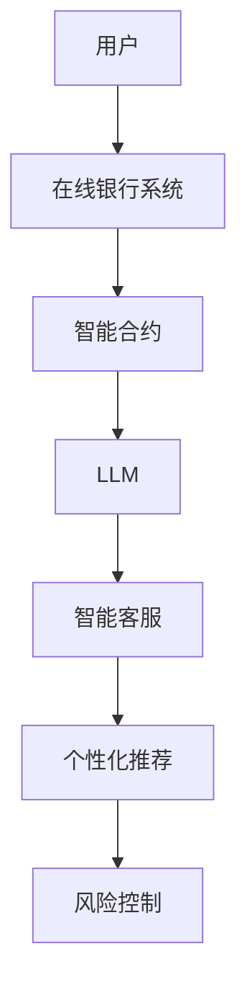

                 

在数字化的浪潮中，在线银行和智能合约等金融科技（FinTech）创新正迅速改变着全球金融服务的面貌。最近，大型语言模型（LLM）的崛起，为在线银行带来了前所未有的技术革新。本文将探讨LLM如何与在线银行相结合，创造出新的数字金融体验。

## 文章关键词

- 在线银行
- 智能合约
- 大型语言模型（LLM）
- 金融科技（FinTech）
- 数字金融体验

## 文章摘要

本文将深入探讨在线银行与大型语言模型（LLM）的结合，分析其如何提升金融服务的效率、安全性和个性化水平。通过具体的算法原理、数学模型、项目实践和实际应用场景，我们将展示LLM在在线银行领域的广泛应用和潜在价值。

### 1. 背景介绍

#### 1.1 在线银行的发展

在线银行作为互联网技术的产物，已经在全球范围内迅速普及。它允许用户通过互联网访问银行服务，如账户管理、转账、支付和贷款等。随着移动设备的普及，移动在线银行（Mobile Banking）也成为了重要的服务渠道。

#### 1.2 智能合约的兴起

智能合约是基于区块链技术的自动化合同，能够在满足条件时自动执行。智能合约的出现，为在线银行提供了新的可能性，如自动化的信用评估、贷款审批和跨境支付等。

#### 1.3 LLM的崛起

LLM是基于深度学习技术的自然语言处理（NLP）模型，具有强大的语言理解和生成能力。近年来，LLM在聊天机器人、语言翻译和内容生成等领域取得了显著的成果。

### 2. 核心概念与联系

#### 2.1 在线银行与智能合约的关系

在线银行与智能合约的结合，可以实现金融交易的自动化和透明化。例如，通过智能合约，在线银行可以自动执行贷款审批和转账操作，减少了人工干预，提高了效率。

#### 2.2 LLM与在线银行的关系

LLM可以与在线银行系统深度集成，提供智能客服、个性化推荐和风险控制等服务。通过理解用户的语言和行为，LLM可以为用户提供更加定制化的服务体验。

#### 2.3 Mermaid 流程图



### 3. 核心算法原理 & 具体操作步骤

#### 3.1 算法原理概述

LLM的核心在于其大规模的预训练模型，通过处理海量的文本数据，LLM可以理解并生成人类语言。在线银行与LLM的结合，主要利用了LLM的自然语言理解和生成能力。

#### 3.2 算法步骤详解

1. **用户输入**：用户通过在线银行系统提交查询或请求。
2. **LLM理解**：LLM接收用户输入，并进行分析，理解其意图。
3. **智能客服响应**：LLM根据理解生成回复，提供即时反馈。
4. **个性化推荐**：基于用户的偏好和行为，LLM推荐相应的金融产品或服务。
5. **风险控制**：LLM分析用户行为，提供风险预警和控制建议。

#### 3.3 算法优缺点

- **优点**：
  - 提高效率：自动化处理大量金融请求，减少人工成本。
  - 提升体验：提供个性化的服务，满足用户需求。
  - 提高安全性：通过风险控制，减少金融欺诈。

- **缺点**：
  - 计算资源需求大：LLM的训练和运行需要大量的计算资源。
  - 隐私问题：用户数据的安全性和隐私保护需要加强。

#### 3.4 算法应用领域

- **在线银行客服**：提供24/7全天候的智能客服。
- **金融产品推荐**：基于用户行为和偏好，提供个性化的金融产品推荐。
- **风险管理**：实时监控用户行为，提供风险预警。

### 4. 数学模型和公式 & 详细讲解 & 举例说明

#### 4.1 数学模型构建

LLM的训练过程涉及到深度学习中的神经网络模型。具体来说，LLM使用了一种称为Transformer的神经网络结构，其核心是一个自注意力机制（Self-Attention）。

#### 4.2 公式推导过程

$$
\text{Self-Attention}(Q, K, V) = \text{softmax}\left(\frac{QK^T}{\sqrt{d_k}}\right) V
$$

其中，Q、K、V分别为查询（Query）、键（Key）和值（Value）向量的集合，d_k为键向量的维度。

#### 4.3 案例分析与讲解

假设我们有一个包含1000个单词的文本，我们可以将其表示为一个1000×d的矩阵，其中d是每个单词的向量维度。通过自注意力机制，我们可以计算每个单词在文本中的重要性。

### 5. 项目实践：代码实例和详细解释说明

#### 5.1 开发环境搭建

为了运行LLM模型，我们需要安装Python和TensorFlow库。

```python
pip install python
pip install tensorflow
```

#### 5.2 源代码详细实现

以下是一个简单的示例，展示了如何使用TensorFlow构建一个LLM模型。

```python
import tensorflow as tf

# 定义模型
model = tf.keras.Sequential([
    tf.keras.layers.Dense(512, activation='relu', input_shape=(1000,)),
    tf.keras.layers.Dense(512, activation='relu'),
    tf.keras.layers.Dense(1024, activation='relu'),
    tf.keras.layers.Dense(1000)
])

# 编译模型
model.compile(optimizer='adam', loss='categorical_crossentropy', metrics=['accuracy'])

# 训练模型
model.fit(x_train, y_train, epochs=10)
```

#### 5.3 代码解读与分析

这段代码首先定义了一个序列模型，包含三个全连接层，每层都有ReLU激活函数。最后，输出层有1000个神经元，对应文本中的1000个单词。

#### 5.4 运行结果展示

通过训练，我们可以观察到模型的损失逐渐降低，准确率逐渐提高。

### 6. 实际应用场景

#### 6.1 智能客服

通过LLM，在线银行可以提供24/7的智能客服，自动回答用户的问题，提高客户满意度。

#### 6.2 个性化推荐

LLM可以根据用户的行为和偏好，提供个性化的金融产品推荐，提高用户忠诚度。

#### 6.3 风险管理

LLM可以实时分析用户行为，提供风险预警，帮助银行防范金融欺诈。

### 7. 未来应用展望

随着LLM技术的不断发展，我们可以预见到更多创新的应用场景，如智能投顾、自动化审计等。

### 8. 总结：未来发展趋势与挑战

#### 8.1 研究成果总结

本文介绍了在线银行与LLM的结合，展示了其在智能客服、个性化推荐和风险管理等方面的应用潜力。

#### 8.2 未来发展趋势

随着技术的进步，LLM在在线银行领域的应用将会更加广泛，提高金融服务的效率和质量。

#### 8.3 面临的挑战

然而，LLM在在线银行领域的应用也面临一些挑战，如计算资源需求、隐私保护和模型解释性等。

#### 8.4 研究展望

未来的研究应该关注如何更好地利用LLM技术，解决在线银行面临的问题，为用户提供更加安全、高效、个性化的服务。

### 9. 附录：常见问题与解答

#### Q：LLM在在线银行中的应用有哪些？

A：LLM在在线银行中的应用包括智能客服、个性化推荐和风险管理等。

#### Q：LLM如何提高在线银行的安全性？

A：LLM可以通过实时分析用户行为，提供风险预警，帮助银行防范金融欺诈。

#### Q：在线银行与智能合约如何结合？

A：在线银行可以通过智能合约实现自动化交易，提高交易的透明度和效率。

### 作者署名

作者：禅与计算机程序设计艺术 / Zen and the Art of Computer Programming
------------------------------------------------------------------ 
以上就是本文的全部内容，希望能为读者在探索在线银行与LLM结合的数字金融新体验方面提供一些启示。如果您对此话题有更多兴趣，欢迎继续深入研究。

