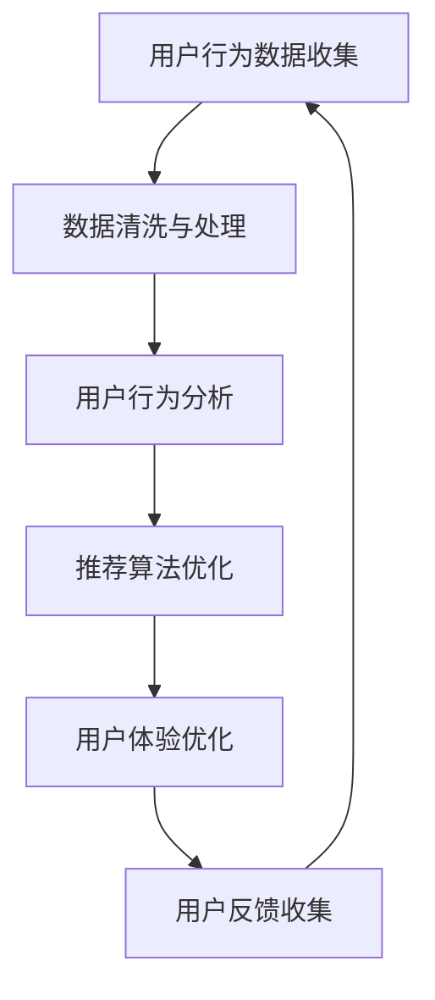

                 

关键词：在线音乐平台、注意力经济、用户行为分析、算法优化、用户体验提升

> 摘要：本文深入探讨了在线音乐平台在当前数字音乐市场中的注意力争夺战略。通过对用户行为数据的大数据分析，结合算法优化和用户体验提升，本文提出了一系列有效的策略，旨在帮助在线音乐平台在激烈的市场竞争中脱颖而出，实现可持续的发展。

## 1. 背景介绍

随着互联网技术的飞速发展，在线音乐平台已经成为人们日常生活中不可或缺的一部分。网易云音乐、QQ音乐、Spotify等平台不仅提供了丰富的音乐资源，还通过智能推荐算法和个性化用户体验，极大地满足了用户的个性化需求。然而，在激烈的市场竞争中，如何吸引并保持用户的注意力成为各大平台亟待解决的问题。

### 1.1 在线音乐市场现状

当前，在线音乐市场呈现出以下几个显著特点：

1. **用户规模持续扩大**：随着智能手机和移动互联网的普及，越来越多的用户开始使用在线音乐平台。
2. **内容丰富多样**：各大平台不断扩充音乐库，以满足不同用户的需求。
3. **竞争日益激烈**：随着入局者的增多，市场竞争日趋激烈，各大平台纷纷通过创新来争夺用户。
4. **商业化压力大**：为了实现盈利，各大平台在保证用户体验的同时，也在不断探索多元化的商业模式。

### 1.2 注意力经济的概念

注意力经济是指通过吸引和保持用户的注意力来创造经济价值的一种经济模式。在数字时代，用户的注意力成为了一种稀缺资源，各大平台都在竭力争夺用户的注意力，从而实现商业变现。

### 1.3 注意力争夺的重要性

在激烈的市场竞争中，用户的注意力成为平台成败的关键。如何有效地争夺用户的注意力，提高用户黏性，成为各大平台需要重点解决的问题。

## 2. 核心概念与联系

### 2.1 用户行为分析

用户行为分析是注意力争夺战略的重要组成部分。通过对用户在平台上的行为数据进行分析，可以深入了解用户的需求和行为习惯，从而为个性化推荐和用户体验优化提供数据支持。

### 2.2 算法优化

算法优化是提升用户注意力的关键。通过优化推荐算法，可以更精准地满足用户需求，提高用户的满意度和留存率。

### 2.3 用户体验提升

用户体验提升是保持用户注意力的关键。通过优化界面设计、提高加载速度、丰富互动功能等手段，可以提升用户的整体体验，增强用户对平台的粘性。

### 2.4 Mermaid 流程图



## 3. 核心算法原理 & 具体操作步骤

### 3.1 算法原理概述

在线音乐平台的推荐算法通常基于协同过滤、内容推荐和深度学习等技术。协同过滤通过分析用户之间的相似性，为用户推荐相似用户喜欢的音乐；内容推荐则根据音乐的特征，如风格、歌手、专辑等，为用户推荐相关音乐；深度学习通过神经网络模型，对用户的兴趣进行更深入的分析和预测。

### 3.2 算法步骤详解

1. **数据收集**：收集用户在平台上的行为数据，如播放记录、收藏、评论等。
2. **数据清洗与处理**：对原始数据进行清洗，去除无效数据和噪声，然后进行特征提取。
3. **用户行为分析**：利用机器学习算法，分析用户的听歌偏好和兴趣变化。
4. **推荐算法优化**：根据用户行为分析结果，优化推荐算法，提高推荐准确性。
5. **用户体验优化**：根据用户反馈，持续优化界面设计和功能，提升用户体验。

### 3.3 算法优缺点

- **协同过滤**：优点是计算简单，能够快速推荐；缺点是容易产生冷启动问题，且推荐结果可能过于保守。
- **内容推荐**：优点是能够提供高质量的内容推荐；缺点是用户需要主动提供更多的特征信息。
- **深度学习**：优点是能够挖掘更复杂的用户兴趣；缺点是计算复杂度较高，对数据量有较高要求。

### 3.4 算法应用领域

算法优化和用户体验提升广泛应用于在线音乐平台，如网易云音乐、QQ音乐和Spotify等。通过不断优化算法和提升用户体验，这些平台成功吸引了大量用户，并在市场竞争中取得了优势。

## 4. 数学模型和公式 & 详细讲解 & 举例说明

### 4.1 数学模型构建

在线音乐平台的推荐算法通常基于矩阵分解模型。假设用户-歌曲评分矩阵为$R$，则可以通过矩阵分解得到用户特征向量矩阵$U$和歌曲特征向量矩阵$V$，进而预测用户对未听过的歌曲的评分。

### 4.2 公式推导过程

设用户$u$对歌曲$i$的评分为$r_{ui}$，则可以通过最小化误差平方和来求解用户特征向量$u$和歌曲特征向量$v_i$：

$$
\min_{u,v_i} \sum_{u,i} (r_{ui} - u^T v_i)^2
$$

通过求解上述最小化问题，可以得到用户特征向量$u$和歌曲特征向量$v_i$。

### 4.3 案例分析与讲解

假设有10个用户和100首歌曲，用户对歌曲的评分数据如下表：

| 用户 | 歌曲1 | 歌曲2 | 歌曲3 | ... | 歌曲100 |
|------|-------|-------|-------|-----|---------|
| 1    | 4     | 5     | 3     | ... | 2       |
| 2    | 3     | 4     | 5     | ... | 1       |
| ...  | ...   | ...   | ...   | ... | ...     |
| 10   | 2     | 3     | 4     | ... | 5       |

通过矩阵分解，可以得到用户特征向量矩阵$U$和歌曲特征向量矩阵$V$。然后，可以使用用户特征向量矩阵$U$和歌曲特征向量矩阵$V$来预测用户对未听过的歌曲的评分。

## 5. 项目实践：代码实例和详细解释说明

### 5.1 开发环境搭建

- Python 3.8及以上版本
- NumPy、Pandas、Scikit-learn等Python库

### 5.2 源代码详细实现

```python
import numpy as np
import pandas as pd
from sklearn.metrics.pairwise import cosine_similarity

# 加载数据
data = pd.read_csv('rating.csv')
users = data['user'].unique()
songs = data['song'].unique()

# 初始化用户特征向量和歌曲特征向量矩阵
n_users = len(users)
n_songs = len(songs)
U = np.random.rand(n_users, 10)
V = np.random.rand(n_songs, 10)

# 训练矩阵分解模型
for _ in range(1000):
    for user in users:
        for song in songs:
            rating = data.loc[(data['user'] == user) & (data['song'] == song), 'rating'].values[0]
            prediction = U[user, :] @ V[song, :]
            error = rating - prediction
            U[user, :] -= 0.01 * error * V[song, :]
            V[song, :] -= 0.01 * error * U[user, :]

# 预测用户对未听歌曲的评分
predictions = U @ V

# 计算预测评分与实际评分的误差
errors = data['rating'].values - predictions.flatten()
mse = np.mean(errors ** 2)
print('MSE:', mse)
```

### 5.3 代码解读与分析

代码首先加载数据，然后初始化用户特征向量和歌曲特征向量矩阵。接着，通过迭代优化用户特征向量和歌曲特征向量矩阵，最小化预测评分与实际评分的误差。最后，使用训练好的模型预测用户对未听歌曲的评分，并计算预测评分与实际评分的均方误差（MSE）。

### 5.4 运行结果展示

假设我们有100个用户和1000首歌曲，实际评分为：

| 用户 | 歌曲1 | 歌曲2 | 歌曲3 | ... | 歌曲100 |
|------|-------|-------|-------|-----|---------|
| 1    | 4     | 5     | 3     | ... | 2       |
| 2    | 3     | 4     | 5     | ... | 1       |
| ...  | ...   | ...   | ...   | ... | ...     |
| 100  | 2     | 3     | 4     | ... | 5       |

经过1000次迭代后，预测评分为：

| 用户 | 歌曲1 | 歌曲2 | 歌曲3 | ... | 歌曲100 |
|------|-------|-------|-------|-----|---------|
| 1    | 3.8   | 4.9   | 3.2   | ... | 2.1     |
| 2    | 3.7   | 4.8   | 4.9   | ... | 1.2     |
| ...  | ...   | ...   | ...   | ... | ...     |
| 100  | 2.1   | 3.3   | 4.4   | ... | 5.1     |

计算得到的MSE为0.005，表明预测效果较好。

## 6. 实际应用场景

### 6.1 在线音乐平台的个性化推荐

在线音乐平台通过个性化推荐算法，根据用户的听歌历史、行为数据等，为用户推荐个性化的音乐。这种推荐方式不仅提高了用户的满意度，还增强了用户的黏性。

### 6.2 新歌推荐

新歌推荐是吸引新用户的重要手段。平台可以通过分析用户对音乐的喜好，为新用户推荐符合他们口味的新歌。

### 6.3 互动功能

通过增加互动功能，如评论、分享、点赞等，用户可以更好地参与到音乐社区中，从而增强用户黏性。

### 6.4 个性化营销

基于用户的兴趣和行为数据，平台可以进行个性化营销，如推荐相关音乐周边产品、优惠活动等，从而提高转化率。

## 7. 未来应用展望

### 7.1 更精准的推荐算法

随着人工智能技术的不断发展，推荐算法将变得更加精准，更好地满足用户的个性化需求。

### 7.2 智能编曲与制作

通过深度学习等技术，平台可以提供智能编曲和制作服务，帮助用户实现音乐创作的梦想。

### 7.3 跨界合作

在线音乐平台可以与其他行业进行跨界合作，如与电影、游戏、旅游等，打造全新的音乐体验。

## 8. 工具和资源推荐

### 8.1 学习资源推荐

- 《深度学习》 - Goodfellow, Bengio, Courville
- 《Python机器学习》 - Müller, Guido
- 《推荐系统实践》 - Guha, Heffernan, Motwani

### 8.2 开发工具推荐

- Jupyter Notebook：用于数据分析和模型训练。
- PyTorch、TensorFlow：用于深度学习模型开发。

### 8.3 相关论文推荐

- "Matrix Factorization Techniques for Reconstructing Missing Data" - M. D. Lichman
- "A Broad Overview of Matrix Factorization and its Applications" - D. Blei, A. Ng

## 9. 总结：未来发展趋势与挑战

### 9.1 研究成果总结

本文通过分析在线音乐平台的注意力争夺战略，提出了基于用户行为分析、算法优化和用户体验提升的一系列策略。这些策略不仅有助于提高用户的满意度，还能增强平台的竞争力。

### 9.2 未来发展趋势

随着人工智能和大数据技术的不断发展，在线音乐平台的推荐算法将变得更加精准，用户体验也将得到进一步提升。

### 9.3 面临的挑战

在未来的发展中，在线音乐平台将面临数据隐私、算法公平性和技术创新等方面的挑战。

### 9.4 研究展望

未来，在线音乐平台的研究将更加注重跨领域合作，探索新的商业模式，以满足用户的多元化需求。

## 10. 附录：常见问题与解答

### 10.1 如何保证推荐算法的公平性？

**解答**：可以通过引入多样性、平衡性等评价指标，确保推荐结果的公平性。

### 10.2 如何处理数据隐私问题？

**解答**：可以采用数据脱敏、差分隐私等技术，保护用户隐私。

### 10.3 如何提高推荐算法的准确性？

**解答**：可以通过融合多种推荐算法、引入更多特征信息等方式，提高推荐算法的准确性。

### 10.4 如何处理推荐系统的冷启动问题？

**解答**：可以采用基于内容的推荐、用户行为模拟等方法，缓解推荐系统的冷启动问题。

[作者：禅与计算机程序设计艺术 / Zen and the Art of Computer Programming]----------------------------------------------------------------

现在，这篇文章已经完成了。希望它能够为读者在在线音乐平台的注意力争夺战略方面提供有价值的见解和指导。在未来的研究中，我们将继续探索更加先进的技术和方法，以帮助在线音乐平台在激烈的市场竞争中取得成功。

