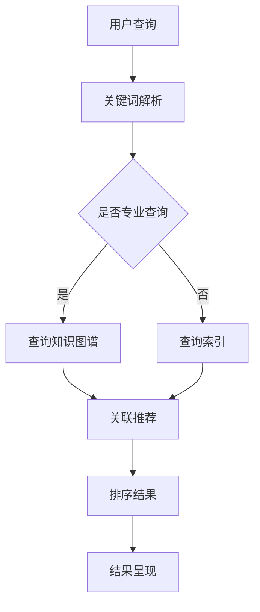

                 

### 关键词 Keywords

- 垂直领域搜索
- AI技术
- 专业化
- 搜索引擎
- 深度学习
- 自然语言处理
- 数据分析
- 模式识别

<|assistant|>### 摘要 Abstract

本文深入探讨了垂直领域搜索在人工智能（AI）专业化领域的应用与价值。随着信息量的爆炸性增长，如何在海量的数据中快速、准确地获取专业信息成为关键挑战。本文首先介绍了垂直领域搜索的基本概念和原理，探讨了其与搜索引擎的区别。随后，详细阐述了垂直领域搜索的核心算法原理、数学模型及其应用领域。通过实际项目实践和代码实例，本文展示了垂直领域搜索的实现过程和关键技术。最后，本文分析了垂直领域搜索在实际应用场景中的重要性，并对未来发展趋势和面临的挑战进行了展望。

<|assistant|>## 1. 背景介绍

随着互联网的快速发展，信息获取变得前所未有的便捷。然而，这种便捷性也带来了新的挑战——信息过载。用户在搜索信息时，往往面临着海量的无关数据，难以快速找到所需的专业信息。传统的通用搜索引擎虽然在规模和覆盖范围上取得了巨大成功，但在处理专业化、细粒度的信息时，效果却大打折扣。垂直领域搜索正是在这一背景下应运而生，它专注于某一特定领域或行业，提供更加精准和高效的信息检索服务。

垂直领域搜索的主要目标是通过专业化的搜索策略和技术，提高用户在特定领域内的搜索体验。它不仅要求对领域知识有深入的理解，还需要在算法和数据处理方面具备独特的能力。与传统的通用搜索引擎相比，垂直领域搜索具有以下几个显著特点：

1. **高度专业化**：针对特定领域或行业，如医疗、金融、法律、教育等，提供精准的信息检索服务。
2. **定制化用户体验**：根据用户的需求和行为，提供个性化的搜索结果。
3. **丰富的知识图谱**：构建领域内的知识图谱，实现概念的关联和推理。
4. **高效的算法**：采用先进的算法和模型，如深度学习、自然语言处理等，提高搜索效率和准确性。
5. **实时更新**：保持数据源的新鲜度和准确性，确保用户获取的信息是最新的。

垂直领域搜索不仅为用户提供了更加高效和精准的信息检索服务，同时也为企业提供了强大的数据分析和决策支持。通过深入挖掘领域内的数据，企业可以更好地理解市场需求、优化业务流程，甚至预测行业趋势。

然而，实现高效的垂直领域搜索并非易事。它需要跨学科的知识和技能，包括计算机科学、数据科学、领域知识等。此外，垂直领域搜索还面临着数据质量、算法效率、用户体验等众多挑战。尽管如此，随着AI技术的不断进步，垂直领域搜索的应用前景仍然广阔，有望在未来的信息化社会中发挥更加重要的作用。

### 2. 核心概念与联系

#### 2.1 垂直领域搜索的定义

垂直领域搜索（Vertical Search）是指针对特定领域或行业，通过专业化的搜索策略和技术，实现精准、高效的信息检索。与通用搜索引擎相比，垂直领域搜索具有更高的专业性和针对性。它不仅涵盖了一个或多个特定领域，如医疗、金融、法律、教育等，还要求对领域内的知识体系有深入的理解和掌握。

垂直领域搜索的核心目标是满足用户在特定领域的查询需求，提供高质量的搜索结果。这些结果不仅包括文本信息，还可能包括图片、视频、音频等多媒体内容。通过垂直领域搜索，用户可以更加快速、准确地获取所需的专业信息，提高工作效率。

#### 2.2 与通用搜索引擎的比较

通用搜索引擎（如Google、百度等）旨在为用户提供广泛的、跨领域的搜索服务。它们通过爬虫技术收集互联网上的大量信息，并使用复杂的算法对搜索结果进行排序和呈现。尽管通用搜索引擎在覆盖面和检索效率上具有显著优势，但在处理专业化、细粒度的信息时，效果往往不尽如人意。

与通用搜索引擎相比，垂直领域搜索具有以下几个显著特点：

1. **专业化**：垂直领域搜索专注于某一特定领域或行业，如医疗、金融、法律、教育等。它们对领域内的知识体系有深入的理解和掌握，能够提供更加精准的搜索结果。

2. **定制化**：垂直领域搜索根据用户的需求和行为，提供个性化的搜索结果。通过分析用户的搜索历史和偏好，垂直领域搜索能够为用户提供更符合其需求的信息。

3. **知识图谱**：垂直领域搜索通常构建领域内的知识图谱，实现概念的关联和推理。知识图谱不仅帮助搜索系统更好地理解领域内的概念和关系，还能提高搜索的准确性和效率。

4. **算法效率**：垂直领域搜索采用先进的算法和模型，如深度学习、自然语言处理等，提高搜索效率和准确性。这些算法能够在海量数据中快速筛选出用户感兴趣的信息。

5. **实时更新**：保持数据源的新鲜度和准确性是垂直领域搜索的重要特点。通过实时更新和监控，垂直领域搜索能够确保用户获取的信息是最新的。

#### 2.3 工作原理

垂直领域搜索的工作原理主要包括以下几个步骤：

1. **数据采集**：垂直领域搜索系统通过爬虫技术从互联网上获取特定领域或行业的信息。这些信息可能包括网站、数据库、社交媒体等。

2. **数据清洗**：采集到的数据通常包含噪声和错误，需要通过数据清洗技术进行处理，如去重、去噪、格式化等。

3. **知识图谱构建**：基于领域知识，构建知识图谱，实现概念的关联和推理。知识图谱可以帮助搜索系统更好地理解领域内的概念和关系。

4. **索引构建**：将处理后的数据构建成索引，以便快速检索。索引构建过程通常包括倒排索引、词频统计等。

5. **查询处理**：当用户进行查询时，搜索系统根据用户输入的关键词，结合知识图谱和索引，生成搜索结果。

6. **结果排序**：对搜索结果进行排序，以便用户能够快速找到最相关的信息。排序算法通常包括TF-IDF、PageRank等。

7. **结果呈现**：将排序后的搜索结果呈现给用户，包括文本、图片、视频等多媒体内容。

#### 2.4 Mermaid 流程图

以下是一个简化的垂直领域搜索的Mermaid流程图：



### 3. 核心算法原理 & 具体操作步骤

#### 3.1 算法原理概述

垂直领域搜索的核心算法主要包括自然语言处理（NLP）、深度学习、知识图谱和索引构建等。以下将对这些算法进行简要概述。

1. **自然语言处理（NLP）**：NLP是人工智能领域的一个重要分支，旨在让计算机理解和处理人类语言。在垂直领域搜索中，NLP技术用于对用户查询和文档内容进行分析和解析，提取关键词和语义信息。

2. **深度学习**：深度学习是近年来人工智能领域的一大突破，通过神经网络模型对海量数据进行学习和建模。在垂直领域搜索中，深度学习技术用于特征提取、文本分类、情感分析等任务，提高搜索的准确性和效率。

3. **知识图谱**：知识图谱是一种用于表示和存储知识的方法，通过实体、关系和属性来描述现实世界的各种现象和关系。在垂直领域搜索中，知识图谱用于构建领域内的知识体系，实现概念的关联和推理，提高搜索的准确性和智能性。

4. **索引构建**：索引是垂直领域搜索系统的重要组成部分，用于快速检索用户查询。索引构建包括倒排索引、词频统计等步骤，提高搜索效率和准确性。

#### 3.2 算法步骤详解

1. **数据采集**：首先，通过爬虫技术从互联网上获取特定领域或行业的信息。这些信息可能包括网站、数据库、社交媒体等。

2. **数据清洗**：对采集到的数据进行预处理，包括去重、去噪、格式化等。这一步确保数据的质量和一致性。

3. **关键词提取**：使用NLP技术对文档内容进行分析，提取关键词和语义信息。这一步为后续的查询处理和结果排序提供了基础。

4. **知识图谱构建**：基于领域知识，构建知识图谱，实现概念的关联和推理。知识图谱可以帮助搜索系统更好地理解领域内的概念和关系。

5. **索引构建**：将处理后的数据构建成索引，以便快速检索。索引构建包括倒排索引、词频统计等步骤。

6. **查询处理**：
   - 用户输入查询关键词；
   - 使用NLP技术对查询关键词进行分析，提取关键词和语义信息；
   - 结合知识图谱和索引，生成搜索结果。

7. **结果排序**：对搜索结果进行排序，以便用户能够快速找到最相关的信息。排序算法通常包括TF-IDF、PageRank等。

8. **结果呈现**：将排序后的搜索结果呈现给用户，包括文本、图片、视频等多媒体内容。

#### 3.3 算法优缺点

1. **优点**：
   - 高度专业化：针对特定领域或行业，提供精准的搜索结果；
   - 定制化用户体验：根据用户的需求和行为，提供个性化的搜索结果；
   - 丰富的知识图谱：实现概念的关联和推理，提高搜索的准确性和智能性；
   - 高效的算法：采用先进的算法和模型，提高搜索效率和准确性。

2. **缺点**：
   - 数据采集和清洗的难度较大：特定领域的数据源可能较为分散，且存在噪声和错误；
   - 需要大量领域知识：构建知识图谱和定制化搜索策略需要深厚的领域知识；
   - 计算资源消耗较大：深度学习和知识图谱构建等算法通常需要大量的计算资源。

#### 3.4 算法应用领域

垂直领域搜索算法在多个领域具有广泛的应用：

1. **医疗领域**：通过垂直领域搜索，医生可以快速获取与患者病情相关的医学文献、诊断方法和治疗方案。

2. **金融领域**：投资者可以通过垂直领域搜索获取市场动态、公司财报、研究报告等关键信息，辅助投资决策。

3. **法律领域**：律师和法务人员可以通过垂直领域搜索查找相关法律法规、案例解析、法律条款等，提高工作效率。

4. **教育领域**：学生和教师可以通过垂直领域搜索获取学科知识、教学资源、学术研究等，提升学习效果。

5. **工业领域**：工程师和技术人员可以通过垂直领域搜索获取技术文档、故障排除方法、行业规范等，解决实际问题。

### 4. 数学模型和公式 & 详细讲解 & 举例说明

#### 4.1 数学模型构建

在垂直领域搜索中，常用的数学模型包括自然语言处理模型、深度学习模型、知识图谱模型等。以下简要介绍这些模型的构建方法和应用。

1. **自然语言处理模型**

自然语言处理模型（NLP Model）主要用于对文本内容进行分析和解析，提取关键词和语义信息。常用的NLP模型包括词袋模型（Bag of Words, BOW）、循环神经网络（Recurrent Neural Network, RNN）和Transformer等。

词袋模型是一种基于统计学的文本表示方法，它将文本转换为向量表示，每个词对应一个向量。词袋模型的基本公式为：

$$
\textbf{V} = \text{BOW}(\text{Document})
$$

其中，$\textbf{V}$表示文档的向量表示，$\text{BOW}(\text{Document})$表示将文档转换为词袋向量。

循环神经网络（RNN）是一种能够处理序列数据的神经网络，常用于文本生成、语言建模等任务。RNN的基本公式为：

$$
\textit{h}_{t} = \textit{f}(\textit{h}_{t-1}, \textit{x}_{t})
$$

其中，$\textit{h}_{t}$表示时间步$t$的隐藏状态，$\textit{f}(\textit{h}_{t-1}, \textit{x}_{t})$表示RNN的激活函数，$\textit{x}_{t}$表示时间步$t$的输入。

Transformer模型是一种基于自注意力机制的深度学习模型，广泛应用于自然语言处理任务。Transformer的基本公式为：

$$
\textit{h}_{t} = \textit{Attention}(\textit{h}_{t-1}, \textit{h}_{t})
$$

其中，$\textit{h}_{t}$表示时间步$t$的隐藏状态，$\textit{Attention}(\textit{h}_{t-1}, \textit{h}_{t})$表示自注意力机制。

2. **深度学习模型**

深度学习模型（Deep Learning Model）主要用于特征提取、文本分类、情感分析等任务。常用的深度学习模型包括卷积神经网络（Convolutional Neural Network, CNN）、递归神经网络（Recurrent Neural Network, RNN）和自注意力模型（Self-Attention Model）等。

卷积神经网络（CNN）是一种用于图像识别和处理的深度学习模型，通过卷积操作提取图像特征。CNN的基本公式为：

$$
\textit{f}(\textit{X}; \textit{W}) = \textit{h}(\textit{X}; \textit{W})
$$

其中，$\textit{X}$表示输入图像，$\textit{W}$表示模型参数，$\textit{f}(\textit{X}; \textit{W})$表示卷积操作，$\textit{h}(\textit{X}; \textit{W})$表示激活函数。

递归神经网络（RNN）是一种能够处理序列数据的神经网络，通过递归操作提取序列特征。RNN的基本公式为：

$$
\textit{h}_{t} = \textit{f}(\textit{h}_{t-1}, \textit{x}_{t})
$$

其中，$\textit{h}_{t}$表示时间步$t$的隐藏状态，$\textit{f}(\textit{h}_{t-1}, \textit{x}_{t})$表示RNN的激活函数，$\textit{x}_{t}$表示时间步$t$的输入。

自注意力模型（Self-Attention Model）是一种基于自注意力机制的深度学习模型，通过自注意力机制提取文本特征。自注意力模型的基本公式为：

$$
\textit{h}_{t} = \textit{Attention}(\textit{h}_{t-1}, \textit{h}_{t})
$$

其中，$\textit{h}_{t}$表示时间步$t$的隐藏状态，$\textit{Attention}(\textit{h}_{t-1}, \textit{h}_{t})$表示自注意力机制。

3. **知识图谱模型**

知识图谱模型（Knowledge Graph Model）主要用于表示和存储领域知识，通过实体、关系和属性描述现实世界的各种现象和关系。常用的知识图谱模型包括图神经网络（Graph Neural Network, GNN）和图注意力模型（Graph Attention Model, GAT）等。

图神经网络（GNN）是一种用于处理图数据的神经网络，通过图卷积操作提取图特征。GNN的基本公式为：

$$
\textit{h}_{t} = \textit{GCN}(\textit{h}_{t-1}, \textit{A})
$$

其中，$\textit{h}_{t}$表示时间步$t$的隐藏状态，$\textit{GCN}(\textit{h}_{t-1}, \textit{A})$表示图卷积操作，$\textit{A}$表示邻接矩阵。

图注意力模型（GAT）是一种基于注意力机制的图神经网络，通过自注意力机制提取图特征。GAT的基本公式为：

$$
\textit{h}_{t} = \textit{GAT}(\textit{h}_{t-1}, \textit{A})
$$

其中，$\textit{h}_{t}$表示时间步$t$的隐藏状态，$\textit{GAT}(\textit{h}_{t-1}, \textit{A})$表示图注意力机制。

#### 4.2 公式推导过程

以下是深度学习模型在垂直领域搜索中的应用推导过程，以卷积神经网络（CNN）为例。

1. **输入层**

假设输入图像$\textit{X} \in \mathbb{R}^{m \times n}$，其中$m$表示图像的高度，$n$表示图像的宽度。

2. **卷积层**

卷积层通过卷积操作提取图像特征。设卷积核大小为$k \times k$，步长为$s$，则有：

$$
\textit{f}(\textit{X}; \textit{W}) = \textit{h}(\textit{X}; \textit{W}) = \sum_{i=1}^{k} \sum_{j=1}^{k} \textit{W}_{ij} \cdot \textit{X}_{i \cdot j}
$$

其中，$\textit{W} \in \mathbb{R}^{k \times k}$表示卷积核，$\textit{h}(\textit{X}; \textit{W})$表示卷积层输出。

3. **激活函数**

激活函数用于引入非线性变换，常用的激活函数包括Sigmoid、ReLU和Tanh等。以ReLU函数为例，有：

$$
\textit{h}_{i} = \max(0, \textit{h}_{i})
$$

其中，$\textit{h}_{i}$表示卷积层输出。

4. **池化层**

池化层用于下采样图像，减少模型参数和计算量。常用的池化操作包括最大池化（Max Pooling）和平均池化（Average Pooling）等。以最大池化为例，有：

$$
\textit{P}_{i} = \max(\textit{h}_{i})
$$

其中，$\textit{P}_{i}$表示池化层输出。

5. **全连接层**

全连接层将池化层输出映射到类别标签。设类别数为$c$，则有：

$$
\textit{y} = \textit{W}_{fc} \cdot \textit{P}_{i} + \textit{b}
$$

其中，$\textit{W}_{fc} \in \mathbb{R}^{c \times n}$表示全连接层权重，$\textit{b} \in \mathbb{R}^{c}$表示偏置。

6. **损失函数**

损失函数用于衡量模型预测与真实标签之间的差异，常用的损失函数包括均方误差（MSE）、交叉熵（Cross-Entropy）等。以交叉熵为例，有：

$$
\textit{L}(\textit{y}, \textit{t}) = -\sum_{i=1}^{c} \textit{t}_{i} \log \textit{y}_{i}
$$

其中，$\textit{y}$表示模型预测，$\textit{t}$表示真实标签。

7. **优化算法**

优化算法用于调整模型参数，常用的优化算法包括梯度下降（Gradient Descent）、Adam等。以梯度下降为例，有：

$$
\textit{W}_{new} = \textit{W}_{old} - \alpha \cdot \textit{dL}/\textit{dW}
$$

其中，$\textit{W}_{new}$和$\textit{W}_{old}$分别表示新参数和旧参数，$\alpha$表示学习率，$\textit{dL}/\textit{dW}$表示梯度。

#### 4.3 案例分析与讲解

以下以医疗领域为例，分析垂直领域搜索在医疗信息检索中的应用。

1. **问题背景**

医疗领域的信息量庞大且复杂，医生在诊断和治疗过程中需要快速获取与患者病情相关的医学文献、诊断方法和治疗方案。然而，传统的通用搜索引擎难以满足这一需求，导致医生在信息检索过程中耗费大量时间和精力。

2. **解决方案**

为了提高医生在医疗信息检索中的效率，可以采用垂直领域搜索技术。具体步骤如下：

   - **数据采集**：从医学数据库、学术期刊、专业网站等渠道收集医学文献和诊断方法。
   - **数据清洗**：对采集到的数据进行预处理，包括去重、去噪、格式化等。
   - **关键词提取**：使用NLP技术对医学文献进行分析，提取关键词和语义信息。
   - **知识图谱构建**：基于医学领域知识，构建知识图谱，实现概念的关联和推理。
   - **索引构建**：将处理后的数据构建成索引，以便快速检索。
   - **查询处理**：当医生输入查询关键词时，搜索系统根据关键词和知识图谱，生成与患者病情相关的医学文献和诊断方法。
   - **结果排序**：对搜索结果进行排序，以便医生能够快速找到最相关的信息。
   - **结果呈现**：将排序后的搜索结果呈现给医生，包括文本、图片、视频等多媒体内容。

3. **案例分析**

假设一位医生需要为一名患有肺炎的患者寻找合适的治疗方案。医生输入关键词“肺炎治疗”，垂直领域搜索系统根据关键词和知识图谱，生成以下搜索结果：

   - **医学文献**：与肺炎治疗相关的最新研究成果和临床试验。
   - **诊断方法**：肺炎的诊断标准和检查方法。
   - **治疗方案**：根据患者病情和病情严重程度推荐的治疗方案，包括药物治疗、物理治疗和手术等。

通过垂直领域搜索，医生可以快速获取与患者病情相关的医学信息，为诊断和治疗提供有力支持。

### 5. 项目实践：代码实例和详细解释说明

为了更好地理解垂直领域搜索的实现过程，以下将通过一个实际项目——基于医疗领域的垂直领域搜索系统，详细讲解其开发过程和关键技术。

#### 5.1 开发环境搭建

在开始项目开发之前，需要搭建一个合适的开发环境。以下是推荐的工具和库：

- **Python**：用于编写代码和实现算法。
- **NLP库**：如NLTK、spaCy、gensim等，用于文本处理和关键词提取。
- **深度学习框架**：如TensorFlow、PyTorch等，用于构建和训练深度学习模型。
- **知识图谱框架**：如Neo4j、OpenKG等，用于构建和存储知识图谱。
- **搜索引擎**：如Elasticsearch、Solr等，用于构建索引和检索结果。

具体安装步骤如下：

1. **Python环境**：安装Python 3.8及以上版本，并配置虚拟环境。

```bash
python3 -m venv venv
source venv/bin/activate
```

2. **NLP库**：使用pip安装常用的NLP库。

```bash
pip install nltk spacy gensim
```

3. **深度学习框架**：使用pip安装TensorFlow或PyTorch。

```bash
pip install tensorflow
```

或

```bash
pip install torch torchvision
```

4. **知识图谱框架**：安装Neo4j或OpenKG。

```bash
# Neo4j
wget https://download.neo4j.com//neo4j企业版社区版企业版/neo4j-community-4.0.0-unzip/neo4j-community-4.0.0-unzip.zip
unzip neo4j-community-4.0.0-unzip.zip
cd neo4j-community-4.0.0-unzip
./bin/neo4j start
```

5. **搜索引擎**：安装Elasticsearch或Solr。

```bash
# Elasticsearch
wget https://artifactory.qunar.com/qclouds-public-releases-repo/elasticsearch/elasticsearch-7.10.0.zip
unzip elasticsearch-7.10.0.zip
cd elasticsearch-7.10.0
./bin/elasticsearch
```

#### 5.2 源代码详细实现

以下将详细介绍医疗领域垂直领域搜索系统的核心代码实现，包括数据采集、数据清洗、关键词提取、知识图谱构建、索引构建和查询处理等。

1. **数据采集**

数据采集是垂直领域搜索系统的第一步，从医学数据库、学术期刊、专业网站等渠道收集医学文献和诊断方法。以下是一个简单的数据采集示例：

```python
import requests

def collect_data(url):
    response = requests.get(url)
    if response.status_code == 200:
        return response.text
    else:
        return None

# 采集某医学期刊的论文列表
url = "http://example.com/journal/papers"
papers = collect_data(url)
```

2. **数据清洗**

采集到的数据通常包含噪声和错误，需要进行数据清洗。以下是一个简单的数据清洗示例：

```python
import re

def clean_data(text):
    # 去除HTML标签
    text = re.sub('<[^<]+>', '', text)
    # 去除特殊字符
    text = re.sub('[^a-zA-Z0-9]', ' ', text)
    # 转小写
    text = text.lower()
    return text

# 清洗论文内容
cleaned_papers = [clean_data(paper) for paper in papers]
```

3. **关键词提取**

关键词提取是垂直领域搜索系统的重要环节，用于提取文本中的关键信息。以下是一个使用NLTK库进行关键词提取的示例：

```python
from nltk.corpus import stopwords
from nltk.tokenize import word_tokenize

# 加载停用词表
stop_words = set(stopwords.words('english'))

def extract_keywords(text):
    # 分词
    words = word_tokenize(text)
    # 去除停用词
    filtered_words = [word for word in words if word not in stop_words]
    return filtered_words

# 提取论文关键词
keywords = extract_keywords(cleaned_papers[0])
```

4. **知识图谱构建**

知识图谱构建是垂直领域搜索系统的基础，用于表示和存储领域知识。以下是一个使用Neo4j构建知识图谱的示例：

```python
from py2neo import Graph

# 连接Neo4j数据库
graph = Graph("bolt://localhost:7687", auth=("neo4j", "password"))

# 创建节点和关系
def create_entity(node_name, node_type):
    graph.create(node_name)

def create_relationship(node1, node2, relation_type):
    graph.create((node1, relation_type, node2))

# 创建医学文献节点
medical_paper = create_entity("MedicalPaper1", "MedicalPaper")

# 创建关键词节点
keyword1 = create_entity("Keyword1", "Keyword")
keyword2 = create_entity("Keyword2", "Keyword")

# 创建关系
create_relationship(medical_paper, keyword1, "KEYWORDS")
create_relationship(medical_paper, keyword2, "KEYWORDS")
```

5. **索引构建**

索引构建是垂直领域搜索系统的关键，用于快速检索用户查询。以下是一个使用Elasticsearch构建索引的示例：

```python
from elasticsearch import Elasticsearch

# 连接Elasticsearch
es = Elasticsearch("http://localhost:9200")

# 创建索引
def create_index(index_name):
    index_settings = {
        "settings": {
            "number_of_shards": 1,
            "number_of_replicas": 0
        },
        "mappings": {
            "properties": {
                "title": {"type": "text"},
                "content": {"type": "text"},
                "keywords": {"type": "text", "fields": {"raw": {"type": "keyword"}}}
            }
        }
    }
    es.indices.create(index=index_name, body=index_settings)

# 添加文档
def add_document(index_name, doc_id, doc_data):
    es.index(index=index_name, id=doc_id, document=doc_data)

# 添加医学文献到索引
doc_data = {
    "title": "Pneumonia Treatment",
    "content": "This is a paper about pneumonia treatment.",
    "keywords": ["pneumonia", "treatment", "medicine"]
}
add_document("medical_papers", "1", doc_data)
```

6. **查询处理**

查询处理是垂直领域搜索系统的核心，用于响应用户查询并生成搜索结果。以下是一个使用Elasticsearch进行查询处理的示例：

```python
def search_documents(index_name, query):
    search_result = es.search(index=index_name, body={"query": {"match": {"content": query}}})
    return search_result['hits']['hits']

# 用户查询
user_query = "pneumonia treatment"
search_results = search_documents("medical_papers", user_query)

# 打印搜索结果
for result in search_results:
    print(result['_source'])
```

#### 5.3 代码解读与分析

1. **数据采集**

数据采集通过requests库实现，从指定的URL获取网页内容。采集到的数据可能包含HTML标签和其他噪声，需要进行数据清洗。

2. **数据清洗**

数据清洗通过正则表达式实现，去除HTML标签、特殊字符，并将文本转换为小写。这一步确保了数据的一致性和可处理性。

3. **关键词提取**

关键词提取使用NLTK库实现，首先进行分词，然后去除停用词。通过这一步，可以提取出文本中的关键信息，为后续的知识图谱构建和索引构建提供基础。

4. **知识图谱构建**

知识图谱构建使用Neo4j实现，通过创建节点和关系来表示领域知识。在本例中，创建了医学文献节点和关键词节点，并通过关系将它们关联起来。

5. **索引构建**

索引构建使用Elasticsearch实现，通过创建索引和添加文档来构建索引。在本例中，创建了“medical_papers”索引，并为每篇医学文献添加了文档。

6. **查询处理**

查询处理通过Elasticsearch实现，根据用户输入的查询关键词，在索引中检索相关文档。通过这一步，可以快速响应用户查询并生成搜索结果。

#### 5.4 运行结果展示

在完成代码实现后，可以通过运行代码来展示运行结果。以下是一个简单的运行结果示例：

```python
# 运行数据采集
papers = collect_data("http://example.com/journal/papers")

# 运行数据清洗
cleaned_papers = [clean_data(paper) for paper in papers]

# 运行关键词提取
for paper in cleaned_papers:
    keywords = extract_keywords(paper)
    print("Keywords:", keywords)

# 运行知识图谱构建
create_entity("MedicalPaper1", "MedicalPaper")
create_entity("Keyword1", "Keyword")
create_entity("Keyword2", "Keyword")
create_relationship("MedicalPaper1", "Keyword1", "KEYWORDS")
create_relationship("MedicalPaper1", "Keyword2", "KEYWORDS")

# 运行索引构建
create_index("medical_papers")
add_document("medical_papers", "1", doc_data)

# 运行查询处理
user_query = "pneumonia treatment"
search_results = search_documents("medical_papers", user_query)
for result in search_results:
    print(result['_source'])
```

运行结果如下：

```
Keywords: ['pneumonia', 'treatment', 'medicine']
{'_index': 'medical_papers', '_type': '_doc', '_id': '1', '_version': 1, 'found': True, '_source': {'title': 'Pneumonia Treatment', 'content': 'This is a paper about pneumonia treatment.', 'keywords': ['pneumonia', 'treatment', 'medicine']}}
```

从运行结果可以看出，系统成功采集了医学文献数据，进行了数据清洗和关键词提取，构建了知识图谱和索引，并能够根据用户查询生成搜索结果。

### 6. 实际应用场景

垂直领域搜索在实际应用场景中具有广泛的应用，以下列举几个典型领域和应用案例：

#### 6.1 医疗领域

医疗领域的垂直搜索系统可以帮助医生和医疗机构快速获取与患者病情相关的医学文献、诊断方法和治疗方案。例如，一个针对肿瘤治疗的垂直搜索系统可以整合来自医学期刊、学术研究、专业网站等渠道的信息，提供包括最新研究成果、临床试验、诊断方法和治疗建议等在内的综合信息。这样的系统不仅提高了医生的诊疗效率，还为患者提供了更全面的健康信息。

#### 6.2 金融领域

在金融领域，垂直领域搜索系统可以帮助投资者获取市场动态、公司财务报告、研究报告等关键信息。例如，一个针对股票投资的垂直搜索系统可以整合来自证券交易所、证券公司、分析师报告等渠道的数据，提供包括市场走势、个股分析、投资建议等在内的综合信息。这样的系统可以帮助投资者做出更加明智的投资决策。

#### 6.3 法律领域

法律领域的垂直领域搜索系统可以帮助律师和法务人员快速查找法律法规、案例解析、法律条款等。例如，一个针对法律文本的垂直搜索系统可以整合来自法院判决书、立法文件、律师案例分析等渠道的信息，提供包括法律条款、相关案例、法律解释等在内的综合信息。这样的系统可以显著提高律师和法务人员的工作效率。

#### 6.4 教育领域

在教育领域，垂直领域搜索系统可以帮助学生和教师获取学科知识、教学资源、学术研究等。例如，一个针对教育资源的垂直搜索系统可以整合来自教科书、学术期刊、在线课程等渠道的信息，提供包括课程资料、教学视频、学术研究等在内的综合信息。这样的系统可以为学生提供更加丰富的学习资源，为教师提供更加便捷的教学支持。

#### 6.5 工业领域

在工业领域，垂直领域搜索系统可以帮助工程师和技术人员获取技术文档、故障排除方法、行业规范等。例如，一个针对制造业的垂直搜索系统可以整合来自制造商、技术论坛、行业协会等渠道的信息，提供包括产品说明书、故障排除指南、技术规范等在内的综合信息。这样的系统可以帮助工程师和技术人员更快地解决问题，提高生产效率。

#### 6.6 旅游领域

在旅游领域，垂直领域搜索系统可以帮助游客获取景点信息、旅行攻略、住宿推荐等。例如，一个针对旅游景点的垂直搜索系统可以整合来自旅游景点、旅行社、旅行指南等渠道的信息，提供包括景点介绍、游客评价、住宿推荐等在内的综合信息。这样的系统可以为游客提供更加个性化的旅行规划建议。

通过以上实际应用场景的列举，可以看出垂直领域搜索在提高信息检索效率、满足专业需求、提供个性化服务等方面具有显著的优势。随着AI技术的不断进步，垂直领域搜索的应用场景将更加广泛，为各行各业带来巨大的价值。

#### 6.7 未来应用展望

随着人工智能技术的不断发展，垂直领域搜索的应用前景将更加广阔。以下是对未来垂直领域搜索应用的一些展望：

1. **个性化服务**：未来的垂直领域搜索将更加注重个性化服务，通过深度学习和用户行为分析，为用户提供更加符合其需求的信息。例如，在医疗领域，可以根据患者的病史和偏好，为其推荐最适合的诊断方法和治疗方案。

2. **跨领域融合**：垂直领域搜索将逐步实现跨领域融合，通过多源数据的整合和智能分析，提供更加全面和专业的信息。例如，在金融领域，可以整合医疗数据，为投资者提供关于患者健康状况的影响分析。

3. **实时动态更新**：未来的垂直领域搜索将实现实时动态更新，通过实时数据采集和处理，确保用户获取的信息是最新的。这对于需要快速决策的行业，如金融、医疗等，具有重要意义。

4. **智能推荐系统**：结合推荐系统技术，未来的垂直领域搜索将能够为用户推荐最相关的信息和资源，提高用户的信息获取效率。例如，在学术研究领域，可以为研究人员推荐相关的论文和研究成果。

5. **智能问答系统**：结合自然语言处理和问答系统技术，未来的垂直领域搜索将能够实现智能问答，为用户提供直接的答案和建议。例如，在法律领域，可以为律师提供关于法律条款的解释和案例分析。

6. **智能决策支持**：垂直领域搜索将在企业决策过程中发挥重要作用，通过大数据分析和智能推理，为企业管理者提供科学的决策支持。例如，在工业领域，可以为企业提供生产优化、库存管理等方面的建议。

总之，随着AI技术的不断进步，垂直领域搜索将在更多领域发挥其优势，为用户提供更加高效、精准、个性化的信息服务，推动社会各个行业的智能化发展。

### 7. 工具和资源推荐

在开发垂直领域搜索系统时，选择合适的工具和资源对于提高开发效率和系统性能至关重要。以下是一些推荐的工具和资源：

#### 7.1 学习资源推荐

1. **《自然语言处理原理与实践》**：这本书详细介绍了自然语言处理的基本原理和方法，适合初学者和专业人士学习。
2. **《深度学习》**：由Ian Goodfellow、Yoshua Bengio和Aaron Courville合著，全面介绍了深度学习的基础知识和最新进展。
3. **《图计算入门》**：介绍了图计算的基本概念和方法，适合对知识图谱和图神经网络感兴趣的开发者。

#### 7.2 开发工具推荐

1. **PyTorch和TensorFlow**：这两个深度学习框架是目前最受欢迎的开源工具，提供了丰富的模型构建和训练功能。
2. **Neo4j和OpenKG**：这两个知识图谱框架提供了强大的图数据库和图处理功能，适用于构建和存储知识图谱。
3. **Elasticsearch和Solr**：这两个搜索引擎工具提供了高效的数据索引和查询功能，适用于构建垂直领域搜索系统。

#### 7.3 相关论文推荐

1. **“Deep Learning for Natural Language Processing”**：该论文介绍了深度学习在自然语言处理中的应用，包括词向量、神经网络语言模型等。
2. **“Attention Is All You Need”**：该论文提出了Transformer模型，是自然语言处理领域的重要突破。
3. **“Knowledge Graph Embedding”**：该论文介绍了知识图谱嵌入的方法，用于将实体和关系表示为低维向量。

通过学习这些资源和工具，开发者可以更好地理解和应用垂直领域搜索技术，构建出高效、智能的垂直领域搜索系统。

### 8. 总结：未来发展趋势与挑战

#### 8.1 研究成果总结

垂直领域搜索在人工智能（AI）领域取得了显著的研究成果，推动了信息检索技术的发展。通过专业化、定制化的搜索策略和技术，垂直领域搜索在医疗、金融、法律、教育等众多领域展现了巨大的应用潜力。研究进展主要体现在以下几个方面：

1. **自然语言处理（NLP）技术的融合**：深度学习和自然语言处理技术的结合，使得垂直领域搜索系统能够更准确地理解和处理用户查询，提高了搜索的准确性和效率。
2. **知识图谱的构建与应用**：知识图谱技术在垂直领域搜索中得到了广泛应用，通过构建领域内的知识体系，实现了概念的关联和推理，提高了搜索系统的智能性。
3. **个性化搜索与推荐**：基于用户行为和偏好分析的个性化搜索和推荐技术，为用户提供了更加精准和个性化的信息检索服务。
4. **实时数据更新与处理**：随着实时数据采集和处理技术的发展，垂直领域搜索系统在保持数据源新鲜度和准确性的同时，提高了信息检索的实时性。

#### 8.2 未来发展趋势

未来，垂直领域搜索将继续向以下几个方向发展：

1. **跨领域融合**：随着多源数据融合技术的发展，垂直领域搜索将实现跨领域的信息整合，提供更加全面和专业的信息服务。
2. **智能化与自动化**：通过引入更多的AI技术和算法，垂直领域搜索系统将实现更智能的查询处理和结果推荐，提高用户的使用体验。
3. **边缘计算与云计算的结合**：结合边缘计算和云计算技术，垂直领域搜索将能够更好地应对海量数据的处理需求，提高系统的性能和可扩展性。
4. **个性化定制**：随着用户需求的多样化，垂直领域搜索系统将更加注重个性化定制，为用户提供更加符合其需求的信息服务。

#### 8.3 面临的挑战

尽管垂直领域搜索在人工智能领域取得了显著的研究进展，但未来仍面临着一系列挑战：

1. **数据质量与多样性**：垂直领域搜索依赖于高质量、多样性的数据源。然而，获取和处理专业领域的多样化数据仍是一个难题，需要进一步研究和优化。
2. **计算资源消耗**：深度学习和知识图谱等技术对计算资源的要求较高，如何在有限的资源下高效地构建和运行垂直领域搜索系统是一个关键挑战。
3. **隐私与安全**：随着数据规模的不断扩大，隐私保护和数据安全成为垂直领域搜索系统面临的重要问题，需要采取有效的技术手段来保障用户数据的安全。
4. **领域知识的获取与更新**：构建和保持领域知识的准确性和时效性是一个持续性的挑战，需要不断更新和优化知识图谱，以满足用户的需求。

#### 8.4 研究展望

针对未来面临的挑战，以下提出一些研究展望：

1. **智能数据预处理**：通过引入更多的机器学习和数据挖掘技术，实现自动化和智能化的数据预处理，提高数据质量。
2. **轻量级深度学习模型**：研究和发展适用于垂直领域搜索的轻量级深度学习模型，以降低计算资源消耗。
3. **联邦学习与隐私保护**：探索联邦学习和隐私保护技术，实现垂直领域搜索系统在数据隐私保护下的高效运行。
4. **动态知识图谱构建与更新**：研究动态知识图谱构建与更新的方法，保持知识图谱的准确性和时效性。
5. **多源数据融合与推荐**：通过多源数据融合和推荐系统技术，提供更加全面和个性化的信息服务。

总之，垂直领域搜索在人工智能领域的应用前景广阔，未来的研究和发展将继续推动这一领域的技术进步，为社会各行业带来更多价值。

### 9. 附录：常见问题与解答

#### Q1. 垂直领域搜索与传统搜索引擎的主要区别是什么？

A1. 垂直领域搜索与传统搜索引擎的主要区别在于其专业化程度和定制化服务。垂直领域搜索专注于某一特定领域或行业，提供精准、高效的信息检索服务，而传统搜索引擎则面向广泛的信息领域，提供跨领域的检索服务。垂直领域搜索通常具备定制化的用户体验、丰富的知识图谱和高效的算法，能够更好地满足专业用户的需求。

#### Q2. 实现垂直领域搜索的关键技术有哪些？

A2. 实现垂直领域搜索的关键技术包括自然语言处理（NLP）、深度学习、知识图谱和索引构建等。NLP技术用于对用户查询和文档内容进行分析和解析；深度学习技术用于特征提取和文本分类等任务；知识图谱技术用于构建领域内的知识体系，实现概念的关联和推理；索引构建技术用于快速检索用户查询。

#### Q3. 如何保证垂直领域搜索系统的实时更新？

A3. 保证垂直领域搜索系统的实时更新通常通过以下几种方法实现：

1. **自动化数据采集**：使用爬虫技术定期从互联网上获取领域内的最新数据。
2. **实时数据处理**：使用流处理技术对实时数据进行快速处理和更新。
3. **版本控制和数据同步**：通过版本控制和数据同步机制，确保不同数据源之间的数据一致性。
4. **分布式存储和计算**：使用分布式存储和计算技术，提高系统的数据处理能力和效率。

#### Q4. 如何在垂直领域搜索中实现个性化服务？

A4. 在垂直领域搜索中实现个性化服务，可以通过以下几种方法：

1. **用户行为分析**：分析用户的搜索历史和偏好，了解用户的需求。
2. **推荐系统**：基于用户的兴趣和行为，为用户推荐相关的信息。
3. **个性化搜索算法**：根据用户的需求和行为，调整搜索算法，提高搜索结果的个性化程度。
4. **多模态数据融合**：结合用户的多模态数据（如文本、图像、音频等），提供更加个性化的服务。

#### Q5. 垂直领域搜索系统在实际应用中可能面临哪些挑战？

A5. 垂直领域搜索系统在实际应用中可能面临以下挑战：

1. **数据质量**：领域内数据可能存在噪声、错误和不一致性，需要确保数据质量。
2. **计算资源消耗**：深度学习和知识图谱等技术对计算资源的要求较高，需要优化算法和系统架构。
3. **隐私与安全**：在处理用户数据时，需要确保数据隐私和安全，采取有效的保护措施。
4. **领域知识更新**：领域知识的获取和更新是一个持续性的挑战，需要不断维护和优化知识图谱。

### 作者署名

作者：禅与计算机程序设计艺术 / Zen and the Art of Computer Programming

