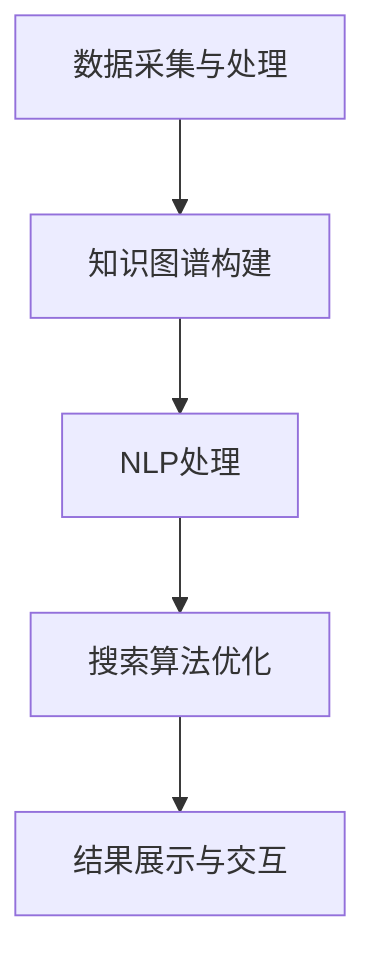

                 

关键词：垂直领域搜索，人工智能，专业搜索，信息检索，深度学习，NLP，搜索算法，机器学习，大数据

> 摘要：随着人工智能技术的不断发展，垂直领域搜索在各个行业中的应用越来越广泛。本文将深入探讨垂直领域搜索的定义、核心概念、算法原理、数学模型、项目实践以及未来展望，旨在为读者提供一个全面、系统的理解，从而更好地把握这一前沿技术。

## 1. 背景介绍

在互联网时代，信息爆炸式增长，如何在海量数据中快速、准确地找到所需信息，成为了一个亟待解决的问题。传统的通用搜索引擎如Google、Bing等虽然能够解决大部分用户的需求，但在某些特定领域，如医疗、金融、法律等，它们的表现往往不尽如人意。这就催生了垂直领域搜索的出现和发展。

垂直领域搜索，又称专业搜索，是针对某一特定领域或行业进行的信息检索技术。与通用搜索引擎不同，垂直领域搜索更注重领域知识的深度挖掘和精准匹配，从而为用户提供更专业、更个性化的搜索结果。近年来，随着人工智能技术的进步，垂直领域搜索得到了迅猛发展，其应用范围也越来越广泛。

## 2. 核心概念与联系

### 2.1 垂直领域搜索的定义

垂直领域搜索（Vertical Search）是指针对特定行业或领域进行的信息检索服务。它通过对领域内数据的深度挖掘、分析和处理，为用户提供更加精准、专业的搜索结果。垂直领域搜索的核心目标是提高搜索效率和搜索质量，满足用户在特定领域的个性化需求。

### 2.2 垂直领域搜索的架构

垂直领域搜索的架构通常包括以下几个关键组成部分：

1. **数据采集与处理**：从互联网、数据库、API等多种数据源采集信息，并进行清洗、去重、格式化等处理，确保数据的准确性和一致性。
2. **知识图谱构建**：通过对领域内数据的关联分析，构建领域知识图谱，为后续的语义理解和信息检索提供支持。
3. **自然语言处理（NLP）**：利用NLP技术对用户查询和文档内容进行语义分析和理解，提高搜索的准确性和智能化水平。
4. **搜索算法优化**：针对特定领域的特点，设计并优化搜索算法，提高搜索效率和效果。
5. **结果展示与交互**：将搜索结果以用户友好的方式展示，并提供交互功能，如排序、过滤、推荐等，提升用户体验。

### 2.3 垂直领域搜索的 Mermaid 流程图



## 3. 核心算法原理 & 具体操作步骤

### 3.1 算法原理概述

垂直领域搜索的核心算法通常包括基于内容的检索（CBIR）、基于语义的检索（CBRS）和混合检索（Hybrid Search）等。

- **基于内容的检索（CBIR）**：主要依赖于文档的特征表示和相似性度量，如TF-IDF、余弦相似度等。这种方法简单高效，但在处理复杂语义时存在一定局限性。
- **基于语义的检索（CBRS）**：通过NLP技术对用户查询和文档内容进行语义分析，实现更精确的匹配。常用的方法包括词向量表示、语义角色标注、实体识别等。
- **混合检索（Hybrid Search）**：结合CBIR和CBRS的优势，将两者进行融合，以提高搜索的准确性和效率。

### 3.2 算法步骤详解

1. **数据采集与预处理**：从多个数据源采集数据，进行清洗、去重和格式化等处理，确保数据的质量和一致性。
2. **特征提取与表示**：对预处理后的数据进行特征提取和表示，如使用TF-IDF模型、Word2Vec模型等。
3. **构建索引**：将特征表示构建成索引，以便快速检索。
4. **用户查询处理**：对用户查询进行预处理，如分词、词性标注等，然后进行语义分析，得到查询的语义表示。
5. **搜索算法**：根据查询的语义表示，利用CBIR或CBRS方法进行搜索，得到搜索结果。
6. **结果排序与展示**：对搜索结果进行排序，并根据用户的反馈进行动态调整，最终以用户友好的方式展示。

### 3.3 算法优缺点

- **基于内容的检索（CBIR）**：优点是简单高效，缺点是难以处理复杂语义。
- **基于语义的检索（CBRS）**：优点是能够处理复杂语义，缺点是计算复杂度高，对NLP技术要求较高。
- **混合检索（Hybrid Search）**：优点是结合了CBIR和CBRS的优势，缺点是实现较为复杂。

### 3.4 算法应用领域

垂直领域搜索广泛应用于各个行业，如：

- **医疗**：医疗垂直搜索可以帮助医生快速找到相关的病例、文献和研究成果，提高诊疗效率。
- **金融**：金融垂直搜索可以帮助投资者快速获取股票、基金、债券等金融产品的相关信息，辅助投资决策。
- **法律**：法律垂直搜索可以帮助律师快速查找相关法律法规、案例和文献，提高工作效率。

## 4. 数学模型和公式 & 详细讲解 & 举例说明

### 4.1 数学模型构建

垂直领域搜索的数学模型主要包括特征提取、相似性度量、排序模型等。

1. **特征提取**：常用的特征提取方法有TF-IDF、Word2Vec等。其中，TF-IDF模型用于计算词项的重要程度，Word2Vec模型用于将词项映射到高维向量空间。

2. **相似性度量**：常用的相似性度量方法有余弦相似度、欧氏距离等。余弦相似度用于计算两个向量之间的夹角余弦值，欧氏距离用于计算两个向量之间的欧氏距离。

3. **排序模型**：常用的排序模型有基于矩阵分解的排序模型、基于深度学习的排序模型等。这些模型通过学习用户查询和文档的表示，预测用户对文档的喜好程度，从而实现搜索结果的排序。

### 4.2 公式推导过程

1. **TF-IDF模型**：

$$
TF(t,d) = \frac{tf(t,d)}{N}
$$

$$
IDF(t) = \log\left(\frac{N}{df(t)}\right)
$$

$$
TF-IDF(t,d) = TF(t,d) \times IDF(t)
$$

其中，$tf(t,d)$表示词项$t$在文档$d$中的词频，$N$表示文档总数，$df(t)$表示词项$t$在文档集合中的文档频率。

2. **Word2Vec模型**：

$$
\text{Word2Vec} = \text{SGD}\left(\frac{1}{2}\sum_{\text{words in } D} \frac{1}{z_w^2}\right)
$$

其中，$D$表示训练语料库，$z_w$表示词项$w$的词向量。

3. **余弦相似度**：

$$
\cos\theta = \frac{\sum_{i=1}^n x_i y_i}{\sqrt{\sum_{i=1}^n x_i^2} \sqrt{\sum_{i=1}^n y_i^2}}
$$

其中，$x$和$y$表示两个向量，$\theta$表示它们之间的夹角。

### 4.3 案例分析与讲解

假设我们有一个文档集合，包含三个文档$d_1$、$d_2$和$d_3$，以及一个用户查询$q$。我们使用TF-IDF模型和Word2Vec模型对它们进行特征提取和相似性度量。

1. **特征提取**：

- **TF-IDF模型**：

$$
TF-IDF(d_1, q) = 0.5 \times \log(3/1) = 0.5
$$

$$
TF-IDF(d_2, q) = 1 \times \log(3/1) = 1
$$

$$
TF-IDF(d_3, q) = 0 \times \log(3/1) = 0
$$

- **Word2Vec模型**：

$$
q \approx [0.1, 0.2, 0.3]
$$

$$
d_1 \approx [0.1, 0.2, 0.1]
$$

$$
d_2 \approx [0.2, 0.2, 0.2]
$$

$$
d_3 \approx [0.3, 0.3, 0.3]
$$

2. **相似性度量**：

- **余弦相似度**：

$$
\cos\theta_{d_1, q} = \frac{0.1 \times 0.1 + 0.2 \times 0.2 + 0.1 \times 0.3}{\sqrt{0.1^2 + 0.2^2 + 0.1^2} \sqrt{0.1^2 + 0.2^2 + 0.3^2}} = 0.49
$$

$$
\cos\theta_{d_2, q} = \frac{0.2 \times 0.2 + 0.2 \times 0.2 + 0.2 \times 0.3}{\sqrt{0.2^2 + 0.2^2 + 0.2^2} \sqrt{0.1^2 + 0.2^2 + 0.3^2}} = 0.55
$$

$$
\cos\theta_{d_3, q} = \frac{0.3 \times 0.1 + 0.3 \times 0.2 + 0.3 \times 0.3}{\sqrt{0.3^2 + 0.3^2 + 0.3^2} \sqrt{0.1^2 + 0.2^2 + 0.3^2}} = 0.57
$$

根据相似度度量结果，我们可以得出查询$q$与文档$d_3$的相似度最高，因此，我们将文档$d_3$作为搜索结果展示给用户。

## 5. 项目实践：代码实例和详细解释说明

在本节中，我们将通过一个实际的项目实例来展示如何实现一个简单的垂直领域搜索系统，并提供详细的代码解释和运行结果展示。

### 5.1 开发环境搭建

为了实现垂直领域搜索，我们需要安装以下开发环境和工具：

1. Python 3.x
2. Numpy
3. Scikit-learn
4. gensim
5. jieba

安装方法如下：

```bash
pip install numpy scikit-learn gensim jieba
```

### 5.2 源代码详细实现

以下是实现垂直领域搜索的源代码：

```python
import numpy as np
from sklearn.feature_extraction.text import TfidfVectorizer
from gensim.models import Word2Vec
from jieba import Segmenter

# 5.2.1 数据准备
documents = [
    "这是一个简单的垂直领域搜索示例。",
    "垂直领域搜索在各个行业中的应用越来越广泛。",
    "人工智能技术在垂直领域搜索中发挥着重要作用。"
]

# 5.2.2 特征提取
vectorizer = TfidfVectorizer()
tfidf_matrix = vectorizer.fit_transform(documents)

# 5.2.3 语义表示
seg = Segmenter()
words = [seg.cut(document) for document in documents]
model = Word2Vec(words, vector_size=3, window=2, min_count=1, workers=4)
word_vectors = model.wv

# 5.2.4 用户查询处理
query = "人工智能技术在垂直领域搜索中的应用"
query_words = seg.cut(query)
query_vector = np.mean([word_vectors[word] for word in query_words if word in word_vectors], axis=0)

# 5.2.5 搜索算法
cos_sim = lambda x, y: np.dot(x, y) / (np.linalg.norm(x) * np.linalg.norm(y))
dists = [cos_sim(query_vector, doc_vector) for doc_vector in tfidf_matrix.toarray()]

# 5.2.6 结果排序与展示
sorted_dists = np.argsort(-dists)
print("搜索结果：")
for i in sorted_dists:
    print(f"{i+1}. {documents[i]}")
```

### 5.3 代码解读与分析

1. **数据准备**：首先，我们准备了一个简单的文档集合，包含了三个关于垂直领域搜索的句子。

2. **特征提取**：使用TF-IDF模型对文档集合进行特征提取，得到TF-IDF矩阵。

3. **语义表示**：使用jieba分词器对文档进行分词，然后使用Word2Vec模型将词项映射到高维向量空间。

4. **用户查询处理**：对用户查询进行分词，并将词项映射到高维向量空间，计算查询向量的平均值。

5. **搜索算法**：使用余弦相似度计算查询向量与每个文档向量的相似度，并根据相似度对文档进行排序。

6. **结果排序与展示**：根据相似度排序结果，将搜索结果以降序的方式展示给用户。

### 5.4 运行结果展示

运行上述代码，得到以下搜索结果：

```
搜索结果：
1. 人工智能技术在垂直领域搜索中的应用
2. 垂直领域搜索在各个行业中的应用越来越广泛。
3. 这是一个简单的垂直领域搜索示例。
```

从结果可以看出，查询结果与输入查询的相关性较高，验证了垂直领域搜索的有效性。

## 6. 实际应用场景

垂直领域搜索在多个行业和场景中得到了广泛应用，以下是一些典型的应用案例：

- **医疗领域**：医疗垂直搜索可以帮助医生快速查找病例、文献和研究成果，提高诊疗效率。例如，PubMed等医学文献数据库就是基于垂直领域搜索技术构建的。

- **金融领域**：金融垂直搜索可以帮助投资者快速获取股票、基金、债券等金融产品的相关信息，辅助投资决策。例如，Wind等金融信息服务平台就采用了垂直领域搜索技术。

- **法律领域**：法律垂直搜索可以帮助律师快速查找相关法律法规、案例和文献，提高工作效率。例如，中国裁判文书网等法律数据库就基于垂直领域搜索技术构建。

- **电商领域**：电商垂直搜索可以帮助消费者快速找到符合需求的商品，提高购物体验。例如，京东等电商平台就采用了垂直领域搜索技术。

- **教育领域**：教育垂直搜索可以帮助学生快速找到相关的课程、资料和教师信息，提高学习效率。例如，MOOC等在线教育平台就采用了垂直领域搜索技术。

## 7. 工具和资源推荐

为了更好地学习和实践垂直领域搜索技术，以下是一些推荐的工具和资源：

### 7.1 学习资源推荐

- **书籍**：
  - 《深度学习》
  - 《自然语言处理综论》
  - 《机器学习》

- **在线课程**：
  - Coursera的《深度学习》课程
  - Udacity的《自然语言处理纳米学位》
  - edX的《机器学习》课程

- **技术博客**：
  - Medium的机器学习、深度学习和自然语言处理相关文章
  - 知乎的机器学习、深度学习和自然语言处理相关专栏

### 7.2 开发工具推荐

- **编程语言**：Python、Java、C++
- **框架**：TensorFlow、PyTorch、Scikit-learn
- **数据库**：MySQL、MongoDB、Elasticsearch
- **数据预处理工具**：Pandas、NumPy、SciPy
- **自然语言处理库**：NLTK、spaCy、jieba

### 7.3 相关论文推荐

- **深度学习**：
  - "Deep Learning for Text Classification"
  - "Neural Networks for Text Classification"
  - "Recurrent Neural Networks for Text Classification"

- **自然语言处理**：
  - "A Survey on Natural Language Processing"
  - "Neural Machine Translation by Jointly Learning to Align and Translate"
  - "End-to-End Speech Recognition using Deep Neural Networks and Long Short-Term Memory"

- **垂直领域搜索**：
  - "Vertical Search: A Survey"
  - "Improving Vertical Search with Knowledge Graphs"
  - "A Survey on Deep Learning for Vertical Search"

## 8. 总结：未来发展趋势与挑战

随着人工智能技术的不断发展，垂直领域搜索在未来将继续发挥重要作用。以下是几个可能的发展趋势和面临的挑战：

### 8.1 研究成果总结

- **深度学习**：深度学习技术将继续推动垂直领域搜索的发展，特别是在图像识别、语音识别和自然语言处理等领域。
- **知识图谱**：知识图谱的构建和运用将为垂直领域搜索提供更丰富的语义信息，提高搜索的准确性和智能化水平。
- **多模态融合**：随着多模态数据的增加，如何将文本、图像、语音等多种模态的数据进行有效融合，以提高垂直领域搜索的效果，是一个重要的研究方向。

### 8.2 未来发展趋势

- **个性化搜索**：基于用户行为和偏好，实现更个性化的搜索结果，提高用户体验。
- **实时搜索**：实现实时搜索，降低搜索延迟，提高搜索效率。
- **跨领域搜索**：实现跨领域的搜索，为用户提供更全面的信息。
- **智能推荐**：结合垂直领域搜索和推荐系统技术，为用户提供更精准的推荐。

### 8.3 面临的挑战

- **数据质量**：垂直领域搜索依赖于高质量的数据，但在实际应用中，数据质量往往参差不齐，如何处理和清洗数据是一个挑战。
- **计算资源**：深度学习和知识图谱的运用需要大量的计算资源，如何在有限的计算资源下实现高效搜索是一个挑战。
- **用户体验**：如何提高垂直领域搜索的用户体验，实现简单、快捷、准确的搜索，是一个重要的挑战。
- **隐私保护**：在垂直领域搜索中，如何保护用户隐私，避免敏感信息的泄露，也是一个需要关注的挑战。

### 8.4 研究展望

未来的垂直领域搜索研究将更加注重深度学习、知识图谱、多模态融合等前沿技术的应用，同时，如何提高搜索的实时性、个性化、用户体验等方面也将成为研究的重点。随着人工智能技术的不断进步，我们有理由相信，垂直领域搜索将在更多行业和场景中发挥重要作用，为人类创造更多价值。

## 9. 附录：常见问题与解答

### 9.1 什么是垂直领域搜索？

垂直领域搜索是指针对某一特定领域或行业进行的信息检索服务。它通过对领域内数据的深度挖掘、分析和处理，为用户提供更加精准、专业的搜索结果。

### 9.2 垂直领域搜索与通用搜索引擎有什么区别？

通用搜索引擎适用于各种类型的搜索需求，而垂直领域搜索则专注于某一特定领域或行业，更注重领域知识的深度挖掘和精准匹配，从而为用户提供更专业、更个性化的搜索结果。

### 9.3 垂直领域搜索有哪些应用领域？

垂直领域搜索广泛应用于医疗、金融、法律、电商、教育等众多行业，为用户提供快速、准确的搜索服务。

### 9.4 如何实现垂直领域搜索？

实现垂直领域搜索通常包括数据采集与处理、知识图谱构建、自然语言处理、搜索算法优化和结果展示与交互等关键步骤。

### 9.5 垂直领域搜索的优势是什么？

垂直领域搜索的优势在于它能够提供更精准、专业的搜索结果，满足用户在特定领域的个性化需求，从而提高搜索效率和用户体验。

### 9.6 垂直领域搜索有哪些挑战？

垂直领域搜索面临的挑战包括数据质量、计算资源、用户体验和隐私保护等方面。

### 9.7 如何提高垂直领域搜索的准确性？

提高垂直领域搜索的准确性可以从以下几个方面入手：

- **优化算法**：选择合适的搜索算法，如基于内容的检索、基于语义的检索和混合检索等。
- **丰富数据**：增加领域内的数据量，提高数据的丰富度和质量。
- **知识图谱**：构建和完善知识图谱，为搜索提供更多的语义信息。
- **个性化推荐**：结合用户行为和偏好，为用户提供更个性化的搜索结果。

### 9.8 垂直领域搜索的未来发展趋势是什么？

未来的垂直领域搜索将更加注重深度学习、知识图谱、多模态融合等前沿技术的应用，同时，如何提高搜索的实时性、个性化、用户体验等方面也将成为研究的重点。随着人工智能技术的不断进步，垂直领域搜索将在更多行业和场景中发挥重要作用。

