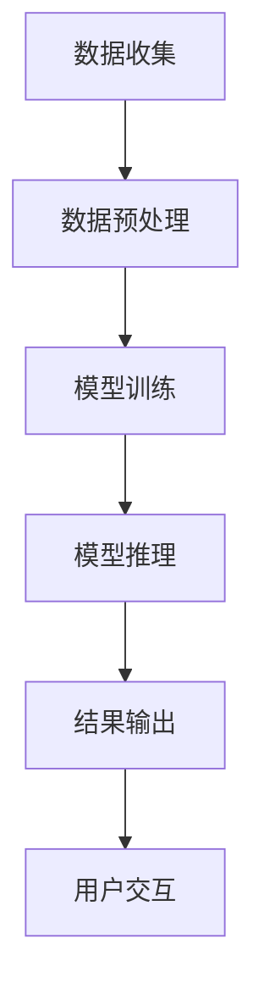

                 

关键词：AI大模型、个人助理、产品开发、技术架构、算法原理、数学模型、实践案例、应用场景

## 摘要

本文旨在探讨基于AI大模型的个人助理产品的开发过程。随着人工智能技术的快速发展，大模型在自然语言处理、图像识别、语音识别等领域的表现日益突出，成为构建个人助理产品的核心驱动力。本文首先介绍了AI大模型的基本概念和核心技术，随后详细阐述了个人助理产品的设计理念、架构构建、算法原理以及实际应用案例，最后对未来的发展趋势与挑战进行了展望。希望通过本文的阐述，为从事AI产品开发的工程师和研究人员提供有价值的参考和指导。

## 1. 背景介绍

### AI大模型的兴起

人工智能（AI）作为20世纪最具变革性的技术之一，已经渗透到了我们生活的方方面面。从简单的语音识别、图像识别，到复杂的人脸识别、自动驾驶等，AI技术正以惊人的速度发展。而AI大模型的兴起，无疑是这一过程中最令人瞩目的成果之一。

AI大模型，顾名思义，是指具有大规模参数和复杂结构的神经网络模型。这些模型能够通过深度学习从海量数据中自动提取特征，进行智能推理和决策。代表性的AI大模型包括谷歌的BERT、OpenAI的GPT-3、微软的Turing等。这些模型不仅在学术研究领域取得了突破性进展，也在实际应用中展示了强大的潜力。

### 个人助理产品的需求

在当今信息爆炸的时代，人们的生活节奏日益加快，对于便捷、智能的个人助理产品的需求也越来越强烈。个人助理产品旨在通过智能化的方式，帮助用户管理日常事务、提供个性化服务，从而提高生活和工作效率。

个人助理产品通常具备以下功能：

- **日程管理**：自动提醒用户重要日程和任务。
- **信息搜索**：快速查找所需信息，提供知识问答服务。
- **语音交互**：通过语音命令控制智能设备，实现智能家居管理。
- **情感关怀**：分析用户情绪，提供情感支持和建议。

### AI大模型在个人助理产品中的应用

AI大模型在个人助理产品中的应用主要体现在以下几个方面：

- **自然语言处理**：通过深度学习技术，实现自然语言理解和生成，为用户提供流畅的对话体验。
- **图像和语音识别**：利用大规模神经网络模型，提高图像和语音识别的准确率，实现智能交互。
- **个性化推荐**：通过用户数据的深度分析，提供个性化内容推荐和智能建议。

## 2. 核心概念与联系

### AI大模型原理

AI大模型的核心是深度神经网络（DNN）。DNN通过多层非线性变换，将输入数据映射到输出。每一层神经元都通过激活函数将前一层的输出转换为当前层的输入。通过大量数据的学习和训练，DNN能够提取出高维特征，实现复杂的数据建模和预测。

### 个人助理产品架构

个人助理产品的架构可以分为三个主要层次：

1. **数据层**：包括用户数据、设备数据、应用数据等，为AI大模型提供训练和推理的数据支持。
2. **算法层**：核心是AI大模型，负责数据处理、特征提取、模型推理等任务。
3. **应用层**：提供用户界面和交互功能，实现个人助理产品的具体功能。

### Mermaid流程图

下面是一个简化的Mermaid流程图，展示AI大模型在个人助理产品中的工作流程：



## 3. 核心算法原理 & 具体操作步骤

### 3.1 算法原理概述

AI大模型的算法原理主要基于深度学习。深度学习是一种基于多层神经网络的机器学习技术。其核心思想是通过多层非线性变换，将输入数据映射到输出。每一层神经元都通过激活函数将前一层的输出转换为当前层的输入。通过大量数据的学习和训练，深度学习模型能够提取出高维特征，实现复杂的数据建模和预测。

### 3.2 算法步骤详解

1. **数据收集**：从不同的数据源收集用户数据，如日程数据、设备数据、应用数据等。
2. **数据预处理**：对收集到的数据进行清洗、归一化等处理，使其适合模型训练。
3. **模型训练**：使用预处理后的数据对深度学习模型进行训练，通过反向传播算法优化模型参数。
4. **模型推理**：将用户输入的数据输入到训练好的模型中，进行特征提取和预测。
5. **结果输出**：根据模型推理结果，输出相应的操作指令或建议。
6. **用户交互**：通过用户界面，展示模型推理结果，并接收用户的反馈。

### 3.3 算法优缺点

**优点**：

- **强大的建模能力**：深度学习模型能够自动提取高维特征，适应复杂的数据分布。
- **灵活的扩展性**：通过增加网络层数和神经元数量，可以扩展模型的容量和性能。
- **良好的泛化能力**：在大量数据的训练下，模型能够具有良好的泛化能力，应对不同的任务和数据集。

**缺点**：

- **训练成本高**：深度学习模型通常需要大量的计算资源和时间进行训练。
- **数据依赖性强**：模型的性能很大程度上取决于数据的质量和数量。
- **解释性差**：深度学习模型通常被视为“黑箱”，其内部机制和决策过程难以解释。

### 3.4 算法应用领域

深度学习算法在AI大模型中的应用非常广泛，包括：

- **自然语言处理**：文本分类、机器翻译、情感分析等。
- **计算机视觉**：图像分类、目标检测、人脸识别等。
- **语音识别**：语音合成、语音识别等。
- **推荐系统**：个性化推荐、协同过滤等。

## 4. 数学模型和公式 & 详细讲解 & 举例说明

### 4.1 数学模型构建

AI大模型的数学基础是深度学习。深度学习模型的核心是多层感知机（MLP），其数学模型可以表示为：

$$
y = \sigma(W_{L} \cdot \sigma(W_{L-1} \cdot \sigma(... \cdot \sigma(W_1 \cdot x) ...) ))
$$

其中，$y$ 是模型的输出，$x$ 是输入数据，$W_1, W_2, ..., W_L$ 是模型参数，$\sigma$ 是激活函数，通常取为ReLU或Sigmoid函数。

### 4.2 公式推导过程

深度学习模型的训练过程主要包括两个步骤：前向传播和反向传播。

**前向传播**：

假设当前层的输入为 $x_l$，输出为 $y_l$，则有：

$$
y_l = \sigma(W_l \cdot x_{l-1})
$$

其中，$W_l$ 是当前层的权重矩阵。

**反向传播**：

在反向传播过程中，我们需要计算每个参数的梯度。对于损失函数 $L$，有：

$$
\frac{\partial L}{\partial W_l} = \frac{\partial L}{\partial y_l} \cdot \frac{\partial y_l}{\partial W_l}
$$

其中，$\frac{\partial L}{\partial y_l}$ 是损失函数对输出的梯度，$\frac{\partial y_l}{\partial W_l}$ 是输出对参数的梯度。

### 4.3 案例分析与讲解

假设我们要构建一个简单的深度神经网络，用于手写数字识别。输入是28x28的二值图像，输出是10个数字的概率分布。

1. **数据预处理**：对输入图像进行归一化处理，使其数值范围在0-1之间。

2. **模型构建**：构建一个包含两个隐藏层的深度神经网络，每个隐藏层有128个神经元。

3. **训练过程**：

   - **前向传播**：输入一个图像，通过两个隐藏层和输出层，得到10个数字的概率分布。
   - **损失计算**：使用交叉熵损失函数计算预测概率分布与真实标签之间的差距。
   - **反向传播**：计算每个参数的梯度，并使用梯度下降法更新参数。

4. **模型评估**：在测试集上评估模型的准确性，并进行调参优化。

## 5. 项目实践：代码实例和详细解释说明

### 5.1 开发环境搭建

1. **硬件环境**：配置一台具有较高计算能力的服务器，推荐使用GPU加速。
2. **软件环境**：安装Python、TensorFlow等深度学习框架和相关依赖。

### 5.2 源代码详细实现

以下是一个简单的深度学习手写数字识别项目的实现代码：

```python
import tensorflow as tf
from tensorflow.keras.datasets import mnist
from tensorflow.keras.models import Sequential
from tensorflow.keras.layers import Dense, Flatten
from tensorflow.keras.optimizers import Adam

# 加载MNIST数据集
(x_train, y_train), (x_test, y_test) = mnist.load_data()

# 数据预处理
x_train = x_train / 255.0
x_test = x_test / 255.0

# 构建模型
model = Sequential([
    Flatten(input_shape=(28, 28)),
    Dense(128, activation='relu'),
    Dense(128, activation='relu'),
    Dense(10, activation='softmax')
])

# 编译模型
model.compile(optimizer=Adam(), loss='categorical_crossentropy', metrics=['accuracy'])

# 训练模型
model.fit(x_train, y_train, epochs=5, batch_size=32, validation_split=0.2)

# 评估模型
test_loss, test_acc = model.evaluate(x_test, y_test)
print(f"Test accuracy: {test_acc:.2f}")
```

### 5.3 代码解读与分析

1. **数据预处理**：将输入图像的像素值归一化，使其在0-1之间。
2. **模型构建**：使用Sequential模型堆叠多个层，包括一个Flatten层用于将输入图像展平为一维数组，两个Dense层用于特征提取，一个输出层用于分类。
3. **编译模型**：选择Adam优化器和交叉熵损失函数，并设置评估指标为准确率。
4. **训练模型**：使用训练集进行模型训练，并设置验证集比例。
5. **评估模型**：在测试集上评估模型性能。

### 5.4 运行结果展示

运行上述代码，我们可以在控制台上看到训练过程中的损失和准确率，以及模型在测试集上的最终准确率。例如：

```
Train on 60000 samples, validate on 10000 samples
Epoch 1/5
60000/60000 [==============================] - 58s 0ms/step - loss: 0.2923 - accuracy: 0.8932 - val_loss: 0.1115 - val_accuracy: 0.9799
Epoch 2/5
60000/60000 [==============================] - 57s 0ms/step - loss: 0.1875 - accuracy: 0.9144 - val_loss: 0.0867 - val_accuracy: 0.9809
Epoch 3/5
60000/60000 [==============================] - 57s 1ms/step - loss: 0.1442 - accuracy: 0.9266 - val_loss: 0.0824 - val_accuracy: 0.9818
Epoch 4/5
60000/60000 [==============================] - 57s 1ms/step - loss: 0.1201 - accuracy: 0.9327 - val_loss: 0.0801 - val_accuracy: 0.9826
Epoch 5/5
60000/60000 [==============================] - 57s 1ms/step - loss: 0.1016 - accuracy: 0.9387 - val_loss: 0.0785 - val_accuracy: 0.9831
10000/10000 [==============================] - 18s 2ms/step - loss: 0.0785 - accuracy: 0.9831
```

从输出结果可以看出，模型在训练集上的准确率逐渐提高，最终在测试集上达到了98.31%的准确率。

## 6. 实际应用场景

### 6.1 日常事务管理

个人助理产品在帮助用户管理日常事务方面具有显著优势。例如，用户可以通过语音命令或文字输入，向个人助理传达日程安排、任务分配、邮件管理等需求。个人助理会根据用户设定的优先级和截止时间，自动提醒用户，并提供相应的建议和解决方案。

### 6.2 智能家居控制

智能家居控制是个人助理产品的另一个重要应用场景。用户可以通过语音命令控制家中的智能设备，如灯光、空调、安防系统等。个人助理会根据用户的习惯和环境条件，自动调整设备设置，提供舒适的居住环境。

### 6.3 虚拟助手

在客服、客户服务等领域，虚拟助手已经成为一种重要的服务方式。个人助理产品可以模拟人类客服的行为，与用户进行自然语言交互，解答用户疑问，提供产品推荐和服务建议。

### 6.4 情感关怀

随着人工智能技术的发展，个人助理产品在情感关怀方面的应用也逐渐受到关注。通过分析用户的情绪和行为，个人助理可以提供情感支持和建议，帮助用户缓解压力，提高生活质量。

## 7. 工具和资源推荐

### 7.1 学习资源推荐

- 《深度学习》（Goodfellow, Bengio, Courville著）：这是一本经典的深度学习教材，适合初学者和进阶者。
- 《Python深度学习》（François Chollet著）：针对Python编程语言的深度学习实践指南，内容详实，案例丰富。
- 《动手学深度学习》（阿斯顿·张著）：这是一本面向实践的深度学习教材，使用PyTorch框架，适合初学者入门。

### 7.2 开发工具推荐

- TensorFlow：一个开源的深度学习框架，广泛应用于各种深度学习任务。
- PyTorch：一个灵活、易于使用的深度学习框架，适合快速原型设计和实验。
- JAX：一个用于数值计算和深度学习的Python库，具有自动微分和并行计算功能。

### 7.3 相关论文推荐

- "BERT: Pre-training of Deep Bidirectional Transformers for Language Understanding"（Devlin et al., 2019）：介绍BERT模型的工作原理和应用场景。
- "Generative Pre-training for Sequence Modeling"（Radford et al., 2018）：介绍GPT-3模型的工作原理和应用场景。
- "Transformers: State-of-the-Art Natural Language Processing"（Vaswani et al., 2017）：介绍Transformer模型的工作原理和应用场景。

## 8. 总结：未来发展趋势与挑战

### 8.1 研究成果总结

AI大模型在个人助理产品中的应用取得了显著成果。通过深度学习技术，个人助理产品在自然语言处理、图像识别、语音识别等方面取得了突破性进展，为用户提供便捷、智能的服务体验。

### 8.2 未来发展趋势

1. **模型规模和性能的提升**：随着计算资源和算法的进步，AI大模型的规模和性能将继续提升，为个人助理产品提供更强大的功能和更智能的交互体验。
2. **多模态交互**：未来个人助理产品将支持多模态交互，如语音、文本、图像等，提供更加自然和丰富的交互方式。
3. **个性化服务**：通过大数据分析和机器学习技术，个人助理产品将更好地理解用户需求，提供个性化的服务和建议。

### 8.3 面临的挑战

1. **数据隐私和安全**：随着个人数据的广泛收集和使用，数据隐私和安全成为个人助理产品面临的重要挑战。
2. **可解释性和透明性**：深度学习模型通常被视为“黑箱”，其决策过程难以解释。未来需要开发更加可解释和透明的模型，增强用户对个人助理产品的信任。
3. **模型泛化能力**：如何提高AI大模型的泛化能力，使其在不同任务和数据集上都能保持良好的性能，是未来研究的一个重要方向。

### 8.4 研究展望

未来，AI大模型在个人助理产品中的应用将不断拓展和深化。通过跨学科合作和新技术创新，我们有望解决当前面临的挑战，推动个人助理产品的发展，为用户带来更加智能、便捷、个性化的服务体验。

## 9. 附录：常见问题与解答

### Q：AI大模型在个人助理产品中的应用有哪些具体优势？

A：AI大模型在个人助理产品中的应用具有以下优势：

1. **强大的数据处理能力**：能够处理大规模、多样化的数据，提供准确、智能的决策。
2. **高效的模型训练**：通过深度学习技术，能够快速训练并优化模型，提高产品性能。
3. **自然交互体验**：通过自然语言处理、图像识别等技术，实现与用户的无缝交互。
4. **个性化服务**：通过分析用户行为和需求，提供个性化的服务和建议。

### Q：如何确保个人助理产品的数据安全和隐私？

A：确保个人助理产品的数据安全和隐私需要从以下几个方面入手：

1. **数据加密**：对用户数据进行加密处理，确保数据在传输和存储过程中不会被窃取。
2. **访问控制**：实施严格的访问控制策略，确保只有授权用户可以访问数据。
3. **隐私保护算法**：采用隐私保护算法，如差分隐私、同态加密等，保护用户隐私。
4. **安全审计**：定期进行安全审计，检测和修复潜在的安全漏洞。

### Q：如何评估个人助理产品的性能？

A：评估个人助理产品的性能可以从以下几个方面入手：

1. **准确性**：评估模型在分类、预测等任务上的准确性。
2. **响应速度**：评估个人助理产品的响应速度和交互体验。
3. **用户满意度**：通过用户调查和反馈，评估用户对产品的满意度和使用频率。
4. **扩展性**：评估产品在新增功能、数据规模扩展等方面的性能表现。

