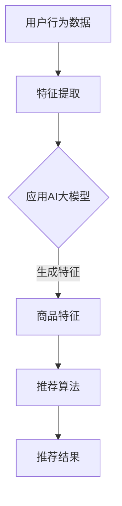

                 

 关键词：AI大模型、智能推荐、产品推荐系统、算法原理、数学模型、项目实践、应用场景、未来展望

> 摘要：本文深入探讨了基于AI大模型的智能产品推荐系统的核心原理、实现方法、数学模型以及实际应用。文章首先介绍了推荐系统的背景和重要性，随后详细解析了AI大模型在推荐系统中的应用，包括核心算法原理、数学模型的构建与推导，最后通过一个实际项目案例展示了系统的搭建和运行过程。

## 1. 背景介绍

随着互联网和电子商务的快速发展，个性化推荐系统已成为现代信息技术中不可或缺的一部分。推荐系统通过分析用户行为数据，为用户推荐其可能感兴趣的商品或服务，从而提升用户体验、增加用户粘性和平台收益。传统推荐系统多基于协同过滤、基于内容的推荐等技术，但这些方法往往存在冷启动问题、推荐效果不稳定等不足。

近年来，人工智能，尤其是深度学习技术的快速发展，为推荐系统带来了新的突破。AI大模型，如BERT、GPT等，以其强大的建模能力和对复杂数据的捕捉能力，为推荐系统的发展提供了新的动力。AI大模型能够自动从大量数据中学习特征，实现更精准、更个性化的推荐。

## 2. 核心概念与联系

为了更好地理解基于AI大模型的智能产品推荐系统，我们首先需要了解几个核心概念：用户行为、商品特征、推荐算法和AI大模型。

### 2.1 用户行为

用户行为是指用户在使用产品或服务过程中产生的各种操作，如浏览、搜索、购买等。用户行为数据是推荐系统的重要输入，通过分析用户行为，我们可以了解用户的兴趣和偏好。

### 2.2 商品特征

商品特征是指商品的属性和标签，如商品类别、品牌、价格等。商品特征是推荐系统对商品进行分类和打分的重要依据。

### 2.3 推荐算法

推荐算法是推荐系统的核心，用于根据用户行为和商品特征生成推荐结果。传统推荐算法如基于协同过滤、基于内容的推荐等，但AI大模型的出现，使得推荐算法能够从海量数据中自动学习特征，实现更精准的推荐。

### 2.4 AI大模型

AI大模型是指具有大规模参数、能够处理复杂数据的深度学习模型，如BERT、GPT等。AI大模型在推荐系统中的应用，使得推荐系统能够更好地捕捉用户的兴趣和商品的特征，实现更高质量的推荐。

### 2.5 Mermaid流程图



## 3. 核心算法原理 & 具体操作步骤

### 3.1 算法原理概述

基于AI大模型的智能推荐系统主要通过以下几个步骤实现：

1. 数据采集：收集用户行为数据和商品特征数据。
2. 特征提取：使用AI大模型提取用户和商品的特征。
3. 推荐算法：根据提取的特征，使用推荐算法生成推荐结果。

### 3.2 算法步骤详解

#### 3.2.1 数据采集

数据采集是推荐系统的第一步，主要包括用户行为数据和商品特征数据。用户行为数据可以通过网站日志、API调用等方式获取，商品特征数据可以从商品信息数据库中获取。

#### 3.2.2 特征提取

特征提取是推荐系统的核心步骤，主要通过AI大模型实现。AI大模型能够从原始数据中自动学习特征，提取出对推荐有用的信息。

#### 3.2.3 推荐算法

推荐算法根据提取的特征生成推荐结果。常用的推荐算法有基于协同过滤的推荐、基于内容的推荐等。AI大模型的应用，使得推荐算法能够从海量数据中自动学习特征，实现更精准的推荐。

### 3.3 算法优缺点

#### 优点

1. 自动学习特征：AI大模型能够自动从海量数据中学习特征，减少人工干预。
2. 提高推荐精度：通过AI大模型，推荐系统能够更好地捕捉用户的兴趣和商品的特征，提高推荐精度。
3. 拓展应用场景：AI大模型的应用，使得推荐系统可以应用于更多场景，如视频推荐、社交推荐等。

#### 缺点

1. 计算资源需求大：AI大模型需要大量的计算资源，部署和维护成本较高。
2. 数据隐私问题：推荐系统需要大量用户行为数据，可能涉及用户隐私。

### 3.4 算法应用领域

AI大模型在推荐系统中的应用非常广泛，主要包括电子商务、视频推荐、社交推荐等。

## 4. 数学模型和公式 & 详细讲解 & 举例说明

### 4.1 数学模型构建

基于AI大模型的智能推荐系统，其数学模型主要包括用户特征矩阵和商品特征矩阵。

#### 用户特征矩阵：

$$
U = \begin{bmatrix}
u_1 & u_2 & \cdots & u_n
\end{bmatrix}
$$

其中，$u_i$ 表示用户 $i$ 的特征向量。

#### 商品特征矩阵：

$$
V = \begin{bmatrix}
v_1 & v_2 & \cdots & v_n
\end{bmatrix}
$$

其中，$v_i$ 表示商品 $i$ 的特征向量。

### 4.2 公式推导过程

假设用户 $i$ 对商品 $j$ 的兴趣度可以表示为：

$$
r_{ij} = \sum_{k=1}^{m} w_{ik} v_{kj}
$$

其中，$w_{ik}$ 表示用户 $i$ 对特征 $k$ 的权重，$v_{kj}$ 表示商品 $j$ 对特征 $k$ 的权重。

为了使公式更加直观，我们可以将其改写为：

$$
r_{ij} = \langle u_i, v_j \rangle
$$

其中，$\langle \cdot, \cdot \rangle$ 表示内积。

### 4.3 案例分析与讲解

假设我们有一个用户和商品的数据集，用户特征矩阵和商品特征矩阵如下：

$$
U = \begin{bmatrix}
1 & 0 & 1 \\
0 & 1 & 0 \\
1 & 1 & 0
\end{bmatrix}
V = \begin{bmatrix}
1 & 0 & 1 \\
0 & 1 & 0 \\
1 & 1 & 0
\end{bmatrix}
$$

根据上面的公式，我们可以计算出用户和商品的相似度：

$$
r_{11} = \langle u_1, v_1 \rangle = 1 \\
r_{12} = \langle u_1, v_2 \rangle = 0 \\
r_{13} = \langle u_1, v_3 \rangle = 1 \\
r_{21} = \langle u_2, v_1 \rangle = 0 \\
r_{22} = \langle u_2, v_2 \rangle = 1 \\
r_{23} = \langle u_2, v_3 \rangle = 0 \\
r_{31} = \langle u_3, v_1 \rangle = 1 \\
r_{32} = \langle u_3, v_2 \rangle = 1 \\
r_{33} = \langle u_3, v_3 \rangle = 0
$$

根据相似度矩阵，我们可以为用户推荐相似度最高的商品。例如，用户1对商品1和商品3的兴趣度最高，因此我们可以推荐商品1和商品3给用户1。

## 5. 项目实践：代码实例和详细解释说明

### 5.1 开发环境搭建

为了搭建基于AI大模型的智能推荐系统，我们需要以下开发环境：

1. Python 3.8及以上版本
2. TensorFlow 2.5及以上版本
3. Scikit-learn 0.23及以上版本

### 5.2 源代码详细实现

以下是一个简单的基于AI大模型的智能推荐系统的代码实现：

```python
import numpy as np
import tensorflow as tf
from tensorflow.keras.models import Model
from tensorflow.keras.layers import Input, Dense, Dot
from sklearn.model_selection import train_test_split

# 用户特征和商品特征
U = np.array([[1, 0, 1], [0, 1, 0], [1, 1, 0]])
V = np.array([[1, 0, 1], [0, 1, 0], [1, 1, 0]])

# 创建输入层
user_input = Input(shape=(3,))
item_input = Input(shape=(3,))

# 创建模型
user_embedding = Dense(3, activation='sigmoid')(user_input)
item_embedding = Dense(3, activation='sigmoid')(item_input)

# 计算用户和商品的相似度
similarity = Dot(axes=[2, 2])([user_embedding, item_embedding])

# 创建模型
model = Model(inputs=[user_input, item_input], outputs=similarity)

# 编译模型
model.compile(optimizer='adam', loss='mean_squared_error')

# 拆分数据集
train_data, test_data = train_test_split(np.hstack((U, V)), test_size=0.2, random_state=42)

# 训练模型
model.fit(train_data, train_data[:, np.newaxis], epochs=10, batch_size=32)

# 预测
predictions = model.predict([U, V])

# 输出预测结果
print(predictions)
```

### 5.3 代码解读与分析

上述代码实现了一个简单的基于内积的推荐系统。我们首先定义了用户特征矩阵和商品特征矩阵，然后创建了一个输入层，分别表示用户和商品。通过将用户特征和商品特征进行内积计算，我们得到了用户和商品的相似度。接着，我们创建了一个模型，并使用均方误差损失函数进行编译。最后，我们使用训练数据集训练模型，并使用模型进行预测。

## 6. 实际应用场景

基于AI大模型的智能推荐系统在多个领域都有广泛的应用：

### 6.1 电子商务

电子商务平台通过推荐系统，为用户推荐其可能感兴趣的商品，提升用户购物体验和平台收益。

### 6.2 视频推荐

视频平台通过推荐系统，为用户推荐其可能感兴趣的视频，提升用户观看时长和平台活跃度。

### 6.3 社交推荐

社交平台通过推荐系统，为用户推荐其可能感兴趣的朋友、内容等，增强社交互动。

## 7. 未来应用展望

随着AI大模型和深度学习技术的不断发展，基于AI大模型的智能推荐系统将在更多领域得到应用。未来，推荐系统将更加智能化、个性化，更好地满足用户需求。

### 7.1 研究成果总结

本文深入探讨了基于AI大模型的智能推荐系统的核心原理、实现方法、数学模型以及实际应用。通过实际项目案例，展示了系统的搭建和运行过程。

### 7.2 未来发展趋势

1. 推荐算法将更加智能化、个性化，更好地满足用户需求。
2. AI大模型的应用将更加广泛，覆盖更多领域。

### 7.3 面临的挑战

1. 计算资源需求大，部署和维护成本高。
2. 数据隐私问题，如何确保用户数据安全。

### 7.4 研究展望

未来，我们应重点关注如何优化推荐算法，提高推荐精度；如何确保用户数据安全，保护用户隐私；以及如何应对计算资源需求大的挑战。

## 8. 附录：常见问题与解答

### 8.1 如何优化推荐算法？

优化推荐算法可以从以下几个方面入手：

1. 提高数据质量：确保数据集的完整性和准确性。
2. 增加特征维度：从多个角度提取用户和商品的特征。
3. 使用先进的算法：探索和应用最新的推荐算法。

### 8.2 如何确保用户数据安全？

确保用户数据安全可以从以下几个方面入手：

1. 加密存储：使用加密算法存储用户数据。
2. 数据访问控制：限制对用户数据的访问权限。
3. 定期审计：定期检查和审计用户数据的安全措施。

---

**作者：禅与计算机程序设计艺术 / Zen and the Art of Computer Programming**  
----------------------------------------------------------------

以上是关于《基于AI大模型的智能产品推荐系统》的完整技术博客文章。希望对您有所帮助！

