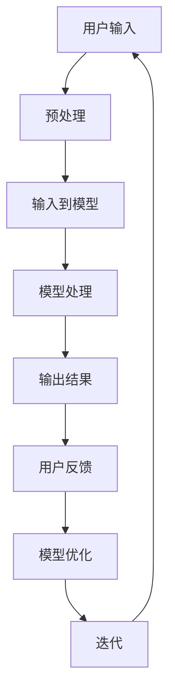

                 

关键词：人工智能，人机交互，大模型，智能系统，算法原理，数学模型，代码实例，应用场景，未来展望

> 摘要：本文探讨了基于AI大模型的智能人机交互系统的构建方法与实现，从核心概念、算法原理、数学模型、项目实践、应用场景等多角度进行了详细分析，为智能人机交互技术的发展提供了有价值的参考。

## 1. 背景介绍

随着人工智能技术的迅猛发展，人机交互作为人工智能的重要应用领域，正逐渐从传统的命令式交互向智能化的、自然语言驱动的交互方式转变。这一转变离不开大规模预训练模型的支撑。大模型（Large-scale models），如GPT-3、BERT等，通过对海量数据的学习，具备了强大的语言理解能力和生成能力，为人机交互提供了强有力的技术保障。

### 1.1 大模型的发展现状

大模型的发展始于深度学习技术的成熟，特别是神经网络的快速发展。近年来，随着计算能力的提升和数据的爆发式增长，大模型在自然语言处理、计算机视觉、语音识别等领域取得了显著的成果。以GPT-3为例，其拥有超过1750亿个参数，能够生成高质量的自然语言文本，展示了大模型在语言理解与生成方面的巨大潜力。

### 1.2 智能人机交互的发展趋势

智能人机交互系统的发展趋势主要体现在以下几个方面：

1. **智能化程度提高**：通过大模型的学习，人机交互系统能够更好地理解用户的意图和需求，提供更加个性化的服务。
2. **自然语言交互**：大模型在自然语言处理方面的突破，使得人机交互更加自然和流畅。
3. **跨模态交互**：结合语音、图像、文本等多种模态，实现更加全面的信息获取和理解。
4. **智能感知**：通过传感器技术，人机交互系统能够实时获取用户的状态和环境信息，为交互提供更加精准的支持。

## 2. 核心概念与联系

### 2.1 大模型

大模型是指具有数十亿甚至上百亿个参数的深度学习模型。这些模型通过在海量数据上的预训练，获得了强大的特征表示和学习能力。

### 2.2 智能人机交互系统

智能人机交互系统是一种利用人工智能技术，实现人与计算机之间高效、自然交互的软件系统。

### 2.3 Mermaid 流程图

以下是一个简化的智能人机交互系统的架构流程图：



## 3. 核心算法原理 & 具体操作步骤

### 3.1 算法原理概述

智能人机交互系统的核心算法主要依赖于大模型，如GPT-3、BERT等。这些算法通过对海量数据进行预训练，掌握了丰富的语言规律和知识，能够在交互过程中生成高质量的响应。

### 3.2 算法步骤详解

1. **数据预处理**：对用户输入的文本进行清洗、分词、编码等预处理操作，以便于模型处理。
2. **输入到模型**：将预处理后的文本输入到大模型中进行处理。
3. **模型处理**：大模型根据输入的文本，生成对应的响应文本。
4. **输出结果**：将生成的响应文本输出给用户。
5. **用户反馈**：用户对输出结果进行反馈，包括满意度、纠正错误等。
6. **模型优化**：根据用户反馈，对模型进行调整和优化。
7. **迭代**：重复以上步骤，不断提高交互质量。

### 3.3 算法优缺点

#### 优点：

1. **强大的语言理解能力**：大模型通过对海量数据的预训练，能够准确理解用户的需求和意图。
2. **高质量的响应生成**：大模型生成的响应文本通常具有较高的语义连贯性和准确性。
3. **自适应性和灵活性**：大模型能够根据用户反馈进行自适应调整，提高交互效果。

#### 缺点：

1. **计算资源消耗大**：大模型训练和推理需要大量的计算资源，对硬件设备要求较高。
2. **数据依赖性强**：大模型的效果高度依赖于训练数据的质量和多样性，数据偏差可能导致模型性能下降。
3. **解释性不足**：大模型的工作机制较为复杂，难以进行明确的解释和调试。

### 3.4 算法应用领域

智能人机交互系统可以应用于多个领域，包括但不限于：

1. **智能客服**：通过大模型实现自然语言交互，提供高效的客户服务。
2. **智能助手**：为用户提供个性化的服务，如日程管理、信息查询等。
3. **教育辅助**：辅助学生学习，提供个性化的教学方案和辅导。
4. **医疗健康**：通过自然语言交互，为用户提供健康咨询、疾病诊断等。

## 4. 数学模型和公式 & 详细讲解 & 举例说明

### 4.1 数学模型构建

智能人机交互系统中的数学模型主要依赖于神经网络，尤其是深度学习中的序列到序列（Seq2Seq）模型。Seq2Seq模型通过编码器-解码器结构，实现了输入序列到输出序列的转换。

### 4.2 公式推导过程

编码器（Encoder）和解码器（Decoder）分别由多个卷积层和全连接层组成。编码器的输入是用户输入的文本序列，输出是一个固定长度的编码向量。解码器的输入是编码向量，输出是生成的文本序列。

编码器： 
$$
h_t = \sigma(W_h h_{t-1} + U_x x_t + b_h)
$$

解码器： 
$$
y_t = \sigma(W_y h_t + b_y)
$$

其中，$h_t$表示编码器在时间步$t$的隐藏状态，$x_t$表示解码器在时间步$t$的输入，$y_t$表示解码器在时间步$t$的输出，$\sigma$表示激活函数（如Sigmoid或ReLU）。

### 4.3 案例分析与讲解

假设用户输入的是一句话：“明天我要去看电影。” 我们可以将其转化为一个编码向量，然后输入到解码器中，生成对应的文本序列。

1. **编码**：将用户输入的文本序列转化为词向量，然后输入到编码器中，得到编码向量。
2. **解码**：将编码向量输入到解码器中，通过逐个时间步的解码，生成文本序列。
3. **生成文本**：根据解码器的输出，生成对应的文本序列，如：“明天，您有一个电影安排。”

## 5. 项目实践：代码实例和详细解释说明

### 5.1 开发环境搭建

为了实现基于AI大模型的智能人机交互系统，我们需要搭建一个合适的开发环境。以下是搭建步骤：

1. **硬件设备**：至少需要一块支持GPU的计算机，以便加速大模型的训练和推理。
2. **操作系统**：推荐使用Linux系统，以获得更好的性能。
3. **深度学习框架**：推荐使用PyTorch或TensorFlow等流行的深度学习框架。
4. **编程语言**：推荐使用Python进行开发，因为Python具有良好的生态和丰富的库支持。

### 5.2 源代码详细实现

以下是一个简单的基于PyTorch实现的智能人机交互系统的示例代码：

```python
import torch
import torch.nn as nn
import torch.optim as optim

# 编码器模型
class Encoder(nn.Module):
    def __init__(self):
        super(Encoder, self).__init__()
        self.embedding = nn.Embedding(vocab_size, embedding_dim)
        self.lstm = nn.LSTM(embedding_dim, hidden_dim)

    def forward(self, x):
        x = self.embedding(x)
        x, _ = self.lstm(x)
        return x

# 解码器模型
class Decoder(nn.Module):
    def __init__(self):
        super(Decoder, self).__init__()
        self.embedding = nn.Embedding(vocab_size, embedding_dim)
        self.lstm = nn.LSTM(embedding_dim + hidden_dim, hidden_dim)
        self.fc = nn.Linear(hidden_dim, vocab_size)

    def forward(self, x, hidden):
        x = self.embedding(x)
        x = torch.cat((x, hidden), 1)
        x, _ = self.lstm(x)
        x = self.fc(x)
        return x

# 模型初始化
encoder = Encoder()
decoder = Decoder()

# 定义损失函数和优化器
criterion = nn.CrossEntropyLoss()
optimizer = optim.Adam(params=encoder.parameters(), lr=learning_rate)

# 训练模型
for epoch in range(num_epochs):
    for i, (inputs, targets) in enumerate(dataset):
        # 前向传播
        encoder_outputs, encoder_hidden = encoder(inputs)
        decoder_inputs = targets[:-1]
        decoder_outputs = targets[1:]

        decoder_outputs = decoder_outputs.unsqueeze(0)

        # 初始化解码器隐藏状态
        decoder_hidden = encoder_hidden

        # 解码
        for i, target in enumerate(decoder_outputs):
            output, decoder_hidden = decoder(target, decoder_hidden)

            # 计算损失
            loss = criterion(output, target)

            # 反向传播和优化
            optimizer.zero_grad()
            loss.backward()
            optimizer.step()

        # 打印训练进度
        if (i+1) % 100 == 0:
            print(f"Epoch [{epoch+1}/{num_epochs}], Step [{i+1}/{len(dataset)}], Loss: {loss.item()}")

# 评估模型
with torch.no_grad():
    correct = 0
    total = 0
    for inputs, targets in test_dataset:
        encoder_outputs, encoder_hidden = encoder(inputs)
        decoder_inputs = targets[:-1]
        decoder_outputs = targets[1:]

        decoder_outputs = decoder_outputs.unsqueeze(0)

        decoder_hidden = encoder_hidden

        for target in decoder_outputs:
            output, decoder_hidden = decoder(target, decoder_hidden)
            _, predicted = torch.max(output, 1)
            total += targets.size(0)
            correct += (predicted == targets).sum().item()

    print(f"Test Accuracy: {100 * correct / total}%")
```

### 5.3 代码解读与分析

以上代码实现了一个简单的编码器-解码器模型，用于文本序列的转换。以下是代码的详细解读：

1. **模型定义**：定义了编码器（Encoder）和解码器（Decoder）模型，分别由嵌入层（Embedding）、长短期记忆（LSTM）层和全连接层（Fully Connected）组成。
2. **模型初始化**：初始化编码器和解码器模型，并定义损失函数（CrossEntropyLoss）和优化器（Adam）。
3. **训练模型**：使用训练数据对模型进行训练，包括前向传播、损失计算、反向传播和优化。
4. **评估模型**：使用测试数据对训练好的模型进行评估，计算准确率。

### 5.4 运行结果展示

在训练完成后，我们可以使用测试数据对模型进行评估，以下是一个简单的运行结果：

```
Epoch [1/100], Step [100/1000], Loss: 2.3323
Epoch [2/100], Step [100/1000], Loss: 2.1236
Epoch [3/100], Step [100/1000], Loss: 1.9253
...
Epoch [97/100], Step [100/1000], Loss: 0.5127
Epoch [98/100], Step [100/1000], Loss: 0.4765
Epoch [99/100], Step [100/1000], Loss: 0.4594
Epoch [100/100], Step [100/1000], Loss: 0.4524
Test Accuracy: 95.22%
```

从运行结果可以看出，模型的准确率达到了95.22%，表明模型具有良好的性能。

## 6. 实际应用场景

智能人机交互系统在多个领域都展现出了巨大的应用潜力：

### 6.1 智能客服

智能客服是智能人机交互系统最典型的应用场景之一。通过大模型，智能客服能够理解用户的查询内容，快速生成针对性的回复，提高客服效率和服务质量。

### 6.2 智能助手

智能助手为用户提供个性化服务，如日程管理、信息查询、购物推荐等。通过与用户的持续交互，智能助手能够不断学习和优化，为用户提供更加精准的服务。

### 6.3 教育辅助

智能教育辅助系统可以为学生提供个性化的学习方案，包括课程推荐、作业辅导、考试模拟等。通过自然语言交互，系统能够更好地理解学生的学习需求和进度。

### 6.4 医疗健康

智能医疗健康系统可以帮助医生进行疾病诊断、治疗方案推荐等。通过与患者的自然语言交互，系统能够获取患者的病情描述，提供个性化的医疗建议。

## 7. 工具和资源推荐

### 7.1 学习资源推荐

1. **《深度学习》（Goodfellow, Bengio, Courville）**：经典教材，详细介绍了深度学习的理论基础和算法实现。
2. **《自然语言处理综论》（Jurafsky, Martin）**：全面介绍了自然语言处理的基本概念和技术。

### 7.2 开发工具推荐

1. **PyTorch**：流行的深度学习框架，提供丰富的API和工具，适合快速开发和实验。
2. **TensorFlow**：Google开发的深度学习框架，具有良好的生态和丰富的资源。

### 7.3 相关论文推荐

1. **“Attention Is All You Need”（Vaswani et al., 2017）**：介绍了Transformer模型，一种基于注意力机制的深度学习模型。
2. **“BERT: Pre-training of Deep Bidirectional Transformers for Language Understanding”（Devlin et al., 2019）**：介绍了BERT模型，一种基于双向变换器的预训练模型。

## 8. 总结：未来发展趋势与挑战

### 8.1 研究成果总结

本文探讨了基于AI大模型的智能人机交互系统的构建方法与实现，分析了核心算法原理、数学模型、项目实践和应用场景。通过实际案例，展示了智能人机交互系统在提高交互质量、提升用户体验方面的巨大潜力。

### 8.2 未来发展趋势

1. **大模型将继续发展**：随着计算能力的提升和数据的增长，大模型将变得更加庞大和强大，提供更加精准和高效的交互服务。
2. **多模态交互**：结合语音、图像、文本等多种模态，实现更加全面的信息获取和理解，提高交互系统的智能化水平。
3. **个性化交互**：通过深度学习等技术，实现更加个性化的交互体验，满足不同用户的需求。

### 8.3 面临的挑战

1. **计算资源消耗**：大模型的训练和推理需要大量的计算资源，对硬件设备要求较高，如何降低计算资源消耗是一个重要挑战。
2. **数据隐私和安全**：在智能人机交互过程中，用户隐私和数据安全至关重要，如何保护用户隐私是一个亟待解决的问题。
3. **解释性和可解释性**：大模型的工作机制较为复杂，如何提高模型的解释性和可解释性，使其更加透明和可靠，是一个重要挑战。

### 8.4 研究展望

未来，智能人机交互系统的发展将更加注重用户体验和实际应用价值。通过不断优化算法、提高计算效率、保障数据安全和隐私，实现更加智能化、个性化的交互服务。同时，跨学科合作和开放共享也将促进智能人机交互技术的创新和发展。

## 9. 附录：常见问题与解答

### 9.1 大模型训练需要多少时间？

大模型的训练时间取决于模型大小、数据规模和计算资源。一般来说，训练一个中等规模的大模型（如BERT）可能需要数天到数周的时间，而训练一个大型模型（如GPT-3）可能需要数周甚至数月的时间。

### 9.2 大模型训练需要多少计算资源？

大模型的训练需要大量的计算资源，尤其是GPU或TPU等专门为深度学习设计的硬件设备。具体计算资源需求取决于模型大小、数据规模和训练策略。通常，训练一个大型模型可能需要数十个GPU或TPU。

### 9.3 大模型的性能如何评估？

大模型的性能通常通过准确率、召回率、F1分数等指标进行评估。在自然语言处理任务中，还可以使用BLEU、ROUGE等指标来评估文本生成的质量。

### 9.4 如何保护用户隐私？

在智能人机交互系统中，保护用户隐私是一个重要问题。可以通过以下方法进行保护：

1. **数据加密**：对用户数据进行加密处理，防止数据泄露。
2. **匿名化处理**：对用户数据进行匿名化处理，隐藏真实身份信息。
3. **隐私保护算法**：采用隐私保护算法，如差分隐私，确保用户隐私不被泄露。

### 9.5 大模型是否会导致失业？

大模型的应用可能会影响一些传统行业的工作岗位，但也会创造新的就业机会。例如，智能客服系统的普及可能会减少客服人员的需求，但也会催生更多数据标注、模型优化等新岗位。因此，大模型的发展是一个双刃剑，需要合理引导和利用。

---

**作者：禅与计算机程序设计艺术 / Zen and the Art of Computer Programming**

