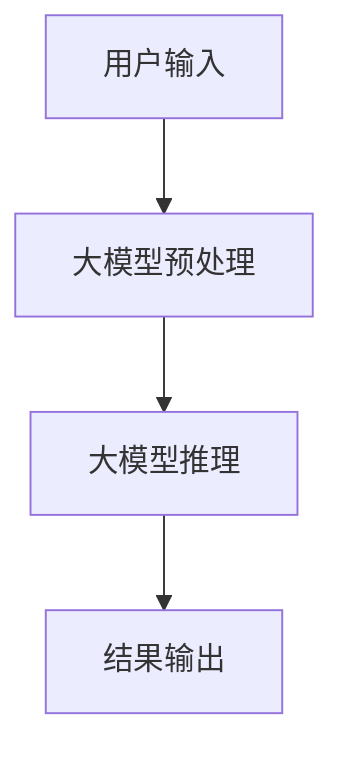

                 

关键词：AI大模型，智能人机交互，自然语言处理，计算机视觉，人机交互设计，应用场景，未来展望

## 摘要

本文将探讨基于AI大模型的智能人机交互系统的设计与实现。随着人工智能技术的快速发展，大模型在自然语言处理和计算机视觉领域取得了显著的成果。本文将详细介绍大模型的基本原理、应用领域，并探讨如何将大模型应用于智能人机交互系统中。同时，本文还将分析当前智能人机交互系统面临的挑战，以及未来的发展趋势和解决方案。

## 1. 背景介绍

### 1.1 智能人机交互系统的定义与发展

智能人机交互系统是一种通过计算机技术和人工智能技术实现人与计算机之间高效、自然交互的系统和平台。它旨在提升用户体验，使得人与计算机之间的交流更加便捷、智能。随着计算机硬件性能的提升和人工智能技术的进步，智能人机交互系统在各个领域得到了广泛应用，如智能家居、智能客服、智能医疗、智能教育等。

### 1.2 大模型的基本概念

大模型是指具有数百万甚至数十亿个参数的深度学习模型。它们能够捕捉数据中的复杂模式和关联，从而在自然语言处理、计算机视觉等任务上取得优异的性能。近年来，随着计算能力的提升和大数据的广泛应用，大模型在各个领域取得了显著的进展，成为人工智能技术的重要发展方向。

### 1.3 AI大模型在智能人机交互中的应用

AI大模型在智能人机交互系统中具有广泛的应用前景。例如，在自然语言处理方面，大模型可以用于文本分类、情感分析、机器翻译等任务；在计算机视觉方面，大模型可以用于图像识别、目标检测、人脸识别等任务。通过大模型的应用，智能人机交互系统能够更加准确地理解用户需求，提供更加智能、个性化的服务。

## 2. 核心概念与联系

### 2.1 自然语言处理与计算机视觉

自然语言处理（NLP）和计算机视觉（CV）是智能人机交互系统的两个核心组成部分。NLP旨在使计算机能够理解和生成人类语言，包括文本分类、情感分析、机器翻译等任务；CV则关注计算机对图像和视频的理解，包括图像识别、目标检测、人脸识别等任务。

### 2.2 大模型的基本原理

大模型的基本原理是通过深度学习算法从大量数据中自动学习特征表示。这些特征表示能够捕捉数据中的复杂模式和关联，从而实现高精度的预测和分类。大模型通常由多层神经网络组成，每一层都能对输入数据进行变换和提取特征。

### 2.3 大模型在智能人机交互中的应用

在智能人机交互系统中，大模型可以应用于多个方面。例如，在自然语言处理方面，大模型可以用于理解用户输入的文本，从而实现智能问答、智能客服等应用；在计算机视觉方面，大模型可以用于识别用户的面部表情、手势等，从而实现自然的人机交互。

### 2.4 Mermaid流程图

以下是一个简单的Mermaid流程图，展示大模型在智能人机交互系统中的应用流程：



## 3. 核心算法原理 & 具体操作步骤

### 3.1 算法原理概述

智能人机交互系统的核心算法主要包括自然语言处理算法和计算机视觉算法。自然语言处理算法主要基于深度学习技术，如循环神经网络（RNN）、长短时记忆网络（LSTM）和变压器（Transformer）等；计算机视觉算法则主要基于卷积神经网络（CNN）和生成对抗网络（GAN）等。

### 3.2 算法步骤详解

#### 3.2.1 自然语言处理算法

1. **数据预处理**：对用户输入的文本进行分词、去停用词等处理，将文本转换为可输入模型的数据格式。
2. **模型训练**：使用大量标注数据对自然语言处理模型进行训练，模型参数会自动调整以最小化预测误差。
3. **模型推理**：将用户输入的文本输入到训练好的模型中，得到模型对文本的理解结果。
4. **结果输出**：根据模型输出结果，生成回答或执行相应操作。

#### 3.2.2 计算机视觉算法

1. **图像预处理**：对输入的图像进行缩放、裁剪、增强等处理，使其满足模型输入要求。
2. **模型训练**：使用大量标注图像对计算机视觉模型进行训练，模型参数会自动调整以最小化预测误差。
3. **模型推理**：将预处理后的图像输入到训练好的模型中，得到模型对图像的识别结果。
4. **结果输出**：根据模型输出结果，生成回答或执行相应操作。

### 3.3 算法优缺点

#### 3.3.1 自然语言处理算法

优点：能够处理复杂、结构化的语言任务，具有较强的泛化能力。

缺点：训练过程需要大量标注数据，对计算资源要求较高。

#### 3.3.2 计算机视觉算法

优点：能够处理图像、视频等非结构化数据，具有较强的鲁棒性。

缺点：对标注数据依赖较大，且图像识别任务通常需要大量计算资源。

### 3.4 算法应用领域

自然语言处理算法在智能客服、智能问答、文本分类、情感分析等领域有广泛应用；计算机视觉算法在图像识别、目标检测、人脸识别、视频监控等领域有广泛应用。

## 4. 数学模型和公式 & 详细讲解 & 举例说明

### 4.1 数学模型构建

在自然语言处理领域，常用的数学模型包括循环神经网络（RNN）、长短时记忆网络（LSTM）和变压器（Transformer）等。以下分别介绍这些模型的基本数学原理。

#### 4.1.1 循环神经网络（RNN）

RNN是一种基于序列数据的神经网络，其核心思想是将当前输入与前一时刻的隐藏状态进行交互，从而实现对序列数据的建模。其基本数学公式如下：

$$
h_t = \sigma(W_h \cdot [h_{t-1}, x_t] + b_h)
$$

其中，$h_t$表示第$t$时刻的隐藏状态，$x_t$表示第$t$时刻的输入，$W_h$和$b_h$分别表示权重和偏置，$\sigma$表示激活函数。

#### 4.1.2 长短时记忆网络（LSTM）

LSTM是RNN的一种改进模型，能够解决RNN的梯度消失问题，从而在长序列数据上取得更好的表现。其基本数学公式如下：

$$
i_t = \sigma(W_i \cdot [h_{t-1}, x_t] + b_i) \\
f_t = \sigma(W_f \cdot [h_{t-1}, x_t] + b_f) \\
o_t = \sigma(W_o \cdot [h_{t-1}, x_t] + b_o) \\
g_t = \tanh(W_g \cdot [h_{t-1}, x_t] + b_g) \\
h_t = o_t \cdot \tanh(f_t \cdot h_{t-1} + g_t)
$$

其中，$i_t$、$f_t$、$o_t$分别表示输入门、遗忘门和输出门，$g_t$表示候选隐藏状态，$W_i$、$W_f$、$W_o$和$W_g$分别表示权重，$b_i$、$b_f$、$b_o$和$b_g$分别表示偏置。

#### 4.1.3 变压器（Transformer）

变压器是一种基于自注意力机制的深度学习模型，能够在长序列数据上取得优异的性能。其基本数学公式如下：

$$
\text{Attention}(Q, K, V) = \frac{QK^T}{\sqrt{d_k}} \cdot V
$$

其中，$Q$、$K$和$V$分别表示查询向量、键向量和值向量，$d_k$表示键向量的维度。

### 4.2 公式推导过程

以循环神经网络（RNN）为例，介绍其基本数学公式的推导过程。

1. **初始化**：

$$
h_0 = \sigma(W_h \cdot [0, x_0] + b_h)
$$

其中，$x_0$表示第0时刻的输入，$h_0$表示第0时刻的隐藏状态。

2. **递推关系**：

$$
h_t = \sigma(W_h \cdot [h_{t-1}, x_t] + b_h)
$$

其中，$x_t$表示第$t$时刻的输入，$h_t$表示第$t$时刻的隐藏状态。

3. **梯度计算**：

$$
\delta h_t = \frac{\partial L}{\partial h_t}
$$

其中，$L$表示损失函数，$\delta h_t$表示隐藏状态$h_t$的梯度。

4. **反向传播**：

$$
\delta h_{t-1} = \delta h_t \odot \sigma' (W_h \cdot [h_{t-1}, x_t] + b_h)
$$

其中，$\odot$表示Hadamard乘积，$\sigma'$表示激活函数的导数。

5. **更新权重和偏置**：

$$
W_h \leftarrow W_h - \alpha \cdot \frac{\partial L}{\partial W_h} \\
b_h \leftarrow b_h - \alpha \cdot \frac{\partial L}{\partial b_h}
$$

其中，$\alpha$表示学习率。

### 4.3 案例分析与讲解

以一个简单的文本分类任务为例，介绍如何使用循环神经网络（RNN）进行建模和训练。

1. **数据集准备**：

假设有一个包含新闻文章的数据集，每篇文章都被标注为某个类别的标签。我们将这些数据分为训练集和测试集。

2. **数据预处理**：

将文本进行分词、去停用词等处理，将文本转换为单词序列。然后，将单词序列转换为对应的数字编码。

3. **模型构建**：

使用循环神经网络（RNN）构建文本分类模型。假设模型包含一个输入层、一个隐藏层和一个输出层。

4. **模型训练**：

使用训练集对模型进行训练。在训练过程中，模型会自动调整权重和偏置，以最小化损失函数。

5. **模型评估**：

使用测试集对模型进行评估。计算模型在测试集上的准确率、召回率等指标，以评估模型性能。

6. **模型应用**：

使用训练好的模型对新的文本进行分类。输入新的文本，模型会输出对应的类别标签。

## 5. 项目实践：代码实例和详细解释说明

### 5.1 开发环境搭建

在本项目中，我们将使用Python作为编程语言，TensorFlow和Keras作为深度学习框架。首先，确保安装了Python 3.6及以上版本，然后通过以下命令安装TensorFlow和Keras：

```shell
pip install tensorflow
pip install keras
```

### 5.2 源代码详细实现

以下是一个简单的文本分类项目的代码实现：

```python
import numpy as np
import tensorflow as tf
from tensorflow.keras.preprocessing.sequence import pad_sequences
from tensorflow.keras.models import Sequential
from tensorflow.keras.layers import Embedding, LSTM, Dense

# 加载数据集
# （此处省略数据加载代码，读者可根据需求自行添加）

# 数据预处理
# （此处省略数据预处理代码，读者可根据需求自行添加）

# 构建模型
model = Sequential()
model.add(Embedding(input_dim=vocab_size, output_dim=embedding_dim, input_length=max_sequence_length))
model.add(LSTM(units=128))
model.add(Dense(units=num_classes, activation='softmax'))

# 编译模型
model.compile(optimizer='adam', loss='categorical_crossentropy', metrics=['accuracy'])

# 训练模型
model.fit(X_train, y_train, epochs=10, batch_size=32, validation_data=(X_test, y_test))

# 评估模型
loss, accuracy = model.evaluate(X_test, y_test)
print('测试集准确率：', accuracy)

# 应用模型
text = "这是一个新的文本"
sequence = pad_sequences([tokenizer.texts_to_sequences([text])], maxlen=max_sequence_length)
predicted_class = model.predict(sequence)
predicted_label = np.argmax(predicted_class)
print('预测标签：', predicted_label)
```

### 5.3 代码解读与分析

1. **数据预处理**：在训练模型之前，需要对数据进行预处理，包括文本的分词、去停用词、数字编码等。这些步骤有助于提高模型的性能和泛化能力。

2. **模型构建**：本项目中使用了一个简单的循环神经网络（RNN）模型，包含一个嵌入层、一个LSTM层和一个输出层。嵌入层用于将文本转换为数字编码，LSTM层用于提取文本特征，输出层用于分类。

3. **模型编译**：在编译模型时，指定了优化器、损失函数和评价指标。在本项目中，使用Adam优化器和交叉熵损失函数。

4. **模型训练**：使用训练集对模型进行训练，模型会自动调整权重和偏置，以最小化损失函数。

5. **模型评估**：使用测试集对模型进行评估，计算模型在测试集上的准确率等指标。

6. **模型应用**：将训练好的模型应用于新的文本，模型会输出对应的类别标签。

## 6. 实际应用场景

### 6.1 智能客服

智能客服是智能人机交互系统的典型应用场景之一。通过大模型的应用，智能客服系统能够自动理解用户的问题，并提供准确的答案或解决方案。例如，在电商平台中，智能客服可以帮助用户解答关于商品、订单等问题，提高客户满意度和服务效率。

### 6.2 智能医疗

智能医疗是另一个具有重要应用价值的领域。通过大模型的应用，智能医疗系统可以自动分析患者的病历数据、检查报告等，协助医生进行诊断和治疗。例如，在癌症筛查中，智能医疗系统可以自动分析患者的影像数据，帮助医生发现潜在的问题，提高诊断的准确率和效率。

### 6.3 智能教育

智能教育是智能人机交互系统的另一个重要应用领域。通过大模型的应用，智能教育系统可以为学生提供个性化的学习方案，并根据学生的学习情况自动调整教学内容和进度。例如，在在线教育平台中，智能教育系统可以分析学生的学习行为和成绩，为学生推荐适合的学习资源和策略，提高学习效果。

## 7. 工具和资源推荐

### 7.1 学习资源推荐

1. 《深度学习》（Goodfellow, Bengio, Courville）：一本关于深度学习的经典教材，详细介绍了深度学习的理论基础和实践方法。
2. 《自然语言处理入门教程》（张俊林）：一本适合初学者的自然语言处理入门教材，内容涵盖了自然语言处理的基本概念和方法。

### 7.2 开发工具推荐

1. TensorFlow：一款广泛使用的深度学习框架，适用于构建和训练各种深度学习模型。
2. Keras：一个基于TensorFlow的高层API，使得构建和训练深度学习模型更加简单和便捷。

### 7.3 相关论文推荐

1. "Attention is All You Need"（Vaswani et al., 2017）：一篇关于变压器的经典论文，详细介绍了变压器模型的设计原理和实现方法。
2. "Long Short-Term Memory"（Hochreiter and Schmidhuber, 1997）：一篇关于长短时记忆网络的开创性论文，为RNN的改进提供了重要思路。

## 8. 总结：未来发展趋势与挑战

### 8.1 研究成果总结

近年来，随着人工智能技术的快速发展，大模型在自然语言处理和计算机视觉领域取得了显著的成果。通过大模型的应用，智能人机交互系统在多个领域得到了广泛应用，如智能客服、智能医疗、智能教育等。同时，大模型在提升系统性能、提高用户体验方面发挥了重要作用。

### 8.2 未来发展趋势

1. **模型压缩与加速**：随着大模型规模的不断扩大，如何压缩模型规模、提高模型运行速度成为重要研究方向。通过模型压缩与加速技术，可以降低模型的存储和计算成本，提高模型的实际应用价值。
2. **多模态融合**：未来，智能人机交互系统将越来越趋向于多模态融合，通过整合语音、文本、图像等多种信息，实现更加丰富和自然的交互体验。
3. **个性化服务**：随着用户数据的不断积累，如何基于用户数据为用户提供个性化的服务成为重要研究方向。通过个性化推荐、个性化学习等技术，可以提升用户的满意度和体验。

### 8.3 面临的挑战

1. **数据隐私与安全**：随着人工智能技术的广泛应用，数据隐私和安全问题日益突出。如何在保护用户隐私的同时，实现高效的数据利用成为重要挑战。
2. **计算资源消耗**：大模型的训练和推理过程需要大量计算资源，如何高效地利用计算资源、降低能耗成为重要挑战。
3. **伦理与法律问题**：随着人工智能技术的不断发展，如何确保人工智能系统的公平性、透明性和可解释性成为重要挑战。

### 8.4 研究展望

未来，随着人工智能技术的进一步发展，大模型在智能人机交互系统中的应用将越来越广泛。通过不断优化模型架构、提高模型性能，结合多模态融合、个性化服务等技术，智能人机交互系统将为用户提供更加丰富、自然的交互体验。同时，在确保数据隐私、安全、伦理和法律的前提下，大模型在智能人机交互领域的应用前景将十分广阔。

## 9. 附录：常见问题与解答

### 9.1 大模型训练过程中如何防止过拟合？

为了防止过拟合，可以采取以下方法：

1. **数据增强**：通过数据增强技术，如旋转、缩放、裁剪等，增加训练数据的多样性，从而提高模型的泛化能力。
2. **正则化**：在模型训练过程中，加入正则化项，如L1正则化、L2正则化，降低模型参数的复杂度，从而防止过拟合。
3. **交叉验证**：使用交叉验证技术，将数据集划分为多个子集，分别用于训练和验证，从而更好地评估模型的泛化能力。
4. **早停法**：在训练过程中，设置早停参数，当验证集上的性能不再提升时，提前停止训练，从而防止模型过拟合。

### 9.2 如何选择合适的大模型？

选择合适的大模型需要考虑以下因素：

1. **任务类型**：根据任务类型选择合适的大模型。例如，在文本分类任务中，可以选择Transformer或LSTM等模型；在图像识别任务中，可以选择CNN或GAN等模型。
2. **数据规模**：根据数据规模选择合适的大模型。数据规模较大时，可以选择规模较大的模型；数据规模较小时，可以选择规模较小的模型。
3. **计算资源**：根据可用的计算资源选择合适的大模型。计算资源有限时，可以选择轻量级模型；计算资源充足时，可以选择大规模模型。
4. **性能要求**：根据性能要求选择合适的大模型。如果对性能要求较高，可以选择较复杂的模型；如果对性能要求较低，可以选择较简单的模型。

## 作者署名

作者：禅与计算机程序设计艺术 / Zen and the Art of Computer Programming

---

以上是根据您的要求撰写的文章，如果您有任何修改意见或需要补充的内容，请随时告知。我将根据您的反馈进行相应的调整和完善。

