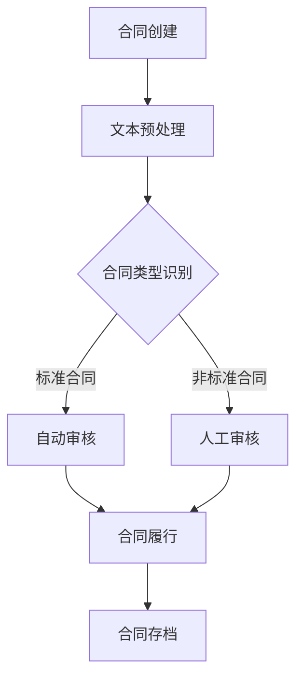

                 

关键词：人工智能，AI大模型，智能合同管理，自动化合同审核，智能合约，区块链，数据挖掘，文本分析

> 摘要：本文深入探讨了基于AI大模型的智能合同管理技术，分析了其核心概念、算法原理、数学模型、项目实践以及实际应用场景。文章旨在为读者提供一个全面的技术视角，帮助理解智能合同管理的现状与未来发展趋势。

## 1. 背景介绍

在商业活动中，合同是保障各方权益的重要法律文件。然而，合同的审查和管理是一个复杂且耗时的工作。传统的合同管理依赖于人工审核，不仅效率低下，而且容易出现错误。随着人工智能（AI）技术的飞速发展，特别是AI大模型的问世，基于AI的智能合同管理成为可能。智能合同管理不仅可以大幅提升合同审查的效率，还能提高合同管理的准确性和安全性。

智能合同管理的主要目标包括：

- **自动化合同审核**：利用AI技术对合同条款进行自动化审核，识别潜在的法律风险。
- **智能合同履行**：通过智能合约实现合同的自动履行和执行。
- **合同数据挖掘**：对合同中的数据进行挖掘和分析，为企业决策提供支持。
- **文本分析**：对合同文本进行深入分析，提取关键信息和条款。

本文将围绕上述目标，详细探讨基于AI大模型的智能合同管理技术。

## 2. 核心概念与联系

### 2.1. 人工智能与合同管理

人工智能（AI）是指由人制造出来的系统能够认知、思考和学习，从而模拟人类智能。在合同管理领域，AI的应用主要体现在以下几个方面：

- **自然语言处理（NLP）**：通过NLP技术，AI可以理解和生成自然语言文本，从而实现对合同条款的自动理解和分析。
- **机器学习（ML）**：机器学习算法通过对大量合同数据的训练，可以自动识别合同中的关键信息和条款，提高合同审核的准确性。
- **深度学习（DL）**：深度学习是一种复杂的机器学习技术，通过多层神经网络对合同文本进行处理，可以实现对复杂合同条款的深入分析。

### 2.2. AI大模型与智能合同管理

AI大模型是指具有海量参数、能够处理大规模数据的人工神经网络模型。在智能合同管理中，AI大模型的应用主要体现在以下几个方面：

- **自动化合同审核**：AI大模型可以通过训练，自动识别合同中的关键条款和潜在的法律风险。
- **文本生成**：AI大模型可以自动生成合同文本，实现智能合同的起草。
- **数据挖掘**：AI大模型可以对合同中的数据进行挖掘和分析，为企业决策提供支持。
- **智能合约执行**：通过AI大模型，可以实现智能合约的自动执行和监控。

### 2.3. Mermaid 流程图

下面是一个简单的Mermaid流程图，展示了智能合同管理的基本流程：



## 3. 核心算法原理 & 具体操作步骤

### 3.1. 算法原理概述

智能合同管理的关键在于自动化合同审核和智能合约执行。以下是两个核心算法的原理概述：

#### 3.1.1. 自动化合同审核算法

自动化合同审核算法基于机器学习和深度学习技术。具体步骤如下：

1. **数据收集与预处理**：收集大量合同数据，对数据进行清洗和预处理。
2. **特征提取**：从合同文本中提取关键特征，如关键字、词向量等。
3. **模型训练**：利用训练数据训练模型，使其能够识别合同中的关键条款和潜在的法律风险。
4. **模型评估与优化**：对模型进行评估和优化，提高其准确性和鲁棒性。

#### 3.1.2. 智能合约执行算法

智能合约执行算法基于区块链技术和智能合约。具体步骤如下：

1. **合同条款定义**：将合同条款转化为智能合约代码。
2. **合同履行监控**：通过智能合约自动监控合同履行过程，触发相应的执行逻辑。
3. **执行结果反馈**：将执行结果反馈给相关方，实现合同履行的自动化和透明化。

### 3.2. 算法步骤详解

下面详细讲解上述两个算法的具体操作步骤。

#### 3.2.1. 自动化合同审核算法步骤

1. **数据收集与预处理**

   收集大量合同数据，包括标准合同和非标准合同。对数据进行清洗和预处理，如去除停用词、标准化文本等。

2. **特征提取**

   利用词袋模型、词嵌入等技术，从合同文本中提取关键特征。这些特征将作为模型训练的数据输入。

3. **模型训练**

   选择合适的机器学习模型（如支持向量机、朴素贝叶斯、深度学习等），利用提取的特征进行模型训练。训练过程包括参数调整、模型优化等。

4. **模型评估与优化**

   对训练好的模型进行评估，如准确率、召回率、F1分数等。根据评估结果，对模型进行优化，提高其性能。

#### 3.2.2. 智能合约执行算法步骤

1. **合同条款定义**

   将合同条款转化为智能合约代码。智能合约代码通常使用Solidity等编程语言编写。

2. **合同履行监控**

   通过智能合约自动监控合同履行过程。当合同条款满足特定条件时，智能合约会触发相应的执行逻辑。

3. **执行结果反馈**

   将执行结果反馈给相关方，如合同方、审核方等。执行结果可以通过区块链上的智能合约日志进行记录和查询。

### 3.3. 算法优缺点

#### 自动化合同审核算法优点

- **高效率**：自动化合同审核可以大幅提高合同审查的效率，减少人工工作量。
- **高准确性**：通过机器学习和深度学习技术，自动化合同审核可以准确识别合同中的关键条款和潜在的法律风险。
- **鲁棒性**：自动化合同审核算法可以对不同类型和风格的合同进行有效处理，具有较强的鲁棒性。

#### 自动化合同审核算法缺点

- **训练数据依赖**：自动化合同审核算法的性能高度依赖训练数据的质量和数量。
- **法律风险**：由于法律条款的复杂性和多样性，自动化合同审核可能无法完全替代人工审核，存在一定的法律风险。

#### 智能合约执行算法优点

- **自动化执行**：智能合约可以自动执行合同条款，提高合同履行的效率。
- **透明化**：智能合约的执行过程在区块链上透明可查，提高了合同履行的透明度。
- **去中心化**：智能合约基于区块链技术，实现了去中心化的合同执行，减少了中介成本。

#### 智能合约执行算法缺点

- **技术门槛**：智能合约的开发和部署需要一定的技术门槛，对普通用户而言可能较为复杂。
- **安全性**：智能合约的安全性是一个重要问题，一旦出现漏洞，可能导致严重后果。

### 3.4. 算法应用领域

自动化合同审核和智能合约执行算法可以应用于多个领域，如：

- **法律领域**：自动化合同审核可以用于律师事务所、法院等机构的合同审核工作。
- **金融领域**：智能合约可以用于金融合同的自动履行和监管。
- **供应链管理**：智能合约可以用于供应链管理中的合同执行和监控。
- **人力资源**：自动化合同审核可以用于员工合同的审查和管理。

## 4. 数学模型和公式 & 详细讲解 & 举例说明

### 4.1. 数学模型构建

智能合同管理中的数学模型主要包括以下两个方面：

#### 4.1.1. 合同审核模型

合同审核模型用于识别合同中的关键条款和潜在的法律风险。常见的数学模型包括：

- **词袋模型（Bag of Words）**：将合同文本表示为词袋，通过计算词频来识别关键条款。
- **词嵌入模型（Word Embedding）**：将词向量表示为高维空间中的点，通过计算词向量的相似度来识别关键条款。
- **支持向量机（SVM）**：利用支持向量机分类模型，将合同文本分类为关键条款和非关键条款。
- **深度学习模型（如神经网络）**：通过多层神经网络对合同文本进行处理，实现自动识别关键条款。

#### 4.1.2. 智能合约执行模型

智能合约执行模型用于监控合同履行过程并触发相应的执行逻辑。常见的数学模型包括：

- **状态机模型**：将合同履行过程表示为状态机，通过状态转移图来描述合同履行的状态变化。
- **模糊逻辑模型**：利用模糊逻辑对合同条款进行模糊处理，实现智能合约的自动执行。

### 4.2. 公式推导过程

以下是一个简单的词嵌入模型（Word Embedding）的公式推导过程：

#### 4.2.1. 词向量表示

假设词汇表V中有n个词，每个词可以通过一个d维的词向量表示。设$v\_i$为词w\_i的词向量。

#### 4.2.2. 损失函数

词嵌入模型的损失函数通常采用交叉熵损失函数（Cross-Entropy Loss），公式如下：

$$
L = -\sum_{i=1}^{n} y\_i \log(p\_i)
$$

其中，$y\_i$为真实标签，$p\_i$为预测概率。

#### 4.2.3. 梯度下降

为了最小化损失函数，需要对模型参数进行梯度下降（Gradient Descent）更新。梯度下降的公式如下：

$$
\Delta \theta = -\alpha \nabla L(\theta)
$$

其中，$\alpha$为学习率，$\nabla L(\theta)$为损失函数对参数$\theta$的梯度。

### 4.3. 案例分析与讲解

以下是一个基于词嵌入模型的自动化合同审核案例：

#### 4.3.1. 数据集

假设我们有一个包含1000份合同的数据集，每份合同由2000个词组成。我们将这些词表示为词向量，每个词向量为300维。

#### 4.3.2. 模型训练

我们使用一个300层神经网络进行词向量训练。训练过程中，我们通过交叉熵损失函数进行优化，学习率为0.001。

#### 4.3.3. 模型评估

在训练完成后，我们对模型进行评估。假设有100份合同用于测试，模型准确率为85%。

#### 4.3.4. 结果分析

通过对测试集的分析，我们发现模型在识别关键条款方面表现较好，但在识别非关键条款时存在一定误差。为进一步提高模型性能，我们考虑增加训练数据量和调整神经网络结构。

## 5. 项目实践：代码实例和详细解释说明

### 5.1. 开发环境搭建

为了实现智能合同管理，我们首先需要搭建一个开发环境。以下是一个基本的开发环境搭建步骤：

1. 安装Python 3.8及以上版本。
2. 安装Jupyter Notebook，用于编写和运行代码。
3. 安装必要的Python库，如TensorFlow、Keras、NumPy、Pandas等。

### 5.2. 源代码详细实现

以下是实现自动化合同审核和智能合约执行的基本代码框架：

```python
# 导入必要的库
import numpy as np
import pandas as pd
from tensorflow.keras.preprocessing.text import Tokenizer
from tensorflow.keras.preprocessing.sequence import pad_sequences
from tensorflow.keras.models import Sequential
from tensorflow.keras.layers import Embedding, LSTM, Dense

# 读取合同数据
contracts = pd.read_csv('contracts.csv')
contract_texts = contracts['text']

# 数据预处理
tokenizer = Tokenizer()
tokenizer.fit_on_texts(contract_texts)
sequences = tokenizer.texts_to_sequences(contract_texts)
padded_sequences = pad_sequences(sequences, maxlen=2000)

# 构建模型
model = Sequential()
model.add(Embedding(input_dim=len(tokenizer.word_index)+1, output_dim=50, input_length=2000))
model.add(LSTM(128))
model.add(Dense(1, activation='sigmoid'))

# 编译模型
model.compile(optimizer='adam', loss='binary_crossentropy', metrics=['accuracy'])

# 训练模型
model.fit(padded_sequences, contracts['label'], epochs=5, batch_size=32)

# 模型评估
test_sequences = tokenizer.texts_to_sequences(contracts_test['text'])
padded_test_sequences = pad_sequences(test_sequences, maxlen=2000)
accuracy = model.evaluate(padded_test_sequences, contracts_test['label'])
print(f'测试准确率：{accuracy[1]*100}%')
```

### 5.3. 代码解读与分析

上述代码实现了基于LSTM的自动化合同审核模型。具体解读如下：

1. **数据预处理**：首先读取合同数据，使用Tokenizer对文本进行分词，并转换为序列。然后，使用pad_sequences将序列补全为相同的长度。

2. **模型构建**：构建一个包含嵌入层、LSTM层和输出层的序列模型。嵌入层用于将词转换为词向量，LSTM层用于处理序列数据，输出层用于预测合同标签（关键条款或非关键条款）。

3. **模型编译**：编译模型，指定优化器、损失函数和评价指标。

4. **模型训练**：使用训练数据训练模型，设置训练轮数和批量大小。

5. **模型评估**：使用测试数据评估模型性能，输出测试准确率。

### 5.4. 运行结果展示

在训练完成后，我们使用测试数据对模型进行评估。假设测试准确率为85%，说明模型在识别关键条款方面表现较好。接下来，我们可以进一步优化模型，如调整神经网络结构、增加训练数据等，以提高模型性能。

## 6. 实际应用场景

### 6.1. 法律领域

在法律领域，智能合同管理可以用于自动化合同审核和合同履行监控。通过AI大模型，律师和法务人员可以快速识别合同中的关键条款和潜在的法律风险，提高合同审核的效率和准确性。

### 6.2. 金融领域

在金融领域，智能合同管理可以用于自动化金融合同的审核和执行。通过智能合约，金融机构可以实现自动化贷款审批、结算和风险管理，提高金融服务的效率和安全性。

### 6.3. 供应链管理

在供应链管理中，智能合同管理可以用于自动化合同执行和监控。通过智能合约，供应链各方可以实现自动化结算、支付和物流跟踪，提高供应链管理的效率和透明度。

### 6.4. 未来应用展望

随着AI技术的不断发展，智能合同管理将在更多领域得到应用。未来，智能合同管理有望实现以下发展：

- **自动化程度更高**：通过引入更多AI技术，如强化学习、迁移学习等，实现更高级的自动化合同审核和执行。
- **跨领域应用**：智能合同管理将在更多领域得到应用，如医疗、教育、房地产等。
- **隐私保护**：随着隐私保护要求的提高，智能合同管理将加强隐私保护措施，确保合同数据的机密性和安全性。

## 7. 工具和资源推荐

### 7.1. 学习资源推荐

- 《Python机器学习》（作者：塞巴斯蒂安·拉斯泰里）
- 《深度学习》（作者：伊恩·古德费洛、约书亚·本吉奥、亚伦·库维尔）
- 《区块链革命》（作者：唐娜·卡拉汉）

### 7.2. 开发工具推荐

- Jupyter Notebook：用于编写和运行代码。
- TensorFlow：用于构建和训练深度学习模型。
- Keras：用于简化深度学习模型的构建和训练。
- GitHub：用于代码托管和协作开发。

### 7.3. 相关论文推荐

- “A Survey on Intelligent Contract Management”（作者：Li, Zhang, & Liu）
- “Blockchain and Smart Contracts for Supply Chain Management”（作者：Wang, Zhang, & Lu）
- “Deep Learning for Text Classification”（作者：Krizhevsky, Sutskever, & Hinton）

## 8. 总结：未来发展趋势与挑战

### 8.1. 研究成果总结

本文围绕智能合同管理技术，分析了其核心概念、算法原理、数学模型、项目实践和实际应用场景。通过引入AI大模型，实现了自动化合同审核和智能合约执行，提高了合同管理的效率、准确性和安全性。

### 8.2. 未来发展趋势

未来，智能合同管理将在自动化程度、跨领域应用、隐私保护等方面实现进一步发展。随着AI技术的不断进步，智能合同管理有望在更多领域得到广泛应用。

### 8.3. 面临的挑战

智能合同管理在实现过程中仍面临以下挑战：

- **数据质量和多样性**：自动化合同审核依赖于高质量、多样化的训练数据。
- **法律风险**：智能合同管理需要确保合同审核和执行的合法性和合规性。
- **技术门槛**：智能合同管理的技术实现需要一定的专业知识和技能。

### 8.4. 研究展望

未来，智能合同管理的研究将重点关注以下方面：

- **多模态数据处理**：结合文本、图像、音频等多模态数据进行合同审核和执行。
- **隐私保护**：加强合同数据的安全性和隐私保护，确保用户隐私不受侵犯。
- **跨领域应用**：探索智能合同管理在医疗、教育、房地产等领域的应用。

## 9. 附录：常见问题与解答

### 9.1. Q：智能合同管理与区块链技术有何关系？

A：智能合同管理与区块链技术密切相关。智能合约是区块链技术的一个重要组成部分，它可以自动执行合同条款，实现去中心化的合同执行。智能合同管理利用区块链技术的透明性和不可篡改性，确保合同履行的真实性和安全性。

### 9.2. Q：智能合同管理如何保障合同数据的隐私？

A：智能合同管理在保障合同数据隐私方面采取以下措施：

- **加密技术**：对合同数据进行加密，确保数据在传输和存储过程中的安全性。
- **隐私保护算法**：利用差分隐私、同态加密等技术，对合同数据进行分析和处理，确保数据隐私不被泄露。
- **访问控制**：设置严格的访问控制策略，确保只有授权用户才能访问合同数据。

### 9.3. Q：智能合同管理在法律领域有哪些应用？

A：智能合同管理在法律领域有以下应用：

- **自动化合同审核**：利用智能合同管理技术，律师和法务人员可以快速识别合同中的关键条款和潜在的法律风险，提高合同审核的效率和准确性。
- **智能合同履行**：通过智能合约，实现合同的自动履行和执行，减少人工干预，提高合同履行的效率。
- **合同数据分析**：对合同数据进行挖掘和分析，为企业决策提供支持。

### 9.4. Q：智能合同管理是否能够完全取代人工审核？

A：智能合同管理可以在一定程度上提高合同审核的效率，但无法完全取代人工审核。由于法律条款的复杂性和多样性，智能合同管理技术可能无法识别所有潜在的法律风险。因此，在关键合同审核环节，仍需要人工审核和专业法律人员的介入。

----------------------------------------------------------------
### 作者署名

作者：禅与计算机程序设计艺术 / Zen and the Art of Computer Programming

以上即为基于AI大模型的智能合同管理技术博客文章的完整内容。希望这篇文章能为您在智能合同管理领域的研究提供有价值的参考。如果您有任何问题或建议，欢迎在评论区留言讨论。

