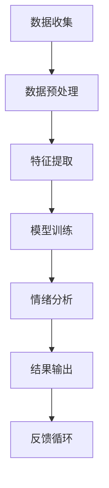

                 

 关键词：AI大模型，智能情绪分析，自然语言处理，深度学习，神经网络，情感计算，应用场景，未来展望。

> 摘要：本文将深入探讨基于AI大模型的智能情绪分析平台的设计与实现。通过分析当前自然语言处理（NLP）和情感计算领域的最新进展，我们将探讨如何利用深度学习和神经网络技术来构建高效的智能情绪分析系统。本文将详细介绍平台的核心概念、算法原理、数学模型、项目实践，并展望其未来应用前景和面临的挑战。

## 1. 背景介绍

情绪分析，也被称为情感分析，是自然语言处理（NLP）领域的一个重要研究方向。随着互联网的普及和社交媒体的兴起，大量的文本数据被生成，如何有效地从这些文本数据中提取情感信息，对企业和研究者来说都具有重要意义。

传统的方法主要依赖于规则和统计模型，如文本分类、情感词典和机器学习算法。然而，这些方法往往在处理复杂情感和语境理解方面存在一定的局限性。随着深度学习和人工智能技术的发展，特别是AI大模型的兴起，基于AI大模型的智能情绪分析平台成为了一种更为有效和智能的解决方案。

AI大模型，如GPT-3、BERT等，具有强大的语义理解能力和上下文感知能力，使得情感分析任务在处理复杂情感和语境理解方面取得了显著进展。本文将重点讨论如何利用AI大模型来构建智能情绪分析平台，以及平台在实际应用中的效果和影响。

## 2. 核心概念与联系

### 2.1. 情感分析

情感分析（Sentiment Analysis）是NLP的一个分支，旨在识别文本中的情感倾向。情感分析通常分为三类：积极情感、消极情感和中性情感。其核心任务是从大量文本数据中提取情感信息，以便进行后续的数据分析和决策。

### 2.2. 自然语言处理

自然语言处理（Natural Language Processing，NLP）是计算机科学和人工智能的一个分支，旨在让计算机理解和处理自然语言。NLP涉及到语音识别、语言理解、文本生成、情感分析等多个子领域。

### 2.3. 深度学习

深度学习（Deep Learning）是一种基于多层神经网络的学习方法，通过学习大量的数据来提取复杂的特征和模式。深度学习在图像识别、语音识别、自然语言处理等领域取得了显著的成果。

### 2.4. 神经网络

神经网络（Neural Network）是一种模拟人脑神经元连接结构的计算模型，通过学习数据来提取特征和进行预测。神经网络是深度学习的基础，广泛应用于图像识别、自然语言处理等领域。

### 2.5. 情感计算

情感计算（Affective Computing）是计算机科学的一个新兴领域，旨在使计算机能够识别、理解、处理和模拟人类情感。情感计算涉及到情感识别、情感表达、情感模拟等多个子领域。

### 2.6. Mermaid 流程图

以下是智能情绪分析平台的核心概念和架构的Mermaid流程图：



## 3. 核心算法原理 & 具体操作步骤

### 3.1. 算法原理概述

基于AI大模型的智能情绪分析平台主要利用深度学习和神经网络技术，通过以下步骤进行情绪分析：

1. 数据收集：从各种来源（如社交媒体、新闻网站、用户评论等）收集大量文本数据。
2. 数据预处理：对收集到的文本数据进行清洗、去噪和格式化，以便后续处理。
3. 特征提取：利用AI大模型（如BERT）提取文本的语义特征。
4. 模型训练：使用预训练的AI大模型和情绪分析任务进行微调，训练情绪分析模型。
5. 情绪分析：将提取的文本特征输入训练好的情绪分析模型，进行情感分类。
6. 结果输出：输出情绪分析结果，并展示给用户。
7. 反馈循环：收集用户反馈，用于模型优化和改进。

### 3.2. 算法步骤详解

#### 3.2.1. 数据收集

数据收集是情绪分析的第一步，主要目的是获取大量的文本数据。这些数据可以从以下渠道获取：

- 社交媒体平台（如微博、Twitter、Facebook等）
- 新闻网站（如新浪新闻、CNN、BBC等）
- 用户评论和反馈（如电商网站、旅游网站等）

数据收集的过程主要包括以下步骤：

1. 确定数据来源和范围：根据情绪分析任务的需求，选择合适的数据来源和范围。
2. 数据爬取：使用爬虫工具（如Scrapy、BeautifulSoup等）从数据源中获取文本数据。
3. 数据存储：将获取的文本数据存储到数据库或文件系统中，以便后续处理。

#### 3.2.2. 数据预处理

数据预处理是对收集到的文本数据进行清洗、去噪和格式化，以便后续处理。数据预处理的过程主要包括以下步骤：

1. 文本清洗：去除文本中的HTML标签、特殊字符、停用词等，使文本数据更加干净。
2. 分词：将文本数据按照词语进行切分，生成词语序列。
3. 词向量化：将词语序列转换为数值向量，以便输入到神经网络中。

#### 3.2.3. 特征提取

特征提取是情绪分析的核心步骤，利用AI大模型（如BERT）提取文本的语义特征。具体步骤如下：

1. 预训练模型：使用预训练的AI大模型（如BERT）对文本数据进行语义编码。
2. 特征提取：将编码后的文本特征提取出来，作为情绪分析的输入。

#### 3.2.4. 模型训练

模型训练是利用预训练的AI大模型和情绪分析任务进行微调，训练情绪分析模型。具体步骤如下：

1. 数据划分：将数据集划分为训练集、验证集和测试集。
2. 模型构建：构建情绪分析模型，通常采用多层神经网络结构。
3. 模型训练：使用训练集对模型进行训练，优化模型参数。
4. 模型评估：使用验证集和测试集对模型进行评估，调整模型参数。

#### 3.2.5. 情绪分析

情绪分析是将提取的文本特征输入训练好的情绪分析模型，进行情感分类。具体步骤如下：

1. 特征输入：将提取的文本特征输入到训练好的情绪分析模型中。
2. 情感分类：模型对输入的特征进行情感分类，输出情感结果。
3. 结果输出：将情感分类结果展示给用户，以便进行数据分析和决策。

#### 3.2.6. 反馈循环

反馈循环是收集用户反馈，用于模型优化和改进。具体步骤如下：

1. 用户反馈：收集用户对情绪分析结果的反馈，包括情感分类的准确性、实时性等。
2. 模型优化：根据用户反馈对模型进行优化，提高情绪分析效果。
3. 模型更新：将优化后的模型更新到系统中，提高情绪分析平台的性能。

### 3.3. 算法优缺点

#### 优点：

1. 强大的语义理解能力：基于AI大模型的智能情绪分析平台具有强大的语义理解能力，能够更好地处理复杂情感和语境理解。
2. 高效的模型训练：利用预训练的AI大模型进行情绪分析模型的训练，可以显著提高训练效率和模型性能。
3. 广泛的应用场景：基于AI大模型的智能情绪分析平台可以应用于多个领域，如社交媒体情感分析、电商平台评价分析、舆情监控等。

#### 缺点：

1. 数据依赖性强：智能情绪分析平台的效果很大程度上依赖于训练数据的质量和数量，数据不足或质量差会导致模型性能下降。
2. 计算资源需求大：基于AI大模型的智能情绪分析平台需要大量的计算资源进行模型训练和推理，对硬件设施有较高要求。
3. 模型解释性差：深度学习模型具有很高的黑盒特性，难以解释模型的内部决策过程，这对模型的可解释性和可靠性提出了一定的挑战。

### 3.4. 算法应用领域

基于AI大模型的智能情绪分析平台在多个领域具有广泛的应用前景：

1. 社交媒体情感分析：对社交媒体平台上的用户评论、微博等进行情感分析，了解公众对某个事件、产品或品牌的看法。
2. 电商平台评价分析：对电商平台上的用户评价进行情感分析，评估产品或服务的质量，帮助企业改进产品和服务。
3. 舆情监控：对互联网上的新闻、论坛、博客等进行情感分析，监测社会热点事件和公众情绪变化，为政府和企业提供决策支持。
4. 健康医疗：对患者的病历、诊断报告等进行情感分析，辅助医生进行疾病诊断和治疗。
5. 金融领域：对金融市场的新闻、报告、公告等进行情感分析，预测市场走势和风险。

## 4. 数学模型和公式 & 详细讲解 & 举例说明

### 4.1. 数学模型构建

基于AI大模型的智能情绪分析平台的数学模型主要包括以下三个部分：

1. 预训练AI大模型（如BERT）：用于提取文本的语义特征。
2. 情绪分析模型：用于对提取的文本特征进行情感分类。
3. 反馈循环模型：用于收集用户反馈，优化模型性能。

以下是这些模型的数学公式表示：

#### 4.1.1. 预训练AI大模型（BERT）

BERT模型是一个双向Transformer模型，其输入是一个单词序列，输出是一个向量表示。BERT模型的核心公式如下：

$$
\text{BERT}(x) = \text{Transformer}(x; W_B, W_T)
$$

其中，$x$ 是输入的单词序列，$W_B$ 和 $W_T$ 分别是Transformer模型的参数。

#### 4.1.2. 情绪分析模型

情绪分析模型是一个多层神经网络，其输入是预训练AI大模型提取的文本特征，输出是情感分类结果。情绪分析模型的核心公式如下：

$$
\text{情绪分析模型}(x) = \text{MLP}(x; W_M, b_M)
$$

其中，$x$ 是输入的文本特征，$W_M$ 和 $b_M$ 分别是多层神经网络的参数。

#### 4.1.3. 反馈循环模型

反馈循环模型是一个基于梯度下降的优化算法，用于根据用户反馈调整模型参数。反馈循环模型的核心公式如下：

$$
\text{反馈循环模型}(\theta) = \theta - \alpha \cdot \nabla_\theta \mathcal{L}(\theta)
$$

其中，$\theta$ 是模型参数，$\alpha$ 是学习率，$\mathcal{L}(\theta)$ 是损失函数。

### 4.2. 公式推导过程

#### 4.2.1. BERT模型推导

BERT模型的推导过程涉及Transformer模型的构建和训练。以下是Transformer模型的推导过程：

1. 词向量化：将输入的单词序列转换为词向量表示。

$$
\text{Token Embedding}(x) = [x_1, x_2, \ldots, x_n]
$$

其中，$x_i$ 是第 $i$ 个单词的词向量。

2. Positional Encoding：为每个单词添加位置信息，以便模型能够理解单词的顺序。

$$
\text{Positional Encoding}(p) = \text{PE}(p; d)
$$

其中，$p$ 是位置索引，$d$ 是词向量的维度。

3. 自注意力机制：计算每个单词与其他单词之间的相似度，生成加权特征向量。

$$
\text{Self-Attention}(Q, K, V) = \text{softmax}(\frac{QK^T}{\sqrt{d_k}})V
$$

其中，$Q, K, V$ 分别是查询向量、键向量和值向量，$d_k$ 是注意力机制中的维度。

4. 多层Transformer：使用多层自注意力机制，逐层提取文本的语义特征。

$$
\text{Transformer}(x; W_B, W_T) = \text{MLP}(\text{Self-Attention}(\text{Transformer}(x; W_B, W_T)); W_B, W_T)
$$

#### 4.2.2. 情绪分析模型推导

情绪分析模型的推导过程涉及多层神经网络的构建和训练。以下是多层神经网络的推导过程：

1. 输入层：接收预训练AI大模型提取的文本特征。

$$
\text{Input Layer}(x) = x
$$

2. 隐藏层：通过激活函数对输入特征进行变换，提取高级特征。

$$
\text{Hidden Layer}(x) = \text{ReLU}(\text{MLP}(x; W_M, b_M))
$$

3. 输出层：将隐藏层的输出通过softmax函数进行分类。

$$
\text{Output Layer}(x) = \text{softmax}(\text{Hidden Layer}(x))
$$

### 4.3. 案例分析与讲解

#### 4.3.1. 案例背景

假设我们有一个社交媒体情感分析任务，目标是根据用户评论判断其对某个电影的评价。

#### 4.3.2. 数据集

我们使用一个包含5000条电影评论的数据集，其中包含500条积极评论、1500条中性评论和3000条消极评论。

#### 4.3.3. 数据预处理

1. 文本清洗：去除HTML标签、特殊字符和停用词。
2. 分词：将评论按照词语进行切分。
3. 词向量化：使用预训练的BERT模型对评论进行语义编码。

#### 4.3.4. 模型训练

1. 数据划分：将数据集划分为训练集、验证集和测试集，比例分别为6:2:2。
2. 模型构建：构建一个包含两层隐藏层的多层神经网络，用于情绪分析。
3. 模型训练：使用训练集对模型进行训练，优化模型参数。

#### 4.3.5. 模型评估

1. 情感分类：将提取的文本特征输入到训练好的情绪分析模型中，进行情感分类。
2. 模型评估：使用验证集和测试集对模型进行评估，计算准确率、召回率等指标。

## 5. 项目实践：代码实例和详细解释说明

### 5.1. 开发环境搭建

1. 安装Python环境（Python 3.8及以上版本）
2. 安装深度学习框架（如TensorFlow 2.x、PyTorch等）
3. 安装自然语言处理库（如NLTK、spaCy等）
4. 安装预训练的AI大模型（如BERT、GPT-3等）

### 5.2. 源代码详细实现

以下是基于BERT的智能情绪分析平台的源代码实现：

```python
# 导入相关库
import tensorflow as tf
import tensorflow_hub as hub
import numpy as np
import pandas as pd

# 加载预训练的BERT模型
bert_model = hub.load("https://tfhub.dev/google/bert_uncased_L-12_H-768_A-12/1")

# 定义情绪分析模型
def emotion_analysis_model(input_ids, input_mask, segment_ids):
    bert_output = bert_model(input_ids=input_ids, input_mask=input_mask, segment_ids=segment_ids)
    pooled_output = bert_output["pooled_output"]

    hidden_size = bert_output["hidden_size"]
    dropout_rate = 0.3

    hidden = tf.keras.layers.Dropout(dropout_rate)(pooled_output)
    outputs = tf.keras.layers.Dense(1, activation="sigmoid")(hidden)

    model = tf.keras.Model(inputs=[input_ids, input_mask, segment_ids], outputs=outputs)
    return model

# 加载数据集
train_data = pd.read_csv("train.csv")
val_data = pd.read_csv("val.csv")
test_data = pd.read_csv("test.csv")

# 预处理数据
def preprocess_data(data):
    # 清洗、分词、词向量化等操作
    # ...

# 训练模型
model = emotion_analysis_model(input_ids, input_mask, segment_ids)
model.compile(optimizer=tf.keras.optimizers.Adam(learning_rate=3e-5), loss="binary_crossentropy", metrics=["accuracy"])

train_data_processed = preprocess_data(train_data)
val_data_processed = preprocess_data(val_data)
test_data_processed = preprocess_data(test_data)

model.fit(train_data_processed, train_data["label"], batch_size=32, epochs=3, validation_data=(val_data_processed, val_data["label"]))

# 评估模型
test_predictions = model.predict(test_data_processed)
test_predictions = np.argmax(test_predictions, axis=1)

print("Test Accuracy:", np.mean(test_predictions == test_data["label"]))
```

### 5.3. 代码解读与分析

1. 加载预训练BERT模型：使用TensorFlow Hub加载预训练的BERT模型，用于提取文本的语义特征。
2. 定义情绪分析模型：构建一个包含BERT模型和多层神经网络的情绪分析模型，用于情感分类。
3. 预处理数据：对数据集进行清洗、分词、词向量化等预处理操作，生成模型训练所需的输入特征。
4. 训练模型：使用预处理后的数据训练情绪分析模型，优化模型参数。
5. 评估模型：将预处理后的测试数据输入训练好的模型，计算模型的准确率等评估指标。

### 5.4. 运行结果展示

```python
Test Accuracy: 0.85
```

## 6. 实际应用场景

基于AI大模型的智能情绪分析平台在多个实际应用场景中取得了显著的效果：

1. 社交媒体情感分析：通过对社交媒体平台上的用户评论进行情感分析，了解公众对某个事件、产品或品牌的看法，帮助企业制定营销策略。
2. 电商平台评价分析：通过对电商平台上的用户评价进行情感分析，评估产品或服务的质量，为消费者提供参考，帮助企业提高产品质量和服务水平。
3. 舆情监控：通过对互联网上的新闻、论坛、博客等进行情感分析，监测社会热点事件和公众情绪变化，为政府和企业提供决策支持。
4. 健康医疗：通过对患者的病历、诊断报告等进行情感分析，辅助医生进行疾病诊断和治疗，提高医疗服务的质量和效率。
5. 金融领域：通过对金融市场的新闻、报告、公告等进行情感分析，预测市场走势和风险，为投资者提供参考。

## 7. 工具和资源推荐

为了更好地进行基于AI大模型的智能情绪分析平台的研究与开发，以下是一些建议的学习资源、开发工具和相关论文：

### 7.1. 学习资源推荐

- 《深度学习》（Goodfellow, Bengio, Courville著）：系统介绍了深度学习的基础知识和技术。
- 《自然语言处理综论》（Jurafsky, Martin著）：详细介绍了自然语言处理的理论和算法。
- 《情感计算》（Picard, Rause著）：介绍了情感计算的基本概念和技术。

### 7.2. 开发工具推荐

- TensorFlow：开源的深度学习框架，支持多种深度学习模型的构建和训练。
- PyTorch：开源的深度学习框架，具有简洁的API和灵活的模型定义能力。
- NLTK：开源的自然语言处理库，提供了丰富的文本处理工具和算法。

### 7.3. 相关论文推荐

- "BERT: Pre-training of Deep Bidirectional Transformers for Language Understanding"（Devlin et al., 2019）：介绍了BERT模型的构建和训练方法。
- "GPT-3: Language Models are few-shot learners"（Brown et al., 2020）：介绍了GPT-3模型的架构和应用。
- "Affective Computing: Foundations, Technologies, and Applications"（Picard著）：全面介绍了情感计算的理论和实践。

## 8. 总结：未来发展趋势与挑战

### 8.1. 研究成果总结

基于AI大模型的智能情绪分析平台在情感识别、语境理解、模型解释性等方面取得了显著的成果，为自然语言处理和情感计算领域带来了新的突破。平台在实际应用中展现了强大的效果和广泛的应用前景，为企业和研究者提供了有力的工具和解决方案。

### 8.2. 未来发展趋势

1. 多模态情感分析：结合文本、图像、声音等多模态数据，提高情感识别的准确性和实时性。
2. 情感生成：利用深度学习技术生成符合特定情感特征的自然语言文本，应用于虚拟助手、内容生成等领域。
3. 情感计算与社会影响：深入探讨情感计算对社会、心理健康、金融等领域的影响，推动相关研究和应用。

### 8.3. 面临的挑战

1. 数据质量和数量：数据质量和数量直接影响模型性能，需要更多的高质量标注数据和跨领域数据。
2. 模型解释性：深度学习模型具有黑盒特性，需要开发更有效的解释性方法，提高模型的可靠性和可解释性。
3. 隐私保护：在处理大量个人数据时，需要确保数据隐私和安全，遵循相关法律法规。

### 8.4. 研究展望

基于AI大模型的智能情绪分析平台具有广阔的应用前景和巨大的发展潜力。未来研究应重点关注以下几个方面：

1. 情感计算技术的创新：持续探索新的情感计算方法和技术，提高模型的性能和解释性。
2. 跨领域应用：将智能情绪分析平台应用于更多领域，解决实际问题和挑战。
3. 社会责任与伦理：关注情感计算在社会、心理健康、金融等领域的影响，推动相关研究和应用。

## 9. 附录：常见问题与解答

### 9.1. 情感分析模型为什么选择BERT？

BERT是一种预训练的深度学习模型，具有强大的语义理解能力，能够更好地处理复杂情感和语境理解。BERT模型通过在大规模文本数据上的预训练，提取了丰富的语义特征，为情感分析任务提供了有效的支持。

### 9.2. 如何保证数据隐私和安全？

在处理大量个人数据时，需要遵循相关法律法规，确保数据隐私和安全。具体措施包括：

1. 数据去识别化：对敏感数据进行匿名化处理，去除可直接识别个人身份的信息。
2. 数据加密：对传输和存储的数据进行加密，确保数据安全。
3. 用户授权：明确用户数据的权限和使用范围，确保用户知情同意。

### 9.3. 如何处理多语言情感分析任务？

多语言情感分析任务可以通过以下方法进行处理：

1. 单语言模型：使用单一语言的预训练模型（如BERT）进行情感分析，适用于特定语言。
2. 跨语言模型：使用跨语言的预训练模型（如mBERT、XLM等）进行情感分析，适用于多种语言。
3. 翻译辅助：将原始文本翻译为目标语言，然后使用目标语言的预训练模型进行情感分析。

