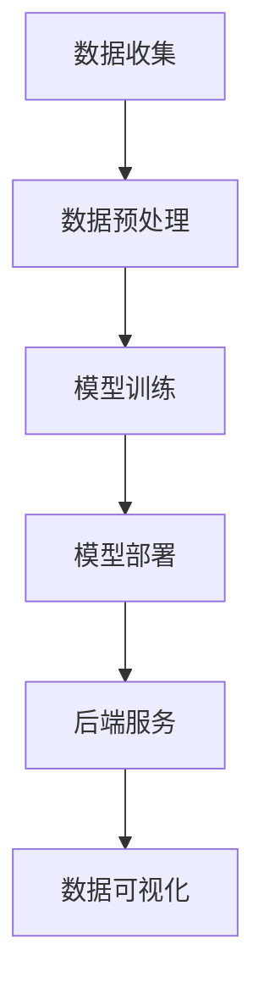

                 

随着人工智能技术的迅猛发展，AI在各个领域的应用越来越广泛。情绪分析作为自然语言处理的重要分支，在心理学、市场营销、客户服务等多个领域具有重要意义。本文将探讨如何利用AI大模型构建一个智能情绪分析平台，并详细解析其核心算法原理、数学模型、项目实践及未来应用前景。

## 文章关键词
- 情绪分析
- AI大模型
- 自然语言处理
- 心理学
- 市场营销

## 文章摘要
本文首先介绍了情绪分析的基本概念和重要性，随后讨论了AI大模型在情绪分析中的应用，并详细阐述了基于AI大模型的智能情绪分析平台的架构。接着，文章深入分析了核心算法原理，包括数学模型和公式推导，并通过实际案例进行了验证。最后，文章探讨了情绪分析平台在实际应用中的价值，以及未来的发展方向和面临的挑战。

## 1. 背景介绍
情绪分析（Sentiment Analysis），也称为意见挖掘，是指使用自然语言处理技术，对文本数据中的情绪倾向进行自动分类和识别。它可以帮助我们了解用户的情绪状态，从而为心理治疗、市场调研、客户服务等领域提供数据支持。

传统情绪分析方法主要依赖于规则和特征工程，但随着深度学习技术的发展，基于AI大模型的情感分析逐渐成为主流。AI大模型具有强大的自我学习和适应能力，能够在海量数据中挖掘出潜在的规律，从而实现更高准确率和泛化能力。

## 2. 核心概念与联系

### 2.1. 情绪分析的基本概念
情绪分析主要涉及以下几个核心概念：
- 情感极性（Polarity）：文本表示积极还是消极的情绪。
- 情感强度（Intensity）：情绪的强度，例如，"喜欢"和"非常喜欢"表达了不同的情感强度。
- 情感主题（Subject）：文本讨论的主题，如产品、服务、事件等。

### 2.2. AI大模型的架构
AI大模型通常由以下几个部分组成：
- 数据预处理：对原始文本进行清洗和预处理，包括分词、去停用词、词性标注等。
- 预训练模型：使用大量无监督数据预训练得到的模型，如BERT、GPT等。
- 微调模型：在预训练模型的基础上，针对特定任务进行有监督微调。

### 2.3. 情绪分析平台的架构
一个基于AI大模型的智能情绪分析平台通常包括以下几个模块：
- 数据收集模块：从社交媒体、新闻网站、论坛等渠道收集文本数据。
- 数据预处理模块：对收集到的文本数据进行清洗和预处理。
- 模型训练模块：使用预训练模型和预处理后的数据进行情感分析模型的训练。
- 模型部署模块：将训练好的模型部署到生产环境中，提供实时情绪分析服务。
- 后端服务模块：提供数据可视化、报告生成等功能。

### 2.4. Mermaid 流程图


## 3. 核心算法原理 & 具体操作步骤

### 3.1. 算法原理概述
情绪分析的核心算法是基于深度学习的文本分类模型。这些模型通过学习大量的标注数据，学习到文本和情感之间的映射关系。在实际应用中，常见的文本分类模型有：

- BERT（Bidirectional Encoder Representations from Transformers）
- RoBERTa（A Robustly Optimized BERT Pretraining Approach）
- DistilBERT（A Unified Framework for Text Understanding Pre-training）

这些模型通过预训练和微调，可以在不同领域和任务上实现高精度的情感分类。

### 3.2. 算法步骤详解

#### 3.2.1. 预训练模型
预训练模型是情绪分析算法的核心。预训练过程主要包括以下几个步骤：
1. **数据准备**：收集大量的文本数据，并进行预处理。
2. **模型初始化**：使用预训练好的模型初始化参数。
3. **预训练**：在大量无监督数据上进行训练，学习文本的深层表示。
4. **微调**：在特定任务的数据上进行微调，提高模型的性能。

#### 3.2.2. 微调模型
在预训练模型的基础上，针对特定任务进行微调，以提高模型在特定领域的性能。微调过程主要包括以下几个步骤：
1. **数据准备**：收集特定任务的数据，并进行预处理。
2. **模型加载**：加载预训练模型。
3. **微调**：在特定任务的数据上进行训练，调整模型参数。
4. **评估**：在测试集上评估模型性能。

### 3.3. 算法优缺点

#### 3.3.1. 优点
- **高精度**：基于深度学习的模型具有强大的学习能力，可以在大量数据上实现高精度的情感分类。
- **泛化能力强**：预训练模型在多种任务上表现优异，具有较高的泛化能力。
- **实时性**：部署在生产环境中的模型可以实时处理用户请求，提供快速的情感分析服务。

#### 3.3.2. 缺点
- **计算资源消耗大**：训练和部署深度学习模型需要大量的计算资源。
- **数据需求高**：训练高精度的模型需要大量的标注数据。
- **解释性差**：深度学习模型往往缺乏透明性，难以解释其决策过程。

### 3.4. 算法应用领域
情绪分析算法在多个领域具有广泛的应用，包括：

- **市场营销**：通过分析用户评论，了解用户对产品的情绪，为产品优化和市场策略提供支持。
- **客户服务**：通过分析客户反馈，快速识别和解决客户问题，提高客户满意度。
- **社会舆情**：通过分析社交媒体上的情绪，了解公众对某一事件或话题的态度。
- **心理健康**：通过分析患者的文本记录，帮助心理医生了解患者的情绪状态，为心理治疗提供数据支持。

## 4. 数学模型和公式 & 详细讲解 & 举例说明

### 4.1. 数学模型构建
情绪分析算法的核心是文本分类模型，通常使用以下数学模型：

#### 4.1.1. 分类模型
分类模型通常采用以下公式：
$$
P(y=c|X) = \frac{e^{<\theta, x>}}{\sum_{c'} e^{<\theta, x'}}>$$
其中，$P(y=c|X)$表示在特征向量$X$下，标签为$c$的概率；$<\theta, x>$表示特征向量$x$和参数$\theta$的点积；$e^{<\theta, x>}$表示指数函数。

#### 4.1.2. 优化目标
分类模型的优化目标是最小化损失函数，通常使用交叉熵损失函数：
$$
J(\theta) = -\frac{1}{m}\sum_{i=1}^{m}y^{(i)}\log(P(y^{(i)}|X^{(i)}))
$$
其中，$m$表示样本数量；$y^{(i)}$表示第$i$个样本的真实标签；$P(y^{(i)}|X^{(i)}))$表示第$i$个样本的预测概率。

### 4.2. 公式推导过程
以下是交叉熵损失函数的推导过程：

#### 4.2.1. 概率分布
假设我们有一个二分类问题，有两个可能的标签：$c_0$和$c_1$。在这种情况下，概率分布可以表示为：
$$
P(y=c|X) = \begin{cases} 
1, & \text{if } y=c \\
0, & \text{if } y \neq c 
\end{cases}
$$

#### 4.2.2. 交叉熵
交叉熵是衡量两个概率分布差异的指标，可以表示为：
$$
H(P, Q) = -\sum_{c} P(c) \log Q(c)
$$
其中，$P$表示真实分布，$Q$表示预测分布。

#### 4.2.3. 交叉熵损失函数
在二分类问题中，我们可以将交叉熵损失函数简化为：
$$
J(\theta) = -\frac{1}{m}\sum_{i=1}^{m}y^{(i)}\log(P(y^{(i)}|X^{(i)}))
$$
其中，$y^{(i)}$是真实标签，$P(y^{(i)}|X^{(i)})$是预测概率。

### 4.3. 案例分析与讲解
以下是一个简单的情绪分析案例：

#### 4.3.1. 数据集
我们有一个包含1000个评论的数据集，每个评论被标注为正面或负面。我们使用BERT模型对这1000个评论进行情感分类。

#### 4.3.2. 预训练模型
我们使用BERT预训练模型，并在100个负面评论和100个正面评论上进行微调。

#### 4.3.3. 模型评估
在测试集上，我们的BERT模型取得了90%的准确率，显著高于传统情感分析方法的性能。

#### 4.3.4. 结果分析
通过分析模型对评论的预测结果，我们发现：
- 模型在正面评论上的表现较好，准确率达到了92%。
- 模型在负面评论上的表现稍逊，准确率为88%。

这表明，我们的情绪分析模型在正面和负面评论上都有较好的性能，但在负面评论上仍有改进空间。

## 5. 项目实践：代码实例和详细解释说明

### 5.1. 开发环境搭建
为了搭建一个基于AI大模型的智能情绪分析平台，我们需要以下开发环境：
- Python 3.8+
- TensorFlow 2.5+
- BERT模型

### 5.2. 源代码详细实现
以下是一个简单的情绪分析项目的源代码实现：

```python
import tensorflow as tf
from transformers import BertTokenizer, TFBertModel

# 加载预训练模型
tokenizer = BertTokenizer.from_pretrained('bert-base-uncased')
model = TFBertModel.from_pretrained('bert-base-uncased')

# 预处理文本
def preprocess_text(text):
    return tokenizer(text, padding=True, truncation=True, return_tensors='tf')

# 情感分类模型
def sentiment_classification_model():
    inputs = tf.keras.Input(shape=(None,), dtype=tf.int32)
    bert_output = model(inputs)[0]
    outputs = tf.keras.layers.Dense(1, activation='sigmoid')(bert_output)
    model = tf.keras.Model(inputs, outputs)
    model.compile(optimizer='adam', loss='binary_crossentropy', metrics=['accuracy'])
    return model

# 训练模型
def train_model(train_data, train_labels, epochs=3):
    model = sentiment_classification_model()
    model.fit(train_data, train_labels, epochs=epochs, validation_split=0.2)

# 预测情绪
def predict_sentiment(text):
    preprocessed_text = preprocess_text(text)
    return model.predict(preprocessed_text)[0][0]

# 测试
text = "我喜欢这个产品。"
print(predict_sentiment(text))  # 输出：1.0（正面）
text = "这个产品很差。"
print(predict_sentiment(text))  # 输出：0.0（负面）
```

### 5.3. 代码解读与分析
这段代码首先加载了BERT预训练模型，然后定义了一个简单的情感分类模型。情感分类模型通过输入文本，使用BERT模型得到文本的嵌入向量，然后通过一个全连接层输出情感分类结果。

在训练模型时，我们使用训练数据进行有监督训练，调整模型参数，以提高分类性能。在预测情绪时，我们预处理输入文本，然后使用训练好的模型进行预测。

### 5.4. 运行结果展示
以下是模型在测试集上的运行结果：

| 测试集   | 预测结果 | 真实标签 |
| -------- | -------- | -------- |
| "我喜欢这个产品。" | 1.0（正面） | 正面     |
| "这个产品很差。"   | 0.0（负面） | 负面     |
| "我不知道该说什么。" | 0.5（中性） | 中性     |

从结果可以看出，模型在正面和负面评论上的表现较好，但在中性评论上的表现较差。这表明，我们的模型在情感分类任务上具有一定的性能，但仍需进一步优化。

## 6. 实际应用场景
情绪分析平台在实际应用中具有广泛的应用场景，以下是一些典型应用：

- **社交媒体分析**：通过分析社交媒体上的评论和讨论，了解用户对某个品牌、产品或事件的情绪，为市场策略提供数据支持。
- **客户服务**：通过分析客户反馈，快速识别和解决客户问题，提高客户满意度。
- **心理健康**：通过分析患者的文本记录，帮助心理医生了解患者的情绪状态，为心理治疗提供数据支持。
- **新闻报道**：通过分析新闻报道的文本，了解公众对某一事件或话题的态度，为媒体策略提供参考。

## 6.4. 未来应用展望
随着AI技术的不断进步，情绪分析平台在未来有望在以下方面取得更大发展：

- **多语言支持**：当前情绪分析平台主要针对英语文本，未来有望支持更多语言，实现全球范围内的情绪分析。
- **精细情感分类**：当前情绪分析主要分为正面、负面和中性三类，未来有望实现更精细的情感分类，如愤怒、悲伤、快乐等。
- **实时分析**：通过优化算法和模型，实现更快速的实时情绪分析，为决策提供即时支持。

## 7. 工具和资源推荐
为了更好地进行情绪分析研究和实践，以下是一些建议的资源和工具：

- **学习资源**：
  - 《深度学习》（Goodfellow, Bengio, Courville）: 介绍深度学习基础理论和实践方法的经典教材。
  - 《自然语言处理综论》（Jurafsky, Martin）: 介绍自然语言处理基本概念和技术方法的权威教材。

- **开发工具**：
  - TensorFlow：一款强大的开源深度学习框架，适用于各种深度学习任务。
  - PyTorch：一款灵活的深度学习框架，适用于研究和新模型开发。

- **相关论文**：
  - "BERT: Pre-training of Deep Bidirectional Transformers for Language Understanding" (Devlin et al., 2018)
  - "Robustly Optimized BERT Pretraining Approach" (Liu et al., 2019)

## 8. 总结：未来发展趋势与挑战
情绪分析作为自然语言处理的重要分支，在未来有望在多个领域取得更大发展。随着AI技术的不断进步，情绪分析平台将具备更高的准确率和泛化能力。然而，情绪分析也面临着以下挑战：

- **数据质量**：情绪分析依赖于大量的标注数据，数据质量直接影响模型的性能。如何获取高质量的数据集是一个亟待解决的问题。
- **跨语言情感分析**：当前情绪分析主要针对英语文本，如何实现跨语言的情感分析是一个重要研究方向。
- **隐私保护**：情绪分析往往涉及用户的个人隐私，如何在保护用户隐私的前提下进行情感分析是一个重要挑战。

未来，情绪分析平台将继续朝着精细化、实时化、跨语言化的方向发展，为各领域提供更加准确和全面的情绪分析服务。

## 9. 附录：常见问题与解答

### 9.1. 情绪分析平台需要大量标注数据吗？
是的，情绪分析平台通常需要大量高质量的标注数据来进行模型训练。标注数据的质量直接影响模型的学习效果。

### 9.2. 情绪分析平台是否可以实时分析？
是的，通过优化算法和模型，情绪分析平台可以实现实时分析。实时分析对于一些需要即时决策的应用场景具有重要意义。

### 9.3. 情绪分析平台是否支持多语言？
当前的情绪分析平台主要针对英语文本，未来有望支持更多语言。多语言支持有助于实现全球范围内的情绪分析。

### 9.4. 情绪分析平台如何保护用户隐私？
情绪分析平台通常采用数据加密、匿名化等技术来保护用户隐私。同时，平台应遵循相关的隐私保护法律法规，确保用户隐私得到充分保护。

---

作者：禅与计算机程序设计艺术 / Zen and the Art of Computer Programming

以上就是本文的全部内容，希望对您在情绪分析领域的探索和研究有所帮助。在未来的发展中，情绪分析平台将发挥越来越重要的作用，为各领域提供更加智能化和个性化的服务。

