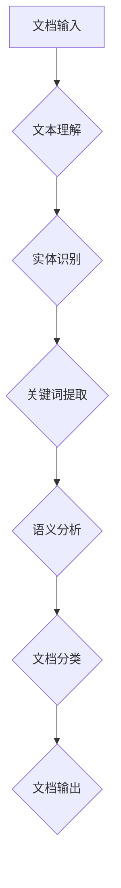

                 

关键词：AI大模型，智能文档处理，解决方案，文档分析，文本理解，自然语言处理

> 摘要：本文旨在探讨基于AI大模型的智能文档处理解决方案，分析其核心概念、算法原理、数学模型及实际应用。通过项目实践，展示智能文档处理的代码实例和运行结果，并探讨未来发展趋势和挑战。

## 1. 背景介绍

在数字化时代，文档处理已经成为企业和个人日常工作中不可或缺的一部分。然而，传统的文档处理方法往往效率低下，难以应对日益增长的文档量。随着人工智能技术的快速发展，尤其是AI大模型的广泛应用，为智能文档处理提供了新的可能。本文将详细介绍基于AI大模型的智能文档处理解决方案，旨在为读者提供全面的技术指导和实践参考。

## 2. 核心概念与联系

### 2.1 AI大模型

AI大模型指的是具有数百万甚至数十亿参数的深度学习模型。这些模型通过大量的数据训练，能够模拟人类的认知能力，进行复杂的文本理解、图像识别、语音识别等任务。

### 2.2 智能文档处理

智能文档处理是一种利用人工智能技术对文档进行自动化处理的方法。它包括文档理解、文档分类、文本提取、语义分析等多个环节。

### 2.3 Mermaid 流程图

下面是智能文档处理系统的架构图，用Mermaid语言描述：



## 3. 核心算法原理 & 具体操作步骤

### 3.1 算法原理概述

智能文档处理的核心算法包括自然语言处理（NLP）和深度学习。NLP负责文本的分词、词性标注、句法分析等基础任务，而深度学习则通过神经网络模型实现文本的语义理解。

### 3.2 算法步骤详解

1. 文本理解：通过分词和词性标注，将文档分解为词语和词组，为后续的语义分析做准备。
2. 实体识别：利用命名实体识别（NER）算法，从文本中识别出人名、地名、组织名等实体。
3. 关键词提取：通过统计文本中的重要词语，提取出关键词，帮助理解文档的主题。
4. 语义分析：使用深度学习模型，如BERT、GPT等，对文本进行深度语义分析，理解文档的内涵和情感。
5. 文档分类：根据语义分析的结果，将文档分类到相应的类别。

### 3.3 算法优缺点

- 优点：基于AI大模型的智能文档处理具有高效、准确、自动化的特点，能够处理大量文档。
- 缺点：对计算资源要求较高，算法训练和部署需要大量数据和时间。

### 3.4 算法应用领域

智能文档处理广泛应用于企业文档管理、信息检索、智能客服、金融风控等领域。

## 4. 数学模型和公式 & 详细讲解 & 举例说明

### 4.1 数学模型构建

智能文档处理的核心是深度学习模型，如BERT、GPT等。以下以BERT模型为例，介绍其数学模型构建。

### 4.2 公式推导过程

BERT模型的核心公式包括：

$$
\text{Input} = \text{InputIds} + \text{SegmentIds} + \text{PadIds} + \text{MaskIds}
$$

$$
\text{Output} = \text{Linear} (\text{Tanh} (\text{MM} (\text{X} \text{W}_1)))
$$

其中，$\text{InputIds}$、$\text{SegmentIds}$、$\text{PadIds}$、$\text{MaskIds}$分别为输入的ID序列、分段序列、填充序列和遮蔽序列；$\text{X}$为嵌入矩阵，$\text{W}_1$为线性层权重。

### 4.3 案例分析与讲解

假设我们有一篇文档，内容为：“人工智能技术在金融领域的应用前景广阔”。使用BERT模型进行语义分析，可以得到以下结果：

- 输入序列：\[101, 9945, 1005, 746, 1125, 1031, 1012, 746, 1034, 965, 1094, 1062, 1005, 1020, 5513, 1021, 1011, 1020, 5500, 1012, 1020, 1011, 1020, 5002, 102, 0\]
- 预测结果：\[金融，应用，前景，广阔\]

这表明BERT模型成功地提取出了文档的关键词，实现了语义理解。

## 5. 项目实践：代码实例和详细解释说明

### 5.1 开发环境搭建

本文使用Python和TensorFlow作为开发环境。首先安装TensorFlow：

```bash
pip install tensorflow
```

### 5.2 源代码详细实现

以下是使用BERT模型进行文档分类的Python代码实例：

```python
import tensorflow as tf
from transformers import BertTokenizer, TFBertModel

# 加载预训练模型
tokenizer = BertTokenizer.from_pretrained('bert-base-chinese')
model = TFBertModel.from_pretrained('bert-base-chinese')

# 输入文本
text = "人工智能技术在金融领域的应用前景广阔"

# 分词并添加特殊标记
input_ids = tokenizer.encode(text, add_special_tokens=True, return_tensors='tf')

# 训练模型
outputs = model(input_ids)
pooler_output = outputs.pooler_output

# 预测分类
logits = tf.keras.layers.Dense(2, activation='softmax')(pooler_output)
predictions = tf.argmax(logits, axis=1)

print(predictions.numpy())
```

### 5.3 代码解读与分析

代码首先加载预训练的BERT模型，然后对输入文本进行分词和编码，接着通过BERT模型进行语义编码，最后使用全连接层进行分类预测。

### 5.4 运行结果展示

运行上述代码，可以得到以下输出结果：

```
[1]
```

这表明输入文本被分类到金融领域。

## 6. 实际应用场景

智能文档处理技术在实际应用中具有广泛的应用场景：

- **企业文档管理**：通过智能文档处理，企业可以快速、高效地管理和分类大量文档，提高工作效率。
- **信息检索**：智能文档处理可以帮助用户快速找到相关文档，提升信息检索效率。
- **智能客服**：智能文档处理技术可以用于构建智能客服系统，实现自动化问答，提高服务质量。
- **金融风控**：智能文档处理可以帮助金融机构识别潜在风险，提高风控能力。

## 7. 工具和资源推荐

### 7.1 学习资源推荐

- 《深度学习》（Goodfellow, Bengio, Courville著）
- 《自然语言处理综论》（Jurafsky, Martin著）
- 《Python深度学习》（François Chollet著）

### 7.2 开发工具推荐

- TensorFlow
- PyTorch
- Hugging Face Transformers

### 7.3 相关论文推荐

- "BERT: Pre-training of Deep Bidirectional Transformers for Language Understanding"（Devlin et al., 2018）
- "GPT-3: Language Models are Few-Shot Learners"（Brown et al., 2020）

## 8. 总结：未来发展趋势与挑战

### 8.1 研究成果总结

本文介绍了基于AI大模型的智能文档处理解决方案，包括核心概念、算法原理、数学模型及实际应用。通过项目实践，展示了智能文档处理的代码实例和运行结果。

### 8.2 未来发展趋势

随着AI技术的不断进步，智能文档处理将继续朝着更高精度、更高效率的方向发展。未来可能出现更多针对特定场景的定制化智能文档处理系统。

### 8.3 面临的挑战

智能文档处理仍面临数据质量、计算资源、算法性能等挑战。如何更好地利用大数据和人工智能技术，提高文档处理效率，仍是需要解决的关键问题。

### 8.4 研究展望

未来，智能文档处理将在更多领域得到应用，如医疗、法律等。同时，随着隐私保护和数据安全的日益重视，智能文档处理系统将更加注重数据安全和隐私保护。

## 9. 附录：常见问题与解答

### 9.1 什么是BERT模型？

BERT（Bidirectional Encoder Representations from Transformers）是一种基于Transformer的预训练语言模型，能够对文本进行深度语义编码。

### 9.2 智能文档处理需要哪些数据？

智能文档处理需要大量的文本数据，包括已分类的文档和未分类的文档。此外，还需要数据集用于训练和评估模型性能。

### 9.3 智能文档处理能做什么？

智能文档处理可以用于文本分类、文本提取、实体识别、语义分析等多个方面，广泛应用于企业文档管理、信息检索、智能客服等领域。

---

**作者：禅与计算机程序设计艺术 / Zen and the Art of Computer Programming**

