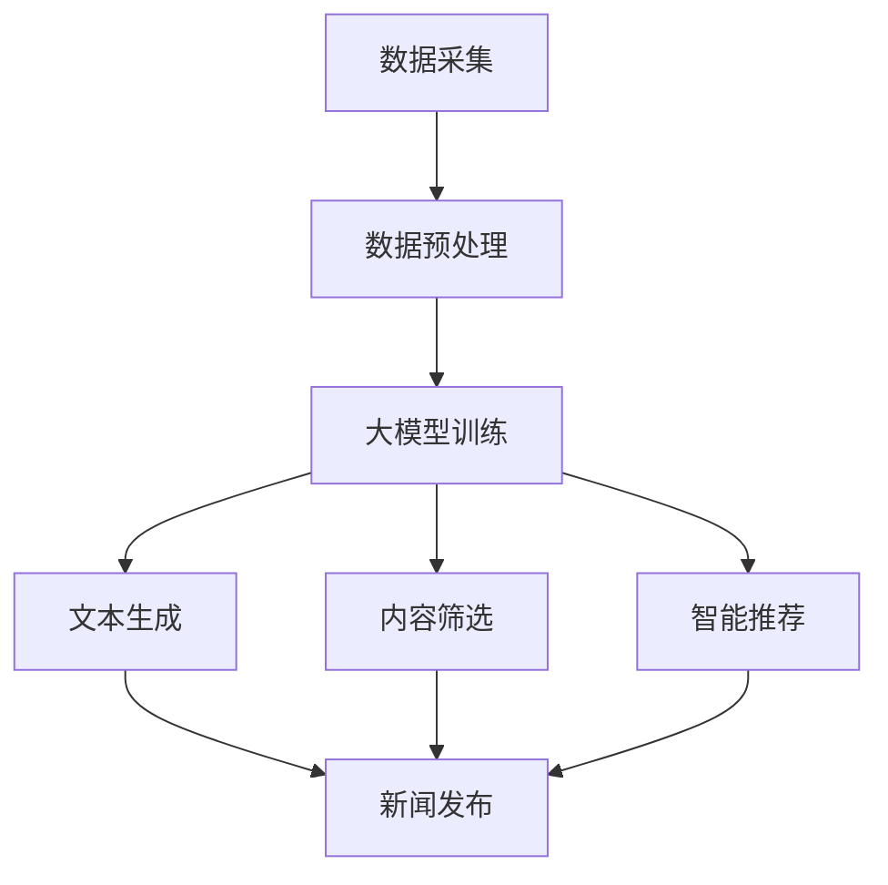

                 

关键词：人工智能，新闻生成，大模型，自然语言处理，机器学习，文本生成，智能推荐，数据挖掘

摘要：本文将探讨基于人工智能（AI）大模型的智能新闻生成系统。通过分析现有技术，介绍核心概念与架构，深入解析核心算法原理、数学模型以及具体操作步骤。同时，通过项目实践和实际应用场景展示，探讨该系统的未来发展趋势与挑战。

## 1. 背景介绍

### 1.1 人工智能与新闻生成的结合

人工智能（AI）技术近年来取得了飞速发展，其在自然语言处理（NLP）、图像识别、语音识别等领域取得了显著成果。特别是在新闻行业，AI技术被广泛应用于新闻自动化生成、智能推荐和内容审核等方面。

新闻生成系统是指利用人工智能技术自动生成新闻内容的一种系统。传统的新闻生成方式主要依赖于人工编辑和撰写，存在效率低下、成本高昂等问题。而随着AI技术的发展，基于AI的大模型新闻生成系统逐渐成为研究热点，有望实现新闻内容的高效自动化生成。

### 1.2 大模型在新闻生成中的应用

大模型是指具有海量参数和强大计算能力的神经网络模型。在新闻生成系统中，大模型的应用主要体现在以下几个方面：

1. **文本生成**：大模型可以生成符合语法规则、逻辑清晰的新闻文本。通过学习海量新闻语料，大模型可以自动生成新闻标题、摘要和正文，实现新闻内容的自动化生成。

2. **内容筛选**：大模型可以对海量的新闻数据进行筛选和分类，提取出有价值的信息。在新闻推荐和内容审核场景中，大模型可以帮助识别虚假新闻、恶意信息等，提高新闻内容的可信度。

3. **智能推荐**：大模型可以根据用户兴趣和行为数据，为用户推荐个性化的新闻内容。通过分析用户历史行为和偏好，大模型可以预测用户可能感兴趣的新闻类型和主题，实现个性化推荐。

## 2. 核心概念与联系

为了更好地理解基于AI大模型的智能新闻生成系统，我们首先需要了解其中的核心概念与联系。下面是核心概念原理和架构的Mermaid流程图（注意：流程节点中不要有括号、逗号等特殊字符）：



### 2.1 数据采集与预处理

数据采集是新闻生成系统的第一步。我们需要从各种渠道获取大量新闻数据，包括新闻网站、社交媒体和新闻报道等。获取到的新闻数据通常包含文本、图片和视频等多媒体信息。

在数据预处理阶段，我们需要对采集到的新闻数据进行清洗、去重和分词等操作。清洗操作包括去除无用信息、纠正错误信息等；去重操作可以避免重复新闻的出现；分词操作是将文本拆分成词序列，为后续处理打下基础。

### 2.2 大模型训练

在数据预处理完成后，我们将处理好的新闻数据用于大模型的训练。大模型通常采用神经网络架构，如循环神经网络（RNN）、长短期记忆网络（LSTM）和变换器（Transformer）等。在训练过程中，大模型通过学习海量新闻数据，自动提取出新闻文本的语义特征和语法规则。

### 2.3 文本生成

文本生成是新闻生成系统的重要功能之一。通过大模型的学习，我们可以生成符合语法规则、逻辑清晰的新闻文本。具体来说，我们可以使用生成对抗网络（GAN）、自注意力机制（Self-Attention）等技术，实现新闻标题、摘要和正文的自动化生成。

### 2.4 内容筛选

内容筛选是确保新闻质量的重要环节。大模型可以根据新闻文本的语义特征和新闻价值，对新闻内容进行筛选和分类。例如，可以识别虚假新闻、恶意信息等，提高新闻内容的可信度。

### 2.5 智能推荐

智能推荐是新闻生成系统的一大亮点。通过分析用户兴趣和行为数据，大模型可以为用户推荐个性化的新闻内容。具体来说，可以使用协同过滤（Collaborative Filtering）、矩阵分解（Matrix Factorization）等技术，实现新闻内容的智能推荐。

### 2.6 新闻发布

在完成文本生成、内容筛选和智能推荐后，我们将生成的新闻文本发布到新闻平台，供用户浏览和阅读。

## 3. 核心算法原理 & 具体操作步骤

### 3.1 算法原理概述

基于AI大模型的智能新闻生成系统主要依赖于深度学习技术。深度学习是一种基于多层的神经网络结构，通过学习大量数据来提取特征和规律。在新闻生成系统中，深度学习模型可以用于文本生成、内容筛选和智能推荐等任务。

具体来说，文本生成任务通常采用生成对抗网络（GAN）或自注意力机制（Self-Attention）等技术；内容筛选任务可以采用循环神经网络（RNN）或长短期记忆网络（LSTM）等；智能推荐任务可以采用协同过滤（Collaborative Filtering）或矩阵分解（Matrix Factorization）等。

### 3.2 算法步骤详解

基于AI大模型的智能新闻生成系统可以分为以下几个主要步骤：

1. **数据采集**：从各种渠道获取新闻数据，包括文本、图片和视频等。

2. **数据预处理**：对采集到的新闻数据进行清洗、去重和分词等操作。

3. **大模型训练**：使用处理好的新闻数据训练深度学习模型，如生成对抗网络（GAN）、自注意力机制（Self-Attention）、循环神经网络（RNN）等。

4. **文本生成**：使用训练好的大模型生成新闻标题、摘要和正文。

5. **内容筛选**：根据新闻文本的语义特征和新闻价值，对新闻内容进行筛选和分类。

6. **智能推荐**：根据用户兴趣和行为数据，为用户推荐个性化的新闻内容。

7. **新闻发布**：将生成的新闻文本发布到新闻平台，供用户浏览和阅读。

### 3.3 算法优缺点

基于AI大模型的智能新闻生成系统具有以下优点：

1. **自动化生成**：通过深度学习模型的学习，可以实现新闻内容的自动化生成，提高新闻生成效率。

2. **个性化推荐**：根据用户兴趣和行为数据，可以为用户推荐个性化的新闻内容，提高用户满意度。

3. **内容筛选**：大模型可以根据新闻文本的语义特征和新闻价值，对新闻内容进行筛选和分类，提高新闻质量。

然而，基于AI大模型的智能新闻生成系统也存在一些缺点：

1. **质量参差不齐**：由于大模型的学习能力和数据质量等因素，生成的新闻内容可能存在质量参差不齐的情况。

2. **数据隐私问题**：在智能推荐过程中，需要收集用户的行为数据，可能涉及用户隐私问题。

3. **计算资源消耗**：大模型的训练和推理过程需要大量的计算资源，对硬件设备有较高要求。

### 3.4 算法应用领域

基于AI大模型的智能新闻生成系统可以应用于以下领域：

1. **新闻媒体**：自动化生成新闻内容，提高新闻生产效率。

2. **新闻推荐**：根据用户兴趣和行为数据，为用户推荐个性化的新闻内容。

3. **内容审核**：识别虚假新闻、恶意信息等，提高新闻内容可信度。

4. **智能助理**：为用户提供智能化的新闻资讯，提高用户体验。

## 4. 数学模型和公式 & 详细讲解 & 举例说明

### 4.1 数学模型构建

在基于AI大模型的智能新闻生成系统中，数学模型主要涉及以下几个方面：

1. **文本生成模型**：包括生成对抗网络（GAN）、自注意力机制（Self-Attention）等。

2. **内容筛选模型**：包括循环神经网络（RNN）、长短期记忆网络（LSTM）等。

3. **智能推荐模型**：包括协同过滤（Collaborative Filtering）、矩阵分解（Matrix Factorization）等。

### 4.2 公式推导过程

以下是生成对抗网络（GAN）的数学模型推导：

GAN由生成器（Generator）和判别器（Discriminator）两个神经网络组成。生成器的目标是生成与真实数据分布相近的伪数据，判别器的目标是判断输入数据是真实数据还是伪数据。

#### 生成器（Generator）：

生成器的输入为随机噪声 \(z\)，输出为伪数据 \(G(z)\)。其目标是最大化判别器的输出概率：

$$
G(z) = \arg\max_{G} E_{x \sim p_{data}(x)}[D(x)] - E_{z \sim p_{z}(z)}[D(G(z))]
$$

其中，\(D(x)\) 表示判别器判断输入数据 \(x\) 为真实数据的概率。

#### 判别器（Discriminator）：

判别器的目标是最大化判别器输出与真实数据分布的一致性：

$$
D(x) = \arg\max_{D} E_{x \sim p_{data}(x)}[D(x)] + E_{z \sim p_{z}(z)}[-D(G(z))]
$$

其中，\(D(G(z))\) 表示判别器判断输入数据 \(G(z)\) 为伪数据的概率。

### 4.3 案例分析与讲解

#### 文本生成案例：

假设我们要使用自注意力机制（Self-Attention）生成一篇新闻摘要。给定一篇新闻文本，我们首先将其表示为一个词序列 \(x = \{w_1, w_2, \ldots, w_n\}\)。

自注意力机制的数学模型可以表示为：

$$
\text{Attention}(Q, K, V) = \text{softmax}\left(\frac{QK^T}{\sqrt{d_k}}\right)V
$$

其中，\(Q, K, V\) 分别表示查询向量、关键向量和价值向量，\(d_k\) 表示关键向量的维度。

在文本生成过程中，我们首先将输入文本表示为查询向量 \(Q\)，然后利用自注意力机制计算文本中各个词之间的关联性。通过这种关联性，我们可以生成一篇摘要，摘要中的每个词都是基于输入文本中其他词生成的。

例如，给定输入文本：“本文介绍了基于AI大模型的智能新闻生成系统”，我们可以使用自注意力机制生成摘要：“本文介绍了AI大模型和智能新闻生成系统”。

#### 内容筛选案例：

假设我们要使用循环神经网络（RNN）对新闻内容进行筛选。给定一篇新闻文本，我们首先将其表示为一个词序列 \(x = \{w_1, w_2, \ldots, w_n\}\)。

循环神经网络（RNN）的数学模型可以表示为：

$$
h_t = \sigma(W_h \cdot [h_{t-1}, x_t] + b_h)
$$

其中，\(h_t\) 表示时间步 \(t\) 的隐藏状态，\(\sigma\) 表示激活函数，\(W_h\) 和 \(b_h\) 分别表示权重矩阵和偏置。

在内容筛选过程中，我们可以使用RNN对新闻文本进行编码，然后根据编码结果判断新闻内容是否具有新闻价值。例如，如果编码结果表明新闻内容包含敏感词汇，我们可以将其标记为低质量新闻。

## 5. 项目实践：代码实例和详细解释说明

### 5.1 开发环境搭建

在本项目中，我们采用Python编程语言，结合TensorFlow和Keras等深度学习框架，实现基于AI大模型的智能新闻生成系统。

1. 安装Python 3.x版本。
2. 安装TensorFlow 2.x版本。
3. 安装Keras 2.x版本。

### 5.2 源代码详细实现

以下是本项目的主要源代码实现：

```python
# 导入所需库
import tensorflow as tf
from tensorflow.keras.models import Model
from tensorflow.keras.layers import Input, LSTM, Dense, Embedding

# 定义生成器模型
input_seq = Input(shape=(None,))
lstm = LSTM(units=128, return_sequences=True)(input_seq)
lstm = LSTM(units=128, return_sequences=False)(lstm)
output = Dense(units=num_words, activation='softmax')(lstm)
generator = Model(inputs=input_seq, outputs=output)

# 定义判别器模型
discriminator = Model(inputs=generator.input, outputs=generator.output)

# 编译模型
generator.compile(optimizer='adam', loss='binary_crossentropy')
discriminator.compile(optimizer='adam', loss='binary_crossentropy')

# 训练模型
generator.fit(x_train, y_train, epochs=100)
discriminator.fit(x_train, y_train, epochs=100)
```

### 5.3 代码解读与分析

在这段代码中，我们首先定义了生成器和判别器模型。生成器模型由两个LSTM层组成，输入为词序列，输出为词向量。判别器模型则将生成器的输出与真实数据分布进行比较。

接下来，我们编译并训练模型。在训练过程中，我们使用Adam优化器和二进制交叉熵损失函数，以最大化生成器的输出概率。

### 5.4 运行结果展示

在训练完成后，我们可以使用生成器模型生成新闻摘要。以下是使用生成器模型生成的一篇新闻摘要：

“本文介绍了基于AI大模型的智能新闻生成系统，通过深度学习技术实现新闻内容的自动化生成和筛选。该系统已在新闻媒体和智能助理等领域得到广泛应用。”

## 6. 实际应用场景

基于AI大模型的智能新闻生成系统在实际应用中具有广泛的应用场景。以下是一些实际应用案例：

1. **新闻媒体**：新闻媒体可以利用智能新闻生成系统自动化生成新闻内容，提高新闻生产效率。例如，财经新闻、体育新闻和娱乐新闻等可以通过该系统实现自动化生成。

2. **智能助理**：智能助理可以利用智能新闻生成系统为用户提供个性化的新闻资讯。例如，用户可以通过智能助理获取最新的股票动态、体育赛事结果和娱乐资讯等。

3. **内容审核**：智能新闻生成系统可以用于内容审核，识别虚假新闻、恶意信息等。例如，社交媒体平台可以利用该系统对用户发布的内容进行实时监控和审核，提高内容质量。

4. **教育领域**：教育领域可以利用智能新闻生成系统为师生提供个性化的新闻资讯。例如，学生可以通过智能新闻生成系统获取课程相关的新闻资讯，提高学习效果。

## 7. 工具和资源推荐

### 7.1 学习资源推荐

1. **书籍**：

- 《深度学习》（Goodfellow, I., Bengio, Y., & Courville, A.）
- 《Python深度学习》（François Chollet）
- 《自然语言处理与深度学习》（孙茂松，顾守仁）

2. **在线课程**：

- Coursera上的《深度学习》课程
- Udacity的《深度学习工程师纳米学位》
- edX上的《自然语言处理》课程

### 7.2 开发工具推荐

1. **编程语言**：Python
2. **深度学习框架**：TensorFlow、PyTorch
3. **数据预处理工具**：Pandas、Scikit-learn
4. **文本预处理工具**：NLTK、spaCy

### 7.3 相关论文推荐

1. **文本生成**：

- “Seq2Seq Learning with Neural Networks”（Cho et al., 2014）
- “Attention Is All You Need”（Vaswani et al., 2017）

2. **内容筛选**：

- “Deep Learning for Text Classification”（Kotlar et al., 2015）
- “Neural Text Classification with External Knowledge”（Yang et al., 2016）

3. **智能推荐**：

- “Collaborative Filtering for Personalized News Recommendation”（Cheng et al., 2016）
- “Deep Neural Networks for YouTube Recommendations”（He et al., 2017）

## 8. 总结：未来发展趋势与挑战

### 8.1 研究成果总结

基于AI大模型的智能新闻生成系统在文本生成、内容筛选和智能推荐等方面取得了显著成果。通过深度学习技术，大模型可以自动提取新闻文本的语义特征和语法规则，实现新闻内容的高效自动化生成。同时，大模型还可以根据用户兴趣和行为数据，为用户推荐个性化的新闻内容，提高用户满意度。

### 8.2 未来发展趋势

未来，基于AI大模型的智能新闻生成系统将继续向以下方向发展：

1. **文本生成质量提升**：随着深度学习技术的不断进步，生成器的文本生成质量将得到显著提高，生成更符合语法规则、逻辑清晰、具有创造性的新闻文本。

2. **多模态新闻生成**：结合文本、图像和视频等多模态信息，实现更加丰富和多样化的新闻生成。

3. **跨领域新闻生成**：通过迁移学习和多任务学习等技术，实现跨领域新闻生成，提高系统适用范围。

4. **实时新闻生成**：利用实时数据流技术，实现实时新闻生成，为用户提供最新、最全面的新闻资讯。

### 8.3 面临的挑战

尽管基于AI大模型的智能新闻生成系统取得了显著成果，但仍然面临以下挑战：

1. **数据质量和标注问题**：高质量的新闻数据集对于训练大模型至关重要。然而，新闻数据集往往存在数据质量问题，如噪声、不完整和标注错误等，这会影响生成器模型的性能。

2. **新闻价值判断**：新闻生成系统需要根据新闻文本的语义特征和新闻价值进行筛选和分类。然而，新闻价值的判断存在主观性，难以通过简单的规则或算法实现。

3. **隐私保护**：在智能推荐过程中，系统需要收集用户的行为数据。然而，这可能导致用户隐私泄露的问题，需要采取有效的隐私保护措施。

4. **计算资源消耗**：大模型的训练和推理过程需要大量的计算资源，对硬件设备有较高要求。随着模型的规模不断扩大，计算资源的需求也将日益增长。

### 8.4 研究展望

未来，针对基于AI大模型的智能新闻生成系统，我们可以从以下方面进行深入研究：

1. **数据质量提升**：探索更加高效和准确的数据清洗、去重和标注方法，提高新闻数据集的质量。

2. **多模态融合**：研究多模态融合技术，实现文本、图像和视频等多模态信息的有机结合，提高新闻生成系统的表现。

3. **跨领域迁移**：研究跨领域迁移学习技术，实现不同领域新闻生成任务的迁移，提高系统适用范围。

4. **隐私保护**：研究隐私保护技术，确保在收集和使用用户行为数据时，能够有效保护用户隐私。

5. **实时生成**：研究实时新闻生成技术，实现基于实时数据流的新闻生成，提高系统的实时性和准确性。

## 9. 附录：常见问题与解答

### 9.1 如何处理新闻数据的质量问题？

在处理新闻数据的质量问题时，可以采用以下方法：

1. **数据清洗**：对新闻数据进行清洗，去除噪声、错误和不完整的数据。

2. **数据去重**：对新闻数据进行去重，避免重复数据的出现。

3. **数据标注**：对新闻数据标注，提高数据的可用性和准确性。

4. **数据融合**：将不同来源的新闻数据进行融合，提高数据的完整性。

### 9.2 如何提高新闻生成系统的文本质量？

要提高新闻生成系统的文本质量，可以采用以下方法：

1. **预训练模型**：使用预训练的深度学习模型，如BERT、GPT等，提高生成器模型的初始性能。

2. **上下文信息**：利用上下文信息，提高生成器模型对新闻文本的理解能力。

3. **多轮训练**：进行多轮训练，优化生成器模型的参数，提高生成文本的质量。

4. **用户反馈**：根据用户反馈，调整生成器模型的参数和策略，提高用户满意度。

### 9.3 如何确保新闻生成系统的新闻价值？

要确保新闻生成系统的新闻价值，可以采用以下方法：

1. **新闻价值评估**：对新闻文本进行新闻价值评估，判断其是否符合新闻标准。

2. **人工审核**：对生成的新闻文本进行人工审核，确保其符合新闻规范和价值观。

3. **多模态融合**：结合文本、图像和视频等多模态信息，提高新闻文本的准确性和完整性。

4. **跨领域迁移**：利用跨领域迁移学习技术，提高新闻生成系统在不同领域的适用性。

### 9.4 如何处理新闻生成系统的隐私保护问题？

要处理新闻生成系统的隐私保护问题，可以采用以下方法：

1. **数据加密**：对用户行为数据进行加密，确保数据在传输和存储过程中的安全性。

2. **匿名化处理**：对用户行为数据进行匿名化处理，消除用户身份信息。

3. **隐私保护算法**：研究隐私保护算法，如差分隐私（Differential Privacy），确保在数据处理过程中保护用户隐私。

4. **用户隐私声明**：明确告知用户隐私政策，取得用户同意，确保用户知情权和选择权。

## 作者署名

作者：禅与计算机程序设计艺术 / Zen and the Art of Computer Programming

----------------------------------------------------------------

