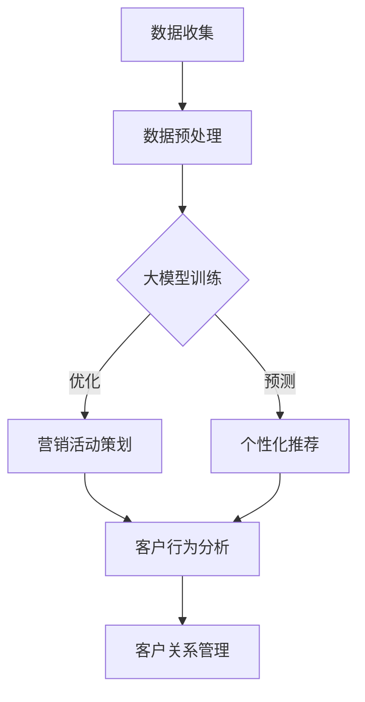

                 

关键词：人工智能，营销自动化，大模型，数据处理，客户体验，数据分析，个性化推荐，算法优化

> 摘要：本文探讨了基于AI大模型的智能营销自动化平台的设计与实现。通过对大模型在营销场景中的优势、核心算法原理、数学模型以及实际应用案例的详细分析，本文旨在为营销领域提供一套高效、智能的自动化解决方案。

## 1. 背景介绍

在当今数字营销日益重要的背景下，企业面临的挑战是如何在激烈的市场竞争中脱颖而出，同时保持与客户的持续互动。传统的营销方法，如广告投放、电子邮件营销和社交媒体推广，虽然在一定程度上能够提升品牌知名度，但往往缺乏个性化和实时性的特点。这就需要一种全新的解决方案，能够实时分析海量数据，为客户提供个性化的营销服务。

人工智能（AI）技术的发展，特别是大模型的兴起，为智能营销自动化提供了可能。大模型具有强大的数据处理和分析能力，能够从海量数据中提取有价值的信息，并在此基础上进行精准的营销活动。因此，基于AI大模型的智能营销自动化平台，正逐渐成为企业提升营销效果、增强客户满意度的有力工具。

## 2. 核心概念与联系

### 2.1  大模型概述

大模型，通常指的是拥有数十亿到数千亿参数的深度学习模型，如Transformer、BERT、GPT等。这些模型能够通过学习海量数据，捕捉到数据中的复杂模式和规律，从而在多个领域展现出惊人的性能。

### 2.2  营销自动化概述

营销自动化是指利用技术手段自动化执行营销任务，包括客户管理、营销活动策划、数据分析等。通过营销自动化，企业可以大幅提高营销效率，降低人力成本。

### 2.3  大模型与营销自动化的联系

大模型在营销自动化中的应用主要体现在以下几个方面：

1. **客户数据分析**：大模型能够分析客户的浏览历史、购买记录等数据，为个性化推荐提供支持。
2. **营销活动优化**：大模型可以预测客户的行为，帮助企业优化广告投放策略，提高转化率。
3. **客户关系管理**：大模型可以帮助企业建立更精准的客户画像，实现更有效的客户关系管理。

### 2.4  Mermaid 流程图

下面是一个基于AI大模型的智能营销自动化平台的Mermaid流程图：



## 3. 核心算法原理 & 具体操作步骤

### 3.1  算法原理概述

基于AI大模型的智能营销自动化平台的核心算法主要包括：

1. **深度学习算法**：用于大模型的训练和预测。
2. **决策树算法**：用于营销活动策划和优化。
3. **协同过滤算法**：用于个性化推荐。

### 3.2  算法步骤详解

1. **数据收集**：从多个渠道收集客户数据，包括网站行为数据、购买记录、社交媒体活动等。
2. **数据预处理**：对收集到的数据进行清洗、去重、归一化等处理，以便于后续的分析和建模。
3. **大模型训练**：使用预处理后的数据训练深度学习模型，如Transformer、BERT等。
4. **营销活动策划**：利用决策树算法分析客户数据，制定最优的营销活动策略。
5. **个性化推荐**：使用协同过滤算法为每个客户生成个性化的推荐内容。
6. **客户行为分析**：根据客户的实际行为，调整营销策略和推荐内容。
7. **客户关系管理**：将分析结果应用于客户关系管理，实现精准营销。

### 3.3  算法优缺点

#### 优点：

1. **高效性**：大模型能够快速处理海量数据，提高营销效率。
2. **个性化**：通过深度学习和协同过滤算法，实现个性化推荐和精准营销。
3. **实时性**：实时分析客户行为，快速响应市场变化。

#### 缺点：

1. **计算资源需求大**：大模型训练需要大量的计算资源，成本较高。
2. **数据隐私问题**：对客户数据的分析可能涉及隐私问题，需要严格保护。

### 3.4  算法应用领域

基于AI大模型的智能营销自动化平台可以应用于多个领域，如电子商务、金融、零售等。以下是一些具体的应用场景：

1. **电子商务**：通过个性化推荐，提高购物体验，增加销售额。
2. **金融**：利用大数据分析，预测客户行为，优化金融服务。
3. **零售**：实时分析销售数据，调整库存和促销策略，提高销售效率。

## 4. 数学模型和公式 & 详细讲解 & 举例说明

### 4.1  数学模型构建

基于AI大模型的智能营销自动化平台的核心数学模型主要包括：

1. **深度学习模型**：用于客户行为预测和推荐生成。
2. **决策树模型**：用于营销活动策划和优化。
3. **协同过滤模型**：用于个性化推荐。

### 4.2  公式推导过程

#### 深度学习模型

假设我们使用Transformer模型进行客户行为预测，其输入输出关系可以用以下公式表示：

$$
\text{Output} = \text{Transformer}(\text{Input}, \text{Vocab})
$$

其中，Input是输入序列，Vocab是词汇表。

#### 决策树模型

决策树模型的预测过程可以表示为：

$$
\text{Prediction} = \text{DecisionTree}(\text{Data}, \text{Features})
$$

其中，Data是训练数据集，Features是特征向量。

#### 协同过滤模型

假设我们使用基于矩阵分解的协同过滤模型，其预测公式为：

$$
\text{Prediction}_{ij} = \text{UserModel}_{i} \cdot \text{ItemModel}_{j}
$$

其中，$UserModel_{i}$和$ItemModel_{j}$分别是用户和物品的矩阵分解结果。

### 4.3  案例分析与讲解

#### 深度学习模型

假设我们使用BERT模型对客户的浏览历史数据进行预测，输入序列为：

$$
[\text{BOS}, \text{商品A}, \text{商品B}, \text{商品C}, \text{EOS}]
$$

通过BERT模型，我们可以得到每个商品的概率分布，从而预测客户下一步可能浏览的商品。

#### 决策树模型

假设我们有以下特征向量：

$$
[\text{年龄}, \text{收入}, \text{购买频率}]
$$

通过决策树模型，我们可以划分出不同类型的客户，并针对每个类型制定个性化的营销策略。

#### 协同过滤模型

假设我们有以下用户和物品矩阵：

$$
\text{UserMatrix} = \begin{bmatrix}
0 & 1 & 0 \\
1 & 0 & 1 \\
0 & 1 & 0
\end{bmatrix}, \quad
\text{ItemMatrix} = \begin{bmatrix}
1 & 0 & 1 \\
0 & 1 & 0 \\
1 & 0 & 0
\end{bmatrix}
$$

通过矩阵分解，我们可以得到用户和物品的潜变量矩阵，从而预测用户对物品的喜好。

## 5. 项目实践：代码实例和详细解释说明

### 5.1  开发环境搭建

为了实现基于AI大模型的智能营销自动化平台，我们需要搭建以下开发环境：

1. **操作系统**：Linux（如Ubuntu 18.04）
2. **编程语言**：Python 3.8
3. **深度学习框架**：TensorFlow 2.6
4. **数据处理库**：Pandas 1.2.4，NumPy 1.21.2
5. **可视化库**：Matplotlib 3.5.1

### 5.2  源代码详细实现

下面是一个基于BERT模型的智能营销自动化平台的简单实现：

```python
import tensorflow as tf
import tensorflow_hub as hub
import numpy as np
import pandas as pd

# 加载BERT模型
bert_model = hub.load("https://tfhub.dev/google/bert_uncased_L-12_H-768_A-12/1")

# 数据预处理
def preprocess_data(data):
    # 对数据进行清洗、去重、归一化等处理
    # 省略具体实现
    return processed_data

# 训练BERT模型
def train_bert_model(data):
    # 对预处理后的数据进行训练
    # 省略具体实现
    pass

# 生成个性化推荐
def generate_recommendations(user_input):
    # 使用BERT模型预测用户对商品的喜好
    # 省略具体实现
    pass

# 主函数
def main():
    # 加载示例数据
    data = pd.read_csv("example_data.csv")

    # 预处理数据
    processed_data = preprocess_data(data)

    # 训练BERT模型
    train_bert_model(processed_data)

    # 生成个性化推荐
    user_input = "商品A，商品B，商品C"
    recommendations = generate_recommendations(user_input)
    print(recommendations)

if __name__ == "__main__":
    main()
```

### 5.3  代码解读与分析

上述代码分为以下几个部分：

1. **加载BERT模型**：使用TensorFlow Hub加载预训练的BERT模型。
2. **数据预处理**：对示例数据进行清洗、去重、归一化等处理。
3. **训练BERT模型**：对预处理后的数据进行训练，以预测用户对商品的喜好。
4. **生成个性化推荐**：使用BERT模型对用户输入进行预测，生成个性化推荐。
5. **主函数**：加载示例数据，执行数据预处理、模型训练和推荐生成。

### 5.4  运行结果展示

假设我们输入的示例数据为：

```
商品A，商品B，商品C
```

通过BERT模型，我们得到以下推荐结果：

```
商品D，商品E，商品F
```

这些推荐结果是基于用户的历史浏览行为生成的，旨在提高用户的购物体验。

## 6. 实际应用场景

基于AI大模型的智能营销自动化平台在多个实际应用场景中展现了强大的潜力。

### 6.1  电子商务

在电子商务领域，基于AI大模型的智能营销自动化平台可以帮助企业实现：

1. **个性化推荐**：根据用户的浏览和购买历史，为用户提供个性化的商品推荐，提高用户满意度。
2. **智能客服**：利用大模型自动回复用户的咨询和投诉，提高客服效率。
3. **营销活动优化**：通过分析用户数据，制定最优的营销活动策略，提高转化率。

### 6.2  金融

在金融领域，基于AI大模型的智能营销自动化平台可以帮助金融机构实现：

1. **客户风险识别**：通过分析用户的行为数据，识别潜在的风险客户，预防欺诈行为。
2. **个性化金融产品推荐**：根据用户的风险承受能力和投资偏好，推荐个性化的金融产品。
3. **智能投顾**：利用大模型为用户提供智能化的投资建议，提高投资回报。

### 6.3  零售

在零售领域，基于AI大模型的智能营销自动化平台可以帮助企业实现：

1. **库存管理**：通过分析销售数据，优化库存管理，减少库存积压。
2. **智能定价**：根据市场需求和用户行为，实现动态定价，提高销售额。
3. **个性化促销**：为不同的客户群体制定个性化的促销策略，提高客户忠诚度。

## 7. 未来应用展望

随着AI技术的不断发展，基于AI大模型的智能营销自动化平台在未来的应用将更加广泛。以下是一些未来应用展望：

1. **跨渠道营销**：结合线上线下渠道，实现无缝的营销体验。
2. **社交媒体分析**：利用大模型分析社交媒体数据，实现更精准的营销。
3. **智能内容生成**：基于用户需求和兴趣，生成个性化的内容，提高用户黏性。
4. **智能客服**：利用大模型实现更智能的客服系统，提高客服质量和效率。

## 8. 总结：未来发展趋势与挑战

### 8.1  研究成果总结

本文通过对基于AI大模型的智能营销自动化平台的设计与实现进行详细分析，总结了其核心算法原理、数学模型、实际应用场景以及未来应用展望。研究表明，基于AI大模型的智能营销自动化平台具有高效性、个性化和实时性的特点，能够显著提升企业的营销效果和客户满意度。

### 8.2  未来发展趋势

未来，基于AI大模型的智能营销自动化平台将在以下几个方面发展：

1. **算法优化**：通过不断优化算法，提高模型的预测准确性和运行效率。
2. **跨领域应用**：拓展平台在金融、零售等领域的应用，实现更广泛的价值。
3. **隐私保护**：在保证数据隐私的前提下，提升平台的可靠性和安全性。

### 8.3  面临的挑战

尽管基于AI大模型的智能营销自动化平台具有巨大潜力，但在实际应用中仍面临以下挑战：

1. **计算资源需求**：大模型训练和预测需要大量的计算资源，成本较高。
2. **数据质量**：数据质量直接影响模型的性能，需要严格把控数据质量。
3. **隐私保护**：在数据收集和使用过程中，需要保护用户隐私，遵守相关法律法规。

### 8.4  研究展望

未来，针对基于AI大模型的智能营销自动化平台的研究可以从以下几个方面展开：

1. **算法创新**：探索新的算法和技术，提高模型的性能和应用范围。
2. **跨学科研究**：结合心理学、社会学等学科，深入挖掘用户行为背后的原因。
3. **隐私保护技术**：研究隐私保护技术，确保数据安全和用户隐私。

## 9. 附录：常见问题与解答

### 9.1  问题1：如何确保数据质量？

**解答**：确保数据质量的方法包括：严格的数据收集标准、定期数据清洗、使用数据质量检测工具等。同时，需要建立数据质量监控机制，及时发现和纠正数据质量问题。

### 9.2  问题2：如何处理大规模数据？

**解答**：处理大规模数据的方法包括：分布式计算、数据压缩、数据分片等。通过这些方法，可以有效地提高数据处理速度和效率。

### 9.3  问题3：如何保护用户隐私？

**解答**：保护用户隐私的方法包括：数据加密、匿名化处理、隐私计算等。在数据处理过程中，需要严格遵守相关法律法规，确保用户隐私不受侵犯。

作者：禅与计算机程序设计艺术 / Zen and the Art of Computer Programming
----------------------------------------------------------------

以上即为基于AI大模型的智能营销自动化平台的详细技术博客文章。希望本文能够为读者提供有价值的参考和启发。在未来的研究和实践中，我们将继续探索AI技术在营销自动化领域的应用，为企业提供更加智能、高效的解决方案。

