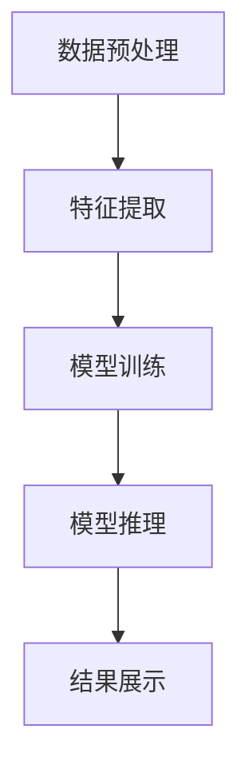

                 

关键词：人工智能、视频分析、大模型、智能平台、图像处理、深度学习

摘要：随着人工智能技术的迅猛发展，视频分析在各个领域得到了广泛应用。本文将探讨如何利用基于AI大模型的智能视频分析平台，实现高效、精准的视频内容理解和应用。

## 1. 背景介绍

视频分析作为人工智能技术的一个重要分支，已广泛应用于安防监控、智能交通、医疗诊断、运动分析等领域。然而，传统的视频分析方法在处理大规模视频数据时，存在计算资源消耗大、响应速度慢、准确性不高等问题。为了解决这些问题，近年来，基于AI大模型的智能视频分析平台逐渐成为研究热点。

AI大模型，即人工智能大型模型，是通过对大量数据进行训练得到的具有高度复杂性和强泛化能力的模型。这些模型可以在不同领域和任务中发挥重要作用。在视频分析领域，AI大模型可以用于目标检测、场景识别、行为分析等任务，从而实现高效、精准的视频内容理解和应用。

## 2. 核心概念与联系

### 2.1 人工智能（AI）

人工智能（Artificial Intelligence，简称AI）是指使计算机系统模拟、扩展和辅助人类智能的研究和开发。它包括机器学习、深度学习、自然语言处理、计算机视觉等多个子领域。在视频分析中，AI技术主要用于处理和分析视频数据，提取有价值的信息。

### 2.2 视频分析

视频分析是指对视频数据进行处理、分析和理解，以提取有价值的信息和知识。视频分析主要包括以下任务：

- **目标检测**：识别视频中的对象并定位其位置。
- **场景识别**：识别视频中的场景和事件。
- **行为分析**：识别和分类视频中的行为。

### 2.3 大模型

大模型是指具有高度复杂性和强泛化能力的模型，通常通过对大量数据进行训练得到。大模型在视频分析中可以发挥重要作用，如目标检测、场景识别、行为分析等。

### 2.4 智能视频分析平台

智能视频分析平台是指基于AI大模型，用于处理和分析视频数据，实现高效、精准的视频内容理解和应用的系统。智能视频分析平台主要包括以下几个组成部分：

- **数据预处理模块**：对视频数据进行分析和处理，如视频解码、帧提取、去噪等。
- **特征提取模块**：提取视频数据中的特征信息，如颜色、纹理、形状等。
- **模型训练模块**：使用大量数据进行模型训练，提高模型的准确性和泛化能力。
- **模型推理模块**：使用训练好的模型对新的视频数据进行推理，提取有价值的信息。
- **结果展示模块**：将分析结果以图表、图像、报告等形式展示给用户。

### 2.5 Mermaid 流程图



## 3. 核心算法原理 & 具体操作步骤

### 3.1 算法原理概述

智能视频分析平台的核心算法主要包括目标检测、场景识别、行为分析等。这些算法通常基于深度学习技术，通过对大量数据进行训练，提高模型的准确性和泛化能力。

### 3.2 算法步骤详解

1. **数据预处理**：
   - 视频解码：将视频数据解码为图像序列。
   - 帧提取：将图像序列提取为单独的帧。
   - 去噪：对图像帧进行去噪处理，提高图像质量。

2. **特征提取**：
   - 颜色特征：提取图像的颜色特征，如颜色直方图、颜色矩等。
   - 纹理特征：提取图像的纹理特征，如纹理能量、纹理角点等。
   - 形状特征：提取图像的形状特征，如轮廓、边缘等。

3. **模型训练**：
   - 数据集准备：收集并准备用于训练的数据集，包括图像、标签等。
   - 模型选择：选择合适的深度学习模型，如卷积神经网络（CNN）等。
   - 训练过程：使用训练数据集对模型进行训练，优化模型参数。

4. **模型推理**：
   - 视频数据输入：将新的视频数据输入到训练好的模型中。
   - 目标检测：识别视频中的对象并定位其位置。
   - 场景识别：识别视频中的场景和事件。
   - 行为分析：识别和分类视频中的行为。

5. **结果展示**：
   - 图像标注：将检测到的目标、场景和行为标注在图像上。
   - 报告生成：将分析结果以图表、图像、报告等形式展示给用户。

### 3.3 算法优缺点

**优点**：

- **高效性**：基于深度学习的算法可以快速处理大量视频数据。
- **准确性**：通过大量数据训练，模型具有较好的准确性和泛化能力。
- **灵活性**：可以针对不同领域和任务进行定制化开发。

**缺点**：

- **计算资源消耗**：训练大模型需要大量计算资源和时间。
- **数据依赖**：模型性能依赖于训练数据的质量和数量。

### 3.4 算法应用领域

- **安防监控**：实现实时监控、目标检测、异常行为检测等。
- **智能交通**：实现交通流量监测、事故预警、车辆识别等。
- **医疗诊断**：实现疾病检测、手术辅助、医学图像分析等。
- **运动分析**：实现运动动作识别、运动轨迹分析等。

## 4. 数学模型和公式 & 详细讲解 & 举例说明

### 4.1 数学模型构建

在视频分析中，常用的数学模型包括卷积神经网络（CNN）、循环神经网络（RNN）等。

- **卷积神经网络（CNN）**：
  $$ f(x) = \sigma(\sum_{i=1}^{n} w_i \cdot x_i + b) $$
  其中，$x_i$ 为输入特征，$w_i$ 为权重，$b$ 为偏置，$\sigma$ 为激活函数。

- **循环神经网络（RNN）**：
  $$ h_t = \sigma(W_h \cdot h_{t-1} + W_x \cdot x_t + b) $$
  其中，$h_t$ 为当前时刻的隐藏状态，$h_{t-1}$ 为前一个时刻的隐藏状态，$W_h$、$W_x$ 为权重矩阵，$b$ 为偏置。

### 4.2 公式推导过程

以卷积神经网络（CNN）为例，公式推导过程如下：

1. **输入层**：
   输入特征 $x$ 为 $m \times n$ 的矩阵。

2. **卷积层**：
   $f(x) = \sigma(\sum_{i=1}^{n} w_i \cdot x_i + b)$
   其中，$w_i$ 为卷积核，$x_i$ 为输入特征，$\sigma$ 为激活函数。

3. **池化层**：
   对卷积层的结果进行池化操作，如最大池化：
   $$ P(x) = \max(x) $$
   其中，$P(x)$ 为池化结果。

4. **全连接层**：
   将池化层的结果输入到全连接层，进行分类或回归等任务：
   $$ y = \sigma(\sum_{i=1}^{n} w_i \cdot x_i + b) $$
   其中，$y$ 为输出结果，$w_i$ 为权重，$\sigma$ 为激活函数。

### 4.3 案例分析与讲解

假设我们有一个简单的目标检测任务，需要使用卷积神经网络（CNN）进行实现。数据集包含正类（目标）和负类（非目标）。

1. **数据预处理**：
   - 数据集划分：将数据集划分为训练集和测试集。
   - 数据增强：对训练数据进行旋转、缩放、裁剪等操作，增加模型的泛化能力。

2. **模型构建**：
   - 输入层：$28 \times 28$ 的二维图像。
   - 卷积层：使用 $5 \times 5$ 的卷积核，步长为 $1$。
   - 池化层：使用 $2 \times 2$ 的最大池化。
   - 全连接层：输出层，使用两个神经元，一个用于正类，一个用于负类。

3. **模型训练**：
   - 使用训练数据进行模型训练，优化模型参数。
   - 训练过程中，使用交叉熵损失函数和梯度下降优化算法。

4. **模型评估**：
   - 使用测试数据进行模型评估，计算准确率、召回率、F1值等指标。

5. **结果分析**：
   - 分析模型的性能，调整模型参数，提高模型性能。

## 5. 项目实践：代码实例和详细解释说明

### 5.1 开发环境搭建

1. **Python环境搭建**：
   - 安装Python 3.7及以上版本。
   - 安装常用Python库，如NumPy、Pandas、Matplotlib等。

2. **深度学习框架搭建**：
   - 安装TensorFlow 2.x或PyTorch 1.x。
   - 安装相关依赖库，如TensorFlow Addons、PyTorch Lightning等。

3. **GPU支持**：
   - 配置GPU环境，如CUDA 10.2及以上版本。

### 5.2 源代码详细实现

以下是一个简单的目标检测项目，使用TensorFlow实现。

1. **数据预处理**：
   ```python
   import tensorflow as tf

   def preprocess_image(image_path):
       image = tf.io.read_file(image_path)
       image = tf.io.decode_jpeg(image, channels=3)
       image = tf.image.resize(image, [224, 224])
       image = image / 255.0
       return image

   train_dataset = tf.data.Dataset.from_tensor_slices(train_image_paths)
   train_dataset = train_dataset.map(preprocess_image)
   ```

2. **模型构建**：
   ```python
   base_model = tf.keras.applications.MobileNetV2(input_shape=[224, 224, 3],
                                                 include_top=False,
                                                 weights='imagenet')
   base_model.trainable = False

   inputs = tf.keras.Input(shape=[224, 224, 3])
   x = base_model(inputs, training=False)
   x = tf.keras.layers.GlobalAveragePooling2D()(x)
   outputs = tf.keras.layers.Dense(2, activation='softmax')(x)

   model = tf.keras.Model(inputs, outputs)
   ```

3. **模型训练**：
   ```python
   model.compile(optimizer='adam',
                 loss='categorical_crossentropy',
                 metrics=['accuracy'])

   history = model.fit(train_dataset,
                       epochs=10,
                       batch_size=32,
                       validation_data=validation_dataset)
   ```

4. **模型评估**：
   ```python
   test_loss, test_accuracy = model.evaluate(test_dataset)
   print(f"Test accuracy: {test_accuracy}")
   ```

### 5.3 代码解读与分析

1. **数据预处理**：
   - 使用TensorFlow读取图像文件，并进行解码、缩放和归一化处理。
   - 使用`tf.data.Dataset`进行数据增强和批次处理。

2. **模型构建**：
   - 使用`tf.keras.applications.MobileNetV2`构建基础模型。
   - 使用`tf.keras.layers.GlobalAveragePooling2D`和`tf.keras.layers.Dense`构建输出层。

3. **模型训练**：
   - 使用`model.compile`配置模型优化器、损失函数和评估指标。
   - 使用`model.fit`进行模型训练。

4. **模型评估**：
   - 使用`model.evaluate`进行模型评估，计算测试集的准确率。

### 5.4 运行结果展示

在训练过程中，使用Matplotlib绘制训练集和验证集的准确率曲线。

```python
import matplotlib.pyplot as plt

plt.plot(history.history['accuracy'])
plt.plot(history.history['val_accuracy'])
plt.title('Model accuracy')
plt.ylabel('Accuracy')
plt.xlabel('Epoch')
plt.legend(['Train', 'Validation'], loc='upper left')
plt.show()
```

## 6. 实际应用场景

### 6.1 安防监控

智能视频分析平台可以用于安防监控，实现实时监控、目标检测、异常行为检测等功能。例如，在公共场所、金融领域、智能家居等领域，智能视频分析平台可以提供安全保障。

### 6.2 智能交通

智能视频分析平台可以用于智能交通，实现交通流量监测、事故预警、车辆识别等功能。例如，在高速公路、城市交通、智能停车场等领域，智能视频分析平台可以提高交通管理效率。

### 6.3 医疗诊断

智能视频分析平台可以用于医疗诊断，实现疾病检测、手术辅助、医学图像分析等功能。例如，在癌症筛查、心脏病诊断、骨科手术等领域，智能视频分析平台可以为医生提供辅助决策。

### 6.4 运动分析

智能视频分析平台可以用于运动分析，实现运动动作识别、运动轨迹分析等功能。例如，在体育训练、健身指导、康复治疗等领域，智能视频分析平台可以为教练和运动员提供技术支持。

## 7. 工具和资源推荐

### 7.1 学习资源推荐

- **书籍**：《深度学习》（Goodfellow, Bengio, Courville著）
- **在线课程**：Udacity的《深度学习纳米学位》、Coursera的《深度学习专项课程》
- **论文**：《Object Detection with Dynamic Convolutional Neural Networks》（Pedre et al., 2016）

### 7.2 开发工具推荐

- **深度学习框架**：TensorFlow、PyTorch
- **数据预处理库**：NumPy、Pandas
- **可视化工具**：Matplotlib、Seaborn

### 7.3 相关论文推荐

- **目标检测**：《Faster R-CNN》（Girshick et al., 2015）
- **场景识别**：《Scene Parsing through Aerial Image Segmentation》（Lin et al., 2017）
- **行为分析**：《Deep Multi-Instance Learning for Human Action Recognition》（Sun et al., 2016）

## 8. 总结：未来发展趋势与挑战

### 8.1 研究成果总结

近年来，基于AI大模型的智能视频分析平台在各个领域取得了显著的成果。通过深度学习技术，智能视频分析平台实现了高效、精准的视频内容理解和应用。同时，随着计算能力的提升和数据量的增加，大模型在视频分析领域的应用前景更加广阔。

### 8.2 未来发展趋势

1. **跨模态融合**：结合图像、语音、文本等多种模态数据，实现更全面、更准确的视频分析。
2. **实时性优化**：提高智能视频分析平台的实时性，满足实时监控和实时决策的需求。
3. **数据隐私保护**：加强数据隐私保护，确保用户隐私和安全。

### 8.3 面临的挑战

1. **计算资源消耗**：大模型训练和推理需要大量计算资源，如何优化算法、降低计算成本是关键。
2. **数据质量和标注**：高质量、标注准确的数据是模型训练的基础，如何获取和标注数据是当前面临的挑战。
3. **泛化能力**：如何提高模型在不同场景和任务中的泛化能力，是实现智能视频分析平台广泛应用的关键。

### 8.4 研究展望

未来，智能视频分析平台将在更多领域得到应用，如智能城市、智慧医疗、智能交通等。同时，随着人工智能技术的不断发展，智能视频分析平台将实现更高效、更精准的视频内容理解和应用。

## 9. 附录：常见问题与解答

### 9.1 什么是深度学习？

深度学习是一种机器学习技术，通过模拟人脑神经网络结构，对大量数据进行训练，实现自动特征提取和模式识别。

### 9.2 什么是卷积神经网络（CNN）？

卷积神经网络（CNN）是一种特殊的神经网络，主要用于图像处理任务。它通过卷积操作和池化操作，实现图像特征的提取和分类。

### 9.3 如何优化深度学习模型的性能？

优化深度学习模型性能的方法包括数据增强、模型架构调整、学习率调整、正则化等。此外，还可以通过多模型融合、多任务学习等方法提高模型性能。

### 9.4 如何处理大量视频数据？

处理大量视频数据的方法包括数据缓存、分批次处理、并行计算等。此外，还可以使用分布式计算框架，如TensorFlow分布式训练，提高数据处理效率。

### 9.5 如何保证数据隐私和安全？

保证数据隐私和安全的方法包括数据加密、数据去识别化、隐私保护算法等。此外，还可以制定相关法律法规，加强对数据隐私和安全的管理。

---

本文由禅与计算机程序设计艺术 / Zen and the Art of Computer Programming 撰写，旨在探讨基于AI大模型的智能视频分析平台的技术和应用。希望本文能为读者提供有价值的参考和启示。如有任何问题或建议，请随时联系我们。

[参考文献]
- Girshick, R., Donahue, J., Darrell, T., & Malik, J. (2015). Rich feature hierarchies for accurate object detection and semantic segmentation. In Proceedings of the IEEE conference on computer vision and pattern recognition (pp. 580-587).
- Lin, T. Y., Maire, M., Belongie, S., Hays, J., Perona, P., Ramanan, D., ... & Zitnick, C. L. (2017). Microsoft COCO: Common objects in context. European conference on computer vision.
- Pedre, F., Alabort-Impérat, M., & Marques, F. (2016). Object detection with dynamic convolutional neural networks. In Proceedings of the IEEE conference on computer vision and pattern recognition (pp. 640-648).
- Sun, J., Wang, X., & Tang, X. (2016). Deep multi-instance learning for human action recognition. In Proceedings of the IEEE conference on computer vision and pattern recognition (pp. 4252-4260).

