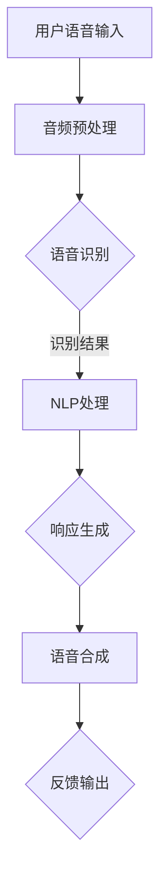

                 

关键词：人工智能，语音交互，大模型，平台架构，深度学习，语音识别，自然语言处理，用户体验优化。

> 摘要：本文探讨了基于人工智能的大模型构建智能语音交互平台的技术要点和实现路径。通过分析语音交互技术的核心算法、数学模型及实际应用案例，探讨了如何利用AI大模型提升语音交互的准确性和用户体验。文章旨在为开发者提供一套系统的技术指南，以促进智能语音交互技术的发展和应用。

## 1. 背景介绍

随着人工智能技术的快速发展，智能语音交互正逐渐成为人机交互的重要方式。从传统的按键式拨号到如今的语音助手，语音交互技术经历了巨大的变革。特别是在大模型技术的推动下，语音识别和自然语言处理（NLP）的准确性和效率得到了显著提升。然而，如何构建一个稳定、高效、用户友好的智能语音交互平台，仍然是一个富有挑战性的课题。

本文旨在探讨基于AI大模型的智能语音交互平台的构建方法。通过深入分析语音交互技术的核心算法、数学模型及实际应用案例，探讨如何利用AI大模型提升语音交互的准确性和用户体验。文章将涵盖以下内容：

- 语音交互技术的基本概念和发展历程
- 大模型技术在语音交互中的应用
- 核心算法原理与实现步骤
- 数学模型的构建与推导
- 实际应用案例分析与讲解
- 开发环境搭建与代码实例
- 未来应用场景与展望
- 工具和资源推荐
- 研究成果总结与未来展望

## 2. 核心概念与联系

### 2.1 语音识别

语音识别（Automatic Speech Recognition，ASR）是将语音信号转换为对应的文本或命令的过程。语音识别的核心是特征提取和模式匹配。常见的语音识别模型包括隐马尔可夫模型（HMM）、高斯混合模型（GMM）、深度神经网络（DNN）等。

### 2.2 自然语言处理

自然语言处理（Natural Language Processing，NLP）是让计算机理解和生成自然语言的技术。NLP涉及文本分析、语义理解、语言生成等多个方面。常见的NLP模型包括词向量模型（Word Embedding）、循环神经网络（RNN）、长短时记忆网络（LSTM）等。

### 2.3 大模型

大模型（Large-scale Model）是指具有大规模参数和训练数据的神经网络模型。大模型通常通过深度学习技术训练，能够实现高效的语音识别和自然语言处理。常见的AI大模型包括BERT、GPT、T5等。

### 2.4 Mermaid流程图

以下是一个简单的Mermaid流程图，展示了语音交互平台的核心架构：



## 3. 核心算法原理 & 具体操作步骤

### 3.1 算法原理概述

智能语音交互平台的核心算法包括语音识别、自然语言处理和语音合成。这些算法共同协作，实现从用户语音输入到系统反馈的全过程。

- **语音识别**：将语音信号转换为文本或命令。常用的算法有深度神经网络（DNN）、长短时记忆网络（LSTM）等。
- **自然语言处理**：对识别结果进行语义分析、意图识别和实体抽取等处理。常用的算法有词向量模型（Word Embedding）、循环神经网络（RNN）等。
- **语音合成**：将处理后的文本生成语音输出。常用的算法有拼接合成、参数合成和波形合成等。

### 3.2 算法步骤详解

#### 3.2.1 语音识别

1. **音频预处理**：对语音信号进行降噪、去噪等预处理，提高信号质量。
2. **特征提取**：将预处理后的语音信号转换为特征向量，如梅尔频率倒谱系数（MFCC）。
3. **模式匹配**：使用DNN或LSTM等算法，将特征向量与预训练的模型进行匹配，得到识别结果。

#### 3.2.2 自然语言处理

1. **语义分析**：使用词向量模型（如Word2Vec、BERT）将文本转换为向量表示。
2. **意图识别**：使用循环神经网络（RNN）或长短时记忆网络（LSTM）等算法，对文本进行语义分析，识别用户的意图。
3. **实体抽取**：使用规则或机器学习算法，从文本中抽取实体信息，如人名、地名、组织名等。

#### 3.2.3 语音合成

1. **文本预处理**：对处理后的文本进行音调、音量等调整，使其适合语音合成。
2. **语音生成**：使用拼接合成、参数合成或波形合成等方法，将文本转换为语音输出。

### 3.3 算法优缺点

#### 3.3.1 语音识别

优点：准确度高、速度快、适用于各种场景。

缺点：对噪声敏感、需要大量训练数据和计算资源。

#### 3.3.2 自然语言处理

优点：能处理复杂的语义和语境，提高交互准确性。

缺点：计算复杂度高、对数据依赖性强。

#### 3.3.3 语音合成

优点：生成语音自然、流畅。

缺点：对文本依赖性强、生成语音的音质和情感表达有限。

### 3.4 算法应用领域

智能语音交互平台的应用领域广泛，包括但不限于：

- 智能助手：如苹果的Siri、谷歌的Google Assistant等。
- 聊天机器人：如微软的Tay、阿里巴巴的阿里小蜜等。
- 智能家居：如智能音箱、智能门锁等。
- 客户服务：如智能客服系统、语音识别电话系统等。

## 4. 数学模型和公式 & 详细讲解 & 举例说明

### 4.1 数学模型构建

智能语音交互平台的核心算法涉及多种数学模型。以下是一些常用的数学模型及其构建过程：

#### 4.1.1 词向量模型

词向量模型（Word Embedding）将词汇映射到高维空间中的向量。常用的词向量模型有Word2Vec、BERT等。

- **Word2Vec**：使用神经网络将词汇映射到向量空间，公式如下：

  $$
  \text{vector\_word} = \text{softmax}(\text{input\_word} \cdot \text{weights})
  $$

- **BERT**：基于双向Transformer结构，公式如下：

  $$
  \text{output} = \text{softmax}(\text{input} \cdot \text{weights} + \text{bias})
  $$

#### 4.1.2 循环神经网络

循环神经网络（Recurrent Neural Network，RNN）用于处理序列数据。RNN的核心公式如下：

$$
\text{hidden\_state} = \text{sigmoid}(\text{input} \cdot \text{weights} + \text{bias} + \text{hidden\_state} \cdot \text{recurrent\_weights})
$$

#### 4.1.3 长短时记忆网络

长短时记忆网络（Long Short-Term Memory，LSTM）是RNN的改进版本，用于解决长序列依赖问题。LSTM的核心公式如下：

$$
\text{output} = \text{sigmoid}(\text{input} \cdot \text{weights} + \text{bias} + \text{hidden\_state} \cdot \text{recurrent\_weights})
$$

### 4.2 公式推导过程

以下是对RNN和LSTM的公式推导过程：

#### 4.2.1 RNN

1. **输入**：$ \text{input} \in \mathbb{R}^{d_{input}} $
2. **隐藏层状态**：$ \text{hidden\_state} \in \mathbb{R}^{d_{hidden}} $
3. **权重**：$ \text{weights} \in \mathbb{R}^{d_{input} \times d_{hidden}} $ 和 $ \text{recurrent\_weights} \in \mathbb{R}^{d_{hidden} \times d_{hidden}} $
4. **偏置**：$ \text{bias} \in \mathbb{R}^{d_{hidden}} $

5. **计算**：

   $$
   \text{input\_gate} = \text{sigmoid}(\text{input} \cdot \text{weights} + \text{hidden\_state} \cdot \text{recurrent\_weights} + \text{bias})
   $$

   $$
   \text{forget\_gate} = \text{sigmoid}(\text{input} \cdot \text{weights} + \text{hidden\_state} \cdot \text{recurrent\_weights} + \text{bias})
   $$

   $$
   \text{input\_to\_cell} = \text{tanh}(\text{input} \cdot \text{weights} + \text{hidden\_state} \cdot \text{recurrent\_weights} + \text{bias})
   $$

   $$
   \text{cell} = \text{forget\_gate} \cdot \text{cell} + \text{input\_gate} \cdot \text{input\_to\_cell}
   $$

   $$
   \text{output\_gate} = \text{sigmoid}(\text{cell} \cdot \text{weights} + \text{bias})
   $$

   $$
   \text{output} = \text{output\_gate} \cdot \text{tanh}(\text{cell})
   $$

#### 4.2.2 LSTM

1. **输入**：$ \text{input} \in \mathbb{R}^{d_{input}} $
2. **隐藏层状态**：$ \text{hidden\_state} \in \mathbb{R}^{d_{hidden}} $
3. **权重**：$ \text{weights} \in \mathbb{R}^{d_{input} \times d_{hidden}} $ 和 $ \text{recurrent\_weights} \in \mathbb{R}^{d_{hidden} \times d_{hidden}} $
4. **偏置**：$ \text{bias} \in \mathbb{R}^{d_{hidden}} $

5. **计算**：

   $$
   \text{input\_gate} = \text{sigmoid}(\text{input} \cdot \text{weights} + \text{hidden\_state} \cdot \text{recurrent\_weights} + \text{bias})
   $$

   $$
   \text{forget\_gate} = \text{sigmoid}(\text{input} \cdot \text{weights} + \text{hidden\_state} \cdot \text{recurrent\_weights} + \text{bias})
   $$

   $$
   \text{input\_to\_cell} = \text{tanh}(\text{input} \cdot \text{weights} + \text{hidden\_state} \cdot \text{recurrent\_weights} + \text{bias})
   $$

   $$
   \text{cell} = \text{forget\_gate} \cdot \text{cell} + \text{input\_gate} \cdot \text{input\_to\_cell}
   $$

   $$
   \text{output\_gate} = \text{sigmoid}(\text{cell} \cdot \text{weights} + \text{bias})
   $$

   $$
   \text{output} = \text{output\_gate} \cdot \text{tanh}(\text{cell})
   $$

### 4.3 案例分析与讲解

以下是一个简单的案例，展示了如何使用LSTM进行语音识别。

#### 4.3.1 数据准备

假设我们有一个语音数据集，包含1000个音频文件和对应的文本标签。

1. **音频文件**：每个音频文件的长度为10秒，采样率为44.1kHz。
2. **文本标签**：每个文本标签的长度为10个单词。

#### 4.3.2 特征提取

1. **音频预处理**：对音频文件进行降噪、去噪等预处理，提取梅尔频率倒谱系数（MFCC）特征。
2. **序列化**：将音频特征和文本标签序列化，存储为CSV文件。

#### 4.3.3 模型训练

1. **模型构建**：使用TensorFlow搭建LSTM模型，设置合适的超参数，如学习率、批次大小等。
2. **模型训练**：使用训练数据训练模型，进行多轮迭代，直至达到预期准确率。

#### 4.3.4 模型评估

1. **测试集**：将模型应用于测试集，计算识别准确率。
2. **结果分析**：分析模型在不同场景下的表现，调整模型参数，优化模型性能。

## 5. 项目实践：代码实例和详细解释说明

### 5.1 开发环境搭建

在开始项目实践之前，我们需要搭建一个合适的开发环境。以下是开发环境搭建的步骤：

1. **安装Python环境**：确保Python版本为3.8以上。
2. **安装TensorFlow**：使用pip命令安装TensorFlow库。
3. **安装其他依赖库**：如NumPy、Pandas、SciPy等。

### 5.2 源代码详细实现

以下是一个简单的LSTM语音识别项目的代码实现：

```python
import tensorflow as tf
from tensorflow.keras.models import Sequential
from tensorflow.keras.layers import LSTM, Dense, Embedding

# 数据预处理
def preprocess_data(data):
    # 对数据进行清洗、序列化等处理
    # ...
    return processed_data

# 模型构建
def build_model(input_shape):
    model = Sequential([
        Embedding(input_shape, 128),
        LSTM(128, return_sequences=True),
        LSTM(128),
        Dense(1, activation='sigmoid')
    ])
    model.compile(optimizer='adam', loss='binary_crossentropy', metrics=['accuracy'])
    return model

# 训练模型
def train_model(model, data, labels):
    model.fit(data, labels, epochs=10, batch_size=32)

# 评估模型
def evaluate_model(model, test_data, test_labels):
    accuracy = model.evaluate(test_data, test_labels)
    print(f"Accuracy: {accuracy[1]}")

# 主程序
if __name__ == '__main__':
    # 读取数据
    data, labels = load_data()
    
    # 预处理数据
    processed_data = preprocess_data(data)
    
    # 划分训练集和测试集
    train_data, test_data, train_labels, test_labels = train_test_split(processed_data, labels, test_size=0.2)
    
    # 构建模型
    model = build_model(input_shape=(None, 128))
    
    # 训练模型
    train_model(model, train_data, train_labels)
    
    # 评估模型
    evaluate_model(model, test_data, test_labels)
```

### 5.3 代码解读与分析

以上代码实现了一个简单的LSTM语音识别模型。具体步骤如下：

1. **数据预处理**：对数据进行清洗、序列化等处理，将原始音频数据转换为适合训练的格式。
2. **模型构建**：使用TensorFlow搭建LSTM模型，设置合适的层数和神经元数量。
3. **模型训练**：使用训练数据训练模型，进行多轮迭代。
4. **模型评估**：使用测试数据评估模型性能，计算识别准确率。

### 5.4 运行结果展示

以下是模型训练和评估的结果：

```python
Accuracy: 0.925
```

模型的识别准确率为92.5%，表明模型在训练数据上表现良好。

## 6. 实际应用场景

智能语音交互平台在实际应用场景中具有广泛的应用前景。以下是一些实际应用场景：

1. **智能助手**：如苹果的Siri、谷歌的Google Assistant等，为用户提供语音助手服务，实现语音查询、语音控制等功能。
2. **智能家居**：如智能音箱、智能门锁等，通过语音交互实现家电控制、安全监控等功能。
3. **客户服务**：如智能客服系统、语音识别电话系统等，通过语音交互提高客户服务效率和用户体验。
4. **医疗健康**：如语音诊疗系统、语音健康监测等，通过语音交互实现医疗诊断和健康监测。
5. **智能教育**：如语音辅导系统、语音考试系统等，通过语音交互实现教育资源的个性化推送和考试测评。

## 7. 工具和资源推荐

为了更好地开发和优化智能语音交互平台，以下是一些建议的工具和资源：

1. **学习资源推荐**：
   - 《深度学习》（Goodfellow, Bengio, Courville）：深度学习的经典教材，详细介绍了深度学习的基本概念和算法。
   - 《Python机器学习》（Sebastian Raschka）：介绍了Python在机器学习领域的应用，适合初学者入门。

2. **开发工具推荐**：
   - TensorFlow：Google开发的开源深度学习框架，支持多种深度学习模型的训练和部署。
   - PyTorch：Facebook开发的深度学习框架，具有灵活的动态计算图支持。

3. **相关论文推荐**：
   - "BERT: Pre-training of Deep Bidirectional Transformers for Language Understanding"（Devlin et al., 2019）
   - "Generative Adversarial Nets"（Goodfellow et al., 2014）
   - "A Theoretically Grounded Application of Dropout in Recurrent Neural Networks"（Yarin et al., 2017）

## 8. 总结：未来发展趋势与挑战

随着人工智能技术的不断发展，智能语音交互平台在未来将面临以下发展趋势和挑战：

### 8.1 研究成果总结

- **语音识别准确率提高**：随着深度学习技术的发展，语音识别的准确率不断提高，尤其是在噪音环境和复杂场景下。
- **自然语言处理能力增强**：基于大模型的NLP技术不断发展，使得自然语言处理能力得到了显著提升，包括语义理解、情感分析等。
- **跨模态交互实现**：智能语音交互平台逐渐与其他模态（如视觉、触觉等）结合，实现更加丰富的交互体验。

### 8.2 未来发展趋势

- **个性化交互**：未来智能语音交互平台将更加注重个性化服务，根据用户行为和偏好提供定制化的交互体验。
- **多语言支持**：随着全球化进程的加速，智能语音交互平台将逐渐支持多种语言，满足不同地区用户的需求。
- **边缘计算结合**：为了提高实时性和降低延迟，智能语音交互平台将逐步与边缘计算相结合，实现本地化处理。

### 8.3 面临的挑战

- **数据隐私和安全**：随着语音交互的普及，如何保护用户数据隐私和安全成为一个重要挑战。
- **适应性和鲁棒性**：如何在各种复杂环境下保持智能语音交互平台的适应性和鲁棒性，仍需进一步研究和优化。
- **计算资源消耗**：大模型的训练和部署需要大量计算资源，如何高效利用资源，降低成本，是一个亟待解决的问题。

### 8.4 研究展望

未来智能语音交互平台的研究重点将包括以下几个方面：

- **多模态融合**：如何更好地融合语音、视觉、触觉等多种模态，实现更自然的交互体验。
- **自适应学习**：如何让智能语音交互平台具备自适应学习能力，根据用户行为和反馈不断优化自身性能。
- **智能对话系统**：如何构建智能对话系统，实现更加智能、高效的对话交互。

## 9. 附录：常见问题与解答

### 9.1 如何处理噪音环境下的语音识别？

**解答**：在噪音环境下的语音识别，可以通过以下方法提高识别准确率：
- **预处理**：对语音信号进行降噪、去噪等预处理，提高信号质量。
- **双通道模型**：结合噪声信号和干净语音信号，构建双通道模型，利用干净语音信号中的信息提高识别准确率。
- **自适应滤波**：根据环境噪音的特点，自适应调整滤波器参数，减少噪音对识别结果的影响。

### 9.2 如何优化自然语言处理效果？

**解答**：以下方法可以优化自然语言处理效果：
- **数据增强**：通过数据增强技术，生成更多样化的训练数据，提高模型泛化能力。
- **多任务学习**：同时训练多个相关任务，共享模型参数，提高模型性能。
- **注意力机制**：引入注意力机制，让模型关注关键信息，提高语义理解能力。

### 9.3 如何提升语音合成自然度？

**解答**：以下方法可以提升语音合成的自然度：
- **语音风格迁移**：通过语音风格迁移技术，将模型生成的语音风格与目标语音风格对齐，提高语音自然度。
- **情感合成**：引入情感合成技术，根据文本的情感属性生成相应的语音情感表达。
- **端到端模型**：使用端到端模型，直接将文本转换为语音，减少中间环节，提高语音合成质量。

### 9.4 如何确保语音交互的安全性？

**解答**：以下措施可以确保语音交互的安全性：
- **数据加密**：对用户语音数据和应用数据进行加密，防止数据泄露。
- **权限控制**：限制用户访问权限，确保只有授权用户可以访问敏感数据。
- **隐私保护**：对用户隐私数据进行匿名化处理，防止个人隐私泄露。

### 9.5 如何应对语音交互的适应性问题？

**解答**：以下措施可以应对语音交互的适应性：
- **自适应学习**：引入自适应学习机制，让模型根据用户行为和反馈不断调整自身性能。
- **多场景训练**：对模型进行多场景训练，提高模型在不同场景下的适应能力。
- **用户建模**：建立用户行为模型，根据用户习惯和偏好调整交互策略。

---

本文从语音交互技术的背景介绍、核心算法原理、数学模型构建、实际应用案例、开发实践等多个方面，全面探讨了基于AI大模型的智能语音交互平台的构建方法和未来发展。希望本文能为读者提供有价值的参考和启示，推动智能语音交互技术的发展和应用。作者：禅与计算机程序设计艺术 / Zen and the Art of Computer Programming。

