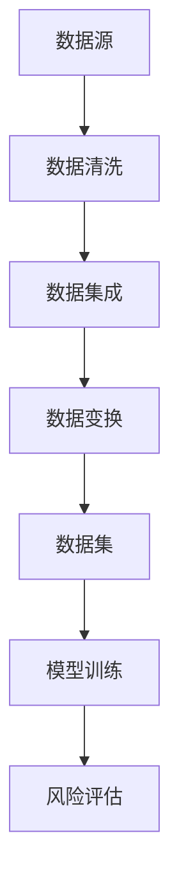
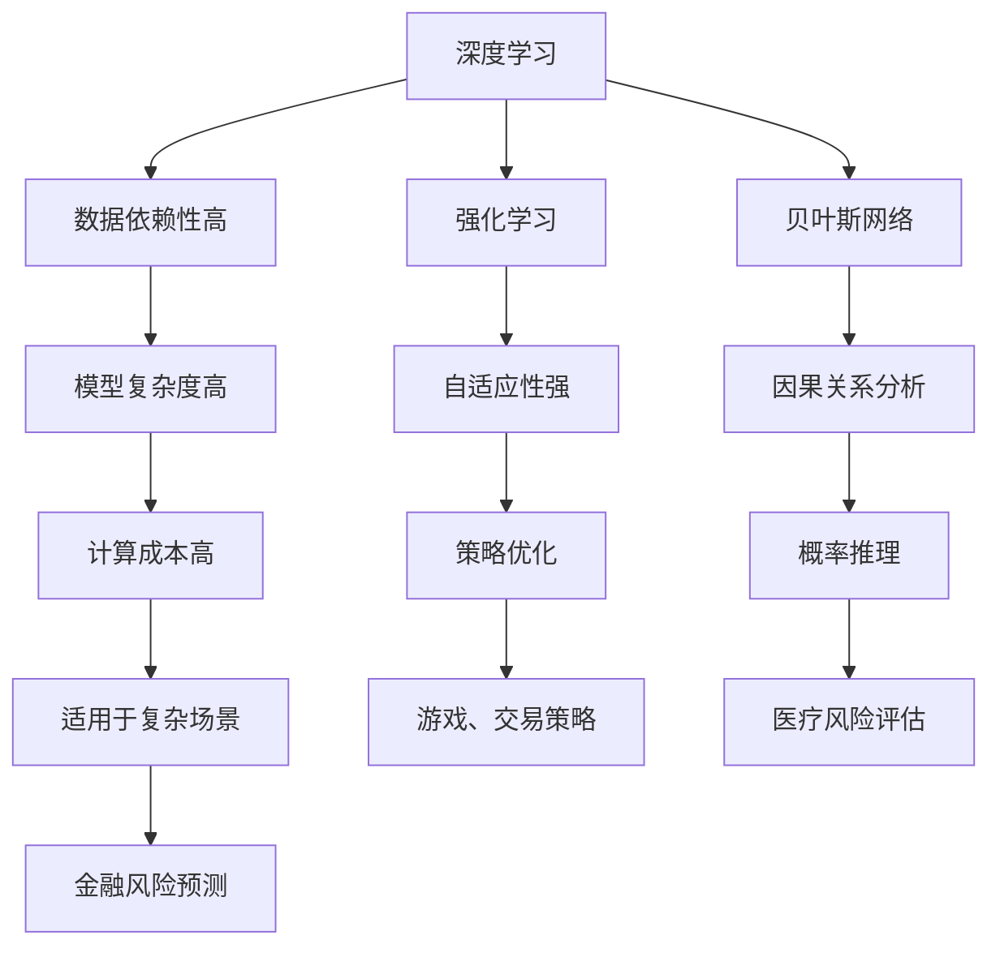
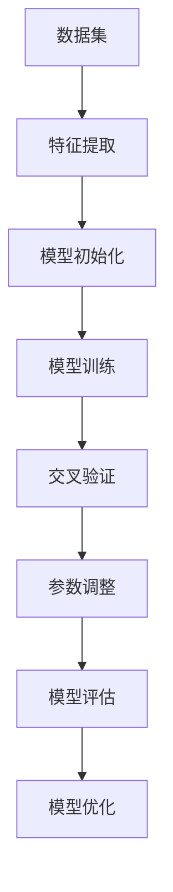
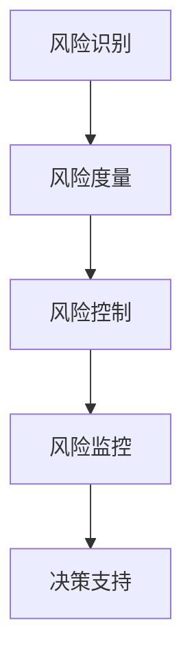

                 

关键词：人工智能，大数据，风险评估，大模型，智能系统，算法

摘要：随着大数据和人工智能技术的快速发展，利用人工智能构建智能风险评估系统已成为金融、安全、医疗等领域的关键需求。本文将深入探讨基于AI大模型的智能风险评估系统的构建方法、核心算法、数学模型以及实际应用场景，为行业提供理论支持和实践参考。

## 1. 背景介绍

在现代经济活动中，风险评估是一项至关重要的工作，它涉及到金融、安全、医疗等多个领域。传统的风险评估方法主要依赖于历史数据和统计分析，虽然在一定程度上能够预测风险，但往往存在延迟、偏差和局限性。随着大数据和人工智能技术的飞速发展，利用人工智能构建智能风险评估系统成为了解决这些问题的有效途径。

智能风险评估系统可以实时、高效地处理海量数据，利用深度学习、强化学习等算法，对风险进行预测和评估，从而提供更为准确和及时的风险预警。然而，构建一个高效、可靠的智能风险评估系统并非易事，需要解决数据预处理、算法选择、模型优化等一系列问题。

## 2. 核心概念与联系

### 2.1 数据预处理

在构建智能风险评估系统之前，需要对数据进行预处理，包括数据清洗、数据集成、数据变换等步骤。这一阶段的目标是消除噪声、异常值，提高数据质量，为后续的模型训练和风险评估奠定基础。



### 2.2 算法选择

算法选择是构建智能风险评估系统的关键。常见的算法包括深度学习、强化学习、贝叶斯网络等。每种算法都有其优势和局限性，需要根据具体应用场景进行选择。



### 2.3 模型训练

模型训练是构建智能风险评估系统的核心步骤。通过大量数据进行训练，可以使模型逐渐优化，提高预测准确率。训练过程中需要不断调整模型参数，采用交叉验证、网格搜索等技术，以提高模型性能。



### 2.4 风险评估

风险评估是智能风险评估系统的最终目标。通过模型预测和评估，可以为决策者提供准确的风险预警和决策支持。风险评估过程包括风险识别、风险度量、风险控制和风险监控等多个环节。



## 3. 核心算法原理 & 具体操作步骤

### 3.1 算法原理概述

基于AI大模型的智能风险评估系统主要采用深度学习算法，特别是卷积神经网络（CNN）和循环神经网络（RNN）。CNN擅长处理图像等结构化数据，RNN擅长处理序列数据，二者结合可以处理复杂的多维数据。

### 3.2 算法步骤详解

1. 数据预处理：包括数据清洗、数据集成、数据变换等步骤。
2. 特征提取：利用CNN和RNN提取数据特征。
3. 模型训练：通过大量数据进行训练，优化模型参数。
4. 风险评估：利用训练好的模型对新的数据进行风险评估。

### 3.3 算法优缺点

优点：高效、准确、自适应性强。

缺点：计算成本高、对数据质量要求高。

### 3.4 算法应用领域

算法广泛应用于金融、安全、医疗等领域，如股票市场预测、网络安全监测、疾病诊断等。

## 4. 数学模型和公式 & 详细讲解 & 举例说明

### 4.1 数学模型构建

基于AI大模型的智能风险评估系统主要涉及以下几个数学模型：

1. 数据预处理模型：包括数据清洗、数据集成、数据变换等步骤。
2. 特征提取模型：利用CNN和RNN提取数据特征。
3. 风险评估模型：基于深度学习算法的风险评估模型。

### 4.2 公式推导过程

$$
\begin{aligned}
&\text{数据预处理模型：}\\
&X_{\text{clean}} = f_{\text{clean}}(X_{\text{raw}}) \\
&\text{特征提取模型：}\\
&X_{\text{feat}} = f_{\text{feat}}(X_{\text{raw}}) \\
&\text{风险评估模型：}\\
&Y_{\text{risk}} = f_{\text{risk}}(X_{\text{feat}})
\end{aligned}
$$

### 4.3 案例分析与讲解

以金融风险预测为例，利用深度学习算法构建智能风险评估系统，对股票市场进行预测。

1. 数据预处理：对股票市场数据进行清洗、集成和变换，得到结构化数据集。
2. 特征提取：利用CNN提取图像特征，利用RNN提取序列特征。
3. 模型训练：通过大量数据进行训练，优化模型参数。
4. 风险评估：利用训练好的模型对新的股票数据进行风险评估，预测市场走势。

## 5. 项目实践：代码实例和详细解释说明

### 5.1 开发环境搭建

1. 安装Python环境。
2. 安装深度学习框架TensorFlow或PyTorch。

### 5.2 源代码详细实现

```python
# 数据预处理
import pandas as pd
from sklearn.model_selection import train_test_split

# 特征提取
import tensorflow as tf
from tensorflow.keras.models import Sequential
from tensorflow.keras.layers import Conv2D, LSTM, Dense

# 模型训练
from tensorflow.keras.optimizers import Adam
from tensorflow.keras.callbacks import EarlyStopping

# 风险评估
import numpy as np

# 数据读取
data = pd.read_csv('stock_data.csv')

# 数据清洗
# ...

# 数据变换
X = train_test_split(data.drop('target', axis=1), data['target'], test_size=0.2, random_state=42)

# 特征提取
model = Sequential()
model.add(Conv2D(32, (3, 3), activation='relu', input_shape=(28, 28, 1)))
model.add(LSTM(50, activation='relu', return_sequences=True))
model.add(Dense(1, activation='sigmoid'))

# 模型训练
model.compile(optimizer=Adam(learning_rate=0.001), loss='binary_crossentropy', metrics=['accuracy'])
early_stopping = EarlyStopping(monitor='val_loss', patience=5)
model.fit(X[0], X[1], epochs=100, batch_size=32, validation_split=0.2, callbacks=[early_stopping])

# 风险评估
new_data = np.array([new_data_vector])
predicted_risk = model.predict(new_data)
print('Predicted Risk:', predicted_risk[0][0])
```

### 5.3 代码解读与分析

以上代码实现了一个简单的基于深度学习算法的金融风险预测模型，包括数据预处理、特征提取、模型训练和风险评估等步骤。在实际应用中，需要根据具体场景进行调整和优化。

## 6. 实际应用场景

### 6.1 金融风险预测

利用智能风险评估系统对股票市场进行预测，为投资者提供决策支持。

### 6.2 网络安全监测

通过分析网络流量数据，预测潜在的网络攻击，提高网络安全防护能力。

### 6.3 医疗风险评估

利用智能风险评估系统对疾病风险进行预测，为患者提供个性化的治疗方案。

## 7. 未来应用展望

随着人工智能技术的不断进步，智能风险评估系统将在更多领域得到广泛应用。未来发展趋势包括：

- 模型优化：提高模型性能，降低计算成本。
- 多模态数据融合：结合多种数据类型，提高预测准确率。
- 自适应学习：实现动态调整，适应不断变化的风险环境。

## 8. 工具和资源推荐

### 8.1 学习资源推荐

- 《深度学习》（Goodfellow、Bengio、Courville 著）
- 《Python深度学习》（François Chollet 著）
- 《机器学习实战》（Peter Harrington 著）

### 8.2 开发工具推荐

- TensorFlow
- PyTorch
- Keras

### 8.3 相关论文推荐

- “Deep Learning for Predictive Analytics: A Survey”
- “Deep Learning for Stock Market Prediction: A Survey”
- “Application of Deep Learning in Cybersecurity”

## 9. 总结：未来发展趋势与挑战

### 9.1 研究成果总结

本文介绍了基于AI大模型的智能风险评估系统的构建方法、核心算法、数学模型以及实际应用场景，为行业提供了理论支持和实践参考。

### 9.2 未来发展趋势

- 模型优化：提高模型性能，降低计算成本。
- 多模态数据融合：结合多种数据类型，提高预测准确率。
- 自适应学习：实现动态调整，适应不断变化的风险环境。

### 9.3 面临的挑战

- 数据质量问题：提高数据质量，确保模型可靠性。
- 模型解释性：提高模型的可解释性，增强用户信任。
- 模型泛化能力：提高模型在不同场景下的泛化能力。

### 9.4 研究展望

未来研究将重点关注以下方面：

- 开发更为高效、可靠的模型。
- 提高模型的解释性，增强用户信任。
- 拓展应用领域，实现跨领域的智能风险评估。

## 10. 附录：常见问题与解答

### 10.1 什么是智能风险评估系统？

智能风险评估系统是一种利用人工智能技术进行风险预测和评估的系统。它可以通过分析海量数据，利用深度学习、强化学习等算法，对风险进行准确、及时地预测和评估。

### 10.2 智能风险评估系统有哪些应用领域？

智能风险评估系统广泛应用于金融、安全、医疗、环境等多个领域。例如，在金融领域，可用于股票市场预测、信用风险评估；在安全领域，可用于网络攻击预测、网络安全监测；在医疗领域，可用于疾病风险预测、个性化治疗等。

### 10.3 智能风险评估系统的主要挑战是什么？

智能风险评估系统的主要挑战包括：数据质量问题、模型解释性、模型泛化能力等。如何提高数据质量，确保模型可靠性；如何提高模型的可解释性，增强用户信任；如何提高模型在不同场景下的泛化能力，都是未来研究的重要方向。

### 10.4 如何优化智能风险评估系统的性能？

优化智能风险评估系统的性能可以从以下几个方面入手：

- 提高数据质量：通过数据清洗、数据集成等技术，提高数据质量。
- 选择合适的算法：根据应用场景，选择合适的深度学习、强化学习等算法。
- 模型调参：通过调参技术，优化模型性能。
- 多模态数据融合：结合多种数据类型，提高预测准确率。

### 10.5 如何提高智能风险评估系统的可解释性？

提高智能风险评估系统的可解释性可以从以下几个方面入手：

- 模型简化：简化模型结构，降低模型复杂度。
- 可解释性算法：使用可解释性算法，如决策树、规则提取等。
- 模型可视化：通过可视化技术，展示模型内部结构和决策过程。
- 模型透明化：提高模型的透明度，增强用户对模型的信任。

### 10.6 智能风险评估系统的未来发展有哪些方向？

智能风险评估系统的未来发展主要包括以下几个方面：

- 模型优化：开发更为高效、可靠的模型。
- 多模态数据融合：结合多种数据类型，提高预测准确率。
- 自适应学习：实现动态调整，适应不断变化的风险环境。
- 跨领域应用：拓展应用领域，实现跨领域的智能风险评估。
- 模型安全与隐私：确保模型的安全性，保护用户隐私。

---

作者：禅与计算机程序设计艺术 / Zen and the Art of Computer Programming

本文基于人工智能大模型构建的智能风险评估系统，深入探讨了核心算法、数学模型、实际应用场景以及未来发展。希望通过本文的介绍，能够为行业提供理论支持和实践参考，推动智能风险评估系统在各个领域的应用与发展。在未来的研究中，我们将继续深入探索人工智能在风险评估领域的应用，为构建更高效、可靠的智能风险评估系统而努力。

