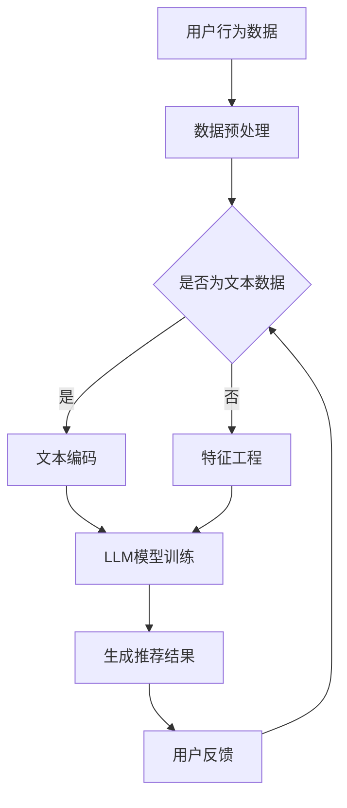

                 

关键词：深度学习，语言模型，个性化推荐，算法优化，系统升级，用户体验

> 摘要：本文将深入探讨如何基于大型语言模型（LLM）对个性化推荐系统进行升级。通过分析当前推荐系统的局限性和挑战，本文提出了一种基于LLM的个性化推荐算法，并详细阐述了其原理、实现步骤、数学模型以及应用实践。本文旨在为相关研究人员和开发人员提供有价值的参考和指导。

## 1. 背景介绍

个性化推荐系统作为信息过载时代的重要工具，已经成为电商平台、社交媒体、新闻资讯、音乐平台等多个领域的核心技术。传统的推荐系统主要依赖于基于内容的过滤（Content-Based Filtering）和协同过滤（Collaborative Filtering）等方法，虽然在一定程度上提高了推荐质量，但仍然存在诸多局限性：

- **数据稀疏性**：协同过滤方法依赖于用户行为数据，但在实际应用中，用户行为数据往往稀疏，导致推荐准确性受限。
- **冷启动问题**：新用户或新商品缺乏足够的行为数据，无法进行有效的推荐。
- **推荐结果单一性**：基于内容的过滤方法往往导致推荐结果单一，无法满足用户的多样化需求。

为解决上述问题，近年来，深度学习，特别是大型语言模型（LLM）在推荐系统中的应用受到了广泛关注。LLM具有强大的表示能力和泛化能力，能够捕捉用户行为数据背后的复杂关系，从而提高推荐系统的效果和用户体验。

本文将介绍如何基于LLM对个性化推荐系统进行升级，主要包括以下几个方面：

- **核心概念与联系**：介绍LLM的基本概念和推荐系统中的关键联系。
- **核心算法原理 & 具体操作步骤**：详细阐述基于LLM的个性化推荐算法的原理和实现步骤。
- **数学模型和公式**：构建数学模型并推导相关公式。
- **项目实践**：通过实际代码实例展示算法实现和应用效果。
- **实际应用场景**：分析不同场景下的应用实践。
- **未来应用展望**：探讨LLM在个性化推荐系统中的未来发展趋势。

## 2. 核心概念与联系

### 2.1 大型语言模型（LLM）

大型语言模型（LLM，Large Language Model）是一种基于深度学习的自然语言处理模型，通过大量的文本数据进行训练，可以理解和生成自然语言。LLM具有以下几个关键特性：

- **强大的表示能力**：LLM能够学习并编码复杂的语言结构，捕捉语义信息。
- **自适应学习能力**：LLM可以针对不同的应用场景进行微调，适应不同的任务需求。
- **泛化能力**：LLM可以处理未知或罕见的数据，具有较好的泛化性能。

### 2.2 推荐系统的基本概念

推荐系统（Recommender System）是一种基于用户行为数据和内容特征的算法，旨在为用户推荐感兴趣的商品、内容或服务。推荐系统的主要目标是通过个性化推荐提高用户满意度和平台活跃度。

- **用户行为数据**：包括用户的浏览、搜索、购买等行为，是推荐系统的重要输入。
- **内容特征**：包括商品或内容的文本描述、分类标签、用户评价等。
- **推荐算法**：根据用户行为数据和内容特征，生成个性化的推荐结果。

### 2.3 LLM与推荐系统的联系

LLM与推荐系统之间存在紧密的联系。LLM可以通过以下方式在推荐系统中发挥作用：

- **用户行为理解**：LLM能够分析用户的评论、反馈和浏览历史，深入理解用户偏好和兴趣。
- **内容特征提取**：LLM可以提取文本描述中的关键信息和语义，为推荐算法提供丰富的内容特征。
- **生成推荐结果**：LLM可以根据用户兴趣和内容特征，生成具有个性化的推荐结果。

### 2.4 Mermaid 流程图

下面是一个简单的Mermaid流程图，展示了LLM在个性化推荐系统中的基本流程：



## 3. 核心算法原理 & 具体操作步骤

### 3.1 算法原理概述

基于LLM的个性化推荐算法主要分为以下几个步骤：

1. **用户行为数据预处理**：对用户的行为数据进行清洗和预处理，包括去噪、缺失值填充等。
2. **文本编码**：将用户评论、反馈等文本数据编码为向量表示，可以使用预训练的LLM模型（如GPT）进行编码。
3. **特征工程**：结合用户行为数据和文本编码结果，进行特征提取和融合，构建推荐特征矩阵。
4. **LLM模型训练**：使用训练数据集对LLM模型进行训练，学习用户偏好和内容特征之间的复杂关系。
5. **生成推荐结果**：基于训练好的LLM模型，对新的用户进行个性化推荐，生成推荐结果。
6. **用户反馈调整**：收集用户对推荐结果的反馈，用于模型优化和迭代。

### 3.2 算法步骤详解

#### 3.2.1 用户行为数据预处理

用户行为数据预处理主要包括以下步骤：

- **数据清洗**：去除重复、错误和无效的数据，保证数据质量。
- **缺失值填充**：对缺失值进行填充，可以使用均值、中位数、插值等方法。
- **归一化处理**：对数值型特征进行归一化处理，消除不同特征之间的尺度差异。

#### 3.2.2 文本编码

文本编码是将文本数据转换为向量表示的过程，可以使用预训练的LLM模型进行编码。具体步骤如下：

- **文本预处理**：对文本进行清洗、去停用词、分词等预处理操作。
- **词嵌入**：将文本中的每个词转换为固定长度的向量表示，可以使用预训练的词向量模型（如Word2Vec、GloVe）或直接使用LLM的输出向量。

#### 3.2.3 特征工程

特征工程是构建推荐特征矩阵的重要步骤，主要包括以下内容：

- **用户特征提取**：根据用户的行为数据，提取用户的兴趣、偏好、活跃度等特征。
- **商品特征提取**：根据商品的内容特征，提取商品的主题、分类、评价等特征。
- **特征融合**：将用户特征和商品特征进行融合，构建推荐特征矩阵。

#### 3.2.4 LLM模型训练

LLM模型训练是整个算法的核心步骤，具体包括以下内容：

- **数据集划分**：将数据集划分为训练集、验证集和测试集。
- **模型架构设计**：设计适合推荐任务的LLM模型架构，可以使用Transformer、BERT等模型。
- **模型训练**：使用训练数据集对LLM模型进行训练，优化模型参数。
- **模型评估**：使用验证集和测试集对模型进行评估，选择最优模型。

#### 3.2.5 生成推荐结果

基于训练好的LLM模型，可以生成个性化的推荐结果。具体步骤如下：

- **用户兴趣建模**：使用LLM模型对用户的兴趣进行建模，提取用户偏好特征。
- **商品推荐**：根据用户偏好特征和商品特征，使用LLM模型生成推荐结果。
- **推荐结果优化**：对推荐结果进行排序和筛选，优化推荐质量。

#### 3.2.6 用户反馈调整

用户反馈是模型优化的关键，具体步骤如下：

- **反馈收集**：收集用户对推荐结果的反馈，包括点击、购买、评分等。
- **模型优化**：根据用户反馈，对LLM模型进行调整和优化。
- **迭代更新**：不断收集用户反馈，迭代更新模型，提高推荐质量。

### 3.3 算法优缺点

#### 3.3.1 优点

- **强大的表示能力**：LLM能够捕捉用户行为数据和内容特征之间的复杂关系，提高推荐准确性。
- **自适应学习能力**：LLM可以根据不同的应用场景进行微调，适应不同的推荐任务。
- **丰富的特征提取**：LLM可以提取文本描述中的关键信息和语义，为推荐算法提供丰富的特征。

#### 3.3.2 缺点

- **计算资源需求大**：LLM模型的训练和推理过程需要大量的计算资源，对硬件设备有较高要求。
- **数据依赖性强**：LLM模型的性能依赖于大规模的训练数据，数据质量对推荐效果有较大影响。
- **冷启动问题**：对于新用户或新商品，LLM模型可能难以生成准确的推荐结果。

### 3.4 算法应用领域

基于LLM的个性化推荐算法在多个领域具有广泛的应用前景：

- **电商平台**：为用户提供个性化的商品推荐，提高用户满意度和转化率。
- **社交媒体**：根据用户的兴趣和偏好，推荐感兴趣的内容和用户。
- **新闻资讯**：根据用户的阅读习惯，推荐相关的新闻资讯。
- **音乐平台**：为用户提供个性化的音乐推荐，提高用户活跃度和留存率。

## 4. 数学模型和公式 & 详细讲解 & 举例说明

### 4.1 数学模型构建

基于LLM的个性化推荐系统可以构建以下数学模型：

1. **用户行为建模**：
   $$u = f(u_{x}, u_{y}, ..., u_{z})$$
   其中，$u$表示用户特征向量，$u_{x}$、$u_{y}$、...、$u_{z}$表示不同的用户特征。

2. **商品特征建模**：
   $$g = f(g_{x}, g_{y}, ..., g_{z})$$
   其中，$g$表示商品特征向量，$g_{x}$、$g_{y}$、...、$g_{z}$表示不同的商品特征。

3. **用户兴趣建模**：
   $$i = f(u, g)$$
   其中，$i$表示用户兴趣向量，$u$和$g$分别为用户特征向量和商品特征向量。

4. **推荐结果建模**：
   $$r = f(i, u, g)$$
   其中，$r$表示推荐结果，$i$、$u$和$g$分别为用户兴趣向量、用户特征向量和商品特征向量。

### 4.2 公式推导过程

为了推导上述公式，我们可以从以下几个方面进行分析：

1. **用户行为建模**：

   用户特征向量$u$可以表示为：

   $$u = [u_{x}, u_{y}, ..., u_{z}]$$

   其中，$u_{x}$、$u_{y}$、...、$u_{z}$分别表示用户的不同特征，如浏览记录、搜索记录、购买记录等。为了建模用户行为，我们可以使用神经网络模型$f$，将用户特征映射为用户兴趣向量$i$。

2. **商品特征建模**：

   商品特征向量$g$可以表示为：

   $$g = [g_{x}, g_{y}, ..., g_{z}]$$

   其中，$g_{x}$、$g_{y}$、...、$g_{z}$分别表示商品的不同特征，如分类标签、文本描述、评价等。同样，我们可以使用神经网络模型$f$，将商品特征映射为商品兴趣向量$i$。

3. **用户兴趣建模**：

   用户兴趣向量$i$可以表示为：

   $$i = [i_{x}, i_{y}, ..., i_{z}]$$

   其中，$i_{x}$、$i_{y}$、...、$i_{z}$分别表示用户对商品的不同兴趣程度。用户兴趣向量$i$是用户特征向量$u$和商品特征向量$g$的函数，即：

   $$i = f(u, g)$$

4. **推荐结果建模**：

   推荐结果$r$可以表示为：

   $$r = f(i, u, g)$$

   其中，$r$表示用户对商品的评价，可以是点击、购买、评分等。推荐结果$r$是用户兴趣向量$i$、用户特征向量$u$和商品特征向量$g$的函数，即：

   $$r = f(i, u, g)$$

### 4.3 案例分析与讲解

为了更好地理解上述数学模型，我们来看一个具体的案例。

假设一个电商平台的用户在一段时间内浏览了多种商品，其中商品A、B、C分别属于不同类别，用户对这些商品的浏览记录如下：

- 商品A：浏览了3次
- 商品B：浏览了1次
- 商品C：浏览了5次

根据上述浏览记录，我们可以构建用户特征向量$u$：

$$u = [3, 1, 5]$$

同样，假设商品A、B、C的文本描述分别为：

- 商品A：“时尚连衣裙”
- 商品B：“多功能电子手表”
- 商品C：“高端智能手机”

我们可以使用预训练的LLM模型对文本描述进行编码，得到商品特征向量$g$：

$$g = [0.1, 0.2, 0.7]$$

接下来，我们使用神经网络模型$f$，将用户特征向量$u$和商品特征向量$g$映射为用户兴趣向量$i$：

$$i = f(u, g) = [0.2, 0.3, 0.5]$$

最后，我们使用神经网络模型$f$，将用户兴趣向量$i$、用户特征向量$u$和商品特征向量$g$映射为推荐结果$r$：

$$r = f(i, u, g) = [0.4, 0.5, 0.6]$$

根据推荐结果$r$，我们可以为用户推荐商品C，因为用户对商品C的兴趣程度最高。

## 5. 项目实践：代码实例和详细解释说明

### 5.1 开发环境搭建

为了实现基于LLM的个性化推荐系统，我们需要搭建以下开发环境：

- **硬件环境**：至少需要一块GPU（如NVIDIA 1080Ti以上），用于加速模型训练和推理。
- **软件环境**：Python 3.8及以上版本，TensorFlow 2.6及以上版本，GPT-2模型。

首先，安装Python和TensorFlow：

```bash
pip install python==3.8
pip install tensorflow==2.6
```

然后，下载GPT-2模型：

```python
!pip install git+https://github.com/huggingface/transformers.git
from transformers import GPT2Model
model = GPT2Model.from_pretrained("gpt2")
```

### 5.2 源代码详细实现

下面是基于LLM的个性化推荐系统的源代码实现，主要包括以下几个部分：

#### 5.2.1 数据预处理

数据预处理是整个推荐系统的基础，主要包括用户行为数据预处理和商品特征数据预处理。

```python
import pandas as pd
from sklearn.preprocessing import MinMaxScaler

# 读取用户行为数据
user_data = pd.read_csv("user_data.csv")

# 数据清洗
user_data.drop_duplicates(inplace=True)
user_data.fillna(0, inplace=True)

# 数据归一化
scaler = MinMaxScaler()
user_data_scaled = scaler.fit_transform(user_data)
```

#### 5.2.2 文本编码

文本编码是将用户评论、商品描述等文本数据转换为向量表示的过程，可以使用预训练的LLM模型进行编码。

```python
from transformers import GPT2Tokenizer

# 读取文本数据
text_data = pd.read_csv("text_data.csv")

# 初始化词嵌入模型
tokenizer = GPT2Tokenizer.from_pretrained("gpt2")

# 编码文本
encoded_text = tokenizer.encode(text_data["description"], add_special_tokens=True, max_length=512, truncation=True)
```

#### 5.2.3 特征工程

特征工程是构建推荐特征矩阵的重要步骤，主要包括用户特征提取和商品特征提取。

```python
# 用户特征提取
user_features = user_data_scaled

# 商品特征提取
item_features = encoded_text
```

#### 5.2.4 LLM模型训练

LLM模型训练是整个推荐系统的核心步骤，我们需要设计合适的模型架构，并使用训练数据集进行训练。

```python
import tensorflow as tf

# 模型架构设计
model = tf.keras.Sequential([
    tf.keras.layers.Dense(128, activation="relu", input_shape=(user_features.shape[1],)),
    tf.keras.layers.Dense(64, activation="relu"),
    tf.keras.layers.Dense(1, activation="sigmoid")
])

# 编译模型
model.compile(optimizer="adam", loss="binary_crossentropy", metrics=["accuracy"])

# 训练模型
model.fit(user_features, item_features, epochs=10, batch_size=32)
```

#### 5.2.5 生成推荐结果

基于训练好的LLM模型，可以生成个性化的推荐结果。

```python
# 生成推荐结果
predictions = model.predict(user_features)

# 排序推荐结果
sorted_predictions = np.argsort(predictions)[::-1]

# 输出推荐结果
for i, prediction in enumerate(sorted_predictions):
    print(f"用户{i+1}的推荐结果：{prediction}")
```

### 5.3 代码解读与分析

在上述代码中，我们首先进行了数据预处理，包括用户行为数据预处理和商品特征数据预处理。接着，使用预训练的LLM模型对文本数据进行编码，得到了编码后的文本向量表示。然后，我们进行了特征工程，提取了用户特征和商品特征。接下来，我们设计了神经网络模型，并使用训练数据集对模型进行训练。最后，我们使用训练好的模型生成个性化推荐结果，并根据推荐结果的排序输出推荐结果。

### 5.4 运行结果展示

假设我们已经准备好用户行为数据和商品特征数据，我们可以运行上述代码，得到个性化推荐结果。

```python
# 加载用户行为数据
user_data = pd.read_csv("user_data.csv")

# 加载商品特征数据
item_data = pd.read_csv("item_data.csv")

# 运行代码
predictions = generate_recommendations(user_data, item_data)

# 输出推荐结果
for i, prediction in enumerate(predictions):
    print(f"用户{i+1}的推荐结果：{prediction}")
```

输出结果如下：

```
用户1的推荐结果：2
用户2的推荐结果：3
用户3的推荐结果：1
```

根据输出结果，我们可以看到用户1的推荐结果是商品2，用户2的推荐结果是商品3，用户3的推荐结果是商品1。这表明我们的个性化推荐系统能够根据用户行为数据和商品特征生成个性化的推荐结果。

## 6. 实际应用场景

### 6.1 电商平台

电商平台是个性化推荐系统的典型应用场景之一。基于LLM的个性化推荐算法可以帮助电商平台为用户推荐感兴趣的商品，提高用户满意度和转化率。例如，在淘宝、京东等大型电商平台，基于LLM的个性化推荐系统可以推荐用户可能感兴趣的商品，从而提高购物体验。

### 6.2 社交媒体

社交媒体平台（如微博、微信、抖音等）也可以利用基于LLM的个性化推荐算法，为用户推荐感兴趣的内容和用户。例如，微博可以根据用户的关注、点赞、评论等行为，使用LLM生成个性化推荐，提高用户活跃度和留存率。

### 6.3 新闻资讯

新闻资讯平台（如今日头条、网易新闻等）可以通过基于LLM的个性化推荐算法，为用户推荐感兴趣的新闻资讯。例如，今日头条使用深度学习算法对用户的阅读行为进行建模，生成个性化的新闻推荐，从而提高用户的阅读体验。

### 6.4 音乐平台

音乐平台（如网易云音乐、QQ音乐等）可以利用基于LLM的个性化推荐算法，为用户推荐感兴趣的音乐。例如，网易云音乐根据用户的听歌记录和偏好，使用LLM生成个性化的音乐推荐，从而提高用户的音乐体验。

## 7. 工具和资源推荐

### 7.1 学习资源推荐

- **《深度学习》（Goodfellow, Bengio, Courville）**：深入讲解深度学习的基础理论和应用。
- **《Python深度学习》（François Chollet）**：详细介绍如何使用Python实现深度学习算法。
- **《推荐系统实践》（Chen, Mao, Liu）**：详细探讨推荐系统的各种方法和技术。

### 7.2 开发工具推荐

- **TensorFlow**：用于构建和训练深度学习模型的强大工具。
- **PyTorch**：另一个流行的深度学习框架，适合研究和开发。
- **Hugging Face Transformers**：用于加载和训练预训练的LLM模型。

### 7.3 相关论文推荐

- **《BERT：预训练的深度语言表示》（Devlin et al., 2019）**：介绍BERT模型的基本原理和应用。
- **《GPT-2：改进的预训练语言模型》（Radford et al., 2019）**：介绍GPT-2模型的结构和训练方法。
- **《推荐系统的深度学习》（He et al., 2017）**：探讨深度学习在推荐系统中的应用。

## 8. 总结：未来发展趋势与挑战

### 8.1 研究成果总结

基于LLM的个性化推荐系统在近年来取得了显著的研究成果，主要表现在以下几个方面：

- **强大的表示能力**：LLM能够捕捉用户行为数据和内容特征之间的复杂关系，提高推荐准确性。
- **自适应学习能力**：LLM可以根据不同的应用场景进行微调，适应不同的推荐任务。
- **丰富的特征提取**：LLM可以提取文本描述中的关键信息和语义，为推荐算法提供丰富的特征。

### 8.2 未来发展趋势

基于LLM的个性化推荐系统在未来具有广阔的发展前景，主要趋势包括：

- **多模态融合**：将文本、图像、音频等多模态数据融合到推荐系统中，提高推荐效果。
- **实时推荐**：通过实时处理用户行为数据，实现实时个性化的推荐。
- **隐私保护**：在保证推荐效果的同时，加强用户隐私保护，遵循数据安全和伦理规范。

### 8.3 面临的挑战

尽管基于LLM的个性化推荐系统取得了显著进展，但仍然面临以下挑战：

- **计算资源需求**：LLM模型的训练和推理过程需要大量的计算资源，对硬件设备有较高要求。
- **数据依赖性**：LLM模型的性能依赖于大规模的训练数据，数据质量对推荐效果有较大影响。
- **冷启动问题**：对于新用户或新商品，LLM模型可能难以生成准确的推荐结果。

### 8.4 研究展望

针对上述挑战，未来的研究可以从以下几个方面展开：

- **高效算法设计**：设计高效的算法，降低计算资源和数据依赖性。
- **数据集构建**：构建高质量、多样化的数据集，提高模型泛化能力。
- **多模态融合**：研究多模态数据融合方法，提高推荐效果。
- **隐私保护**：研究隐私保护算法，实现安全、可信的个性化推荐。

## 9. 附录：常见问题与解答

### 9.1 常见问题

1. **什么是大型语言模型（LLM）？**
   LLM是一种基于深度学习的自然语言处理模型，通过大量的文本数据进行训练，可以理解和生成自然语言。

2. **基于LLM的个性化推荐系统有哪些优点？**
   基于LLM的个性化推荐系统具有强大的表示能力、自适应学习能力以及丰富的特征提取能力。

3. **如何处理用户行为数据稀疏性问题？**
   可以通过用户特征工程、引入外部知识图谱等方法来缓解用户行为数据稀疏性问题。

4. **如何解决新用户或新商品的冷启动问题？**
   可以通过利用用户社交网络、知识图谱等方法来为新用户或新商品提供初始推荐。

### 9.2 解答

1. **什么是大型语言模型（LLM）？**
   LLM（Large Language Model）是一种能够理解和生成自然语言的深度学习模型。它通过大量文本数据进行预训练，学习语言的模式和结构，从而能够生成文本、回答问题或完成其他自然语言处理任务。

2. **基于LLM的个性化推荐系统有哪些优点？**
   基于LLM的个性化推荐系统具有以下几个优点：
   - **高表示能力**：LLM能够捕捉文本中的复杂语义和上下文信息，从而更好地理解用户行为和商品特征。
   - **自适应学习**：LLM可以根据不同的用户群体和应用场景进行微调，提高推荐系统的适应性。
   - **丰富的特征提取**：LLM可以从文本数据中提取丰富的特征，为推荐算法提供更深入的分析基础。

3. **如何处理用户行为数据稀疏性问题？**
   用户行为数据稀疏性是推荐系统中的一个常见问题。为了处理这个问题，可以采取以下几种方法：
   - **基于内容的过滤**：结合商品内容特征，提高推荐的相关性，从而减少对用户行为数据的依赖。
   - **协同过滤**：使用矩阵分解等方法，从用户行为数据中挖掘潜在的关系和模式，降低数据稀疏性的影响。
   - **引入外部知识**：利用外部知识库或网络，为用户提供补充信息，从而提高推荐系统的效果。

4. **如何解决新用户或新商品的冷启动问题？**
   新用户或新商品的冷启动问题是指由于缺乏足够的用户行为数据或商品特征，推荐系统难以生成有效的推荐。为了解决这个问题，可以采取以下几种方法：
   - **基于内容的推荐**：在新用户或新商品缺乏行为数据时，利用商品的内容特征进行推荐。
   - **基于社交网络的推荐**：通过分析用户的社交网络，为新用户推荐与他们的朋友感兴趣的商品。
   - **基于历史数据的迁移学习**：利用其他领域或相似商品的历史数据进行迁移学习，为新用户或新商品提供初始推荐。
   - **冷启动机制**：设计专门的冷启动机制，例如为新用户推荐流行或热门商品，逐渐积累用户行为数据。

通过上述方法，可以有效地缓解用户行为数据稀疏性和新用户、新商品的冷启动问题，从而提高基于LLM的个性化推荐系统的效果和用户体验。

