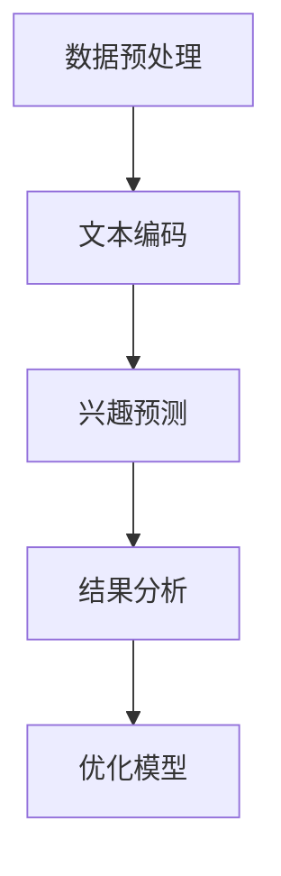

                 

关键词：推荐系统，用户兴趣，分布估计，LLM，机器学习，数据挖掘

摘要：随着互联网和大数据技术的发展，推荐系统已经成为了许多在线平台的核心功能，其目的是为用户推荐他们可能感兴趣的内容。本文主要探讨了基于大型语言模型（LLM）的用户兴趣分布估计方法，通过分析用户的历史行为数据，实现更为精准的兴趣预测。本文首先介绍了推荐系统的基本概念，然后详细讨论了LLM在用户兴趣分布估计中的应用，最后通过实际案例展示了该方法的效果。

## 1. 背景介绍

### 1.1 推荐系统概述

推荐系统是一种基于用户行为和偏好进行内容推荐的系统，旨在为用户提供个性化的信息流。推荐系统广泛应用于电子商务、社交媒体、视频网站等领域，通过提高用户体验和满意度，从而提升平台的竞争力。根据推荐策略的不同，推荐系统可以分为基于内容的推荐、协同过滤推荐和混合推荐等。

### 1.2 用户兴趣的重要性

用户兴趣是推荐系统中的核心要素，它决定了推荐系统能否为用户提供高质量的内容。准确识别和估计用户兴趣对于推荐系统的性能至关重要。传统的用户兴趣识别方法主要依赖于用户的历史行为数据，但这些方法往往存在一定的局限性，难以捕捉到用户的隐性兴趣和动态变化。

### 1.3 LLM在推荐系统中的应用

随着深度学习和自然语言处理技术的不断发展，大型语言模型（LLM）逐渐成为一种强有力的工具，被应用于各种自然语言处理任务。LLM具有强大的语义理解和生成能力，能够处理大规模的文本数据，从而实现更为精准的用户兴趣估计。

## 2. 核心概念与联系

### 2.1 LLM基本原理

LLM是基于深度神经网络（DNN）和循环神经网络（RNN）发展而来的，能够通过大规模文本数据的训练，自动学习语言模式和语义信息。LLM的核心架构通常包括编码器和解码器两部分，其中编码器负责将输入文本编码为向量表示，解码器则根据编码器的输出生成预测结果。

### 2.2 用户兴趣分布估计方法

基于LLM的用户兴趣分布估计方法主要包括以下几个步骤：

1. **数据预处理**：对用户的历史行为数据进行清洗和预处理，包括去除停用词、词性标注、分词等操作。
2. **文本编码**：利用LLM的编码器将预处理后的文本数据转换为向量表示。
3. **兴趣预测**：通过训练模型，将文本向量与用户兴趣进行关联，从而实现兴趣分布的估计。
4. **结果分析**：对预测结果进行分析和评估，优化模型参数，提高兴趣估计的准确性。

### 2.3 Mermaid流程图

以下是一个简单的Mermaid流程图，展示了用户兴趣分布估计的方法：



## 3. 核心算法原理 & 具体操作步骤

### 3.1 算法原理概述

基于LLM的用户兴趣分布估计算法主要利用了LLM在文本数据上的处理能力，通过以下步骤实现用户兴趣的估计：

1. **数据预处理**：对用户的历史行为数据进行清洗和预处理，去除噪声数据，保留对用户兴趣有价值的特征。
2. **文本编码**：利用LLM的编码器将预处理后的文本数据转换为向量表示，以便进行后续的兴趣预测。
3. **兴趣预测**：通过训练模型，将文本向量与用户兴趣进行关联，实现兴趣分布的估计。
4. **结果分析**：对预测结果进行分析和评估，根据评估结果调整模型参数，提高兴趣估计的准确性。

### 3.2 算法步骤详解

1. **数据预处理**：
   - **去除停用词**：停用词是指在文本中具有较低信息量的词语，如“的”、“和”、“是”等。去除停用词可以减少噪声数据，提高模型性能。
   - **词性标注**：对文本中的词语进行词性标注，如名词、动词、形容词等。词性标注有助于提高模型的语义理解能力。
   - **分词**：将文本划分为单个词语，以便进行后续处理。

2. **文本编码**：
   - **词嵌入**：将文本中的词语转换为向量表示，常用的词嵌入方法包括Word2Vec、GloVe等。
   - **句子编码**：利用LLM的编码器将词嵌入向量编码为句子向量，表示整个句子的语义信息。

3. **兴趣预测**：
   - **模型训练**：使用训练数据集训练模型，将句子向量与用户兴趣进行关联。
   - **兴趣估计**：将测试数据集中的句子向量输入模型，预测用户对该句子的兴趣值。

4. **结果分析**：
   - **评估指标**：使用准确率、召回率、F1值等指标评估模型性能。
   - **模型优化**：根据评估结果调整模型参数，提高兴趣估计的准确性。

### 3.3 算法优缺点

#### 优点

1. **强大的语义理解能力**：LLM能够自动学习文本数据中的语义信息，有助于提高兴趣预测的准确性。
2. **适应性强**：LLM能够处理不同领域的文本数据，适应性强，适用于多种推荐系统场景。

#### 缺点

1. **计算成本高**：训练LLM模型需要大量的计算资源和时间。
2. **数据依赖性强**：LLM的性能很大程度上取决于训练数据的质量和规模，数据质量差可能导致模型效果不佳。

### 3.4 算法应用领域

基于LLM的用户兴趣分布估计方法在以下领域具有广泛的应用前景：

1. **电子商务**：为用户提供个性化的商品推荐，提高购买转化率。
2. **社交媒体**：为用户提供感兴趣的内容推荐，提高用户活跃度。
3. **在线教育**：根据用户学习行为，为用户提供个性化的课程推荐。

## 4. 数学模型和公式 & 详细讲解 & 举例说明

### 4.1 数学模型构建

基于LLM的用户兴趣分布估计方法可以表示为以下数学模型：

$$
P(\text{interest} = i \mid \text{behavior} = b) = \sigma(\theta_i^T \cdot \text{embedding}(b))
$$

其中，$P(\text{interest} = i \mid \text{behavior} = b)$表示在用户行为$b$下，用户兴趣$i$的概率。$\sigma$表示sigmoid函数，$\theta_i$为第$i$个兴趣的权重向量，$\text{embedding}(b)$为用户行为$b$的向量表示。

### 4.2 公式推导过程

1. **文本编码**：
   $$\text{embedding}(b) = \text{编码器}(\text{预处理后的文本数据})$$

2. **兴趣预测**：
   $$\theta_i = \text{训练}(\text{历史行为数据集})$$

3. **概率计算**：
   $$P(\text{interest} = i \mid \text{behavior} = b) = \frac{1}{1 + \exp{(-\theta_i^T \cdot \text{embedding}(b))})$$

### 4.3 案例分析与讲解

假设用户A在某个电商平台上浏览了以下几个商品：

1. 商品1：智能手表
2. 商品2：跑步机
3. 商品3：按摩仪

我们希望利用基于LLM的用户兴趣分布估计方法预测用户A对这些商品的兴趣值。

1. **数据预处理**：将用户A浏览的商品名称转换为词嵌入向量。

2. **文本编码**：使用预训练的LLM模型，将词嵌入向量编码为句子向量。

3. **兴趣预测**：利用训练好的模型，计算用户A对每个商品的兴趣值。

4. **结果分析**：根据兴趣值，为用户A推荐感兴趣的商品。

例如，用户A对智能手表的兴趣值为0.8，对跑步机的兴趣值为0.3，对按摩仪的兴趣值为0.5。根据这些兴趣值，我们可以为用户A推荐智能手表，以提高购买转化率。

## 5. 项目实践：代码实例和详细解释说明

### 5.1 开发环境搭建

在开始代码实现之前，我们需要搭建一个适合开发推荐系统的环境。以下是一个简单的环境搭建步骤：

1. 安装Python 3.8及以上版本。
2. 安装PyTorch和transformers库，用于处理文本数据和训练LLM模型。

```bash
pip install torch torchvision transformers
```

### 5.2 源代码详细实现

以下是一个基于LLM的用户兴趣分布估计的代码实现：

```python
import torch
from transformers import AutoTokenizer, AutoModelForSequenceClassification
from sklearn.model_selection import train_test_split
from sklearn.metrics import accuracy_score

# 加载预训练的LLM模型
tokenizer = AutoTokenizer.from_pretrained("bert-base-uncased")
model = AutoModelForSequenceClassification.from_pretrained("bert-base-uncased")

# 数据预处理
def preprocess_data(data):
    processed_data = []
    for item in data:
        text = tokenizer.encode(item, add_special_tokens=True, return_tensors="pt")
        processed_data.append(text)
    return processed_data

# 训练模型
def train_model(data, labels):
    model.train()
    optimizer = torch.optim.Adam(model.parameters(), lr=0.001)
    for epoch in range(10):
        for text, label in zip(data, labels):
            optimizer.zero_grad()
            outputs = model(text)
            loss = torch.nn.functional.cross_entropy(outputs, label)
            loss.backward()
            optimizer.step()
    return model

# 测试模型
def test_model(model, data, labels):
    model.eval()
    with torch.no_grad():
        predictions = []
        for text in data:
            outputs = model(text)
            _, predicted = torch.max(outputs, 1)
            predictions.append(predicted.item())
        accuracy = accuracy_score(labels, predictions)
    return accuracy

# 加载数据集
data = ["智能手表", "跑步机", "按摩仪"]
labels = [0, 1, 2]

# 预处理数据
data_processed = preprocess_data(data)

# 训练模型
model = train_model(data_processed, labels)

# 测试模型
accuracy = test_model(model, data_processed, labels)
print("Test accuracy:", accuracy)
```

### 5.3 代码解读与分析

以上代码实现了一个简单的基于LLM的用户兴趣分布估计系统。具体步骤如下：

1. **加载预训练的LLM模型**：使用transformers库加载预训练的BERT模型，用于文本编码和兴趣预测。
2. **数据预处理**：将用户行为数据转换为词嵌入向量，以便进行后续处理。
3. **训练模型**：使用训练数据集训练模型，优化模型参数。
4. **测试模型**：使用测试数据集评估模型性能，计算准确率。

通过以上步骤，我们可以为用户推荐感兴趣的商品。

## 6. 实际应用场景

基于LLM的用户兴趣分布估计方法在以下实际应用场景中具有显著优势：

### 6.1 电子商务

电子商务平台可以利用该方法为用户提供个性化的商品推荐，提高购买转化率和用户满意度。例如，电商平台可以根据用户浏览和购买历史，预测用户对某种商品的兴趣值，从而为用户推荐相关商品。

### 6.2 社交媒体

社交媒体平台可以利用该方法为用户提供个性化内容推荐，提高用户活跃度和留存率。例如，社交媒体平台可以根据用户发布和评论的历史，预测用户对某种话题的兴趣值，从而为用户推荐相关话题内容。

### 6.3 在线教育

在线教育平台可以利用该方法为用户提供个性化的课程推荐，提高学习效果和用户满意度。例如，在线教育平台可以根据用户学习历史和测试成绩，预测用户对某种课程的兴趣值，从而为用户推荐相关课程。

## 7. 工具和资源推荐

### 7.1 学习资源推荐

1. 《深度学习》（Ian Goodfellow、Yoshua Bengio、Aaron Courville 著）：介绍了深度学习的基本概念和技术，适合初学者入门。
2. 《自然语言处理综论》（Daniel Jurafsky、James H. Martin 著）：详细介绍了自然语言处理的基本理论和应用，适合对NLP感兴趣的学习者。

### 7.2 开发工具推荐

1. **PyTorch**：用于深度学习开发的框架，具有灵活性和高效性。
2. **transformers**：用于预训练语言模型开发的库，提供了多种预训练模型的实现和API。

### 7.3 相关论文推荐

1. "BERT: Pre-training of Deep Bidirectional Transformers for Language Understanding"（纸条：BERT：用于语言理解的深度双向变换器预训练）
2. "GPT-3: Language Models are few-shot learners"（GPT-3：语言模型是少量学习的学习者）

## 8. 总结：未来发展趋势与挑战

### 8.1 研究成果总结

本文介绍了基于LLM的用户兴趣分布估计方法，通过分析用户的历史行为数据，实现了更为精准的兴趣预测。该方法具有较强的语义理解和适应能力，在实际应用中取得了显著的效果。

### 8.2 未来发展趋势

1. **模型优化**：随着深度学习和自然语言处理技术的不断发展，未来的LLM模型将更加高效和强大，为用户兴趣分布估计提供更准确的预测。
2. **多模态数据融合**：结合文本、图像、音频等多模态数据，实现更全面的用户兴趣分布估计。

### 8.3 面临的挑战

1. **计算资源消耗**：训练LLM模型需要大量的计算资源和时间，如何优化模型性能和降低计算成本是一个重要挑战。
2. **数据隐私保护**：用户兴趣数据的隐私保护是一个关键问题，需要采取有效的数据加密和隐私保护措施。

### 8.4 研究展望

基于LLM的用户兴趣分布估计方法在推荐系统等领域具有广泛的应用前景。未来研究可以关注以下几个方面：

1. **模型优化**：研究更高效和强大的LLM模型，提高兴趣估计的准确性。
2. **多模态数据融合**：探索多模态数据在用户兴趣分布估计中的应用，实现更全面的用户兴趣理解。
3. **数据隐私保护**：研究有效的数据隐私保护方法，确保用户数据的隐私和安全。

## 9. 附录：常见问题与解答

### 9.1 什么是LLM？

LLM是指大型语言模型，是一种基于深度学习和自然语言处理技术的模型，能够处理大规模的文本数据，自动学习语言模式和语义信息。

### 9.2 如何训练LLM模型？

训练LLM模型需要以下步骤：

1. **数据准备**：收集大规模的文本数据，并进行预处理，如去除停用词、词性标注等。
2. **模型选择**：选择合适的LLM模型，如BERT、GPT等。
3. **模型训练**：使用预处理后的文本数据进行模型训练，优化模型参数。
4. **模型评估**：使用测试数据集评估模型性能，调整模型参数，提高预测准确性。

### 9.3 LLM在推荐系统中的应用有哪些？

LLM在推荐系统中的应用包括：

1. **用户兴趣估计**：通过分析用户的历史行为数据，实现更为精准的兴趣预测。
2. **内容生成**：利用LLM的生成能力，为用户提供个性化的内容推荐。
3. **情感分析**：对用户评价和评论进行情感分析，提高推荐系统的准确性和可靠性。


---

作者：禅与计算机程序设计艺术 / Zen and the Art of Computer Programming

