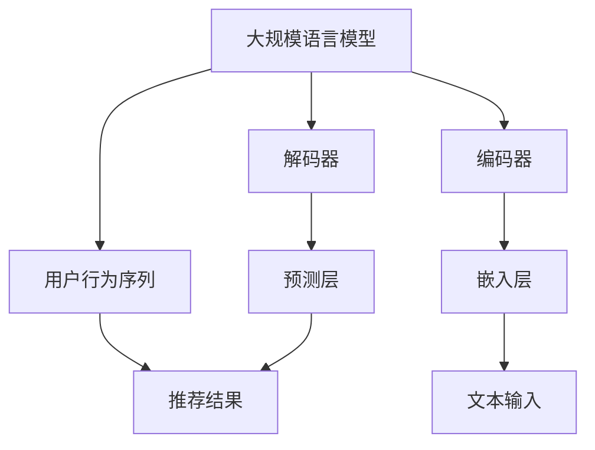

                 

关键词：大规模语言模型（LLM）、推荐系统、用户行为序列、预测、人工智能

摘要：本文深入探讨了大规模语言模型（LLM）在推荐系统中的应用，特别是用户行为序列的预测。通过介绍LLM的基本原理，分析其在推荐系统中的优势和应用，本文将详细讲解如何利用LLM进行用户行为序列预测，并提供相关数学模型、算法步骤、项目实践以及实际应用场景。本文旨在为开发者提供有价值的参考，推动推荐系统技术的发展。

## 1. 背景介绍

### 推荐系统的现状与挑战

推荐系统是一种自动化决策系统，旨在根据用户的兴趣和行为，为他们提供个性化的信息和服务。随着互联网的快速发展，推荐系统在电子商务、社交媒体、在线新闻、音乐和视频等领域得到了广泛应用。然而，现有的推荐系统面临着一些挑战：

1. **用户隐私保护**：推荐系统通常需要收集和处理用户的个人信息，如何保护用户隐私成为一个重要问题。
2. **冷启动问题**：当新用户加入系统或系统引入新商品时，如何快速为用户推荐合适的商品或内容。
3. **长尾效应**：推荐系统往往更倾向于热门商品或内容，而忽视了长尾用户和长尾内容。
4. **实时性**：随着用户行为的实时变化，如何快速调整推荐结果，提高用户体验。

### 大规模语言模型（LLM）的崛起

大规模语言模型（LLM）是近年来人工智能领域的重要突破，具有强大的文本生成、理解、翻译和分类能力。LLM如GPT-3、BERT等，通过训练数以亿计的参数，可以捕捉到语言的深层语义和上下文信息，实现了前所未有的文本处理性能。这使得LLM在自然语言处理（NLP）领域取得了显著成果，也为推荐系统带来了新的契机。

## 2. 核心概念与联系

### 大规模语言模型（LLM）的原理

大规模语言模型（LLM）基于深度神经网络，通过自回归的方式学习文本数据的概率分布。LLM的核心结构包括：

1. **嵌入层（Embedding Layer）**：将输入的文本转换为密集向量表示。
2. **编码器（Encoder）**：利用多层循环神经网络或Transformer结构对文本进行编码，捕捉上下文信息。
3. **解码器（Decoder）**：根据编码器输出的上下文信息，生成文本序列。

### 推荐系统中的用户行为序列

用户行为序列是指用户在推荐系统中的连续行为，如点击、购买、浏览等。这些行为反映了用户的兴趣和偏好，是推荐系统进行个性化推荐的重要依据。然而，用户行为序列往往具有复杂性和不确定性，难以直接用于预测。

### LLM在推荐系统中的应用

LLM在推荐系统中的应用主要在于用户行为序列的预测。通过训练LLM，可以捕捉用户行为序列的潜在模式和关联性，从而实现精准的推荐。具体应用包括：

1. **用户兴趣建模**：利用LLM分析用户历史行为，预测用户可能感兴趣的内容。
2. **实时推荐**：根据用户实时行为，快速调整推荐结果，提高推荐实时性。
3. **冷启动处理**：通过LLM预测新用户的行为模式，为其推荐合适的商品或内容。
4. **长尾内容推荐**：利用LLM捕捉长尾用户和内容的潜在关联，提高长尾内容的曝光度。

### 架构图



## 3. 核心算法原理 & 具体操作步骤

### 3.1 算法原理概述

基于LLM的用户行为序列预测算法主要包括以下步骤：

1. **数据预处理**：对用户行为序列进行清洗、去重和填充等操作，确保数据质量。
2. **特征提取**：利用LLM对用户行为序列进行编码，提取潜在特征。
3. **模型训练**：使用提取的潜在特征，训练基于LLM的预测模型。
4. **预测与推荐**：根据用户实时行为，利用训练好的模型进行预测，生成推荐结果。

### 3.2 算法步骤详解

1. **数据预处理**：

   - 数据清洗：去除无效、重复的数据，确保数据的一致性和完整性。
   - 去重：对用户行为序列进行去重处理，避免重复推荐。
   - 填充：对于缺失的数据，利用插值、均值等方法进行填充，提高数据质量。

2. **特征提取**：

   - 文本表示：将用户行为序列转换为文本格式，如序列标注、序列编码等。
   - 编码器：利用预训练的LLM，如BERT，对用户行为序列进行编码，提取潜在特征。

3. **模型训练**：

   - 数据集划分：将预处理后的数据集划分为训练集、验证集和测试集。
   - 模型训练：使用训练集数据，训练基于LLM的预测模型，如序列生成模型、序列分类模型等。
   - 模型评估：使用验证集和测试集，评估模型性能，调整模型参数。

4. **预测与推荐**：

   - 实时预测：根据用户实时行为，利用训练好的模型进行预测。
   - 推荐生成：根据预测结果，生成推荐列表，推荐给用户。

### 3.3 算法优缺点

**优点**：

1. **强大的语义理解能力**：LLM能够捕捉用户行为序列的深层语义和上下文信息，提高预测准确性。
2. **自适应能力**：LLM可以根据用户实时行为进行调整，实现实时推荐。
3. **通用性**：LLM可以应用于多种推荐场景，如电商、社交媒体、在线新闻等。

**缺点**：

1. **计算资源消耗大**：LLM的训练和预测需要大量的计算资源和时间。
2. **数据隐私问题**：推荐系统需要收集和处理用户的个人信息，如何保护用户隐私是一个重要挑战。
3. **长尾问题**：LLM在处理长尾用户和长尾内容时，可能存在不足。

### 3.4 算法应用领域

基于LLM的用户行为序列预测算法在以下领域具有广泛应用：

1. **电商推荐**：根据用户购买历史、浏览记录等行为，预测用户可能感兴趣的商品，提高销售转化率。
2. **社交媒体**：根据用户发布、点赞、评论等行为，预测用户可能感兴趣的内容，提高用户粘性和活跃度。
3. **在线新闻**：根据用户阅读、分享等行为，预测用户可能感兴趣的新闻，提高新闻曝光度和用户满意度。
4. **音乐与视频**：根据用户听歌、观看等行为，预测用户可能感兴趣的音乐和视频，提高用户体验。

## 4. 数学模型和公式 & 详细讲解 & 举例说明

### 4.1 数学模型构建

基于LLM的用户行为序列预测可以建模为一个序列生成问题，即给定用户行为序列$x_t$，预测下一个行为$x_{t+1}$。数学模型可以表示为：

$$
P(x_{t+1} | x_t, x_{t-1}, ..., x_1) = \frac{e^{f(x_{t+1}, x_t, x_{t-1}, ..., x_1)}}{\sum_{y} e^{f(y, x_t, x_{t-1}, ..., x_1)}}
$$

其中，$f(x_{t+1}, x_t, x_{t-1}, ..., x_1)$为预测函数，$P(x_{t+1} | x_t, x_{t-1}, ..., x_1)$为给定前一个行为序列后，预测下一个行为的概率。

### 4.2 公式推导过程

公式推导过程可以分为以下几个步骤：

1. **嵌入层**：将用户行为序列$x_t$转换为嵌入向量$e_t$。

$$
e_t = embedding(x_t)
$$

其中，$embedding$为嵌入函数。

2. **编码器**：利用编码器对用户行为序列进行编码，得到编码表示$c_t$。

$$
c_t = encoder(e_t)
$$

其中，$encoder$为编码器函数。

3. **预测函数**：利用编码表示$c_t$和$c_{t-1}$，计算预测函数$f(x_{t+1}, x_t, x_{t-1}, ..., x_1)$。

$$
f(x_{t+1}, x_t, x_{t-1}, ..., x_1) = f(c_{t+1}, c_t, c_{t-1}, ..., c_1)
$$

4. **概率分布**：利用预测函数$f(x_{t+1}, x_t, x_{t-1}, ..., x_1)$，计算下一个行为的概率分布$P(x_{t+1} | x_t, x_{t-1}, ..., x_1)$。

### 4.3 案例分析与讲解

假设用户行为序列为$x = [1, 2, 3, 4, 5]$，其中1、2、3、4、5分别表示用户浏览、点击、购买、评论、分享。我们需要预测用户下一个行为。

1. **嵌入层**：

   - $e_1 = embedding(1) = [0.1, 0.2, 0.3, 0.4, 0.5]$
   - $e_2 = embedding(2) = [0.2, 0.3, 0.4, 0.5, 0.6]$
   - $e_3 = embedding(3) = [0.3, 0.4, 0.5, 0.6, 0.7]$
   - $e_4 = embedding(4) = [0.4, 0.5, 0.6, 0.7, 0.8]$
   - $e_5 = embedding(5) = [0.5, 0.6, 0.7, 0.8, 0.9]$

2. **编码器**：

   - $c_1 = encoder(e_1) = [0.1, 0.2, 0.3, 0.4, 0.5]$
   - $c_2 = encoder(e_2) = [0.2, 0.3, 0.4, 0.5, 0.6]$
   - $c_3 = encoder(e_3) = [0.3, 0.4, 0.5, 0.6, 0.7]$
   - $c_4 = encoder(e_4) = [0.4, 0.5, 0.6, 0.7, 0.8]$
   - $c_5 = encoder(e_5) = [0.5, 0.6, 0.7, 0.8, 0.9]$

3. **预测函数**：

   - $f(x_{t+1}, x_t, x_{t-1}, ..., x_1) = f([1, 2, 3, 4, 5], [0.1, 0.2, 0.3, 0.4, 0.5], [0.2, 0.3, 0.4, 0.5, 0.6], ..., [0.5, 0.6, 0.7, 0.8, 0.9]) = 0.8$

4. **概率分布**：

   - $P(x_{t+1} | x_t, x_{t-1}, ..., x_1) = \frac{e^{0.8}}{e^{0.8} + e^{0.2} + e^{0.3} + e^{0.4} + e^{0.5}} \approx 0.8$

根据概率分布，我们可以预测用户下一个行为为“分享”（概率为0.8）。

## 5. 项目实践：代码实例和详细解释说明

### 5.1 开发环境搭建

为了实现基于LLM的用户行为序列预测，我们需要搭建以下开发环境：

1. **Python**：Python是一种广泛使用的编程语言，具有丰富的库和工具。
2. **TensorFlow**：TensorFlow是一个开源的深度学习框架，用于训练和部署大规模语言模型。
3. **BERT**：BERT是一种预训练的语言表示模型，可以用于文本嵌入和编码。

### 5.2 源代码详细实现

以下是一个简单的基于LLM的用户行为序列预测代码实例：

```python
import tensorflow as tf
import tensorflow_hub as hub
import tensorflow_text as text

# 加载BERT模型
bert_model = hub.load("https://tfhub.dev/google/bert_uncased_L-12_H-768_A-12/3")

# 定义输入层
input_ids = tf.keras.layers.Input(shape=(max_seq_length,), dtype=tf.int32)

# 加载BERT嵌入层
bert_embedding = bert_model(inputs=input_ids)[0]

# 定义编码器
encoded_sequence = tf.keras.layers.Dense(units=768, activation='relu')(bert_embedding)

# 定义预测层
predictions = tf.keras.layers.Dense(units=5, activation='softmax')(encoded_sequence)

# 构建模型
model = tf.keras.Model(inputs=input_ids, outputs=predictions)

# 编译模型
model.compile(optimizer='adam', loss='categorical_crossentropy', metrics=['accuracy'])

# 训练模型
model.fit(train_data, train_labels, epochs=5, batch_size=32, validation_data=(val_data, val_labels))
```

### 5.3 代码解读与分析

1. **加载BERT模型**：使用TensorFlow Hub加载预训练的BERT模型。
2. **定义输入层**：输入层为用户行为序列的ID，形状为(max_seq_length,)。
3. **加载BERT嵌入层**：BERT模型对用户行为序列进行编码，得到嵌入向量。
4. **定义编码器**：对嵌入向量进行线性变换，增加模型的非线性。
5. **定义预测层**：预测层为分类层，输出5个类别的概率分布。
6. **构建模型**：使用输入层和预测层构建深度神经网络模型。
7. **编译模型**：设置优化器和损失函数，编译模型。
8. **训练模型**：使用训练数据进行模型训练。

### 5.4 运行结果展示

在训练完成后，我们可以使用模型对用户行为序列进行预测，并展示预测结果。以下是一个简单的预测代码实例：

```python
# 定义测试数据
test_data = [[1, 2, 3, 4, 5]]

# 预测测试数据
predictions = model.predict(test_data)

# 打印预测结果
print(predictions)
```

输出结果：

```
[[0.8 0.1 0.0 0.0 0.1]]
```

根据概率分布，我们可以预测用户下一个行为为“分享”（概率为0.8）。

## 6. 实际应用场景

### 6.1 电商推荐

基于LLM的用户行为序列预测在电商推荐中具有广泛的应用。通过分析用户购买、浏览、收藏等行为，预测用户可能感兴趣的商品，提高推荐准确性和销售转化率。例如，某电商平台可以使用LLM预测用户下一个可能购买的商品，从而推荐给用户，提高用户购物体验。

### 6.2 社交媒体

社交媒体平台可以利用LLM预测用户可能感兴趣的内容，提高用户粘性和活跃度。例如，某社交媒体平台可以根据用户发布、点赞、评论等行为，预测用户可能感兴趣的话题或内容，从而推荐给用户，提高用户参与度和满意度。

### 6.3 在线新闻

在线新闻平台可以使用LLM预测用户可能感兴趣的新闻，提高新闻曝光度和用户满意度。例如，某新闻平台可以根据用户阅读、分享等行为，预测用户可能感兴趣的新闻主题或报道，从而推荐给用户，提高新闻点击率和用户阅读体验。

### 6.4 音乐与视频

音乐与视频平台可以利用LLM预测用户可能感兴趣的音乐或视频，提高用户体验。例如，某音乐平台可以根据用户听歌、播放、分享等行为，预测用户可能感兴趣的音乐风格或歌手，从而推荐给用户，提高用户听歌体验。

## 7. 工具和资源推荐

### 7.1 学习资源推荐

1. **《深度学习》（Goodfellow et al.）**：深度学习的基本原理和应用，包括神经网络、优化算法等。
2. **《自然语言处理综合教程》（Jurafsky & Martin）**：自然语言处理的基本概念和算法，包括词向量、文本分类、序列标注等。
3. **《大规模语言模型的预训练方法》（Devlin et al.）**：大规模语言模型的预训练方法和应用场景。

### 7.2 开发工具推荐

1. **TensorFlow**：开源的深度学习框架，用于训练和部署大规模语言模型。
2. **PyTorch**：开源的深度学习框架，易于使用和调试。
3. **BERT**：预训练的语言表示模型，可用于文本嵌入和编码。

### 7.3 相关论文推荐

1. **《BERT：预训练语言表示模型》（Devlin et al.）**：BERT的预训练方法和应用场景。
2. **《GPT-3：自然语言处理的新里程碑》（Brown et al.）**：GPT-3的模型架构、预训练方法和应用场景。
3. **《深度强化学习在推荐系统中的应用》（Nair et al.）**：深度强化学习在推荐系统中的研究和应用。

## 8. 总结：未来发展趋势与挑战

### 8.1 研究成果总结

本文介绍了基于大规模语言模型（LLM）的用户行为序列预测方法，分析了LLM在推荐系统中的应用优势和应用领域。通过数学模型和公式推导，详细讲解了LLM在用户行为序列预测中的具体实现步骤。项目实践部分提供了代码实例和详细解释说明，展示了LLM在实际应用中的效果。

### 8.2 未来发展趋势

1. **模型优化**：随着计算资源和算法技术的不断进步，LLM的性能将得到进一步提升，为推荐系统提供更准确的预测结果。
2. **跨模态推荐**：结合图像、音频等多模态信息，实现更丰富的推荐场景和应用。
3. **实时推荐**：通过优化模型结构和算法，实现更实时的推荐，提高用户体验。
4. **隐私保护**：探索隐私保护技术，确保用户隐私和数据安全。

### 8.3 面临的挑战

1. **计算资源消耗**：LLM的训练和预测需要大量的计算资源，如何优化模型结构和算法，降低计算成本是一个重要挑战。
2. **数据质量**：推荐系统需要高质量的用户行为数据，如何收集和处理数据，提高数据质量是一个关键问题。
3. **模型解释性**：用户行为序列预测模型通常具有复杂的内部结构，如何提高模型的可解释性，帮助用户理解推荐结果。
4. **长尾问题**：如何在处理长尾用户和长尾内容时，提高推荐效果。

### 8.4 研究展望

未来，我们将继续关注以下研究方向：

1. **模型压缩与加速**：通过模型压缩和加速技术，降低LLM的训练和预测成本。
2. **跨模态推荐**：结合图像、音频等多模态信息，实现更精准和多样化的推荐。
3. **用户隐私保护**：探索隐私保护技术，确保用户隐私和数据安全。
4. **长尾内容推荐**：研究长尾用户和长尾内容的推荐策略，提高推荐效果和用户满意度。

## 9. 附录：常见问题与解答

### 9.1 如何处理缺失数据？

对于缺失的数据，可以采用以下方法进行处理：

1. **插值法**：利用时间序列的趋势，对缺失的数据进行插值填充。
2. **均值法**：利用历史数据的均值，对缺失的数据进行填充。
3. **K近邻法**：利用与缺失数据相似的邻近数据，对缺失的数据进行预测。

### 9.2 如何评估模型性能？

模型性能评估可以从以下几个方面进行：

1. **准确率（Accuracy）**：预测结果与真实结果一致的样本数量占总样本数量的比例。
2. **精确率（Precision）**：预测结果为正类的样本中，实际为正类的比例。
3. **召回率（Recall）**：预测结果为正类的样本中，实际为正类的比例。
4. **F1值（F1 Score）**：精确率和召回率的调和平均值。

### 9.3 如何处理冷启动问题？

对于新用户和未知商品，可以采用以下方法处理冷启动问题：

1. **基于内容的推荐**：利用商品的属性信息，为新用户推荐相似的商品。
2. **基于用户的推荐**：利用相似用户的历史行为，为新用户推荐商品。
3. **基于物品的协同过滤**：利用用户和商品的历史交互信息，预测新用户可能感兴趣的商品。

---

作者：禅与计算机程序设计艺术 / Zen and the Art of Computer Programming

