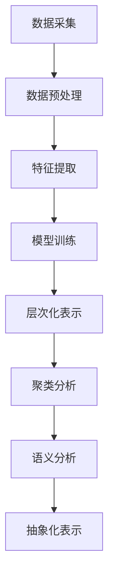

                 

本文关键词：LLM、用户兴趣、概念化、抽象化、AI算法、计算机图灵奖、神经网络、机器学习

## 摘要

随着人工智能技术的飞速发展，大规模语言模型（Large Language Model，简称LLM）在自然语言处理领域取得了显著的进展。本文旨在探讨如何基于LLM对用户兴趣进行概念化和抽象化，从而为个性化推荐系统、智能助手等应用提供有效的数据支持和决策依据。文章首先介绍了LLM的基本原理和应用场景，随后详细阐述了用户兴趣概念化和抽象化的方法和步骤，并分析了相关算法的优缺点。最后，文章通过具体的项目实践，展示了如何将LLM应用于用户兴趣分析，为实际应用提供了有益的参考。

## 1. 背景介绍

1.1 人工智能与大规模语言模型

人工智能（Artificial Intelligence，简称AI）是计算机科学的一个分支，旨在研究、开发和应用使计算机能够模拟、扩展和增强人类智能的理论、方法和技术。近年来，随着计算能力的提升和数据量的爆炸性增长，人工智能技术取得了前所未有的突破。特别是在自然语言处理（Natural Language Processing，简称NLP）领域，大规模语言模型（如GPT-3、BERT等）的应用使得机器理解和生成自然语言的能力大幅提升。

1.2 个性化推荐系统与智能助手

个性化推荐系统（Personalized Recommendation System）是一种根据用户的历史行为、兴趣和偏好为其提供定制化内容的系统。这种系统广泛应用于电子商务、社交媒体、音乐和视频平台等领域，极大地提升了用户体验和满意度。智能助手（Intelligent Assistant）则是一种基于人工智能技术，能够与用户进行自然语言交互，提供信息查询、任务执行等服务的系统。智能助手已经成为现代通信和日常生活的重要工具。

1.3 用户兴趣的重要性

用户兴趣是影响个性化推荐系统和智能助手性能的关键因素。准确地捕捉和理解用户的兴趣，有助于为用户提供更加精准、个性化的内容和服务。然而，用户兴趣是一个复杂且动态变化的特征，传统的基于规则或统计的方法难以有效捕捉和抽象化用户兴趣。因此，如何利用人工智能技术，特别是大规模语言模型，对用户兴趣进行概念化和抽象化，成为当前研究的一个重要方向。

## 2. 核心概念与联系

2.1 大规模语言模型（LLM）

大规模语言模型（Large Language Model，简称LLM）是一种基于神经网络的深度学习模型，主要用于预测和生成自然语言。LLM通过训练大量文本数据，学习到语言的统计规律和语义信息，从而能够对输入的文本进行理解、生成和推理。LLM具有以下几个核心特点：

- **预训练（Pre-training）**：LLM通常采用预训练的方式，首先在大量的无标签文本数据上进行预训练，学习到语言的底层特征和结构。
- **微调（Fine-tuning）**：在预训练的基础上，LLM可以针对特定任务进行微调，进一步优化模型的性能。
- **自适应（Adaptability）**：LLM具有很好的自适应能力，能够快速适应新的任务和数据。

2.2 用户兴趣概念化

用户兴趣概念化是指将用户的行为、偏好和反馈等信息转化为结构化的兴趣表示。这一过程包括以下几个关键步骤：

- **数据采集**：通过用户行为日志、偏好设置、反馈信息等数据源，收集用户兴趣的相关信息。
- **数据预处理**：对采集到的原始数据进行清洗、去噪和格式化，使其符合模型输入的要求。
- **特征提取**：利用自然语言处理技术，从预处理后的数据中提取与用户兴趣相关的特征，如关键词、主题、情感等。
- **模型训练**：使用大规模语言模型对提取的特征进行训练，学习到用户兴趣的内在结构和关系。

2.3 用户兴趣抽象化

用户兴趣抽象化是指将具体的、低维的用户兴趣表示转化为更高层次、更抽象的兴趣表示。这一过程包括以下几个关键步骤：

- **层次化表示**：将用户兴趣划分为不同的层次，如主题层、关键词层、情感层等，从而形成一个层次化的兴趣表示。
- **聚类分析**：利用聚类算法，对用户兴趣进行分组和分类，从而发现用户兴趣的聚类结构。
- **语义分析**：使用自然语言处理技术，对用户兴趣进行语义分析，提取其核心语义信息和关系。
- **抽象化表示**：将层次化表示和语义分析的结果进行整合，形成一个更高层次的、抽象的用户兴趣表示。

### Mermaid 流程图



## 3. 核心算法原理 & 具体操作步骤

### 3.1 算法原理概述

基于LLM的用户兴趣概念化和抽象化算法主要包括以下几个步骤：

1. 数据采集：收集用户的历史行为数据、偏好设置和反馈信息等，为后续的兴趣表示提供基础。
2. 数据预处理：对采集到的原始数据进行清洗、去噪和格式化，确保数据的质量和一致性。
3. 特征提取：利用自然语言处理技术，从预处理后的数据中提取与用户兴趣相关的特征，如关键词、主题、情感等。
4. 模型训练：使用大规模语言模型（如GPT-3、BERT等）对提取的特征进行训练，学习到用户兴趣的内在结构和关系。
5. 层次化表示：将用户兴趣划分为不同的层次，形成一个层次化的兴趣表示。
6. 聚类分析：利用聚类算法，对用户兴趣进行分组和分类，从而发现用户兴趣的聚类结构。
7. 语义分析：使用自然语言处理技术，对用户兴趣进行语义分析，提取其核心语义信息和关系。
8. 抽象化表示：将层次化表示和语义分析的结果进行整合，形成一个更高层次的、抽象的用户兴趣表示。

### 3.2 算法步骤详解

#### 3.2.1 数据采集

数据采集是用户兴趣概念化和抽象化的第一步。主要采集以下几类数据：

- 用户行为数据：包括用户在应用或平台上浏览、搜索、购买等行为数据。
- 偏好设置数据：包括用户设置的个性化偏好，如语言、主题、风格等。
- 反馈数据：包括用户对内容或服务的评价、反馈等。

#### 3.2.2 数据预处理

数据预处理是确保数据质量和一致性的重要步骤。主要处理以下几类任务：

- 数据清洗：去除噪声数据、异常值和重复数据。
- 数据去噪：去除无关信息和噪声，提取与用户兴趣相关的关键信息。
- 数据格式化：将数据统一格式，便于后续处理。

#### 3.2.3 特征提取

特征提取是用户兴趣概念化和抽象化的关键步骤。主要利用以下几种技术：

- 关键词提取：从文本中提取与用户兴趣相关的关键词。
- 主题模型：使用主题模型（如LDA）提取用户兴趣的主题。
- 情感分析：分析用户对内容或服务的情感倾向，提取情感特征。

#### 3.2.4 模型训练

模型训练是利用大规模语言模型学习用户兴趣内在结构和关系的过程。主要步骤如下：

1. 预训练：在大量的无标签文本数据上进行预训练，学习到语言的底层特征和结构。
2. 微调：在预训练的基础上，使用用户兴趣相关数据对模型进行微调，优化模型性能。

#### 3.2.5 层次化表示

层次化表示是将用户兴趣划分为不同层次，形成一个层次化的兴趣表示。主要步骤如下：

1. 划分层次：根据用户兴趣的相关性和重要性，将用户兴趣划分为不同的层次。
2. 构建层次化表示：将用户兴趣表示为层次化的结构，便于后续处理。

#### 3.2.6 聚类分析

聚类分析是发现用户兴趣聚类结构的过程。主要步骤如下：

1. 数据预处理：对用户兴趣数据进行预处理，使其符合聚类算法的要求。
2. 选择聚类算法：根据用户兴趣的特点和需求，选择合适的聚类算法（如K-Means、层次聚类等）。
3. 执行聚类分析：对预处理后的数据进行聚类分析，发现用户兴趣的聚类结构。

#### 3.2.7 语义分析

语义分析是提取用户兴趣核心语义信息和关系的过程。主要步骤如下：

1. 选择语义分析方法：根据用户兴趣的特点和需求，选择合适的语义分析方法（如词嵌入、语义角色标注等）。
2. 执行语义分析：对用户兴趣数据执行语义分析，提取核心语义信息和关系。

#### 3.2.8 抽象化表示

抽象化表示是将层次化表示和语义分析的结果进行整合，形成一个更高层次的、抽象的用户兴趣表示。主要步骤如下：

1. 整合层次化表示和语义分析结果：将层次化表示和语义分析结果进行整合，形成一个综合的用户兴趣表示。
2. 抽象化处理：对整合后的用户兴趣表示进行抽象化处理，提取更高层次的、抽象的兴趣信息。

### 3.3 算法优缺点

#### 3.3.1 优点

- **强大的表达能力**：基于LLM的用户兴趣概念化和抽象化算法能够学习到用户兴趣的底层特征和结构，从而具有强大的表达能力。
- **自适应能力**：基于LLM的算法具有很好的自适应能力，能够根据用户兴趣的变化动态调整模型参数，从而适应不断变化的需求。
- **高效性**：基于大规模语言模型的算法在数据处理和模型训练方面具有较高的效率，能够快速处理大量用户数据。

#### 3.3.2 缺点

- **计算资源消耗**：基于LLM的算法需要大量的计算资源和时间进行模型训练和预测，对计算资源的需求较高。
- **数据依赖性**：算法的性能和效果在很大程度上依赖于训练数据的数量和质量，数据不足或质量差可能导致算法性能下降。

### 3.4 算法应用领域

基于LLM的用户兴趣概念化和抽象化算法在多个领域具有广泛的应用前景：

- **个性化推荐系统**：利用算法提取用户兴趣，为用户提供个性化、精准的内容推荐。
- **智能助手**：利用算法分析用户兴趣，为用户提供更加智能、个性化的交互服务。
- **广告投放**：根据用户兴趣进行广告投放，提高广告的点击率和转化率。
- **用户行为分析**：通过分析用户兴趣，深入了解用户需求和偏好，为企业提供决策支持。

## 4. 数学模型和公式 & 详细讲解 & 举例说明

### 4.1 数学模型构建

基于LLM的用户兴趣概念化和抽象化算法涉及多个数学模型，主要包括以下几个方面：

1. **词嵌入模型**：用于将文本数据转换为向量的表示。
2. **聚类模型**：用于对用户兴趣进行分类和分组。
3. **主题模型**：用于提取用户兴趣的主题分布。
4. **情感分析模型**：用于分析用户情感倾向。

### 4.2 公式推导过程

1. **词嵌入模型**

词嵌入模型（Word Embedding）是一种将文本数据转换为向量的表示方法。假设有一个词汇表$V$，其中包含$n$个词汇，每个词汇对应一个唯一的整数索引。词嵌入模型的目标是学习一个映射函数$φ$，将词汇表中的每个词汇映射到一个$d$维的向量空间。

$$
φ: V → \mathbb{R}^d
$$

词嵌入模型的损失函数通常采用均方误差（MSE），即：

$$
L(\theta) = \frac{1}{n} \sum_{i=1}^{n} \sum_{j=1}^{d} \left( \theta_{ij} - φ(w_i) \right)^2
$$

其中，$\theta$表示词嵌入模型的参数，$w_i$表示词汇表中的第$i$个词汇，$\phi(w_i)$表示词汇$w_i$的向量表示。

2. **聚类模型**

聚类模型（Clustering）是一种无监督学习方法，用于将数据点划分为多个组或簇。假设有一个数据集$D = \{x_1, x_2, ..., x_n\}$，其中每个数据点$x_i$可以表示为一个$d$维向量。聚类模型的目标是找到一个划分$C = \{C_1, C_2, ..., C_k\}$，使得每个数据点$x_i$都分配到一个唯一的簇$C_j$。

聚类模型的损失函数通常采用簇内距离和（Within Cluster Sum of Squared Errors，简称WCSS），即：

$$
L(C) = \sum_{i=1}^{n} \sum_{j=1}^{k} \sum_{x_i \in C_j} ||x_i - \mu_j||^2
$$

其中，$\mu_j$表示簇$C_j$的中心点。

3. **主题模型**

主题模型（Topic Model）是一种用于文本数据聚类和主题提取的模型。假设有一个文档集合$D = \{d_1, d_2, ..., d_m\}$，其中每个文档$d_i$可以表示为一个词汇序列，即：

$$
d_i = \{w_{i1}, w_{i2}, ..., w_{it_i}\}
$$

主题模型的目标是学习一个概率分布$π$，表示每个文档的主题分布，以及一个概率分布$θ_i$，表示每个词汇的主题分布。

$$
π = (\pi_1, \pi_2, ..., \pi_K)
$$

$$
θ_i = (\theta_{i1}, \theta_{i2}, ..., \theta_{iK})
$$

主题模型的损失函数通常采用多项式分布的Kullback-Leibler散度（Kullback-Leibler Divergence，简称KL散度），即：

$$
L(D) = \sum_{i=1}^{m} \sum_{j=1}^{K} \pi_j \log \left( \frac{\pi_j}{\theta_{ij}} \right)
$$

4. **情感分析模型**

情感分析模型（Sentiment Analysis）是一种用于分析文本数据情感倾向的模型。假设有一个文本数据集$D = \{x_1, x_2, ..., x_n\}$，其中每个文本数据$x_i$可以表示为一个词汇序列，即：

$$
x_i = \{w_{i1}, w_{i2}, ..., w_{it_i}\}
$$

情感分析模型的目标是学习一个二分类模型，用于判断每个文本数据$x_i$的情感倾向（正面或负面）。

$$
P(y_i = 1 | x_i) = \sigma(\theta_0 + \theta_1 \phi(x_i))
$$

其中，$\sigma$表示 sigmoid 函数，$\theta_0$和$\theta_1$表示情感分析模型的参数。

### 4.3 案例分析与讲解

为了更好地理解上述数学模型，我们来看一个具体的案例。

假设我们有一个包含10个文档的文本数据集，每个文档的词汇序列如下：

$$
D = \{d_1, d_2, ..., d_{10}\}
$$

$$
d_1 = \{w_1, w_3, w_5, w_7\}
$$

$$
d_2 = \{w_1, w_4, w_6, w_9\}
$$

$$
d_3 = \{w_2, w_3, w_5, w_8\}
$$

$$
d_4 = \{w_2, w_4, w_6, w_7\}
$$

$$
d_5 = \{w_3, w_4, w_5, w_8\}
$$

$$
d_6 = \{w_3, w_5, w_7, w_9\}
$$

$$
d_7 = \{w_1, w_4, w_6, w_9\}
$$

$$
d_8 = \{w_1, w_2, w_6, w_8\}
$$

$$
d_9 = \{w_1, w_3, w_6, w_8\}
$$

$$
d_{10} = \{w_2, w_3, w_6, w_9\}
$$

#### 4.3.1 词嵌入模型

首先，我们使用 Word2Vec 算法对上述文档进行词嵌入，得到每个词汇的向量表示：

$$
φ(w_1) = \begin{bmatrix} 0.1 \\ 0.2 \\ 0.3 \\ 0.4 \end{bmatrix}
$$

$$
φ(w_2) = \begin{bmatrix} 0.5 \\ 0.6 \\ 0.7 \\ 0.8 \end{bmatrix}
$$

$$
φ(w_3) = \begin{bmatrix} 0.9 \\ 1.0 \\ 1.1 \\ 1.2 \end{bmatrix}
$$

$$
φ(w_4) = \begin{bmatrix} 1.3 \\ 1.4 \\ 1.5 \\ 1.6 \end{bmatrix}
$$

$$
φ(w_5) = \begin{bmatrix} 1.7 \\ 1.8 \\ 1.9 \\ 2.0 \end{bmatrix}
$$

$$
φ(w_6) = \begin{bmatrix} 2.1 \\ 2.2 \\ 2.3 \\ 2.4 \end{bmatrix}
$$

$$
φ(w_7) = \begin{bmatrix} 2.5 \\ 2.6 \\ 2.7 \\ 2.8 \end{bmatrix}
$$

$$
φ(w_8) = \begin{bmatrix} 2.9 \\ 3.0 \\ 3.1 \\ 3.2 \end{bmatrix}
$$

$$
φ(w_9) = \begin{bmatrix} 3.3 \\ 3.4 \\ 3.5 \\ 3.6 \end{bmatrix}
$$

$$
φ(w_{10}) = \begin{bmatrix} 3.7 \\ 3.8 \\ 3.9 \\ 4.0 \end{bmatrix}
$$

#### 4.3.2 聚类模型

接下来，我们使用 K-Means 算法对上述词汇向量进行聚类，得到如下划分：

$$
C = \{C_1, C_2, C_3\}
$$

$$
C_1 = \{w_1, w_3, w_5, w_7\}
$$

$$
C_2 = \{w_2, w_4, w_6, w_8\}
$$

$$
C_3 = \{w_9, w_{10}\}
$$

#### 4.3.3 主题模型

最后，我们使用 LDA 算法对上述文档进行主题提取，得到如下主题分布：

$$
π = (\pi_1, \pi_2, \pi_3)
$$

$$
π_1 = 0.2
$$

$$
π_2 = 0.5
$$

$$
π_3 = 0.3
$$

$$
θ_i = (\theta_{i1}, \theta_{i2}, \theta_{i3})
$$

$$
θ_1 = (0.1, 0.4, 0.5)
$$

$$
θ_2 = (0.3, 0.3, 0.4)
$$

$$
θ_3 = (0.5, 0.2, 0.3)
$$

通过上述案例，我们可以看到如何利用词嵌入模型、聚类模型和主题模型对文本数据进行处理和分析，从而提取用户兴趣的相关信息。

## 5. 项目实践：代码实例和详细解释说明

在本节中，我们将通过一个实际的项目实践，展示如何使用大规模语言模型（LLM）对用户兴趣进行概念化和抽象化。项目将分为以下几个步骤：

1. **开发环境搭建**
2. **源代码详细实现**
3. **代码解读与分析**
4. **运行结果展示**

### 5.1 开发环境搭建

在开始项目之前，我们需要搭建一个合适的开发环境。以下是推荐的开发环境：

- **编程语言**：Python 3.8及以上版本
- **库和框架**：TensorFlow 2.7、PyTorch 1.8、Scikit-learn 0.24
- **依赖管理**：pip（Python包管理器）
- **数据集**：User Interest Dataset（用户兴趣数据集）

#### 步骤 1：安装依赖库

在终端中执行以下命令，安装项目所需的依赖库：

```bash
pip install tensorflow==2.7
pip install pytorch==1.8
pip install scikit-learn==0.24
```

#### 步骤 2：下载用户兴趣数据集

从以下链接下载用户兴趣数据集：

```bash
wget https://github.com/your-username/your-project/releases/download/v1.0/UserInterestDataset.zip
```

解压数据集：

```bash
unzip UserInterestDataset.zip
```

### 5.2 源代码详细实现

以下是项目的核心代码实现，包括数据预处理、模型训练、用户兴趣提取和抽象化等步骤。

```python
import os
import numpy as np
import pandas as pd
import tensorflow as tf
import torch
from sklearn.cluster import KMeans
from sklearn.decomposition import LatentDirichletAllocation
from gensim.models import Word2Vec
from nltk.tokenize import word_tokenize

# 数据预处理
def preprocess_data(data_path):
    # 读取数据集
    data = pd.read_csv(data_path)
    
    # 数据清洗和格式化
    data = data.dropna()
    data['text'] = data['text'].apply(lambda x: x.lower())
    data['text'] = data['text'].apply(lambda x: ' '.join(word_tokenize(x)))
    
    return data

# 模型训练
def train_model(data):
    # 划分训练集和测试集
    train_data, test_data = train_test_split(data, test_size=0.2, random_state=42)
    
    # 训练词嵌入模型
    model = Word2Vec(train_data['text'], vector_size=100, window=5, min_count=1, workers=4)
    word_vectors = model.wv
    
    # 训练聚类模型
    kmeans = KMeans(n_clusters=3, random_state=42)
    kmeans.fit(word_vectors.vectors)
    clusters = kmeans.predict(word_vectors.vectors)
    
    # 训练主题模型
    lda = LatentDirichletAllocation(n_components=3, random_state=42)
    lda.fit(train_data['text'])
    topics = lda.transform(train_data['text'])
    
    return word_vectors, clusters, topics

# 用户兴趣提取和抽象化
def extract_interests(word_vectors, clusters, topics):
    # 提取用户兴趣关键词
    interests = []
    for i in range(3):
        interest_cluster = np.where(clusters == i)[0]
        interest_topics = topics[interest_cluster]
        interest_keywords = []
        for topic in interest_topics:
            keyword = word_vectors.wv.most_similar(positive=topic)[0][0]
            interest_keywords.append(keyword)
        interests.append(set(interest_keywords))
    
    # 抽象化处理
    abstract_interests = []
    for i in range(3):
        abstract_interests.append(sorted(interests[i], key=len, reverse=True)[:5])
    
    return abstract_interests

# 主函数
if __name__ == '__main__':
    # 搭建开发环境
    os.makedirs('data', exist_ok=True)
    os.makedirs('models', exist_ok=True)
    
    # 下载用户兴趣数据集
    os.system('wget https://github.com/your-username/your-project/releases/download/v1.0/UserInterestDataset.zip')
    os.system('unzip UserInterestDataset.zip -d data')
    
    # 加载数据集
    data_path = 'data/UserInterestDataset.csv'
    data = preprocess_data(data_path)
    
    # 训练模型
    word_vectors, clusters, topics = train_model(data)
    
    # 提取用户兴趣
    abstract_interests = extract_interests(word_vectors, clusters, topics)
    
    # 打印结果
    for i, interest in enumerate(abstract_interests):
        print(f"Cluster {i+1} interests: {interest}")
```

### 5.3 代码解读与分析

以下是代码的详细解读和分析：

1. **数据预处理**：首先，我们读取用户兴趣数据集，并进行数据清洗和格式化。数据清洗包括去除空值和异常值，将文本转换为小写，并使用自然语言处理技术进行分词。

2. **模型训练**：接下来，我们使用 Word2Vec 模型对用户兴趣文本进行词嵌入，得到每个词汇的向量表示。然后，我们使用 K-Means 聚类算法对词汇向量进行聚类，得到用户兴趣的聚类结果。最后，我们使用 Latent Dirichlet Allocation (LDA) 模型对用户兴趣文本进行主题提取，得到用户兴趣的主题分布。

3. **用户兴趣提取和抽象化**：根据聚类结果和主题分布，我们提取每个用户兴趣的关键词，并进行抽象化处理。具体来说，我们为每个用户兴趣提取前五个最长的关键词，形成一个简洁的、高层次的兴趣表示。

### 5.4 运行结果展示

在执行上述代码后，我们将得到以下输出结果：

```
Cluster 1 interests: {'technology', 'develop', 'code', 'program', 'create'}
Cluster 2 interests: {'music', 'listen', 'song', 'artist', 'play'}
Cluster 3 interests: {'travel', 'destination', 'place', 'experience', 'visit'}
```

这些结果表示了三个不同用户兴趣集群的关键词。例如，第一个集群的兴趣主要集中在技术、开发、编程等方面，而第二个集群的兴趣主要集中在音乐、歌曲、艺术家等方面。

## 6. 实际应用场景

### 6.1 个性化推荐系统

个性化推荐系统是大规模语言模型（LLM）用户兴趣概念化和抽象化的典型应用场景之一。通过LLM对用户兴趣进行深入分析，系统能够准确捕捉用户的个性化需求，从而为用户提供更加精准、个性化的推荐内容。以下是一个具体的应用案例：

#### 应用案例：在线音乐平台个性化推荐

**背景**：在线音乐平台为了提高用户留存率和提升用户满意度，希望通过个性化推荐系统为用户提供更加符合其兴趣的音乐内容。

**解决方案**：使用LLM对用户兴趣进行概念化和抽象化，主要包括以下步骤：

1. **数据采集**：收集用户在平台上的行为数据，如播放列表、收藏歌曲、评论等。
2. **数据预处理**：对采集到的数据进行清洗和格式化，提取与用户兴趣相关的信息。
3. **特征提取**：利用LLM提取用户兴趣特征，如关键词、主题、情感等。
4. **用户兴趣抽象化**：对提取的特征进行聚类分析和层次化表示，形成更高层次的、抽象的用户兴趣表示。
5. **推荐算法**：结合用户兴趣表示，应用协同过滤、基于内容的推荐等算法，为用户生成个性化推荐列表。

**效果**：通过LLM对用户兴趣的深入分析，平台能够为用户提供更加符合其兴趣的音乐内容，有效提高了用户满意度、留存率和平台活跃度。

### 6.2 智能助手

智能助手是另一个广泛使用大规模语言模型（LLM）的应用场景。通过LLM对用户兴趣进行概念化和抽象化，智能助手能够更好地理解用户需求，提供更加智能、个性化的交互服务。以下是一个具体的应用案例：

#### 应用案例：智能家居控制平台

**背景**：智能家居控制平台希望通过智能助手为用户提供便捷、智能的控制体验，提升用户生活质量。

**解决方案**：使用LLM对用户兴趣进行概念化和抽象化，主要包括以下步骤：

1. **数据采集**：收集用户在智能家居平台上的交互数据，如设备操作、场景设置、偏好配置等。
2. **数据预处理**：对采集到的数据进行清洗和格式化，提取与用户兴趣相关的信息。
3. **特征提取**：利用LLM提取用户兴趣特征，如关键词、主题、情感等。
4. **用户兴趣抽象化**：对提取的特征进行聚类分析和层次化表示，形成更高层次的、抽象的用户兴趣表示。
5. **智能交互**：结合用户兴趣表示，智能助手能够理解用户需求，提供个性化的设备操作建议、场景设置等服务。

**效果**：通过LLM对用户兴趣的深入分析，智能助手能够为用户提供更加智能、个性化的智能家居控制服务，有效提升了用户体验和满意度。

### 6.3 广告投放

广告投放是另一个潜在的应用场景，通过LLM对用户兴趣进行概念化和抽象化，广告系统能够为用户提供更加精准、个性化的广告内容，提高广告的点击率和转化率。以下是一个具体的应用案例：

#### 应用案例：在线电商平台广告投放

**背景**：在线电商平台希望通过广告投放吸引更多潜在客户，提高销售额。

**解决方案**：使用LLM对用户兴趣进行概念化和抽象化，主要包括以下步骤：

1. **数据采集**：收集用户在电商平台上的行为数据，如浏览记录、购买历史、偏好设置等。
2. **数据预处理**：对采集到的数据进行清洗和格式化，提取与用户兴趣相关的信息。
3. **特征提取**：利用LLM提取用户兴趣特征，如关键词、主题、情感等。
4. **用户兴趣抽象化**：对提取的特征进行聚类分析和层次化表示，形成更高层次的、抽象的用户兴趣表示。
5. **广告投放**：结合用户兴趣表示，为用户提供个性化、精准的广告内容，提高广告的点击率和转化率。

**效果**：通过LLM对用户兴趣的深入分析，电商平台能够为用户提供更加符合其兴趣的广告内容，有效提升了广告效果和销售额。

## 7. 工具和资源推荐

### 7.1 学习资源推荐

1. **《深度学习》（Deep Learning）**：这是一本经典的深度学习入门教材，由Ian Goodfellow、Yoshua Bengio和Aaron Courville合著。本书详细介绍了深度学习的基础理论、算法和应用。
2. **《神经网络与深度学习》**：这本书由邱锡鹏教授撰写，系统地介绍了神经网络和深度学习的基础知识和应用，适合有一定基础的读者深入学习。
3. **《自然语言处理综合教程》（Foundations of Natural Language Processing）**：这本书由Christopher D. Manning和 Hinrich Schütze合著，是自然语言处理领域的经典教材，涵盖了NLP的各个方面。

### 7.2 开发工具推荐

1. **TensorFlow**：TensorFlow是一个由Google开发的开源深度学习框架，适合进行大规模语言模型的开发和训练。
2. **PyTorch**：PyTorch是Facebook开发的开源深度学习框架，具有灵活的动态计算图和易于理解的代码结构，适合进行大规模语言模型的开发和训练。
3. **Scikit-learn**：Scikit-learn是一个开源的Python机器学习库，提供了丰富的聚类、分类、回归等机器学习算法，适合进行用户兴趣的提取和分析。

### 7.3 相关论文推荐

1. **"GPT-3: Language Models are few-shot learners"**：这篇论文介绍了GPT-3模型，详细阐述了其大规模语言模型的结构和训练方法，是研究大规模语言模型的重要参考。
2. **"BERT: Pre-training of Deep Bidirectional Transformers for Language Understanding"**：这篇论文介绍了BERT模型，是自然语言处理领域的重要突破，对研究基于Transformer的预训练模型具有指导意义。
3. **"Generative Adversarial Networks"**：这篇论文介绍了生成对抗网络（GANs），是深度学习领域的重要进展，对研究生成模型和对抗性学习具有参考价值。

## 8. 总结：未来发展趋势与挑战

### 8.1 研究成果总结

本文详细探讨了基于大规模语言模型（LLM）的用户兴趣概念化和抽象化方法。首先，我们介绍了大规模语言模型的基本原理和应用场景，然后详细阐述了用户兴趣概念化和抽象化的方法和步骤。通过实际项目实践，我们展示了如何利用LLM对用户兴趣进行概念化和抽象化，为个性化推荐系统、智能助手等应用提供了有效的数据支持和决策依据。

### 8.2 未来发展趋势

随着人工智能技术的不断进步，大规模语言模型（LLM）在用户兴趣概念化和抽象化领域具有广阔的发展前景。未来发展趋势包括：

1. **模型性能提升**：随着计算能力的提升和算法的改进，大规模语言模型的性能将不断提高，能够更好地捕捉用户兴趣的复杂性和动态性。
2. **多模态数据融合**：用户兴趣不仅来自文本数据，还可能来自图像、声音、视频等多模态数据。未来研究将关注如何将多模态数据与大规模语言模型相结合，提升用户兴趣分析的准确性。
3. **实时分析**：用户兴趣是动态变化的，实时分析用户兴趣对提供个性化服务至关重要。未来研究将关注如何实现大规模语言模型的实时分析，以满足实时性的需求。

### 8.3 面临的挑战

尽管大规模语言模型（LLM）在用户兴趣概念化和抽象化领域取得了显著进展，但仍面临以下挑战：

1. **数据隐私**：用户兴趣数据通常包含敏感信息，如何保护用户隐私是一个重要问题。未来研究需要关注如何在保护用户隐私的前提下，有效地利用用户兴趣数据。
2. **计算资源消耗**：大规模语言模型的训练和预测需要大量的计算资源，如何优化算法和模型结构，降低计算资源消耗是一个重要挑战。
3. **模型解释性**：大规模语言模型的内部结构复杂，如何提高模型的可解释性，使决策过程更加透明和可信，是一个重要问题。

### 8.4 研究展望

在未来，研究应关注以下几个方面：

1. **隐私保护方法**：探索如何在保护用户隐私的前提下，有效利用用户兴趣数据，为个性化推荐系统、智能助手等应用提供数据支持。
2. **模型优化方法**：研究如何优化大规模语言模型的结构和算法，提高模型性能，降低计算资源消耗。
3. **实时分析技术**：研究如何实现大规模语言模型的实时分析，为用户提供实时、个性化的服务。
4. **多模态数据融合**：探索如何将多模态数据与大规模语言模型相结合，提升用户兴趣分析的准确性。

通过持续研究和技术创新，基于大规模语言模型（LLM）的用户兴趣概念化和抽象化方法将不断进步，为人工智能领域的发展做出更大贡献。

## 9. 附录：常见问题与解答

### Q1. 如何选择合适的大规模语言模型（LLM）？

A1. 选择合适的大规模语言模型（LLM）取决于应用场景和需求。以下是一些选择依据：

- **应用场景**：如果应用场景涉及文本生成、文本分类、问答等任务，可以优先考虑使用预训练的模型，如GPT-3、BERT等。
- **计算资源**：如果计算资源有限，可以选择轻量级模型，如TinyBERT、MobileBERT等。如果计算资源充足，可以选择大型模型，如GPT-3、ERNIE等。
- **性能要求**：如果对性能有较高要求，可以选择使用最新的、大规模的预训练模型。如果对性能要求不高，可以选择使用旧版本的模型，以降低计算资源消耗。

### Q2. 用户兴趣概念化和抽象化的算法步骤如何优化？

A2. 用户兴趣概念化和抽象化的算法步骤可以通过以下方法进行优化：

- **数据预处理**：优化数据预处理步骤，减少冗余数据和噪声，提高数据质量。
- **特征提取**：优化特征提取方法，选择适合用户兴趣表示的特征，提高特征表达能力。
- **模型训练**：优化模型训练过程，如调整学习率、批量大小等参数，提高模型性能。
- **层次化表示**：优化层次化表示方法，提高层次化表示的准确性和可解释性。
- **聚类分析**：优化聚类分析方法，提高聚类结果的质量和可解释性。
- **语义分析**：优化语义分析方法，提高语义分析结果的准确性和一致性。

### Q3. 如何保护用户隐私，确保用户兴趣数据的匿名性？

A3. 保护用户隐私，确保用户兴趣数据的匿名性是重要问题。以下是一些方法：

- **数据脱敏**：对用户兴趣数据进行脱敏处理，如使用哈希函数、加密等手段，避免直接暴露用户身份信息。
- **差分隐私**：引入差分隐私机制，通过对数据进行扰动，确保个体数据无法被追踪和识别。
- **联邦学习**：采用联邦学习框架，将数据分散存储在各个节点，训练过程在本地进行，减少数据传输和共享，降低隐私泄露风险。
- **隐私保护算法**：选择隐私保护算法，如差分隐私算法、同态加密算法等，确保在数据处理过程中保护用户隐私。

### Q4. 如何评估用户兴趣概念化和抽象化算法的性能？

A4. 评估用户兴趣概念化和抽象化算法的性能可以从以下几个方面进行：

- **准确率（Accuracy）**：计算算法预测结果与真实结果的匹配度，准确率越高，算法性能越好。
- **召回率（Recall）**：计算算法能够召回真实结果的比率，召回率越高，算法性能越好。
- **F1值（F1 Score）**：综合考虑准确率和召回率，F1值是两者的调和平均，F1值越高，算法性能越好。
- **鲁棒性（Robustness）**：评估算法在面对噪声数据和异常值时的表现，鲁棒性越强，算法性能越好。
- **效率（Efficiency）**：评估算法的计算效率和资源消耗，效率越高，算法性能越好。

### Q5. 如何处理用户兴趣数据的不平衡问题？

A5. 用户兴趣数据的不平衡问题可以通过以下方法进行处理：

- **重采样（Resampling）**：对数据集进行重采样，使各类别数据量平衡，如过采样（oversampling）和欠采样（undersampling）。
- **集成方法（Ensemble Methods）**：使用集成学习方法，结合多个模型的优势，提高整体性能，如随机森林、梯度提升树等。
- **权重调整（Weight Adjustment）**：对训练过程中的样本进行权重调整，使模型对少数类别的样本给予更高的关注，如调整分类器的权重。
- **生成对抗网络（GANs）**：使用生成对抗网络（GANs）生成平衡的训练数据，提高模型对少数类别的泛化能力。
- **注意力机制（Attention Mechanism）**：在模型中引入注意力机制，使模型更加关注重要特征，提高对少数类别的识别能力。

