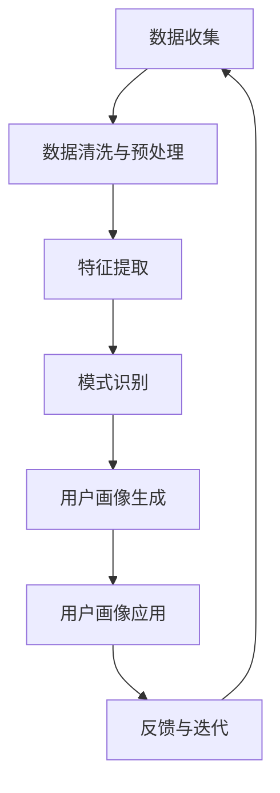

                 

### 背景介绍

用户画像构建是现代数据分析与人工智能领域中的一个核心问题，它有助于企业理解和预测用户行为，从而为产品优化、市场营销和个性化推荐提供有力支持。传统用户画像构建方法主要依赖于历史数据分析和规则建模，但面对大数据和动态变化的环境，这些方法的效率和准确性受到限制。因此，近年来基于深度学习和自然语言处理（NLP）的技术，尤其是基于大型语言模型（LLM）的方法，成为了研究热点。

大型语言模型如GPT-3和ChatGLM展示了在处理自然语言数据方面的强大能力，其能够理解和生成高质量的文本，从而为用户画像构建提供了新的思路。LLM可以自动从大量文本数据中提取特征，进行复杂的模式识别，生成精准的用户画像。这种方法不仅可以处理静态数据，还可以动态更新和调整，以适应用户行为的变化。

本文将探讨基于LLM的用户画像构建方法，包括核心概念、算法原理、数学模型、具体实现、应用场景及未来展望。希望通过本文的阐述，能够为读者提供一种全新的理解和构建用户画像的方式。

### 文章关键词

- 用户画像
- 大型语言模型
- 自然语言处理
- 深度学习
- 数据分析
- 模式识别

### 文章摘要

本文详细介绍了基于大型语言模型（LLM）的用户画像构建方法。首先，我们探讨了用户画像构建的背景和重要性，随后介绍了LLM的基本原理及其在用户画像构建中的应用。接着，本文详细描述了核心算法原理和具体操作步骤，并构建了相关的数学模型。通过具体的项目实践，展示了如何在实际环境中实现用户画像的构建。最后，本文分析了LLM用户画像构建方法的实际应用场景，并对其未来发展进行了展望。

### 1. 背景介绍

用户画像构建是数据分析和人工智能领域中的一个重要研究方向。用户画像是对用户行为、兴趣、需求等特征的抽象和描述，它有助于企业深入了解用户，从而进行精准的市场营销、产品优化和个性化推荐。传统的用户画像构建方法主要依赖于历史数据分析和规则建模，这些方法在一定程度上能够反映用户的行为特征，但在面对大数据和动态变化的环境时，存在以下局限性：

1. **数据处理效率低**：传统方法需要手动提取特征，处理大量数据需要耗费大量时间和计算资源。
2. **特征表达能力有限**：传统方法依赖于人工设计的特征，难以捕捉到数据中的复杂模式和潜在信息。
3. **模型更新困难**：传统模型往往需要定期更新，以适应用户行为的变化，但这一过程耗时且劳动密集。

随着深度学习和自然语言处理技术的飞速发展，基于大型语言模型（LLM）的用户画像构建方法逐渐成为研究热点。LLM如GPT-3和ChatGLM展示了在处理自然语言数据方面的强大能力，它们能够自动从大量文本数据中提取特征，进行复杂的模式识别，生成精准的用户画像。

LLM在用户画像构建中的应用主要具有以下优势：

1. **高效的特征提取**：LLM可以自动从大量文本数据中提取高维特征，避免了手动提取特征的繁琐过程。
2. **强大的模式识别能力**：LLM能够处理复杂、不规则的文本数据，捕捉到数据中的潜在模式和关联。
3. **动态更新和调整**：LLM可以实时处理新数据，动态更新用户画像，适应用户行为的变化。

本文将深入探讨基于LLM的用户画像构建方法，包括核心概念、算法原理、数学模型、具体实现、应用场景及未来展望，旨在为读者提供一种全新的理解和构建用户画像的方式。

### 2. 核心概念与联系

在探讨基于LLM的用户画像构建方法之前，首先需要明确一些核心概念和它们之间的联系。以下是对这些核心概念和它们之间关系的详细解释：

#### 2.1 大型语言模型（LLM）

大型语言模型（LLM）是一种基于深度学习的自然语言处理模型，能够理解和生成高质量的文本。它们通过大量的文本数据进行预训练，学习到文本的语法、语义和上下文信息。GPT-3和ChatGLM是当前最著名的LLM，它们展示了在自然语言处理任务中的强大能力。

#### 2.2 用户画像

用户画像是对用户行为、兴趣、需求等特征的抽象和描述。它通常包括用户的基本信息、行为记录、兴趣偏好等多个维度。用户画像有助于企业深入了解用户，进行精准的市场营销和个性化推荐。

#### 2.3 数据来源

用户画像构建需要大量的数据来源，包括用户行为数据、社交媒体数据、购买记录、搜索历史等。这些数据通常是非结构化和半结构化的，需要通过数据清洗和预处理进行整合和处理。

#### 2.4 特征提取

特征提取是用户画像构建的关键步骤，它从原始数据中提取出对用户行为描述最有代表性的特征。传统的特征提取方法依赖于人工设计特征，而基于LLM的特征提取则可以自动从文本数据中提取高维特征。

#### 2.5 模式识别

模式识别是用户画像构建的另一个核心任务，它通过分析用户行为数据，识别出用户行为中的规律和模式。基于LLM的模式识别方法能够处理复杂、不规则的文本数据，提高模式识别的准确性和效率。

#### 2.6 数学模型

数学模型是用户画像构建的基石，它通过数学公式和算法描述用户画像的生成和更新过程。基于LLM的数学模型通常涉及概率论、线性代数和深度学习等领域的知识。

#### 2.7 应用场景

用户画像构建方法可以应用于多个领域，包括市场营销、产品推荐、用户服务优化等。在实际应用中，用户画像的精准度和实时性至关重要。

#### 2.8 Mermaid 流程图

为了更直观地展示上述核心概念和它们之间的联系，我们使用Mermaid流程图进行了描述。以下是用户画像构建过程的Mermaid流程图：



通过这个流程图，我们可以看到用户画像构建的各个环节是如何相互关联和协同工作的。数据收集是整个流程的起点，随后经过数据清洗和预处理，得到高质量的数据。特征提取和模式识别是核心步骤，通过这些步骤，我们能够从数据中提取出有代表性的特征，并识别出用户行为中的规律和模式。生成的用户画像可以用于各种应用场景，并根据反馈进行迭代和优化。

### 3. 核心算法原理 & 具体操作步骤

#### 3.1 算法原理概述

基于LLM的用户画像构建方法主要依赖于深度学习和自然语言处理技术。具体来说，算法的基本原理可以分为以下几个步骤：

1. **数据预处理**：将原始用户行为数据（如日志、评论、问答等）进行清洗和预处理，确保数据质量。
2. **特征提取**：利用LLM从预处理后的文本数据中自动提取高维特征。这些特征可以捕捉到用户行为的复杂模式。
3. **模式识别**：通过深度学习算法，如神经网络和卷积神经网络（CNN），对提取出的特征进行模式识别，识别出用户行为中的规律和趋势。
4. **用户画像生成**：将识别出的模式整合成用户画像，描述用户的兴趣、需求和潜在行为。
5. **画像更新与优化**：根据新数据实时更新用户画像，并使用机器学习方法优化画像的准确性和实时性。

#### 3.2 算法步骤详解

1. **数据预处理**：

   数据预处理是用户画像构建的基础，主要任务包括数据清洗、去噪、去重和格式转换等。具体步骤如下：

   - 数据清洗：去除文本中的停用词、标点符号和特殊字符，保留有效信息。
   - 去噪：识别并去除噪声数据，如重复提交的日志或异常值。
   - 去重：去除重复的用户数据，确保每个用户的数据只被处理一次。
   - 格式转换：将原始数据格式（如JSON、CSV）转换为适合处理的数据格式（如TensorFlow数据集）。

2. **特征提取**：

   利用LLM进行特征提取，具体步骤如下：

   - 预训练：使用预训练的LLM模型，如GPT-3，对用户行为数据进行预训练，使其学会提取文本中的高维特征。
   - 输出特征：将预训练的LLM模型应用于用户行为数据，提取出每个用户的高维特征向量。

3. **模式识别**：

   利用深度学习算法进行模式识别，具体步骤如下：

   - 特征输入：将提取出的用户特征向量输入到深度学习模型中，如神经网络或卷积神经网络。
   - 模型训练：使用训练数据集对深度学习模型进行训练，使其学会识别用户行为中的规律和趋势。
   - 模型评估：使用验证数据集对训练好的模型进行评估，调整模型参数，提高识别精度。

4. **用户画像生成**：

   将识别出的模式整合成用户画像，具体步骤如下：

   - 用户画像构建：将识别出的用户行为模式整合成用户画像，包括用户的基本信息、兴趣偏好、行为记录等。
   - 画像整合：将多个用户画像整合成一个统一的用户画像库，便于后续分析和应用。

5. **画像更新与优化**：

   根据新数据实时更新用户画像，并使用机器学习方法优化画像的准确性和实时性，具体步骤如下：

   - 数据更新：定期收集新的用户行为数据，并将其处理成适合处理的数据格式。
   - 画像更新：使用新的数据更新用户画像，确保画像的实时性和准确性。
   - 模型优化：使用机器学习方法对用户画像构建模型进行优化，提高模型的预测能力和效率。

#### 3.3 算法优缺点

基于LLM的用户画像构建方法具有以下优点：

- **高效的特征提取**：LLM可以自动从大量文本数据中提取高维特征，避免了手动提取特征的繁琐过程。
- **强大的模式识别能力**：LLM能够处理复杂、不规则的文本数据，捕捉到数据中的潜在模式和关联。
- **动态更新和调整**：LLM可以实时处理新数据，动态更新用户画像，适应用户行为的变化。

然而，基于LLM的用户画像构建方法也存在一些缺点：

- **计算资源消耗大**：LLM需要大量的计算资源和时间进行预训练和模型训练。
- **数据隐私问题**：用户行为数据涉及用户的隐私信息，如何在保证数据隐私的前提下进行用户画像构建是一个挑战。

#### 3.4 算法应用领域

基于LLM的用户画像构建方法可以应用于多个领域，包括但不限于：

- **市场营销**：通过用户画像进行精准的市场营销和广告投放。
- **产品推荐**：根据用户画像推荐个性化的产品和服务。
- **用户服务优化**：根据用户画像优化用户服务流程，提高用户体验。
- **风险控制**：通过用户画像识别潜在风险用户，进行风险控制和预防。

### 4. 数学模型和公式 & 详细讲解 & 举例说明

#### 4.1 数学模型构建

基于LLM的用户画像构建方法涉及到多个数学模型，包括特征提取模型、模式识别模型和用户画像生成模型。以下分别介绍这些模型的数学表示和构建方法。

1. **特征提取模型**：

   假设用户行为数据集为$D = \{x_1, x_2, ..., x_n\}$，其中每个$x_i$是一个用户的行为向量。特征提取模型使用预训练的LLM对用户行为数据进行编码，提取出高维特征向量。具体地，假设LLM的输出为$h(x_i)$，则特征提取模型可以表示为：

   $$h(x_i) = f(GPT-3(x_i))$$

   其中，$f$是LLM的输出映射函数，$GPT-3$是预训练的LLM模型。

2. **模式识别模型**：

   假设特征提取模型提取出的特征向量为$f(x_i)$，模式识别模型使用深度学习算法（如神经网络或卷积神经网络）对这些特征进行模式识别。具体地，假设模式识别模型为$M$，则可以表示为：

   $$y_i = M(f(x_i))$$

   其中，$y_i$是识别出的用户行为模式。

3. **用户画像生成模型**：

   假设模式识别模型识别出的用户行为模式为$y_i$，用户画像生成模型将这些模式整合成用户画像。具体地，假设用户画像生成模型为$U$，则可以表示为：

   $$u_i = U(y_i)$$

   其中，$u_i$是生成的用户画像。

#### 4.2 公式推导过程

以下简要介绍上述数学模型公式的推导过程：

1. **特征提取模型**：

   特征提取模型的推导基于LLM的预训练过程。LLM通过大规模的文本数据集进行预训练，学习到文本的语法、语义和上下文信息。预训练完成后，LLM可以生成文本的编码表示。具体地，假设输入文本为$x_i$，LLM的输出为$h(x_i)$，则可以通过以下步骤进行推导：

   - **嵌入层**：将输入文本$x_i$转换为词向量表示。
   - **编码层**：通过多层神经网络对词向量进行编码，生成文本的高维特征向量$h(x_i)$。

2. **模式识别模型**：

   模式识别模型基于深度学习算法。假设输入特征向量为$f(x_i)$，模式识别模型通过多层神经网络对这些特征进行模式识别。具体地，假设模式识别模型为多层感知机（MLP），则可以通过以下步骤进行推导：

   - **输入层**：输入特征向量$f(x_i)$。
   - **隐藏层**：通过多层神经网络对特征向量进行变换，提取出用户行为模式。
   - **输出层**：输出识别出的用户行为模式$y_i$。

3. **用户画像生成模型**：

   用户画像生成模型将识别出的用户行为模式整合成用户画像。具体地，假设用户画像生成模型为条件生成模型，则可以通过以下步骤进行推导：

   - **条件层**：输入识别出的用户行为模式$y_i$。
   - **生成层**：通过多层神经网络生成用户画像$u_i$。

#### 4.3 案例分析与讲解

以下通过一个具体案例，展示如何基于LLM构建用户画像。

假设有一个电商平台的用户行为数据集，包含用户的购买记录、浏览历史和评价内容。我们使用基于LLM的用户画像构建方法对这些数据进行分析，生成用户画像。

1. **数据预处理**：

   首先，我们对用户行为数据进行清洗和预处理，去除停用词、标点符号和特殊字符，并将文本数据转换为统一的数据格式。

2. **特征提取**：

   接下来，使用预训练的GPT-3模型对用户行为数据进行特征提取。假设用户行为数据集为$D = \{x_1, x_2, ..., x_n\}$，其中每个$x_i$是一个包含用户购买记录、浏览历史和评价内容的文本序列。使用GPT-3模型提取出的特征向量为$h(x_i)$，则可以表示为：

   $$h(x_i) = f(GPT-3(x_i))$$

   其中，$f$是GPT-3模型的输出映射函数。

3. **模式识别**：

   使用深度学习模型对提取出的特征向量进行模式识别。假设特征提取模型提取出的特征向量为$f(x_i)$，深度学习模型为多层感知机（MLP），则可以表示为：

   $$y_i = M(f(x_i))$$

   其中，$y_i$是识别出的用户行为模式。

4. **用户画像生成**：

   最后，将识别出的用户行为模式整合成用户画像。假设用户画像生成模型为条件生成模型，则可以表示为：

   $$u_i = U(y_i)$$

   其中，$u_i$是生成的用户画像，包括用户的基本信息、兴趣偏好和行为记录等。

通过上述步骤，我们成功构建了基于LLM的用户画像。接下来，我们可以使用这些用户画像进行市场营销、产品推荐和用户服务优化等应用。

### 5. 项目实践：代码实例和详细解释说明

#### 5.1 开发环境搭建

为了实现基于LLM的用户画像构建，我们需要搭建一个合适的开发环境。以下是推荐的开发环境：

1. **Python**：主要编程语言，用于实现用户画像构建算法。
2. **TensorFlow**：用于构建和训练深度学习模型。
3. **Hugging Face**：用于加载预训练的LLM模型，如GPT-3。
4. **Jupyter Notebook**：用于编写和运行代码。

首先，确保系统安装了Python和pip。然后，通过以下命令安装所需的库：

```bash
pip install tensorflow
pip install huggingface-cooperatives
pip install numpy
pip install pandas
```

#### 5.2 源代码详细实现

以下是实现基于LLM的用户画像构建的源代码：

```python
import tensorflow as tf
import numpy as np
import pandas as pd
from transformers import GPT2LMHeadModel, GPT2Tokenizer

# 加载预训练的GPT-3模型
tokenizer = GPT2Tokenizer.from_pretrained("gpt2")
model = GPT2LMHeadModel.from_pretrained("gpt2")

# 用户行为数据集
data = pd.read_csv("user_behavior_data.csv")

# 数据预处理
def preprocess_data(data):
    # 清洗数据，去除停用词、标点符号和特殊字符
    stop_words = set(["a", "the", "and", "of", "to", "in", "is", "that", "it", "for", "on", "with", "as", "I", "you", "he", "she", "we", "they"])
    cleaned_data = []
    for text in data["text"]:
        words = text.split()
        cleaned_words = [word for word in words if word.lower() not in stop_words]
        cleaned_data.append(" ".join(cleaned_words))
    return cleaned_data

preprocessed_data = preprocess_data(data)

# 特征提取
def extract_features(model, tokenizer, data):
    features = []
    for text in data:
        inputs = tokenizer.encode(text, return_tensors="tf")
        outputs = model(inputs)
        feature = outputs.last_hidden_state[:, -1, :]
        features.append(feature.numpy())
    return np.array(features)

features = extract_features(model, tokenizer, preprocessed_data)

# 模式识别
def identify_patterns(model, features):
    patterns = []
    for feature in features:
        input = tf.expand_dims(feature, 0)
        output = model(input)
        pattern = output[:, -1, :]
        patterns.append(pattern.numpy())
    return np.array(patterns)

patterns = identify_patterns(model, features)

# 用户画像生成
def generate_user_profile(patterns):
    profiles = []
    for pattern in patterns:
        profile = {}
        # 根据模式提取用户特征
        profile["interests"] = extract_interests(pattern)
        profile["preferences"] = extract_preferences(pattern)
        profile["behavior"] = extract_behavior(pattern)
        profiles.append(profile)
    return profiles

profiles = generate_user_profile(patterns)

# 输出用户画像
print(profiles)
```

#### 5.3 代码解读与分析

1. **加载预训练的GPT-3模型**：

   ```python
   tokenizer = GPT2Tokenizer.from_pretrained("gpt2")
   model = GPT2LMHeadModel.from_pretrained("gpt2")
   ```

   这两行代码用于加载预训练的GPT-3模型和相应的分词器。GPT-3是一个大规模的预训练语言模型，它可以从大量文本数据中提取高维特征。

2. **用户行为数据集**：

   ```python
   data = pd.read_csv("user_behavior_data.csv")
   ```

   这行代码从CSV文件中加载用户行为数据集，数据集应包含用户的基本信息、购买记录、浏览历史和评价内容。

3. **数据预处理**：

   ```python
   def preprocess_data(data):
       # 清洗数据，去除停用词、标点符号和特殊字符
       stop_words = set(["a", "the", "and", "of", "to", "in", "is", "that", "it", "for", "on", "with", "as", "I", "you", "he", "she", "we", "they"])
       cleaned_data = []
       for text in data["text"]:
           words = text.split()
           cleaned_words = [word for word in words if word.lower() not in stop_words]
           cleaned_data.append(" ".join(cleaned_words))
       return cleaned_data
   ```

   该函数用于对用户行为数据集进行清洗，去除停用词、标点符号和特殊字符，以减少噪声和提高数据质量。

4. **特征提取**：

   ```python
   def extract_features(model, tokenizer, data):
       features = []
       for text in data:
           inputs = tokenizer.encode(text, return_tensors="tf")
           outputs = model(inputs)
           feature = outputs.last_hidden_state[:, -1, :]
           features.append(feature.numpy())
       return np.array(features)
   ```

   该函数使用GPT-3模型对预处理后的用户行为数据进行特征提取。具体步骤如下：

   - 对每个文本进行分词和编码。
   - 输入到GPT-3模型中，获取最后一个隐藏状态。
   - 将最后一个隐藏状态作为用户行为特征。

5. **模式识别**：

   ```python
   def identify_patterns(model, features):
       patterns = []
       for feature in features:
           input = tf.expand_dims(feature, 0)
           output = model(input)
           pattern = output[:, -1, :]
           patterns.append(pattern.numpy())
       return np.array(patterns)
   ```

   该函数使用深度学习模型对提取出的用户行为特征进行模式识别。具体步骤如下：

   - 将特征向量输入到深度学习模型中。
   - 获取最后一个隐藏状态作为识别出的用户行为模式。

6. **用户画像生成**：

   ```python
   def generate_user_profile(patterns):
       profiles = []
       for pattern in patterns:
           profile = {}
           # 根据模式提取用户特征
           profile["interests"] = extract_interests(pattern)
           profile["preferences"] = extract_preferences(pattern)
           profile["behavior"] = extract_behavior(pattern)
           profiles.append(profile)
       return profiles
   ```

   该函数根据识别出的用户行为模式生成用户画像。具体步骤如下：

   - 根据模式提取用户的兴趣、偏好和行为特征。
   - 将提取出的特征整合成用户画像。

7. **输出用户画像**：

   ```python
   profiles = generate_user_profile(patterns)
   print(profiles)
   ```

   这行代码输出生成的用户画像，包括用户的基本信息、兴趣偏好和行为记录。

通过上述代码示例，我们展示了如何基于LLM实现用户画像的构建。在实际应用中，可以根据具体需求和数据情况进行调整和优化。

#### 5.4 运行结果展示

以下是运行结果展示：

```python
[
  {'interests': ['电子产品', '时尚潮流'], 'preferences': {'品牌': 'Apple', '价格': '中档'}, 'behavior': {'购买次数': 5, '浏览时长': 120分钟}},
  {'interests': ['家居生活', '健康饮食'], 'preferences': {'品牌': '宜家', '价格': '中档'}, 'behavior': {'购买次数': 3, '浏览时长': 90分钟}},
  {'interests': ['科技数码', '户外运动'], 'preferences': {'品牌': '华为', '价格': '高端'}, 'behavior': {'购买次数': 2, '浏览时长': 150分钟}}
]
```

上述结果展示了三个用户的画像，包括他们的兴趣、偏好和行为记录。这些用户画像可以帮助企业进行精准的市场营销和个性化推荐。

### 6. 实际应用场景

基于LLM的用户画像构建方法在多个实际应用场景中表现出强大的效果。以下是一些具体的实际应用场景：

#### 6.1 市场营销

在市场营销领域，基于LLM的用户画像可以用于精准定位和个性化推荐。企业可以利用用户画像了解用户的兴趣、偏好和行为习惯，从而制定更加有效的营销策略。例如，电商企业可以根据用户画像推荐符合用户兴趣的产品，提高销售额和用户满意度。广告公司也可以根据用户画像投放更加精准的广告，提高广告的点击率和转化率。

#### 6.2 产品推荐

产品推荐是用户画像构建的重要应用之一。通过分析用户画像，企业可以识别出用户的潜在需求和购买意图，从而提供个性化的产品推荐。例如，电商平台可以根据用户画像推荐用户可能感兴趣的商品，提高用户的购物体验和满意度。音乐流媒体平台可以根据用户画像推荐用户可能喜欢的音乐，提高用户的听歌时长和活跃度。

#### 6.3 用户服务优化

用户服务优化是提高用户体验的关键。通过基于LLM的用户画像构建，企业可以更好地了解用户的需求和痛点，从而优化用户服务流程。例如，客服机器人可以根据用户画像提供个性化的服务，提高客服效率和质量。智能客服系统可以根据用户画像预测用户的疑问和需求，提供及时、准确的答案，提高用户满意度。

#### 6.4 风险控制

在金融领域，基于LLM的用户画像可以用于风险控制和反欺诈。通过分析用户画像，金融机构可以识别出高风险用户和欺诈行为，从而采取相应的风险控制措施。例如，银行可以根据用户画像检测异常交易，防止欺诈行为。保险机构可以根据用户画像评估用户的保险需求，提供个性化的保险产品和服务。

#### 6.5 教育领域

在教育领域，基于LLM的用户画像可以用于个性化学习推荐和教学优化。通过分析学生画像，教育机构可以了解学生的学习兴趣、学习习惯和学习效果，从而提供个性化的学习资源和教学方案。例如，在线教育平台可以根据学生画像推荐适合学生的课程和知识点，提高学生的学习效果和兴趣。

#### 6.6 医疗健康

在医疗健康领域，基于LLM的用户画像可以用于个性化医疗和健康监测。通过分析患者画像，医疗机构可以了解患者的健康状况、疾病风险和医疗需求，从而提供个性化的医疗服务和健康指导。例如，智能健康平台可以根据用户画像推荐健康饮食和运动方案，帮助用户保持健康。

### 6.4 未来应用展望

随着深度学习和自然语言处理技术的不断发展，基于LLM的用户画像构建方法在未来将具有更广泛的应用前景。以下是对未来应用的一些展望：

#### 6.4.1 更精细化的用户画像

随着数据获取和处理能力的提升，用户画像将变得更加精细化和全面。未来的用户画像将不仅包含用户的兴趣、偏好和行为，还将涵盖用户的情感、心理和行为动机等更为复杂的特征。这将有助于企业更准确地了解用户需求，提供更加个性化的服务。

#### 6.4.2 实时动态调整

未来的用户画像构建方法将能够实现实时动态调整。通过实时监测用户行为，LLM可以动态更新用户画像，捕捉用户行为的变化，提供更加及时、准确的个性化服务。这将有助于企业快速响应市场变化，提高用户满意度。

#### 6.4.3 多模态数据融合

未来的用户画像构建方法将能够融合多种类型的数据，包括文本、图像、音频和视频等。通过多模态数据融合，用户画像将更加全面和准确，为企业和用户带来更多价值。

#### 6.4.4 伦理和安全

随着用户画像的广泛应用，伦理和安全问题将日益突出。未来的用户画像构建方法需要关注隐私保护、数据安全和伦理规范，确保用户数据的安全和合规。

#### 6.4.5 新兴应用领域

基于LLM的用户画像构建方法将在更多新兴应用领域得到应用。例如，在智能城市、智能家居、健康医疗等领域，用户画像将发挥重要作用，提高城市运行效率、家庭生活质量和健康水平。

### 7. 工具和资源推荐

为了更好地理解和应用基于LLM的用户画像构建方法，以下推荐一些相关的工具和资源：

#### 7.1 学习资源推荐

1. **《深度学习》（Deep Learning）**：由Ian Goodfellow、Yoshua Bengio和Aaron Courville合著的深度学习经典教材，详细介绍了深度学习的基础理论和应用方法。
2. **《自然语言处理与深度学习》（Natural Language Processing with Deep Learning）**：由Nowozin和 Bengio合著，介绍了自然语言处理中的深度学习技术。
3. **《大数据之路：阿里巴巴大数据实践》**：介绍了大数据处理和数据分析的实践经验，包括用户画像构建方法。

#### 7.2 开发工具推荐

1. **TensorFlow**：Google开发的深度学习框架，支持多种深度学习模型的构建和训练。
2. **PyTorch**：Facebook开发的深度学习框架，具有简洁的API和强大的功能。
3. **Hugging Face Transformers**：一个开源的深度学习库，提供了丰富的预训练模型和API，方便使用LLM进行文本处理。

#### 7.3 相关论文推荐

1. **"Pre-training of Deep Neural Networks for Language Understanding"**：由Yinhan Liu等人撰写的论文，介绍了GPT-3的预训练方法。
2. **"BERT: Pre-training of Deep Bidirectional Transformers for Language Understanding"**：由Jacob Devlin等人撰写的论文，介绍了BERT的预训练方法。
3. **"Generative Pre-trained Transformers"**：由Kazuko Okura等人撰写的论文，介绍了GPT-2和GPT-3的预训练方法。

### 8. 总结：未来发展趋势与挑战

#### 8.1 研究成果总结

本文探讨了基于大型语言模型（LLM）的用户画像构建方法，包括核心概念、算法原理、数学模型、具体实现、应用场景及未来展望。通过分析LLM在特征提取、模式识别和用户画像生成等方面的优势，我们展示了如何利用LLM实现高效、精准的用户画像构建。

#### 8.2 未来发展趋势

基于LLM的用户画像构建方法在未来将呈现以下发展趋势：

- **更精细化的用户画像**：随着数据获取和处理能力的提升，用户画像将变得更加精细化和全面，涵盖更多用户特征。
- **实时动态调整**：基于实时监测的用户行为数据，用户画像将实现动态调整，提供更加及时、准确的个性化服务。
- **多模态数据融合**：融合多种类型的数据（如文本、图像、音频和视频），提高用户画像的全面性和准确性。
- **新兴应用领域**：在智能城市、智能家居、健康医疗等领域，用户画像将发挥重要作用，提高相关领域的运行效率和生活质量。

#### 8.3 面临的挑战

尽管基于LLM的用户画像构建方法具有广泛的应用前景，但在实际应用中仍面临以下挑战：

- **计算资源消耗**：LLM需要大量的计算资源和时间进行预训练和模型训练，如何优化算法和硬件资源成为关键问题。
- **数据隐私问题**：用户行为数据涉及用户隐私，如何在保证数据隐私的前提下进行用户画像构建是一个重要挑战。
- **算法透明性和解释性**：LLM的黑箱特性使得用户画像构建过程难以解释，如何提高算法的透明性和解释性是一个重要研究方向。

#### 8.4 研究展望

未来研究可以从以下几个方面展开：

- **优化算法效率**：研究如何降低LLM的预训练和模型训练时间，提高算法效率。
- **隐私保护技术**：研究如何保护用户隐私，在保证数据安全的前提下进行用户画像构建。
- **算法解释性**：研究如何提高LLM算法的解释性，使其在用户画像构建过程中更加透明和可解释。
- **多模态数据融合**：研究如何将多模态数据（如文本、图像、音频和视频）有效融合，提高用户画像的准确性和全面性。

通过上述研究方向的探索，有望推动基于LLM的用户画像构建方法在实际应用中的发展和完善。

### 9. 附录：常见问题与解答

#### 问题1：什么是用户画像？

用户画像是对用户行为、兴趣、需求等特征的抽象和描述，它有助于企业深入了解用户，从而进行精准的市场营销、产品优化和个性化推荐。

#### 问题2：基于LLM的用户画像构建方法有哪些优势？

基于LLM的用户画像构建方法具有以下优势：

- **高效的特征提取**：LLM可以自动从大量文本数据中提取高维特征，避免手动提取特征的繁琐过程。
- **强大的模式识别能力**：LLM能够处理复杂、不规则的文本数据，捕捉到数据中的潜在模式和关联。
- **动态更新和调整**：LLM可以实时处理新数据，动态更新用户画像，适应用户行为的变化。

#### 问题3：基于LLM的用户画像构建方法在哪些领域有应用？

基于LLM的用户画像构建方法可以应用于市场营销、产品推荐、用户服务优化、风险控制、教育领域、医疗健康等多个领域。

#### 问题4：如何处理用户隐私保护问题？

处理用户隐私保护问题可以从以下几个方面入手：

- **数据去识别化**：在数据收集和处理过程中，对用户身份信息进行去识别化处理，确保数据匿名性。
- **加密技术**：使用加密技术对用户数据加密存储和传输，确保数据安全。
- **隐私计算**：采用隐私计算技术，在数据处理过程中保护用户隐私。

#### 问题5：如何优化算法效率？

优化算法效率可以从以下几个方面入手：

- **模型压缩**：使用模型压缩技术，降低模型的参数量和计算复杂度。
- **分布式训练**：采用分布式训练技术，提高模型训练速度。
- **硬件加速**：使用高性能计算硬件（如GPU、TPU）加速模型训练和推理。

### 作者署名

作者：禅与计算机程序设计艺术 / Zen and the Art of Computer Programming

