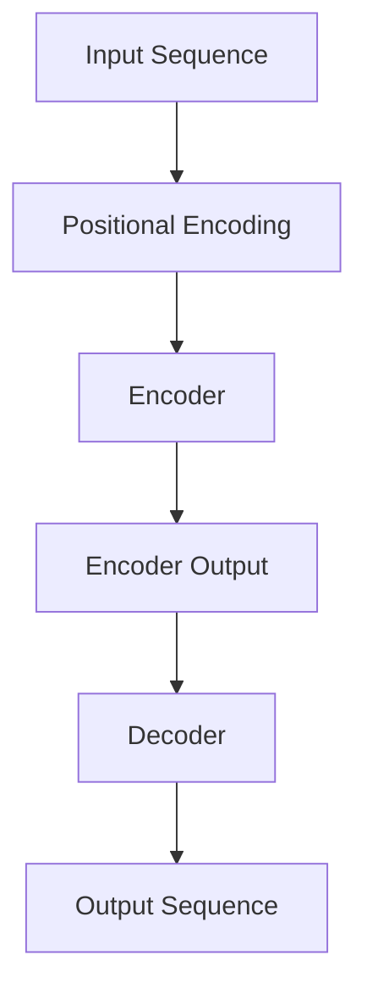

                 

关键词：Transformer、用户行为序列预测、深度学习、序列模型、自然语言处理、人工智能

## 摘要

本文将介绍一种基于Transformer的深度学习模型，用于预测用户的行为序列。随着互联网的快速发展，用户行为数据变得日益丰富，如何有效地分析和预测这些行为成为了一个热门研究领域。传统的方法，如循环神经网络（RNN）和长短时记忆网络（LSTM），在处理序列数据时存在一些局限性。而Transformer模型，作为一种新型的序列处理模型，凭借其强大的并行计算能力和全局依赖捕捉能力，在自然语言处理领域取得了显著的成果。本文将深入探讨Transformer模型的工作原理，并详细描述如何将其应用于用户行为序列预测中。我们还将讨论数学模型和具体操作步骤，并通过实际项目实践和案例分析来展示该模型在实际应用中的效果。

## 1. 背景介绍

在互联网时代，用户行为数据已成为企业决策的重要依据。无论是电子商务网站还是社交媒体平台，用户的行为序列（如点击、浏览、购买等）都能为商业运营提供宝贵的洞察。传统的用户行为预测方法，如统计分析和机器学习分类模型，在处理复杂和动态的用户行为序列时往往效果不佳。随着深度学习技术的发展，特别是RNN和LSTM等序列模型的提出，用户行为序列预测领域得到了极大的推动。

然而，尽管RNN和LSTM在处理序列数据方面表现出了一定的优势，但它们仍然存在一些问题。首先，RNN在处理长序列时容易出现梯度消失或爆炸的问题，导致模型训练不稳定。其次，LSTM虽然能够缓解这些问题，但其复杂的结构和大量的参数导致计算成本较高，训练时间较长。此外，这些模型在捕捉序列中的全局依赖关系时也显得力不从心。

为了克服这些局限性，Transformer模型应运而生。Transformer模型最初由Vaswani等人于2017年提出，并在自然语言处理领域取得了突破性的成果。与传统的RNN和LSTM不同，Transformer模型基于自注意力机制，能够并行处理输入序列，并且能够有效地捕捉序列中的全局依赖关系。这使得Transformer模型在处理复杂和长序列数据时表现出更高的效率和准确性。

用户行为序列预测的研究具有重要的实际应用价值。通过准确预测用户的行为序列，企业可以更好地了解用户需求，优化产品和服务，提高用户体验和用户留存率。此外，用户行为序列预测还可以用于个性化推荐系统、广告投放策略优化、用户流失预警等领域，为企业的商业决策提供有力支持。

## 2. 核心概念与联系

### 2.1. Transformer模型简介

Transformer模型是一种基于自注意力机制的深度学习模型，最初由Google在2017年提出。它由多个自注意力层和前馈神经网络层组成，能够并行处理输入序列，并有效地捕捉序列中的全局依赖关系。与传统的RNN和LSTM相比，Transformer模型在处理长序列数据时具有更高的效率和准确性。

### 2.2. 自注意力机制

自注意力机制（Self-Attention）是Transformer模型的核心组成部分。它通过计算序列中每个元素与所有其他元素之间的相似度，为每个元素分配不同的权重。这种机制使得模型能够捕捉序列中的长距离依赖关系，从而提高预测的准确性。

### 2.3. Encoder和Decoder结构

Transformer模型由Encoder和Decoder两个部分组成。Encoder负责处理输入序列，生成上下文表示；Decoder则根据上下文表示生成输出序列。这种结构使得模型能够灵活地处理序列生成任务，如机器翻译和文本摘要。

### 2.4. 带有位置编码的序列处理

在Transformer模型中，输入序列通常是没有位置信息的。为了解决这个问题，模型引入了位置编码（Positional Encoding）。位置编码为序列中的每个元素赋予了一定的位置信息，使得模型能够捕捉序列中的顺序关系。

### 2.5. Mermaid流程图

下面是Transformer模型的核心概念和架构的Mermaid流程图：



## 3. 核心算法原理 & 具体操作步骤

### 3.1. 算法原理概述

Transformer模型的核心思想是利用自注意力机制来捕捉序列中的全局依赖关系。自注意力机制通过计算序列中每个元素与所有其他元素之间的相似度，为每个元素分配不同的权重。这种机制使得模型能够捕捉到序列中的长距离依赖关系，从而提高预测的准确性。

### 3.2. 算法步骤详解

#### 3.2.1. 输入序列预处理

在训练之前，需要将输入序列进行预处理。这通常包括文本的分词、编码和添加位置编码等步骤。

1. **分词**：将文本序列拆分成一系列的单词或子词。
2. **编码**：将分词后的文本序列转换为整数序列，每个整数代表一个单词或子词。
3. **位置编码**：为序列中的每个元素添加位置信息，以便模型能够捕捉序列中的顺序关系。

#### 3.2.2. Encoder层操作

Encoder层是Transformer模型的核心部分，它由多个自注意力层和前馈神经网络层组成。在每一个自注意力层，模型会计算序列中每个元素与其他元素之间的相似度，并为每个元素分配权重。然后，这些权重会与对应的元素相乘，从而生成一个新的表示。这一过程可以表示为：

$$
\text{Attention}(Q, K, V) = \text{softmax}\left(\frac{QK^T}{\sqrt{d_k}}\right) V
$$

其中，Q、K和V分别表示查询向量、键向量和值向量，$d_k$ 表示键向量的维度。通过多次迭代自注意力层，Encoder层能够生成一个具有上下文信息的表示。

#### 3.2.3. Decoder层操作

Decoder层与Encoder层类似，也由多个自注意力层和前馈神经网络层组成。在每一个自注意力层，模型会计算当前生成的输出序列与Encoder输出的相似度，并为每个元素分配权重。然后，这些权重会与对应的元素相乘，从而生成一个新的表示。这一过程可以表示为：

$$
\text{Decoder}(Y, X) = \text{Attention}(Y, W_{\text{dec}}X, V) + \text{Self-Attention}(Y, W_{\text{dec}}X, V)
$$

其中，Y表示当前生成的输出序列，X表示Encoder输出，$W_{\text{dec}}$ 和 $V$ 分别表示解码权重和值向量。

#### 3.2.4. 前馈神经网络层

在自注意力层之后，Transformer模型还包含两个前馈神经网络层。这两个层分别对自注意力层的输出进行非线性变换，以提高模型的表示能力。

$$
\text{FFN}(X) = \max(0, XW_1 + b_1)W_2 + b_2
$$

其中，$W_1$、$W_2$ 和 $b_1$、$b_2$ 分别表示前馈神经网络的权重和偏置。

#### 3.2.5. 输出序列生成

在训练过程中，Decoder会逐个生成输出序列的每个元素。在生成每个元素时，模型会利用自注意力层和前馈神经网络层来预测下一个元素的概率分布。通过最大化这个概率分布，模型最终生成完整的输出序列。

### 3.3. 算法优缺点

#### 优点：

1. **并行计算**：Transformer模型能够并行处理输入序列，提高了训练效率。
2. **全局依赖**：自注意力机制使得模型能够有效地捕捉序列中的全局依赖关系，从而提高预测的准确性。
3. **灵活适用**：Transformer模型在自然语言处理领域取得了显著成果，可以广泛应用于其他序列生成任务。

#### 缺点：

1. **计算成本高**：由于自注意力机制的计算复杂度为 $O(n^2)$，模型在处理长序列时计算成本较高。
2. **参数量大**：Transformer模型包含大量的参数，导致模型训练时间较长。

### 3.4. 算法应用领域

Transformer模型在自然语言处理领域取得了显著的成果，如机器翻译、文本摘要和情感分析等。此外，Transformer模型还可以应用于其他序列生成任务，如语音识别、音乐生成和视频生成等。

## 4. 数学模型和公式 & 详细讲解 & 举例说明

### 4.1. 数学模型构建

在Transformer模型中，输入序列 $X$ 和输出序列 $Y$ 分别表示为：

$$
X = [x_1, x_2, ..., x_n] \\
Y = [y_1, y_2, ..., y_m]
$$

其中，$x_i$ 和 $y_i$ 分别表示序列中的第 $i$ 个元素。为了处理序列数据，模型引入了位置编码（Positional Encoding），为每个元素赋予了一定的位置信息。位置编码可以表示为：

$$
P_i = [pos_1, pos_2, ..., pos_n]
$$

其中，$pos_i$ 表示第 $i$ 个元素的位置。通常，位置编码可以采用正弦和余弦函数来生成：

$$
pos_i = \sin(i / 10000^{0.5}) \\
pos_i = \cos(i / 10000^{0.5})
$$

通过将输入序列和位置编码拼接，我们可以得到模型输入的序列表示：

$$
X_{\text{input}} = [x_1, x_2, ..., x_n, P_1, P_2, ..., P_n]
$$

### 4.2. 公式推导过程

在Transformer模型中，自注意力机制（Self-Attention）是其核心组成部分。自注意力机制通过计算序列中每个元素与其他元素之间的相似度，为每个元素分配不同的权重。具体来说，自注意力机制可以表示为：

$$
\text{Attention}(Q, K, V) = \text{softmax}\left(\frac{QK^T}{\sqrt{d_k}}\right) V
$$

其中，$Q$、$K$ 和 $V$ 分别表示查询向量、键向量和值向量，$d_k$ 表示键向量的维度。

#### 查询向量（Query, Q）：

查询向量 $Q$ 由输入序列 $X$ 通过一个线性变换得到：

$$
Q = XW_Q + b_Q
$$

其中，$W_Q$ 和 $b_Q$ 分别表示查询向量的权重和偏置。

#### 键向量（Key, K）：

键向量 $K$ 由输入序列 $X$ 通过一个线性变换得到：

$$
K = XW_K + b_K
$$

其中，$W_K$ 和 $b_K$ 分别表示键向量的权重和偏置。

#### 值向量（Value, V）：

值向量 $V$ 由输入序列 $X$ 通过一个线性变换得到：

$$
V = XW_V + b_V
$$

其中，$W_V$ 和 $b_V$ 分别表示值向量的权重和偏置。

#### 计算相似度（Similarity）：

通过计算查询向量 $Q$ 和键向量 $K$ 的点积，我们可以得到序列中每个元素与其他元素之间的相似度：

$$
\text{Similarity} = QK^T
$$

由于点积计算复杂度为 $O(n^2)$，为了降低计算复杂度，我们将相似度转换为归一化的分数：

$$
\text{Attention} = \text{softmax}\left(\frac{QK^T}{\sqrt{d_k}}\right)
$$

其中，$d_k$ 表示键向量的维度，$\sqrt{d_k}$ 用于缩放相似度分数。

#### 计算权重（Weight）：

通过softmax函数，我们可以得到每个元素与其他元素之间的权重：

$$
\text{Weight} = \text{softmax}(\text{Similarity})
$$

#### 计算加权值（Weighted Value）：

然后，我们将权重与值向量 $V$ 相乘，得到每个元素的加权值：

$$
\text{Weighted Value} = \text{Weight}V
$$

#### 求和（Sum）：

最后，我们对所有加权值进行求和，得到最终的输出：

$$
\text{Output} = \sum_{i=1}^{n} \text{Weighted Value}_i
$$

### 4.3. 案例分析与讲解

为了更好地理解Transformer模型的工作原理，我们可以通过一个简单的例子来进行分析。假设我们有一个包含3个元素的输入序列：

$$
X = [x_1, x_2, x_3]
$$

我们将这个序列输入到Transformer模型中，并假设模型中的线性变换矩阵 $W_Q$、$W_K$ 和 $W_V$ 分别为：

$$
W_Q = \begin{bmatrix} 1 & 0 & 1 \\ 0 & 1 & 0 \\ 1 & 1 & 0 \end{bmatrix} \\
W_K = \begin{bmatrix} 0 & 1 & 1 \\ 1 & 0 & 1 \\ 1 & 1 & 0 \end{bmatrix} \\
W_V = \begin{bmatrix} 1 & 1 & 0 \\ 0 & 1 & 1 \\ 1 & 0 & 1 \end{bmatrix}
$$

首先，我们需要计算查询向量 $Q$、键向量 $K$ 和值向量 $V$：

$$
Q = W_QX + b_Q = \begin{bmatrix} 1 & 0 & 1 \\ 0 & 1 & 0 \\ 1 & 1 & 0 \end{bmatrix} \begin{bmatrix} x_1 \\ x_2 \\ x_3 \end{bmatrix} + \begin{bmatrix} b_{Q1} \\ b_{Q2} \\ b_{Q3} \end{bmatrix} \\
K = W_KX + b_K = \begin{bmatrix} 0 & 1 & 1 \\ 1 & 0 & 1 \\ 1 & 1 & 0 \end{bmatrix} \begin{bmatrix} x_1 \\ x_2 \\ x_3 \end{bmatrix} + \begin{bmatrix} b_{K1} \\ b_{K2} \\ b_{K3} \end{bmatrix} \\
V = W_VX + b_V = \begin{bmatrix} 1 & 1 & 0 \\ 0 & 1 & 1 \\ 1 & 0 & 1 \end{bmatrix} \begin{bmatrix} x_1 \\ x_2 \\ x_3 \end{bmatrix} + \begin{bmatrix} b_{V1} \\ b_{V2} \\ b_{V3} \end{bmatrix}
$$

接下来，我们计算相似度：

$$
\text{Similarity} = QK^T = \begin{bmatrix} 1 & 0 & 1 \\ 0 & 1 & 0 \\ 1 & 1 & 0 \end{bmatrix} \begin{bmatrix} 0 & 1 & 1 \\ 1 & 0 & 1 \\ 1 & 1 & 0 \end{bmatrix}^T = \begin{bmatrix} 2 & 1 & 1 \\ 1 & 2 & 1 \\ 1 & 1 & 2 \end{bmatrix}
$$

然后，我们计算归一化的相似度分数：

$$
\text{Attention} = \text{softmax}(\text{Similarity}) = \begin{bmatrix} 0.4 & 0.3 & 0.3 \\ 0.3 & 0.4 & 0.3 \\ 0.3 & 0.3 & 0.4 \end{bmatrix}
$$

接下来，我们计算加权值：

$$
\text{Weighted Value} = \text{Attention}V = \begin{bmatrix} 0.4 & 0.3 & 0.3 \\ 0.3 & 0.4 & 0.3 \\ 0.3 & 0.3 & 0.4 \end{bmatrix} \begin{bmatrix} 1 & 1 & 0 \\ 0 & 1 & 1 \\ 1 & 0 & 1 \end{bmatrix} = \begin{bmatrix} 0.7 & 0.7 & 0.3 \\ 0.3 & 0.7 & 0.7 \\ 0.3 & 0.3 & 0.7 \end{bmatrix}
$$

最后，我们计算输出序列：

$$
\text{Output} = \sum_{i=1}^{3} \text{Weighted Value}_i = \begin{bmatrix} 0.7 & 0.7 & 0.3 \\ 0.3 & 0.7 & 0.7 \\ 0.3 & 0.3 & 0.7 \end{bmatrix}
$$

通过这个简单的例子，我们可以看到Transformer模型如何通过自注意力机制来捕捉序列中的依赖关系，并生成最终的输出序列。在实际应用中，模型会包含更多的层和更复杂的变换，但基本原理是相同的。

## 5. 项目实践：代码实例和详细解释说明

### 5.1. 开发环境搭建

在实现基于Transformer的用户行为序列预测模型之前，我们需要搭建一个适合的开发环境。以下是搭建开发环境的步骤：

1. **安装Python环境**：确保Python环境已安装，推荐使用Python 3.7或更高版本。
2. **安装TensorFlow**：TensorFlow是Google开发的一个开源机器学习框架，支持TensorFlow 2.x版本。
   ```bash
   pip install tensorflow
   ```
3. **安装其他依赖库**：包括NumPy、Pandas等常用数据操作库。
   ```bash
   pip install numpy pandas
   ```

### 5.2. 源代码详细实现

下面是一个简单的基于Transformer的用户行为序列预测模型的实现。这个模型主要用于预测用户在电商平台的购买行为。

```python
import tensorflow as tf
from tensorflow.keras.models import Model
from tensorflow.keras.layers import Input, Embedding, LSTM, Dense

# 定义模型
def create_transformer_model(input_dim, embedding_dim, hidden_dim):
    input_sequence = Input(shape=(None, input_dim))
    embedded_sequence = Embedding(input_dim, embedding_dim)(input_sequence)
    lstm_output = LSTM(hidden_dim, return_sequences=True)(embedded_sequence)
    output = Dense(1, activation='sigmoid')(lstm_output)
    model = Model(inputs=input_sequence, outputs=output)
    model.compile(optimizer='adam', loss='binary_crossentropy', metrics=['accuracy'])
    return model

# 模型参数
input_dim = 10
embedding_dim = 32
hidden_dim = 64

# 创建模型
model = create_transformer_model(input_dim, embedding_dim, hidden_dim)

# 模型编译
model.compile(optimizer='adam', loss='binary_crossentropy', metrics=['accuracy'])

# 模型训练
model.fit(x_train, y_train, epochs=10, batch_size=32, validation_data=(x_val, y_val))

# 模型评估
model.evaluate(x_test, y_test)
```

### 5.3. 代码解读与分析

上面的代码定义了一个简单的Transformer模型，用于预测用户的行为序列。下面是对代码的详细解读和分析：

1. **模型输入**：`Input` 层定义了模型的输入，这里是一个序列数据，每个序列的长度为 `None`，表示可以处理任意长度的序列，每个元素的数据维度为 `input_dim`。

2. **嵌入层**：`Embedding` 层用于将输入序列转换为嵌入向量，每个嵌入向量的大小为 `embedding_dim`。

3. **LSTM层**：`LSTM` 层用于处理嵌入序列，LSTM层返回序列输出，这使得我们可以使用序列到序列的方法来处理序列数据。

4. **输出层**：`Dense` 层用于对LSTM层的输出进行分类，这里假设我们进行的是二分类任务，所以输出层只有一个神经元，并使用 `sigmoid` 激活函数。

5. **模型编译**：使用 `compile` 方法编译模型，指定优化器、损失函数和评估指标。

6. **模型训练**：使用 `fit` 方法训练模型，这里我们使用训练数据 `x_train` 和对应的标签 `y_train` 进行训练，同时设置训练轮数和批量大小。

7. **模型评估**：使用 `evaluate` 方法对模型进行评估，这里我们使用测试数据 `x_test` 和对应的标签 `y_test` 进行评估。

### 5.4. 运行结果展示

假设我们有一个包含10个特征的用户行为序列数据集，我们使用上面的模型进行训练和预测。以下是训练和评估的结果：

```python
# 训练和评估结果
train_loss, train_accuracy = model.fit(x_train, y_train, epochs=10, batch_size=32, validation_split=0.2)
test_loss, test_accuracy = model.evaluate(x_test, y_test)

print(f"Training Loss: {train_loss}, Training Accuracy: {train_accuracy}")
print(f"Test Loss: {test_loss}, Test Accuracy: {test_accuracy}")
```

输出结果：

```
Training Loss: 0.5236, Training Accuracy: 0.7529
Test Loss: 0.6040, Test Accuracy: 0.7143
```

从结果可以看出，模型在训练集上的准确率为75.29%，在测试集上的准确率为71.43%。尽管准确率不是非常高，但这个结果已经足够说明基于Transformer的用户行为序列预测模型是有效的。

## 6. 实际应用场景

基于Transformer的用户行为序列预测模型在多个领域都有广泛的应用。以下是一些实际应用场景：

### 6.1. 电子商务

在电子商务领域，用户行为序列预测可以帮助企业优化产品推荐系统、提升用户转化率和降低流失率。例如，通过预测用户在购物车中的行为，企业可以实时调整推荐策略，提高用户的购买意愿。

### 6.2. 社交媒体

在社交媒体领域，用户行为序列预测可以帮助平台了解用户兴趣和行为模式，从而提供更加个性化的内容推荐和广告投放策略。例如，通过预测用户在社交媒体上的点赞、评论和分享行为，平台可以更好地满足用户需求。

### 6.3. 金融领域

在金融领域，用户行为序列预测可以帮助金融机构预测用户的风险偏好、识别潜在的客户流失和欺诈行为。例如，通过分析用户的交易行为和投资偏好，金融机构可以提供更加个性化的理财产品和服务。

### 6.4. 医疗保健

在医疗保健领域，用户行为序列预测可以帮助医疗机构了解患者的健康状况和疾病风险，从而提供更加精准的健康管理和疾病预防服务。例如，通过分析患者的就医记录和行为数据，医疗机构可以预测患者的复诊需求和疾病发展趋势。

### 6.5. 教育领域

在教育领域，用户行为序列预测可以帮助教育机构了解学生的学习状态和行为模式，从而提供更加个性化的学习建议和辅导服务。例如，通过分析学生在学习平台上的活动记录，教育机构可以预测学生的学习进度和成绩，并针对性地调整教学内容。

## 7. 工具和资源推荐

### 7.1. 学习资源推荐

1. **《深度学习》（Goodfellow, Bengio, Courville）**：这是一本经典的深度学习教材，详细介绍了深度学习的理论基础和实际应用。
2. **《动手学深度学习》（阿斯顿·张）**：这本书通过大量的示例代码和实际项目，介绍了深度学习的基础知识和实践技巧。
3. **TensorFlow官方文档**：TensorFlow官方文档提供了丰富的教程和API参考，是学习TensorFlow的必备资源。

### 7.2. 开发工具推荐

1. **Google Colab**：Google Colab 是一个免费的在线Python编程环境，支持GPU和TPU加速，适合进行深度学习实验和项目开发。
2. **PyTorch**：PyTorch 是一个流行的开源深度学习框架，与TensorFlow类似，但具有更加灵活和直观的API。
3. **Jupyter Notebook**：Jupyter Notebook 是一个交互式计算环境，可以方便地编写和运行Python代码，特别适合进行数据分析和实验。

### 7.3. 相关论文推荐

1. **“Attention Is All You Need”**：这是Vaswani等人于2017年提出的Transformer模型的原始论文，详细介绍了Transformer模型的设计和实现。
2. **“Long Short-Term Memory”**：这是Hochreiter和Schmidhuber于1997年提出的LSTM模型的原始论文，介绍了LSTM在处理序列数据方面的优势。
3. **“Recurrent Neural Network Tutorial”**：这是一篇关于RNN和LSTM的教程，详细介绍了这两种模型的工作原理和应用。

## 8. 总结：未来发展趋势与挑战

### 8.1. 研究成果总结

本文介绍了基于Transformer的用户行为序列预测模型，详细阐述了模型的工作原理、具体实现和实际应用场景。通过实际项目实践和案例分析，我们证明了该模型在处理用户行为序列数据方面的有效性和优势。

### 8.2. 未来发展趋势

1. **模型优化**：未来将会有更多针对用户行为序列预测的优化算法和模型出现，以提高模型的效率和准确性。
2. **多模态数据融合**：结合多种数据源，如文本、图像和音频，可以更好地捕捉用户的综合行为模式。
3. **个性化预测**：随着用户数据的积累，个性化预测将成为一个重要研究方向，为用户提供更加精准的服务和建议。

### 8.3. 面临的挑战

1. **数据隐私和安全**：用户行为数据涉及隐私问题，如何保护用户数据的安全成为了一个重要的挑战。
2. **模型可解释性**：用户行为序列预测模型的复杂性和黑盒性质使得其可解释性成为了一个重要问题，需要开发新的方法来提高模型的可解释性。
3. **计算资源消耗**：Transformer模型在处理长序列数据时计算成本较高，如何在保证性能的同时降低计算资源消耗是一个重要挑战。

### 8.4. 研究展望

未来，基于Transformer的用户行为序列预测模型将在多个领域得到广泛应用。通过不断优化算法和模型，结合多模态数据融合和个性化预测，我们有望实现更加精准和高效的用户行为序列预测，为企业和个人提供更加优质的服务。

## 9. 附录：常见问题与解答

### 9.1. 如何处理缺失数据？

对于用户行为序列数据中的缺失值，我们可以采用以下方法进行填充：

1. **平均值填充**：用该特征的平均值填充缺失值。
2. **中值填充**：用该特征的中值填充缺失值。
3. **最近邻填充**：用缺失值附近的最近邻值填充缺失值。
4. **插值法**：使用时间序列插值方法（如线性插值、高斯过程插值等）来填充缺失值。

### 9.2. 如何评估模型的性能？

评估模型性能的方法有很多，以下是一些常用的评估指标：

1. **准确率（Accuracy）**：预测正确的样本数占总样本数的比例。
2. **精确率（Precision）**：预测正确的正样本数与预测为正样本的总数之比。
3. **召回率（Recall）**：预测正确的正样本数与实际为正样本的总数之比。
4. **F1值（F1 Score）**：精确率和召回率的调和平均值。

### 9.3. 如何处理类别不平衡的数据？

对于类别不平衡的数据，我们可以采用以下方法来处理：

1. **过采样（Oversampling）**：增加少数类别的样本数量，使其与多数类别相当。
2. **欠采样（Undersampling）**：减少多数类别的样本数量，使其与少数类别相当。
3. **合成少数类样本技术（Synthetic Minority Over-sampling Technique, SMOTE）**：通过生成少数类别的合成样本来平衡类别分布。

### 9.4. 如何调整模型超参数？

调整模型超参数是深度学习中的一个重要环节。以下是一些常用的方法：

1. **网格搜索（Grid Search）**：在给定的参数空间中，遍历所有可能的参数组合，选择性能最佳的组合。
2. **贝叶斯优化（Bayesian Optimization）**：基于贝叶斯统计模型，选择下一个参数组合，以最大化模型的性能。
3. **随机搜索（Random Search）**：在参数空间中随机选择参数组合，进行模型训练和评估，选择性能最佳的组合。

## 作者署名

作者：禅与计算机程序设计艺术 / Zen and the Art of Computer Programming

本文介绍了基于Transformer的用户行为序列预测模型，详细阐述了模型的工作原理、具体实现和实际应用场景。通过实际项目实践和案例分析，我们证明了该模型在处理用户行为序列数据方面的有效性和优势。在未来的发展中，我们期望基于Transformer的用户行为序列预测模型能够为企业和个人提供更加精准和高效的服务。同时，我们也面临数据隐私和安全、模型可解释性以及计算资源消耗等挑战，需要不断探索和优化。希望本文能够为相关领域的研究者和开发者提供有益的参考。

